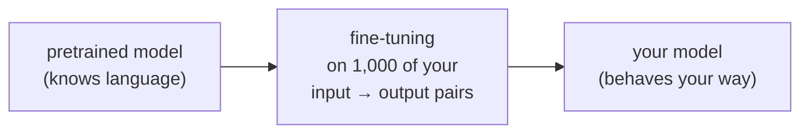
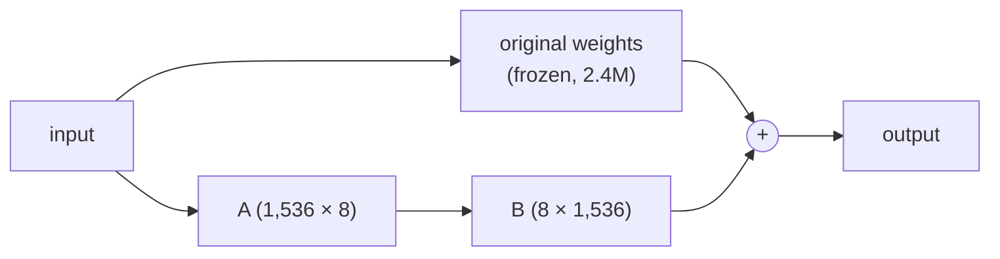

# 14.12 Fine-tuning: when and how

Sooner or later, someone on your team will say: "The model doesn't quite get our use case. Should we fine-tune it?" It sounds like the serious engineering answer: take a model, train it on your own data, and get a model that's *yours*. Sometimes it is. More often it's an expensive way to solve a problem that a better prompt, a few examples or retrieval would have solved in an afternoon, and it creates a new thing to maintain forever.

In this chapter you'll learn what fine-tuning actually changes inside a model, what it's good at and what it's bad at, and the ladder of cheaper options to climb first. Then you'll run a real experiment on this handbook: a language model with a prompt against a small model trained on your own labelled examples, on the same held-out test set.

## What you'll learn

- What **fine-tuning** is, and what it changes: **behaviour**, not reliable **knowledge**.
- The **ladder**: prompting, examples, RAG, a small trained model, then fine-tuning.
- **Full fine-tuning** versus **LoRA**, and why LoRA made fine-tuning cheap.
- Why the **data** is the real work: quality, quantity, splits and leakage.
- The hidden costs: **catastrophic forgetting**, maintenance, privacy and licences.
- How to decide, with numbers from an experiment you can rerun.

---

## Fine-tuning is more training, on your examples

:::note[Everyday anchor]
A chef who trained for years at culinary school joins your restaurant. You don't teach them to cook: you show them your menu, your plating, your portion sizes, twenty times each, until they do it your way without thinking. They can still cook everything they could before. But if all you ever show them is your menu, they may start to forget the dishes they never make any more.
:::

Chapter 14.3 described how a chat model is made: **pretraining** on an enormous amount of text (where the knowledge and fluency come from), then **instruction tuning** and **preference training** on example conversations (where the helpful-assistant behaviour comes from). **Fine-tuning** is the same kind of training, continued on a much smaller dataset of *your* examples: inputs paired with the outputs you want. Gradient descent (chapter 14.2) nudges the model's weights so that, given inputs like yours, it produces outputs like yours.



What does it change well?

- **Format and style.** Always answer in your JSON shape, your tone, your length, without long instructions in every prompt.
- **A narrow, repeated task.** Classify support tickets into your 30 categories; extract the fields from your invoices.
- **Making a small model good enough** at one task that previously needed a big one, which cuts cost and latency (chapter 14.11).

What does it change badly?

- **Knowledge.** Fine-tuning on your documentation does *not* reliably teach the model your documentation. It learns the style of the answers, and it may learn some facts, unevenly, and it will then state them with the same confidence as the facts it doesn't have. For "answer from our documents", use **RAG** (chapter 14.8): the facts arrive fresh in the prompt, can be updated in seconds, and can be cited.
- **Anything that changes.** A fine-tuned model is frozen at the moment of training. New products, new prices, new policies mean training again.

:::warning[What can go wrong]
The classic failure: a team fine-tunes a model on their help-centre articles, hoping it will "know the product". It learns to *sound* like the help centre, perfectly: confident, friendly, on-brand. And it confidently invents features and settings that don't exist, in exactly the right tone, which makes the mistakes harder to spot than a generic model's would be. Style is easy to learn; facts are not.
:::

---

## The ladder: cheapest first

Before fine-tuning, climb the ladder, and stop at the first step that passes your evals (chapter 14.10):

| Step | Effort | What it fixes |
|---|---|---|
| 1. A better prompt (chapter 14.5) | Hours | Unclear instructions, missing context, wrong format |
| 2. Examples in the prompt (few-shot) | Hours | Style and format that are easier to show than describe |
| 3. Structured output (chapter 14.6) | Hours | Output that code must parse |
| 4. RAG (chapter 14.8) | Days | Missing or changing knowledge |
| 5. A bigger model | Minutes (and money) | Reasoning the small model can't do |
| 6. A small model trained on your data | Days | A narrow classification or scoring task with plenty of labels |
| 7. Fine-tuning a language model | Days to weeks | Behaviour you can't get by prompting, or a small model that must match a big one on one task |

Two things about that list. Step 5 comes *before* the training steps: trying a more capable model costs almost nothing, and if it passes, you can decide later whether a cheaper model trained on its outputs is worth the effort. And step 6 is easy to forget. Plenty of "AI" tasks are classification: which category, which team, spam or not. For those, the tools of chapter 14.2 (a small model trained on labelled examples) are often faster, cheaper and more accurate than any language model, as the experiment below shows.

---

## How fine-tuning works: full, or LoRA

**Full fine-tuning** updates every weight in the model. For a 1.5B-parameter model that means training 1.5 billion numbers, which needs several times the memory of just running the model (the training process keeps extra numbers for every weight), a GPU, and a new copy of the whole model for every fine-tuned version.

**LoRA** (**low-rank adaptation**) is the trick that made fine-tuning cheap. It **freezes** the original weights and trains a small correction next to some of them. A weight matrix in `qwen2.5:1.5b` is 1,536 × 1,536 numbers, about 2.4 million. LoRA represents the change to it as the product of two thin matrices, 1,536 × 8 and 8 × 1,536: 24,576 numbers, **about 1%**. The "8" is the **rank**, a setting you choose: higher means more capacity to learn, and more to train.



What that buys you:

- **Much less memory to train**, so a mid-sized model can be fine-tuned on one GPU. **QLoRA** goes further: the frozen base model is loaded quantized to 4 bits (chapter 14.11), and only the small LoRA matrices are trained at full precision.
- **Tiny results.** The trained **adapter** is a few megabytes, not gigabytes. You can keep one base model and swap adapters per task or per customer; some serving engines load many adapters on one base model at once.
- **Less forgetting.** The original weights never change, so the model keeps more of what it knew.

The other route is a **hosted fine-tuning API**: several model providers let you upload a dataset of examples and get back a private fine-tuned model, billed for training and usually at a higher price per token to use. No GPUs to manage, but your training data goes to the provider, and the model only exists on their platform.

**Distillation** is a common use of all this: generate thousands of outputs with a large, expensive model, check them, and fine-tune a small model on them, so the small one does that one task nearly as well, much more cheaply. Check the large model's terms of use first: some forbid using its outputs to train other models.

---

## The data is the real work

Every fine-tuning project is really a data project. What good training data looks like:

- **Pairs of input and ideal output**, in the exact format you'll use in production: the same system prompt, the same kind of inputs.
- **Hundreds to a few thousand examples** for most tasks with LoRA. Quality beats quantity: 500 carefully checked examples usually beat 5,000 scraped ones, because the model learns the mistakes too.
- **Coverage of the hard cases**: the ambiguous tickets, the unusual invoices, the inputs where the answer should be "I don't know". A dataset of only easy cases teaches a model that's only good at easy cases.
- **A held-out test set**, split so it's genuinely unseen. That's harder than it sounds, as the experiment below shows.

And the risks that come with the data:

- **Memorisation.** Models can reproduce training examples word for word. If your examples contain customer data, personal information or secrets, the fine-tuned model can leak them to anyone who asks the right question. Clean the data first (chapter 7.6's rules about secrets apply to training data too).
- **Catastrophic forgetting.** Train too hard on a narrow task and the model gets worse at everything else, including following instructions and refusing harmful requests. Evaluate general behaviour too, not just the new task.
- **Maintenance.** When the base model gets a new version, your fine-tune doesn't come along. Every upgrade means training and evaluating again, so the data and the training script must be kept like code.
- **Licences.** Open-weights models come with licences that differ in what they allow commercially and in what you must pass on. Read the one for the model you fine-tune.

---

## An experiment: prompting versus training on your own labels

Here's a task with free labels. Given a passage from this handbook, **which part is it from?** "Kubernetes", "Security", "Data" and so on: 15 parts. It has the same shape as a common real task, routing a support ticket to the right team, and the handbook's folders provide 900 correctly labelled examples.

snipai's `finetune.py` compares two approaches on the same test passages:

1. **A zero-shot prompt.** `qwen2.5:1.5b` gets the list of parts and the passage, and answers with structured output (chapter 14.6) restricted to the 15 part names.
2. **A trained head.** The embedding model from chapter 14.7 turns every passage into a vector. The embedding model is **frozen** (not changed at all); on top of it, we train a small **softmax regression**, chapter 14.2's logistic regression extended to many classes, using the training passages' labels:

```python
def fit(self, x: Floats, y: Ints, classes: int) -> SoftmaxRegression:
    self.mean, self.std = x.mean(axis=0), x.std(axis=0) + 1e-8
    x = (x - self.mean) / self.std
    n, d = x.shape
    onehot = np.eye(classes)[y]
    self.weights, self.bias = np.zeros((d, classes)), np.zeros(classes)
    for _ in range(self.epochs):
        error = self._proba(x) - onehot  # how wrong each probability is
        self.weights -= self.learning_rate * (x.T @ error / n + self.l2 * self.weights)
        self.bias -= self.learning_rate * error.mean(axis=0)
    return self
```

Training a small model on top of a frozen, pretrained one is the simplest form of fine-tuning, often called a **linear probe**. It takes under a second, runs on any laptop, and needs no GPU.

Two details decide whether the result means anything:

- **Only the passage text goes in.** Every chunk's heading contains the chapter number ("10.5 Operating & debugging Kubernetes"), which gives the answer away. Leaving it in would test whether the model can read a number.
- **The test set is whole chapters.** A quarter of each part's chapters are held out entirely. Passages from one chapter share vocabulary, examples and cross-references, so if some passages of a chapter were in training and others in testing, the test would partly measure memory. That's **leakage** (chapter 14.2), and the lab measures exactly how much it would flatter the score.

CI runs it with `all-minilm` for the embeddings and `qwen2.5:1.5b` for the prompt, at temperature 0, on a CPU-only machine:

```text
906 passages, 15 parts; train 631, test 275
test chapters: 25 of 85
embedder: all-minilm

always guess the biggest part (ai): 17%
trained head: test 61% (train 100%)
  embedding 906 passages: 20.3s, training: 0.2s
  most common mistakes (true -> predicted):
    distributed -> observability: 7
    foundations -> apis: 6
    observability -> distributed: 6
    containers -> shipping: 5
    linux -> observability: 5
  the same head, tested on randomly held-out passages instead: 83%

learning curve (trained head, test accuracy):
    63 examples: 43%
   157 examples: 53%
   315 examples: 61%
   631 examples: 61%

zero-shot prompt on 45 test passages (ollama/qwen2.5:1.5b):
  prompt:       31%  (1.42s each)
  trained head: 69%  (same passages)
  the prompt's wrong answers, by what it said: {'security': 9, 'linux': 8, 'git': 5, 'apis': 2, 'shipping': 2}
```

What to notice:

- **The small trained model beat the language model by a wide margin**: 69% against 31% on the same 45 passages, and 61% on all 275 test passages, against 17% for always guessing the biggest part. An earlier CI run, before four more chapters were published, told the same story: 56% against 36%.
- **It's also much cheaper and faster.** Embedding every passage took 20 seconds in total, about 20 milliseconds each, and training took a fifth of a second. The prompt took 1.4 seconds per passage (3.2 in the earlier run), with a model about 20 times bigger in memory (986 MB against `all-minilm`'s 45 MB).
- **The prompt's mistakes are lopsided.** Most of its wrong answers were "security" or "linux": with only 15 part titles to go on, the model has no idea what this handbook puts where, and falls back on a few favourites. The trained head learned where things go from 631 examples.
- **The head's mistakes are reasonable.** Distributed systems and observability overlap, and so do foundations and APIs; a person placing those passages would hesitate too. Looking at *which* mistakes a model makes tells you whether it's broken or the task is genuinely ambiguous.
- **The leaky split would have lied by 22 points.** Tested on randomly held-out passages, the same head scores 83%. That's the number a hurried team would have reported, and it measures memory of neighbouring passages, not the ability to place new material.
- **More data stopped helping.** Doubling from 315 to 631 examples gained nothing. The limit is now the frozen embeddings themselves, not the amount of data. The next step up the ladder would be fine-tuning the embedding model, or a language model with LoRA, on this task, and a capable hosted model with a better prompt might do well without any training. We haven't measured either, so they're experiments for you, not results.

And a caution about the numbers themselves: 275 test passages from 25 chapters is a small test set, and the same head scored 54% in the earlier run, on a slightly different corpus. Chapter 14.10's confidence intervals apply here too.

:::info[Honesty label]
**Exists today:** the experiment above, run in CI on every push with a real embedding model and a 1.5B language model, plus an offline version. **Not built:** a LoRA fine-tune of a language model. It needs a GPU (or a lot of patience on a CPU) and a training library, which is beyond a free, local lab. The LoRA arithmetic above is computed from `qwen2.5:1.5b`'s published dimensions, not measured.
:::

---

## Deciding: a checklist

Fine-tune a language model when **all** of these are true:

- You've climbed the ladder, and prompting, examples, RAG and a bigger model **measurably** fall short on your evals.
- The gap is about **behaviour** (format, style, a narrow task), not missing knowledge.
- You have, or can build, **hundreds of high-quality examples**, and a clean held-out test set.
- The volume is high enough that the savings (a smaller model, shorter prompts) or the quality gain pay for the training **and** for retraining at every base-model upgrade.
- You're allowed to: the data can be used for training, and the model's licence permits it.

If the task is really classification, try step 6 first: embeddings and a small trained model. It might be all you need.

---

## Lab

Free, local. Steps 1–3 run offline; step 4 uses free local models through Ollama.

1. **Run the experiment offline** (word-hashing embeddings, no language model):
   ```bash
   cd ~/code/zero-to-prod/ai
   uv run python -m snipai.finetune 0
   ```
   The `0` skips the language model. **What to notice:** training accuracy against test accuracy, and the leaky random split's score.

2. **Look at the mistakes.** The output lists the most common confusions (true part → predicted part). Pick one pair and decide: is the model wrong, or do those two parts genuinely overlap? Which of this handbook's chapters would *you* struggle to place?

3. **Leak on purpose.** In `finetune.py`, change `c.text` to `c.embed_text` (the passage *with* its heading) in the two `embedder.embed(...)` lines, and rerun. When we tried it with the offline embedder, test accuracy rose from 51% to 62%: headings like "10.5 Operating & debugging Kubernetes" contain words that name the part. **What to notice:** how much it rises for you, and why the higher number is worthless as a measure of the real task, where tickets don't arrive with the answer in their title.

4. **Run it with real models:**
   ```bash
   ollama pull all-minilm && ollama pull qwen2.5:1.5b
   SNIPAI_EMBEDDER=ollama SNIPAI_PROVIDER=ollama SNIPAI_MODEL=qwen2.5:1.5b SNIPAI_TEMPERATURE=0 \
     uv run python -m snipai.finetune 45
   ```
   Compare the prompt's accuracy, the trained head's accuracy on the same passages, and the seconds each takes per passage.

5. **Optional, with your own key:** `SNIPAI_PROVIDER=anthropic` for the prompt side. A capable model may well beat the trained head. Then compare the cost of 10,000 classifications each way, using the token counts from chapter 14.4.

---

## Self-check

<Quiz
  id="ai-fine-tuning"
  questions={[
    {
      q: 'Your team wants the support assistant to know your product documentation. What’s the better first approach?',
      options: [
        'Fine-tune a model on the documentation so it learns every page',
        'RAG: retrieve the relevant docs per question and answer from them',
        'Train a new, small model from scratch on the documentation alone',
        'Put the whole documentation in the system prompt of every call',
      ],
      answer: 1,
      explain: 'RAG: retrieve the relevant documentation for each question and have the model answer from it, with citations. Fine-tuning teaches behaviour and style more reliably than facts. RAG keeps knowledge fresh, checkable and citable.',
    },
    {
      q: 'What does LoRA train?',
      options: [
        'Every weight of the model, but with a smaller learning rate',
        'Small low-rank matrices beside the frozen original weights',
        'Only the tokenizer, so the model learns your product’s words',
        'A small copy of the model, which is merged back in afterwards',
      ],
      answer: 1,
      explain: 'Small low-rank matrices added next to frozen original weights: about 1% of a matrix’s size at rank 8, here. The base stays frozen; a small adapter learns the change. Cheap to train, a few megabytes to store, easy to swap.',
    },
    {
      q: 'Why does the experiment hold out whole chapters instead of random passages?',
      options: [
        'It’s faster, since whole chapters are quicker to split than passages',
        'Passages from one chapter share wording, so a random split tests memory',
        'Random splits leave some chapters out of training entirely',
        'Whole chapters give the test set the same mix of topics as training',
      ],
      answer: 1,
      explain: 'Passages from the same chapter share wording and examples, so a random split partly tests memory and inflates the score (leakage). The test must look like the future: new material the model has never seen, not siblings of its training examples.',
    },
    {
      q: 'Which task is the best candidate for a small model trained on embeddings, rather than prompting an LLM?',
      options: [
        'Writing a friendly, personal reply to each customer’s message',
        'Sorting 50,000 tickets a day into 30 fixed categories, with labels',
        'Summarising a new contract that nobody has labelled before',
        'Answering open questions about your docs, with citations',
      ],
      answer: 1,
      explain: 'High volume, a fixed set of labels, plenty of labelled data: classic classification. Cheap, fast and measurable.',
    },
    {
      q: 'After fine-tuning on 2,000 support replies, the model writes great replies but has started ignoring instructions it used to follow. What happened?',
      options: [
        'The GPU was too small, so training skipped some of the layers',
        'Catastrophic forgetting: narrow training wore away general behaviour',
        'The data was too clean, so the model never saw an instruction',
        'The tokenizer changed during training and now splits words differently',
      ],
      answer: 1,
      explain: 'Catastrophic forgetting: narrow training eroded general behaviour, which is why you evaluate general abilities too, and why LoRA and gentler training help. Training moves weights toward your task and away from everything else. Measure what you might lose, not just what you want to gain.',
    },
  ]}
/>

<details>
<summary>A startup fine-tuned a 7B open model on 300 examples to extract fields from invoices, and it scores 96% on their test set. In production, accuracy is much lower. What would you check first?</summary>

The test set, before the model:

- **Leakage.** Were the 300 examples split randomly? Invoices from the same supplier look almost identical, so a random split puts near-copies in training and test. Split by **supplier** (like this chapter's split by chapter) and re-measure. That's likely where the 96% came from.
- **Representativeness.** Are the test invoices like production ones? Scans versus PDFs, new suppliers, other languages, handwritten notes. A test set drawn from the first 300 customers measures the first 300 customers.
- **Size.** 300 examples split 80/20 is 60 test cases: the confidence interval around 96% is wide (chapter 14.10).
- **Drift.** Were the production failures from formats that appeared after training?

Then the fixes: collect a few hundred real production failures, label them, add most to training and some to a new test set split by supplier, and compare against the ladder's cheaper steps (a capable model with structured output may do as well without any training).

</details>

<details>
<summary>Your company wants to fine-tune a model on 50,000 real customer support conversations. List the risks you'd raise before anyone starts, and what you'd do about each.</summary>

- **Personal data and secrets in the transcripts.** Names, emails, addresses, order numbers, maybe passwords customers pasted in. A fine-tuned model can reproduce training text. Remove or replace personal data first (automated redaction, then sampling to check it worked), confirm the legal basis for using conversations to train (privacy law and your own terms), and keep the model's access limited.
- **Bad examples.** Real conversations include wrong answers, rude replies, outdated policies and workarounds that are no longer allowed. The model will learn those too. Filter by outcome (resolved, well rated), and review a sample.
- **Knowledge that goes stale.** Policies in the transcripts will change. Use fine-tuning for tone and structure, and RAG for current policy.
- **Forgetting and safety.** Evaluate general instruction-following and refusals before and after, not only support quality.
- **Maintenance and cost.** Who retrains when the base model is upgraded, and how is that evaluated? Budget for it from the start.
- **Is it needed at all?** Try a strong model with a good prompt, a few example replies and RAG over the current help centre first, and measure. Fine-tune only if that measurably falls short.

</details>
