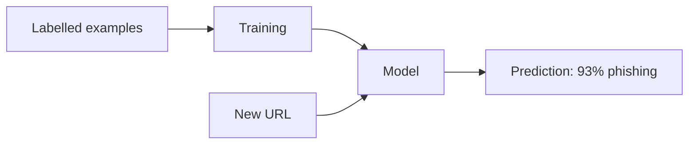

# 14.2 Machine learning foundations

Every link someone shortens with snip could be a **phishing** link: a page pretending to be your bank, hidden behind an innocent-looking short URL. That's why link shorteners are a favourite tool of scammers, and why real shorteners check the links people create. You could write rules ("block anything with an IP address in it"), and you should, for the obvious cases. But attackers change their patterns every week, and nobody can write down every warning sign by hand. **Machine learning** is the other approach: show a program thousands of examples labelled "phishing" or "safe", and let it work out the patterns itself.

In this chapter you'll build exactly that, from scratch, in about 100 lines of Python and NumPy, with no machine learning library hiding anything. You'll train it, measure it honestly, watch it fail in instructive ways, and pick where to draw the line between "block" and "allow". The same ideas, scaled up enormously, are what large language models are made of. So this is the foundation for everything else in Part 14.

## What you'll learn

- What machine learning is, and when rules are the better choice.
- **Features**, **labels**, and a **model** as a weighted vote.
- **Training**: **loss** and **gradient descent**, without calculus.
- Testing on **unseen data**, and why **accuracy lies** when one class is rare.
- **Precision**, **recall**, and **thresholds** as business decisions.
- **Overfitting**, **regularisation**, **data leakage**, and **error analysis**.

---

## Machine learning is programming by example

:::note[Everyday anchor]
You didn't learn what a dog is from a rulebook ("four legs, fur, barks"). A cat has four legs and fur; some dogs don't bark. You saw hundreds of dogs, someone said "dog" each time, and your brain worked out the pattern, well enough to recognise a breed you'd never seen before.
:::

Normal programming is writing **rules**: snip's slug validator (chapter 14.1) is a rule, and it's exactly right, forever. **Machine learning** (ML) is different. You don't write the rules. You collect **examples** with the right answers, called **labels**, and a training algorithm finds rules that reproduce those answers. The result is a **model**: a function that takes a new input and returns a **prediction**.



The vocabulary, which you'll meet everywhere:

| Term | Means | In this chapter |
|---|---|---|
| **Example** | One input | One URL |
| **Label** | The right answer for an example | 1 = phishing, 0 = safe |
| **Feature** | A number describing some aspect of the input | "the host is an IP address" = 1 |
| **Model** | The learned function from features to prediction | 10 weights and a bias |
| **Training** | Adjusting the model to fit the examples | 500 rounds of gradient descent |
| **Inference** | Using a trained model on new inputs | Scoring a URL when someone shortens it |

This kind, learning from labelled examples, is **supervised learning**, and it's by far the most common. Predicting a category ("phishing or safe") is **classification**; predicting a number ("how many clicks tomorrow") is **regression**. (**Unsupervised learning** finds structure in unlabelled data, such as grouping similar links. **Reinforcement learning** learns by trial and reward. Both matter, but not for this chapter.)

**When to use rules instead:** when you can write the rule down, and it doesn't change. Validation, permissions, and anything legal or financial should be rules: predictable, explainable, testable. ML earns its place when the pattern is fuzzy, has many weak signals, and shifts over time, and when you have (or can get) **labelled data**. Real systems use both: rules and blocklists for the known-bad, a model for the rest.

---

## The data: honest about where it came from

Every ML project starts with data, and the quality of the data limits everything after it. The code is in `ai/src/snipai/abuse.py`, and its data comes with a warning in the first lines:

```python
"""...The data is SYNTHETIC: generated by `make_dataset` from patterns that real
phishing links often show, plus deliberate noise. It's for learning the
method. A real system would train on real reported links..."""
```

`make_dataset()` generates 2,000 distinct URLs. About 10% are built from phishing patterns: made-up brand names (`examplebank`, `paynow`) with bait words (`login`, `verify`) on cheap top-level domains, raw IP addresses (from the ranges reserved for documentation), the `brand.com@ip-address` trick, and hacked small websites hosting a page deep in their uploads folder. The other 90% are ordinary links to real-looking sites, including legitimate ones that *look* suspicious: small sites with hyphens in the name, plain `http://`, password-reset links with long random tokens, and pages with "login" in the path. Then it deliberately **flips 3% of the labels**, because real labels are wrong sometimes: a user reports a safe link, a reviewer misclicks.

```text
2000 URLs, 16% labelled phishing; train 1500, test 500
```

16%, not 10%: the flips turned about 3% of the safe links into "phishing". Keep that in mind; it comes back later.

---

## Features: turning a URL into numbers

A model can only do arithmetic, so each URL becomes a list of numbers, its **features**. Choosing them is called **feature engineering**, and it's where your knowledge of the problem goes in. These are the ten that `features()` computes, the things a security-minded human would look at, shown for one phishing-style URL:

```text
http://examplebank-verify-login.top/login?session=9f8e7d6c5b4a3f2e1d
```

| Feature | Value | Why it might matter |
|---|---|---|
| length / 100 | 0.68 | Phishing URLs are often long |
| digits share | 0.13 | Random tokens contain many digits |
| host is an IP address | 0 | Real businesses use names |
| has @ in the address | 0 | `bank.com@evil` really goes to `evil` |
| dots in host | 1 | Deep subdomains can hide the real domain |
| hyphens in host | 2 | `brand-verify-login` style names |
| bait words | 2 | `verify`, `login` |
| cheap top-level domain | 1 | `.top` |
| uses https | 0 | Plain http is rarer on legitimate sites today |
| has a long random token | 1 | `session=9f8e...` |

---

## A model is a weighted vote

:::note[Everyday anchor]
A bouncer at a club door has a mental checklist: no ID is a big warning, a fake-looking ID bigger still, trainers instead of shoes a small one, arriving with a regular a point in your favour. They add it all up in their head and decide. They weren't born knowing how much each sign matters. Experience taught them.
:::

The model we'll train, **logistic regression**, works exactly like the bouncer. Each feature gets a **weight**: positive if it points towards phishing, negative if it points towards safe, and larger for stronger signals. The model multiplies each feature by its weight, adds them up with a starting offset (the **bias**), and squashes the total into a number between 0 and 1 with the **sigmoid** function, so it reads as a probability:

```python
def sigmoid(z: Floats) -> Floats:
    """Squash any number into 0..1, so the output reads as a probability."""
    return 1 / (1 + np.exp(-np.clip(z, -30, 30)))

def predict_proba(self, x: Floats) -> Floats:
    return sigmoid(x @ self.weights + self.bias)   # @ is matrix multiplication
```

That's the entire model: ten weights and a bias. And here's the key point: **we don't choose the weights. Training finds them.** After training, here's what the model worked out, sorted from most suspicious to most reassuring:

```text
   what it learned (weight per feature; + means 'more suspicious'):
      +3.07  cheap top-level domain
      +2.56  host is an IP address
      +1.72  hyphens in host
      +1.26  has @ in the address
      +1.16  bait words
      +0.00  digits share
      -0.04  dots in host
      -0.14  uses https
      -0.31  has a long random token
      -0.57  length / 100
```

Mostly sensible, and one surprise worth thinking about: "has a long random token" came out slightly *reassuring*. That's because legitimate password-reset and file-sharing links in this data have long tokens too. The model doesn't know what a token *means*. It only knows what correlated with the labels it saw. That's both ML's power (it finds patterns you didn't expect) and its danger (it finds patterns that aren't really there).

---

## Training is walking downhill in fog

:::note[Everyday anchor]
You're on a hillside in thick fog and want to reach the valley. You can't see it, but you can feel which way the ground slopes under your feet. So you take a step downhill, feel again, take another step. You'll get to the bottom without ever seeing it.
:::

To train, we need a number that says how wrong the model currently is: the **loss**. We use **log loss**: small when the model is confident *and* right, and very large when it's confident *and* wrong (saying "1% phishing" about a real phishing link is punished much harder than saying "40%"). Training means finding the weights that make the loss as small as possible.

**Gradient descent** is the walk downhill. For each weight, calculus gives the **gradient**: which direction, and how steeply, changing that weight changes the loss. (You don't need to do the calculus; libraries do it, and here it's one line.) Then every weight takes a small step in the downhill direction. Repeat. Each full pass over the training data is an **epoch**:

```python
for _ in range(self.epochs):
    p = self.predict_proba(x)
    error = p - y                                    # how far off each prediction is
    grad_w = x.T @ error / n + self.l2 * self.weights  # which way is downhill, per weight
    grad_b = float(np.mean(error))
    self.weights -= self.learning_rate * grad_w      # take a step
    self.bias -= self.learning_rate * grad_b
```

The **learning rate** is the step size. Too small and training takes forever; too big and you overshoot the valley and bounce around, or fly off entirely. It's the first knob everyone tunes.

```text
   loss: start 0.693 -> end 0.233
```

Notice the start: **0.693**. That's the natural logarithm of 2, the loss of a model that says "50%" about everything, which is what all-zero weights do. A clue worth recognising (chapter 13.6): if your loss is stuck at 0.693, your model hasn't learned anything.

---

## Test on data the model has never seen

:::note[Everyday anchor]
A student who memorised last year's exam answers can score 100% on last year's paper and still fail this year's. The only fair test uses questions they haven't seen.
:::

A model's score on its own training data tells you very little. What matters is how it does on **new** data, which is called **generalisation**. So before training, we split the data: 1,500 URLs for **training** and 500 held back for the **test set**, which the model never sees until the end.

```text
   train: accuracy 92.5%  precision 95.2%  recall 56.8%  (caught 138, missed 105, false alarms 7, correctly allowed 1250)
   test:  accuracy 93.8%  precision 90.4%  recall 64.4%  (caught 47, missed 26, false alarms 5, correctly allowed 422)
```

Train and test scores are close, so this simple model isn't memorising. (Test slightly higher than train is just luck of the split: 500 URLs is a small sample.)

:::warning[What can go wrong: data leakage, in our own first version]
The first version of this dataset had a bug we only caught while writing this chapter: it could generate the **same URL more than once**. Safe URLs were built from a short list of sites and paths, so `https://go.dev/doc/` appeared many times. After the split, **75% of the test URLs also appeared in the training data**. The "unseen" test was mostly seen, and the scores were flattering. Worse, the leak changed which model looked best in the overfitting experiment below.

This is **data leakage**: information from the test set sneaking into training, so the evaluation measures memory instead of generalisation. It's one of the most common and most expensive mistakes in ML, because everything looks great until real users arrive. The fix here was to make every URL unique (`make_dataset` now skips duplicates, and a test checks it). In real projects, leaks hide in subtler places: the same user in train and test, data from the future used to predict the past, a feature computed from the label itself.
:::

---

## Accuracy lies when one class is rare

Here's the first line the program prints, a model that doesn't learn at all and says "safe" to everything:

```text
1. The lazy baseline: call everything safe
   test: accuracy 85.4%  precision 0.0%  recall 0.0%  (caught 0, missed 73, false alarms 0, correctly allowed 427)
```

**85% accurate**, while catching **zero** phishing links. When one class is rare, **accuracy** (the share of predictions that are right) is dominated by the common class, and says almost nothing. Real phishing rates are far lower than 16%, so the trap is even worse in practice. Always compare against this lazy **baseline**, and use metrics that look at the rare class directly. They come from the four boxes of a **confusion matrix**:

| | Actually phishing | Actually safe |
|---|---|---|
| **Flagged as phishing** | **True positive**: caught (47) | **False positive**: false alarm (5) |
| **Allowed as safe** | **False negative**: missed (26) | **True negative**: correctly allowed (422) |

- **Precision** = caught ÷ everything flagged = 47 ÷ 52 = **90%**. When the model raises an alarm, how often is it right? Low precision means annoyed users whose good links get blocked.
- **Recall** = caught ÷ all real phishing = 47 ÷ 73 = **64%**. Of the real phishing links, how many did we catch? Low recall means scams getting through.

---

## The threshold is a business decision

The model outputs a probability. Turning that into "block" or "allow" needs a **threshold**, and 0.5 is only a default. Moving it trades precision against recall:

```text
   threshold 0.2: accuracy 83.0%  precision 45.5%  recall 82.2%  (caught 60, missed 13, false alarms 72, correctly allowed 355)
   threshold 0.5: accuracy 93.8%  precision 90.4%  recall 64.4%  (caught 47, missed 26, false alarms 5, correctly allowed 422)
   threshold 0.8: accuracy 89.4%  precision 95.5%  recall 28.8%  (caught 21, missed 52, false alarms 1, correctly allowed 426)
```

At 0.2, it catches 82% of phishing but raises 72 false alarms. At 0.8, it's almost never wrong when it flags something, but it misses 71% of phishing. **Neither is correct in the abstract.** The right threshold depends on what each mistake *costs*:

- A **missed** phishing link might cost a victim their savings, and snip its reputation (and its domain being blocked by email providers).
- A **false alarm** blocks a customer's legitimate link, which costs trust and support time.

A common design for snip would use two thresholds: **block automatically** above a high score (0.9, where it's almost always right), **send to a human for review** in the middle band, and allow below it. The model does the bulk of the work, and people handle the uncertain cases, which also produces fresh, well-checked labels for the next round of training.

:::info[In the real world]
Large link shorteners, email providers and browsers combine several defences: shared blocklists of known-bad URLs (Google Safe Browsing is a widely used one, with a free API), reputation data about domains (how old is it? what else is hosted there?), hand-written rules, and machine-learned models. They also **re-check links after creation**, because a page that was harmless when shortened can be swapped for a phishing page later.
:::

---

## Overfitting: memorising the homework

Our ten hand-made features are a **simple** model: it can only learn ten weights. What if we let the model find its own patterns instead? `ngram_features()` turns each URL into 4,096 features: which three-character pieces ("pay", "ynow", ".to") appear in it. That's a much more **flexible** model, and flexibility is a double-edged sword:

```text
4. Flexible models need more data (4,096 character-trigram features)
   model                                 train acc   test
   10 hand-made features, 40 URLs            92.5%   accuracy 90.6%  precision 71.7%  recall 58.9%  ...
   trigrams, 40 URLs                        100.0%   accuracy 86.6%  precision 55.8%  recall 39.7%  ...
   trigrams, 400 URLs                       100.0%   accuracy 96.6%  precision 90.0%  recall 86.3%  ...
   trigrams, all 1,500 URLs                  99.7%   accuracy 96.4%  precision 86.7%  recall 89.0%  ...
   trigrams, all 1,500 URLs, l2=0.01         96.8%   accuracy 97.6%  precision 94.2%  recall 89.0%  ...
```

Read it row by row:

- **With 40 training URLs** (only 6 of them phishing), the flexible model scores **100% on its training data** and does *worse* on the test than the simple model. It had 4,096 knobs and 40 examples, so it memorised them, including their noise and accidents, instead of learning the general pattern. That's **overfitting**: the student who memorised the homework. The signature is always the same: a big gap between training and test scores.
- **With 400 and 1,500 URLs**, the flexible model **overtakes** the simple one (recall 86–89%, against 64%). With enough examples, the real patterns outnumber the accidents, and flexibility pays off. This is one of the deepest truths in ML: **more (good) data** beats cleverness surprisingly often, and flexible models *need* it.
- **Regularisation** (`l2=0.01`) adds a penalty on large weights, so the model prefers simpler explanations. Its training score goes **down** (99.7% → 96.8%) while its test score goes **up** and false alarms fall from 10 to 4. Giving up a little memorisation for better generalisation is exactly what regularisation is for.

The balance between too simple (**underfitting**: missing real patterns) and too flexible (**overfitting**: learning noise) runs through all of ML, from this 100-line model to the largest language models.

---

## Read your errors

The single most useful thing to do with a trained model is to **look at what it gets wrong**. This is called **error analysis**, and the program prints the phishing-labelled test URLs the model let through:

```text
5. What the hand-feature model gets wrong (test URLs labelled phishing, scored < 50%)
     48%  https://cloudbox-account.com/
      4%  https://stackoverflow.com/wiki/Release_python
     19%  https://my-portfolio.dev/wp-content/uploads/7c15bd/index.html
     21%  https://sunny-bakery.com/questions/38057615
     ...
```

They fall into three groups, and each points to a *different* fix:

1. **The labels are wrong.** `stackoverflow.com/wiki/...` isn't phishing; it's one of the deliberately flipped labels. The model was **right**, and the data was wrong. In real projects, a good share of "errors" are label errors, and fixing labels is often the cheapest improvement available.
2. **The URL can't tell you.** `my-portfolio.dev/wp-content/uploads/7c15bd/index.html` is a hacked small site, and nothing in the address gives it away. No amount of training on these ten features will catch it. You need **different information**: fetch the page and look at it (a login form asking for a bank password on a bakery's site?), or the domain's reputation.
3. **A missing feature.** `cloudbox-account.com` scores 48%, just under the line. A human spots it instantly: a brand name in a domain the brand doesn't own. A new feature ("contains a known brand name, but isn't that brand's domain") would likely catch this whole group.

Better features, better labels, more data, a better model: error analysis tells you which one you actually need, so you don't spend a week on the wrong one.

---

## From here to large language models

Everything in this chapter scales up, almost unchanged, to the models behind modern AI:

- A **neural network** stacks many layers of weighted sums like ours, with a simple non-linear function between them. Instead of us hand-making features, the early layers **learn their own features** from raw input. Our trigram experiment was a small step in that direction.
- They're trained with the **same gradient descent** on the **same kind of loss**. Frameworks like **PyTorch** compute the gradients automatically for millions or billions of weights, on GPUs.
- A **large language model** (chapter 14.3) is, at its core, a classifier: given the text so far, predict which of roughly 100,000 possible next pieces of text comes next. Its "labels" come free from existing text, so it can be trained on a vast amount of it. Overfitting, leakage, evaluation on unseen data, and "look at your errors" all still apply (chapter 14.10 is all about that last one).

For classic ML on tables of features, most people use **scikit-learn** instead of writing their own: `LogisticRegression().fit(x, y)` is one line. We wrote it by hand so you can see that there's no magic inside, just arithmetic, repeated.

---

## Lab

Free, on your own computer, in a few seconds of CPU time. You'll train the detector, then change the data and the model and see what happens.

1. **Train it.** From the `ai` folder (chapter 14.1 set it up):
   ```bash
   cd ~/code/zero-to-prod/ai
   uv run python -m snipai.abuse
   ```
   Your numbers should match this chapter's exactly: the data is generated from a fixed random seed. Find the lazy baseline, the learned weights, and the threshold table.

2. **Score your own URLs.** In `uv run python`:
   ```python
   import numpy as np
   from snipai.abuse import make_dataset, features, LogisticRegression
   urls, y = make_dataset()
   model = LogisticRegression().fit(np.stack([features(u) for u in urls]), y)
   for url in ["https://github.com/login", "http://192.0.2.44/paynow/verify.php",
               "https://paynow-account.com/", "https://sunny-bakery.com/wp-content/uploads/a1b2c3/index.html"]:
       print(f"{model.predict_proba(features(url)[None, :])[0]:.0%}  {url}")
   ```
   **What to notice:** the IP-address URL scores high, and `github.com/login` stays low despite "login". But the brand-lookalike and the hacked-site URLs slip under 50%, exactly the groups from "Read your errors".

3. **Add a feature.** In `abuse.py`, add a feature for "the host contains one of `BRANDS`" (add a name to `FEATURE_NAMES` and a value to the list in `features()`, e.g. `float(any(b in host for b in BRANDS))`). Run the demo again. What happens to recall at threshold 0.5, and to the brand-lookalike URLs in the error list? Does the new feature get a large weight? (Then think: is this feature cheating? The data generator uses these exact brand names. In the real world, you'd need a list of real brands and their real domains.)

4. **Make the data dirtier.** Change `noise=0.03` to `noise=0.15` in `make_dataset`, and run it again. How do precision and recall change? How many of the errors in section 5 are label errors now?

5. **Break the learning rate.** In `LogisticRegression`, try `learning_rate=0.001` (the loss barely moves in 500 epochs) and `learning_rate=50` (the loss jumps around). Put it back to `0.5`. Then run the tests: `uv run pytest tests/test_abuse.py`.

6. Undo your changes with `git checkout -- src/snipai/abuse.py` when you're done.

## Self-check

<Quiz
  id="ai-ml-foundations"
  questions={[
    {
      q: 'A model that says "safe" for every URL is 85% accurate on our test set. What does that tell you?',
      options: [
        'The model is quite good',
        'Accuracy is misleading when one class is rare: this model catches zero phishing links. Compare against this baseline and use precision and recall',
        'The test set is too small',
        'Phishing is rare, so it doesn’t matter',
      ],
      answer: 1,
      explain: 'The common class dominates accuracy. Recall 0% says what matters: it catches nothing.',
    },
    {
      q: 'A flexible model scores 100% on its training data and much worse on the test set. What’s happening?',
      options: [
        'The test set is broken',
        'Overfitting: it memorised the training examples (including their noise) instead of learning general patterns',
        'The learning rate is too small',
        'It needs a higher threshold',
      ],
      answer: 1,
      explain: 'A big train–test gap is the signature. Fixes: more data, a simpler model, or regularisation.',
    },
    {
      q: 'What does lowering the threshold from 0.5 to 0.2 do?',
      options: [
        'Improves everything',
        'Flags more links: recall goes up (fewer scams missed), precision goes down (more false alarms)',
        'Makes the model train faster',
        'Nothing; the threshold only matters in training',
      ],
      answer: 1,
      explain: 'It’s a trade-off chosen by the cost of each kind of mistake, not a property of the model.',
    },
    {
      q: 'Our first dataset had 75% of test URLs also present in training. Why is that a problem?',
      options: [
        'It wastes disk space',
        'It’s data leakage: the test measures memory instead of generalisation, so scores look better than real-world performance will be',
        'Duplicates slow training down',
        'It isn’t a problem',
      ],
      answer: 1,
      explain: 'The test set must be genuinely unseen. Leakage flatters every metric and can even change which model looks best.',
    },
    {
      q: 'Training starts with a loss of 0.693 and it never goes down. What’s the most likely meaning?',
      options: [
        'The model is perfect',
        'The model hasn’t learned anything: 0.693 (ln 2) is the loss of always predicting 50%. Check the learning rate, the features and the labels',
        'The data has no phishing',
        'The test set is too big',
      ],
      answer: 1,
      explain: 'Numbers are clues: 0.693 is exactly the coin-flip loss for a yes/no problem.',
    },
  ]}
/>

<details>
<summary>Your phishing model is live. After a month, recall drops from 64% to 30%, although nothing in snip changed. What might be going on, and what would you do?</summary>

Most likely the world changed, not the model. This is called **drift**: the data the model sees in production no longer looks like the data it was trained on.

- **Attackers adapted.** They noticed links with cheap TLDs and IPs were getting blocked, and moved to `.com` lookalikes and hacked sites, which this model's features barely see. Phishing is **adversarial**: the other side is actively working against your model.
- **Check it:** do error analysis on recent missed phishing (from user reports and blocklist hits). Which groups dominate now?
- **Respond:** add features that capture the new patterns (brand lookalikes, domain age, page content), gather fresh labels from the review queue, **retrain regularly**, and keep the blocklist and rules layers, which react faster than retraining.
- **Monitor** precision and recall continuously (chapter 13.2 metrics, with an alert), so the next drop is noticed in days, not a month.

</details>

<details>
<summary>A teammate reports 99.9% accuracy for a new link-abuse model trained on last year's data and tested on a random 20% of it. Name three questions you'd ask before believing it.</summary>

1. **What's the baseline?** If 99.8% of links are safe, "always safe" scores 99.8%. Show precision and recall for the abuse class.
2. **Is there leakage?** Are the same URLs, domains or users in both train and test? Is any feature computed using the label (e.g. "was this link ever reported", when reports *are* the label)? With a random split of one year's data, the test set also contains the same campaigns the model trained on. A fairer test trains on January–October and tests on November–December: **split by time**, so the model is tested on the future, as it will be in production.
3. **How good are the labels?** Who labelled them, how, and how many are wrong? Look at a sample of the "errors": some may be label errors, and some "correct" predictions may be the model agreeing with wrong labels.

A result that looks too good is usually a bug. Treat it like any surprising measurement (chapter 13.6): try to break it before celebrating.

</details>
