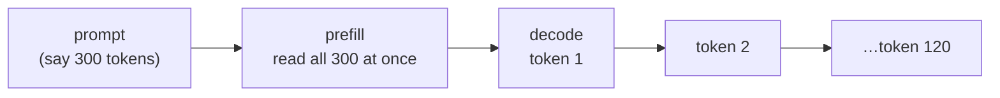

# 14.11 Serving open models

So far, every model in Part 14 has been either a hosted API (Claude) or a small open model running on your laptop through Ollama. Hosted APIs are the default for good reasons: you rent someone else's GPUs by the token, and the models are the best available. But there are real reasons to run a model yourself, and once you do, you're running a server again, with the same questions as snip: how fast is it, how much can it handle, what does it cost, and what happens when it's overloaded? The answers are different enough to deserve a chapter, because a language model is the strangest server you'll ever operate: one request can take thirty seconds, and it needs gigabytes of memory to say hello.

In this chapter you'll learn what's inside a model file, why it's memory, not raw computing power, that limits how fast text comes out, and how to measure a model server properly. Then you'll benchmark two model sizes on the same CPU-only machine CI uses, and see the numbers.

## What you'll learn

- When **self-hosting** a model beats an API, and when it doesn't.
- What **weights** and **parameters** are, and how to estimate the memory a model needs.
- **Quantization**: why a 4-bit model fits where a 16-bit one doesn't.
- The two phases of a request, **prefill** and **decode**, and why decode is limited by **memory bandwidth**.
- The metrics: **time to first token**, **tokens per second**, **throughput**.
- **Batching**, the **KV cache**, and the serving stacks built around them.
- Running models on **Kubernetes**, and the costs nobody puts in the pitch.

---

## Why run a model yourself?

:::note[Everyday anchor]
Taking a taxi versus owning a car. The taxi costs more per kilometre, but you pay nothing when you're not using it, and someone else handles the maintenance, insurance and parking. Owning a car makes sense when you drive a lot, need to go where taxis won't, or can't let anyone else drive your passengers. The car also sits in your garage costing money every day you don't use it.
:::

A hosted API is the taxi. **Self-hosting** is the car: you download an **open-weights model** (one whose trained numbers are published for anyone to run, like Qwen, Llama, Mistral or Gemma) and run it on hardware you control. Good reasons to do that:

- **Data can't leave.** Health records, legal documents, or a contract that forbids sending customer data to third parties. Self-hosting keeps the text on your machines.
- **Offline or on-device.** A factory floor, a ship, a phone. No network, no API.
- **High, steady volume of simple work.** Tagging millions of links (chapter 14.6) with a small model you keep busy around the clock can cost far less than per-token prices.
- **Control.** The model never changes under you, is never deprecated on a provider's schedule, and you can fine-tune it (chapter 14.12).

Bad reasons, or at least incomplete ones:

- **"It's free."** The model is free; GPUs, electricity, engineers' time and being on call aren't. A GPU you use 5% of the time is expensive.
- **"Open models are as good."** For narrow tasks, a small open model is often good enough, and you should measure that (chapter 14.10). For hard reasoning, long documents and agents, the best hosted models are still clearly ahead, and chapters 14.4 to 14.9 showed what a 1.5B model does with open-ended tasks.

:::info[In the real world]
Many teams end up with both: a hosted frontier model for the hard, low-volume work, and a small self-hosted model for one high-volume, well-evaluated task. The deciding question is always the same as in chapter 14.4: which is the **cheapest model that passes your evals**, counting everything it costs to run?
:::

---

## A model is a very large file of numbers

In chapter 14.3 you saw that a model is a function with billions of adjustable numbers, trained until its next-token predictions are good. Those numbers are the **weights**, also called **parameters**. When a model is called "1.5B", it has about 1.5 billion of them. Running the model means: load all the weights into memory, then do arithmetic with them for every token.

How much memory? Each number takes some bytes, so:

**memory for the weights ≈ number of parameters × bytes per parameter**

| Precision | Bytes per parameter | A 1.5B model | A 70B model |
|---|---|---|---|
| 32-bit float (FP32), as trained | 4 | 6 GB | 280 GB |
| 16-bit float (FP16/BF16), the usual serving format | 2 | 3 GB | 140 GB |
| 8-bit integer | 1 | 1.5 GB | 70 GB |
| 4-bit integer | ~0.5 | ~0.8 GB | ~35–40 GB |

That's the weights alone. Running also needs working memory (the KV cache, below), so leave headroom. The table explains the most important fact about self-hosting: **the model has to fit in the memory of the chip doing the maths**, and for a GPU that's its own memory, typically 16 to 80 GB, not the computer's RAM. A 70B model in 16-bit doesn't fit on any single common GPU.

### Quantization: fewer bits per number

**Quantization** stores each weight in fewer bits: instead of a 16-bit float, a 4-bit integer plus a shared scale for each small group of weights. It's lossy compression, like a JPEG: a 4-bit model is about a quarter of the size, and noticeably but usually slightly worse. 8-bit is nearly indistinguishable from 16-bit on most tasks; 4-bit is the popular compromise for running on laptops and small GPUs; below 4 bits, quality falls off faster.

Ollama's models are quantized by default. The `qwen2.5:1.5b` you've been using is a 4-bit version, stored in the **GGUF** file format used by **llama.cpp**, the C++ engine inside Ollama. That's why a "1.5 billion parameter" model downloaded as a file of about a gigabyte.

:::warning[What can go wrong]
Quantization's quality loss isn't spread evenly. A quantized model can keep its general fluency and lose precision on exactly the thing you care about: arithmetic, a rare language, strict output formats. "4-bit is fine" is a claim about averages. Run *your* evals (chapter 14.10) on the exact quantized file you'll serve, not on the original model's published scores.
:::

---

## Two phases: reading the prompt, then writing one token at a time

Every request to a language model has two phases, and they behave very differently.



1. **Prefill.** The model reads the whole prompt. All the prompt's tokens can be processed *in parallel*, so this phase is limited by raw arithmetic speed, and chips are very good at that. Hundreds or thousands of tokens per second.
2. **Decode.** The model writes the answer **one token at a time**, because each token depends on the one before (chapter 14.3). And for *every single token*, the chip has to read *all* the weights from memory.

That last point is the key to model performance. To produce one token from a 1 GB model, the chip streams 1 GB of weights through its arithmetic units. The arithmetic is quick; moving the gigabyte is what takes time. So decode speed is limited by **memory bandwidth**: how many gigabytes per second the memory can deliver. That gives a useful back-of-envelope ceiling:

**maximum decode speed (tokens/s) ≈ memory bandwidth ÷ model size**

| Hardware (typical, rounded) | Memory bandwidth | Ceiling for a 1 GB model | For a 40 GB model |
|---|---|---|---|
| Laptop or small server CPU (DDR4/DDR5) | 40–100 GB/s | 40–100 tokens/s | 1–2 tokens/s |
| Apple M-series laptop (unified memory) | 100–400 GB/s | 100–400 | 2.5–10 |
| Data-centre GPU (HBM memory) | 2,000–3,000+ GB/s | thousands | 50–75 |

These are ceilings, not predictions: real systems reach a fraction of them. But they explain things that otherwise look mysterious: why a model twice the size generates about half as fast, why quantizing to 4 bits speeds generation up (fewer bytes to move per token), and why GPUs, with their extremely fast memory, dominate serving.

---

## The numbers that matter

:::note[Everyday anchor]
A restaurant. How long until your first course arrives, how fast the courses come after that, and how many tables the kitchen can serve in an evening. A kitchen can be fast for one table and hopeless for fifty.
:::

Measuring a model server means measuring three different things:

- **Time to first token** (**TTFT**): from sending the request until the first piece of the answer arrives. This is what a person waiting *feels*, and with streaming (chapter 14.4) it's most of the perceived speed. It's mostly prefill, plus any queueing and model loading.
- **Tokens per second** during decode (sometimes given as its inverse, time per output token): how fast the answer streams once it starts. People read at roughly 5–10 tokens per second, so a stream faster than that feels instant; slower feels sluggish.
- **Throughput**: total tokens per second the server produces across *all* the requests it's handling. This is what determines your cost per token and how many users one machine can serve.

The first two describe one user's experience; the third describes the machine. They trade against each other, which brings us to batching.

---

## Batching: serving many users with one pass over the weights

Decode reads every weight from memory for every token. But once a weight is on its way through the chip, using it for **several requests at once** costs almost nothing extra. So a serving engine can advance, say, 16 requests by one token each in about the time it takes to advance one. That's **batching**, and it's why a GPU serving many users has far more total throughput than one serving a single user.

Modern servers use **continuous batching**: requests join and leave the batch at every step, instead of waiting for a whole batch to finish. A short request doesn't wait behind a long one.

The catch is memory. For each request in progress, the model keeps a **KV cache**: intermediate results for every token so far (the "keys" and "values" its attention layers computed, chapter 14.3), so it doesn't recompute the whole conversation for each new token. The KV cache grows with every token of every active request. For `qwen2.5:1.5b`, from its published architecture (28 layers, 2 key-value heads of 128 numbers each), in 16-bit that's:

2 (keys and values) × 28 layers × 2 heads × 128 × 2 bytes ≈ **28 KB per token**

A single 32,000-token conversation needs about 0.9 GB of KV cache, more than the 4-bit model itself. Twenty users with long conversations need gigabytes. That's what really limits how many requests fit on a GPU at once, and why serving engines put so much work into managing it (vLLM's **PagedAttention**, for example, allocates the cache in small pages, the way an operating system hands out memory, instead of reserving the maximum for every request).

:::info[If you've written code]
**Prompt caching** on hosted APIs is the same idea, sold back to you: the provider keeps the KV cache of a long, repeated prompt prefix (a system prompt, a document), so the next request with the same prefix skips most of the prefill. That's why cached input tokens are billed at a fraction of the price, and why you should put the unchanging part of a prompt first.
:::

---

## Our benchmark: two model sizes on a CPU-only runner

snipai includes a small benchmark, `snipai/bench.py`. For each model it sends one warm-up request (to load the model into memory), then three measured requests with a short prompt and three with a long one (about 1,500 tokens of text, the size of a RAG prompt, chapter 14.8), and takes the median of each metric. It streams the answer so it can time the first token itself, and it reads Ollama's own counters for decode and prefill speed. Then it measures throughput with 8 requests sent one at a time, and 8 requests sent 4 at a time:

```python
def throughput(http: httpx.Client, model: str, parallel: int, requests: int = 8) -> float:
    """Total output tokens per second with `parallel` requests in flight."""
    start = time.perf_counter()
    with ThreadPoolExecutor(parallel) as pool:
        samples = list(pool.map(lambda _: one_request(http, model), range(requests)))
    return sum(s.output_tokens for s in samples) / (time.perf_counter() - start)
```

Every request asks the same thing ("Explain in three sentences what a URL shortener does and why people use one."), at temperature 0, with at most 120 output tokens, and starts with a random tag, for a reason you'll see below. CI runs it on a standard GitHub-hosted runner: a virtual machine with 4 CPU cores, 15 GB of memory and no GPU.

With Ollama's default settings:

```text
model          first token  long prompt    generate  read prompt  1 at a time  4 at once
qwen2.5:0.5b        0.19 s      11.40 s    56.1 t/s      129 t/s     51.0 t/s   51.0 t/s
qwen2.5:1.5b        0.41 s      24.54 s    31.2 t/s       60 t/s     26.2 t/s   26.0 t/s

  qwen2.5:0.5b: short prompt 49 tokens, long prompt 1469 tokens, answers 120 tokens
  qwen2.5:1.5b: short prompt 50 tokens, long prompt 1470 tokens, answers 62 tokens
```

And the same benchmark after restarting the server with `OLLAMA_NUM_PARALLEL=4`, which lets it work on up to 4 requests at once:

```text
model          first token  long prompt    generate  read prompt  1 at a time  4 at once
qwen2.5:0.5b        0.19 s      11.55 s    55.8 t/s      127 t/s     50.3 t/s   63.1 t/s
qwen2.5:1.5b        0.41 s      25.02 s    30.4 t/s       59 t/s     26.0 t/s   30.6 t/s
```

The model files, from `ollama list`: `qwen2.5:0.5b` is 397 MB and `qwen2.5:1.5b` is 986 MB. What the numbers say:

- **Decode follows size.** The 1.5B file is 2.5 times bigger, and generates about 1.8 times slower (31 against 56 tokens a second). Not exactly proportional, because a small model spends a larger share of each step on work other than reading weights. But the direction is exactly what the bandwidth argument predicts. Both speeds are comfortably faster than people read.
- **The effective bandwidth is modest.** 986 MB × 31 tokens a second ≈ 30 GB/s, and 397 MB × 56 ≈ 22 GB/s: below the CPU row's range in the table above. Remember those are ceilings, and this is a shared cloud virtual machine: real systems reach a fraction of the ceiling.
- **Prefill is the surprise on a CPU.** Reading a 1,470-token prompt took **11.4 seconds** with the small model and **24.5 seconds** with the larger one, before the first word of the answer. On a CPU, prefill runs at only 60 to 130 tokens a second, barely faster than decode. On a GPU it would be many times faster, because prefill is the arithmetic-heavy phase GPUs excel at. The practical lesson: **on CPUs, long prompts (RAG, agents) are what makes users wait**, not the length of the answer.
- **Parallelism only helps if the server allows it.** With default settings, "4 at once" was no faster than "1 at a time": this Ollama version processed the requests one after another, and the others waited in a queue. With `OLLAMA_NUM_PARALLEL=4`, total throughput rose **by about a quarter** (51 → 63 tokens a second for the small model, 26 → 31 for the larger one). That's batching at work, but a small gain: with only 4 CPU cores, the arithmetic is soon the limit too. On a GPU, batching gains are typically far larger.

### The number that was too good

The first version of this benchmark sent the identical prompt every time. It reported a time to first token of **0.02 seconds** and prompt reading at **3,400 tokens a second**, on the same kind of machine. Both were wrong. Ollama, like most model servers, keeps the processed prompt of the previous request, and when the next prompt starts with the same tokens it skips reading them again: that's prompt caching (the "If you've written code" box above). The benchmark was measuring the cache, not the model. Starting each prompt with a different request number fixed it within one run, and the real first-token times turned out to be ten or more times longer.

The fix wasn't complete. The numbers restarted at 1 in every run, so when CI ran the benchmark a second time against the *same* server, it sent the same sequence of prompts as the first run, and one CI run reported prompt reading at **86,000 tokens a second**: the cache again. (That run had a second problem: the step meant to restart the server with parallel mode had quietly failed, so the "parallel" numbers came from the old server.) The benchmark now starts every prompt with a random tag, and CI checks the restarted server's own log for the parallel setting before trusting its numbers. The results above are from a run where the restart demonstrably happened.

The lesson applies to every benchmark (chapter 8.5 has more): **when a number looks too good, find out why before you believe it**. And one more caution: different CI runs land on different machines. An earlier run measured the small model's generation at 73 tokens a second, against 56 here. Benchmark on the hardware you'll actually use, more than once.

---

## The serving stacks

You don't write a serving engine; you choose one. The landscape, roughly:

| Tool | What it's for |
|---|---|
| **llama.cpp** / **Ollama** | CPUs, laptops, Apple silicon, small GPUs; quantized GGUF models; easiest to start with. Ollama wraps llama.cpp with a model library and a simple HTTP API (the one snipai uses). Great for development, internal tools and on-device use. |
| **vLLM**, **SGLang**, **TGI** | Production serving on data-centre GPUs: continuous batching, efficient KV cache management, many concurrent users, multi-GPU models. |
| Managed endpoints | Cloud providers and specialist hosts run open models for you, billed by token or by the hour. Open weights, someone else's pager. |

Most of these offer an **OpenAI-compatible API**: the same request and response shapes as one popular hosted API, so client libraries and tools work unchanged. It's a de facto standard for talking to self-hosted models. (snipai talks to Ollama's native API instead, because it exposes the timing counters the benchmark needs.)

---

## Running models on Kubernetes

A model server is a container, so everything in Part 10 applies. But it breaks several assumptions snip got away with:

- **Huge artefacts.** snip's image is about 20 MB. Model weights are gigabytes to hundreds of gigabytes. Don't bake them into the image; download them to a volume, or mount them from shared storage, and cache them on the node.
- **Slow starts.** Loading 40 GB of weights into GPU memory takes minutes. Your **startup and readiness probes** (chapter 10.2) must allow for it, and autoscaling (chapters 8.6 and 10.5) reacts in minutes, not seconds. Scale on queue length or concurrent requests, not CPU.
- **Scarce, expensive nodes.** GPU nodes are requested explicitly (`resources.limits: nvidia.com/gpu: 1`, which needs the vendor's device plugin), kept separate with taints so ordinary pods don't land on them, and they cost several dollars an hour whether busy or idle.
- **Long requests.** A 30-second streaming response makes rolling updates, timeouts at the load balancer (chapter 8.3) and graceful shutdown (chapter 5.4) much more delicate. A pod being replaced must finish its in-flight answers first.
- **New failure modes.** Out of GPU memory, a KV cache that's full so new requests queue, a model that loads but produces garbage because of a wrong file. Monitor TTFT, tokens per second, queue length and GPU memory, and alert on them like any other service metric (chapters 13.2 and 13.4).

:::warning[What can go wrong]
The classic self-hosting cost mistake: provisioning GPUs for peak traffic and leaving them idle the rest of the day. A data-centre GPU at a few dollars an hour, running all month, is a few thousand dollars, whether it serves a million requests or ten. Do the arithmetic for *your* traffic before you move off an API: expected tokens per month × API price, against hours × GPU price plus the engineering time. For bursty or low volume, the API usually wins.
:::

:::info[Honesty label]
**Exists today:** snipai's benchmark, run in CI against two quantized open models on a CPU-only GitHub runner, and snipai's Ollama provider used throughout Part 14. **Not built:** a GPU deployment of a model server on snip's Kubernetes stack. The GPU and bandwidth figures in the tables above are rounded, typical values for comparison, not measurements of ours.
:::

---

## Lab

Free, local, with Ollama (chapter 14.4). About 2 GB of downloads.

1. **Pull two sizes of the same model family:**
   ```bash
   ollama pull qwen2.5:0.5b
   ollama pull qwen2.5:1.5b
   ollama list
   ```
   **What to notice:** the file sizes. Compare them with "parameters × 0.5 bytes" from the table above.

2. **Run the benchmark:**
   ```bash
   cd ~/code/zero-to-prod/ai
   uv run python -m snipai.bench qwen2.5:0.5b qwen2.5:1.5b
   ```
   **What to notice:** how the decode speed compares between the two sizes, the long prompt's first-token time, and whether "4 at once" beats "1 at a time" on your machine. Then quit Ollama, start it with `OLLAMA_NUM_PARALLEL=4 ollama serve`, run the benchmark again with the same variable set, and compare.

3. **Watch memory while it runs.** In a second terminal, run `ollama ps` (which models are loaded, and how much memory they use) and `top` or Activity Monitor. **What to notice:** the model stays loaded after a request, so the next one skips the loading. That's why the benchmark sends a warm-up request.

4. **Estimate your bandwidth ceiling.** Look up your computer's memory type and bandwidth, divide by the model file size, and compare with the tokens per second you measured. **What to notice:** you'll get a fraction of the ceiling, not more. If a measurement ever beats the ceiling, something in the measurement is wrong.

5. **Try a bigger model, if you have 8 GB of free RAM:** `ollama pull qwen2.5:7b`, then add it to the benchmark. **What to notice:** the speed drop, and whether the answer to the prompt is better enough to justify it. That's the whole self-hosting trade-off in one experiment.

---

## Self-check

<Quiz
  id="ai-serving-open-models"
  questions={[
    {
      q: 'Roughly how much memory do the weights of a 7B-parameter model need at 16-bit precision?',
      options: ['7 GB', '14 GB', '28 GB', '3.5 GB'],
      answer: 1,
      explain: 'Parameters × bytes per parameter: 7 billion × 2 bytes = 14 GB, before the KV cache and other working memory.',
    },
    {
      q: 'Why does generating text (decode) get slower as the model gets bigger, even on a very fast chip?',
      options: [
        'Bigger models have larger vocabularies',
        'Every output token requires reading all the weights from memory, so speed is limited by memory bandwidth divided by model size',
        'Bigger models write longer answers',
        'The chip overheats',
      ],
      answer: 1,
      explain: 'Decode is memory-bound. Twice the bytes to move per token means roughly half the tokens per second.',
    },
    {
      q: 'What does quantizing a model from 16-bit to 4-bit weights do?',
      options: [
        'Nothing; it only changes the file name',
        'Makes it about a quarter of the size and faster to decode, with some quality loss that you should measure on your own task',
        'Makes it more accurate',
        'Removes three quarters of the parameters',
      ],
      answer: 1,
      explain: 'Same number of parameters, fewer bits each. Smaller and faster, slightly worse, unevenly so: evaluate the exact file you serve.',
    },
    {
      q: 'A chat feature feels slow to users, although tokens per second is high once text appears. Which metric should you look at?',
      options: [
        'Throughput',
        'Time to first token: queueing, model loading and prefill before anything appears',
        'The model’s parameter count',
        'The error rate',
      ],
      answer: 1,
      explain: 'Perceived speed is dominated by the wait before the first token when responses stream.',
    },
    {
      q: 'Why can a GPU server handle many users at once far more efficiently than one?',
      options: [
        'It runs a separate copy of the model per user',
        'Batching: one pass over the weights advances many requests by a token each, so throughput rises until memory (mostly the KV cache) runs out',
        'Users share one answer',
        'It skips the prefill phase',
      ],
      answer: 1,
      explain: 'The expensive part, moving the weights, is shared across the batch. The KV cache per active request is what limits the batch size.',
    },
    {
      q: 'Which is the strongest reason to self-host a model rather than use a hosted API?',
      options: [
        'Open models are free, so it always costs less',
        'The data legally can’t leave your infrastructure, or you have high, steady volume of a task a small model passes your evals on',
        'Self-hosted models are always better',
        'APIs don’t support streaming',
      ],
      answer: 1,
      explain: 'Hardware, operations and idle time cost money. Self-hosting wins on data control, offline use, or steady high volume.',
    },
  ]}
/>

<details>
<summary>Your team wants to serve a 70B open model at 16-bit precision for an internal assistant. You have GPUs with 48 GB of memory each. What's the minimum you'd need, and what options would you consider?</summary>

The weights alone are about 70 billion × 2 bytes = **140 GB**, so they need at least three 48 GB GPUs (144 GB), which leaves almost nothing for the KV cache. Realistically four, with the model split across them (serving engines support this: **tensor parallelism** splits each layer's maths across GPUs, which then communicate constantly, so they must be in the same machine with fast links).

Options, roughly in the order worth checking:

1. **Does it need to be 70B?** Evaluate a smaller model (7–14B) on the assistant's real tasks. If it passes, it fits on one GPU.
2. **Quantize.** At 8-bit, about 70 GB (two GPUs); at 4-bit, about 35–40 GB (one GPU, tight). Evaluate the quantized version.
3. **Estimate the volume.** For an internal assistant with a few hundred users, a hosted API may be much cheaper than four GPUs running all month. Self-host only if data rules require it, or the volume justifies it.

The judgment: the memory arithmetic tells you what's *possible*; the evals and the cost arithmetic tell you what's *sensible*.

</details>

<details>
<summary>After deploying a model server on Kubernetes, every rolling update causes a few minutes of errors. The model takes 3 minutes to load. What's likely wrong, and how do you fix it?</summary>

The new pods are probably being marked **ready** before the model has loaded, so the load balancer sends them traffic they can't serve, and the old pods are removed too early. Or the opposite: a liveness probe kills the pod because loading takes longer than its allowance, and it restarts in a loop.

Fixes, from chapter 10.2:

- A **startup probe** with a generous allowance (for example, check every 10 seconds, allow 30 failures: 5 minutes), so liveness checks don't start until loading is done.
- A **readiness probe** that only succeeds once the model is loaded and can generate a token (many servers expose a health endpoint that does this).
- `maxUnavailable: 0` in the rolling update strategy, so an old pod is only removed after a new one is ready. With scarce GPUs, this needs one spare GPU during the update (`maxSurge: 1`), which is a real cost to plan for.
- Graceful shutdown with a long enough termination grace period, so old pods finish the answers they're streaming.
- Cache the weights on the node or in a shared volume, so a new pod doesn't download gigabytes before it can start loading.

</details>
