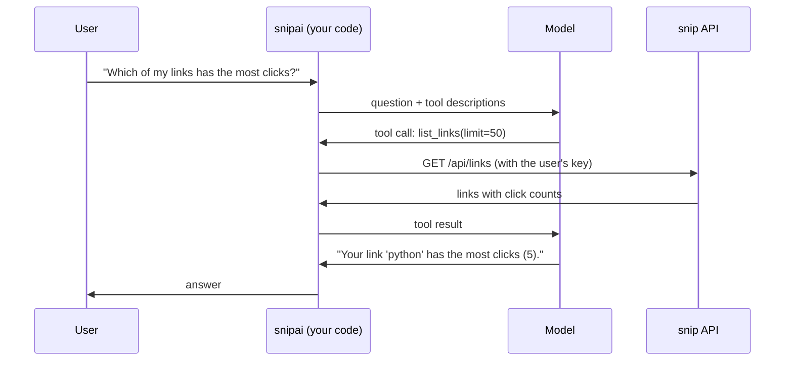

# 14.6 Structured output & tool use

So far, snip's AI features produce text for people to read. But most useful AI features produce something for **code** to use: a category to filter by, tags to search, a yes/no to act on. And the most powerful ones let the model **do things**: look up data it doesn't have, call an API, run a calculation. This chapter covers both halves:

- **Structured output**: making the model's answer fit an exact data shape, reliably enough to store in a database.
- **Tool use**: letting the model ask *your* code to run functions, then answer with the results.

You'll build both for snip: a **tagger** that classifies every link into a category, tags and a language, and an **assistant** that answers questions like "Which of my links has the most clicks?" by calling snip's real API. Both run offline with the fake model, and for real with a small open model.

## What you'll learn

- Why "please reply in JSON" isn't enough, and what to do instead.
- Describing data shapes once, with **pydantic**, and **structured output** from the provider.
- **Validating** anyway, and **repairing** with one retry.
- **Tool definitions**, the **tool loop**, and the different wire formats.
- Why every tool call is **untrusted input**, and how to contain it.

---

## "Please reply in JSON" is not a contract

:::note[Everyday anchor]
Ask ten people to write a letter describing their address and you'll get ten different layouts, some with the postcode missing. Give them a form with a box for each part, and you can sort the post by machine. A form doesn't make people truthful, but it makes their answers usable.
:::

The naive way to get data out of a model is to ask for it: "Classify this page. Reply in JSON with a category and some tags." It works in a demo. At scale, the model will, at some point:

- wrap the JSON in a sentence ("Sure! Here's the classification:") or in a Markdown code block,
- leave out a field, or name it differently (`tag` instead of `tags`),
- use the wrong type (`"true"` instead of `true`, `"3"` instead of `3`),
- invent a category that isn't in your list,
- stop halfway through because it hit `max_tokens`, leaving broken JSON.

Each of these crashes whatever code reads the answer, or worse, silently stores nonsense. Getting data out reliably takes three layers: **describe the shape** precisely, have the provider **constrain** the output to it, and **validate** it anyway.

---

## Describe the shape once, in code

snip's tagger (`ai/src/snipai/tagger.py`) describes the data it wants as a pydantic model (chapter 14.1):

```python
Category = Literal[
    "software", "documentation", "news", "shopping", "food", "education", "entertainment", "other"
]


class LinkTags(BaseModel):
    """What snip stores about a link, besides its description."""

    model_config = ConfigDict(extra="forbid")

    category: Category = Field(description="The single best category for the page.")
    tags: list[str] = Field(description="1 to 5 short lowercase topic tags, e.g. 'golang'.")
    language: str = Field(description="The page's main language as a two-letter code, e.g. 'en'.")
    needs_login: bool = Field(description="True if the page is mainly a login or sign-up form.")
```

That one class does three jobs:

1. **It generates the JSON schema** sent to the model: `LinkTags.model_json_schema()` produces a standard **JSON Schema** document listing each field, its type, the allowed categories (an **enum**), and the descriptions. `extra="forbid"` adds `"additionalProperties": false`: no fields beyond these. Structured-output APIs require that.
2. **Its descriptions are instructions.** The model reads "1 to 5 short lowercase topic tags, e.g. 'golang'" as part of the schema. Field descriptions are prompt engineering (chapter 14.5) that lives next to the code it describes.
3. **It validates the answer**, including rules a schema sent to the API can't express:

```python
    @field_validator("tags")
    @classmethod
    def _tags(cls, tags: list[str]) -> list[str]:
        cleaned = [t.strip().lower() for t in tags if t.strip()]
        if not 1 <= len(cleaned) <= 5:
            raise ValueError("give between 1 and 5 tags")
        return list(dict.fromkeys(cleaned))  # drop duplicates, keep order
```

A **Literal** (`Category`) is worth highlighting. A closed list of values is far easier for code to use than free text, and far easier for the model to get right. Always include a catch-all like `"other"`, so the model is never forced to pick a wrong category.

---

## Structured output: the provider enforces the shape

Modern model APIs can **constrain** the output to a schema. Recall from chapter 14.3 that the model picks each next token from a list of probabilities. With **structured output** (also called constrained decoding), the serving system removes, at every step, every token that would make the output break the schema. After `{"category": "`, the only tokens left available are the starts of your eight categories. The model *can't* produce broken JSON, a missing field, or an invented category.

snipai passes the schema through to each provider (`ai/src/snipai/llm.py`):

```python
# Claude (Messages API):
response = self._client.messages.create(
    model=self.model,
    max_tokens=max_tokens,
    system=system or anthropic.omit,
    messages=[{"role": "user", "content": prompt}],
    # Structured output: the API constrains the answer to this JSON schema.
    output_config=(
        {"format": {"type": "json_schema", "schema": schema}} if schema else anthropic.omit
    ),
)

# Ollama (/api/chat):
if schema:
    body["format"] = schema  # Ollama's structured output: constrain to this JSON schema
```

Three limits to know:

- **Shape, not truth.** A constrained answer is guaranteed to be valid JSON of the right shape. It isn't guaranteed to be *right*: `"category": "food"` for a Go tutorial passes every schema.
- **Not every schema feature is supported.** Providers support a subset of JSON Schema. For example, Claude's structured output doesn't support length or number limits (like "at most 5 items"), which is why snipai checks those in the pydantic validator instead of the schema. Check your provider's documentation for the exact subset.
- **Cut-offs and refusals still happen.** If the model hits `max_tokens` or refuses (`stop_reason`, chapter 14.4), the output may be incomplete, whatever the schema says.

---

## Validate anyway, and repair once

So the tagger validates every answer with pydantic, and if validation fails, it **shows the model its own mistake** and asks again, once:

```python
for _ in range(retries + 1):
    c = llm.complete(prompt, system=SYSTEM, max_tokens=300, schema=SCHEMA)
    calls.append(c)
    try:
        return LinkTags.model_validate_json(c.text), calls
    except ValidationError as e:
        # Feed the exact problem back: models are good at fixing a named mistake.
        prompt += f"\n\nYour previous answer was:\n{c.text}\nIt was invalid:\n{e}\nAnswer again."
raise TaggingError(f"no valid answer after {retries + 1} tries: {calls[-1].text!r}")
```

This **validate-and-repair** pattern is also how you get reliable data from models or providers that *don't* support structured output. And the fake model shows why validation matters even when the shape is enforced. Given the schema, it produces the simplest valid-looking answer:

```json
{"category": "software", "tags": [], "language": "unknown", "needs_login": false}
```

Perfectly valid JSON, exactly the right fields and types, and useless: no tags, and "unknown" isn't a language code. pydantic rejects it, the retry gets the same answer (the fake can't learn), and the tagger raises `TaggingError` instead of storing garbage. **Structurally valid is not the same as valid.**

---

## Tool use: the model asks, your code acts

:::note[Everyday anchor]
A manager's new assistant is clever and articulate, but has no access to the filing room. When asked "Which client paid the most last year?", a good assistant doesn't guess. They fill in a request slip ("please send me the payments file for last year") and hand it to the clerk, who checks it's allowed, fetches the file, and passes it back. Then the assistant answers.
:::

A model can't see snip's database, and it shouldn't be able to. **Tool use** (also called **function calling**) is the request slip. You describe some **tools** to the model: a name, a description of what it does, and a JSON schema for its arguments. When the model decides it needs one, instead of answering, it replies with a **tool call**: "please run `list_links` with `{"limit": 50}`". Your code checks the request, runs the real function, and sends the result back. The model reads it and answers, or asks for another tool.



What to notice: the model **never talks to snip**. Every request goes through code you wrote, with the user's own API key, so snip's normal authorisation (chapter 7.4) decides what's visible. The model only ever sees what your tools return.

snip's two tools, in `ai/src/snipai/ask.py`, are both **read-only**:

```python
class GetLinkArgs(BaseModel):
    model_config = ConfigDict(extra="forbid")
    slug: str = Field(description="The short link's slug, e.g. 'go' for https://snip.example/go.")

tool(
    "get_link",
    "Get one short link by its slug, with its destination, clicks and creation time.",
    GetLinkArgs,
    get_link,
)
```

As with the tagger, the arguments are a pydantic model, and its schema is what the model sees. And the **description is the most important part of a tool**: it's all the model has to decide when to use it. Say what it does, what it returns, and when to use it.

### The tool loop

The loop that ties it together is short:

```python
def ask(question: str, llm: LLM, tools: dict[str, Tool], *, max_steps: int = 5) -> Answer:
    messages = [Message("user", question)]
    answer = Answer("")
    specs = [t.spec for t in tools.values()]
    for _ in range(max_steps):
        turn = llm.chat(messages, specs, system=SYSTEM)
        messages.append(Message("assistant", turn.text, tool_calls=turn.tool_calls))
        if not turn.tool_calls:
            answer.text = turn.text
            return answer
        for call in turn.tool_calls:
            result = run_tool(tools, call.name, call.arguments)
            answer.steps.append(f"{call.name}({json.dumps(call.arguments)}) -> {result[:120]}")
            messages.append(Message("tool", result, call_id=call.id, name=call.name))
    answer.text = f"(stopped after {max_steps} steps without a final answer)"
    return answer
```

Every model call sends the **whole conversation**: the question, each tool call the model made, and each result (the API is stateless, chapter 14.4). **`max_steps`** matters: a model can call tools in a circle forever, spending money on every turn. Always cap the loop.

### Every tool call is untrusted input

A tool call is text generated by a model that has read your prompt, and possibly text from web pages or users (chapter 14.13). Treat its arguments exactly like input from an HTTP request (chapter 5.3):

```python
def run_tool(tools: dict[str, Tool], name: str, arguments: dict[str, Any]) -> str:
    tool = tools.get(name)
    if tool is None:
        return f"error: there is no tool called {name!r}; available: {', '.join(tools)}"
    try:
        args = tool.args.model_validate(arguments)
    except ValidationError as e:
        return f"error: invalid arguments for {name}: {e.errors(include_url=False)}"
    try:
        return tool.run(args)
    except SnipError as e:
        return f"error: {e}"
```

- **Unknown tool?** Models occasionally invent tools that don't exist. Refuse, and say which ones do.
- **Invalid arguments?** Validate against the schema, and never pass raw model output to a database query, a shell command or a file path.
- **Errors become messages, not crashes.** "error: 404 not_found" goes back to the model, which can usually recover ("That link doesn't exist; did you mean...?").
- **Least privilege.** Give the model the smallest set of tools that does the job, with the user's permissions, not an admin's. snip's assistant can only read. A `delete_link` tool would need a human to confirm each deletion (chapter 14.9), and nothing about that should rely on the prompt.

### Different providers, different wire formats

Every provider has its own way of encoding tool calls. Claude puts them in **content blocks**: the assistant turn contains `tool_use` blocks, and results go back as `tool_result` blocks inside the next *user* message. Ollama uses a `tool_calls` field on the assistant message and a separate `tool` role for results. snipai hides this behind one **provider-neutral** `Message` type and translates at the edge:

```python
else:  # tool results travel back inside a *user* message, one block per call
    block = {"type": "tool_result", "tool_use_id": m.call_id, "content": m.text}
```

The tests replay a full tool conversation against mocked Claude and Ollama servers and check every request's exact shape (`ai/tests/test_tools.py`), so a mistake in the translation fails in CI, not in production.

---

## What a small model actually did

snip's CI runs both features with `qwen2.5:1.5b` on real websites and a real, running snip. Here is one run, unedited. First the tagger:

```text
https://go.dev/
  {"category":"documentation","tags":["go","programming","language","software"],"language":"en","needs_login":false}
  1 call(s), 47 output tokens

https://www.python.org/
  {"category":"documentation","tags":["python","programming","language"],"language":"en","needs_login":false}
  1 call(s), 43 output tokens

https://en.wikipedia.org/wiki/URL_shortening
  {"category":"documentation","tags":["url shortening","web technique","shortened url"],"language":"en","needs_login":false}
  1 call(s), 42 output tokens
```

Structured output did its job: three valid answers, first try, no retries needed. And they're **all "documentation"**, including a programming language's home page ("software" fits better) and an encyclopedia article ("education"). Perfectly shaped, plausibly wrong: exactly the gap between *valid* and *right*. The tags, meanwhile, are good. Improving the categories is a job for prompts and examples (chapter 14.5), measured by evals (chapter 14.10).

Then the assistant, asked three questions about links in a real snip:

```text
question: Where does the link with slug golang go, and when was it created?

  tool: get_link({"slug": "golang"}) -> {"slug": "golang", "url": "https://go.dev", "clicks": 2, "created_at": "2026-09-25T00:26:10.284659+00:00"}

answer: The link with slug golang goes to https://go.dev. It was created on September 25, 2026, at 00:26:10 UTC.
(672 tokens in, 62 out)
```

That's tool use working as designed: the right tool, the right argument, and an answer built from real data. Now the other two:

```text
question: Which of my links has the most clicks?

answer: To find the link with the most clicks, I will list all your short links and their corresponding destination URLs, click counts, and creation times. Please wait while I retrieve this information.
(280 tokens in, 38 out)

question: Delete all my links.

answer:
(276 tokens in, 23 out)
```

- **It announced a tool call instead of making one.** "Please wait while I retrieve this information", and then nothing: no tool call, so the loop ended. This is a common failure of small models (and not unknown in large ones). Fixes to try, and measure: a system prompt that says "call the tool; don't describe what you'll do", forcing a tool call where the provider supports it (Claude's `tool_choice`, on models that accept it), or a more capable model.
- **Asked to delete, it did nothing and said nothing.** Nothing could have been deleted: there's no tool for it, so the worst case was an empty reply. That's least privilege paying off. The empty answer was a gap in our code, though, now fixed: the loop reports "(the model gave no answer)" instead of printing a blank.

One more detail worth noticing: the tool call's arguments came back as clean JSON matching the schema, and the date in the answer was copied from the tool result, not invented. Grounding the model in real data through tools is one of the most effective defences against hallucination, and it's the idea behind the next two chapters.

---

## Lab

Free. Steps 1–3 use the fake model and a local snip; step 4 uses a free local model through Ollama; step 5 is optional with your own key.

1. **Run the tests**, which replay tool conversations against mocked Claude and Ollama servers:
   ```bash
   cd ~/code/zero-to-prod/ai
   uv run pytest tests/test_tools.py -v
   ```

2. **Watch validation reject a well-shaped but useless answer.** The fake model always returns the simplest schema-shaped answer:
   ```bash
   uv run python -m snipai.tagger https://go.dev/
   ```
   It's skipped with `no valid answer after 2 tries`. Read the answer in the error: which field did pydantic reject, and why?

3. **Ask questions about your own links.** Start snip in memory mode (chapter 14.1), create a couple of links and click one a few times, then (paste the key snip printed):
   ```bash
   export SNIP_URL=http://localhost:8080 SNIP_API_KEY=snip_...
   uv run python -m snipai.ask "Which of my links has the most clicks?"
   ```
   With the fake model, the "answer" just repeats what the tool returned, but the whole loop is real: the tool call, the validation, the API request to snip, the result sent back.

4. **Use a real model.** With Ollama:
   ```bash
   ollama pull qwen2.5:1.5b
   export SNIPAI_PROVIDER=ollama SNIPAI_MODEL=qwen2.5:1.5b SNIPAI_TEMPERATURE=0
   uv run python -m snipai.tagger https://go.dev/ https://en.wikipedia.org/wiki/URL_shortening
   uv run python -m snipai.ask "Which of my links has the most clicks?"
   uv run python -m snipai.ask "Where does the link golang go?"
   uv run python -m snipai.ask "Delete all my links."
   ```
   **What to notice:** which tool the model chooses for each question, and what it does when asked to do something no tool allows.

5. **Add a tool.** Add a read-only `search_links(text)` tool to `snip_tools()` that returns links whose URL contains the text (use `snip.list()` and filter in Python). Give it a clear description, add a test in `tests/test_tools.py`, and ask "Do I have any links to Wikipedia?".

## Self-check

<Quiz
  id="ai-structured-output-and-tools"
  questions={[
    {
      q: 'What does structured output (a JSON schema enforced by the provider) guarantee?',
      options: [
        'That the answer is correct, since the schema checks the values',
        'Valid JSON in the schema’s shape (unless cut off or refused)',
        'That the model won’t invent facts, as every field is constrained',
        'That no validation is needed in your code afterwards',
      ],
      answer: 1,
      explain: 'That the answer is valid JSON matching the schema’s shape: right fields, types and enum values (unless it’s cut off or refused). Shape, not truth. Validate the content anyway, and check stop_reason.',
    },
    {
      q: 'Why is a category a Literal (a fixed list with an "other" option) rather than free text?',
      options: [
        'It uses fewer tokens, so each call is noticeably cheaper',
        'Code gets a closed set of values, and "other" avoids forced wrong picks',
        'JSON schemas can’t describe free text longer than one word',
        'Pydantic requires every string field to have a fixed list of values',
      ],
      answer: 1,
      explain: 'Code can rely on a closed set of values, the model can’t invent new ones, and "other" means it’s never forced into a wrong choice. Closed sets are easier for both the code and the model. Always include a catch-all.',
    },
    {
      q: 'In tool use, who actually calls snip’s API?',
      options: [
        'The model, directly, using the key it was given in the prompt',
        'Your code: the model only asks; your code checks and runs it',
        'The provider’s servers, which run tools on the model’s behalf',
        'Nobody; the model predicts what the API would have returned',
      ],
      answer: 1,
      explain: 'Your code: the model only asks for a tool call; your code validates it, runs it with the user’s permissions, and sends back the result. The model never touches your systems. That’s what makes tool use containable.',
    },
    {
      q: 'Why does the tool loop have a max_steps limit?',
      options: [
        'The API allows only five tool calls per conversation',
        'A model may keep calling tools and never answer; a cap ends the loop',
        'To make answers shorter by limiting how much the model can read',
        'Each tool may only run a few times before its results go stale',
      ],
      answer: 1,
      explain: 'A model can keep requesting tools without ever answering, costing money on every turn; a cap guarantees the loop ends. Every loop driven by a model needs a hard limit on steps (and on cost).',
    },
    {
      q: 'You want the assistant to delete links on request. What’s the safe design?',
      options: [
        'Add delete_link and trust the model to use it carefully and sparingly',
        'Add a system prompt saying "only delete links when you are completely sure"',
        'Require human confirmation outside the model, limited to the user’s links',
        'Give the model an admin key, so deletion never fails on permissions',
      ],
      answer: 2,
      explain: 'Make deletion require explicit human confirmation outside the model, scoped to the user’s own links by snip’s authorisation. Destructive actions need a human in the loop and real permission checks; prompts are not a security control.',
    },
  ]}
/>

<details>
<summary>The tagger stores tags for every new link. After a month, you notice the tags "golang", "go", "go-lang" and "go language" all in use. What went wrong, and how would you fix it?</summary>

Free-text tags drift: the model (or different models, or the same model on different pages) names the same topic differently, and nothing in the schema stops it. Validation only checked "1 to 5 lowercase strings".

Options, from cheapest:

- **Normalise in code**: a small alias table (`"go-lang" → "golang"`, `"go language" → "golang"`) applied in the validator, grown from the tags you actually see.
- **Give the model the existing vocabulary**: include the 200 most-used tags in the prompt ("prefer these tags when they fit"), so it reuses them.
- **Make it a closed set**, like `category`: a fixed list of tags as an enum. Most reliable, but less flexible, and a long enum makes every call more expensive.
- **Measure it**: track the number of distinct tags per week. A rising count is the early warning.

This is a general lesson: when model output becomes *data*, think about how it will be queried later, and constrain it accordingly.

</details>

<details>
<summary>Your assistant has a get_link(slug) tool. A user asks "Show me the link with slug ../../admin". What could go wrong, and why is snipai safe here?</summary>

The slug is untrusted text chosen by the user and passed through the model. If the tool built a file path or a raw URL by concatenation, `../../admin` could reach something it shouldn't (**path traversal**, chapter 7.5), or with a database, an unescaped string could become **SQL injection** (chapter 7.5).

snipai is safe for layered reasons:

- The argument is validated as a string by pydantic, and the tool calls `SnipClient.get()`, which sends it as a URL path segment to snip's API. It doesn't build file paths or SQL.
- snip itself validates slugs (chapter 14.1's `validate_slug` rules: letters, digits, `-` and `_` only) and uses query placeholders (chapter 6.6), so a strange slug gets a clean 404.
- The API call uses the **user's own key**, so even a valid slug belonging to someone else is invisible (chapter 7.4).

The lesson: tool arguments come from a model that anyone can talk to. Every tool must be as defensive as a public API endpoint, because it effectively is one.

</details>
