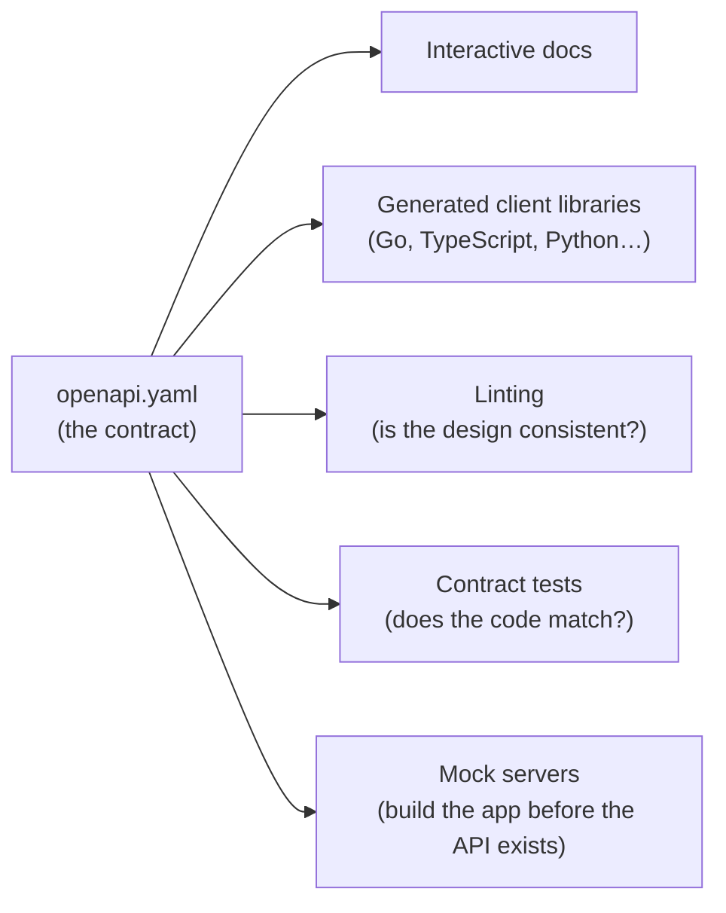

# 5.5 API contracts: OpenAPI, gRPC & versioning

In chapter 5.2 you designed snip's API, and in chapter 5.3 you made its errors consistent. But where is that design actually *written down*? Right now, the only complete description of snip's API is… snip's Go code. A developer at another company who wants to use snip would have to read Go, or guess. This chapter turns the API into a **contract**: a precise, machine-readable document that humans can read, tools can check, and code can be generated from. Then it looks at **gRPC**, the contract-first alternative popular between internal services, and at the hardest question in API work: **how do you change an API without breaking everyone?**

## What you'll learn

- Why a written **API contract** matters, and the difference between **contract-first** and **code-first**.
- **OpenAPI**: the standard format for describing HTTP APIs — reading snip's real `openapi.yaml`.
- What contracts unlock: **documentation**, **generated clients**, **linting** and **contract tests** that keep code honest.
- **gRPC and Protocol Buffers**: what they are, how they differ from REST+JSON, and when to choose them.
- **Versioning and compatibility**: which changes are safe, which break clients, and how to deprecate responsibly.

---

## Why write the contract down?

An API has many audiences: the team building it, frontend and mobile developers, other internal teams, outside companies, and — increasingly — tools and AI agents that call APIs automatically. All of them need the same answers: *which endpoints exist? What do I send? What comes back? What can go wrong?*

A written, machine-readable **contract** answers all of them in one place, and — unlike a wiki page — tools can **check** it:



There are two ways to arrive at a contract:

- **Contract-first**: write the contract, review it like any design, then implement it (possibly generating code from it). Best when several teams or outside users depend on the API.
- **Code-first**: write the code, then produce the contract — by hand or generated from annotations. Faster to start; the contract risks becoming an afterthought.

Either way, the rule is the same: **the contract and the code must not drift apart.** snip keeps them honest with automated checks (below).

:::note[Everyday anchor]
A contract is an architect's blueprint. Builders, electricians, plumbers and the council inspector all work from the same drawing. Without it, each works from memory and conversation — and the plumber's pipes end up exactly where the electrician put the wires.
:::

---

## OpenAPI: describing an HTTP API

**OpenAPI** (formerly called Swagger) is the standard format for describing HTTP APIs, written in YAML (chapter 1.3) or JSON. snip's is at `snip/api/openapi.yaml`. Here's its shape, trimmed:

```yaml
openapi: 3.1.0
info:
  title: snip API
  version: 1.0.0
servers:
  - url: http://localhost:8080
security:
  - apiKey: []                 # every endpoint needs a key unless it says otherwise

paths:
  /api/links:
    post:
      operationId: createLink
      summary: Create a short link
      requestBody:
        required: true
        content:
          application/json:
            schema:
              $ref: '#/components/schemas/CreateLinkRequest'
      responses:
        '201':
          description: Created
          content:
            application/json:
              schema: {$ref: '#/components/schemas/Link'}
        '400': {$ref: '#/components/responses/BadRequest'}
        '409':
          description: The custom slug is already taken (code `slug_taken`).
        # … 401, 413, 429, 500

components:
  schemas:
    CreateLinkRequest:
      type: object
      additionalProperties: false   # unknown fields are refused (chapter 5.3)
      required: [url]
      properties:
        url:  {type: string, format: uri, maxLength: 2048}
        slug: {$ref: '#/components/schemas/Slug'}
    Slug:
      type: string
      pattern: '^[A-Za-z0-9_-]{3,32}$'
    Error:
      type: object
      properties:
        error:
          properties:
            code:
              type: string
              enum: [invalid_json, invalid_url, invalid_slug, slug_taken, body_too_large,
                     unauthorized, not_found, rate_limited, internal]
            message: {type: string}
```

Reading it top to bottom:

- **`paths`** lists every URL, and under each, every **method** — with its request body and every possible **response**, including errors.
- **`components/schemas`** defines the data shapes once, and **`$ref`** reuses them. `Link`, `Error` and `Slug` appear in many places but are defined once.
- **Schemas** describe types, required fields and rules: `maxLength: 2048`, the slug `pattern`, `additionalProperties: false`. These are exactly snip's validation rules from chapter 5.3 — now visible to every client without reading Go.
- **`enum`** lists every error `code` snip can return. A client can handle each one confidently.
- **`security`** says the API needs a bearer token; the redirect and health endpoints override it with `security: []` (public).

:::info[In the real world]
Many teams publish their OpenAPI files, and tools turn them into polished interactive docs (Swagger UI, Redoc, Scalar) where developers can read and even try each endpoint. Stripe, GitHub and Twilio all publish OpenAPI descriptions of their APIs. AI agents and "tool use" features (chapter 14.6) also consume OpenAPI to learn how to call APIs.
:::

---

## Keeping contract and code in sync

A contract that's wrong is worse than none: people trust it. snip uses two automatic checks, both run by CI on every push (`.github/workflows/ci.yml`).

**1. Linting the contract.** A linter checks the OpenAPI file is valid and consistent:

```bash
npx @redocly/cli lint --config snip/api/redocly.yaml snip/api/openapi.yaml
```

The config file, `snip/api/redocly.yaml`, turns off three rules on purpose — each with a comment saying why (for example, `GET /{slug}` succeeds with a `302`, so a rule demanding a 2xx response doesn't fit). Switching a rule off with a written reason is fine; switching it off silently is how standards rot.

**2. A contract test.** `internal/httpapi/contract_test.go` reads every `writeError(…)` call in snip's HTTP code and fails if any error code isn't listed in the contract's `enum`:

```go
// TestErrorCodesAreInContract fails if a handler can send an error code that
// the OpenAPI contract (api/openapi.yaml) doesn't list — so clients reading
// the contract are never surprised (chapter 5.5).
func TestErrorCodesAreInContract(t *testing.T) {
	// … read openapi.yaml, collect the documented codes …
	// … scan the package's .go files for writeError(w, status, "code", …) …
	if code := string(m[1]); !documented[code] {
		t.Errorf("%s sends error code %q, which api/openapi.yaml does not document", f, code)
	}
}
```

Add a new error code to the Go code and forget the contract, and CI goes red. That's the whole trick: **make drift fail loudly.** Larger teams go further — generating server stubs or request validation from the contract, or running the contract's examples against the live API.

---

## gRPC and Protocol Buffers

REST with JSON is the default for public APIs. Between a company's own services, many teams use **gRPC** instead. gRPC is contract-first by design:

1. You describe the API in a **`.proto`** file using **Protocol Buffers** (protobuf), a language for defining messages and services.
2. A tool **generates** client and server code from it, in any major language.
3. Messages travel in a compact **binary** format over **HTTP/2** (chapter 1.5).

If snip offered gRPC, its contract might look like this (illustrative — snip itself doesn't ship a gRPC API):

```protobuf
syntax = "proto3";
package snip.v1;

service LinkService {
  rpc CreateLink(CreateLinkRequest) returns (Link);
  rpc GetLink(GetLinkRequest) returns (Link);
}

message CreateLinkRequest {
  string url  = 1;   // the numbers are field IDs used in the binary format — never reuse them
  string slug = 2;
}

message Link {
  string slug   = 1;
  string url    = 2;
  int64  clicks = 3;
}
```

| | REST + JSON | gRPC + protobuf |
|---|---|---|
| Contract | Optional (OpenAPI) | Required (`.proto`) |
| Format | Readable text | Compact binary |
| Speed | Good | Faster, smaller messages |
| Generated clients | Optional | Standard, for every major language |
| Streaming | Awkward | Built in (both directions) |
| Browsers & curl | Work directly | Need extra tooling |
| Typical use | Public APIs, web and mobile clients | Service-to-service inside a company |

A common pattern: **REST/JSON at the edge** (for browsers, mobile apps and partners), **gRPC inside** (between your own services). Chapter 8.1 discusses how services talk to each other more generally.

---

## Changing an API without breaking people

APIs must evolve: new features, better names, fixed mistakes. But every client in the wild was written against the old contract. The central question for every change is: **will existing clients keep working?**

### Safe (backward-compatible) changes

- Adding a **new endpoint**.
- Adding an **optional** request field (old clients just don't send it).
- Adding a **new field to a response** (well-behaved clients ignore fields they don't know).
- Adding a new **error code** — *if* clients were told to handle unknown codes gracefully.

### Breaking changes

- **Removing or renaming** a field or endpoint.
- Changing a field's **type or meaning** (`clicks` from a number to a string; `created_at` from UTC to local time).
- Making an optional field **required**.
- Changing **status codes** or error codes clients depend on.
- Tightening **validation** so previously accepted input is now rejected.

:::tip[Be a tolerant reader]
Clients should **ignore fields they don't recognise** and handle unknown enum values safely. Servers should be **strict about what they accept** but careful about what they change in what they send. This "tolerant reader" habit is what makes additive changes safe.
:::

### Versioning

When a breaking change is truly necessary, give it a new **version** and keep the old one running for a while:

- **In the URL**: `/api/v1/links` → `/api/v2/links`. The most common approach — visible and simple.
- **In a header**: `Accept: application/vnd.snip.v2+json`, or a date-based version like `Stripe-Version: 2024-06-20`. Keeps URLs stable.
- **In the package name** for gRPC: `package snip.v1;` → `snip.v2`.

snip's API is small and unversioned today; if it ever needed a breaking change, `/api/v2/…` routes could live alongside the current ones.

### Deprecation: breaking things politely

1. **Announce** the change and the timeline in docs and a changelog.
2. **Mark** the old behaviour as deprecated — OpenAPI has `deprecated: true`, and HTTP has `Deprecation` and `Sunset` response headers so clients can detect it automatically.
3. **Measure** who still uses it (metrics per version, chapter 13.2).
4. **Remove** it only after the announced date — and ideally after usage has dropped to zero.

:::warning[What can go wrong]
- **The contract drifts from reality.** Docs say `409`, the code returns `400`. Clients built from the docs break. Automate the checks.
- **"Harmless" renames.** Changing `short_url` to `shortUrl` for consistency breaks every client. Consistency is worth deciding early, not fixing late.
- **Reusing protobuf field numbers.** Giving a deleted field's number to a new field makes old and new programs misread each other's data. Retire numbers forever (`reserved 4;`).
- **Versioning everything.** A new version for every small change multiplies the code you maintain. Prefer additive, compatible changes; version only when you must.
:::

---

## Lab

Free, on your own computer (needs Node.js for the linter — install it with `brew install node` or `sudo apt install -y nodejs npm`, or skip step 2).

1. **Read the contract.** Open `~/code/zero-to-prod/snip/api/openapi.yaml`. Find:
   - the endpoint that has `security: []`, and why;
   - every possible response from `POST /api/links`;
   - the pattern a custom slug must match;
   - the full list of error codes.

   Compare it with the error table you walked in chapter 5.3's lab. Everything you discovered by experiment is written down here.

2. **Lint it.**
   ```bash
   cd ~/code/zero-to-prod
   npx @redocly/cli lint --config snip/api/redocly.yaml snip/api/openapi.yaml    # "Your API description is valid"
   npx @redocly/cli lint snip/api/openapi.yaml                                   # without the config: 4 warnings — read why each is off
   ```

3. **View it as documentation.**
   ```bash
   npx @redocly/cli build-docs snip/api/openapi.yaml -o /tmp/snip-api.html   # a self-contained HTML page
   ```
   Open `/tmp/snip-api.html` in your browser: a complete, readable reference, generated from the contract.

4. **Break the contract, watch the test catch it.** In `snip/api/openapi.yaml`, delete `rate_limited` from the error-code `enum`, then:
   ```bash
   cd snip && go test ./internal/httpapi/ -run Contract
   ```
   The test names the file and the undocumented code. Put `rate_limited` back and it passes. That's drift caught before it reaches a single client.

5. **Classify changes (no code).** For each proposed change to snip's API, decide: **safe** or **breaking**?
   - Add an optional `expires_at` field to `POST /api/links`.
   - Rename `clicks` to `click_count` in responses.
   - Return `created_at` with milliseconds.
   - Reject URLs longer than 1,000 characters (currently 2,048).
   - Add `GET /api/links/{slug}/clicks-by-day`.

## Self-check

<Quiz
  id="apis-api-contracts"
  questions={[
    {
      q: 'What is an OpenAPI file?',
      options: [
        'A library you import to build APIs',
        'A machine-readable description of an HTTP API: endpoints, requests, responses and errors',
        'A list of API keys',
        'A type of database',
      ],
      answer: 1,
      explain: 'OpenAPI describes the contract in YAML or JSON. Tools use it to produce docs, generate clients, lint the design and test that the code matches.',
    },
    {
      q: 'Which change to snip’s API is backward-compatible?',
      options: [
        'Renaming short_url to shortUrl',
        'Adding a new optional field, expires_at, to link responses',
        'Making slug a required field when creating links',
        'Changing clicks from a number to a string',
      ],
      answer: 1,
      explain: 'Adding optional or new response fields is safe for clients that ignore unknown fields. Renames, type changes and new requirements break existing clients.',
    },
    {
      q: 'When is gRPC usually a better choice than REST with JSON?',
      options: [
        'For public APIs used directly from browsers and curl',
        'For fast, strongly-typed communication between a company’s own services',
        'When you do not want a contract',
        'When the API has only one endpoint',
      ],
      answer: 1,
      explain: 'gRPC’s required contract, generated clients, binary format and streaming shine between internal services. Browsers and ad-hoc tools work more easily with REST/JSON.',
    },
    {
      q: 'How does snip stop its OpenAPI contract drifting from its code?',
      options: [
        'Someone checks it by hand before each release',
        'CI lints the contract and a Go test fails if code sends an error code the contract does not document',
        'The contract is generated from the database',
        'It does not — drift is unavoidable',
      ],
      answer: 1,
      explain: 'Automated checks make drift fail loudly on every push, so it is fixed while the change is fresh rather than discovered by a broken client.',
    },
  ]}
/>

<details>
<summary>Classify the five changes from lab step 5, with reasons.</summary>

- **Add optional `expires_at` to POST** — *safe*: old clients don't send it and are unaffected.
- **Rename `clicks` to `click_count`** — *breaking*: every client reading `clicks` gets nothing. (A compatible path: add `click_count`, keep `clicks`, deprecate it, remove later.)
- **`created_at` with milliseconds** — *probably safe* if clients parse ISO 8601 properly (it's still a valid timestamp); *breaking* for sloppy clients matching an exact string format. The tolerant-reader lesson: parse, don't pattern-match.
- **Reject URLs over 1,000 characters** — *breaking*: input that worked yesterday fails today. Tightening validation needs the same care as removing a field.
- **Add `GET /api/links/{slug}/clicks-by-day`** — *safe*: a brand-new endpoint.

</details>

<details>
<summary>Why do protobuf fields have numbers, and why must you never reuse a deleted field's number?</summary>

In protobuf's binary format, fields are identified by their **number**, not their name — that's part of why messages are so small. If you delete field `4` (`string title = 4`) and later add `int64 expires = 4`, an old program sending a title and a new program expecting an expiry will **silently misread each other's data**. Mark removed numbers as `reserved 4;` so the compiler stops anyone reusing them. Names can be changed freely; numbers are the real contract.

</details>
