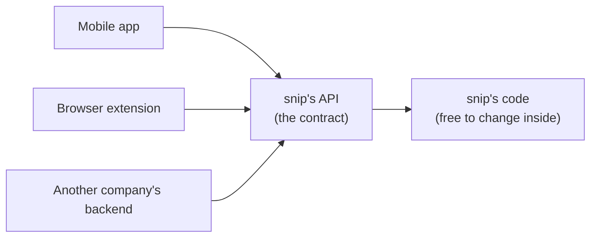

# 5.2 Designing REST APIs

snip v0 spoke in plain text: send a URL as the body, get a URL back as text. That's fine for a human with curl, and painful for everyone else. A mobile app, a browser extension, another company's backend — all of them need to talk to snip **reliably**, in a predictable format, with clear answers when things go wrong. The agreement they rely on is snip's **API** (Application Programming Interface). Once other people build on an API, it's very hard to change, so designing it well matters more than almost any code behind it. This chapter designs snip's real API, and teaches the conventions that make any HTTP API a pleasure — or a misery — to use.

## What you'll learn

- What an **API** is — a contract — and why changing one is so expensive.
- The **REST** style: **resources** named by URLs, **methods** as verbs, **status codes** as outcomes.
- How to shape **JSON** requests and responses consistently, including errors.
- **Pagination**, **filtering**, and **idempotency** — what happens when a request is retried.
- A checklist for reviewing any API design — then using snip's full API with curl.

---

## An API is a contract

An **API** is the set of requests a program accepts and the responses it promises to give back. For a web API: which URLs exist, which methods they accept, what the request bodies look like, and what comes back — including when things fail.



The API is a **promise**. snip's internals — Go code, database, cache — can change completely, and nobody notices, as long as the API behaves the same. But change the API itself — rename a field, change a status code, remove a URL — and every program built on it can break, often in places you don't control and can't see.

:::note[Everyday anchor]
An API is a restaurant menu. Customers order from the menu; they never walk into the kitchen. The kitchen can change its ovens, suppliers and staff as long as the dishes on the menu arrive as described. But quietly change what "the Tuesday special" means, or remove a dish, and regular customers get something they didn't order.
:::

---

## REST: resources, methods, status codes

Most web APIs follow a style called **REST** (Representational State Transfer). Stripped of theory, it's three habits that fit how HTTP already works (chapter 1.5):

1. **URLs name things (resources), not actions.** Nouns, not verbs.
2. **HTTP methods say what you want to do** with those things.
3. **Status codes say what happened.**

### 1. Resources and URLs

A **resource** is a thing your API deals with. snip's main resource is a **link**. Resources come in **collections** (all links) and **items** (one link):

| URL | Means |
|---|---|
| `/api/links` | the collection of your links |
| `/api/links/godoc` | one link, the one with slug `godoc` |

Compare with action-style URLs people invent when they don't use REST: `/createLink`, `/getLinkInfo?id=godoc`, `/deleteLink`. Every new action needs a new URL, and there's no pattern to guess. REST's nouns-plus-methods keeps the menu small and predictable.

### 2. Methods as verbs

| Method + URL | Action | Success |
|---|---|---|
| `POST /api/links` | create a link | `201 Created` |
| `GET /api/links` | list your links | `200 OK` |
| `GET /api/links/{slug}` | get one link, with its click count | `200 OK` |
| `DELETE /api/links/{slug}` | delete a link | `204 No Content` |
| `PATCH /api/links/{slug}` | change part of a link (a future feature) | `200 OK` |

The redirect itself, `GET /{slug}`, lives at the root on purpose: short links should be short. It's part of the product, not the management API.

### 3. Status codes as outcomes

Use the code that matches reality (chapter 1.5), so clients, proxies, monitoring and retry logic all behave correctly:

| Situation in snip | Status |
|---|---|
| Link created | `201 Created`, plus a `Location` header pointing at the new link |
| Link deleted | `204 No Content` (success, nothing to send back) |
| Body isn't valid JSON, or the URL is invalid | `400 Bad Request` |
| No or invalid API key | `401 Unauthorized` |
| Slug doesn't exist — *or belongs to someone else* | `404 Not Found` |
| Custom slug already taken | `409 Conflict` |
| Too many links created too fast | `429 Too Many Requests`, plus `Retry-After` |
| Something broke on snip's side | `500 Internal Server Error` |

Notice the choice for someone else's link: **404, not 403**. Answering "403 Forbidden" would confirm that the slug *exists* — leaking information to anyone probing. "404" says nothing (chapter 7.4).

---

## Shaping the JSON

Requests and responses use **JSON** (chapter 1.3), with `Content-Type: application/json`.

**Create a link:**

```http
POST /api/links
Authorization: Bearer snip_9fQ…
Content-Type: application/json

{"url": "https://go.dev/doc/", "slug": "godoc"}
```

```http
HTTP/1.1 201 Created
Location: /api/links/godoc
Content-Type: application/json

{
  "slug": "godoc",
  "url": "https://go.dev/doc/",
  "clicks": 0,
  "created_at": "2026-09-24T19:56:18.903Z",
  "short_url": "https://snip.example/godoc"
}
```

**List links:**

```json
{
  "links": [
    {"slug": "godoc", "url": "https://go.dev/doc/", "clicks": 42, "created_at": "…", "short_url": "…"},
    {"slug": "k7Qz2a", "url": "https://example.com", "clicks": 3, "created_at": "…", "short_url": "…"}
  ]
}
```

**Any error:**

```json
{"error": {"code": "slug_taken", "message": "that slug is already in use"}}
```

The conventions behind those shapes:

- **One naming style everywhere.** snip uses `snake_case` (`created_at`, `short_url`). Mixing `createdAt` and `short_url` in one API is a small, permanent annoyance for every client.
- **Timestamps in ISO 8601, UTC** (chapter 1.3): `2026-09-24T19:56:18Z`. Never `"24/09/26"`.
- **Return the created resource.** The client usually needs what the server generated (the slug, `created_at`, the short URL) — don't make it do a second request.
- **Wrap lists in an object** (`{"links": […]}`), not a bare array. Later you can add `"next_cursor"` or `"total"` alongside without breaking anyone.
- **One error shape for every error**, with a stable machine-readable `code` (programs switch on it) and a human `message` (people read it). Chapter 5.3 builds this.
- **Don't expose internals.** No database IDs, owner numbers or stack traces in responses (snip's `OwnerID` is hidden with `json:"-"`, chapter 4.2).

---

## Pagination and filtering

`GET /api/links` can't return a million links in one response. **Pagination** returns them in pages:

- **Limit/offset**: `?limit=20&offset=40` — "20 items, skipping the first 40". Simple, but slow for deep pages (the database still walks past the skipped rows, chapter 6.4) and items shift if new ones arrive while you page.
- **Cursor**: `?limit=20&cursor=eyJjcmVhdGVkX2F0Ijo…` — the server returns an opaque `next_cursor` meaning "continue after the last item you saw". Fast and stable, so most large APIs use it.

snip's list currently supports `?limit=` (up to 100, default 20), newest first; cursor pagination is a good exercise once you've read chapter 6.4.

**Filtering and sorting** use query parameters too: `GET /api/links?created_after=2026-09-01&sort=-clicks`. Keep names consistent across endpoints.

---

## Idempotency: what happens when a request is retried?

Networks fail (chapter 1.4). A client sends `POST /api/links`, the connection drops, and it never sees the response. **Did the link get created?** The client can't know. If it retries, it might create a duplicate.

An operation is **idempotent** if doing it twice has the same effect as doing it once:

| Method | Idempotent? | Why |
|---|---|---|
| `GET` | ✅ yes | Reading doesn't change anything (it's also **safe**) |
| `PUT` | ✅ yes | "Set this to X" twice leaves it as X |
| `DELETE` | ✅ yes | Deleting something already deleted leaves it deleted |
| `POST` | ❌ no | "Create a new one" twice creates two |
| `PATCH` | it depends | "set title to X" is; "add 1 to count" isn't |

This matters enormously for retries (chapter 8.4): clients and proxies may safely retry idempotent requests; retrying a `POST` blindly can double-charge a card or send an email twice.

The standard fix for important `POST`s is an **idempotency key**: the client generates a unique ID and sends it in a header (`Idempotency-Key: 7f3a…`). The server remembers the key with the result; a retry with the same key gets the original response instead of a second action. Payment APIs such as Stripe work this way. For snip, custom slugs give a natural version: retrying `POST` with the same `slug` returns `409 Conflict` instead of creating a duplicate.

:::info[In the real world]
Other API styles exist. **GraphQL** (one endpoint; the client asks for exactly the fields it wants) is popular with frontends that need flexible data. **gRPC** (chapter 5.5) is common between backend services for speed and strict contracts. REST over JSON remains the default for public APIs because every language and tool speaks it — curl included.
:::

---

## An API design checklist

Before shipping any new endpoint, check:

- [ ] **Nouns in URLs**, methods for verbs; plural collections (`/links`), items by ID (`/links/{slug}`).
- [ ] **Correct status codes**, including every error case.
- [ ] **Consistent naming** (one case style) and **ISO 8601 UTC** timestamps.
- [ ] **One error format**, with stable machine-readable codes.
- [ ] **Validation** of every input, with clear messages (chapter 5.3).
- [ ] **Authentication** and **authorization** on everything that isn't public (Part 7).
- [ ] **Pagination** for anything that can grow.
- [ ] **Idempotency** considered for anything that creates or charges.
- [ ] **No internal details** leaked (IDs, stack traces, other users' existence).
- [ ] **Documented** — ideally as an OpenAPI description (chapter 5.5).

:::warning[What can go wrong]
- **Verbs in URLs** (`/getLink`, `/deleteLink?id=`): the API grows into an unguessable pile of special cases.
- **`200 OK` with an error inside.** Monitoring, caches and clients all think it worked. Use real status codes.
- **Breaking changes without warning.** Renaming `short_url` to `shortUrl` "for consistency" breaks every client in production. Additive changes (new optional fields) are safe; removals and renames need versioning (chapter 5.5).
- **Leaking existence.** Different errors for "doesn't exist" and "not yours" let attackers enumerate your data.
- **Unbounded lists.** An endpoint that returns *everything* is fine on day one and an outage on day 400.
:::

---

## Lab

Free, on your own computer. You'll drive snip's full API.

1. **Start the reference snip** (in-memory) and copy its development key from the log line containing `api_key=`:
   ```bash
   cd ~/code/zero-to-prod/snip
   SNIP_LOG_FORMAT=text go run ./cmd/snip
   ```
   In a second terminal, save the key in a variable:
   ```bash
   KEY=snip_paste_your_key_here
   ```

2. **Create, read, list, delete.**
   ```bash
   curl -si -X POST localhost:8080/api/links -H "Authorization: Bearer $KEY" \
     -d '{"url":"https://go.dev/doc/","slug":"godoc"}'                 # 201 + Location header
   curl -s -X POST localhost:8080/api/links -H "Authorization: Bearer $KEY" \
     -d '{"url":"https://example.com"}' | jq .                         # a random slug
   curl -s -o /dev/null -w "%{http_code} → %{redirect_url}\n" localhost:8080/godoc   # follow it
   curl -s localhost:8080/api/links/godoc -H "Authorization: Bearer $KEY" | jq .clicks   # 1
   curl -s "localhost:8080/api/links?limit=10" -H "Authorization: Bearer $KEY" | jq '.links[].slug'
   curl -si -X DELETE localhost:8080/api/links/godoc -H "Authorization: Bearer $KEY" | head -1   # 204
   ```

3. **Walk the error table.** For each, predict the status code *before* running it:
   ```bash
   curl -s -X POST localhost:8080/api/links -d '{"url":"https://go.dev"}' | jq .       # no key
   curl -s -X POST localhost:8080/api/links -H "Authorization: Bearer $KEY" -d '{"url":"go.dev"}' | jq .
   curl -s -X POST localhost:8080/api/links -H "Authorization: Bearer $KEY" -d '{"url":"https://a.example","slug":"dup"}' >/dev/null
   curl -si -X POST localhost:8080/api/links -H "Authorization: Bearer $KEY" -d '{"url":"https://b.example","slug":"dup"}' | head -1
   curl -si localhost:8080/api/links/nope -H "Authorization: Bearer $KEY" | head -1
   ```
   Notice every error body has the same shape — `{"error": {"code": …, "message": …}}` — so a client needs one piece of code to handle all of them.

4. **Design exercise (no code).** snip wants a new feature: link **expiry** ("this link stops working after 7 days"). Write down: which URL and method would set it? What does the JSON look like (name, format)? What status does following an expired link return — `404` or `410 Gone`? Is your change backward-compatible for existing clients? Compare your answers with the checklist above.

## Self-check

<Quiz
  id="apis-designing-rest-apis"
  questions={[
    {
      q: 'Which is the most RESTful way to delete the link with slug godoc?',
      options: [
        'POST /deleteLink?slug=godoc',
        'GET /api/links/godoc/delete',
        'DELETE /api/links/godoc',
        'POST /api/links with {"action":"delete","slug":"godoc"}',
      ],
      answer: 2,
      explain: 'REST uses URLs for things and methods for actions: DELETE on the item’s URL. A GET that deletes is dangerous (chapter 1.5); action-style URLs grow into an unguessable mess.',
    },
    {
      q: 'A client asks for a link that exists but belongs to another user. What should snip return, and why?',
      options: [
        '403 Forbidden, because it is accurate and helps the client debug',
        '404 Not Found, so it doesn’t confirm the link exists',
        '200 with the link data, since reading a link is harmless',
        '409 Conflict, because the link belongs to someone else',
      ],
      answer: 1,
      explain: 'Returning 403 would confirm the slug exists, letting attackers probe other users’ data. 404 reveals nothing.',
    },
    {
      q: 'A mobile app’s POST /api/links times out, and it retries. What risk does that create?',
      options: [
        'None — POST is idempotent, so a retry changes nothing',
        'The link may be created twice: POST isn’t idempotent',
        'The server may crash handling two identical requests at once',
        'The API key may be revoked for sending duplicate requests',
      ],
      answer: 1,
      explain: 'The first request may have succeeded before the connection dropped. Retrying a non-idempotent POST can duplicate the action. Idempotency keys (or unique slugs) prevent that.',
    },
    {
      q: 'Why wrap list responses in an object like {"links": [...]} instead of returning a bare array?',
      options: [
        'JSON does not allow an array at the top level of a document',
        'So fields like next_cursor can be added later without breaking clients',
        'It makes responses smaller once they are compressed',
        'Arrays can’t be paginated, but objects can be split into pages',
      ],
      answer: 1,
      explain: 'An object leaves room to grow. Adding a field is backward-compatible; turning an array into an object later would break every client.',
    },
  ]}
/>

<details>
<summary>Why is changing an existing API so much harder than changing the code behind it?</summary>

Because the API is a **promise to people you don't control**. Once apps, scripts and other companies' backends depend on `short_url` being a field, or on `409` meaning "slug taken", changing it breaks their software — often in production, often without them noticing until users complain. You can refactor snip's internals any day because nothing outside depends on them. Additive changes (new optional fields, new endpoints) are safe; renames, removals and changed meanings need a versioning plan and a deprecation period (chapter 5.5).

</details>

<details>
<summary>Explain idempotency with an everyday example, and say which HTTP methods are idempotent.</summary>

Pressing a lift's call button is **idempotent**: pressing it five times has the same effect as once — one lift comes. Paying for coffee is **not**: tapping your card five times buys five coffees. `GET`, `PUT` and `DELETE` are idempotent (repeat them safely); `POST` is not (repeating can create or charge twice); `PATCH` depends on what it does. That's why retries — by clients, proxies or your own code — must be careful with `POST`, and why payment APIs use idempotency keys.

</details>
