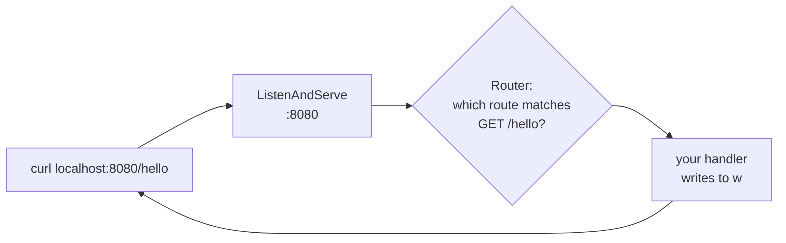

# 5.1 Your first HTTP server

Everything in the handbook so far has been leading here. You know what a server is (chapter 1.6), how HTTP requests and responses look (chapter 1.5), and enough Go to write real programs (Part 4). In this chapter you'll put them together and build **snip v0**: a link shortener that actually works, in about sixty lines of Go, with nothing but the standard library. Then — just as importantly — you'll poke at it until you find everything it *can't* do yet. That list becomes the roadmap for the rest of the handbook.

## What you'll learn

- How Go's **`net/http`** package turns a function into a web server: **handlers**, **`ResponseWriter`** and **`*Request`**.
- **Routing**: matching methods and paths like `POST /links` and `GET /{code}` to handlers.
- How to read a request (**path values**, **body**, **headers**) and write a response (**status code**, **headers**, **body**, **redirects**).
- How to **test your server by hand** with `curl`, and read what comes back.
- What snip v0 gets **wrong** — and which chapter fixes each problem.

---

## The smallest possible web server

Here's a complete Go web server:

```go
package main

import (
	"fmt"
	"net/http"
)

func main() {
	http.HandleFunc("GET /hello", func(w http.ResponseWriter, r *http.Request) {
		fmt.Fprintln(w, "Hello from my server!")
	})
	http.ListenAndServe(":8080", nil)
}
```

Three ideas are packed in there:

1. **A handler** is a function with the signature `func(w http.ResponseWriter, r *http.Request)`. Go calls it once for each matching request.
   - **`r *http.Request`** is everything the client sent: method, URL, headers, body.
   - **`w http.ResponseWriter`** is how you answer: you write the status code, headers and body into it.
2. **`http.HandleFunc("GET /hello", …)`** registers the handler for a **route**: requests with method `GET` and path `/hello`.
3. **`http.ListenAndServe(":8080", nil)`** claims port 8080 (chapter 1.4) and enters the wait-forever loop (chapter 1.6), starting a goroutine for each connection (chapter 4.5).



:::note[Everyday anchor]
The server is a switchboard operator. `ListenAndServe` is them sitting down at the switchboard. Each `HandleFunc` is a sticky note: *"calls for GET /hello → put them through to this person."* Each handler is the person who picks up, hears the caller (`r`), and answers (`w`).
:::

---

## snip v0

Here's the whole of snip v0, from the repository at `snip/examples/v0/main.go`:

```go
// snip v0 — the whole link shortener in one file (chapter 5.1).
// Links live in a map in memory, so they vanish when the program stops.
package main

import (
	"crypto/rand"
	"fmt"
	"io"
	"log"
	"net/http"
	"strings"
	"sync"
)

var (
	mu    sync.Mutex            // protects links: many requests can arrive at once
	links = map[string]string{} // short code -> long URL
)

func main() {
	http.HandleFunc("POST /links", shorten) // create a short link
	http.HandleFunc("GET /{code}", follow)  // follow a short link
	log.Println("snip v0 listening on http://localhost:8080")
	log.Fatal(http.ListenAndServe(":8080", nil))
}

func shorten(w http.ResponseWriter, r *http.Request) {
	body, _ := io.ReadAll(io.LimitReader(r.Body, 2048))
	long := strings.TrimSpace(string(body))
	if !strings.HasPrefix(long, "http://") && !strings.HasPrefix(long, "https://") {
		http.Error(w, "send a URL starting with http:// or https://", http.StatusBadRequest)
		return
	}
	code := rand.Text()[:6] // random letters and digits
	mu.Lock()
	links[code] = long
	mu.Unlock()
	fmt.Fprintf(w, "http://localhost:8080/%s\n", code)
}

func follow(w http.ResponseWriter, r *http.Request) {
	mu.Lock()
	long, ok := links[r.PathValue("code")]
	mu.Unlock()
	if !ok {
		http.NotFound(w, r)
		return
	}
	http.Redirect(w, r, long, http.StatusFound)
}
```

Every piece is something you've learned. Let's walk through it.

### The data: a map and a mutex

```go
var (
	mu    sync.Mutex
	links = map[string]string{}
)
```

A **map** from short code to long URL (chapter 4.2), shared by every request. Because each request runs in its own goroutine (chapter 4.5), every access takes the **mutex** — otherwise two simultaneous `POST`s could corrupt the map.

### Routing

```go
http.HandleFunc("POST /links", shorten)
http.HandleFunc("GET /{code}", follow)
```

Since Go 1.22, route patterns include the **method** and can have **wildcards** in braces. `GET /{code}` matches `GET /abc123`, and the handler reads the matched part with `r.PathValue("code")`. If a request matches a path but not a method — say `DELETE /links` — Go answers `405 Method Not Allowed` automatically.

### Reading the request

```go
body, _ := io.ReadAll(io.LimitReader(r.Body, 2048))
long := strings.TrimSpace(string(body))
```

The request **body** is a stream (chapter 2.3). `io.LimitReader` stops reading after 2,048 bytes, so nobody can make the server read a 10 GB upload into memory — the first of many "never trust the client" habits (chapter 7.5).

### Validating and answering with errors

```go
if !strings.HasPrefix(long, "http://") && !strings.HasPrefix(long, "https://") {
	http.Error(w, "send a URL starting with http:// or https://", http.StatusBadRequest)
	return
}
```

`http.Error` writes a status code — here **400 Bad Request**, "the client made a mistake" (chapter 1.5) — and a message. The `return` matters: without it, the handler would carry on and also create a link.

### Answering with a redirect

```go
http.Redirect(w, r, long, http.StatusFound)
```

This writes status **302 Found** and a `Location` header — exactly what `curl -I http://github.com` showed you in chapter 0.3. The browser does the rest.

:::info[If you've written code]
If you've used Express (Node), Flask (Python) or Sinatra (Ruby), this will feel familiar: `app.get("/:code", (req, res) => …)` is the same idea as `http.HandleFunc("GET /{code}", …)`. The difference is that Go's standard library is production-grade by itself — many Go services never add a web framework at all, and snip doesn't.
:::

---

## Talking to your server with curl

Start it:

```bash
cd ~/code/zero-to-prod/snip
go run ./examples/v0
```

In a second terminal:

```bash
curl -X POST localhost:8080/links -d 'https://go.dev'
# → http://localhost:8080/WKEAX6          (your code will differ)

curl -i localhost:8080/WKEAX6
# HTTP/1.1 302 Found
# Location: https://go.dev

curl -i -X POST localhost:8080/links -d 'go.dev'
# HTTP/1.1 400 Bad Request
# send a URL starting with http:// or https://

curl -i localhost:8080/nothing-here
# HTTP/1.1 404 Not Found
```

- `-X POST` sets the method; `-d '…'` sends a body (and implies POST).
- `-i` shows the **status line and headers** as well as the body. Always use it when debugging an API.

Open `http://localhost:8080/WKEAX6` (your code) in a browser, and it lands on go.dev. **You built a working link shortener.**

---

## Everything v0 gets wrong

Now the honest part. snip v0 works in a demo and fails in real life in at least eight ways. Each one is a real engineering problem, and each has a chapter:

| Problem with v0 | Why it matters | Fixed in |
|---|---|---|
| Links live in a map in memory | Restart the program and **every link is gone** (chapter 1.1) | 6.1, 6.6 — Postgres |
| One program on one machine | If it crashes, snip is **down**; it can't handle more traffic than one machine | 8.3, 8.6, Part 10 |
| Anyone can create links | Spammers can flood it; nobody owns any link, so nobody can delete one | 7.2, 7.4 — API keys, ownership |
| Requests and responses are plain text | Programs calling snip must parse ad-hoc text; errors have no structure | 5.2, 5.3 — a JSON API |
| URL validation is a prefix check | `https://` alone passes; there's no length limit on stored URLs | 5.3 |
| Codes are 6 random characters with no collision check | Two links could get the **same code**, and the second silently replaces the first | 6.3, 6.5 |
| No logs, no metrics, no health check | When something goes wrong, you're blind | 5.4, Part 13 |
| No limits on how fast anyone calls it | One client can overwhelm it | 8.4 — rate limiting |

The reference snip in `cmd/snip` fixes every one of these. The next chapters build those fixes one at a time, and each chapter shows the real code that does it.

:::warning[What can go wrong]
- **Forgetting `return` after writing an error.** The handler keeps running and may write a second response (Go logs `http: superfluous response.WriteHeader call`) or do work it shouldn't.
- **Writing the body before the status.** Once you write any body, Go sends status 200 and the headers immediately. Set headers and call `WriteHeader` *before* writing the body.
- **Using `http.ListenAndServe` directly in production.** It has no timeouts, so slow or malicious clients can hold connections open forever. The real snip configures an `http.Server` with timeouts (chapter 5.4).
- **Port already in use.** `listen tcp :8080: bind: address already in use` — another copy (or the reference snip) is still running (chapter 1.4).
:::

---

## Lab

Free, on your own computer.

1. **Run snip v0 and use it** exactly as in [Talking to your server with curl](#talking-to-your-server-with-curl). Then restart it (<kbd>Ctrl</kbd>+<kbd>C</kbd>, run again) and try your old short link. Gone — that's problem #1 in the table, felt first-hand.

2. **Build your own copy.** Don't copy-paste — type it. In a new folder:
   ```bash
   mkdir -p ~/code/my-snip && cd ~/code/my-snip
   go mod init my-snip
   code main.go
   ```
   Type snip v0 into `main.go` from the listing above, run it with `go run .`, and test it with curl. Fix every compile error by reading it (chapter 4.1). Typing it yourself is where the understanding happens.

3. **Add a feature: a stats page.** Add a route `GET /stats` that prints how many links exist. Hint:
   ```go
   http.HandleFunc("GET /stats", func(w http.ResponseWriter, r *http.Request) {
   	mu.Lock()
   	n := len(links)
   	mu.Unlock()
   	fmt.Fprintf(w, "%d links\n", n)
   })
   ```
   Notice something: `GET /stats` and `GET /{code}` both match the path `/stats`. Go picks the **more specific** pattern — the literal `/stats` wins over the wildcard. (The real snip relies on the same rule for `/healthz` and `/metrics`.)

4. **Find a bug on purpose.** In your copy, remove the `return` after `http.Error` in `shorten`, and send a bad URL. What happens? Read the server's log. Put the `return` back.

## Self-check

<Quiz
  id="apis-first-http-server"
  questions={[
    {
      q: 'In func(w http.ResponseWriter, r *http.Request), what are w and r?',
      options: [
        'w is the request being written in, r is the response being read',
        'r is what the client sent; w is how you write the reply',
        'Both are the request body: w to write to it, r to read it',
        'They are the server’s write buffer and read buffer for the socket',
      ],
      answer: 1,
      explain: 'r (the Request) holds the method, URL, headers and body from the client. w (the ResponseWriter) is where you write the status, headers and body you send back.',
    },
    {
      q: 'What does the route pattern GET /{code} match, and how does the handler get the code?',
      options: [
        'Only the literal path /{code}, braces included; it can’t read it',
        'Any GET /something; the handler reads r.PathValue("code")',
        'Every method on every path, and code holds the whole path',
        'Only GET requests whose query string contains code=something',
      ],
      answer: 1,
      explain: 'Braces mark a wildcard. The matched segment is available via r.PathValue with the wildcard’s name.',
    },
    {
      q: 'Why does snip v0 wrap the request body with io.LimitReader(r.Body, 2048)?',
      options: [
        'To make reading faster by reading the body in 2 KB blocks',
        'So a client can’t make it read a huge body into memory',
        'Because URLs are always padded to exactly 2048 bytes',
        'LimitReader decrypts the body in 2048-byte pieces for safety',
      ],
      answer: 1,
      explain: 'Never trust the client: without a limit, a huge upload could exhaust the server’s memory. Limiting input is a basic defence.',
    },
    {
      q: 'You restart snip v0 and every short link returns 404. Why?',
      options: [
        'The router cleared the map because the routes were registered again',
        'Links lived only in memory, lost when the process stopped',
        'The codes expired after one minute, as short links always do',
        'curl caches the old 404s and keeps showing them after a restart',
      ],
      answer: 1,
      explain: 'A process’s memory disappears when it exits (chapters 1.1 and 1.2). Durable data needs storage — which is what Part 6 adds.',
    },
  ]}
/>

<details>
<summary>Why does snip v0 need a mutex around the map, even though it's such a small program?</summary>

Because Go's HTTP server handles **each request in its own goroutine** (chapter 4.5). Two people creating links at the same moment means two goroutines writing to the same map at once — a data race that can corrupt the map or crash the program with `concurrent map writes`. Size doesn't matter; concurrency does. The mutex makes each read or write happen one at a time.

</details>

<details>
<summary>Pick two problems from the "Everything v0 gets wrong" table and explain what a user would actually experience.</summary>

Examples:
- **Memory-only storage:** a user shares a short link on social media; the server restarts for an update; everyone who clicks it now gets **404 Not Found**. Their link is simply gone.
- **No collision check:** two users happen to get the same random code; the second user's link **silently overwrites** the first, so the first user's audience is sent to a stranger's URL — a correctness bug and potentially a security problem.
- **No rate limiting:** a spammer's script creates a million links in minutes; memory fills up and the server slows to a crawl or crashes for everyone.

Each of these is fixed in a later chapter — and each fix is a core backend skill.

</details>
