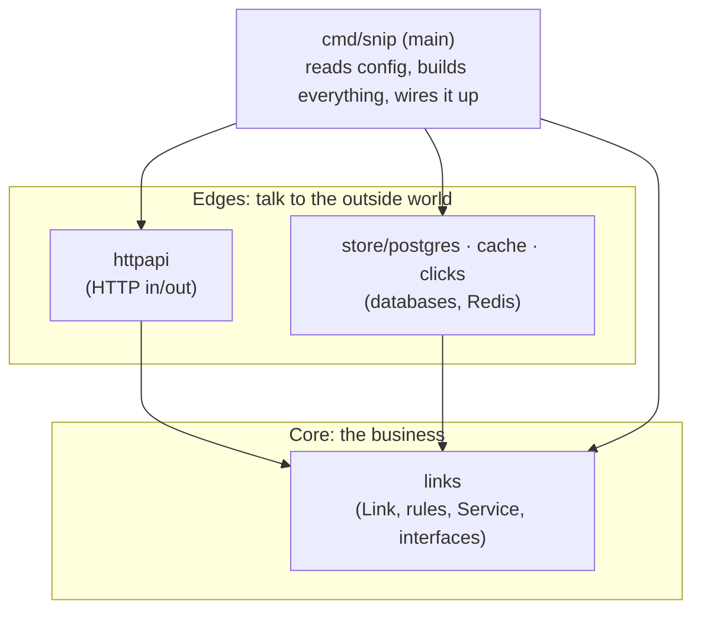
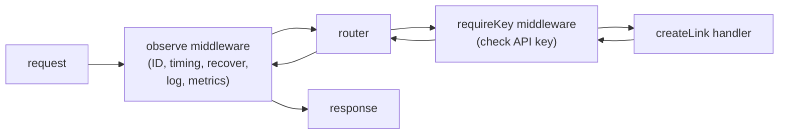

# 5.4 Structuring a real service

snip v0 worked — in a demo. The reference snip in `cmd/snip` does the same job, but it's built to **run for months, be operated by people who didn't write it, and fail in ways you can diagnose at 3 a.m.** The difference isn't cleverness; it's a set of well-worn habits that nearly every production service shares, whatever the language. This chapter walks through them in snip's real code: how it's layered, how it's configured, how it logs, what wraps every request, how it protects itself from slow clients, how it tells the world it's healthy, and how it stops without dropping anyone.

## What you'll learn

- **Layered structure**: the domain in the middle, HTTP and databases at the edges, `main` wiring them together — and why dependencies point inward.
- **Configuration from environment variables**, validated at startup so mistakes fail *fast*.
- **Structured logging**: JSON log lines with fields you can search, instead of prose.
- **Middleware**: code that wraps every request — request IDs, logging, metrics, panic recovery, authentication.
- **Timeouts**, **health vs readiness checks**, and **graceful shutdown**: the operational trio every service needs.

---

## Layers: the domain in the middle

snip's packages (chapter 4.3) form layers, like an onion:



- The **core** (`internal/links`) knows what a link *is* and the rules for it. It knows nothing about HTTP, JSON, SQL or Redis. It declares **interfaces** for what it needs (`Store`, `Cache`, `ClickRecorder`).
- The **edges** translate between the core and the outside world: `httpapi` turns HTTP requests into calls on `links.Service`; `store/postgres` turns `Store` calls into SQL.
- **`main`** is the only place that knows about everything. It reads configuration, builds the concrete pieces, and injects them (chapter 4.3's dependency injection).

The key rule: **dependencies point inward.** `httpapi` imports `links`; `links` never imports `httpapi`. That's why you could add a command-line interface or swap Postgres for another database without touching the business rules — and why the core can be tested in microseconds with fakes (chapter 4.4).

:::note[Everyday anchor]
Think of a restaurant. The **kitchen** (core) knows recipes and food safety rules. The **front of house** (HTTP layer) takes orders in whatever language customers speak and turns them into kitchen tickets. The **suppliers** (database, cache) deliver ingredients to the kitchen's back door. The **manager** (main) hires everyone and sets up who talks to whom. The kitchen never needs to know whether orders arrived by phone, app or in person.
:::

:::info[In the real world]
You'll hear this idea called **clean architecture**, **hexagonal architecture** or **ports and adapters**. The names differ; the core idea — business logic in the middle, depending on interfaces, with technology at the edges — is the same. Don't over-apply it: a 200-line service doesn't need twelve layers. snip uses just enough.
:::

---

## Configuration from the environment

A service runs in many places — your laptop, CI, staging, production — each with different database addresses, log levels and secrets. The **same built program** must run in all of them (chapter 2.2), so settings come from **environment variables**, never from code. From `internal/config/config.go`:

```go
// Config holds every setting snip reads at startup.
type Config struct {
	HTTPAddr    string        // SNIP_HTTP_ADDR, default ":8080"
	BaseURL     string        // SNIP_BASE_URL, used to build short links
	DatabaseURL string        // SNIP_DATABASE_URL; empty = in-memory store
	RedisAddr   string        // SNIP_REDIS_ADDR (host:port); empty = no cache/queue
	CacheTTL    time.Duration // SNIP_CACHE_TTL, default 1h
	RateLimit   int           // SNIP_RATE_LIMIT: link creations per key per minute
	LogLevel    slog.Level    // SNIP_LOG_LEVEL: debug|info|warn|error
	LogFormat   string        // SNIP_LOG_FORMAT: json|text
}

// Load reads the environment. It returns an error for malformed values
// rather than silently falling back — a typo in production config should
// stop the program at startup, not surprise you at 3 a.m.
func Load() (Config, error) {
	// … read each SNIP_* variable, apply defaults, parse and check types …
	if c.RateLimit, err = strconv.Atoi(env("SNIP_RATE_LIMIT", "60")); err != nil || c.RateLimit < 1 {
		return c, fmt.Errorf("SNIP_RATE_LIMIT: must be a positive integer")
	}
	// …
}
```

Three habits:

- **One place** defines every setting, its variable name, its default and its meaning. Anyone can see how to configure snip by reading one file (and snip's README table).
- **Sensible defaults** for development, so `go run ./cmd/snip` just works.
- **Fail fast.** `SNIP_RATE_LIMIT=sixty` stops snip **at startup** with a clear message. The alternative — silently using a default — means you discover the typo weeks later, in production, as mysteriously wrong behaviour.

This follows the **Twelve-Factor App** guidelines (12factor.net), a widely used checklist for services that run well on modern platforms. Two of its factors show up constantly in this handbook: *store config in the environment*, and *treat logs as event streams*.

:::danger
Secrets like `SNIP_DATABASE_URL` (which contains a password) come from the environment too — but never from a file committed to Git. Chapter 7.6 covers where secrets should actually live.
:::

---

## Structured logs

A log line like `user 42 created link godoc in 12ms` is easy for a human to read and hard for a computer to search. "Show me every request slower than 500 ms" means writing fragile text-matching. **Structured logging** writes each event as **named fields** — usually as JSON (chapter 1.3):

```json
{"time":"2026-09-24T19:56:19Z","level":"INFO","msg":"request","request_id":"3f9a2c71d0b4e815","method":"POST","route":"POST /api/links","path":"/api/links","status":201,"duration_ms":12}
```

Now "slow requests" is `jq 'select(.duration_ms > 500)'` (chapter 2.3), and log platforms (chapter 13.1) can filter, count and graph any field. Go has this built in, in the **`log/slog`** package. snip creates its logger from config (`internal/config/config.go`):

```go
func (c Config) Logger() *slog.Logger {
	opts := &slog.HandlerOptions{Level: c.LogLevel}
	if c.LogFormat == "text" {
		return slog.New(slog.NewTextHandler(os.Stdout, opts)) // key=value — nicer for humans in development
	}
	return slog.New(slog.NewJSONHandler(os.Stdout, opts))     // JSON — for machines in production
}
```

And logs with a message plus key–value pairs:

```go
log.Info("snip listening", "addr", cfg.HTTPAddr, "base_url", cfg.BaseURL)
log.Warn("click not recorded", "slug", slug, "err", err)
```

Notice snip writes to **stdout** and never manages log files. Whatever runs it — your terminal, systemd's journal (chapter 2.5), Docker, Kubernetes — collects stdout. The service does one job; the platform handles the logs.

**Log levels** let you control the volume: `DEBUG` (very detailed, off in production), `INFO` (normal events), `WARN` (something odd, but handled), `ERROR` (something failed and needs attention).

:::warning
Never log secrets: passwords, full API keys, tokens, or personal data you don't need. Logs are copied, shipped and kept far longer than you expect, and are read by many people (chapter 13.1).
:::

---

## Middleware: wrapping every request

Some jobs apply to **every** request: give it an ID, time it, log it, count it, recover if it panics, check its API key. Writing that in every handler would be repetitive and easy to forget. Instead, snip wraps handlers in **middleware**: a function that takes a handler and returns a new handler that does something before and/or after calling it.



The core of snip's `observe` middleware (`internal/httpapi/middleware.go`, trimmed):

```go
func (s *Server) observe(next http.Handler) http.Handler {
	return http.HandlerFunc(func(w http.ResponseWriter, r *http.Request) {
		start := time.Now()
		id := newRequestID()                          // (or reuse the caller's X-Request-ID)
		w.Header().Set("X-Request-ID", id)
		rec := &statusRecorder{ResponseWriter: w, status: http.StatusOK}

		defer func() {                                // runs AFTER the handler, even if it panics
			if p := recover(); p != nil {
				s.log.ErrorContext(r.Context(), "panic", "panic", p, "request_id", id)
				if !rec.wroteHeader {                 // too late for an error page if the response had started
					writeError(rec, http.StatusInternalServerError, "internal", "something went wrong on our side")
				}
			}
			s.metrics.Requests.WithLabelValues(r.Pattern, r.Method, strconv.Itoa(rec.status)).Inc()
			s.log.InfoContext(r.Context(), "request",
				"request_id", id, "method", r.Method, "route", r.Pattern,
				"status", rec.status, "duration_ms", time.Since(start).Milliseconds())
		}()
		next.ServeHTTP(rec, r)                        // call the real handler
	})
}
```

- It wraps the `ResponseWriter` in a `statusRecorder` so it can learn which status code the handler wrote.
- The `defer` runs after the handler finishes — or panics — so every request gets exactly one log line and one metric, whatever happened.
- It logs the **route pattern** (`GET /{slug}`), not just the path (`/k7Qz2a`): patterns are few, so they make good metric labels (chapter 13.2).

`requireKey` (chapter 7.2) is middleware too, applied only to the `/api/…` routes:

```go
mux.HandleFunc("POST /api/links", s.requireKey(s.createLink))
```

:::info[If you've written code]
Express's `app.use(...)`, Django's middleware and ASP.NET's pipeline are the same idea. In Go, middleware is just a function `func(http.Handler) http.Handler` — no framework needed.
:::

---

## Timeouts: protecting yourself from slow clients

`http.ListenAndServe(":8080", nil)` (snip v0) has **no timeouts**. A client can open a connection and send one byte every minute, forever, holding a goroutine and a file descriptor (chapter 2.2) the whole time. A few thousand of those — an attack called **Slowloris** — can exhaust a server without much traffic at all. The real snip configures every timeout (`cmd/snip/main.go`):

```go
srv := &http.Server{
	Addr:              cfg.HTTPAddr,
	Handler:           api.Handler(),
	ReadHeaderTimeout: 5 * time.Second,  // headers must arrive within 5s
	ReadTimeout:       10 * time.Second, // the whole request within 10s
	WriteTimeout:      15 * time.Second, // the response must be written within 15s
	IdleTimeout:       60 * time.Second, // idle keep-alive connections closed after 60s
}
```

Every wait needs a limit — inbound (these), and outbound: database calls carry the request's context (chapter 4.5), and readiness pings have their own 2-second timeout. **A service with no timeouts has no upper bound on how long it can hang.**

---

## Health vs readiness

Platforms that run services (systemd with watchdogs, load balancers, Kubernetes) keep asking two different questions. snip answers each on its own endpoint.

| | `GET /healthz` — **liveness** | `GET /readyz` — **readiness** |
|---|---|---|
| Question | "Is the process alive and not stuck?" | "Can it serve real traffic right now?" |
| snip checks | nothing — if it can answer, it's alive | pings Postgres and Redis (2s timeout) |
| On failure, the platform… | **restarts** the process | **stops sending it traffic** until ready again |

Why keep them separate? Imagine Postgres has a 30-second blip. If `/healthz` checked the database, every copy of snip would fail its health check at once, and the platform would **restart all of them** — making the outage worse and slower to recover. Instead, `/readyz` fails, traffic pauses, and when Postgres returns, snip is ready instantly. Liveness should only fail when *restarting would actually help*.

```json
GET /readyz → 503
{"ready": false, "checks": {"postgres": "unavailable", "redis": "ok"}}
```

You'll wire these into Kubernetes' liveness and readiness probes in chapter 10.2.

---

## Graceful shutdown, revisited

Chapter 4.5 walked through the code; here's why it matters operationally. Services are stopped **all the time**: every deployment, every scale-down, every machine maintenance. If stopping means killing the process mid-request, every deploy drops some users' requests. snip instead:

1. Receives **SIGTERM** from systemd, Docker or Kubernetes.
2. Stops accepting new connections (the platform is also moving traffic elsewhere).
3. Lets in-flight requests finish — for up to 10 seconds.
4. Exits cleanly with code 0.

The result: deploying a new version many times a day (Part 11) causes **zero** failed requests.

:::warning[What can go wrong]
- **Config in code.** A database address hard-coded "just for now" ends up in production — pointing at the wrong database, or leaking a password into Git.
- **Silent config fallbacks.** A misspelled variable quietly replaced by a default leads to baffling behaviour much later. Fail fast at startup.
- **Unstructured, noisy logs.** Multi-line prose logs with no request ID can't be searched when it matters.
- **No timeouts.** The service hangs forever on a slow client, a stuck database, or a dead downstream service — and so does everything waiting on it.
- **Liveness checks that test dependencies.** One database blip triggers mass restarts — a self-inflicted outage.
:::

---

## Lab

Free, on your own computer, in `~/code/zero-to-prod/snip`.

1. **Fail fast on bad config.**
   ```bash
   SNIP_RATE_LIMIT=sixty go run ./cmd/snip        # snip: SNIP_RATE_LIMIT: must be a positive integer
   SNIP_LOG_LEVEL=loud go run ./cmd/snip          # another clear refusal
   SNIP_HTTP_ADDR=:9000 SNIP_LOG_FORMAT=text go run ./cmd/snip   # valid: listens on 9000, human-friendly logs
   ```

2. **Read structured logs.** Run snip with JSON logs, sending them through `jq` (chapter 2.3):
   ```bash
   go run ./cmd/snip 2>&1 | jq -c 'select(.msg == "request") | {route, status, duration_ms, request_id}'
   ```
   In another terminal, make a few requests (`curl localhost:8080/healthz`, `curl localhost:8080/nope123`, `curl localhost:8080/`). Notice `/healthz` isn't logged — snip skips it on purpose so health checks don't drown real traffic.

3. **Watch a timeout defend the server.** With snip running, open a raw connection and send nothing (chapter 1.4):
   ```bash
   time nc localhost 8080 < /dev/null   # connect, send nothing, wait for the server to hang up
   ```
   After about 5 seconds the connection closes by itself (`real 0m5.0s`): `ReadHeaderTimeout` refused to let a silent client hold it open. Now try the same against snip v0 (`go run ./examples/v0`): it waits forever — press <kbd>Ctrl</kbd>+<kbd>C</kbd> to give up.

4. **Compare health and readiness.**
   ```bash
   curl -s localhost:8080/healthz; echo
   curl -s localhost:8080/readyz; echo      # in-memory mode: no dependencies to check → ready
   ```
   Once you run snip with Postgres (chapter 6.6), stop Postgres and try again: `/healthz` stays `ok`, `/readyz` turns `503`. That's the difference that prevents restart storms.

## Self-check

<Quiz
  id="apis-structuring-a-real-service"
  questions={[
    {
      q: 'In snip’s layers, which statement is true?',
      options: [
        'links imports httpapi so it can write responses',
        'httpapi and store/postgres depend on links; links depends on neither',
        'Every package imports every other package',
        'main contains the business rules',
      ],
      answer: 1,
      explain: 'Dependencies point inward: the edges (HTTP, database) depend on the core, which only declares interfaces. That keeps the business rules independent of technology and easy to test.',
    },
    {
      q: 'Why does snip refuse to start when SNIP_RATE_LIMIT=sixty?',
      options: [
        'Because rate limits must be above 100',
        'Failing fast turns a config typo into an obvious startup error instead of mysterious behaviour later',
        'Because environment variables cannot contain letters',
        'To save memory',
      ],
      answer: 1,
      explain: 'Silently falling back to a default hides mistakes until they cause trouble in production. A clear refusal at startup is found and fixed immediately.',
    },
    {
      q: 'Postgres is unreachable for 30 seconds. What should snip’s /healthz and /readyz report?',
      options: [
        'Both fail, so the platform restarts snip',
        '/healthz stays OK (the process is fine); /readyz fails, so traffic pauses until Postgres returns',
        'Both stay OK',
        '/healthz fails and /readyz stays OK',
      ],
      answer: 1,
      explain: 'Restarting snip would not fix Postgres and would slow recovery. Readiness pauses traffic; liveness only fails when a restart would actually help.',
    },
    {
      q: 'What problem do the http.Server timeouts in snip solve?',
      options: [
        'They make responses faster',
        'Slow or silent clients cannot hold connections open forever and exhaust the server',
        'They limit the number of links',
        'They encrypt the connection',
      ],
      answer: 1,
      explain: 'Without timeouts, a client can trickle data (Slowloris) and tie up resources indefinitely. Every wait in a service needs an upper bound.',
    },
  ]}
/>

<details>
<summary>What is middleware, and why is it better than putting logging and request IDs in every handler?</summary>

Middleware is a function that **wraps a handler**, running code before and after it — for every request that passes through. snip's `observe` middleware gives each request an ID, recovers panics, and records one log line and metrics. Putting that in every handler would mean repeating it in each one, and the one handler someone forgets becomes the blind spot during an incident. Middleware makes cross-cutting behaviour **automatic and consistent**, and keeps handlers focused on their actual job.

</details>

<details>
<summary>Name four things snip does that snip v0 doesn't, and the problem each one prevents.</summary>

Any four of:
- **Config from the environment, validated at startup** → typos become immediate errors, and one build runs everywhere.
- **Structured JSON logs with request IDs** → incidents can be searched and traced.
- **Middleware with panic recovery** → a bug returns a clean `500` instead of a dropped connection.
- **Server timeouts** → slow or malicious clients can't exhaust the server.
- **`/healthz` and `/readyz`** → platforms can restart or route around problems correctly.
- **Graceful shutdown** → deploys don't drop in-flight requests.
- **Layers and interfaces** → storage can be swapped and logic tested without a database.

</details>
