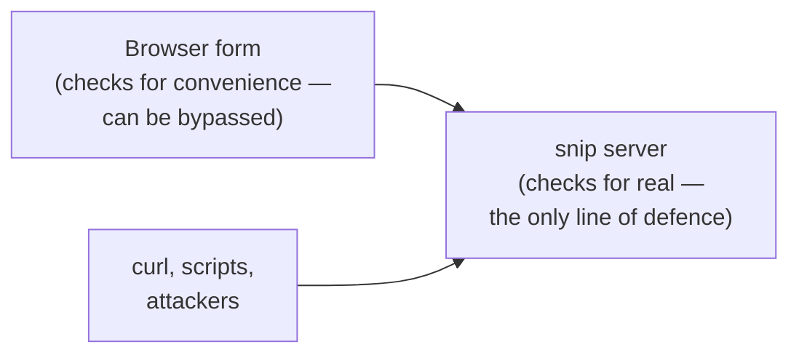
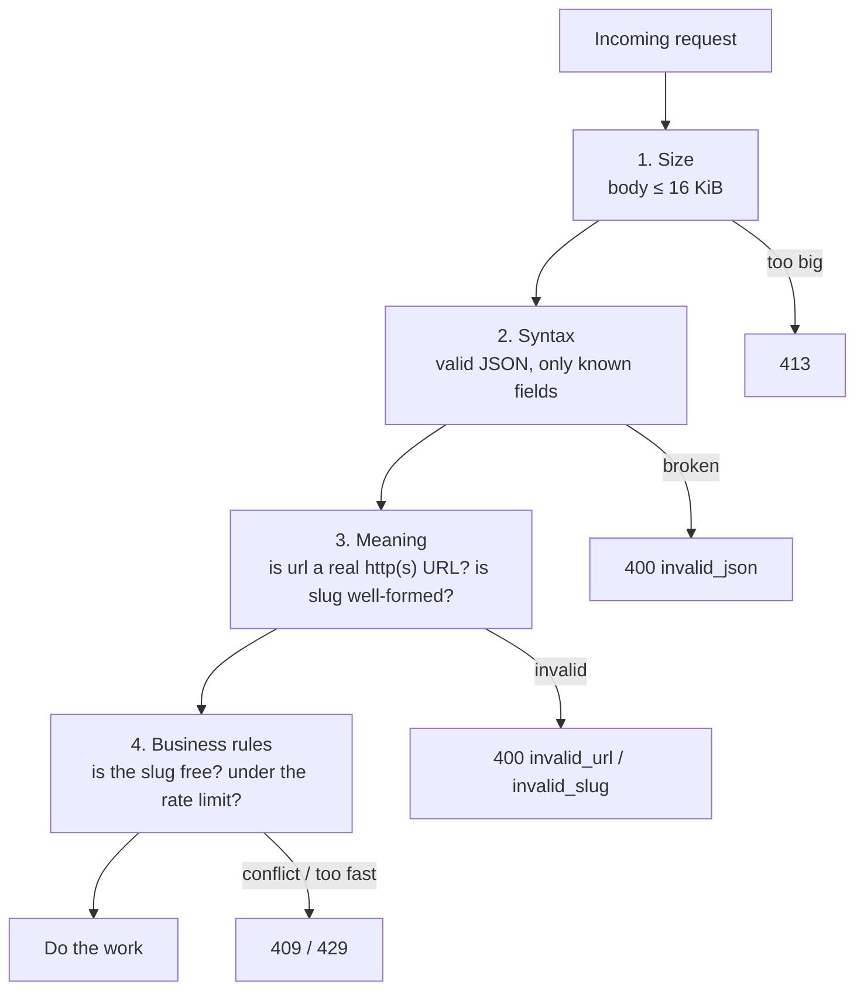

# 5.3 Validation, errors & status codes

Every request that reaches your server was written by someone you don't know. Most are honest. Some are buggy: a missing field, a typo, a number where text should be. And some are hostile: a 10 GB body, a `javascript:` URL designed to attack whoever clicks it, a crafted string meant to break your database query. A backend's first duty is to **refuse bad input clearly and safely** — and its second is to fail *well* when its own things break: tell the client what it needs to know, and nothing more. This chapter shows how snip does both, line by line.

## What you'll learn

- The golden rule — **never trust input** — and why checking in the browser isn't enough.
- **Layers of validation**: size, syntax, meaning and business rules, and where each belongs in the code.
- How snip decodes JSON **strictly** and limits request size.
- How snip turns domain errors into the **right status codes** and **one consistent error body**.
- Why **500 errors must say nothing** to the client, while your **logs** say everything — linked by a request ID.

---

## Never trust input

It's tempting to think: *"our app only ever sends valid URLs — the form checks them."* But the API doesn't only talk to your app. Anyone can open a terminal and send snip anything with curl, exactly as you've been doing. Checks in a browser or mobile app are for **convenience** (fast feedback for the user). Checks on the server are for **correctness and security**, and they're the only ones that count.



:::note[Everyday anchor]
A bank teller checks your ID even though the form you filled in at the entrance "required" it. The form helps honest customers; the teller's check is what actually protects the money. The server is the teller.
:::

---

## Validation in layers

snip checks every request in four layers, from cheapest to most expensive, and stops at the first failure:



Each layer lives where it naturally belongs: the first two in the **HTTP layer** (they're about the request's format), the last two in the **domain** (they're about links, whatever interface is used — HTTP today, maybe something else tomorrow).

### Layers 1 and 2: size and syntax, in the handler

From snip's `internal/httpapi/server.go`:

```go
const maxBodyBytes = 1 << 14 // 16 KiB is plenty for {"url": …}

func (s *Server) createLink(w http.ResponseWriter, r *http.Request) {
	// … rate limit check (layer 4, below) …
	var req createRequest
	dec := json.NewDecoder(http.MaxBytesReader(w, r.Body, maxBodyBytes))
	dec.DisallowUnknownFields()
	if err := dec.Decode(&req); err != nil {
		var tooBig *http.MaxBytesError
		if errors.As(err, &tooBig) {
			writeError(w, http.StatusRequestEntityTooLarge, "body_too_large", "request body is too large")
			return
		}
		writeError(w, http.StatusBadRequest, "invalid_json", "body must be JSON like {\"url\": \"https://…\"}")
		return
	}
	// …
}
```

- **`http.MaxBytesReader`** stops reading after 16 KiB and returns an error — so a giant upload can't exhaust memory. It's snip v0's `LimitReader`, made stricter: v0 silently truncated; this *rejects* with **413 Payload Too Large**.
- **`json.NewDecoder(…).Decode(&req)`** turns the JSON into a Go struct:
  ```go
  type createRequest struct {
  	URL  string `json:"url"`
  	Slug string `json:"slug,omitempty"`
  }
  ```
  Malformed JSON — a missing brace, a string where an object should be — fails here.
- **`DisallowUnknownFields()`** rejects fields snip doesn't know. If a client sends `{"link": "https://…"}` (a typo for `url`), a lenient decoder would silently ignore it and then complain the URL is empty — confusing. Strict decoding says exactly what's wrong.
- **`errors.As`** (chapter 4.2's cousin of `errors.Is`) checks whether the error is a specific *type* — here, "the body was too big" — so it gets its own status code.

### Layer 3: meaning, in the domain

A syntactically valid request can still be nonsense: `{"url": "javascript:alert(1)"}` is perfect JSON. Whether a URL is *acceptable* is a rule about **links**, so it lives in `internal/links`, not in the HTTP code. You read `NormalizeURL` in chapter 4.2; its partner checks custom slugs:

```go
var slugPattern = regexp.MustCompile(`^[A-Za-z0-9_-]{3,32}$`)

// reserved are slugs that would collide with snip's own routes.
var reserved = map[string]bool{"api": true, "healthz": true, "readyz": true, "metrics": true}

// ValidateSlug checks a custom slug chosen by a user.
func ValidateSlug(s string) error {
	if !slugPattern.MatchString(s) || reserved[strings.ToLower(s)] {
		return ErrInvalidSlug
	}
	return nil
}
```

The regular expression (chapter 2.3) allows 3–32 letters, digits, dashes and underscores. The **reserved** list stops someone registering the slug `healthz` or `api` — which would collide with snip's own routes and could hijack its health checks.

This is **allow-listing**: describing exactly what's *allowed* and rejecting everything else. It's far safer than **deny-listing** (trying to list everything *bad*), because attackers are endlessly creative about what "bad" looks like (chapter 7.5).

### Layer 4: business rules, in the domain and the store

Some rules can only be checked against the system's state:

- **Is the custom slug free?** Only the database knows for sure. snip doesn't check-then-insert (two requests could both see "free" and both insert — a race, chapter 1.2). It lets the database's **unique constraint** enforce it and translates the database's "duplicate key" error into `links.ErrSlugTaken` (chapter 6.3).
- **Is this key under its rate limit?** Checked against shared counters in Redis before doing any work (chapter 8.4).

---

## One error format, the right status code

Every failure — from any layer — reaches the client in the **same shape**:

```json
{"error": {"code": "invalid_url", "message": "url must be an absolute http(s) URL of at most 2048 characters"}}
```

- **`code`** is stable and machine-readable. Client programs switch on it (`if code == "slug_taken"`). Never change a code once it's published.
- **`message`** is for humans: a developer debugging, or an app showing it to a user. It can be improved any time.

The translation from domain errors to HTTP happens in **one place**, `writeDomainError` in `internal/httpapi/errors.go`:

```go
func (s *Server) writeDomainError(w http.ResponseWriter, r *http.Request, err error) {
	switch {
	case errors.Is(err, links.ErrInvalidURL):
		writeError(w, http.StatusBadRequest, "invalid_url", "url must be an absolute http(s) URL of at most 2048 characters")
	case errors.Is(err, links.ErrInvalidSlug):
		writeError(w, http.StatusBadRequest, "invalid_slug", "slug must be 3-32 letters, digits, '-' or '_', and not a reserved word")
	case errors.Is(err, links.ErrSlugTaken):
		writeError(w, http.StatusConflict, "slug_taken", "that slug is already in use")
	case errors.Is(err, links.ErrNotFound):
		writeError(w, http.StatusNotFound, "not_found", "no such link")
	case errors.Is(err, auth.ErrUnknownKey):
		writeError(w, http.StatusUnauthorized, "unauthorized", "missing or invalid API key")
	default:
		s.log.ErrorContext(r.Context(), "internal error", "err", err, "path", r.URL.Path)
		writeError(w, http.StatusInternalServerError, "internal", "something went wrong on our side")
	}
}
```

This is the payoff of chapter 4.2's **sentinel errors**. The domain code says *what* went wrong in its own words (`ErrSlugTaken`); the HTTP layer decides *how to say it* over HTTP (`409`, `slug_taken`). If snip one day adds another interface — a command-line tool, a gRPC API (chapter 5.5) — the domain doesn't change; that interface gets its own translation.

:::info[In the real world]
There's also an official standard error format for HTTP APIs: **"Problem Details"**, RFC 9457, with `Content-Type: application/problem+json` and fields like `type`, `title`, `status` and `detail`. Some teams adopt it so generic tools understand their errors. snip's simpler shape is equally common. What matters most is picking **one** format and using it everywhere.
:::

---

## 500s must say nothing; logs must say everything

Look again at the `default` branch — anything *unexpected*: the database is down, a bug, a timeout. Two things happen:

1. **The client gets a generic message**: `500`, `"internal"`, "something went wrong on our side".
2. **The log gets everything**: the real error, with its full chain of wrapped context (chapter 4.2), the path, and the request ID.

Why not just send the real error to the client? Because internal error messages leak information attackers love: database names and versions, table structures, file paths, fragments of SQL, sometimes even credentials. A message like `pq: relation "api_keys" does not exist` tells an attacker what your database looks like.

So how does a developer connect a user's report to the log? Through the **request ID**. snip's middleware gives every request an ID, returns it in the `X-Request-Id` response header, and includes it in every log line for that request (chapter 5.4):

```text
Client sees:  HTTP/1.1 500 …   X-Request-Id: 3f9a2c71d0b4e815
              {"error":{"code":"internal","message":"something went wrong on our side"}}

Logs show:    level=ERROR msg="internal error" request_id=3f9a2c71d0b4e815
              err="list links: postgres: query: connection refused" path=/api/links
```

The user (or support) quotes the ID; the engineer searches the logs for it (chapter 2.3's `grep` or chapter 13.1's log tools) and sees exactly what happened.

:::tip
A **4xx** means the client should change something, so its message should say **what** — precisely. A **5xx** means *you* should change something, so its message to the client should say **nothing internal** — and your logs and alerts should say everything.
:::

---

## Panics: the errors nobody planned

Sometimes code doesn't return an error — it **panics**: a nil pointer, an index out of range (chapter 4.2). By default, Go's HTTP server catches a panicking request and closes that connection (so one bug doesn't kill the whole server), but the client just sees the connection drop. snip's middleware recovers the panic itself, logs it with the request ID, and returns a proper `500` with the standard error body (`internal/httpapi/middleware.go`). Every response, even from a bug, keeps the promised shape.

:::warning[What can go wrong]
- **Validating only on the client.** Anyone can bypass your app and call the API directly. The server must check everything.
- **Leaking internals in errors.** Stack traces, SQL, file paths and library errors in responses help attackers. Log them; don't send them.
- **Vague 4xx messages.** "Bad request" with no detail makes client developers guess. Say which field is wrong and what's expected.
- **Check-then-act races.** "Is the slug free? Yes → insert" can let two requests both succeed. Let the database's constraints be the final judge.
- **Deny-lists.** Blocking `javascript:` but forgetting `data:` or `JaVaScRiPt:`. Allow-list what's valid instead.
:::

---

## Lab

Free, on your own computer. Start the reference snip in memory mode (`SNIP_LOG_FORMAT=text go run ./cmd/snip` in `~/code/zero-to-prod/snip`) and set `KEY` from its log, as in chapter 5.2.

1. **Attack every layer.** Predict each status code and error `code` first:
   ```bash
   H="Authorization: Bearer $KEY"
   (printf '{"url":"https://go.dev/'; head -c 20000 /dev/zero | tr '\0' 'a'; printf '"}') \
     | curl -s -X POST localhost:8080/api/links -H "$H" --data-binary @- | jq .   # layer 1: a 20 KB (valid-looking) body
   curl -s -X POST localhost:8080/api/links -H "$H" -d '{"url": "https://go.dev"' | jq .                           # layer 2: broken JSON
   curl -s -X POST localhost:8080/api/links -H "$H" -d '{"link": "https://go.dev"}' | jq .                         # layer 2: unknown field
   curl -s -X POST localhost:8080/api/links -H "$H" -d '{"url": "javascript:alert(1)"}' | jq .                     # layer 3: bad scheme
   curl -s -X POST localhost:8080/api/links -H "$H" -d '{"url": "https://go.dev", "slug": "healthz"}' | jq .       # layer 3: reserved
   curl -s -X POST localhost:8080/api/links -H "$H" -d '{"url": "https://go.dev", "slug": "a b"}' | jq .           # layer 3: bad slug
   ```
   Notice every response has the same shape, and each 4xx message tells you exactly what to fix.

   Curious twist: send 20 KB of plain `aaaa…` (not JSON) and you get `invalid_json`, not `body_too_large`. The decoder reads the body as a stream and gives up at the very first invalid byte — long before reaching the size limit. Layers stop at the *first* failure, and reading a stream lazily means garbage is rejected cheaply.

2. **Find the request ID.** Run any failing request with `-i` and note the `X-Request-Id` header. Then find the same ID in snip's log output in the other terminal. That's the thread connecting a user's report to your logs.

3. **Read the tests that lock this in.** Open `internal/httpapi/server_test.go` and find `TestErrors` (chapter 4.4). Every case you just tried by hand is checked there automatically, on every push.

4. **Extend the rules (optional).** Suppose snip should refuse to shorten its own short links (a link to `https://snip.example/abc` would just redirect to itself). Where would that rule live — the HTTP layer or the domain? Write the new table case you'd add to `TestNormalizeURL` or a new test first, then try implementing it.

## Self-check

<Quiz
  id="apis-validation-errors-status-codes"
  questions={[
    {
      q: 'The mobile app already validates URLs before sending them. Does snip still need to validate?',
      options: [
        'No — that would be duplicated work',
        'Yes — anyone can call the API directly, so server-side checks are the only ones that count',
        'Only for admin users',
        'Only in production',
      ],
      answer: 1,
      explain: 'Client-side checks improve the user experience but can be bypassed with curl or a script. The server is the only real line of defence.',
    },
    {
      q: 'Why does snip use json.Decoder with DisallowUnknownFields?',
      options: [
        'It makes decoding faster',
        'So a typo like {"link": ...} is rejected clearly instead of silently ignored',
        'JSON requires it',
        'To hide unknown fields from logs',
      ],
      answer: 1,
      explain: 'A lenient decoder would drop the unknown field and then report a confusing "invalid url". Strict decoding points at the real mistake.',
    },
    {
      q: 'The database is down and a request fails. What should the client receive?',
      options: [
        'A 500 with the full database error so the user can report it',
        'A 500 with a generic message and a request ID; the details go to the logs',
        'A 200 with an empty list',
        'A 404',
      ],
      answer: 1,
      explain: 'Internal errors can leak details attackers use. The client gets a stable generic error; engineers find the details in the logs by request ID.',
    },
    {
      q: 'Why does snip allow-list slug characters (letters, digits, - and _) instead of deny-listing bad ones?',
      options: [
        'Allow-lists are shorter to type',
        'It is impossible to list every dangerous input, but easy to describe exactly what is valid',
        'Deny-lists are not supported by Go',
        'Allow-lists are faster',
      ],
      answer: 1,
      explain: 'Attackers find inputs you did not think to block. Describing precisely what is allowed rejects everything else by default.',
    },
  ]}
/>

<details>
<summary>Why does snip translate domain errors to HTTP in one function (<code>writeDomainError</code>) instead of in each handler?</summary>

**Consistency and separation.** One function means every endpoint maps `ErrNotFound` to exactly the same `404` and `not_found` code, and a change (say, better wording) happens once. And the **domain doesn't know about HTTP**: `links` returns `ErrSlugTaken`; only the HTTP layer knows that becomes `409`. If snip adds a command-line tool or a gRPC interface, the domain code stays untouched — each interface gets its own small translation.

</details>

<details>
<summary>A user reports "I got an error creating a link". What two pieces of information make your job easy, and how does snip provide them?</summary>

1. **The error `code`** (e.g. `slug_taken`, `invalid_url`, or `internal`) — tells you immediately whether it was the client's input or snip's fault.
2. **The request ID** (the `X-Request-Id` response header) — lets you find the exact log lines for that request, including the full internal error for a `500`.

snip returns both on every response: the standard error body, and the header set by its request-ID middleware. Good APIs make these easy for users (and support teams) to copy.

</details>
