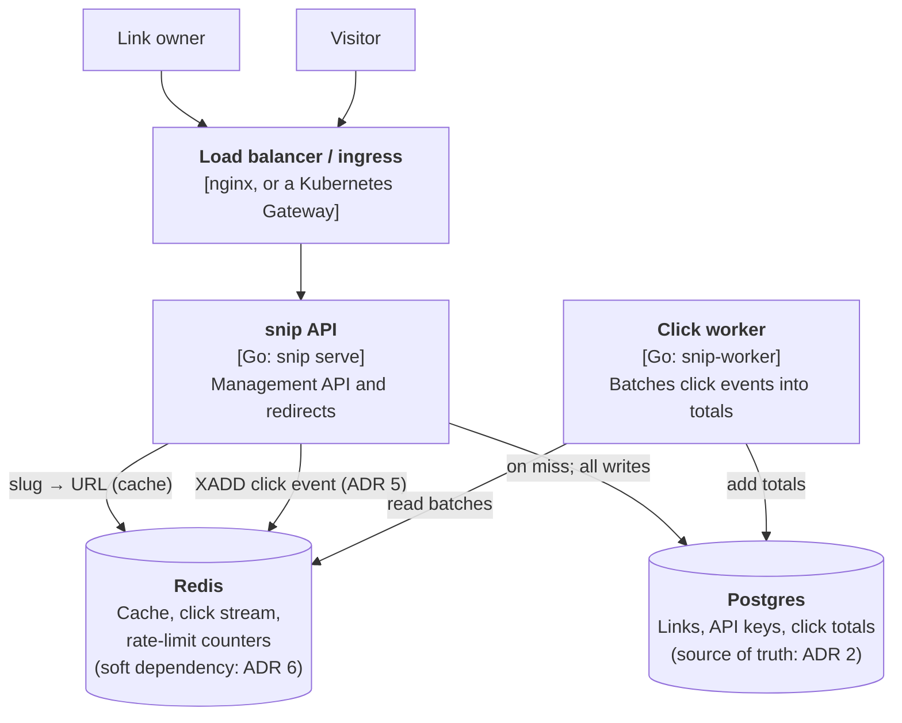

# 15.2 Decisions: ADRs, trade-offs & C4 diagrams

Six months from now, someone new joins the team behind snip. They open the readiness check, notice that it doesn't fail when Redis is down, and think: "that's a bug, a dependency is down and we still say we're ready." They fix it, the tests pass, the review is quick. And the next time Redis freezes, every copy of snip is taken out of service at once, exactly the outage chapter 13.5's game day found and fixed.

Nothing in the code says *why* it's that way. The reasoning lived in a chapter, a commit message and a few people's heads. This chapter is about keeping it somewhere better: how to think about decisions as trade-offs, how to record them so they survive, and how to draw a system so people understand it.

## What you'll learn

- Why every design decision is a **trade-off**, and how to name what you're giving up.
- **One-way** and **two-way doors**: how much care a decision deserves.
- **Architecture decision records** (**ADRs**): what they are, with snip's real ones.
- **Design documents** for bigger changes, and how they're reviewed.
- The **C4 model**: four zoom levels for diagrams, and why two are usually enough.
- **Diagrams as code**, kept next to the system so they don't go stale.

---

## Every decision is a trade-off

:::note[Everyday anchor]
Choosing a car. A small car is cheap to run and easy to park; a van carries the whole family and the dog. Neither is "the best car"; each is best for someone. A salesperson who says one car has no downsides is either not thinking or selling something.
:::

There are almost no best solutions in system design, only choices that fit particular requirements better, at a cost. snip's decisions, each with its price named:

| Decision | Gains | Gives up |
|---|---|---|
| 302 redirects | Accurate counts; links can be disabled instantly | One request to snip per click, forever |
| Counting clicks through a stream | Fast redirects; batched writes | Counts lag; clicks can be lost if Redis is down |
| Random slugs | No coordination; unguessable | Occasional retry; slugs aren't sequential or meaningful |
| One Postgres primary | Simplicity, consistency, SQL | A ceiling on writes; one region |

A useful habit: **never describe a choice without its cost.** "We'll use a queue" is half a sentence. "We'll use a queue, so redirects stay fast, and counts will lag by seconds" is a decision someone can agree or disagree with. If you can't name what an option gives up, you haven't understood it yet, and in an interview, naming the cost unprompted is one of the clearest signals of seniority.

### One-way and two-way doors

Not every decision deserves the same care. A widely used way to sort them:

- **Two-way doors** are easy to reverse: a library for parsing JSON, the name of an internal function, the cache TTL (snip's is one hour, a config value). Decide quickly, and change your mind later if needed. Deliberating over them is the waste.
- **One-way doors** are hard or expensive to reverse: the primary database, the public API's URL format, the slug format (every link ever shared depends on it), 302 versus 301 (browsers cache 301s, so a mistake is out of your hands). Slow down, write it down, get it reviewed.

Much of the skill is noticing which kind you're facing. The slug format looks like a detail, and it's a promise to everyone who ever shares a link.

---

## Architecture decision records

An **architecture decision record** (**ADR**) is a short document recording one significant decision: the situation, what was decided, and what it costs. The common format, introduced by Michael Nygard, has five parts:

- **Title**, as a short statement of the decision.
- **Status**: proposed, accepted, deprecated, or **superseded** by a later record.
- **Context**: the forces at play, including the options considered.
- **Decision**: what we'll do, stated plainly.
- **Consequences**: what becomes easier and harder, good and bad.

ADRs are numbered and kept in the repository, next to the code (snip's live in `snip/docs/adr/`), so they're versioned, reviewed in pull requests, and found by anyone reading the code. They're **never rewritten**: when a decision changes, a new ADR supersedes the old one, and the old one stays, so the history of *why* is preserved too.

Here's snip's ADR 6, the one the game day forced, in full:

```markdown
# 6. Redis is a soft dependency

- **Status:** Accepted
- **Date:** 2026-09-24

## Context

snip uses Redis as a cache for redirects, for the click stream (ADR 5) and for
shared rate-limit counters. It was designed as "never fatal": on a cache error,
fall back to Postgres.

In the game day of chapter 13.5, we froze Redis. Redirects took 15–20 seconds
instead of failing fast (the client retried and waited on long timeouts), and
the readiness check reported not-ready because it checked Redis, so the load
balancer took every copy of snip out of service. A cache had become a hard
dependency without anyone deciding it should.

## Decision

- Readiness fails only for **hard** dependencies (Postgres). Redis is checked
  as a **degradable** one: reported in `/readyz`, never failing it.
- The Redis client fails fast: no retries, a single dial attempt, and short
  timeouts.
- After a cache error, the redirect skips writing the value back to the cache.

## Consequences

- With Redis frozen, redirects take about 0.2 s (served from Postgres) instead
  of hanging; with Redis stopped, about 10 ms. Measured in CI.
- While Redis is down, rate limiting **fails open** (link creation isn't
  limited), clicks made during the outage are **lost** (they never reach the
  stream), and Postgres takes the full read load, so it must have the capacity
  for it. The runbook's `redis-down` section covers the response.
- A general rule for new dependencies: decide explicitly whether each one is
  hard or soft, and test the soft ones failing.
```

What to notice:

- The **context** tells the story, including the failure. That's what stops the newcomer in this chapter's opening from "fixing" the readiness check: a comment in the code linking to ADR 6 would take them straight here.
- The **consequences** include the bad ones, honestly: lost clicks, unlimited link creation during an outage. A record that lists only benefits is a sales pitch.
- It's **short**. An ADR is read in two minutes. Every one of snip's is under 40 lines.

:::info[Honesty label]
snip's ADRs 2 to 5 were written **after the fact**, from the chapters where those decisions were made, and they say so ("recorded 2026-09-25"). That's common and fine: recording a decision late is far better than never. ADR 6 was written as part of the decision it records.
:::

### When to write one

Write an ADR when a decision is **hard to reverse**, **affects more than one component or team**, or is something people will ask "why?" about. Don't write one for two-way doors: an ADR about which logging library to use is noise that buries the important ones. A team making a handful a year is about right; one a month is fine for a young system. If a decision isn't worth a paragraph, it isn't significant enough for a record.

:::warning[What can go wrong]
ADRs fail in predictable ways. **Nobody reads them**: fix that by linking to them from the code they explain (`// Readiness ignores Redis on purpose: see docs/adr/0006`) and from onboarding docs. **They're written after the argument is over**, to justify what was already done, with the alternatives made to look silly: write them while deciding, and give the rejected options their best case. **They're rewritten** when minds change, losing the history: supersede instead.
:::

---

## Design documents: for decisions that need discussion

An ADR records a decision. For bigger changes (a new service, a migration, a feature touching several teams), the thinking happens first in a **design document** (some organisations call it an **RFC**, "request for comments"). A typical structure:

1. **Problem and context**: what's wrong or missing, and why now. With numbers.
2. **Goals and non-goals**: what success means, and what this deliberately won't do (chapter 15.1's "out of scope").
3. **Proposal**: the design, at the level of chapter 15.1's steps 3 to 5: API, data, components, the hard parts.
4. **Alternatives considered**, each with why it lost. This section is where reviewers learn whether you really explored the problem.
5. **Risks, rollout and rollback**: how it ships safely (Part 11), how you'd know it's failing (Part 13), how you'd undo it.
6. **Open questions**: what you don't know yet. Being explicit here invites the right help.

It's shared for review, people comment, the design improves, and the outcome is recorded, often as one or more ADRs. The document's real value is that disagreements happen on paper, cheaply, before anyone has written code they're attached to.

Keep it proportionate. Two pages that people read beat twenty that they skim. And a design doc is not a contract: when implementation teaches you something, update the plan and record the change.

---

## The C4 model: diagrams at four zoom levels

:::note[Everyday anchor]
An online map. Zoomed out, you see countries and the roads between cities. Zoom in and you see a city's districts, then streets, then buildings. Each level answers different questions, and nobody wants every street drawn on the map of Europe.
:::

Most architecture diagrams fail the same way: boxes of every kind (servers, services, classes, teams) mixed on one page, arrows without labels, no legend. The **C4 model**, created by Simon Brown, fixes that with four zoom levels, each for a different audience:

1. **Context**: your system as one box, the people who use it, and the other systems it talks to. For everyone, including non-technical people.
2. **Containers**: the separately running pieces inside your system (applications, databases, queues) and how they communicate. ("Container" here means anything that runs or stores data, not specifically a Docker container.) For engineers and operators.
3. **Components**: the major parts inside one container. For the people working on that container.
4. **Code**: classes and functions. Almost never drawn by hand; your editor shows it.

In practice, levels 1 and 2 give most of the value, and they're what snip's `docs/architecture.md` contains. The container diagram:



The rules that make it readable:

- **Every box says what it is and what it's made of**: a name, a type in brackets (`[Go: snip serve]`), and one line on its job.
- **Every arrow is labelled** with what flows along it, and ideally how (HTTP, SQL, `XADD`).
- **One level per diagram.** No classes on the container diagram, no servers on the context diagram.
- **Links to the reasoning**: the boxes point at ADRs, so a reader can go from "what" to "why".

### Diagrams as code

snip's diagrams are **Mermaid** text inside a Markdown file (Mermaid is also what draws every diagram in this handbook). GitHub renders them, they're reviewed in pull requests like code, and when the architecture changes, the diagram changes in the same pull request. A diagram drawn in a separate tool and exported as a picture starts going stale the day it's made, because updating it is a separate chore nobody owns. Keeping diagrams as text next to the code is the single most effective way to keep them true.

---

## Lab

About an hour. You need your clone of the repository.

1. **Read snip's decisions.** Open `snip/docs/adr/README.md` and read ADRs 3 to 6. For each, find the code it describes (for example, `http.StatusFound` in `internal/httpapi/server.go` for ADR 3). **What to notice:** none of that code links back to its ADR yet. Add a one-line comment to two of those places pointing at the ADR.

2. **Write ADR 7.** Chapter 14.9 suggested that snip's delete should be a **soft delete** (hidden and recoverable for 30 days) instead of a permanent one. Write `0007-soft-delete-links.md` with status **Proposed**. In the context, list at least two alternatives (keep hard deletes; an audit log table; a `deleted_at` column). In the consequences, include the costs: every query must now exclude deleted links, the slug stays taken for 30 days, storage grows, and there's a privacy question (a user who deletes a link may expect it gone). Decide, and say why.

3. **Classify doors.** For each of these snip changes, decide: one-way or two-way door? Changing the cache TTL; adding a `/api/v2`; changing the slug alphabet; switching the click stream from Redis to a dedicated message broker; renaming a Prometheus metric. Write one sentence of reasoning for each. (The metric one is sneakier than it looks: who depends on the name? Chapter 13.4's alerts do.)

4. **Draw a context diagram** for a system you use daily (your bank's app, a food-delivery app) at C4 level 1, in Mermaid. Paste it into a Mermaid live editor or a GitHub Markdown file to render it. Keep it to one box for the system, and label every arrow.

---

## Self-check

<Quiz
  id="architecture-adrs-tradeoffs-c4"
  questions={[
    {
      q: 'What makes "We’ll use a queue for clicks" an incomplete description of a decision?',
      options: [
        'It doesn’t name the queue product, its version, or who will run it in production',
        'It states no cost: what it gives up (counts lag) as well as what it gains',
        'It doesn’t say when the decision was made, so nobody knows if it still applies',
        'It’s too short for an ADR, which needs a diagram and at least a page',
      ],
      answer: 1,
      explain: 'It states no cost: a decision should say what it gives up (counts lag, possible loss) as well as what it gains. Every choice is a trade-off. Naming the cost is what makes it a decision others can evaluate.',
    },
    {
      q: 'Which of these is a one-way door for snip?',
      options: [
        'The cache TTL, since changing it would break links already cached',
        'The slug format, because every link ever shared depends on it',
        'The name of an internal Go package, since other code imports it',
        'The log level, since dashboards are built on the lines it produces',
      ],
      answer: 1,
      explain: 'Shared links live outside your control. Changes that break them can’t be taken back.',
    },
    {
      q: 'A decision recorded in ADR 4 changes. What should happen to ADR 4?',
      options: [
        'Edit it to describe the new decision, so there’s one current record',
        'Delete it and renumber the rest, so the list has no gaps',
        'Write a new ADR that supersedes 4; mark 4 "Superseded" and keep its text',
        'Nothing; ADRs describe history, and the code shows the current state',
      ],
      answer: 2,
      explain: 'Write ADR N describing the new decision and marking it as superseding 4; mark ADR 4 "Superseded by N" and leave its content. Records are history. Superseding preserves why things were once done differently.',
    },
    {
      q: 'In the C4 model, what does a container diagram show?',
      options: [
        'Only the Docker containers the system runs in, and their images',
        'The separately running apps and data stores in a system, and their links',
        'The classes and methods inside each part, and how they call each other',
        'The people who use the system and the other systems it depends on',
      ],
      answer: 1,
      explain: 'A C4 "container" is anything that runs or stores data: an API, a worker, a database, a queue.',
    },
    {
      q: 'Why keep architecture diagrams as Mermaid text in the repository?',
      options: [
        'Mermaid diagrams look nicer than hand-drawn ones in slide decks',
        'They’re versioned, reviewed and updated with the code, so they stay true',
        'Image files bloat the repository’s history, and Git can’t compress them',
        'C4 requires its diagrams to be written as text, not drawn',
      ],
      answer: 1,
      explain: 'They’re versioned and reviewed with the code, and updated in the same pull request as the change, so they stay true. Diagrams go stale when updating them is a separate chore. Next to the code, it’s part of the change.',
    },
  ]}
/>

<details>
<summary>Your team lead says ADRs are bureaucracy: "we're a small team, we all know why we did things." How would you respond, and what would you propose?</summary>

Agree with the part that's right: process for its own sake is waste, and a small team shares a lot of context. Then point at what the context doesn't survive:

- **People leave and join.** The newcomer in this chapter's opening story didn't know, and "fixed" a deliberate decision. snip's ADR 6 exists because a cache had become a hard dependency without anyone deciding it should, then broke.
- **Memory is unreliable.** In a year, "we all know why" becomes three different versions of why.
- **It's cheap.** An ADR is a page, written once, in the repository, reviewed with the code. Ten minutes for a decision that took days.

Propose something small: ADRs only for one-way doors and cross-cutting decisions (a handful a year), the five-part format, and a comment in the code linking to each. Review in six months: if nobody has found them useful, stop.

</details>

<details>
<summary>You're asked to review a design document for moving snip's click counting from the Redis stream to a dedicated message broker. What would you look for?</summary>

- **The problem, with numbers.** What's wrong with the stream today? Queue depth, lost clicks, a throughput ceiling? If there's no measured problem, the proposal is a solution looking for one.
- **Goals and non-goals.** For example: "survive a Redis outage without losing clicks" (a real gap, per ADR 6), but not "exactly-once analytics".
- **Alternatives.** Did they consider cheaper fixes: Redis persistence or a replica, writing clicks to a local buffer when Redis is down, or accepting the loss? Each should have a fair hearing.
- **Costs.** A new system to run, secure, monitor and upgrade; new failure modes; the team's experience with it.
- **Rollout and rollback.** Can both paths run in parallel for a while (write to both, compare counts)? How is it undone?
- **Operations.** Alerts, dashboards and runbook changes (Part 13).
- **The ADR.** If accepted, it supersedes ADR 5, and ADR 6's consequences change too.

A good review asks questions more than it prescribes answers, and separates "must fix" from "consider".

</details>
