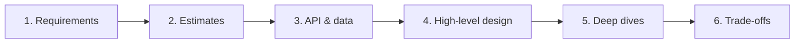
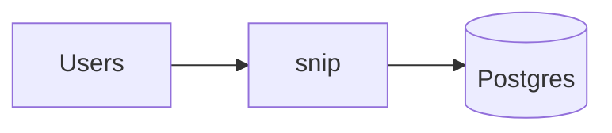
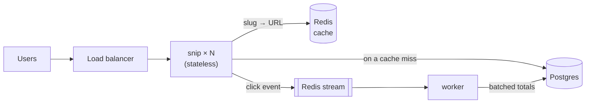

# 15.1 System design: a method

"Design a URL shortener" is one of the most common system design interview questions in the world. You've spent this whole handbook building one. So you know something most candidates don't: the interesting parts aren't the boxes on the whiteboard. They're the questions behind them. How many redirects a second? What happens when the cache dies? Why a 302 and not a 301? Where do click counts go so redirects stay fast? Each of those was a chapter, and each has a real answer in snip's code.

This part of the handbook steps back from building and looks at **designing**: deciding what to build, before and around the code. This chapter gives you a method that works for any system, from an interview question to a real project at work, and walks through it once, completely, on snip.

## What you'll learn

- Why system design starts with **questions**, not boxes.
- **Functional** and **non-functional requirements**, and what's **out of scope**.
- **Back-of-envelope estimation**: turning "lots of users" into requests per second and gigabytes.
- Designing the **API** and **data model** first.
- A first **high-level design**, then **deep dives** into bottlenecks and failures.
- Stating **trade-offs** and how the design would **evolve**.

---

## The method: six steps, in order

:::note[Everyday anchor]
An architect designing a house doesn't start by drawing rooms. They ask: how many people will live here? Do you work from home? Any wheelchairs, any pianos? What's the budget? Then they sketch roughly, check the sketch against the budget and the plot, and only then draw the details. Drawing the kitchen first, beautifully, for a family that turns out to need four bedrooms, is the mistake the questions prevent.
:::



1. **Requirements.** What must it do, how well, and what's explicitly *not* included?
2. **Estimates.** How big: requests per second, storage, bandwidth. Rough numbers, stated assumptions.
3. **API and data model.** The contract with the outside world, and what gets stored.
4. **High-level design.** The main components and how a request flows through them.
5. **Deep dives.** The two or three places where this design could break: bottlenecks, failures, the genuinely hard part.
6. **Trade-offs and evolution.** What you chose, what you gave up, and what changes at ten or a hundred times the load.

In a 45-minute interview, roughly: 5 minutes on requirements, 5 on estimates, 5 on API and data, 10 on the high-level design, 15 on deep dives, and 5 on trade-offs. At work, the same steps take days, and end in a written design document (chapter 15.2).

The order matters. Most bad designs come from skipping the first two steps: a beautifully detailed answer to the wrong question, or a design for Google's scale when the system will see twelve writes a second.

---

## Step 1: requirements

**Functional requirements** are what the system does, as user actions:

- Create a short link for a long URL, optionally with a custom slug.
- Visiting the short link redirects to the long URL.
- Owners can list and delete their links, and see click counts.
- Access to the management API needs an API key.

**Non-functional requirements** are *how well*: speed, availability, scale, security, cost. These drive the design far more than the features do. For snip:

- **Redirects are fast**: 99% within 250 ms (snip's SLO, chapter 13.4). A redirect is in front of every click, so it's the hot path.
- **Redirects are highly available**; creating links can be a little less so. A broken redirect breaks every link ever shared. A failing "create" blocks one person for a minute.
- **Read-heavy**: each link is created once and followed many times.
- **Click counts can lag** by a few seconds, and can be approximate under extreme failure. Nobody's bank balance depends on them.
- **Abuse-resistant**: spammers and phishing links are a real threat to a link shortener's reputation (chapters 8.4 and 14.2).

And **out of scope**, said out loud: user accounts with passwords (API keys are enough), link editing, detailed analytics by country and device, custom domains. Naming what you won't build keeps the design focused, and in an interview, it shows judgment.

:::info[If you've written code]
The best requirement questions are about **ratios and tolerances**, because they decide the architecture: reads versus writes (here, very read-heavy: cache it), how stale data may be (click counts: seconds is fine, so queue it), and which operation matters more when things fail (redirects: protect them first). Each answer removes whole families of designs.
:::

---

## Step 2: back-of-envelope estimates

Rough numbers, stated assumptions, simple arithmetic. The goal is the **order of magnitude**: 10 requests a second, 10,000 or 10 million lead to completely different designs.

Assume a successful service: **1 million new links a day**, and each link followed **100 times** on average over its life (so reads outnumber writes 100 to 1).

| Quantity | Arithmetic | Result |
|---|---|---|
| Writes (new links) | 1,000,000 ÷ 86,400 seconds in a day | ≈ **12 per second** |
| Reads (redirects) | 12 × 100 | ≈ **1,200 per second** on average |
| Peak reads | traffic isn't flat: assume 5 × average | ≈ **6,000 per second** |
| Storage per link | slug, URL (often 100–200 characters), owner, dates, row overhead | ≈ **500 bytes** |
| Storage per year | 365 million links × 500 bytes | ≈ **180 GB** |
| Slug space | 56 characters, 7 positions: 56⁷ | ≈ **1.7 trillion** |

What those numbers say:

- **Writes are tiny.** 12 a second is nothing for Postgres (chapter 6). No need for a special write path, a distributed database or sharding.
- **Reads are the load**, and 6,000 a second at peak is well within reach of a few servers. In chapter 8.5, one snip process answered about **51,000 redirects a second** from memory on a 4-core test machine. So the web tier isn't the problem; the question is how many of those reads reach the database.
- **Storage is small**: 180 GB a year fits on one database server for many years.
- **Random slugs won't run out**, and collisions are rare: after a billion links, a new random slug collides with an existing one about once in 1,700 tries. snip simply retries.

Numbers worth memorising for estimates (chapter 1.1 has the full table): a day is about **100,000 seconds** (86,400); reading memory takes around 100 nanoseconds, an SSD around 100 microseconds, a round trip inside a data centre around half a millisecond, and across a continent around 100 milliseconds. Round freely: the point is to be within a factor of a few, not precise.

---

## Step 3: API and data model

The **API** is the contract (Part 5). snip's, in brief:

```text
POST   /api/links          {"url": "...", "slug": "optional"}  → 201 {slug, url, short_url, ...}
GET    /api/links          → the caller's links, newest first
GET    /api/links/{slug}   → one link, with its click count
DELETE /api/links/{slug}   → 204
GET    /{slug}             → 302 Found, Location: <url>
```

One decision in there deserves attention: **302 Found, not 301 Moved Permanently**. A 301 tells browsers and caches that the redirect never changes, so they remember it and skip snip next time. That's faster for the user, but snip never sees those clicks (so counts are wrong), and a deleted or changed link keeps redirecting from people's browser caches. A 302 costs one request to snip per click, and keeps snip in control. It's a small choice with real consequences, which is exactly what interviewers like to probe.

The **data model** is one main table (chapter 6.3), with the slug as its primary key, so the redirect lookup is a primary-key lookup:

```sql
CREATE TABLE links (
    slug        TEXT        PRIMARY KEY,             -- the primary key doubles as the redirect lookup index
    url         TEXT        NOT NULL CHECK (length(url) <= 2048),
    owner_id    BIGINT      NOT NULL REFERENCES api_keys (id) ON DELETE CASCADE,
    clicks      BIGINT      NOT NULL DEFAULT 0 CHECK (clicks >= 0),
    created_at  TIMESTAMPTZ NOT NULL DEFAULT now()
);
```

Designing the API and data model before the boxes forces the concrete questions early: what's the key, what's the hot query, what must be unique.

---

## Step 4: a first high-level design

Start with the simplest thing that meets the requirements:



Then check it against the non-functional requirements. At 6,000 redirects a second, every one a Postgres query, plus a click-count **update** on every redirect (6,000 writes a second to hot rows, locking them), the database becomes the bottleneck and the redirect waits on a write. So, two changes, each driven by a requirement:

- **Reads are 100× writes → cache them.** Redis in front of Postgres for slug → URL lookups (chapter 6.7). Most redirects never touch Postgres.
- **Click counts can lag → take them off the hot path.** The redirect appends a click event to a Redis stream and returns; a worker adds them up in batches and writes totals to Postgres (chapter 8.2).

And to survive a server failure and absorb peaks, several copies of snip behind a load balancer (chapters 8.3 and 8.6). The result is snip as you built it:



What to notice: every box is there because a requirement or a number demanded it. There's no message broker cluster, no microservices, no NoSQL database, because 12 writes a second and 180 GB a year don't need them. **A design is judged by what it leaves out as much as by what it includes.**

---

## Step 5: deep dives

With the whole picture in place, go deep where it matters. For snip, the interesting places are:

**Generating slugs.** Three common options: random characters with a retry on collision (snip's choice: simple, unguessable, no coordination between servers); a global counter encoded in base 62 (short and collision-free, but sequential, so anyone can enumerate every link, and the counter needs coordinating across servers); or a hash of the URL (the same URL always gets the same slug, which is sometimes wanted, but collisions still need handling). Unguessable matters for a link shortener: people shorten private documents.

**A viral link.** One slug getting 50,000 requests a second is a **hot key**. The cache absorbs it (one Redis key read many times is Redis's best case), and each snip copy could keep a tiny in-process cache for the hottest slugs too.

**The cache fails.** This one you know from experience. In chapter 13.5's game day, a frozen Redis made snip's redirects hang for 15 to 20 seconds and failed its readiness checks, because a cache had quietly become a hard dependency. The fix is a design principle: a **soft dependency** must fail fast and degrade (redirect from Postgres, skip the cache fill), never take the service down with it.

**Abuse.** Rate limits per API key (chapter 8.4) stop mass creation; checking destinations against known-bad lists and a phishing classifier (chapter 14.2) protect the service's reputation; and a short link that turns out to be phishing must be disabled everywhere at once, which the cache must respect (delete the cache entry when the link is deleted).

In an interview, you won't have time for all four. Pick the one or two most tied to the requirements, say which you're choosing and why, and mention the others in a sentence.

---

## Step 6: trade-offs and evolution

Finish by being explicit about what the design gives up, and what would change at larger scale:

- **Chose** a single-region Postgres, simple and consistent; **gave up** surviving the loss of a whole region, and speed for users far away.
- **Chose** approximate, slightly late click counts; **gave up** exact real-time analytics.
- **Chose** 302 redirects; **gave up** browser caching of redirects.

At **10×** (60,000 redirects a second at peak): more snip copies, a bigger Redis, Postgres **read replicas** for cache misses (chapters 8.6 and 12.3). Nothing fundamental changes.

At **100×**, or with users worldwide: redirects served from regions close to users (a copy of the slug → URL data in each region, or redirects at a CDN's edge), and eventually **partitioning** links across several Postgres servers by slug (chapter 8.6). Each of these adds real complexity, so each waits until the numbers demand it.

:::warning[What can go wrong]
The most common system design failure, in interviews and at work, is **designing for a scale nobody asked for**. Kafka, Cassandra and twelve microservices for a service with twelve writes a second. It sounds impressive, and it's worse: more to build, more to operate, more ways to fail, and slower to change. The second most common is the opposite: never asking the numbers, and designing something that falls over at launch. Step 2 exists to prevent both.
:::

:::info[Honesty label]
**Exists today:** everything in snip's design above, as built and tested through this handbook (single region, Postgres, Redis cache, click stream and worker, rate limits), and the measured numbers cited from chapters 8.5 and 13.5. **Hypothetical:** the traffic assumptions (a million links a day) and the 10× and 100× evolutions. snip has never run at that scale.
:::

---

## Cheat sheet

| Step | Questions to ask |
|---|---|
| Requirements | What does a user do? How fast, how available? Read/write ratio? How stale can data be? What fails first when things break? What's out of scope? |
| Estimates | Requests per second (average, peak)? Storage per item, per year? Bandwidth? Does it fit on one machine? |
| API & data | What are the endpoints? What's the key? What's the hot query? What must be unique? |
| High-level | Simplest design that works? Which requirement forces each extra box? |
| Deep dives | Where's the bottleneck? What happens when each dependency fails? What's genuinely hard here? |
| Trade-offs | What did we give up? What changes at 10× and 100×? |

---

## Lab

Pen and paper, or a text file. About an hour.

1. **Design a pastebin** (users paste text, get a short link to share it, pastes can expire) using the six steps. Give yourself 45 minutes, with the time boxes above. Write down your assumptions.

2. **Check your estimates in Python.** Redo your step 2 as a few lines of code, so you can change an assumption and see what moves:
   ```python
   pastes_per_day = 500_000
   reads_per_paste = 10
   avg_size_bytes = 10_000        # pastes are much bigger than links
   writes_per_s = pastes_per_day / 86_400
   reads_per_s = writes_per_s * reads_per_paste
   storage_per_year_gb = pastes_per_day * 365 * avg_size_bytes / 1e9
   print(f"{writes_per_s:.0f} writes/s, {reads_per_s:.0f} reads/s, {storage_per_year_gb:,.0f} GB/year")
   ```
   **What to notice:** which number is big here that was small for snip, and how that changes the design. (Hint: where do 10 KB texts belong, in Postgres rows or in object storage, chapter 12.3?)

3. **Compare with snip.** List three places where your pastebin design differs from snip's, and for each, the requirement or number that caused the difference.

4. **Argue the other side.** Pick one of your decisions and write the strongest case *against* it in three sentences. If you can't, you don't understand the trade-off yet.

---

## Self-check

<Quiz
  id="architecture-system-design-method"
  questions={[
    {
      q: 'Why do requirements and estimates come before drawing components?',
      options: [
        'Interviewers mark you down if you draw boxes before asking questions',
        'They decide which designs are reasonable: ratios and scale rule options out',
        'Drawing takes the most time, so it’s best done once the rest is fixed',
        'Estimates tell you exactly which products and versions to use',
      ],
      answer: 1,
      explain: 'They decide which designs are even reasonable: read/write ratios, staleness tolerance and scale rule whole families of designs in or out. Without them you risk a detailed answer to the wrong question, or a design for the wrong scale.',
    },
    {
      q: '1 million new links a day is roughly how many writes per second?',
      options: ['1', '12', '1,000', '100,000'],
      answer: 1,
      explain: '1,000,000 ÷ 86,400 ≈ 11.6. A day is about 100,000 seconds, a handy approximation.',
    },
    {
      q: 'Why does snip redirect with 302 rather than 301?',
      options: [
        '302 is faster, as browsers skip their cache for it',
        'Browsers cache a 301, so later clicks skip snip: counts break, deleted links live on',
        '301 is deprecated in HTTP/2, which snip uses by default for every redirect',
        'Search engines ignore 301 redirects from short-link domains, so links wouldn’t rank',
      ],
      answer: 1,
      explain: 'A 301 is cached by browsers, so later clicks skip snip: counts go wrong and deleted links keep working from caches. A 302 keeps snip in control, at the cost of one request per click. A small protocol choice with product consequences: analytics and the ability to disable links.',
    },
    {
      q: 'What’s the main reason snip counts clicks through a queue instead of updating Postgres on every redirect?',
      options: [
        'Queues are the modern choice, and Postgres is kept only for reporting',
        'Counts can lag, so the write leaves the hot path and is batched',
        'Postgres can’t update the same row thousands of times without losing some',
        'It saves storage, since only totals are kept',
      ],
      answer: 1,
      explain: 'Click counts may lag, so the write can leave the hot path: redirects stay fast, and the worker writes batched totals instead of thousands of row updates a second. A requirement (counts may be seconds late) enables a design choice (asynchronous batching) that protects the most important path.',
    },
    {
      q: 'An interviewer asks you to design for 12 writes per second, and you propose Kafka, Cassandra and eight microservices. What’s the problem?',
      options: [
        'None; it will scale when the service grows, so it’s good planning',
        'It’s built for a scale nobody asked for: more to run and break, no benefit',
        'Kafka is too slow at such low volumes, as it waits to fill batches',
        'Cassandra can’t store URLs longer than its maximum key size',
      ],
      answer: 1,
      explain: 'It’s designed for a scale nobody asked for: more to build, operate and break, and slower to change, with no benefit at this load. Every box should be justified by a requirement or a number. Complexity is a cost.',
    },
  ]}
/>

<details>
<summary>An interviewer says: "Great design. Now the product team wants click counts broken down by country and device, in real time, on a dashboard." What changes, and what questions do you ask first?</summary>

Questions first, because they decide the design:

- **How real-time?** Within a second, or within a minute? A minute allows batching everywhere, which is far cheaper.
- **How far back, and at what detail?** Per click forever, or per hour after a week? This is the storage question.
- **Exact or approximate?** Approximate counts allow sampling and cheaper data structures.
- **Who sees it?** Every link owner (many small dashboards) or an internal team (a few big queries)?

Then the design change: the click event already flows through a stream (chapter 8.2). Add the country (from the IP address, looked up at the edge) and device (from the User-Agent header) to each event, and have a second consumer aggregate events into per-link, per-minute counts by country and device, stored in a table designed for that query (or a time-series or analytics database, if the volume justifies it). The redirect path doesn't change at all, which is the point: the earlier decision to move clicks off the hot path made this feature cheap to add.

Privacy is part of the answer too: IP addresses are personal data, so look up the country and discard the IP rather than storing it.

</details>

<details>
<summary>Your estimate for a new service is 50 requests per second at peak and 20 GB of data after three years. A colleague proposes a microservice architecture on Kubernetes across three regions. How do you respond?</summary>

Start with the numbers and the requirements, not with opinions about technologies:

- 50 requests a second and 20 GB fit comfortably on **one** small application server and **one** Postgres instance (with a replica or managed backups for durability). Two copies of the app behind a load balancer cover server failure.
- Three regions only make sense if a requirement demands it: users on several continents with strict latency needs, or an availability target that must survive a whole region failing. Ask whether that requirement exists, and what it's worth. Multi-region data is one of the hardest problems in the field.
- Microservices solve an **organisational** problem (many teams needing to deploy independently) more than a technical one. How many teams will work on this?

A reasonable answer: one service, one database, deployed in one region with backups and a tested restore, designed so the pieces *could* be split later (clean module boundaries, chapter 5.4). Write down the numbers that would trigger each next step (more copies, read replicas, a second region), so the decision to grow is made from data, not taste. That's also exactly what an architecture decision record is for (chapter 15.2).

</details>
