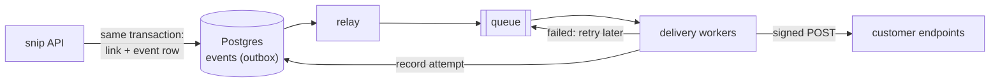
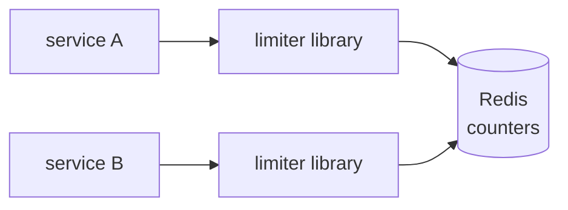
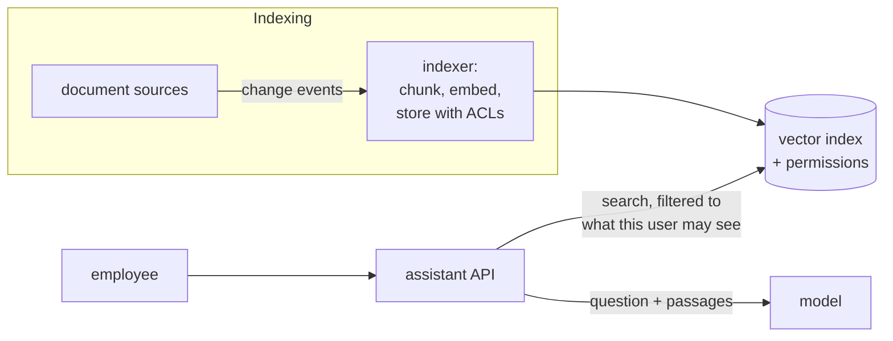

# 15.3 System design practice

System design is a skill, not a body of facts, and skills come from practice. The good news: you already know the building blocks. Queues, caches, retries, idempotency, rate limits, replicas, embeddings, evals. Every one has a chapter in this handbook, and most have running code in snip. What practice adds is **assembly**: choosing which blocks a problem needs, in what shape, and explaining why, under time pressure.

This chapter works through three designs with chapter 15.1's six steps. Each one reuses different parts of the handbook, and each has one genuinely hard problem at its centre. Read each problem statement, and try the first two steps yourself before reading on.

## What you'll learn

- How to apply the six-step method to unfamiliar problems.
- **Webhook delivery**: at-least-once delivery, retries with backoff, idempotency, signing.
- A **shared rate limiter**: algorithms, atomicity, and failing open or closed.
- **Ask the company's documents**: RAG with permissions, freshness and cost.
- How design interviews are **judged**, and the common traps.

---

## Design 1: webhook delivery

**The problem.** snip wants to notify customers' systems when something happens: a link is created, deleted, or passes 1,000 clicks. Customers register a URL; snip sends an HTTP POST to it with a JSON description of the event. That's a **webhook**: an API call in reverse, where your service calls the customer's server.

### Requirements

- **Functional:** customers register and remove endpoint URLs; events are delivered as signed POST requests; customers can see recent deliveries and retry failed ones.
- **Non-functional:** every event is delivered **at least once**, even if the customer's server is down for hours; delivery doesn't slow down snip's own API; one customer's broken or slow endpoint doesn't delay anyone else's events.
- **Out of scope:** guaranteed ordering between events; delivery in under a second.

The key requirement is the first non-functional one. Customers' servers go down, time out, return errors and get redeployed. The design is mostly about what happens then.

### Estimates

Say 1 million links created a day, 20% of owners use webhooks, and each link produces about 2 events over its life: roughly **400,000 events a day, about 5 a second**, peaking at perhaps 50. Tiny for storage and CPU. The real load is **waiting**: a slow customer endpoint can take 10 seconds to answer, and retries multiply attempts. At 50 events a second and 10 seconds each, that's 500 requests in flight at once (Little's law, chapter 8.5).

### Design

- **Never deliver inside the API request.** Creating a link must not wait on a customer's server. The event goes on a queue (chapter 8.2).
- **The outbox pattern** (chapter 8.2) prevents losing events: the API writes the link *and* an event row in the same database transaction, and a relay moves event rows to the queue. Writing to the database and then to the queue separately means a crash between them loses the event. That's the dual-write problem.
- **Delivery workers** take events off the queue and POST them, with a short timeout (5–10 seconds).

### Deep dives

**Retries.** On a timeout, a connection error or a `5xx` response, retry with **exponential backoff and jitter** (chapter 8.1): after 30 seconds, then 2 minutes, 10 minutes, an hour, and so on for a day or two. Then give up, mark the endpoint as failing, and email its owner. Events that exhaust their retries go to a **dead-letter** store (chapter 8.2), where the customer can see and replay them. A `4xx` response usually means the customer's endpoint rejected it deliberately, so don't hammer it.

**At least once means duplicates.** If a customer's server processes an event but its response times out, snip retries, and the event arrives twice. Exactly-once delivery over a network isn't possible (chapter 8.1), so the design gives each event a unique ID, and the documentation tells customers to **deduplicate by ID** (idempotency, chapter 8.1).

**One bad customer mustn't hurt the rest.** If every worker is stuck waiting on one customer's dead endpoint, everyone's events stall. Per-customer limits on concurrent deliveries (a **bulkhead**, chapter 8.4), and a circuit breaker per endpoint: after repeated failures, stop trying for a while and push its events to the slow retry schedule.

**Security, both ways.** Customers must be able to verify a webhook really came from snip: sign each body with an **HMAC** (chapter 7.1) using a secret per endpoint, sent in a header, with a timestamp to prevent replays. And snip must not become a tool for attacking internal networks: a customer who registers `http://169.254.169.254/` is attempting **SSRF** (chapter 7.5). Validate endpoint addresses on registration *and* on every delivery, as snipai's `fetch_page` does (chapter 14.4).

### Trade-offs

At-least-once with deduplication by the customer, rather than attempting exactly-once. No ordering guarantee, because retries reorder events; customers who need order can use a sequence number or a timestamp. A day or two of retries, then a human is told.

---

## Design 2: a shared rate limiter

**The problem.** Several services in a company (snip among them) need rate limits: per API key, per IP address, per user. Instead of each team building its own, design a shared one.

### Requirements

- **Functional:** check "may this key make another request?" with rules like "60 link creations per key per minute"; return how long to wait when the answer is no.
- **Non-functional:** the check adds **under 2 milliseconds** at the 99th percentile, because it sits in front of every request; limits are shared across all copies of a service; a limiter failure must not take down the services that use it.

### Estimates

Say 10 services with a combined **50,000 requests a second** at peak, each needing one check. Each check is one small read-and-increment on a counter. The number of active counters is the number of active keys in the current window, perhaps a million, at around 100 bytes each: **about 100 MB**. That fits in the memory of one Redis server with plenty of room; 50,000 simple operations a second is also well within one Redis instance's reach, with a replica for failover.

### Design

This is snip's own limiter (chapter 8.4), generalised: a library that each service calls, keeping counters in a shared Redis.

A **library** rather than a separate limiter service is deliberate: a service would add a network hop to every request and become a single point of failure. The library talks to Redis directly: one round trip, typically well under a millisecond inside a data centre.

### Deep dives

**The algorithm** (chapter 8.4). A fixed window ("60 per calendar minute") is simplest, but allows bursts of 120 across a minute boundary. A **sliding window** or a **token bucket** smooths that out. The token bucket also expresses "bursts of 10, then 1 a second" naturally, which suits APIs.

**Atomicity.** "Read the counter, check it, increment it" as three separate commands is a race condition (chapter 6.5): two copies of a service both read 59, both allow the request, and the limit is exceeded. The check and the increment must happen as **one atomic operation**, either Redis's `INCR` (which returns the new value) or a small script that Redis runs as a single step.

**When Redis is down: fail open or fail closed?** Failing **open** (allow everything) keeps the services working, with no protection until Redis returns. Failing **closed** (refuse everything) turns a limiter outage into a total outage. For most limits, failing open is right, and it's what snip does (ADR 6). For limits that protect against real harm, such as login attempts (brute-force protection, chapters 7.1 and 8.4), a local, per-copy fallback limit is a good middle ground: less accurate, but never unlimited.

**Hot keys.** One abusive key making 20,000 requests a second hits one Redis key at that rate. Redis handles it, but a small in-process cache ("this key is blocked for the next second") saves the round trips entirely.

### Trade-offs

Slight inaccuracy (a few requests over the limit under races between replicas, or during failover) in exchange for speed and simplicity. Failing open by default, with explicit exceptions for security-critical limits.

---

## Design 3: ask the company's documents

**The problem.** A company of 5,000 people wants an internal assistant that answers questions from its documents: the wiki, policies, engineering runbooks and design docs. It's Part 14's "ask the handbook", at company scale. Some documents are confidential to certain teams.

### Requirements

- **Functional:** ask a question, get an answer with citations to the source documents; say "I don't know" when the documents don't answer it.
- **Non-functional:** **people only ever see content they're allowed to see**, including indirectly through an answer; documents are searchable within an hour of changing; the first words of an answer appear within about two seconds; a known monthly budget.

The first non-functional requirement is the one that makes this hard, and the one most first designs get wrong.

### Estimates

- **Corpus:** 200,000 documents, averaging 5 chunks each: **1 million chunks**. With 1,024-dimensional embeddings as 4-byte numbers, that's 4 KB per chunk, **about 4 GB** of vectors. Brute-force search over a million vectors is slow enough per query that an approximate index (HNSW, chapter 14.7) is worth it; pgvector or a vector database handles this size comfortably.
- **Questions:** 5,000 people, perhaps 3,000 questions a day. With about 4,000 input tokens (the retrieved passages) and 400 output tokens each, at a mid-range price of $2 and $10 per million, that's roughly $0.012 per question, **about $36 a day, around $1,100 a month**. A useful number to put in front of whoever approves the budget, labelled as an estimate.

### Design

### Deep dives

**Permissions.** Each chunk is stored with the **access list** of the document it came from, and the search filters by the asking user's groups **inside the query**, before anything is ranked or sent to the model. Filtering *after* retrieval is wrong twice: it leaks through side channels (answers, citations, timing), and the top results may all be forbidden, leaving nothing. A system prompt saying "don't reveal confidential documents" is not access control (chapter 14.8). And the access lists must be updated when document permissions change, which is as important as updating the text.

**Freshness.** An hour's staleness allows batching: the indexer listens for change events from the wiki and document stores (or polls every few minutes), re-chunks and re-embeds only changed documents, and deletes the chunks of deleted ones. Deletion is easy to forget, and a deleted confidential document that remains searchable is a serious incident.

**Quality.** A labelled set of real employee questions, with the documents that answer them, measuring retrieval and answers separately (chapter 14.10). Hybrid search (keywords plus vectors, chapter 14.7) matters here, because company documents are full of project names, ticket numbers and acronyms that embeddings handle poorly.

**Safety.** Documents are untrusted input too: anyone who can edit a wiki page can plant instructions in it (chapter 14.13). The assistant has no tools that act, only search, and it renders answers as plain text with citations built by code.

### Trade-offs

Up to an hour of staleness in exchange for simple batch indexing. A hosted model, with the data processing agreement that implies, or a self-hosted one at a much higher fixed cost (chapter 14.11). Citations and "I don't know" over fluent answers.

---

## How design interviews are judged

Interviewers aren't checking for a correct answer; there isn't one. They're watching how you work. Typically:

- **Scoping.** Did you ask about requirements and scale before designing? Did you state assumptions out loud?
- **Structure.** Could they follow you? Did you go from the big picture to the details, in an order that made sense?
- **Depth.** Did you find the hard part of *this* problem and go deep on it? For webhooks, that's failures and retries; for the limiter, atomicity and failure mode; for the assistant, permissions.
- **Trade-offs.** Did you name what each choice gives up, and consider alternatives?
- **Communication.** Did you think aloud, check in, and take hints well?

The traps that sink good engineers:

- **Diving into boxes** before understanding the problem.
- **Buzzword architecture**: naming technologies instead of explaining what each piece does and why ("we'll use Kafka" instead of "we need a durable queue so events survive a crash; Kafka or SQS would both work, and here's why I'd pick one").
- **Designing for Google** when the numbers say a single server would do (chapter 15.1).
- **Ignoring failure.** Every arrow can fail. "What happens when this is down?" is the question most likely to come next.
- **Silence.** A long silent think looks like being stuck. Say what you're weighing.
- **Defending instead of listening.** When the interviewer pushes back, they're usually giving you a hint, or testing whether you can change your mind with good reason.

:::info[In the real world]
At work, design isn't a 45-minute performance, but the same things matter, spread over days: a written design document (chapter 15.2) instead of a whiteboard, reviewers instead of an interviewer, and real numbers from production instead of assumptions. The interview is a compressed rehearsal of the real job, which is why practising it makes you better at the job too.
:::

---

## Lab

Practice, ideally with a partner. Each design: 45 minutes, using the six steps and time boxes from chapter 15.1, speaking out loud.

1. **Pick one and design it:**
   - A **pastebin** with expiring pastes (if you didn't do it in chapter 15.1).
   - A **notification service** that sends email, SMS and push notifications for other services, respecting each user's preferences and quiet hours.
   - A **file-sharing service**: upload a file, get a link, the link expires after 7 days.
   - A **leaderboard** for a game with 10 million players: top 100 globally, and each player's own rank.

   Hints, one per problem, if you get stuck: pastebin — pastes are big, so where does the text live? Notifications — what happens when the SMS provider is down, and who decides the retry policy? File sharing — should file bytes pass through your servers at all? Leaderboard — Redis has a data structure made for exactly this (a sorted set).

2. **Play interviewer.** With a partner, take turns. The interviewer's job: give the problem in one sentence, answer requirement questions with realistic numbers, and ask "what happens when *X* fails?" at least twice. Afterwards, score each other on the five things interviewers judge, with one concrete example for each.

3. **Revisit a design from this chapter.** Pick one deep dive above and argue for a different choice (fail closed instead of open; ordered webhook delivery; filtering permissions after retrieval). Write down what it would cost, and in which situation it would be the right call.

---

## Self-check

<Quiz
  id="architecture-system-design-practice"
  questions={[
    {
      q: 'Why does the webhook design write an event row in the same transaction as the link (the outbox pattern)?',
      options: [
        'It’s faster than a queue, since the row is written in the same round trip',
        'A crash between separate writes loses the event; one transaction can’t',
        'Queues can’t store JSON bodies larger than a few kilobytes',
        'To avoid needing a worker, since Postgres sends the webhook itself',
      ],
      answer: 1,
      explain: 'Writing to the database and then to a queue separately can lose the event if the process crashes in between; one transaction makes the link and its event succeed or fail together. The dual-write problem: two separate writes to two systems can’t both be guaranteed without something like an outbox.',
    },
    {
      q: 'Webhooks are delivered at least once. What must customers do as a result?',
      options: [
        'Nothing; the sender guarantees each event arrives exactly once',
        'Deduplicate by event ID, since a delivery may arrive twice',
        'Respond faster than one millisecond, or the event is dropped for good',
        'Poll the API for events instead, as pushed events can’t be trusted',
      ],
      answer: 1,
      explain: 'Deduplicate by event ID, because a timed-out delivery that actually succeeded will be retried. Exactly-once delivery over a network isn’t possible; idempotent handling makes duplicates harmless.',
    },
    {
      q: 'In the shared rate limiter, why must "check and increment" be one atomic operation?',
      options: [
        'Redis rejects increments on keys that weren’t read in the same call',
        'Two requests could read the same count and both get through',
        'It uses less memory, since only one key is stored per client',
        'It makes the limiter fail closed whenever Redis is slow to answer',
      ],
      answer: 1,
      explain: 'Separately, two concurrent requests can both read the same count, both be allowed, and exceed the limit: a race condition. The classic read-modify-write race from chapter 6.5, across processes instead of threads.',
    },
    {
      q: 'In the company document assistant, where must permission filtering happen?',
      options: [
        'In the system prompt, which tells the model what each user may see',
        'In the search query, before ranking, before the model sees anything',
        'After the answer is generated, by removing any restricted sentences',
        'In the user interface, by hiding sources the user can’t open',
      ],
      answer: 1,
      explain: 'Anything retrieved can leak through the answer or citations. Filter at the source; prompts aren’t access control.',
    },
    {
      q: 'Which interview behaviour is most likely to hurt a candidate with a technically sound design?',
      options: [
        'Asking about scale and users first, before offering any design',
        'Naming technologies without saying why each is needed or how it fails',
        'Drawing a simple first design that only handles the basic case',
        'Changing their mind after a hint, which looks like they were unsure',
      ],
      answer: 1,
      explain: 'Naming technologies without explaining what each piece does, why it’s needed, or what happens when it fails. Interviewers judge reasoning. "We’ll use Kafka" says nothing; "we need a durable queue because…" says a lot.',
    },
  ]}
/>

In the webhook design, a customer complains that events arrive out of order: "link deleted" arrived before "link created". Is that a bug, and what are the options?

Not a bug in the design as specified: ordering was explicitly out of scope, and retries naturally reorder events (if "created" failed and was retried a minute later, "deleted" can overtake it).

Options, cheapest first:

1. **Give customers what they need to reorder**: a sequence number per link, or a precise timestamp, in every event. The customer ignores an event older than the last one they applied for that link. That's the common industry approach.
2. **Make events self-contained**: include the link's current state in each event, or offer an API to fetch it, so the customer can always reconcile with the truth instead of replaying history.
3. **Order delivery per link**: deliver one event at a time per link (a per-link queue), never sending the next until the previous succeeded or was given up on. It works, but one failing event blocks all later events for that link, and it's much more complex to run.

Most systems choose 1 and 2. The decision, with its trade-off, belongs in an ADR.

The document assistant's security review finds that a confidential HR document, deleted a month ago, still appears in answers. Walk through how that could happen and how you'd fix the system, not just this document.

How: the indexer handles creations and updates, but a deletion either never produced a change event it listened to, or the event was processed without removing the document's chunks. The vectors (and the text stored with them) stayed in the index, with their old access list, so anyone in the original access list, or everyone if the list wasn't copied, could still retrieve it.

Immediate response: remove the chunks, check the access logs to see who retrieved them (chapter 13.1), and treat it as a data incident, involving the security and privacy people.

Systemic fixes:

- **Deletion as a first-class path**, tested like the others: a test that deletes a document and asserts it can't be retrieved.
- **Periodic reconciliation**: regularly compare the index's document IDs against the sources, and delete anything that no longer exists (or whose permissions changed). Event-driven updates are fast; reconciliation catches what events miss.
- **Store references, not copies**, where possible: check the document still exists and is still permitted at query time before showing it.
- **A metric** for documents in the index but missing at the source, with an alert (chapter 13.4).
- A **postmortem** (chapter 13.5), blameless, with these actions tracked.

