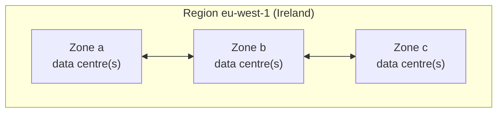

# 12.1 The cloud from zero

Everything in this handbook so far has run on your laptop. Real services run on computers in data centres, and for most companies today those computers belong to someone else: **Amazon Web Services (AWS)**, **Microsoft Azure**, **Google Cloud (GCP)**, or smaller providers. "The cloud" sounds mysterious, and it's mostly this: **renting computers, storage and networks by the second, through an API**, instead of buying and running them yourself. That one change, from buying to renting through an API, made everything in Parts 9–11 possible: CI runners that exist for five minutes, clusters created by a command, infrastructure described in code. It also created new ways to lose money and data. This chapter gives you the mental model before you touch a real account: where the computers are, what you can rent, who is responsible for what, and how to not get a surprise bill.

## What you'll learn

- What cloud providers actually sell, and why companies rent instead of buy.
- **Regions** and **availability zones**, and why geography matters.
- The service models: **IaaS**, **PaaS**, **serverless** and **SaaS**.
- The **shared responsibility model**: what the provider secures, and what you must.
- How **pricing** works, and how to use an account safely from the first minute.

---

## Renting instead of buying

:::note[Everyday anchor]
You can own a car, or use taxis, rentals and car-sharing. Owning is cheaper if you drive all day, every day, and you control everything; but you pay up front, and you handle insurance, repairs and parking. Renting costs more per kilometre, but you pay only when you drive, you can get a van for moving day, and repairs are someone else's problem. The cloud is the rental model for computers.
:::

Before the cloud, launching a service meant buying servers weeks in advance, installing them in a data centre, and guessing capacity: too little and you fall over on launch day, too much and you've wasted money for years. The cloud changed three things:

- **Elasticity**: get 100 machines for an hour, then give them back. Scale with demand (chapter 8.6's autoscaling depends on this).
- **Pay as you go**: no up-front purchase. You pay per second, per gigabyte, per request.
- **Everything is an API**: a machine, a database or a network is created by an HTTPS request. So it can be automated, repeated and described as code (chapter 12.5).

The trade-offs are real too: at steady, predictable scale, renting can cost more than owning; you depend on a provider's reliability and pricing; and the flexibility makes it very easy to create expensive things by accident.

---

## Where the computers are: regions and zones

A cloud provider's infrastructure is organised geographically:

- A **region** is a geographic area with its own data centres: `us-east-1` (Northern Virginia), `eu-west-1` (Ireland), `ap-southeast-2` (Sydney). There are dozens per provider. Regions are largely independent: an outage in one usually doesn't affect others.
- Each region has several **availability zones** (**AZs**): separate data centres (or groups of them), a few kilometres apart, with independent power, cooling and networking, joined by fast private links. `eu-west-1a`, `eu-west-1b`, `eu-west-1c`.



Why it matters:

- **Latency**: data travels through fibre at about two-thirds of the speed of light, roughly 200 km per millisecond. Sydney is about 17,000 km from Northern Virginia, so a round trip can't take less than about 170 ms, whatever you pay. Put services near their users.
- **Availability**: a whole zone can fail (power, flood, a bad network change). Running copies of a service in **two or more zones** in one region (chapter 8.6's replicas, spread out) survives that, and it's the standard production setup. Surviving a whole **region** failing requires a multi-region design: much harder and more expensive.
- **Data residency**: laws may require that some data (health records, personal data of EU residents) stays in a particular country or region.
- **Price and features**: they differ by region. The newest services often launch in the biggest US regions first.

---

## What you can rent: the service models

| Model | You rent | You manage | Examples | snip would be… |
|---|---|---|---|---|
| **IaaS** (infrastructure as a service) | Virtual machines, disks, networks | The OS, runtime, app, scaling, patches | AWS EC2, Azure VMs, GCP Compute Engine | A VM running snip with systemd (chapter 2.5) |
| **Containers / Kubernetes** | A cluster or a container runtime | Your containers and their configuration | EKS, AKS, GKE; ECS | Part 10, on managed Kubernetes |
| **PaaS** (platform as a service) | A platform that runs your code or container | Your app and its configuration | Cloud Run, App Runner, Azure Container Apps, Heroku-style platforms | "Here's the image, run it" |
| **Serverless functions** | Execution of individual functions, per request | Just the function code | AWS Lambda, Azure Functions, Cloud Functions | Each API route as a function |
| **Managed services** | A database, queue or cache run for you | Settings, data and access | RDS / Cloud SQL (Postgres), ElastiCache / Memorystore (Redis), SQS | snip's Postgres and Redis |
| **SaaS** (software as a service) | Finished software | Your data and users | Email, CRM, GitHub itself | (not relevant) |

Moving down the table, you manage less and the provider manages more. That's less work and less control, and usually a higher price per unit of compute. A common modern default: **managed databases** (chapter 10.4's advice) plus **containers** on a PaaS or managed Kubernetes. VMs are reserved for what needs them.

---

## The shared responsibility model

Renting doesn't hand over all responsibility. Every provider publishes a **shared responsibility model**:

- **The provider** secures the cloud itself: physical data centres, hardware, the hypervisor, the network between data centres, and the managed services' internals.
- **You** secure what you put **in** the cloud: your data, who has access (IAM, chapter 12.4), network rules (chapter 12.2), your OS patches (on VMs), your application, your encryption settings.

The dividing line moves with the service model: on a VM you patch the OS; on Cloud Run or RDS the provider does. It never moves past **your data and your access controls**. Almost every well-known cloud data breach has been on the customer's side of the line: a storage bucket left public, an access key committed to Git, an over-permissive role. Not the provider being hacked.

---

## Pricing, and how bills surprise people

You pay for what you use, measured in units:

| What | Typically billed by | Notes |
|---|---|---|
| **Compute** (VMs, containers) | Per second or hour of vCPU and memory | Stopped VMs don't bill compute, but their disks still do |
| **Storage** | Per GB-month, plus per request | Snapshots and old backups quietly accumulate |
| **Managed databases** | Per hour of the instance size, plus storage and I/O | Runs 24/7 whether used or not |
| **Networking** | Per GB **out** of the cloud (egress); cross-zone and cross-region traffic | Traffic **in** is usually free. Egress is the classic hidden cost |
| **Load balancers, NAT gateways, IP addresses** | Per hour, plus per GB | Small hourly charges that never stop |

Ways to pay less for the same thing: **commitments** (reserved instances or savings plans: commit to a level of usage for 1–3 years for large discounts), **spot/preemptible** instances (spare capacity at a steep discount that can be reclaimed at short notice, fine for batch jobs and CI), and simply **turning things off**. Chapter 12.7 covers cost control in depth.

:::danger
Cloud accounts are billed to a credit card, and there's usually **no hard spending limit** by default. Common ways beginners lose real money:
- A leaked **access key** (committed to a public repository) used by attackers to run crypto-miners on huge machines. Bills of thousands per day are common, and keys pushed to GitHub are often found by bots within minutes.
- Forgetting a **managed database, NAT gateway or Kubernetes cluster** after a tutorial. Each costs a few dollars a day, forever.
- A **public bucket** serving a large file that goes viral: egress charges.

Before you create anything: **turn on multi-factor authentication**, **set a budget alert**, **never create access keys for your root account**, and keep a habit of **destroying what you create** (Terraform makes this one command, chapter 12.5).
:::

### Using an account safely from day one

1. **Protect the root user** (the account's owner): a long unique password and MFA, then don't use it day to day.
2. **Create a separate everyday identity** with only the permissions you need (chapter 12.4), also with MFA.
3. **Set a budget with alerts** (for example, at $5 and $20) so the first surprise is an email, not a statement.
4. **Pick one region** for your experiments, so forgotten resources are easy to find.
5. **Prefer short-lived credentials** (single sign-on sessions, OIDC from CI) over long-lived access keys. If you must create keys, never put them in code or Git.
6. **Tag** what you create (`project=snip-lab`), and delete it when you're done.

Free tiers and trial credits exist on all major clouds, but their rules differ and change: read what's included, and treat the budget alert as your real safety net.

:::info[In the real world]
Most companies use one main cloud, sometimes with a second for specific services. "Multi-cloud for its own sake" usually doubles the work for little benefit. Organisations structure their cloud usage as **many accounts** (or projects/subscriptions): separate ones for production, staging and each team, managed centrally with shared guardrails, billing and single sign-on. The account boundary is the strongest isolation a cloud offers, so a mistake in a sandbox account can't touch production. And everything is created through infrastructure as code (chapters 12.5–12.6), not by clicking in the console, so it's reviewable, repeatable and removable.
:::

---

## Lab

Free, and **no cloud account needed**.

1. **Measure distance with physics.** Cloud providers publish an endpoint for each region. Time an HTTPS request to three regions from your computer:
   ```bash
   for r in us-east-1 eu-west-1 ap-southeast-2; do
     printf "%-15s " "$r"
     curl -o /dev/null -s -w '%{time_connect}s connect, %{time_total}s total\n' "https://dynamodb.$r.amazonaws.com/ping"
   done
   ```
   `time_connect` is roughly one network round trip; `time_total` includes the TLS handshake (chapter 7.1), several more round trips. A test machine in the US saw totals of about 0.22 s for Virginia, 0.68 s for Ireland and 0.76 s for Sydney. Yours depend on where you are: the nearest region should be clearly fastest. (If `time_connect` is near zero everywhere, you're behind a proxy, which connects for you; compare `time_total` instead.)

2. **Do the latency arithmetic.** Using 200 km per millisecond, what's the minimum round-trip time between London and Sydney, about 17,000 km apart? (About 170 ms: 17,000 ÷ 200 = 85 ms each way.) Now imagine a page that makes 10 sequential requests from Sydney to a London server. Why do global companies run servers in several regions? (10 × 170 ms is 1.7 seconds of pure physics before any work is done.)

3. **Estimate a bill without an account.** Open a provider's public pricing calculator (search "AWS Pricing Calculator", "Azure pricing calculator" or "Google Cloud pricing calculator") and price snip's production setup from chapter 8.6's capacity plan: 3 small container instances running all month, a small managed Postgres with 20 GB of storage, a small managed Redis, a load balancer, and 50 GB of data out per month. Which item is largest? Which ones cost money even with zero traffic? (Typically the database and the load balancer: they bill by the hour.)

4. **Optional, with a real account**: create a free account on one provider and do **only** the safety steps: MFA on the root user, a budget alert at a small amount, and an everyday identity. Create nothing else yet.

## Self-check

<Quiz
  id="cloud-cloud-from-zero"
  questions={[
    {
      q: 'What is an availability zone?',
      options: [
        'A country, chosen so your data stays under one set of laws',
        'One or more data centres in a region, with their own power and network',
        'A price tier that decides how quickly your machines are replaced if they fail',
        'A standby copy of a whole region, used only when the region fails',
      ],
      answer: 1,
      explain: 'Spreading copies across zones survives a data-centre failure without the complexity of multi-region.',
    },
    {
      q: 'Why can’t any amount of money make a London-to-Sydney round trip take 20 ms?',
      options: [
        'Providers cap long-distance links to keep prices down for everyone',
        'Physics: light in fibre covers ~200 km per ms, so ~170 ms minimum',
        'TLS needs several round trips, and each one adds encryption time on top',
        'The undersea cables are shared, so traffic always waits in a queue',
      ],
      answer: 1,
      explain: 'Latency has a floor set by distance. The fix is to put servers near users.',
    },
    {
      q: 'Under the shared responsibility model, who is responsible for a storage bucket accidentally made public?',
      options: [
        'The cloud provider, since it runs the storage service',
        'The customer: configuration, data and access are always theirs',
        'Nobody; it’s split evenly, so neither side is fully responsible for it',
        'The provider, unless the customer signed a separate security agreement',
      ],
      answer: 1,
      explain: 'Most cloud breaches are customer-side misconfigurations, not provider hacks.',
    },
    {
      q: 'Which usually costs money even when your application gets zero traffic?',
      options: [
        'Serverless functions, which bill for idle time between invocations',
        'A running database, load balancer or NAT gateway: billed by the hour',
        'Incoming network traffic from bots and scanners, which never stops',
        'IAM users and roles, which bill monthly for each identity that exists',
      ],
      answer: 1,
      explain: 'Hourly resources bill whether used or not. Delete them after experiments.',
    },
    {
      q: 'What is the difference between IaaS and PaaS?',
      options: [
        'There is none; the two names come from different cloud providers',
        'IaaS rents you VMs to manage; PaaS takes your code and runs the servers',
        'PaaS is only for managed databases; IaaS covers everything else you run',
        'IaaS is always cheaper, because you pay only for the raw hardware',
      ],
      answer: 1,
      explain: 'Moving from IaaS to PaaS trades control for less operational work.',
    },
    {
      q: 'What should you do first with a brand-new cloud account?',
      options: [
        'Create access keys for the root user, so scripts can manage the account',
        'Put MFA on root, set a budget alert, and make an everyday identity',
        'Launch a large VM to check that the account’s limits are high enough',
        'Pick the cheapest region and move every service there straight away',
      ],
      answer: 1,
      explain: 'Protect the account and your wallet before creating anything.',
    },
  ]}
/>

<details>
<summary>A startup asks whether to buy its own servers or use the cloud. What would you ask, and what would you likely recommend?</summary>

Questions: How predictable is the load (steady, or spiky and growing)? How big is the team, and does anyone want to run hardware? How fast must they launch and change? Are there data-residency rules? What's the budget shape: cash up front, or monthly?

For almost every startup: **the cloud**. There's no up-front purchase, capacity follows demand, managed services (databases, queues) save engineering time that matters more than the price per CPU, and you can experiment and shut things down freely. The case for owning grows later, with **large, steady, predictable** workloads, where the cloud's premium adds up. Some mature companies do move some workloads back ("repatriation") for that reason. Even then, it's a decision to revisit with real numbers, not a starting point.

</details>

<details>
<summary>snip runs in one region, in one availability zone. List what could take it down, and what you'd change first.</summary>

In one zone, a single data-centre problem takes everything down: a power or cooling failure, a network fault, even one bad hardware rack if all copies landed on it. Bad changes (a deploy, a configuration mistake) can take it down anywhere.

First change: **spread across at least two zones**. Run API replicas in different zones (topology spread in Kubernetes, or a multi-zone node group), use a load balancer that spans zones, and use a **managed database with a standby in another zone** (Multi-AZ), which fails over automatically. That's standard, relatively cheap, and protects against the most common infrastructure failures. Going **multi-region** is a much bigger step (data replication, failover, consistency), justified only when a regional outage would cost more than building and running all that.

</details>
