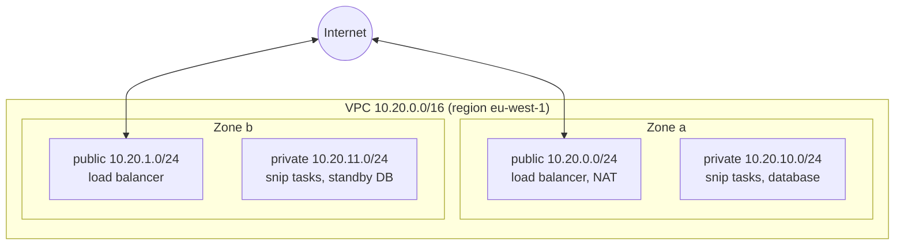

# 12.2 Cloud networking: VPCs, subnets & security groups

When you rent machines in the cloud, they don't sit on the open internet by default. They live in your own **private network**, which you design: which address range it uses, which parts can be reached from the internet, which parts can only reach out, and which machines may talk to which. Get it right and a database is simply unreachable from the internet, whatever its password. Get it wrong and it's one misconfigured rule away from the whole world. This chapter builds snip's AWS network step by step: the address plan, the public and private subnets across two availability zones, the gateways, and the security groups that let the load balancer talk to snip and snip talk to its database, and nothing else. Other clouds use different names for the same ideas (Azure: VNet and NSG; Google Cloud: VPC and firewall rules), so the concepts transfer.

## What you'll learn

- **IP ranges** and **CIDR notation** (`10.20.0.0/16`), well enough to plan a network.
- **VPCs** and **subnets**, and what makes a subnet public or private.
- **Route tables**, **internet gateways** and **NAT gateways**.
- **Security groups** vs **network ACLs**, and least privilege for the network.
- **Load balancers** and **private endpoints**, and how traffic flows through snip's network.

---

## Addresses and CIDR

Chapter 1.4 introduced IP addresses: four numbers from 0 to 255, like `10.20.10.37`. Each is 8 bits, so an IPv4 address is 32 bits. Networks are described as **ranges** of addresses, written in **CIDR notation**: an address, a slash, and the number of leading bits that are **fixed**.

```text
10.20.0.0/16   first 16 bits fixed (10.20),     last 16 free → 2^16 = 65,536 addresses: 10.20.0.0 – 10.20.255.255
10.20.10.0/24  first 24 bits fixed (10.20.10),  last 8 free  → 2^8  = 256 addresses:    10.20.10.0 – 10.20.10.255
10.20.10.5/32  all 32 fixed                                  → exactly one address
0.0.0.0/0      nothing fixed                                  → every IPv4 address ("anywhere")
```

**The bigger the number after the slash, the smaller the range.** A `/16` holds 256 `/24`s.

:::note[Everyday anchor]
CIDR is like postcodes. "SW1A" covers a whole district, "SW1A 1" a smaller area inside it, and "SW1A 1AA" one building. Fixing more characters narrows the area. `10.20.0.0/16` is the district; `10.20.10.0/24` is one street in it.
:::

**Private ranges** are reserved for internal networks and never routed on the public internet: `10.0.0.0/8`, `172.16.0.0/12` and `192.168.0.0/16`. Your home Wi-Fi uses one (often `192.168.x.x`), and so do cloud networks. Two networks that will ever be connected (two VPCs, or a VPC and your office) must use **non-overlapping** ranges, so plan them up front. Changing a VPC's range later means rebuilding it.

---

## VPCs and subnets

A **VPC** (virtual private cloud) is your isolated network in one region, with an address range: snip's is `10.20.0.0/16`. Inside it you create **subnets**: smaller ranges, each living in **one availability zone**.

snip's network module (`snip/infra/aws/modules/network/main.tf`) creates four:

```hcl
# Public subnets: 10.20.0.0/24, 10.20.1.0/24 — for the load balancer and NAT.
resource "aws_subnet" "public" {
  count             = var.az_count                          # 2
  vpc_id            = aws_vpc.this.id
  cidr_block        = cidrsubnet(var.cidr, 8, count.index)  # carve /24s out of the /16
  availability_zone = local.azs[count.index]
}

# Private subnets: 10.20.10.0/24, 10.20.11.0/24 — for app, database, cache.
resource "aws_subnet" "private" {
  count             = var.az_count
  vpc_id            = aws_vpc.this.id
  cidr_block        = cidrsubnet(var.cidr, 8, count.index + 10)
  availability_zone = local.azs[count.index]
}
```

`cidrsubnet("10.20.0.0/16", 8, 10)` means "add 8 bits to the prefix (making a `/24`) and take the 10th one": `10.20.10.0/24`. The layout:



Every tier exists in **both zones**, so losing one zone (chapter 12.1) leaves a working copy of everything.

### What makes a subnet public or private

Not a setting on the subnet: its **route table**, the rules deciding where packets for each destination go.

| Route table | Rule for `0.0.0.0/0` (anywhere else) | Effect |
|---|---|---|
| **Public** | → **internet gateway** | Resources with a public IP can be reached from, and reach, the internet |
| **Private** | → **NAT gateway** (in a public subnet) | Resources can reach **out** (to pull images, call APIs), but nothing on the internet can connect **in** |

Every route table also has an implicit rule that the VPC's own range (`10.20.0.0/16`) is local, so anything in the VPC can route to anything else in it. Whether it's *allowed* to connect is the security groups' job.

- An **internet gateway** is the VPC's door to the internet, in both directions.
- A **NAT gateway** (network address translation) lets private resources make outgoing connections, which appear to come from the NAT's public IP, while blocking incoming ones. It's the same trick your home router does for your laptop.

snip puts only the load balancer and the NAT gateway in public subnets. snip's tasks, Postgres and Redis live in private subnets with **no public IP at all**. They can't be reached from the internet even if every other setting were wrong. That's **defence in depth** (chapter 7.4).

:::warning[What can go wrong]
- **NAT gateway costs**: they bill per hour *and* per GB processed, and a busy private subnet pulling large images or talking to cloud APIs through NAT can run up a surprising bill. **VPC endpoints** (below) send traffic to cloud services privately and more cheaply.
- **One NAT gateway**: snip's module uses one, which is cheaper, but if its zone fails, private subnets in the other zone lose outbound access. Production often runs one per zone.
- **Overlapping ranges**: two VPCs both using `10.0.0.0/16` can never be peered. Plan an address scheme across accounts early.
- **Too-small subnets**: every container task, database and load balancer node takes an IP. A `/28` (16 addresses, some reserved) runs out fast.
:::

---

## Security groups: the firewall around each resource

A **security group** is a stateful firewall attached to individual resources: a task, a database, a load balancer. It lists **allowed** traffic; everything else is denied. **Stateful** means replies to an allowed connection are allowed back automatically.

The powerful part: rules can reference **other security groups** instead of IP ranges. "Allow port 5432 from anything in the `app` group" stays correct however many tasks run and whatever IPs they get. snip's rules (`snip/infra/aws/main.tf`):

| Group | Allows in | From |
|---|---|---|
| `alb` (load balancer) | TCP 80 | `0.0.0.0/0`: the internet |
| `app` (snip's tasks) | TCP 8080 | the `alb` group only |
| `data` (Postgres, Redis) | TCP 5432 and 6379 | the `app` group only |

```hcl
resource "aws_vpc_security_group_ingress_rule" "db_from_app" {
  security_group_id            = aws_security_group.data.id
  referenced_security_group_id = aws_security_group.app.id   # a group, not an IP range
  ip_protocol                  = "tcp"
  from_port                    = 5432
  to_port                      = 5432
}
```

The result is a chain: internet → load balancer → snip → database, with each hop allowed only from the one before it. It's the same shape as chapter 10.3's NetworkPolicies, and chapter 8.3's "only nginx is exposed".

**Network ACLs** (NACLs) are a second, coarser layer: stateless allow/deny rules on whole subnets. Most teams leave them at the default (allow all) and do the real work in security groups, using NACLs only for broad blocks.

:::danger
The two classic network mistakes behind real breaches: a database security group allowing `0.0.0.0/0` on its port "just to test from home", and an SSH port (22) open to the world. Automated scanners find open databases and SSH servers on the internet within minutes. Keep databases in private subnets, reference security groups instead of `0.0.0.0/0`, and reach private resources through a bastion, a VPN, or the provider's session manager, never by opening ports.
:::

---

## Getting traffic in: load balancers

snip's users reach it through an **Application Load Balancer** (ALB), a managed version of chapter 8.3's nginx. It lives in the public subnets of both zones, receives HTTP(S) from the internet, and forwards requests to healthy snip tasks in the private subnets. It checks each task's `/readyz`, exactly like a readiness probe (chapter 10.2). Cloud load balancers come in two main kinds: **layer 7** (HTTP-aware: routing by host and path, TLS termination, like ALB) and **layer 4** (TCP/UDP, very fast, like AWS's NLB). In Kubernetes on a cloud, a Gateway or a `LoadBalancer` Service creates one of these for you (chapter 10.3).

## Reaching cloud services privately

snip's tasks read their database URL from Secrets Manager and send logs to CloudWatch: AWS APIs on the public internet. From a private subnet, that traffic goes out through the NAT gateway. **VPC endpoints** (AWS PrivateLink; Private Service Connect on Google Cloud; Private Endpoints on Azure) give those services an address **inside your VPC**, so the traffic never leaves the provider's network and doesn't pay NAT charges. Large setups add endpoints for storage, container registries, secrets and logs as a matter of course.

To connect networks together: **VPC peering** (two VPCs, directly), **transit gateways** (a hub for many VPCs and on-premises networks), and **VPN** or **dedicated links** (Direct Connect, ExpressRoute) to an office or data centre.

:::info[In the real world]
Companies plan IP address space across all their accounts and regions centrally, like a city plans postcodes, so any two networks can be connected later. A typical production VPC has three tiers of subnets (public, private application, private data) in three zones, NAT per zone, VPC endpoints for the main cloud services, and flow logs recording connection metadata for security investigations. And it's all defined in Terraform modules (chapter 12.6), because nobody can review a network built by clicking.
:::

---

## Lab

Free, and **no cloud account needed**. You'll plan addresses with two tools and read snip's real network configuration.

1. **CIDR arithmetic with Python's standard library.**
   ```bash
   python3 -c "
   import ipaddress as ip
   vpc = ip.ip_network('10.20.0.0/16'); print(vpc.num_addresses)
   sub = ip.ip_network('10.20.10.0/24'); print(sub.num_addresses, sub[0], sub[-1])
   print(ip.ip_address('10.20.10.37') in sub, ip.ip_address('10.21.0.1') in vpc)
   print(list(vpc.subnets(new_prefix=24))[:2])"
   ```
   ```text
   65536
   256 10.20.10.0 10.20.10.255
   True False
   [IPv4Network('10.20.0.0/24'), IPv4Network('10.20.1.0/24')]
   ```

2. **Terraform's CIDR functions**, the ones snip's module uses. With Terraform installed (chapter 12.5), in any empty directory:
   ```bash
   echo 'cidrsubnet("10.20.0.0/16", 8, 10)' | terraform console     # "10.20.10.0/24"
   echo 'cidrhost("10.20.10.0/24", 5)' | terraform console          # "10.20.10.5"
   ```
   Work out the four subnets snip's module creates with `cidrsubnet(var.cidr, 8, count.index)` and `count.index + 10` for `count.index` 0 and 1, then check them with `terraform console`.

3. **Read the real thing.** Open `snip/infra/aws/modules/network/main.tf` and `snip/infra/aws/main.tf`. For each of these, find the line that makes it true:
   - The database has no route from the internet. (Private subnets' route table sends `0.0.0.0/0` to the NAT gateway, not the internet gateway, and RDS has `publicly_accessible = false`.)
   - Only snip's tasks can reach Postgres. (`db_from_app` references the `app` security group.)
   - The load balancer can only forward to port 8080 on snip's tasks. (`alb_to_app` egress.)

4. **Design exercise.** snip adds a nightly batch job that exports links to object storage. Which subnet should it run in, which security group rules does it need, and how would you avoid paying NAT charges for the storage traffic? (Private subnet; outbound only, so no new inbound rules; add a VPC endpoint for the storage service so the traffic stays inside AWS.)

## Self-check

<Quiz
  id="cloud-cloud-networking"
  questions={[
    {
      q: 'How many addresses does 10.20.10.0/24 contain?',
      options: ['24', '256', '65,536', '10'],
      answer: 1,
      explain: '24 bits are fixed, leaving 8 free: 2^8 = 256 addresses (a few are reserved by the cloud in each subnet).',
    },
    {
      q: 'What makes a subnet "public"?',
      options: [
        'Its name, which must start with "public-" for the console to treat it so',
        'Its route table sends 0.0.0.0/0 to an internet gateway',
        'It has a larger address range than the private subnets beside it',
        'It is placed in an availability zone that allows public traffic',
      ],
      answer: 1,
      explain: 'Its route table sends internet-bound traffic (0.0.0.0/0) to an internet gateway. Routing decides reachability. Private subnets route outbound traffic through a NAT gateway instead.',
    },
    {
      q: 'What does a NAT gateway allow?',
      options: [
        'Incoming connections from the internet to private resources',
        'Outgoing connections from private subnets, but not incoming ones',
        'Traffic between availability zones in the same region, at no extra charge',
        'DNS lookups for private resources from outside the VPC',
      ],
      answer: 1,
      explain: 'Outgoing connections from private subnets to the internet, while blocking incoming ones. Private tasks can pull images and call APIs without being reachable from outside.',
    },
    {
      q: 'Why reference a security group (e.g. "from the app group") instead of an IP range in a rule?',
      options: [
        'It is faster, because the firewall compares group names instead of addresses',
        'It stays right as task IPs change, and says the intent: only snip gets in',
        'IP ranges aren’t allowed in rules that point at a managed database',
        'It encrypts the traffic between the two groups automatically',
      ],
      answer: 1,
      explain: 'The rule stays correct as tasks come and go with changing IPs, and it expresses intent: only snip may reach the database. Like Kubernetes label selectors: identity by role, not by address.',
    },
    {
      q: 'Why do snip’s database and tasks run in private subnets with no public IP?',
      options: [
        'It is cheaper, since private subnets don’t pay for public IP addresses at all',
        'Defence in depth: with a bad security group there’s still no route in',
        'Private subnets are faster, as traffic never leaves the zone',
        'Managed databases refuse to start in a subnet that has a public route',
      ],
      answer: 1,
      explain: 'Defence in depth: even if a security group were misconfigured, there is no route from the internet to them. Layers of protection mean one mistake isn’t a breach.',
    },
    {
      q: 'Two VPCs both use 10.0.0.0/16 and now need to be connected. What’s the problem?',
      options: [
        'Nothing; peering translates the addresses automatically',
        'Overlapping ranges can’t be routed; one must be re-addressed, often rebuilt',
        'Peering two networks of that size costs more than running them apart',
        'They must first be moved into the same availability zone and account',
      ],
      answer: 1,
      explain: 'Overlapping ranges can’t be routed between; one network must be re-addressed, which usually means rebuilding it. Plan non-overlapping address space up front, across all accounts and regions.',
    },
  ]}
/>

<details>
<summary>A developer asks you to open Postgres to 0.0.0.0/0 for an hour so they can connect from home. What do you offer instead?</summary>

Say no to opening it, and offer a safe path:
- **Session Manager / port forwarding** through the provider (e.g. AWS Systems Manager): a short-lived, audited tunnel from their laptop to the database, with no open ports.
- A **bastion host** or **VPN** into the VPC, restricted to known users with MFA.
- A **read replica or a sanitised copy** of the data in a development environment, if what they really need is data to explore.

The reason: databases exposed to the internet are found by automated scanners within minutes and hit with password guessing and known exploits. "Just for an hour" is how many breaches start, including rules that were forgotten and never removed.

</details>

<details>
<summary>Trace a request from a user to snip's database in the AWS design, naming each network boundary it crosses.</summary>

1. The user's browser resolves the load balancer's DNS name and connects over the **internet**.
2. It enters the VPC through the **internet gateway**, and reaches the **ALB** in a **public subnet**. The `alb` security group allows TCP 80 from anywhere.
3. The ALB forwards to a healthy snip task on port 8080 in a **private subnet**. The `alb` group allows that egress, and the `app` group allows 8080 from `alb`.
4. snip connects to Postgres on 5432, inside the VPC (the local route). The `data` group allows 5432 from `app` only.
5. The response returns the same way. Security groups are stateful, so replies are allowed automatically.

Separately, snip's task reaches **out** to Secrets Manager and CloudWatch through the **NAT gateway** (or VPC endpoints), and nothing on the internet can initiate a connection to it.

</details>
