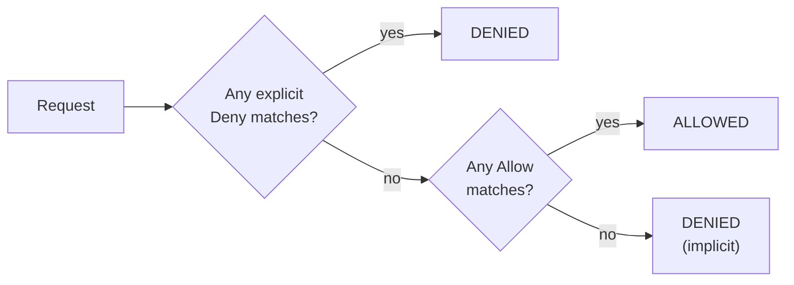

# 12.4 IAM: identity & permissions in the cloud

Everything in a cloud account is an API call: creating a database, reading a secret, deleting a bucket, launching a hundred machines. **IAM** (identity and access management) decides, for every single call, **who** is making it and **whether they're allowed**. It's the most important security control in the cloud, and the one behind most cloud breaches, usually through credentials that were too powerful, lived too long, or leaked. This chapter explains how cloud permissions work, using AWS's model (Azure and Google Cloud use different names for the same ideas). It covers the modern best practice of **temporary credentials everywhere** and walks through snip's two real roles: the one ECS uses to start snip's tasks, and the one GitHub Actions uses to deploy with **no stored keys at all**. The lab reads a real token from GitHub, and that token revealed a bug in this handbook's own configuration.

## What you'll learn

- **Identities**: users, groups and **roles**, human and non-human.
- **Policies**: what they say, and how a request is **evaluated**.
- **Least privilege** in practice: scoping actions, resources and conditions.
- **Temporary credentials**: assuming roles, **workload identity**, and **OIDC federation** for CI.
- **Auditing** who did what, and the mistakes that cause breaches.

---

## Identities: who is asking?

:::note[Everyday anchor]
A large office building. Staff have **ID cards** (users). Cards belong to departments (groups) that open certain doors. But visitors and contractors don't get permanent cards: they sign in at reception and get a **visitor badge** for today, for specific floors (a role, assumed for a while). The cleaning robot has its own badge that only opens the cupboards it needs (a workload identity). Every door logs every swipe (audit logs).
:::

| Identity | What it is | Credentials | Use it for |
|---|---|---|---|
| **Root user** | The account owner | Password + MFA | Almost nothing: a few account-level tasks (chapter 12.1) |
| **IAM user** | A long-lived identity with its own credentials | Password, and possibly **access keys** (long-lived) | Increasingly avoided: prefer SSO for people and roles for machines |
| **Group** | A set of users sharing permissions | (none: it's a container) | Assigning permissions to teams |
| **Role** | A set of permissions that trusted identities can **assume** temporarily | **Temporary** credentials, issued when assumed, expiring in minutes to hours | People via single sign-on; applications; CI; cross-account access |

Human access today usually goes through **single sign-on** (SSO): you log in with your company identity (and MFA), and receive temporary credentials for a role in the account you need. Nobody has a permanent password or key in the cloud account itself. When someone leaves, disabling their company identity cuts off everything.

---

## Policies: what is allowed?

Permissions are written as **policies**: JSON documents with **statements**. Each statement says an **Effect** (Allow or Deny) for **Actions** (API operations like `s3:GetObject`) on **Resources** (identified by **ARNs**, Amazon Resource Names), optionally under **Conditions**. snip's ECS execution role may read exactly one secret:

```hcl
data "aws_iam_policy_document" "read_db_secret" {
  statement {
    actions   = ["secretsmanager:GetSecretValue"]
    resources = [aws_secretsmanager_secret.db_url.arn]   # this secret, and no other
  }
}
```

Terraform renders that as the JSON AWS reads:

```json
{
  "Version": "2012-10-17",
  "Statement": [{
    "Effect": "Allow",
    "Action": "secretsmanager:GetSecretValue",
    "Resource": "arn:aws:secretsmanager:eu-west-1:123456789012:secret:snip-staging/database-url-AbCdEf"
  }]
}
```

### How a request is evaluated

For every API call, AWS gathers all the policies that apply (the identity's policies, the resource's policy, organisation-wide guardrails) and decides:



1. **Everything starts denied** (implicit deny).
2. An **Allow** in an applicable policy permits it…
3. …unless any **explicit Deny** matches, which always wins.

That makes explicit denies powerful guardrails. For example, an organisation-wide rule "deny deleting CloudTrail logs, for everyone" can't be overridden by any Allow, not even an administrator's.

### Least privilege, concretely

**Least privilege** (chapter 7.4) means granting only what's needed. In IAM policies that means narrowing all three dimensions:

- **Actions**: `ecs:UpdateService`, not `ecs:*`, and never `*`.
- **Resources**: this service's ARN, not `*`.
- **Conditions**: only from this network, only with MFA, only with this tag, only from this repository and branch.

snip's GitHub deploy role (`snip/infra/aws/iam-github.tf`) shows all three:

```hcl
statement {
  sid       = "UpdateSnipServices"
  actions   = ["ecs:UpdateService", "ecs:DescribeServices"]       # two actions
  resources = [aws_ecs_service.api.id, aws_ecs_service.worker.id] # two exact services
}
statement {
  sid       = "PassOnlySnipsExecutionRole"
  actions   = ["iam:PassRole"]
  resources = [aws_iam_role.execution.arn]                        # can't hand out any other role
}
```

`iam:PassRole` deserves a note: it's the permission to give a role *to* a service (for example, a new task definition that runs with the execution role). Allowing `iam:PassRole` on `*` would let the deployer launch tasks with *any* role, including an administrator's. That's a classic privilege-escalation path. Scope it to the one role.

Some actions don't support resource-level restrictions (`ecs:RegisterTaskDefinition` is one), so the policy has to use `*` there. The comment in snip's file says so. Knowing which is which is part of the craft, and tools like **IAM Access Analyzer** can generate least-privilege policies from the calls a role actually made.

---

## Temporary credentials everywhere

Long-lived **access keys** (a key ID and secret that never expire) are behind a large share of cloud breaches: committed to Git, left in a laptop backup, pasted into a chat. The modern rule is **no long-lived credentials**. Instead, identities **assume roles** and get temporary ones.

### Workload identity: apps get roles, not keys

An application running in the cloud gets its permissions from **where it runs**, not from a key in its configuration:

| Where the app runs | How it gets a role |
|---|---|
| A VM | An **instance profile**: the VM's metadata service hands out rotating credentials |
| ECS task | A **task role**; ECS itself uses the **execution role** (pulling images, reading secrets, writing logs) |
| Kubernetes on EKS | **EKS Pod Identity** or IRSA: each service account maps to a role |
| GKE / AKS | **Workload Identity** (GKE) / Microsoft Entra Workload ID (AKS) |

The cloud SDKs find these credentials automatically. snip's Go code never contains a secret key, and there's nothing to leak or rotate by hand. snip's tasks don't call AWS APIs at all, so they don't even have a task role: only the **execution role** ECS uses on their behalf to pull the image, write logs and inject the database URL.

### CI without keys: OIDC federation

A CI system isn't running *inside* your cloud, so how does it get a role without a stored key? **OIDC federation** (chapter 11.2). GitHub signs a short-lived **OIDC token** (a JWT, chapter 7.2) describing the workflow run. The cloud is configured to **trust GitHub's signature** and to accept tokens whose **claims** match a condition, then exchanges the token for temporary credentials.

snip's trust policy says "only workflows from this repository, on `main`":

```hcl
condition {
  test     = "StringEquals"
  variable = "token.actions.githubusercontent.com:aud"
  values   = ["sts.amazonaws.com"]
}
condition {
  test     = "StringEquals"
  variable = "token.actions.githubusercontent.com:sub"
  values   = [var.github_oidc_subject]
}
```

The **`sub`** (subject) claim is what makes it safe. Without that condition, *any* GitHub repository in the world could get a token signed by GitHub and assume your role.

:::warning[What can go wrong]
While writing this chapter, snip's trust policy first used the `sub` format found in many tutorials: `repo:jawwadzafar/zero-to-prod:ref:refs/heads/main`. Running the lab below showed the token's real `sub`:

```text
"sub": "repo:jawwadzafar@14356318/zero-to-prod@1386266345:ref:refs/heads/main"
```

GitHub's format includes **immutable numeric IDs** for the owner and repository, so that a repository deleted and re-created under the same name by someone else can't inherit your trust. The `StringEquals` condition would never have matched, and deploys would have failed with "Not authorized to perform sts:AssumeRoleWithWebIdentity". The fix was to use the exact subject, and the lesson is general: **read the real token** rather than trusting documentation from memory. Errors in trust policies fail closed (access denied), which is the safe direction, but they're confusing to debug without seeing the claims.
:::

---

## Auditing: who did what?

Every API call in a cloud account can be logged: **CloudTrail** on AWS, **Activity Log** on Azure, **Cloud Audit Logs** on Google Cloud. Each entry records who (identity, and which role session), what (the action and resource), when, from where (IP address) and whether it was allowed. It's how you investigate an incident ("which identity deleted this bucket?") and how you detect abuse ("why is a CI role calling `iam:CreateUser` at 3 a.m.?"). Turn it on for all regions, send the logs to a separate, locked-down account, and protect them with explicit denies. Attackers delete logs first.

:::danger
The IAM mistakes behind real breaches, in rough order of frequency:
- **Long-lived access keys leaked**: committed to a public repository, found by bots within minutes, used to mine cryptocurrency or steal data.
- **Wildcards**: `"Action": "*", "Resource": "*"` attached to an application role "to make it work", so one compromised app owns the account.
- **Unconditioned trust**: a role trusting a whole service or identity provider with no `sub`-style condition, assumable by strangers.
- **`iam:PassRole` on `*`**: escalation to any role.
- **No MFA** on human identities, and no alerting on root-user activity.
:::

:::info[In the real world]
Mature organisations use **many accounts** (per environment, per team) joined in an organisation. On top of that they apply **service control policies**, account-wide guardrails no one inside can bypass ("no one may disable CloudTrail", "only these regions"). People sign in through SSO with MFA, workloads use workload identity, and CI uses OIDC federation. There are no long-lived keys anywhere. Policies are written in Terraform, reviewed in pull requests, and checked by linters and access analysers, and unused permissions are regularly trimmed from roles based on what they actually called.
:::

---

## Lab

Free, with a GitHub account. **No cloud account needed.**

1. **Read a real OIDC token's claims.** This repository contains a workflow that asks GitHub for an OIDC token and prints its claims (never the token itself): `.github/workflows/oidc-claims.yml`. In your **fork**, open **Actions** → **OIDC claims (lab)** → **Run workflow**. Its output looks like this:
   ```json
   {
     "iss": "https://token.actions.githubusercontent.com",
     "aud": "sts.amazonaws.com",
     "sub": "repo:jawwadzafar@14356318/zero-to-prod@1386266345:ref:refs/heads/main",
     "repository": "jawwadzafar/zero-to-prod",
     "ref": "refs/heads/main",
     "workflow": "OIDC claims (lab)",
     "event_name": "workflow_dispatch",
     "exp": 1790290569,
     "iat": 1790290269
   }
   ```
   `iss` is who signed it, `aud` is who it's for, `sub` is the identity the cloud checks, and `exp − iat` shows its lifetime: 300 seconds. Yours will show your account and fork.

2. **Read the workflow.** How does it decode the token? (A JWT is three base64url parts separated by dots, chapter 7.2. The script takes the middle one and decodes it.) Why does it run `::add-mask::` on the token? (So that if it were ever printed, the logs would show `***`.)

3. **Read snip's roles** in `snip/infra/aws/compute.tf` and `iam-github.tf`, and answer:
   - Which identity is trusted to assume the execution role? (The ECS tasks service, `ecs-tasks.amazonaws.com`.)
   - Could a workflow on a feature branch of this repository assume the deploy role? (No: `sub` must end in `ref:refs/heads/main`.)
   - Could the deploy role delete the database? (No: it can only update two ECS services, register task definitions, and pass one role.)

4. **Evaluate these requests** against snip's deploy-role policy, using the flowchart above:
   - `ecs:UpdateService` on the `api` service → ? (Allowed.)
   - `ecs:UpdateService` on another team's service → ? (Implicitly denied: not in `resources`.)
   - `iam:PassRole` for an administrator role → ? (Implicitly denied: only the execution role is allowed.)
   - `s3:DeleteBucket` → ? (Implicitly denied: no statement allows it.)

## Self-check

<Quiz
  id="cloud-iam"
  questions={[
    {
      q: 'A request matches one Allow statement and one explicit Deny statement. What happens?',
      options: ['Allowed', 'Denied: an explicit Deny always wins', 'It depends on the order', 'An error'],
      answer: 1,
      explain: 'Default deny, allows grant, explicit denies override everything. That’s what makes guardrails reliable.',
    },
    {
      q: 'Why are roles with temporary credentials preferred over IAM users with access keys?',
      options: [
        'Roles are free',
        'Temporary credentials expire within hours, so a leak has a short useful life, and there’s no long-lived secret to store, rotate or accidentally commit',
        'Access keys don’t work with the CLI',
        'Roles have more permissions',
      ],
      answer: 1,
      explain: 'Most cloud breaches involve long-lived keys. Temporary credentials remove that whole class of problem.',
    },
    {
      q: 'How does snip’s CI deploy to AWS without any stored AWS secret?',
      options: [
        'It uses the root user',
        'OIDC federation: GitHub issues a signed token about the workflow run, AWS verifies it and the sub condition, and returns temporary credentials for the deploy role',
        'It stores keys in GitHub Secrets',
        'It doesn’t deploy',
      ],
      answer: 1,
      explain: 'Trust is based on a verifiable identity (repository, branch), not on a shared secret.',
    },
    {
      q: 'What would happen if the deploy role’s trust policy checked only aud and not sub?',
      options: [
        'Nothing, aud is enough',
        'Any GitHub repository could obtain a GitHub-signed token for that audience and assume the role',
        'No one could assume it',
        'Only forks could assume it',
      ],
      answer: 1,
      explain: 'GitHub signs tokens for everyone. The sub condition is what pins the trust to your repository and branch.',
    },
    {
      q: 'Why is iam:PassRole on "*" dangerous?',
      options: [
        'It costs money',
        'It lets the holder give any role, including administrator roles, to services they launch: a privilege-escalation path',
        'It deletes roles',
        'It disables MFA',
      ],
      answer: 1,
      explain: 'Scope PassRole to the exact roles a deployer legitimately hands out.',
    },
    {
      q: 'What did reading the real OIDC token reveal about snip’s first trust policy?',
      options: [
        'The token was expired',
        'GitHub’s sub claim includes immutable owner and repository IDs, so the tutorial-style condition would never have matched',
        'The audience was wrong',
        'GitHub doesn’t support OIDC',
      ],
      answer: 1,
      explain: 'Always check real claims. A trust policy that never matches fails closed, safely but confusingly.',
    },
  ]}
/>

<details>
<summary>Write, in words, a least-privilege policy for a nightly job that exports snip's links to one S3 bucket.</summary>

- **Identity**: a **task role** (or workload identity) for the export job only, not shared with the API.
- **Actions**: `s3:PutObject` only. Not `s3:*`, no `GetObject` (it only writes) and no `DeleteObject`.
- **Resources**: `arn:aws:s3:::snip-exports/links/*`, only that bucket and prefix.
- **Conditions**: require server-side encryption on upload (`s3:x-amz-server-side-encryption`), and optionally restrict to requests arriving through the VPC endpoint (`aws:SourceVpce`), so the credentials are useless from anywhere else.
- **Database access**: a read-only database user with `SELECT` on `links` only, separate from the API's.

Also: no long-lived keys (the job gets credentials from its task role), and CloudTrail/S3 access logs so every export is auditable.

</details>

<details>
<summary>You find an IAM user "ci-deployer" with an access key created three years ago and AdministratorAccess. What do you do, in order?</summary>

1. **Assess**: check CloudTrail for what the key has been used for and from where. Does anything look unexpected?
2. **Replace** before removing: set up an OIDC-federated role for CI with least-privilege permissions (like snip's deploy role), switch the pipeline to it, and verify deploys work.
3. **Deactivate** the old access key (deactivate first, so you can reactivate if something unexpected breaks), watch for failures for a short period, then **delete** it and the user.
4. If the logs showed anything suspicious, treat it as an **incident** (chapter 13.5): assume the key leaked, investigate what it touched, and rotate anything it could read.
5. **Prevent recurrence**: an organisation policy or regular review that flags long-lived keys and administrator access on non-human identities.

</details>
