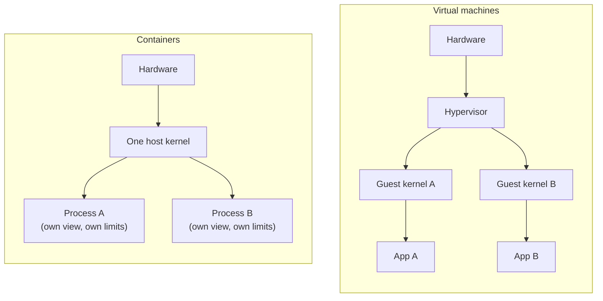

# 9.1 What a container really is

You've been using Docker since the setup chapter: one command, and a Postgres database appears; another, and it's gone without a trace. It can feel like magic, and magic is hard to debug. This chapter removes it. A container is **not** a small virtual machine. It is an **ordinary process** on a Linux machine, the same kind you met in chapter 1.2. The kernel gives it a private view of the system and a budget of resources, and it starts from a filesystem that was packed into an **image**. By the end you'll have built a "container" yourself with one Linux command, found a Docker container in the host's process list, and watched the kernel kill one for using too much memory.

## What you'll learn

- The problem containers solve, and how they differ from **virtual machines**.
- The three ingredients: **namespaces** (what a process can see), **cgroups** (what it can use), and a **layered image** (what files it starts with).
- **Images vs containers**, and **registries, tags and digests**.
- The everyday commands: `run`, `ps`, `logs`, `exec`, `stop`, `rm`, ports, environment variables and limits.
- What containers **don't** give you: a different kernel, strong isolation by default, or data that survives on its own.

---

## The problem: "works on my machine"

A program never runs alone. snip needs a particular operating-system setup, CA certificates to talk HTTPS, a timezone database, and the right versions of everything underneath. Postgres needs its own libraries, configuration and data directory. Install all that directly on a server and you get trouble:

- **Version clashes**: app A needs library v1, app B needs v2, and one machine has one `/usr/lib`.
- **Drift**: the laptop, the test server and production were each set up by hand, slightly differently. The bug only happens on one of them.
- **Messy upgrades and removals**: uninstalling never quite removes everything.

:::note[Everyday anchor]
Before the 1950s, cargo was loaded onto ships piece by piece: sacks, barrels and crates of every shape, repacked at every port. The **shipping container** changed the world by being boring: one standard box. Whatever's inside, every crane, ship, train and lorry knows how to lift, stack and move it. Software containers do the same. Whatever's inside (Go, Python, Postgres), every machine with a container runtime knows how to start, stop and move it.
:::

### Containers vs virtual machines

A **virtual machine** (VM) pretends to be a whole computer: virtual CPU, memory and disk, running its **own complete operating system**, kernel included, on top of a **hypervisor**. A **container** doesn't pretend to be a computer. It is a process on the host, using the **host's kernel**, with walls around what it can see and use.



| | Virtual machine | Container |
|---|---|---|
| Contains | A whole OS, kernel included | A process plus its files |
| Starts in | Tens of seconds to minutes | Milliseconds to seconds |
| Size | Gigabytes | Megabytes (snip's image: about 40 MB) |
| Kernel | Its own: can run Windows on Linux | The host's: Linux containers need a Linux kernel |
| Isolation | Strong (hardware-assisted) | Good, but weaker: one shared kernel |

:::note[Everyday anchor]
VMs are **detached houses**: each has its own foundations, plumbing and roof. Solid separation, but expensive and slow to build. Containers are **flats in one building**: each has its own front door, rooms and meter, but they share the foundations and the plumbing (the kernel). Cheap, quick, dense, and a problem with the shared plumbing affects everyone.
:::

They're not rivals: in the cloud, your containers almost always run *inside* VMs. On a Mac or Windows laptop, Docker Desktop quietly runs a small **Linux VM** and your containers live inside it, because Linux containers need a Linux kernel.

---

## Ingredient 1: namespaces, what a process can see

A **namespace** gives a process its own private copy of one part of the system. The kernel has several kinds:

| Namespace | The process gets its own… | So inside the container… |
|---|---|---|
| **PID** | process-ID numbers | its main program is PID 1 and it can't see the host's processes |
| **Mount** | filesystem tree | `/` is the image's files, not the host's |
| **Network** | network interfaces, IP address, ports | it has its own `localhost` and port 8080, separate from yours |
| **UTS** | hostname | it has its own hostname |
| **User** | user IDs (optionally) | "root" inside can map to a nobody outside |
| **IPC** | shared-memory areas | it can't poke at other processes' shared memory |

You can make one yourself, with no Docker at all, using the Linux `unshare` command ("un-share these parts with my parent"):

```bash
sudo unshare --pid --fork --mount-proc --uts bash
hostname box-demo      # change the hostname: only inside this namespace
echo $$                # this shell's PID
ps -e                  # every process this shell can see
exit
```

```text
1
    PID TTY          TIME CMD
      1 ?        00:00:00 bash
      4 ?        00:00:00 ps
```

The shell believes it's PID 1 on a machine with two processes, called `box-demo`. Outside, the host's hostname hasn't changed and the shell is just another process with a normal PID. That's the core of a container: **a process with a different view**.

## Ingredient 2: cgroups, what a process can use

Namespaces hide things. They don't stop a process from eating all the memory or CPU. **Control groups** (cgroups) do: the kernel puts processes into groups and enforces limits on each group's memory, CPU time, number of processes and disk I/O, while also measuring their usage.

When you run `docker run --memory 64m --cpus 0.5`, Docker creates a cgroup with those limits and puts the container's processes in it. If the container goes over its **memory** limit, the kernel's **OOM killer** (out of memory) kills it with SIGKILL (chapter 1.2). Docker then reports exit code **137** (128 + signal 9) and `OOMKilled: true`. You'll trigger this in the lab. A container that "keeps restarting with code 137" is almost always hitting its memory limit. Going over a **CPU** limit doesn't kill anything: the process is just **throttled**, made to wait, and gets slower.

:::info[If you've written code]
Runtimes need to know about these limits. Go (since 1.25) reads the cgroup CPU limit and sets `GOMAXPROCS` to match, so a Go service limited to 2 CPUs on a 64-core machine doesn't start 64 busy threads. For memory, set `GOMEMLIMIT` a little below the container's limit so the garbage collector works harder before the kernel kills you. Java, Node.js and Python have their own equivalents. A program that doesn't know it's in a box sizes itself for the whole machine.
:::

## Ingredient 3: the image, what files it starts with

An **image** is a packaged filesystem plus some settings: which program to run, which user, which ports, which environment variables. It's built as a stack of read-only **layers**, where each layer records the files added or changed by one build step:

```text
layer 4:  COPY snip, snip-worker → /usr/local/bin/   (≈ 28 MB)
layer 3:  timezone data, CA certificates             (≈ 4.5 MB)
layer 2:  /etc/passwd with a "nonroot" user          (tiny)
layer 1:  base files                                 (≈ 0.6 MB)
```

When a container starts, the runtime stacks the layers into one view (an **overlay filesystem**) and adds a thin **writable layer** on top, private to that container. Writing a file puts it in the writable layer. "Changing" a file from the image copies it up into the writable layer first (**copy-on-write**), and the image itself never changes. Two consequences:

1. **Layers are shared.** Ten containers from the same image, or ten images built on the same base, store the common layers once, on disk and in downloads.
2. **The writable layer is thrown away with the container.** Anything a container writes that isn't in a **volume** (a directory mounted from outside, chapter 9.3) is gone when the container is removed. That's why the Postgres containers in earlier labs used a volume for their data.

---

## Images vs containers

:::note[Everyday anchor]
An **image** is a recipe card, printed and laminated: it never changes. A **container** is a cake baked from it: you can bake many, each can get frosting of its own (the writable layer), and eating one doesn't affect the card. In programming terms: the image is a class, containers are instances.
:::

| | Image | Container |
|---|---|---|
| What | A read-only template: layers + settings | A running (or stopped) process made from an image |
| Made by | `docker build` (chapter 9.2) or `docker pull` | `docker run` |
| Lives in | Your local image store, and registries | Your machine, until `docker rm` |
| Listed by | `docker images` | `docker ps -a` |

### Registries, tags and digests

Images are shared through **registries**: servers that store and serve images. Docker Hub is the default; GitHub Container Registry (`ghcr.io`), and each cloud's registry (chapter 12) are common too. An image's full name says where it lives:

```text
docker.io/library/postgres:16-alpine
└─registry─┘└─repository────┘└─tag───┘
```

- A **tag** (`16-alpine`, `latest`) is a human-friendly label that **can be moved** to a different image later. `postgres:16` today and `postgres:16` next month are different images (a newer 16.x).
- A **digest** (`postgres@sha256:4d89…`) is the SHA-256 hash of the image's contents (chapter 7.1). It **can never change**: the same digest is always exactly the same bytes.

Tags are convenient; digests are reproducible. Chapter 9.4 covers when to use which.

---

## The everyday commands

| Command | Does |
|---|---|
| `docker run -d --name snip -p 8080:8080 IMAGE` | Create and start a container in the background (`-d`), named `snip`, forwarding port 8080 on your machine to port 8080 inside it |
| `docker run --rm -it IMAGE sh` | Run interactively (`-it`) with a shell; `--rm` deletes the container when it exits |
| `-e KEY=value` | Set an environment variable (chapter 7.6: config lives in the environment) |
| `-v NAME:/path` | Mount a volume, so data at `/path` survives the container |
| `--memory 256m --cpus 1` | Set cgroup limits |
| `docker ps` / `docker ps -a` | List running / all containers |
| `docker logs -f snip` | Show (and follow) what the container wrote to stdout and stderr |
| `docker exec -it snip sh` | Run another command inside a running container's namespaces |
| `docker stop snip` | SIGTERM, then SIGKILL after 10 seconds: graceful shutdown (chapter 5.4) |
| `docker rm snip` | Delete a stopped container (and its writable layer) |
| `docker images` / `docker rmi IMAGE` | List / delete images |
| `docker stats` | Live CPU and memory use against the limits |

**Port mapping** deserves a sentence. The container has its own network namespace, so snip listening on port 8080 *inside* is invisible from your machine until you publish it with `-p HOST_PORT:CONTAINER_PORT`. `-p 9000:8080` would make it `localhost:9000` on your side. Containers on the same Docker network reach each other by name instead (chapter 9.3).

:::warning[What can go wrong]
- **"Connection refused" on a published port**: the program inside listens on `127.0.0.1`, which in its namespace means *only the container itself*. Servers in containers must listen on `0.0.0.0` (all interfaces). snip's default `:8080` does.
- **Data loss**: a database container without a volume loses everything on `docker rm`.
- **Exit code 137**: out of memory (or killed). Check `docker inspect NAME` for `OOMKilled`.
- **"exec format error"**: the image was built for a different CPU architecture (an `amd64` image on an Apple Silicon `arm64` Mac, or the reverse). Chapter 9.4 covers multi-architecture images.
- **Treating containers as a strong security boundary**: they share the host kernel, so a kernel bug can let a process escape. Run as a non-root user, don't use `--privileged`, and never mount the Docker socket into a container you don't fully trust (chapter 9.4).
:::

:::info[In the real world]
"Docker" is several things: a company, a command-line tool, and a daemon. The parts are standardised by the **Open Container Initiative (OCI)**: the image format and the runtime spec. So an image built with Docker runs under **containerd** (what Kubernetes typically uses), **Podman** (a daemonless Docker alternative, popular on Red Hat systems) or a cloud's container service, unchanged. Underneath them all is a small program, usually **runc**, that asks the kernel for the namespaces and cgroups. What you learn here transfers everywhere.
:::

---

## Lab

Free, on your own computer with Docker running (on a Mac or Windows, `unshare` must run inside Linux: use step 1 in a Linux VM, WSL, or skip it).

1. **Make a namespace by hand** (Linux only). Run the `unshare` example above. In another terminal, run `ps -ef | grep "bash"` and find your "PID 1" shell with its real, ordinary PID.

2. **Same kernel, different files.** Compare your machine with an Alpine Linux container:
   ```bash
   uname -r; grep PRETTY /etc/os-release
   docker run --rm alpine:3.22 sh -c 'uname -r; grep PRETTY /etc/os-release; ps; hostname'
   ```
   A test machine (Ubuntu host) gave:
   ```text
   6.18.44-fc-v37
   PRETTY_NAME="Ubuntu 24.04.4 LTS"
   6.18.44-fc-v37                 ← same kernel
   PRETTY_NAME="Alpine Linux v3.22"   ← different files
   PID   USER     TIME  COMMAND
       1 root      0:00 sh -c uname -r; ...
       9 root      0:00 ps
   c910a0d214af                   ← hostname = container ID
   ```
   (On a Mac or Windows, the "host" kernel in the container is Docker Desktop's Linux VM, not your OS.)

3. **Find a container in the host's process list.** Build snip's image and run it with limits:
   ```bash
   cd ~/code/zero-to-prod/snip
   docker build -t snip:dev .
   docker run -d --name z2p -p 8089:8080 --memory 64m --cpus 0.5 snip:dev
   curl localhost:8089/healthz
   docker top z2p                                   # the container's processes, with HOST PIDs
   ps -eo pid,user,cmd | grep '[u]sr/local/bin/snip'  # Linux: the same process, seen from the host
   docker stats --no-stream z2p                     # usage vs the 64 MiB limit
   ```
   ```text
   31763 65532    /usr/local/bin/snip
   NAME   CPU %   MEM USAGE / LIMIT   PIDS
   z2p    0.00%   2.848MiB / 64MiB    7
   ```
   User `65532` is the image's `nonroot` user. Now try to get a shell:
   ```bash
   docker exec z2p sh
   ```
   ```text
   exec: "sh": executable file not found in $PATH
   ```
   snip's image contains no shell and no tools at all, just snip, certificates and timezone data. That's deliberate (chapter 9.4). Clean up with `docker rm -f z2p`.

4. **Watch the OOM killer.** `tail /dev/zero` reads an endless stream of zero bytes with no line breaks, holding it all in memory while it waits for a line that never ends:
   ```bash
   docker run --name oomtest --memory 32m alpine:3.22 sh -c 'tail /dev/zero'; echo "exit=$?"
   docker inspect oomtest --format 'OOMKilled={{.State.OOMKilled}} ExitCode={{.State.ExitCode}}'
   docker rm oomtest
   ```
   ```text
   exit=137
   OOMKilled=true ExitCode=137
   ```

5. **The writable layer is temporary.**
   ```bash
   docker run --name w1 alpine:3.22 sh -c 'echo hi > /note.txt; cat /note.txt'   # hi
   docker diff w1                                   # A /note.txt  (A = added, in w1's writable layer)
   docker run --rm alpine:3.22 cat /note.txt        # No such file: a new container starts clean
   docker rm w1
   ```

## Self-check

<Quiz
  id="containers-what-a-container-is"
  questions={[
    {
      q: 'What is a running container, from the host kernel’s point of view?',
      options: [
        'A small virtual machine with its own kernel',
        'An ordinary process (or group of processes) with its own namespaces and cgroup limits',
        'A compressed file',
        'A Docker-only feature unrelated to Linux',
      ],
      answer: 1,
      explain: 'In the lab, snip appeared in the host’s ps output with a normal PID. Namespaces change its view; cgroups limit its resources.',
    },
    {
      q: 'Namespaces and cgroups do different jobs. Which is right?',
      options: [
        'Namespaces limit memory; cgroups hide processes',
        'Namespaces control what a process can see; cgroups control how much it can use',
        'Both only affect networking',
        'Cgroups are for Windows; namespaces are for Linux',
      ],
      answer: 1,
      explain: 'The PID, mount, network and UTS namespaces give a private view. Cgroups enforce memory, CPU and process-count limits.',
    },
    {
      q: 'A container keeps restarting and exits with code 137. What is the most likely cause?',
      options: [
        'A syntax error in the code',
        'It exceeded its memory limit and the kernel’s OOM killer sent SIGKILL (128 + 9 = 137)',
        'The port was already in use',
        'The image tag was wrong',
      ],
      answer: 1,
      explain: 'Confirm with docker inspect (OOMKilled: true), then fix the memory use or raise the limit.',
    },
    {
      q: 'You run Postgres in a container without a volume, then docker rm it. What happens to the data?',
      options: [
        'It is saved in the image',
        'It is lost: it lived in the container’s writable layer, which is deleted with the container',
        'Docker backs it up automatically',
        'It moves to the host’s /var/lib/postgresql',
      ],
      answer: 1,
      explain: 'Images are read-only; each container’s writes go to its own temporary layer. Data that must survive belongs in a volume.',
    },
    {
      q: 'What is the difference between an image tag and a digest?',
      options: [
        'There is none',
        'A tag is a movable label; a digest is the content’s hash, so it always refers to exactly the same image',
        'Digests are for private images only',
        'Tags are more secure than digests',
      ],
      answer: 1,
      explain: 'postgres:16 changes as new 16.x releases ship. postgres@sha256:… never changes.',
    },
    {
      q: 'Why can’t a Linux container run directly on macOS without a VM?',
      options: [
        'macOS forbids containers',
        'Containers use the host’s kernel, and a Linux container needs a Linux kernel, which Docker Desktop provides in a small VM',
        'Containers need a GPU',
        'Docker only works on Ubuntu',
      ],
      answer: 1,
      explain: 'A container is not a VM. It brings files, not a kernel.',
    },
  ]}
/>

<details>
<summary>A colleague says "containers are just lightweight VMs". What's right and wrong about that?</summary>

**Right** in how they're *used*: both package an application with its environment and run it isolated from other applications, and containers are much lighter.

**Wrong** in how they *work*: a VM runs its own complete operating system, kernel included, on virtual hardware. A container is an ordinary process on the host, using the **host's kernel**, made to look separate by namespaces and limited by cgroups. That's why containers start in milliseconds and are megabytes in size. It's also why they can't run a different kernel (Windows on Linux), and why their isolation is weaker: all containers on a host share one kernel, so a kernel vulnerability affects them all. Many platforms run containers *inside* VMs to get both benefits.

</details>

<details>
<summary>Why does snip's image have no shell, and how would you debug it without one?</summary>

Every program in an image is something an attacker could use if they got in (a shell, `curl` to download tools, a package manager), and something that needs security updates. snip's distroless image contains only snip, CA certificates and timezone data. That's smaller, has fewer vulnerabilities to patch, and gives an intruder nothing to work with (chapter 9.4).

To debug without a shell: read **logs** (`docker logs`) and **metrics**, which is how you should debug in production anyway (Part 13). Use `docker inspect` for configuration and state, and `docker top` and `docker stats` from outside. When you truly need tools, attach a separate **debug container** that shares the target's namespaces, for example `docker run -it --rm --pid container:z2p --network container:z2p alpine:3.22 sh`, which sees snip's processes and network. Kubernetes has the same idea built in (`kubectl debug`, chapter 10.5).

</details>
