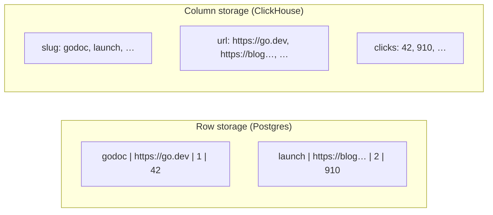
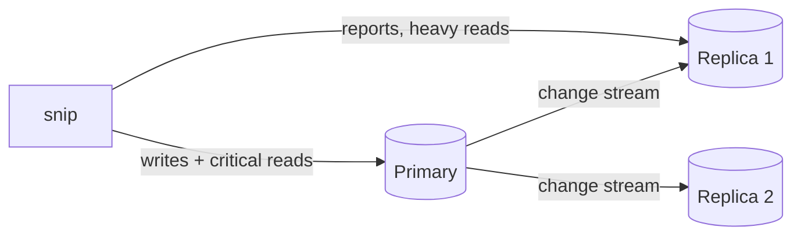

export const flexSetup = `
CREATE TABLE links (
  slug text PRIMARY KEY,
  url text NOT NULL,
  title text,
  meta jsonb NOT NULL DEFAULT '{}'
);
INSERT INTO links VALUES
 ('godoc','https://go.dev/doc/','Go documentation: tutorials, guides and references','{"tags":["go","docs"],"utm":{"source":"newsletter"}}'),
 ('pgdocs','https://www.postgresql.org/docs/','PostgreSQL documentation for every version','{"tags":["postgres","docs"]}'),
 ('launch','https://blog.example/launch','We are launching our new product today','{"tags":["marketing"],"utm":{"source":"twitter","campaign":"launch"}}'),
 ('talk','https://slides.example/talk','Slides: scaling Postgres databases in production','{"tags":["postgres","talks"]}');
CREATE INDEX links_meta_idx ON links USING gin (meta);
CREATE INDEX links_title_fts ON links USING gin (to_tsvector('english', coalesce(title, '')));
`;

# 6.8 Choosing a datastore

Walk into any engineering discussion about data and you'll hear a dozen names: Postgres, MySQL, MongoDB, DynamoDB, Cassandra, Redis, Elasticsearch, ClickHouse, S3, Pinecone, Neo4j… Each has passionate fans, and each is genuinely excellent at *something*. The danger is choosing by fashion — adding a new database because it's popular, then running and paying for it forever. This chapter gives you a map of the landscape: what each kind of datastore is actually good at, how far plain Postgres can take you, and a practical way to decide. It closes Part 6 by answering the question you'll be asked in every design review and system-design interview: *"why this database?"*

## What you'll learn

- The major **kinds of datastores** — what each stores well, and what it's bad at.
- **Row vs column storage**, and why analytics databases are so fast at "sum over a billion rows".
- **Object storage** for files, and why images don't belong in your database.
- How much **Postgres alone** can do (JSON documents, full-text search, vectors) — tried live.
- **Replication**, the **CAP** trade-off, and a **decision guide** — applied to snip's future features.

---

## Start from the questions, not the product

Every datastore makes trade-offs between the same things: **how data is shaped**, **how it's queried**, **how much there is**, **how fast it arrives**, and **how correct it must be**. So the first step is never "which database is best?" — it's writing down your answers:

- **Shape**: tables with relations? Nested documents? Files? Time-stamped measurements?
- **Access pattern**: look up one item by key? Flexible queries and joins? Scan and summarise billions of rows? Search text? Find "similar" items?
- **Volume and velocity**: megabytes or petabytes? Ten writes a second or a million?
- **Correctness**: must every read see the latest write? Can a few seconds of staleness or a lost event be tolerated?

Then pick the simplest thing that answers them well.

:::note[Everyday anchor]
Choosing a datastore is like choosing a vehicle. A family car (Postgres) does almost everything well: commuting, shopping, holidays. A lorry moves huge loads but is terrible for parking at the shops; a motorbike is fast but carries one person. Most households need one good car — and add a specialist vehicle only when a real, recurring need demands it.
:::

---

## The landscape

| Kind | Stores data as | Superpower | Weakness | Examples |
|---|---|---|---|---|
| **Relational** | Tables, rows, relations | Correctness (ACID), flexible queries and joins | Scaling writes beyond one big machine takes work | PostgreSQL, MySQL, SQLite, SQL Server |
| **Key-value** | key → value | Extreme speed for lookups by key | Can't query by anything but the key | Redis, DynamoDB, Memcached |
| **Document** | JSON-like documents | Flexible, nested data read as a whole | Joins and cross-document consistency are weaker | MongoDB, Firestore, Couchbase |
| **Wide-column** | Rows spread across many machines, keyed by partition | Massive write throughput, always-on | You must design around your queries upfront; limited querying | Cassandra, ScyllaDB, Bigtable |
| **Search** | Inverted indexes of words | Full-text search, relevance ranking, fuzzy matching | Not a source of truth; eventually consistent | Elasticsearch, OpenSearch, Meilisearch |
| **Time-series** | Time-stamped measurements | Fast writes and time-window queries; automatic downsampling | Specialised for one shape of data | Prometheus, InfluxDB, TimescaleDB |
| **Analytics (columnar)** | Columns, compressed | Scanning and summarising billions of rows in seconds | Slow at updating individual rows | ClickHouse, BigQuery, Snowflake, DuckDB |
| **Object storage** | Files ("objects") by key | Cheap, practically unlimited storage for files | Not a database: no queries, whole-file reads | Amazon S3, Google Cloud Storage, MinIO |
| **Vector** | Lists of numbers (embeddings) | Finding the most *similar* items — AI search | Approximate; one job only | pgvector, Pinecone, Qdrant, Weaviate |
| **Graph** | Nodes and edges | Deep relationship queries ("friends of friends of…") | Niche; harder to scale | Neo4j, Amazon Neptune |

A few deserve a closer look.

### Row vs column storage: why analytics databases are fast

A relational database like Postgres stores data **row by row**: all of one link's columns together. Perfect for "fetch link `godoc`" — one place on disk. Terrible for "total clicks per day across a billion click events", which needs one or two columns from every row but must read *entire* rows.

A **columnar** database stores each **column** together. "Sum the `clicks` column" reads only that column — tightly compressed, because similar values sit next to each other — and skips everything else. That's how ClickHouse or BigQuery summarise billions of rows in seconds.



The trade-off: columnar stores are poor at changing individual rows. So the classic setup is **both**: the application's live data in Postgres (**OLTP** — online transaction processing), with events copied into a columnar store for reporting (**OLAP** — online analytical processing).

### Object storage: where files go

User uploads, images, videos, backups, logs — **files** — belong in **object storage** such as Amazon S3. You store an object under a key (`avatars/1234.png`), and read it back whole. It's cheap, durable (S3 is designed for 99.999999999% durability) and effectively unlimited. The database stores only the **key**:

```sql
-- ✅ the file lives in S3; the database holds a reference
INSERT INTO link_previews (slug, image_key) VALUES ('godoc', 'previews/godoc.png');
```

Putting large files *inside* the database bloats it, slows backups, and wastes expensive database memory and disk. Chapter 12.3 sets up object storage on AWS.

### Document databases vs relational

Document databases (MongoDB and friends) store each item as a JSON document, and are loved for flexibility: no schema migration to add a field, and a whole nested object read in one go. The costs are the flip side of chapter 6.3: weaker guarantees about relationships between documents, data duplicated across documents (with the update anomalies that brings), and joins that are awkward or absent. They shine when data really is self-contained documents with varying shapes — product catalogues, content, event payloads. For data full of relationships — users, orders, links and owners — relational usually wins.

---

## How far Postgres alone can take you

Before adding a second datastore, check what Postgres can already do. Thanks to built-in features and extensions, the answer is: a lot.

### JSON documents: `jsonb`

A `jsonb` column stores JSON, indexed and queryable, inside a normal relational table — flexible fields exactly where you need them, with relations everywhere else:

<SqlPlayground setup={flexSetup} sql={`-- Links that have tracking info, and where the traffic came from
SELECT slug, meta->'utm'->>'source' AS source
FROM links
WHERE meta ? 'utm';

-- Links tagged "postgres" (uses the GIN index on meta)
SELECT slug FROM links WHERE meta @> '{"tags":["postgres"]}';`} />

`->` gets a JSON field, `->>` gets it as text, `?` asks "does this key exist?", `@>` asks "does it contain this?". A **GIN** index (a kind of index built for "contains" questions) makes those fast.

### Full-text search

Postgres understands words: it can split text into **stemmed** words (so "databases" matches "database"), rank results by relevance, and index it all:

<SqlPlayground setup={flexSetup} sql={`SELECT slug, title,
       ts_rank(to_tsvector('english', title), q) AS rank
FROM links, websearch_to_tsquery('english', 'postgres database') AS q
WHERE to_tsvector('english', coalesce(title, '')) @@ q
ORDER BY rank DESC;`} />

It found "scaling Postgres **databases**" even though you searched for "database". For search inside a product, this is often all you need. A dedicated search engine earns its place with typo tolerance, facets, multiple languages and very large volumes.

### And more

- **pgvector** adds vector similarity search for AI features (chapter 14.7) — often enough to skip a separate vector database.
- **PostGIS** adds maps and geography ("links clicked within 10 km of here").
- **TimescaleDB** adds time-series features on top of Postgres.
- **Partitioning** splits a huge table (like billions of click events) into chunks, by month for example, so old data can be dropped cheaply.

:::info[In the real world]
"Just use Postgres" has become a popular engineering motto for good reason: every extra datastore is another system to run, secure, back up, monitor, upgrade, keep in sync and pay for — and another thing that can be down. Many companies run for years on Postgres plus Redis plus object storage. Add a specialist when you've *measured* a need Postgres serves badly, not when you merely imagine you'll have one.
:::

---

## Copies of data: replication and CAP

Whatever you choose, one copy on one machine is a single point of failure. **Replication** keeps copies on several machines:

- A **primary** accepts writes; **replicas** (followers) receive a stream of every change and serve **reads**.
- If the primary dies, a replica can be **promoted** to take over (chapter 12.3's managed databases do this automatically).



Replicas usually lag slightly behind the primary — milliseconds, sometimes seconds. Read your own just-written data from a replica and it may not be there yet. This is **replication lag**, and it's the everyday face of a deep result.

### The CAP trade-off, in one paragraph

When the network between database machines fails — a **partition** — a distributed datastore must choose: keep answering (**availability**) and risk returning stale or conflicting data, or refuse some requests until the partition heals so every answer is correct (**consistency**). It can't guarantee both during a partition. That's the **CAP theorem**. In practice, systems like Postgres with synchronous safeguards lean towards **consistency**; systems like Cassandra or DynamoDB (by default) lean towards **availability** with **eventual consistency** — copies converge once the network recovers. Neither is better; they fit different problems. Chapter 8.1 explores what this means for your code.

---

## A decision guide

1. **Default to Postgres** for your system of record. It's correct, flexible, and goes further than most products ever need.
2. **Add Redis** when you need a fast cache, counters, rate limits or simple queues (chapter 6.7).
3. **Use object storage** for files — always.
4. **Add a columnar analytics store** when reports over large event volumes get slow or start hurting the production database.
5. **Add a search engine** when Postgres full-text search runs out of features or scale.
6. **Consider wide-column or document stores** for very high write volumes with simple, known access patterns, or genuinely document-shaped data.
7. **Every addition** must answer: *who runs it, how is it backed up, how does data get there, and what happens when it's down?*

### Applied to snip's future

| Future snip feature | Choice | Why |
|---|---|---|
| Tags on links (chapter 6.3) | Postgres tables | Relational data with integrity rules |
| Link preview images | S3 + a key in Postgres | Files belong in object storage |
| "Clicks per country per day" dashboards over billions of clicks | ClickHouse (fed by the click queue) | Columnar scans; keeps heavy reports off the primary |
| Search your links by title | Postgres full-text search | Built in; good enough until proven otherwise |
| "Find links about similar topics" (chapter 14.7) | pgvector in Postgres | One less system to run |
| Session and rate-limit data | Redis | Fast, short-lived, rebuildable |

:::warning[What can go wrong]
- **Résumé-driven architecture.** Picking a trendy database because it's interesting, then carrying the cost of running it forever.
- **The wrong store as the source of truth.** Search engines and caches are copies; if they're your only copy, data will be lost.
- **Keeping copies in sync with "dual writes".** Writing to Postgres *and* Elasticsearch from the same request means one can succeed while the other fails, and they drift. Copy data from one source of truth via a queue or change stream instead (chapter 8.2).
- **Files in the database.** Bloated tables, slow backups, expensive storage.
- **Ignoring replication lag.** A user saves something, the next page reads a replica, and it's "gone". Read-your-own-writes from the primary.
:::

---

## Lab

Free. Steps 1–2 run in the playgrounds above; step 3 is design practice.

1. **Documents inside Postgres.** In the first playground, write queries for: links whose `utm.source` is `twitter`; the number of links per tag (hint: `jsonb_array_elements_text(meta->'tags')` turns the tags array into rows). Then add a tag to `godoc` with `UPDATE links SET meta = jsonb_set(meta, '{tags}', (meta->'tags') || '"tutorial"') WHERE slug = 'godoc';`.

2. **Search.** In the second playground, search for `slides`, then `documentation`, then `launch product`. Try a word that appears in no title. Then try `-postgres documentation` (the `-` excludes a word — `websearch_to_tsquery` understands search-engine syntax).

3. **Design exercise.** A new product wants: user profiles, uploaded profile photos, a live "online now" indicator, a feed search, and monthly reports on billions of page views. For each, pick a datastore from this chapter and write one sentence of justification. Compare with the decision guide — and notice how many of them Postgres, Redis and object storage already cover.

<details>
<summary>Answers for step 1</summary>

```sql
SELECT slug FROM links WHERE meta->'utm'->>'source' = 'twitter';

SELECT tag, count(*) AS links
FROM links, jsonb_array_elements_text(meta->'tags') AS tag
GROUP BY tag
ORDER BY links DESC, tag;
```

</details>

## Self-check

<Quiz
  id="data-choosing-a-datastore"
  questions={[
    {
      q: 'Why are columnar databases like ClickHouse so fast at "total clicks per day over a billion rows"?',
      options: [
        'They keep every row in memory, so nothing is ever read from disk',
        'Each column is stored together, so a query reads only what it needs, compressed',
        'They sample a random slice of the rows and scale the total up',
        'They give each row its own CPU core, so rows are counted in parallel',
      ],
      answer: 1,
      explain: 'Row stores read whole rows even when a query needs one column. Column stores read just that column, compressed — ideal for scanning and summarising, poor for updating single rows.',
    },
    {
      q: 'Where should snip store link preview images?',
      options: [
        'In a bytea column in the links table, next to the URL',
        'In object storage like S3, with its key saved in Postgres',
        'In Redis, which serves binary data faster than any disk',
        'In the Go binary, embedded at build time for speed',
      ],
      answer: 1,
      explain: 'Files belong in cheap, durable object storage; the database keeps a small reference. Large files inside the database bloat it and slow backups.',
    },
    {
      q: 'A user updates their profile and immediately reloads the page, which reads from a database replica. The old profile shows. Why?',
      options: [
        'The update failed quietly, and the page shows what’s really stored',
        'Replication lag: the replica hadn’t received the change yet',
        'The browser cached the page and didn’t ask the server again',
        'Replicas only copy tables once a night, during the backup',
      ],
      answer: 1,
      explain: 'Replicas trail the primary slightly. Read-your-own-writes should go to the primary (or wait for the replica to catch up).',
    },
    {
      q: 'What is the strongest reason not to add a new datastore "just in case"?',
      options: [
        'New databases are always slower than the one you already tuned',
        'Each one must be run, secured, backed up, monitored and synced — forever',
        'Postgres refuses to share its data with any other kind of store',
        'An application’s drivers can only talk to one kind of database',
      ],
      answer: 1,
      explain: 'Every datastore must be run, secured, backed up, monitored, kept in sync and paid for — permanent cost for imagined benefit. Operational cost is forever. Add specialised stores when a measured need justifies them.',
    },
  ]}
/>

<details>
<summary>Explain the CAP trade-off using snip as the example.</summary>

Imagine snip's links stored on two database machines in different data centres, and the network between them breaks. A user creates a link in data centre A. A visitor in data centre B clicks it. B can either **answer anyway** with what it knows — "no such link" (available, but not consistent) — or **refuse to answer** until it can confirm with A (consistent, but not available). During a partition you can't have both. For creating and resolving links, snip would favour **consistency** (a wrong 404 is bad); for something like click counts, being briefly out of date is fine, so **availability** is the better choice. Real systems make this choice per feature.

</details>

<details>
<summary>snip wants dashboards of clicks per country per day. Why not just run that query on the production Postgres?</summary>

At small scale — do exactly that; it's the simplest option. But as click events grow into the billions, those queries **scan huge amounts of data**, competing for CPU, memory and disk with the latency-sensitive redirects on the same database. Reports would slow down snip itself. The usual answer is to **copy** click events (via snip's click queue) into a columnar analytics store built for scans, keeping heavy reporting off the production database — while Postgres remains the source of truth for links.

</details>
