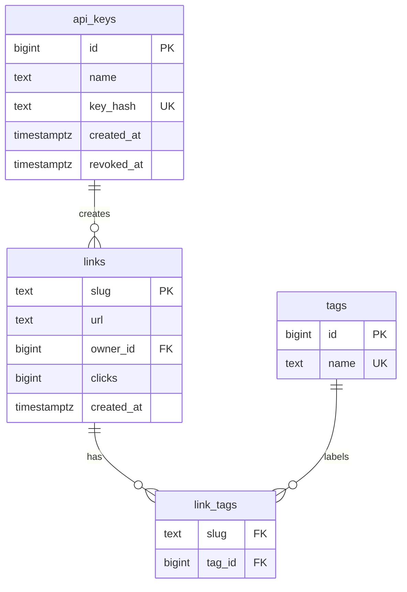

export const tagsSetup = `
CREATE TABLE api_keys (
  id bigserial PRIMARY KEY,
  name text NOT NULL,
  key_hash text NOT NULL UNIQUE,
  created_at timestamptz NOT NULL DEFAULT now(),
  revoked_at timestamptz
);
CREATE TABLE links (
  slug text PRIMARY KEY,
  url text NOT NULL CHECK (length(url) <= 2048),
  owner_id bigint NOT NULL REFERENCES api_keys (id) ON DELETE CASCADE,
  clicks bigint NOT NULL DEFAULT 0 CHECK (clicks >= 0),
  created_at timestamptz NOT NULL DEFAULT now()
);
CREATE TABLE tags (
  id bigserial PRIMARY KEY,
  name text NOT NULL UNIQUE CHECK (name ~ '^[a-z0-9-]{1,30}$')
);
CREATE TABLE link_tags (
  slug text NOT NULL REFERENCES links (slug) ON DELETE CASCADE,
  tag_id bigint NOT NULL REFERENCES tags (id) ON DELETE CASCADE,
  PRIMARY KEY (slug, tag_id)
);
INSERT INTO api_keys (name, key_hash) VALUES ('ada','h1'),('grace','h2');
INSERT INTO links (slug, url, owner_id, clicks) VALUES
  ('godoc','https://go.dev/doc/',1,42),('pgdocs','https://www.postgresql.org/docs/',1,17),('launch','https://blog.example/launch',2,910);
INSERT INTO tags (name) VALUES ('docs'),('go'),('postgres'),('marketing');
INSERT INTO link_tags VALUES ('godoc',1),('godoc',2),('pgdocs',1),('pgdocs',3),('launch',4);
`;

# 6.3 Designing schemas

A **schema** is the shape of your data: which tables exist, what columns they have, what types those columns hold, and which rules the data must always obey. It's the most long-lived decision in most systems. Code gets rewritten; frameworks come and go; but the schema — and the years of data in it — tends to stay. A good schema makes wrong data *impossible* to store and common questions easy to answer. A poor one leaks bugs into every feature built on top of it. This chapter shows how to design one, using snip's real schema and a feature it doesn't have yet: **tags**.

## What you'll learn

- How to go from a product description to **entities** (tables) and **relationships**.
- Choosing **column types** — and the few that trip people up (money, time, IDs).
- **Primary keys** (natural vs surrogate) and **foreign keys** that keep references valid.
- **Constraints** — `NOT NULL`, `UNIQUE`, `CHECK`, `DEFAULT` — that make the database guard your data.
- **Normalisation**: storing each fact once; **one-to-many** and **many-to-many** relationships; and changing a live schema safely with **migrations**.

---

## From product to tables

Start with a plain-English description of what the product does, and underline the **nouns** — they're usually your tables. The **verbs** between them are relationships.

> *An **API key** belongs to a person. With it they create **links**, each with a slug and a URL. Every link is **clicked** many times. Links can have **tags**, and a tag can be on many links.*



This is an **entity–relationship diagram** (ERD). The crow's-foot markings show **cardinality**: one API key creates **many** links (`||--o{`). Drawing one before writing SQL is a cheap way to catch design mistakes — and it's exactly the diagram you'd sketch in a design review or interview (chapter 15.1).

---

## Choosing column types

Every column has a type, and the right type is itself a rule: a `bigint` column can never hold `"hello"`. The types you'll use most in Postgres:

| Type | Holds | Use for | Watch out |
|---|---|---|---|
| `text` | Any text | Names, URLs, slugs | Limit length with a `CHECK` if it matters |
| `bigint` | Whole numbers up to ~9.2 × 10¹⁸ | IDs, counts | `int` tops out at ~2.1 billion — counters and IDs outgrow it |
| `numeric(12,2)` | Exact decimals | **Money** | Never `float`/`real` for money (chapter 1.3) |
| `boolean` | `true` / `false` | Flags | Many booleans may really be one status column |
| `timestamptz` | A moment in time, stored in UTC | Almost every date/time | Plain `timestamp` has no time zone — avoid it (chapter 1.3) |
| `uuid` | A 128-bit random ID | Public or distributed IDs | Larger than `bigint`; random ones make indexes a bit slower |
| `jsonb` | JSON, stored efficiently and queryable | Genuinely flexible, nested data | Not a way to avoid designing tables |

:::info[In the real world]
A famous class of outage: an `int` ID column hits its maximum of 2,147,483,647 and inserts start failing. Several well-known companies have had incidents exactly like this, and migrating a huge table to `bigint` under pressure is painful. Use `bigint` for IDs and counters from day one — the storage difference is trivial.
:::

---

## Primary keys: how each row is identified

Every table needs a **primary key**: a column (or combination) whose value is **unique and never missing** in every row. It's how you point at exactly one row.

Two kinds:

- A **natural key** is real data that's already unique: a link's `slug`, a country's ISO code (`IN`, `US`).
- A **surrogate key** is an ID invented by the database, with no meaning: `id bigserial` — 1, 2, 3… (`bigserial` means "a `bigint` filled automatically from a counter").

snip uses both, deliberately:

```sql
CREATE TABLE api_keys (
    id          BIGSERIAL   PRIMARY KEY,   -- surrogate: meaningless, never changes
    name        TEXT        NOT NULL,
    key_hash    TEXT        NOT NULL UNIQUE,
    -- …
);

CREATE TABLE links (
    slug        TEXT        PRIMARY KEY,   -- natural: every redirect looks up by slug
    -- …
);
```

For `links`, the slug is *the* thing every redirect looks up, it must be unique anyway, and snip never lets a slug change — so making it the primary key gives the hottest query a perfect index for free (chapter 6.4). For `api_keys`, nothing natural is short, stable and unique, so a surrogate `id` it is.

:::tip
If a natural key might **ever change** (email addresses, usernames, company names) or isn't truly unique (people's names), use a surrogate key and put a `UNIQUE` constraint on the natural value instead. Changing a primary key means updating every reference to it.
:::

---

## Foreign keys: references that can't dangle

`links.owner_id` points at a row in `api_keys`. What stops it pointing at key `999` that doesn't exist, or at a key that gets deleted later? A **foreign key** constraint. From snip's real migration (`internal/store/postgres/migrations/0001_init.sql`):

```sql
owner_id    BIGINT      NOT NULL REFERENCES api_keys (id) ON DELETE CASCADE,
```

- **`REFERENCES api_keys (id)`** — every `owner_id` must match an existing `api_keys.id`. Insert a link for a non-existent owner and Postgres refuses.
- **`ON DELETE CASCADE`** — if an API key is deleted, delete its links too. The alternatives: **`RESTRICT`** (the default — refuse to delete a key that still has links) or **`SET NULL`** (keep the links, forget the owner).

Which one is right is a **product decision**, not a technical one. snip treats links as belonging entirely to their key, so they go together. A payments system would almost never cascade-delete financial records — it would `RESTRICT` and archive instead.

---

## Constraints: let the database guard the data

Constraints are rules written into the schema that the database checks on **every** insert and update, from **every** client — your app, a script, a teammate at a `psql` prompt, a future second service. Here's snip's `links` table in full:

```sql
CREATE TABLE links (
    slug        TEXT        PRIMARY KEY,
    url         TEXT        NOT NULL CHECK (length(url) <= 2048),
    owner_id    BIGINT      NOT NULL REFERENCES api_keys (id) ON DELETE CASCADE,
    clicks      BIGINT      NOT NULL DEFAULT 0 CHECK (clicks >= 0),
    created_at  TIMESTAMPTZ NOT NULL DEFAULT now()
);
```

| Constraint | Meaning here |
|---|---|
| `PRIMARY KEY` | slugs are unique and never missing |
| `NOT NULL` | every link has a URL, an owner, a count and a time |
| `CHECK (length(url) <= 2048)` | matches the validation limit in Go (chapter 5.3) — twice guarded |
| `CHECK (clicks >= 0)` | a bug can never produce a negative count |
| `DEFAULT 0`, `DEFAULT now()` | sensible values when an insert doesn't give one |
| `UNIQUE` (on `api_keys.key_hash`) | no two keys can have the same hash |

Why check in the database *and* in Go? The Go validation gives users a friendly, specific error early (chapter 5.3). The database constraints are the **last line of defence** that nothing can bypass. They also solve problems code can't: remember that snip doesn't check "is this slug free?" before inserting — it lets the `PRIMARY KEY` reject duplicates atomically, and translates the error to `409 Conflict` (chapter 6.6). No race condition possible.

:::note[Everyday anchor]
Constraints are the shape of a plug socket. You *could* print a sign saying "please only insert UK plugs", but the socket's shape simply makes the wrong plug impossible to insert — for every person, forever, whether or not they read the sign.
:::

---

## Normalisation: store each fact once

Imagine a single table that stores everything about each link, including the owner's details:

| slug | url | owner_name | owner_email | owner_plan |
|---|---|---|---|---|
| godoc | https://go.dev/doc/ | ada | ada@example.com | free |
| pgdocs | https://www.postgresql.org/docs/ | ada | ada@example.com | free |
| launch | https://blog.example/launch | grace | grace@example.com | pro |

It looks convenient. But ada's email is stored **twice**. When she changes it, you must update every row — miss one, and the database now holds two different "truths". Upgrade her plan and some of her links still say `free`. These are **update anomalies**, and they're how data quietly rots.

**Normalisation** is the discipline of storing **each fact in exactly one place**. Owner facts go in an `owners` (or `api_keys`) table, stored once; links hold just a reference — `owner_id`. You get the combined view back whenever you need it with a `JOIN` (chapter 6.2).

The formal theory (first, second, third "normal forms") boils down to one practical question: **"if this fact changes, how many rows must I update?"** The answer should be *one*.

:::info[In the real world]
Sometimes teams **denormalise** on purpose — for example, snip stores a running `clicks` count on each link instead of counting `click_events` rows on every request. That's a duplicated fact (the count can be derived from events), accepted for speed. Denormalise deliberately, for a measured reason, and know how you'll keep the copies in sync (chapter 8.2) — never by accident.
:::

---

## One-to-many and many-to-many

- **One-to-many** — one API key, many links. The "many" side holds a foreign key to the "one" side (`links.owner_id`). You've already seen it.
- **Many-to-many** — a link can have many tags, and a tag can be on many links. Neither table can hold a single foreign key to the other. The solution is a **join table** (also called a junction or association table) holding pairs:

```sql
CREATE TABLE tags (
    id    BIGSERIAL PRIMARY KEY,
    name  TEXT NOT NULL UNIQUE CHECK (name ~ '^[a-z0-9-]{1,30}$')   -- lowercase words, e.g. "go", "docs"
);

CREATE TABLE link_tags (
    slug    TEXT   NOT NULL REFERENCES links (slug) ON DELETE CASCADE,
    tag_id  BIGINT NOT NULL REFERENCES tags (id)   ON DELETE CASCADE,
    PRIMARY KEY (slug, tag_id)          -- each tag at most once per link
);
```

Each row of `link_tags` says "this link has this tag". The **composite primary key** `(slug, tag_id)` stops the same tag being attached twice. Try it — this is a design exercise for snip's future **tags** feature:

<SqlPlayground setup={tagsSetup} sql={`-- Every link with its tags
SELECT l.slug, string_agg(t.name, ', ' ORDER BY t.name) AS tags
FROM links l
JOIN link_tags lt ON lt.slug = l.slug
JOIN tags t ON t.id = lt.tag_id
GROUP BY l.slug
ORDER BY l.slug;`} />

<SqlPlayground setup={tagsSetup} sql={`-- All links tagged "docs", with their owner's name
SELECT l.slug, l.url, k.name AS owner
FROM tags t
JOIN link_tags lt ON lt.tag_id = t.id
JOIN links l ON l.slug = lt.slug
JOIN api_keys k ON k.id = l.owner_id
WHERE t.name = 'docs';`} />

Then, in either box, try statements the schema should **refuse**, and read each error:

```sql
INSERT INTO link_tags VALUES ('godoc', 1);            -- duplicate pair: primary key violation
INSERT INTO link_tags VALUES ('nope', 1);             -- link doesn't exist: foreign key violation
INSERT INTO tags (name) VALUES ('Has Spaces!');       -- check constraint violation
INSERT INTO links (slug, url, owner_id) VALUES ('x', 'https://x.example', 99);   -- no such owner
DELETE FROM links WHERE slug = 'godoc';               -- allowed: its link_tags rows cascade away
```

---

## Naming conventions

Small habits that pay off for years:

- **snake_case**, lower-case: `created_at`, `owner_id`. (Postgres folds unquoted names to lower case anyway.)
- **Plural table names** (`links`, `api_keys`) — pick one convention and never mix.
- Foreign keys named **`<thing>_id`**: `owner_id`, `tag_id`.
- Timestamps named **`<event>_at`**: `created_at`, `revoked_at`, `expires_at`.
- A nullable timestamp often beats a boolean: `revoked_at` tells you *whether* **and** *when* — `is_revoked` only tells you whether.

---

## Migrations: changing the schema safely

Your schema will change — new features need new tables and columns. Those changes must happen **the same way on every copy of the database** (your laptop, CI, staging, production), **in order**, **exactly once**, and **recorded in Git** alongside the code that needs them. That's a **migration**: a numbered SQL file describing one change.

snip's migrations live in `internal/store/postgres/migrations/`, starting with `0001_init.sql`. A tags feature would add:

```text
migrations/
├── 0001_init.sql          api_keys and links
└── 0002_tags.sql          tags and link_tags (the tables above)
```

snip records which migrations have run in a table called `schema_migrations`, and applies any new ones at startup — each inside a transaction, so a failing migration leaves nothing half-done. Chapter 6.6 walks through that code.

### Changing a live database without downtime

Adding a table is easy. Changing an existing column that live code depends on is not: during a deployment, **old and new versions of snip run side by side** (chapter 11.3). If a migration renames `url` to `target_url`, every old copy breaks immediately.

The standard technique is **expand, then contract**:

1. **Expand** — add the new thing alongside the old (`ADD COLUMN target_url`), and deploy code that writes both and reads either.
2. **Migrate data** — copy old values into the new column, in batches.
3. **Switch** — deploy code that only uses the new column.
4. **Contract** — once nothing uses the old column, drop it in a later migration.

Slower, yes — but no moment exists where running code and the database disagree.

:::warning[What can go wrong]
- **Rules only in application code.** A second service, a script or a bug writes bad data straight into the table. Put the invariants in the schema.
- **`int` IDs and counters.** Fine for years, then an outage when the counter hits 2.1 billion. Use `bigint`.
- **Money as floating point, times without zones.** Chapter 1.3's classics, now baked into your schema for good.
- **Repeating facts across tables.** Every copy is a future inconsistency. Normalise, and denormalise only on purpose.
- **Destructive migrations in one step.** Renaming or dropping a column that running code uses causes an outage mid-deploy. Expand, migrate, contract.
- **Editing an old migration after it has run somewhere.** Other databases already applied the old version and won't re-run it. Always add a new migration instead.
:::

---

## Lab

Free. Steps 1–2 run in the page; step 3 uses snip's code.

1. **Explore the tags schema** in the playgrounds above. Write queries for:
   - every tag with how many links use it (hint: `LEFT JOIN` from `tags`, so unused tags show 0);
   - links that have **both** the `docs` and `go` tags.

2. **Probe the constraints.** Run each "should refuse" statement from the tags section and match every error message to the constraint that caused it. Then delete the owner `ada` (`DELETE FROM api_keys WHERE name = 'ada';`) and check what happened to her links and their tags — that's `ON DELETE CASCADE` twice over.

3. **Read snip's real migration.** Open `snip/internal/store/postgres/migrations/0001_init.sql`. For every line, name the rule it enforces and what bug it prevents. Then sketch `0002_tags.sql` on paper (or in a file) using the tables above. Would adding it be safe during a live deployment? (Yes — it only *adds* tables; nothing running uses them yet. That's the easy half of expand/contract.)

<details>
<summary>Answers for step 1</summary>

```sql
-- Tags with usage counts, including unused ones
SELECT t.name, count(lt.slug) AS links
FROM tags t
LEFT JOIN link_tags lt ON lt.tag_id = t.id
GROUP BY t.name
ORDER BY links DESC, t.name;

-- Links with BOTH docs and go
SELECT lt.slug
FROM link_tags lt
JOIN tags t ON t.id = lt.tag_id
WHERE t.name IN ('docs', 'go')
GROUP BY lt.slug
HAVING count(DISTINCT t.name) = 2;
```

The second is a classic pattern: filter to either tag, group per link, and keep only links that matched *both* (`HAVING count = 2`).

</details>

## Self-check

<Quiz
  id="data-designing-schemas"
  questions={[
    {
      q: 'Why does snip use the slug itself as the primary key of links?',
      options: [
        'Text primary keys are always faster than numbers in Postgres',
        'Slugs are unique, never change, and every redirect looks them up',
        'Postgres can’t generate numeric keys without a separate sequence table',
        'To save disk space, since slugs are shorter than numeric IDs',
      ],
      answer: 1,
      explain: 'A natural key works well when it is truly unique, stable and the main lookup. If slugs could be renamed, a surrogate id plus a UNIQUE slug would be safer.',
    },
    {
      q: 'What does REFERENCES api_keys (id) ON DELETE CASCADE do on links.owner_id?',
      options: [
        'Copies the key’s id into each link and keeps the two in sync',
        'Every owner_id must exist; deleting a key deletes its links',
        'Stops anyone deleting a key while it still has links',
        'Makes owner_id optional, and sets it to NULL if the key goes',
      ],
      answer: 1,
      explain: 'The foreign key prevents references to missing rows; CASCADE says deleting the parent also deletes its children. RESTRICT or SET NULL are the alternatives.',
    },
    {
      q: 'A table stores each link with its owner’s email copied into every row. What problem is this?',
      options: [
        'It uses too little disk, so Postgres packs rows inefficiently',
        'An update anomaly: change the email and every row must change, or they disagree',
        'Emails in many rows break the table’s primary key',
        'It makes JOINs impossible, since the email is not a number',
      ],
      answer: 1,
      explain: 'Storing a fact in many places invites inconsistency. Normalise: keep the email once in the owner table and reference it.',
    },
    {
      q: 'How do you model "a link can have many tags and a tag can be on many links"?',
      options: [
        'A tags column holding a comma-separated list of the tag names',
        'A join table, link_tags: one row per link–tag pair',
        'A foreign key from tags to links, one per tag',
        'One links row per tag, sharing the same slug',
      ],
      answer: 1,
      explain: 'Many-to-many needs a junction table. Comma-separated lists cannot be indexed, validated or joined properly.',
    },
  ]}
/>

<details>
<summary>Why check the URL length both in Go (chapter 5.3) and with a CHECK constraint in the database?</summary>

They do different jobs. The **Go check** gives the user a fast, specific, friendly error (`invalid_url` with a helpful message) before any database work. The **database constraint** is the **last line of defence**: it protects the data from *every* writer — a future second service, a data-migration script, a teammate running SQL by hand, or a bug that skips the Go validation. Friendly errors at the edge; hard guarantees at the core.

</details>

<details>
<summary>You need to rename <code>links.url</code> to <code>links.target_url</code> on a live system. Describe a safe plan.</summary>

**Expand, then contract:**
1. Migration: `ALTER TABLE links ADD COLUMN target_url text;`
2. Deploy code that **writes both** columns and **reads `target_url` if present, else `url`**.
3. Back-fill in batches: `UPDATE links SET target_url = url WHERE target_url IS NULL …`, then add `NOT NULL` once every row has a value.
4. Deploy code that uses **only** `target_url`.
5. Later migration: `ALTER TABLE links DROP COLUMN url;`

At no point does running code expect a column that doesn't exist. A single `RENAME COLUMN` would break every old copy of snip still running during the deploy.

</details>
