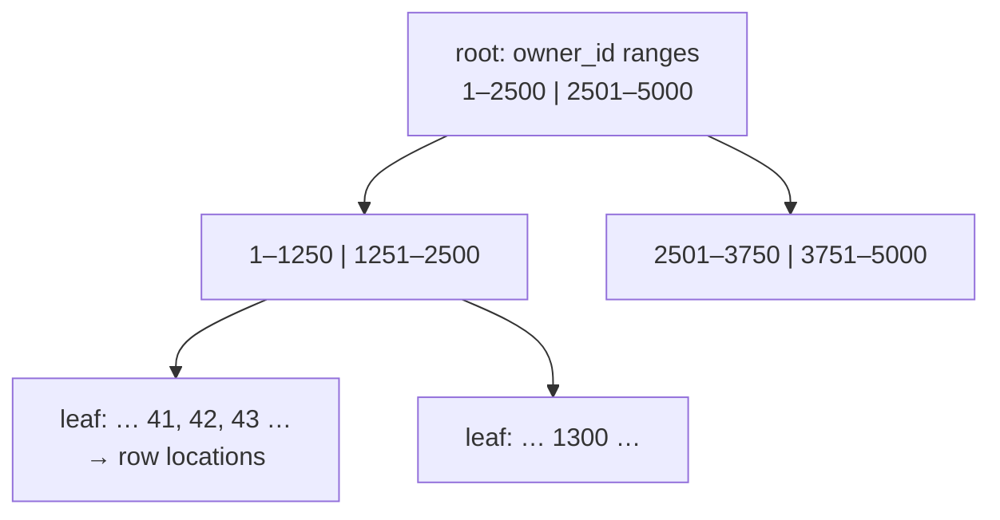

export const bigSetup = `
CREATE TABLE links (
  slug text PRIMARY KEY,
  url text NOT NULL,
  owner_id bigint NOT NULL,
  clicks bigint NOT NULL DEFAULT 0,
  created_at timestamptz NOT NULL
);
INSERT INTO links
SELECT 's' || g,
       'https://example.com/page/' || g,
       (g % 5000) + 1,
       (g * 7919) % 1000,
       timestamptz '2026-01-01' + (g || ' minutes')::interval
FROM generate_series(1, 100000) AS g;
ANALYZE links;
`;

export const bigSetupIndexed = bigSetup + `
CREATE INDEX links_owner_created_idx ON links (owner_id, created_at DESC);
`;

# 6.4 Indexes & query performance

snip works beautifully on your laptop with 20 links. Then it gets popular. At 10 million links, "show my newest links" takes two seconds, the database's CPU sits at 100%, and every other request slows down behind it. Nothing in the code changed — only the amount of data. This is the single most common performance problem in backend systems, and the most common fix is not a bigger server or a new database. It's an **index** — often a one-line change that makes a query hundreds or thousands of times faster. In this chapter you'll watch that happen, live, on 100,000 rows in your browser.

## What you'll learn

- Why queries slow down as tables grow: the **sequential scan**.
- What an **index** is (a sorted lookup structure, usually a **B-tree**) and why it's so fast.
- How to read **`EXPLAIN ANALYZE`** — the database telling you exactly how it ran a query.
- **Composite indexes** and why **column order** matters — using snip's real index.
- What indexes **cost**, when they **don't help**, and two classic performance traps: **N+1 queries** and **deep OFFSET pagination**.

---

## Why queries get slow: scanning everything

Without any help, how does Postgres answer `WHERE owner_id = 42`? It reads **every row** in the table and checks each one. That's a **sequential scan** (seq scan). With 20 rows it's instant. With 10 million, it's reading gigabytes (chapter 1.1's slow storage) to return 20 rows.

The time grows **in proportion to the table**. Double the links, double the time for every such query. That's why systems that were fast at launch slow down month after month with no code changes at all.

:::note[Everyday anchor]
Finding every mention of "Postgres" in a textbook by reading it cover to cover is a sequential scan. The **index at the back of the book** — sorted alphabetically, each entry pointing to page numbers — lets you jump straight there. Nobody reads the whole book to find one topic; databases shouldn't either.
:::

---

## What an index is

An **index** is a separate, **sorted** structure that maps column values to where the matching rows live. Postgres's default kind is a **B-tree**: a balanced tree where each level narrows the search, like looking up a word in a dictionary — open near the middle, go left or right, repeat.



The magic is how little work a lookup takes. Each level of the tree cuts the candidates by a large factor, so even **a billion rows** needs only a handful of steps to find one value. Where a sequential scan's cost grows with the table, an index lookup's cost barely grows at all.

You've already been using indexes without creating them: **every `PRIMARY KEY` and `UNIQUE` constraint automatically gets one** (chapter 6.3). That's why looking up a link by its slug — snip's hottest query, run on every redirect — is fast from day one.

---

## Watch it happen: EXPLAIN ANALYZE

`EXPLAIN` shows the **plan** Postgres chose for a query. `EXPLAIN ANALYZE` **runs** the query and shows what actually happened, with timings. It's the most important performance tool you have.

The playground below creates a `links` table with **100,000 rows** (5,000 owners with about 20 links each). The setup takes a few seconds on the first run. Then it asks for one owner's 20 newest links — snip's `GET /api/links` query — with **no index** on `owner_id`:

<SqlPlayground setup={bigSetup} sql={`EXPLAIN ANALYZE
SELECT slug, created_at
FROM links
WHERE owner_id = 42
ORDER BY created_at DESC
LIMIT 20;`} />

Read the plan from the **most indented line outward** — that's the order things happen:

```text
Limit  (actual time=12.68..12.72 rows=20)
  ->  Sort  (Sort Key: created_at DESC)
        ->  Seq Scan on links  (actual time=0.10..12.57 rows=20)
              Filter: (owner_id = 42)
              Rows Removed by Filter: 99980
Execution Time: 12.82 ms
```

- **`Seq Scan on links`** — it read the whole table…
- **`Rows Removed by Filter: 99980`** — …and threw away 99,980 rows to keep 20. That line is the smoking gun.
- **`Execution Time`** — around 13 ms here (your numbers will differ). Harmless now; at 10 million rows it would be over a second, on *every* call.

Now the same query with snip's real index added:

<SqlPlayground setup={bigSetupIndexed} sql={`EXPLAIN ANALYZE
SELECT slug, created_at
FROM links
WHERE owner_id = 42
ORDER BY created_at DESC
LIMIT 20;`} />

```text
Limit  (actual time=0.21..0.24 rows=20)
  ->  …
        ->  Bitmap Index Scan on links_owner_created_idx
              Index Cond: (owner_id = 42)
Execution Time: 0.28 ms
```

**`Index … on links_owner_created_idx`** and **`Index Cond`** — it went straight to owner 42's rows. Around **45 times faster** on 100,000 rows, and the gap grows with the table: on 10 million rows, the indexed query stays well under a millisecond while the scan takes seconds.

Try the slug lookup — the primary key's automatic index at work:

```sql
EXPLAIN ANALYZE SELECT url FROM links WHERE slug = 's77777';
-- Index Scan using links_pkey … Execution Time: ~0.1 ms
```

:::tip
When a query is slow, don't guess — `EXPLAIN ANALYZE` it. Look for **`Seq Scan`** on big tables and big **`Rows Removed by Filter`** numbers. Those are where an index would help.
:::

---

## Composite indexes and column order

snip's index covers **two** columns. From `internal/store/postgres/migrations/0001_init.sql`:

```sql
-- "My links, newest first" (GET /api/links) without scanning the whole table.
CREATE INDEX links_owner_created_idx ON links (owner_id, created_at DESC);
```

A **composite index** is sorted by the first column, then — within each value of the first — by the second. Like a phone book sorted by **surname, then first name**:

| owner_id | created_at |
|---|---|
| 42 | 2026-09-24 (newest) |
| 42 | 2026-09-20 |
| 42 | 2026-09-03 |
| 43 | 2026-09-23 |
| … | … |

For `WHERE owner_id = 42 ORDER BY created_at DESC LIMIT 20`, Postgres jumps to owner 42 and the rows are *already* in newest-first order: it reads 20 entries and stops. No scan, no sort of anything big.

**Column order matters.** The same phone book is useless for "everyone called Ada" — first names are only sorted *within* each surname. Likewise, an index on `(owner_id, created_at)` helps queries filtering by `owner_id` (alone or with `created_at`), but **not** a query filtering only by `created_at`. Rule of thumb: put the column you filter by **equality** first, and the one you **sort or range** by second.

---

## Indexes aren't free

If indexes are so good, why not index every column?

- **Writes get slower.** Every `INSERT`, and every `UPDATE` of an indexed column, must update *every* index on the table too. A table with ten indexes does roughly ten times the index work on every write.
- **They take space** — on disk and, more importantly, in memory, where the hot parts of indexes need to live to be fast (chapter 1.1).
- **Unused indexes are pure cost.** Postgres tracks index usage (`pg_stat_user_indexes`); teams periodically drop indexes nothing uses.

So: index what your **real, frequent queries** need, and measure. snip has exactly three indexes: the two automatic ones (`links.slug`, `api_keys.key_hash`) and the composite one for listing links.

---

## When an index can't help

Postgres ignores an index, or can't use it, when:

| Query | Why the index doesn't help | What to do |
|---|---|---|
| `WHERE url LIKE '%docs%'` | A leading `%` means "anywhere" — a sorted list can't find the middle of strings | Full-text search or a trigram index (chapter 6.8) |
| `WHERE lower(slug) = 'godoc'` | The index is on `slug`, not `lower(slug)` | An **expression index**: `CREATE INDEX … ON links (lower(slug))` |
| `WHERE clicks > 0` when 99% of rows match | Reading nearly everything via the index is *slower* than just scanning | Nothing — the planner is right |
| A tiny table | Scanning 50 rows is faster than using any index | Nothing — also right |

That third row surprises people: **Postgres chooses** between a scan and an index using statistics about the data (gathered by `ANALYZE`, which runs automatically). An index is only used when it's genuinely cheaper.

---

## Two classic traps

### The N+1 query problem

A page shows 20 links with their owners' names. The tempting code:

```text
links := SELECT … FROM links WHERE … LIMIT 20      -- 1 query
for each link:
    owner := SELECT name FROM api_keys WHERE id = ?  -- + 20 queries
```

That's **21 queries** — "N+1". Each is fast, but each is a network round trip (chapter 1.1's "weeks" in CPU time), and at 200 items it's 201 round trips. The fix is to ask once, with a `JOIN` (chapter 6.2) or `WHERE id = ANY($1)` with all the IDs. N+1 is extremely common with ORMs (libraries that generate SQL for you), which can make it invisible in the code.

### Deep OFFSET pagination

`… ORDER BY created_at DESC LIMIT 20 OFFSET 100000` asks Postgres to find and **throw away** 100,000 rows before returning 20. Page 5,000 is thousands of times slower than page 1. **Cursor pagination** (chapter 5.2) — "rows older than the last one I saw" — uses the index directly and stays fast at any depth:

```sql
SELECT slug, created_at FROM links
WHERE owner_id = 42 AND created_at < '2026-09-03 10:15:00+00'   -- the cursor: last row's created_at
ORDER BY created_at DESC
LIMIT 20;
```

---

## Adding an index to a live database

`CREATE INDEX` on a big table **blocks writes** to that table until it finishes — which can be minutes on a large table. On a live system, use:

```sql
CREATE INDEX CONCURRENTLY links_owner_created_idx ON links (owner_id, created_at DESC);
```

It takes longer and can't run inside a transaction, but reads and writes carry on while it builds. It's how the pull request from chapter 3.3's self-check would add the index safely.

:::info[In the real world]
Teams find slow queries with Postgres's **`pg_stat_statements`** extension (which records every query's total and average time) and the **slow query log** (`log_min_duration_statement`). The workflow is always the same: find the query that costs the most *in total*, `EXPLAIN ANALYZE` it, fix it (usually an index or a rewritten query), and measure again. Managed databases (chapter 12.3) show this in a dashboard.
:::

:::warning[What can go wrong]
- **No index on foreign-key columns.** Postgres indexes primary keys automatically but **not** foreign keys. `links.owner_id` needs its own index (snip's composite covers it) — or joins and cascading deletes scan the whole table.
- **Indexing everything.** Writes crawl and memory fills with unused indexes.
- **Wrong column order in composite indexes.** The index exists; the query can't use it.
- **N+1 queries.** Fast individually, slow together. Watch query counts, not just query speed.
- **Testing with tiny data.** Everything is fast with 50 rows. Test important queries against realistic volumes — as in the playgrounds above.
:::

---

## Lab

Free, in the playgrounds above (each has its own database; **Reset** restores it).

1. **Measure the difference.** Run both `EXPLAIN ANALYZE` playgrounds and note the execution times and the `Seq Scan` vs `Index` lines.

2. **Create the index yourself.** In the *first* (unindexed) playground, run:
   ```sql
   CREATE INDEX my_idx ON links (owner_id, created_at DESC);
   ```
   Then run the `EXPLAIN ANALYZE` query again. Same data, same query, one line of SQL, dramatically faster.

3. **Prove column order matters.** Still in that playground:
   ```sql
   EXPLAIN SELECT slug FROM links WHERE created_at > '2026-03-01' ORDER BY created_at LIMIT 20;
   ```
   Does it use `my_idx`? (Filtering only on the *second* column usually can't.) Now create `CREATE INDEX by_created ON links (created_at);` and explain it again.

4. **Find an index that can't help.**
   ```sql
   EXPLAIN SELECT slug FROM links WHERE url LIKE '%777%';
   ```
   A `Seq Scan`, whatever indexes exist. Why? (Leading wildcard.)

5. **Compare pagination.**
   ```sql
   EXPLAIN ANALYZE SELECT slug FROM links WHERE owner_id = 42 ORDER BY created_at DESC LIMIT 5 OFFSET 15;
   ```
   Then write the cursor version using the `created_at` of the 15th row as the cursor. For one owner's 20 rows the difference is tiny — imagine it for the whole table (drop the `WHERE owner_id` and use `OFFSET 90000`).

## Self-check

<Quiz
  id="data-indexes-and-performance"
  questions={[
    {
      q: 'EXPLAIN ANALYZE shows "Seq Scan on links … Rows Removed by Filter: 9,999,980" for a query returning 20 rows. What does that tell you?',
      options: [
        'The query is as fast as possible',
        'Postgres read the whole table and discarded almost all of it — an index on the filtered column would likely help',
        'The table is corrupted',
        'The LIMIT is too small',
      ],
      answer: 1,
      explain: 'A sequential scan that throws away nearly every row is the classic sign of a missing index for that WHERE clause.',
    },
    {
      q: 'snip has an index on (owner_id, created_at DESC). Which query can use it well?',
      options: [
        'WHERE created_at > ‘2026-09-01’ (only)',
        'WHERE owner_id = 42 ORDER BY created_at DESC LIMIT 20',
        'WHERE url LIKE ‘%docs%’',
        'WHERE clicks > 100',
      ],
      answer: 1,
      explain: 'A composite index is sorted by its first column, then its second. Filtering on owner_id and sorting by created_at matches it perfectly; filtering only on the second column usually cannot use it.',
    },
    {
      q: 'Why not add an index on every column?',
      options: [
        'Postgres allows only one index per table',
        'Every index slows down writes and uses disk and memory; unused ones are pure cost',
        'Indexes make reads slower',
        'Indexes delete data',
      ],
      answer: 1,
      explain: 'Each insert or update must maintain every index. Index what your real, frequent queries need, and measure.',
    },
    {
      q: 'A page lists 50 links and runs one query per link to fetch each owner’s name. What is this, and the fix?',
      options: [
        'A deadlock; add a lock',
        'The N+1 problem; fetch all owners in one query with a JOIN or WHERE id = ANY(...)',
        'Normal behaviour; nothing to fix',
        'A missing primary key',
      ],
      answer: 1,
      explain: '51 round trips instead of 1 or 2. Each query is fast; the round trips add up. Batch them into a single query.',
    },
  ]}
/>

<details>
<summary>Explain to a non-engineer why adding one index can make a query a thousand times faster.</summary>

Without an index, the database answers "which links belong to owner 42?" by reading **every** link and checking each one — like reading a whole book to find one topic. The more links there are, the longer it takes. An index is like the sorted index at the back of the book: the database jumps straight to owner 42's entries in a few steps, **no matter how big the table is**. On a small table the difference is small; on millions of rows it's the difference between seconds and a fraction of a millisecond.

</details>

<details>
<summary>Why does snip's migration create an index for listing links, but not for <code>clicks</code> or <code>url</code>?</summary>

Because indexes should match **real, frequent queries**. snip's hot queries are: redirect by `slug` (covered by the primary key's automatic index), authenticate by `key_hash` (covered by its `UNIQUE` constraint), and list an owner's links newest-first (covered by `(owner_id, created_at DESC)`). Nothing in snip searches by `url` or filters by `clicks`, so indexes there would only slow down every insert and every click-count update — pure cost with no benefit. If a new feature adds such a query, measure it with `EXPLAIN ANALYZE` and add the index then.

</details>
