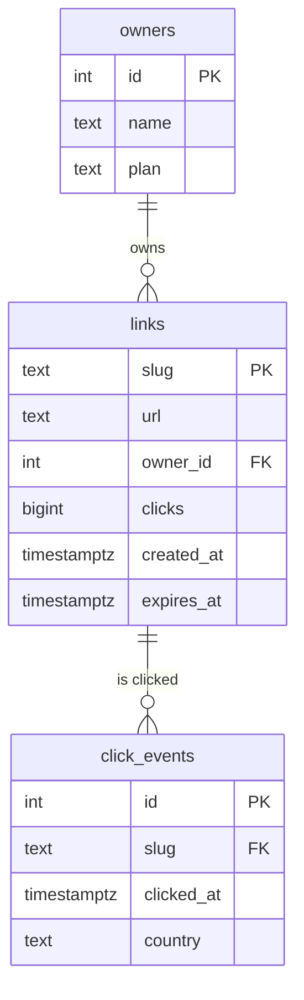
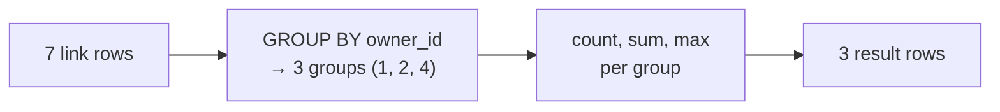

export const setup = `
CREATE TABLE owners (id int PRIMARY KEY, name text NOT NULL, plan text NOT NULL);
INSERT INTO owners VALUES (1,'ada','free'),(2,'grace','pro'),(3,'linus','free'),(4,'margaret','pro');
CREATE TABLE links (slug text PRIMARY KEY, url text NOT NULL, owner_id int NOT NULL REFERENCES owners(id), clicks bigint NOT NULL DEFAULT 0, created_at timestamptz NOT NULL, expires_at timestamptz);
INSERT INTO links VALUES
 ('godoc','https://go.dev/doc/',1,42,'2026-09-01 10:00+00',NULL),
 ('k7Qz2a','https://example.com',1,3,'2026-09-20 08:30+00',NULL),
 ('launch','https://blog.example/launch',2,910,'2026-09-05 09:15+00','2026-12-31 00:00+00'),
 ('pgdocs','https://www.postgresql.org/docs/',2,17,'2026-09-12 14:00+00',NULL),
 ('talk','https://slides.example/talk',2,0,'2026-09-23 18:45+00',NULL),
 ('sale','https://shop.example/sale',4,388,'2026-09-15 07:00+00','2026-09-30 23:59+00'),
 ('docs','https://docs.example/start',4,56,'2026-09-18 12:10+00',NULL);
CREATE TABLE click_events (id serial PRIMARY KEY, slug text NOT NULL REFERENCES links(slug), clicked_at timestamptz NOT NULL, country text);
INSERT INTO click_events (slug, clicked_at, country) VALUES
 ('launch','2026-09-20 10:00+00','IN'),('launch','2026-09-20 11:30+00','US'),('launch','2026-09-21 09:00+00','IN'),
 ('launch','2026-09-22 16:20+00','GB'),('sale','2026-09-21 07:05+00','US'),('sale','2026-09-21 07:06+00','US'),
 ('sale','2026-09-22 12:00+00',NULL),('godoc','2026-09-22 08:00+00','DE'),('godoc','2026-09-23 08:15+00','IN'),
 ('docs','2026-09-23 12:00+00','US');
`;

# 6.2 SQL from zero

SQL is one of the most valuable skills in technology. It's been around for fifty years, it will certainly be around for twenty more, and it's used by backend engineers, data analysts, product managers, scientists and AI engineers alike. The good news: the core of SQL is small, readable English, and you can learn it in an afternoon — *by doing*. Every example in this chapter runs in a real PostgreSQL database inside this page, loaded with a small version of snip's data. Run them, change them, break them. Nothing you do here can harm anything.

## What you'll learn

- Reading data: **`SELECT`**, **`FROM`**, **`WHERE`**, **`ORDER BY`**, **`LIMIT`**.
- Summarising: **`COUNT`**, **`SUM`**, **`AVG`**, **`GROUP BY`** and **`HAVING`**.
- Combining tables with **`JOIN`** — the heart of the relational model.
- Changing data: **`INSERT`**, **`UPDATE`**, **`DELETE`** — and the one mistake everyone makes once.
- **`NULL`** (the absence of a value) and working with **dates**.

---

## The data we'll use

Three tables, modelled on snip:



- **`owners`** — who owns links (4 people, on a `free` or `pro` plan).
- **`links`** — 7 short links, each belonging to an owner through `owner_id`.
- **`click_events`** — one row per click, with when and from which country (sometimes unknown).

The lines between tables are **relationships**: an owner has many links; a link has many click events. You'll use them with `JOIN` below.

---

## SELECT: asking for data

The basic shape of every query:

```sql
SELECT columns      -- which columns you want
FROM table          -- from which table
WHERE condition     -- only rows matching this (optional)
ORDER BY column     -- in what order (optional)
LIMIT n;            -- at most n rows (optional)
```

<SqlPlayground setup={setup} sql={`SELECT slug, clicks
FROM links
WHERE clicks > 10
ORDER BY clicks DESC
LIMIT 3;`} />

Read it aloud: *"Select slug and clicks from links, where clicks is over 10, ordered by clicks, biggest first, top 3."* SQL keywords aren't case-sensitive — `select` works too — but writing them in capitals makes queries easier to read. `--` starts a comment.

Useful variations to try in the box above:

```sql
SELECT * FROM links;                                  -- * = every column
SELECT slug, clicks * 2 AS doubled FROM links;        -- compute a column; AS names it
SELECT DISTINCT owner_id FROM links;                  -- remove duplicate rows
SELECT count(*) FROM links;                           -- how many rows
```

### WHERE: filtering rows

| Condition | Example |
|---|---|
| Comparison: `=`, `<>` (not equal), `<`, `<=`, `>`, `>=` | `WHERE clicks >= 100` |
| Combine: `AND`, `OR`, `NOT` | `WHERE owner_id = 2 AND clicks > 10` |
| One of a list | `WHERE owner_id IN (1, 4)` |
| A range | `WHERE clicks BETWEEN 10 AND 100` |
| Text patterns: `%` = anything, `_` = one character | `WHERE url LIKE '%docs%'` |
| Case-insensitive pattern (Postgres) | `WHERE url ILIKE '%DOCS%'` |
| Missing values | `WHERE expires_at IS NULL` |

Note: text values go in **single quotes**: `WHERE slug = 'godoc'`. Double quotes mean something else in SQL (names of columns or tables).

<SqlPlayground setup={setup} sql={`-- Links owned by 2 or 4 whose URL mentions "docs" or "sale"
SELECT slug, url, owner_id
FROM links
WHERE owner_id IN (2, 4)
  AND (url LIKE '%docs%' OR url LIKE '%sale%');`} />

The parentheses matter: `AND` binds tighter than `OR`, just as × binds tighter than + in arithmetic. When mixing them, always add parentheses.

---

## Summarising: aggregates and GROUP BY

**Aggregate functions** collapse many rows into one answer:

| Function | Gives you |
|---|---|
| `count(*)` | how many rows |
| `sum(clicks)` | total |
| `avg(clicks)` | average |
| `min(created_at)`, `max(clicks)` | smallest / largest |

**`GROUP BY`** splits rows into groups first, then aggregates each group — "for each owner, how many links and clicks?":

<SqlPlayground setup={setup} sql={`SELECT owner_id,
       count(*)     AS links,
       sum(clicks)  AS total_clicks,
       max(clicks)  AS best_link_clicks
FROM links
GROUP BY owner_id
ORDER BY total_clicks DESC;`} />



To filter **groups** (rather than rows), use **`HAVING`** — it's `WHERE` for after grouping:

```sql
SELECT owner_id, sum(clicks) AS total
FROM links
GROUP BY owner_id
HAVING sum(clicks) > 100;       -- only owners with over 100 clicks in total
```

The rule of thumb: every column in the `SELECT` must either be in the `GROUP BY` or inside an aggregate. Otherwise, which of the group's values should Postgres show? It refuses to guess — try `SELECT owner_id, slug, count(*) FROM links GROUP BY owner_id;` and read the error.

---

## JOIN: combining tables

`links` stores `owner_id = 2`, not the name "grace". To see names, you **join** the two tables on the relationship between them:

<SqlPlayground setup={setup} sql={`SELECT l.slug, l.clicks, o.name, o.plan
FROM links AS l
JOIN owners AS o ON o.id = l.owner_id
ORDER BY l.clicks DESC;`} />

- `FROM links AS l JOIN owners AS o` — use both tables, with short aliases `l` and `o`.
- `ON o.id = l.owner_id` — the **join condition**: which owner row matches which link row.
- `l.slug`, `o.name` — prefix columns with the alias so it's clear which table each comes from.

:::note[Everyday anchor]
A JOIN is matching two lists by a shared reference. You have a list of parcels, each labelled with a customer number, and a separate list of customers with their names and addresses. To print shipping labels, you match each parcel's customer number to a row in the customer list. The customer number is the `owner_id`; matching them up is the `JOIN … ON`.
:::

### INNER JOIN vs LEFT JOIN

A plain `JOIN` (an **inner join**) only returns rows that have a match on **both** sides. Owner 3, `linus`, has no links — so an inner join from owners to links leaves him out entirely. A **`LEFT JOIN`** keeps every row from the left table, filling in `NULL` when there's no match:

<SqlPlayground setup={setup} sql={`-- Every owner, including those with no links
SELECT o.name, count(l.slug) AS links, coalesce(sum(l.clicks), 0) AS clicks
FROM owners AS o
LEFT JOIN links AS l ON l.owner_id = o.id
GROUP BY o.name
ORDER BY clicks DESC;`} />

`linus` appears with 0 links. (`coalesce(x, 0)` means "x, or 0 if x is NULL" — summing no rows gives `NULL`, not 0.)

Joins chain. Clicks per owner, from the individual click events:

```sql
SELECT o.name, count(*) AS recorded_clicks
FROM click_events AS c
JOIN links  AS l ON l.slug = c.slug
JOIN owners AS o ON o.id = l.owner_id
GROUP BY o.name;
```

---

## Changing data

### INSERT: add rows

```sql
INSERT INTO links (slug, url, owner_id, created_at)
VALUES ('new1', 'https://example.org', 3, now());
```

List the columns you're filling; the others get their **default** (`clicks` defaults to 0) or `NULL`. Add `RETURNING *` to see the inserted row — snip uses `RETURNING` to get values the database filled in (chapter 6.6).

### UPDATE: change rows

```sql
UPDATE links SET clicks = clicks + 1 WHERE slug = 'godoc';
UPDATE links SET expires_at = now() + interval '7 days' WHERE owner_id = 3;
```

### DELETE: remove rows

```sql
DELETE FROM links WHERE slug = 'talk';
```

:::danger[The WHERE you forget]
`UPDATE links SET url = 'https://oops.example';` — without a `WHERE` — changes **every row in the table**. `DELETE FROM links;` deletes **every link**. It's the SQL version of `rm -rf` (chapter 2.1), and everyone does it once. Habits that save you:

1. Write the `WHERE` **first**, as a `SELECT`, and check which rows come back. Then change `SELECT *` to `UPDATE … SET` or `DELETE`.
2. In a real database, wrap risky changes in a **transaction** — `BEGIN;`, run it, check, then `COMMIT;` or `ROLLBACK;` (chapter 6.5).
:::

Try it safely here — the **Reset** button restores everything:

<SqlPlayground setup={setup} sql={`-- 1. Look first: which rows would change?
SELECT slug, expires_at FROM links WHERE owner_id = 4;

-- 2. Then change exactly those rows, and show the result
UPDATE links SET expires_at = now() + interval '7 days'
WHERE owner_id = 4
RETURNING slug, expires_at;`} />

---

## NULL: the absence of a value

`NULL` means **unknown or missing** — not zero, not an empty string. Some `click_events` have no `country`; most links have no `expires_at`. NULL behaves in ways that surprise everyone once:

- **Any comparison with NULL gives NULL** (treated as "not true"). `WHERE country = NULL` matches **nothing**, even rows where country is missing. Use **`IS NULL`** / **`IS NOT NULL`**.
- `country <> 'US'` **doesn't** match rows where country is NULL (it's unknown whether they're 'US').
- `count(*)` counts rows; `count(country)` counts only non-NULL countries.

<SqlPlayground setup={setup} sql={`SELECT count(*)            AS all_clicks,
       count(country)      AS with_country,
       count(*) FILTER (WHERE country IS NULL) AS unknown_country,
       count(*) FILTER (WHERE country = NULL)  AS wrong_way   -- always 0!
FROM click_events;`} />

---

## Dates and times

Postgres is excellent with time (chapter 1.3: store in UTC, as `timestamptz`):

```sql
SELECT now();                                             -- current time
SELECT slug FROM links WHERE created_at > now() - interval '7 days';   -- created in the last week
SELECT slug FROM links WHERE expires_at < now();          -- already expired
SELECT date_trunc('day', clicked_at) AS day, count(*)     -- clicks per day
FROM click_events GROUP BY day ORDER BY day;
```

<SqlPlayground setup={setup} sql={`-- Clicks per day for the 'launch' link
SELECT date_trunc('day', clicked_at)::date AS day, count(*) AS clicks
FROM click_events
WHERE slug = 'launch'
GROUP BY day
ORDER BY day;`} />

`::date` converts ("casts") a value to another type — here, a timestamp to just a date.

:::warning[What can go wrong]
- **`UPDATE`/`DELETE` without `WHERE`.** Changes the whole table. Select first.
- **`= NULL` instead of `IS NULL`.** Silently matches nothing.
- **An inner join that drops rows.** Owners with no links, links with no clicks — gone from the results without an error. If "every X" matters, use `LEFT JOIN`.
- **Joining on the wrong column.** Produces nonsense — often far *more* rows than expected (every row matched with every other). If a count looks suspiciously large, check the `ON` clause.
- **Building SQL by gluing user input into strings.** The classic security hole called **SQL injection** — chapter 6.6 shows how snip avoids it, and chapter 7.5 how attackers exploit it.
:::

---

## Lab: practise

Answer each question with a query in any playground above (the data is the same in all of them). Answers are hidden below — try first!

1. Which links have never been clicked?
2. What's the average number of clicks for links owned by `pro` owners?
3. Which country produced the most click events? (Ignore unknown countries.)
4. List every link with its owner's name, only for links created on or after 2026-09-15.
5. How many links does each **plan** (free, pro) have?
6. Delete the link `k7Qz2a` — safely.

<details>
<summary>Answers</summary>

```sql
-- 1
SELECT slug FROM links WHERE clicks = 0;

-- 2
SELECT avg(l.clicks)
FROM links l JOIN owners o ON o.id = l.owner_id
WHERE o.plan = 'pro';

-- 3
SELECT country, count(*) AS n
FROM click_events
WHERE country IS NOT NULL
GROUP BY country
ORDER BY n DESC
LIMIT 1;

-- 4
SELECT l.slug, o.name, l.created_at
FROM links l JOIN owners o ON o.id = l.owner_id
WHERE l.created_at >= '2026-09-15'
ORDER BY l.created_at;

-- 5  (LEFT JOIN so a plan with no links would still show 0)
SELECT o.plan, count(l.slug) AS links
FROM owners o LEFT JOIN links l ON l.owner_id = o.id
GROUP BY o.plan;

-- 6  look first, then delete
SELECT * FROM links WHERE slug = 'k7Qz2a';
DELETE FROM links WHERE slug = 'k7Qz2a' RETURNING slug;
```

Two of these have a twist worth noticing. In **6**, deleting `k7Qz2a` works — but try deleting `launch` instead: Postgres refuses, because `click_events` rows still reference it (a **foreign key**, chapter 6.3). In **1**, a link with 0 in `clicks` might still have `click_events` rows if the counts were out of sync — which is exactly the kind of question chapter 6.5 answers.

</details>

## Self-check

<Quiz
  id="data-sql-from-zero"
  questions={[
    {
      q: 'What does SELECT slug FROM links WHERE clicks > 10 ORDER BY clicks DESC LIMIT 3 return?',
      options: [
        'The 3 oldest links',
        'The slugs of up to 3 links with more than 10 clicks, most-clicked first',
        'Every link, sorted',
        'The total number of clicks',
      ],
      answer: 1,
      explain: 'WHERE filters rows, ORDER BY … DESC sorts biggest first, and LIMIT keeps the first 3.',
    },
    {
      q: 'Owner linus has no links. Which query still shows him?',
      options: [
        'SELECT o.name FROM owners o JOIN links l ON l.owner_id = o.id',
        'SELECT o.name FROM owners o LEFT JOIN links l ON l.owner_id = o.id',
        'SELECT name FROM links',
        'SELECT o.name FROM links l JOIN owners o ON o.id = l.owner_id',
      ],
      answer: 1,
      explain: 'An inner JOIN only returns rows with a match on both sides. LEFT JOIN keeps every row from the left table (owners), with NULLs where there is no link.',
    },
    {
      q: 'WHERE country = NULL returns no rows even though some countries are missing. Why?',
      options: [
        'NULL values cannot be stored',
        'Any comparison with NULL is unknown, not true; use IS NULL',
        'The column is empty',
        'Postgres ignores NULL columns',
      ],
      answer: 1,
      explain: 'NULL means unknown, so "equals unknown" is itself unknown and never matches. IS NULL is the correct test.',
    },
    {
      q: 'You ran UPDATE links SET url = ‘https://x.example’; and every link changed. What was missing, and what habit prevents it?',
      options: [
        'A LIMIT; always add LIMIT 1',
        'A WHERE clause; write it first as a SELECT and check the rows before updating',
        'An ORDER BY; always sort first',
        'Nothing — UPDATE always changes every row',
      ],
      answer: 1,
      explain: 'Without WHERE, UPDATE and DELETE affect the whole table. Selecting first shows exactly which rows will change; transactions let you undo before committing.',
    },
  ]}
/>

<details>
<summary>What's the difference between <code>WHERE</code> and <code>HAVING</code>?</summary>

`WHERE` filters **individual rows before** they're grouped; `HAVING` filters **groups after** aggregation. "Links with more than 10 clicks" is `WHERE clicks > 10`. "Owners whose links have more than 100 clicks *in total*" is `GROUP BY owner_id HAVING sum(clicks) > 100` — you can't know the total until the group has been summed, so it can't be a `WHERE`.

</details>

<details>
<summary>Explain a JOIN to someone who's never used a database.</summary>

Data is kept in separate tables so each fact is stored once: owners' names in one table, links in another, with each link noting its owner's ID number. A **JOIN** puts them back together when you ask a question: for each link, find the owner row with the matching ID and show them side by side. It's like matching parcel labels to a customer list by customer number. An inner join shows only pairs that match; a left join also shows items from the first list that have no match.

</details>
