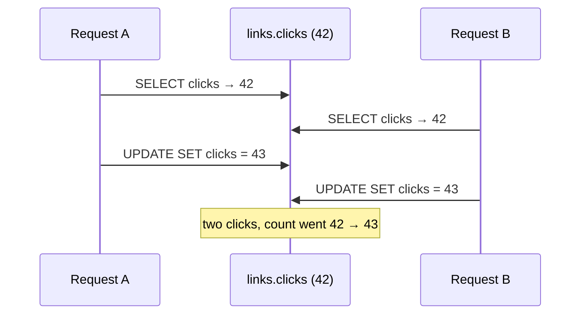
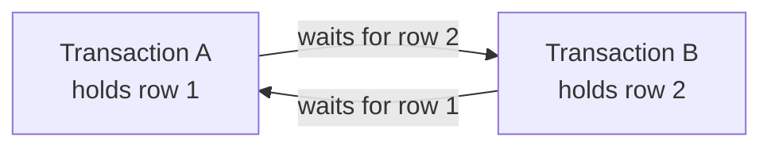

export const quotaSetup = `
CREATE TABLE owners (
  id int PRIMARY KEY,
  name text NOT NULL,
  links_left int NOT NULL CHECK (links_left >= 0)
);
CREATE TABLE links (
  slug text PRIMARY KEY,
  url text NOT NULL,
  owner_id int NOT NULL REFERENCES owners(id),
  clicks bigint NOT NULL DEFAULT 0 CHECK (clicks >= 0)
);
INSERT INTO owners VALUES (1, 'ada', 2), (2, 'grace', 0);
INSERT INTO links VALUES ('godoc', 'https://go.dev/doc/', 1, 42);
`;

# 6.5 Transactions & concurrency

Two of the hardest problems in backend engineering hide inside the most ordinary-looking code. **First:** a change needs several steps, and something fails halfway — the power cuts, the network drops, a rule is violated on step three. Are you left with half a change? **Second:** two requests touch the same data at the same moment — two clicks on the same link, two people buying the last ticket. Does one of them silently disappear? You met the second problem in chapter 1.2 as a race condition in memory. Databases face it at a vastly larger scale, and their answer — **transactions** — is one of the great achievements of computer science. This chapter explains how they work, where they stop protecting you, and how snip stays correct.

## What you'll learn

- What a **transaction** is — `BEGIN`, `COMMIT`, `ROLLBACK` — and the four **ACID** guarantees.
- **Isolation**: what concurrent transactions can see of each other, the **anomalies** that can occur, and Postgres's **isolation levels**.
- The **lost update** problem and three ways to prevent it: **atomic updates**, **row locks**, and **constraints**.
- **Deadlocks**, and why transactions should be **short**.
- Exactly how snip handles clicks, slugs and migrations safely — and a two-terminal lab where you'll watch one transaction block another.

---

## A transaction: all or nothing

A **transaction** groups several statements into one unit that either **happens completely or not at all**:

```sql
BEGIN;                                                    -- start a transaction
UPDATE owners SET links_left = links_left - 1 WHERE id = 1;  -- use up one of ada's link quota
INSERT INTO links (slug, url, owner_id) VALUES ('new', 'https://example.org', 1);
COMMIT;                                                   -- make both changes permanent, together
```

If anything goes wrong before `COMMIT` — an error, a crash, or you type **`ROLLBACK`** — **none** of the changes happen. There's never a moment where ada's quota was used up but her link doesn't exist.

:::note[Everyday anchor]
A bank transfer is two steps: take money from account A, add it to account B. If the system crashes between the two, money vanishes. A transaction makes the transfer **all or nothing** — like a vending machine that either gives you the snack *and* keeps your coin, or gives the coin back. It never keeps the coin and forgets the snack.
:::

Try it. This playground has an `owners` table with a `links_left` quota. The transaction makes changes, **looks** at them, then rolls them back:

<SqlPlayground setup={quotaSetup} sql={`BEGIN;
UPDATE owners SET links_left = links_left - 1 WHERE id = 1;
INSERT INTO links (slug, url, owner_id) VALUES ('new', 'https://example.org', 1);
SELECT name, links_left, (SELECT count(*) FROM links) AS total_links FROM owners WHERE id = 1;
ROLLBACK;
SELECT name, links_left, (SELECT count(*) FROM links) AS total_links FROM owners WHERE id = 1;`} />

Two result tables: inside the transaction, ada has 1 link left and there are 2 links; after `ROLLBACK`, it's as if nothing happened. Change `ROLLBACK` to `COMMIT` and run again: now the change sticks.

### When a rule fails, the whole thing fails

Grace has `links_left = 0`, and the table has `CHECK (links_left >= 0)`. Paste this into the playground and run it:

```sql
BEGIN;
INSERT INTO links (slug, url, owner_id) VALUES ('grace1', 'https://example.org', 2);
UPDATE owners SET links_left = links_left - 1 WHERE id = 2;   -- would make it -1: CHECK fails
COMMIT;
```

The `UPDATE` violates the constraint and the transaction is **aborted**. Try running `SELECT * FROM links;` now: Postgres refuses with *"current transaction is aborted, commands ignored until end of transaction block"*. A failed transaction must be ended explicitly — run `ROLLBACK;`, then `SELECT * FROM links;` again. No `grace1`: **the `INSERT` before the failure was undone too.** The constraint (chapter 6.3) plus the transaction guarantee the quota and the links can never disagree.

---

## ACID: the four guarantees

Transactions in relational databases promise four things, remembered as **ACID**:

| Letter | Guarantee | In plain words |
|---|---|---|
| **A**tomicity | All statements take effect, or none do | No half-finished changes, ever |
| **C**onsistency | Every committed transaction leaves the data obeying all constraints | Rules like `CHECK`, `UNIQUE`, foreign keys always hold |
| **I**solation | Concurrent transactions don't see each other's half-finished work | Others see before or after, not in between |
| **D**urability | Once `COMMIT` returns, the change survives crashes | It's in the write-ahead log on disk (chapter 6.1) |

Every single SQL statement is automatically its own tiny transaction. `BEGIN … COMMIT` is how you make *several* statements share one.

---

## Isolation: what others can see

Atomicity handles failures. **Isolation** handles *concurrency* — many transactions running at once, which is the normal state of a busy database. Perfect isolation would make every transaction behave as if it ran completely alone, one after another. That's possible, but it costs performance, so databases offer **levels** that trade strictness for speed.

First, the **anomalies** — the strange things that can happen when isolation is weaker:

| Anomaly | What happens | snip-flavoured example |
|---|---|---|
| **Dirty read** | You see another transaction's *uncommitted* change, which is later rolled back | You count a link that never actually got created |
| **Non-repeatable read** | You read a row twice in one transaction and get different values | A report reads `clicks` twice and the numbers don't add up |
| **Phantom read** | You run the same query twice and *new rows* appear | "Count my links" changes mid-transaction |
| **Lost update** | Two transactions read–modify–write the same value; one overwrites the other | Two clicks counted as one (below) |
| **Write skew** | Two transactions each check a condition, both pass, together they break it | Two requests each see "1 link left" and both create a link |

And Postgres's levels:

| Level | Prevents | Notes |
|---|---|---|
| **Read Committed** (Postgres default) | dirty reads | Each *statement* sees data committed before it started |
| **Repeatable Read** | + non-repeatable and phantom reads | The whole transaction sees one consistent snapshot |
| **Serializable** | + write skew — everything | Results as if transactions ran one at a time; some may fail with a "serialization failure" and **must be retried** |

How does Postgres let readers and writers run at the same time without constantly blocking each other? **MVCC** (multi-version concurrency control): an update doesn't overwrite a row in place; it writes a **new version**, and each transaction sees the versions that were committed at the right moment for it. Readers never block writers, and writers never block readers.

:::info[In the real world]
Most applications run at the default, **Read Committed**, and handle the dangerous cases explicitly with the techniques below. Financial systems often use **Serializable** for their critical paths and retry on failure. Knowing which anomalies your level allows is what separates "it passed all the tests" from "it's correct under load".
:::

---

## The lost update, and three ways to prevent it

Here's chapter 1.2's race condition, now in a database. Two redirects for `godoc` arrive together, and the code does the obvious thing — read the count, add one in the application, write it back:



Each statement was its own perfectly fine transaction. The bug is in the **gap between reading and writing**. Read Committed does **not** prevent it. Three fixes, from simplest to most general:

### 1. Atomic update: let the database do the arithmetic

```sql
UPDATE links SET clicks = clicks + 1 WHERE slug = 'godoc';
```

The read, add and write happen inside **one statement**; Postgres locks the row while doing it, so concurrent updates queue up and each sees the previous result. This is exactly what snip does (`internal/store/postgres/postgres.go`):

```go
// AddClicks adds n in one atomic UPDATE, so concurrent workers never lose a
// count (chapter 6.5 explains why "read, add, write back" would).
func (s *Store) AddClicks(ctx context.Context, slug string, n int64) error {
	tag, err := s.pool.Exec(ctx, `UPDATE links SET clicks = clicks + $2 WHERE slug = $1`, slug, n)
	// …
}
```

And snip has a test proving it — 50 goroutines adding 2 clicks each, concurrently, against real Postgres, must end at exactly 100 (`TestAddClicksIsAtomic` in `postgres_test.go`, chapter 4.4).

### 2. Lock the row: `SELECT … FOR UPDATE`

When the logic can't fit in one statement — "check the quota, then insert, then decrement" — lock the row you're about to change:

```sql
BEGIN;
SELECT links_left FROM owners WHERE id = 1 FOR UPDATE;   -- lock ada's row until COMMIT
-- (application checks links_left > 0)
INSERT INTO links (slug, url, owner_id) VALUES ('new', 'https://example.org', 1);
UPDATE owners SET links_left = links_left - 1 WHERE id = 1;
COMMIT;                                                   -- lock released
```

A second transaction running `SELECT … FOR UPDATE` on the same row **waits** until the first commits, then sees the updated quota. No write skew, no lost update. You'll watch this blocking happen in the lab.

### 3. Let a constraint decide

Sometimes the cleanest fix is to not check at all, and let the database's constraints reject the loser atomically:

- snip doesn't check "is this slug free?" before inserting (two requests could both see "free"). It just inserts; the `PRIMARY KEY` guarantees only one succeeds, and snip turns the other's duplicate-key error into `409 Conflict` (chapter 6.6).
- The quota example above works the same way with `CHECK (links_left >= 0)`: `UPDATE owners SET links_left = links_left - 1 WHERE id = 1` can never drive it negative, however many requests race.

:::tip
The general rule: **never read a value into your application, change it there, and write it back** without protection. Push the logic into one atomic statement, lock the row, or let a constraint decide.
:::

---

## Locks and deadlocks

Row locks (from `UPDATE`, `DELETE` and `SELECT … FOR UPDATE`) are held **until the transaction ends**. Two consequences:

**Long transactions hurt everyone.** A transaction that locks a row and then waits for something slow — a call to another service, a user clicking "confirm", a `time.Sleep` — makes every other request touching that row wait too. Keep transactions **short**: do slow work before `BEGIN` or after `COMMIT`, never inside.

**Deadlocks.** Transaction A locks row 1 and wants row 2; transaction B locks row 2 and wants row 1. Each waits for the other forever (chapter 4.5's deadlock, in the database):



Postgres detects this within about a second, aborts one of them with `ERROR: deadlock detected`, and lets the other continue. The aborted one should be **retried**. Prevention: always lock rows in a **consistent order** (for example, by ascending ID), and keep transactions short.

---

## Locks that aren't about rows: advisory locks

When snip starts, it runs migrations (chapter 6.3). But on Kubernetes, three copies of snip might start at the same moment — and three copies all trying to create the same tables would collide. snip takes a Postgres **advisory lock**: a named lock with no row attached, just "only one of us may do this at a time". From `Migrate` in `postgres.go`:

```go
// Serialise concurrent migrators (e.g. two pods starting at once).
if _, err := conn.Exec(ctx, `SELECT pg_advisory_lock(7412)`); err != nil {
	return nil, err
}
defer conn.Exec(context.Background(), `SELECT pg_advisory_unlock(7412)`)
```

The first copy gets the lock and migrates; the others wait, then find nothing left to do. Each migration also runs inside its own transaction, so a failing one leaves no half-created tables behind.

:::warning[What can go wrong]
- **Read–modify–write in application code.** Lost updates under load. Use atomic statements, `FOR UPDATE`, or constraints.
- **Check-then-act.** "If the slug is free, insert it" races. Let the unique constraint decide.
- **Slow work inside a transaction.** Network calls or user input while holding locks stall everyone else.
- **Forgetting to retry.** Deadlock victims and serialization failures are *expected* under concurrency; code must retry them (with a limit, chapter 8.4).
- **Assuming the isolation level protects you.** Postgres's default, Read Committed, does not prevent lost updates or write skew.
:::

---

## Lab

Steps 1–2 run in the playground above. Step 3 needs Docker and two terminals — it's the best way to *feel* locking.

1. **Commit vs rollback.** Run the playground as is (ROLLBACK), then change `ROLLBACK` to `COMMIT` and run again. Run the final `SELECT` on its own afterwards to confirm the committed change persisted.

2. **Atomicity under failure.** Press **Reset**, paste the grace transaction from [When a rule fails](#when-a-rule-fails-the-whole-thing-fails), run it, and read the error. Run `ROLLBACK;` to end the failed transaction, then `SELECT * FROM links;`. The earlier `INSERT` was undone together with the failing `UPDATE`.

3. **Watch a lock block another transaction.** Start Postgres and open **two** `psql` sessions:
   ```bash
   docker run -d --name pg-tx -e POSTGRES_PASSWORD=learn postgres:16-alpine
   sleep 3
   docker exec -it pg-tx psql -U postgres     # terminal 1
   docker exec -it pg-tx psql -U postgres     # terminal 2
   ```
   In **terminal 1**, create a table and lock a row:
   ```sql
   CREATE TABLE links (slug text PRIMARY KEY, clicks bigint NOT NULL DEFAULT 0);
   INSERT INTO links VALUES ('godoc', 42);
   BEGIN;
   SELECT clicks FROM links WHERE slug = 'godoc' FOR UPDATE;   -- locks the row
   ```
   In **terminal 2**:
   ```sql
   UPDATE links SET clicks = clicks + 1 WHERE slug = 'godoc';  -- hangs: waiting for the lock
   ```
   Terminal 2 **hangs**. Now in **terminal 1**:
   ```sql
   UPDATE links SET clicks = clicks + 1 WHERE slug = 'godoc';
   COMMIT;
   ```
   Terminal 2 finishes instantly. Run `SELECT clicks FROM links;` in either: **44**. Both increments counted — nothing lost.

4. **Cause a deadlock on purpose** (same two terminals):
   ```sql
   -- terminal 1                               -- terminal 2
   INSERT INTO links VALUES ('a', 0), ('b', 0);
   BEGIN;                                      BEGIN;
   UPDATE links SET clicks = 1 WHERE slug = 'a';
                                               UPDATE links SET clicks = 1 WHERE slug = 'b';
   UPDATE links SET clicks = 2 WHERE slug = 'b';   -- waits…
                                               UPDATE links SET clicks = 2 WHERE slug = 'a';   -- deadlock!
   ```
   Within about a second one terminal reports `ERROR: deadlock detected` and its transaction is aborted; the other can `COMMIT`. Clean up with `docker rm -f pg-tx`.

## Self-check

<Quiz
  id="data-transactions"
  questions={[
    {
      q: 'A transaction inserts a link and then an UPDATE fails a CHECK constraint. What happens to the inserted link?',
      options: [
        'It stays — the INSERT succeeded before the UPDATE ran',
        'It is undone: the whole transaction rolls back',
        'It stays, but is hidden until the constraint is fixed',
        'Postgres keeps it and only rolls back the failed UPDATE',
      ],
      answer: 1,
      explain: 'It is undone — the whole transaction is rolled back (atomicity). Atomicity means all or nothing. Any failure before COMMIT undoes every change in the transaction.',
    },
    {
      q: 'Two requests each run SELECT clicks, add 1 in Go, then UPDATE clicks = <new value>. What can go wrong under Postgres’s default isolation?',
      options: [
        'Nothing — Read Committed makes each UPDATE wait its turn',
        'A lost update: both read the same value, and one +1 vanishes',
        'A dirty read: one request sees the other’s uncommitted value',
        'A deadlock, since each request waits for the other’s row',
      ],
      answer: 1,
      explain: 'Read Committed does not prevent lost updates. Use UPDATE … SET clicks = clicks + 1 (atomic), SELECT … FOR UPDATE, or a stricter isolation level with retries.',
    },
    {
      q: 'Why does snip insert new slugs directly instead of first checking whether the slug is free?',
      options: [
        'Checking first is too slow on a table with millions of links',
        'Check-then-insert races; the PRIMARY KEY accepts exactly one',
        'Postgres can’t check for an existing row inside a transaction',
        'Duplicate slugs are allowed, and the newest one wins',
      ],
      answer: 1,
      explain: 'Check-then-insert races; the PRIMARY KEY lets the database accept exactly one and reject the other atomically. Two requests could both see "free" and both insert. The unique constraint is the only race-free judge; snip maps the duplicate error to 409.',
    },
    {
      q: 'Postgres reports "deadlock detected". What should the application do?',
      options: [
        'Crash, since a deadlock means the data may be corrupted',
        'Retry it (with a limit), and lock rows in a consistent order',
        'Disable row locking for the tables involved in the deadlock',
        'Wait: Postgres retries the transaction by itself',
      ],
      answer: 1,
      explain: 'Retry the aborted transaction (with a limit), and prevent future deadlocks by locking rows in a consistent order. Postgres aborts one transaction so the other can finish; nothing is corrupted. The victim should be retried, and consistent lock ordering plus short transactions make deadlocks rarer.',
    },
  ]}
/>

<details>
<summary>Explain ACID in four sentences a non-engineer would understand.</summary>

- **Atomicity:** a group of changes happens completely or not at all — never half.
- **Consistency:** after every change, all the rules about the data still hold (no negative balances, no duplicate slugs).
- **Isolation:** people working at the same time don't see each other's half-finished work.
- **Durability:** once the database says "saved", the data survives crashes and power cuts.

</details>

<details>
<summary>Why should you never call another service (say, send an email) inside a database transaction?</summary>

Two reasons. **Locks:** the transaction holds row locks until it ends, so while you wait for the email service (which might take seconds, or hang), every other request touching those rows waits too. **Atomicity doesn't reach outside:** if the transaction rolls back after the email was sent, the email can't be un-sent — the database and the outside world now disagree. Do the database work in a short transaction, commit it, and then trigger the side effect — ideally through a queue, so it can be retried reliably (chapter 8.2's "outbox" idea).

</details>
