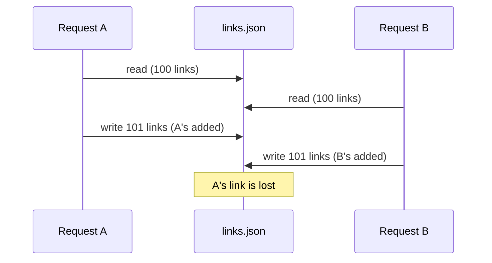
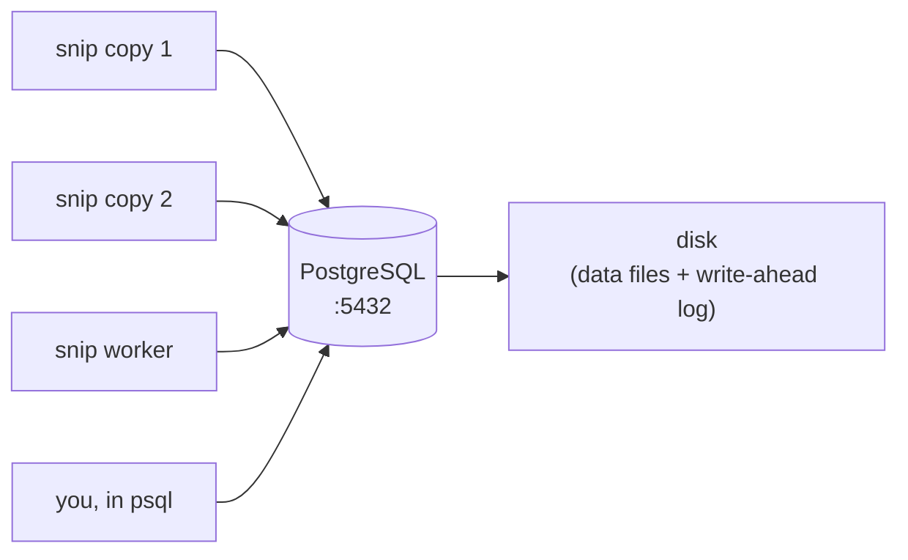

# 6.1 Why databases exist

snip v0 forgot every link the moment it stopped (chapter 5.1). The obvious fix sounds simple: *save the links to a file.* Engineers try exactly that all the time — and discover, one painful surprise after another, why databases exist. This chapter walks through those surprises: crashes halfway through a write, two requests writing at once, finding one link among millions, and data that quietly stops making sense. A **database** is decades of hard-won answers to all four. By the end you'll have run real SQL — in a real PostgreSQL database running inside this web page.

## What you'll learn

- The four problems every serious app hits when storing data: **durability**, **concurrency**, **querying** and **integrity**.
- What a **database** and a **database management system** are, and why "just use a file" breaks.
- The **relational model**: data in **tables** of **rows** and **columns**, queried with **SQL**.
- The main **kinds of databases** (relational, key-value, document and more) and why snip uses **PostgreSQL**.
- How snip talks to its database — and your first `SELECT`, `INSERT` and `UPDATE`.

---

## Why not just save to a file?

Let's try the obvious approach and watch it fail. Suppose snip writes its links to `links.json` after every change.

### Problem 1: durability — crashes happen mid-write

Writing a file isn't instant. If the power cuts or the process crashes halfway through writing `links.json`, you're left with half a file — often unreadable. **Every link is now gone**, not just the new one.

And even a "finished" write might not be safe: the operating system often keeps recently written data in memory (chapter 1.1) and writes it to disk a moment later. Crash in that moment, and the data you "saved" never reached the disk.

**Durability** means: once the database says "saved", the data survives crashes, power cuts and restarts.

### Problem 2: concurrency — two requests at once

snip handles requests concurrently (chapter 4.5). Two people create links at the same moment. Each request reads the file, adds its link, and writes the file back:



That's chapter 1.2's race condition, now destroying data. You could add a lock — but only within one process. Run two copies of snip (chapter 8.6) and they can't share a lock on a file.

### Problem 3: querying — finding things fast

"Give me link `k7Qz2a`" means reading and scanning the whole file. With 10 links, fine. With 10 million, every single redirect reads gigabytes. "Show me my 20 newest links", "which links got the most clicks this week?" — each is a custom program that scans everything.

### Problem 4: integrity — data that stops making sense

Nothing in a JSON file stops two links having the same slug, a link with an empty URL, or a click count of −3. Every rule must be checked by every piece of code that ever writes the file — and one forgotten check corrupts the data for good.

:::note[Everyday anchor]
A file is a notebook on your desk. Fine for you alone. Now imagine fifty people writing in it at once, some of them tearing out pages halfway through, the lights going off at random, and your boss asking "how many entries mention Tuesday?" every few seconds. A database is a well-run records office: one careful clerk per drawer, a logbook so nothing half-done is ever filed, indexes to find anything instantly, and rules about what a valid form looks like.
:::

---

## What a database gives you

A **database** is an organised collection of data. The software that manages it — PostgreSQL, MySQL, SQLite, and many more — is a **database management system** (DBMS), though people usually just say "the database". A good one solves all four problems:

| Problem | What the database does | You'll learn it in |
|---|---|---|
| **Durability** | Writes a **log** of every change to disk *before* confirming it ("write-ahead log"), so it can recover after a crash | 6.5 |
| **Concurrency** | **Transactions** and **locks** let many clients read and write at once without corrupting anything | 6.5 |
| **Querying** | A **query language** (SQL) plus **indexes** that find one row among millions without reading them all | 6.2, 6.4 |
| **Integrity** | **Constraints** — types, required fields, uniqueness, valid references — enforced on every write, by the database itself | 6.3 |

The database is a separate **server** (chapter 1.6): a long-running process, listening on a port (Postgres uses **5432**), that many clients — every copy of snip, your terminal, a reporting tool — connect to over the network.



This is also why the database becomes the **source of truth** in snip's architecture (chapter 0.3): caches and copies come and go, but the database holds the real data.

---

## The relational model: tables, rows and columns

Most business data lives in **relational databases**, which store data in **tables** — like spreadsheets with strict rules:

- A **table** holds one kind of thing: `links`, `api_keys`.
- Each **column** is one attribute, with a fixed **type**: `slug` is text, `clicks` is a whole number, `created_at` is a timestamp.
- Each **row** is one item: one link.

snip's `links` table looks like this:

| slug | url | owner_id | clicks | created_at |
|---|---|---|---|---|
| `godoc` | `https://go.dev/doc/` | 1 | 42 | 2026-09-24 19:56:18+00 |
| `k7Qz2a` | `https://example.com` | 1 | 3 | 2026-09-24 20:01:02+00 |
| `launch` | `https://blog.example/launch` | 2 | 910 | 2026-09-23 09:15:44+00 |

"Relational" refers to how tables **relate** to each other: `owner_id` refers to a row in the `api_keys` table, linking each link to who created it (chapter 6.3).

You ask a relational database questions in **SQL** (Structured Query Language, often pronounced "sequel"). SQL is **declarative**: you say *what* you want, not *how* to find it. The database works out the fastest way.

```sql
SELECT slug, clicks
FROM links
WHERE owner_id = 1
ORDER BY clicks DESC;
```

"Give me the slug and clicks of owner 1's links, most-clicked first." One line — and it stays fast with millions of rows, given the right index (chapter 6.4).

---

## Try it: real SQL, in your browser

The box below runs a real **PostgreSQL** database inside this web page (compiled to WebAssembly — nothing is installed or sent anywhere). It's been set up with a small `links` table. Press **Run**, then try editing the query.

<SqlPlayground
  setup="CREATE TABLE links (slug text PRIMARY KEY, url text NOT NULL, owner_id int NOT NULL, clicks bigint NOT NULL DEFAULT 0 CHECK (clicks >= 0), created_at timestamptz NOT NULL DEFAULT now()); INSERT INTO links (slug, url, owner_id, clicks, created_at) VALUES ('godoc','https://go.dev/doc/',1,42,'2026-09-24 19:56:18+00'), ('k7Qz2a','https://example.com',1,3,'2026-09-24 20:01:02+00'), ('launch','https://blog.example/launch',2,910,'2026-09-23 09:15:44+00'), ('pgdocs','https://www.postgresql.org/docs/',2,17,'2026-09-22 14:00:00+00');"
  sql="SELECT slug, url, clicks FROM links ORDER BY clicks DESC;"
/>

Now try these, one at a time (replace the query and press Run):

```sql
-- Add a link
INSERT INTO links (slug, url, owner_id) VALUES ('mine', 'https://example.org', 1);

-- Count a click, the safe way (chapter 6.5 explains why)
UPDATE links SET clicks = clicks + 1 WHERE slug = 'godoc';

-- Just owner 1's links
SELECT slug, clicks FROM links WHERE owner_id = 1;

-- Integrity in action: this is REFUSED — slug 'godoc' already exists
INSERT INTO links (slug, url, owner_id) VALUES ('godoc', 'https://evil.example', 3);

-- And this too: clicks can never go negative
UPDATE links SET clicks = -5 WHERE slug = 'godoc';
```

Notice the last two. You didn't write any checking code — the **table definition** (`PRIMARY KEY`, `CHECK (clicks >= 0)`) makes the database refuse bad data, for every client, forever. That's integrity. Press **Reset** to start over at any time.

---

## Kinds of databases

Relational databases are the default, but not the only kind. You'll meet these (chapter 6.8 goes deeper):

| Kind | Stores data as | Great for | Examples |
|---|---|---|---|
| **Relational (SQL)** | Tables with relations and strict types | Most business data; correctness; flexible queries | PostgreSQL, MySQL, SQLite, SQL Server |
| **Key-value** | A giant map: key → value | Caches, sessions, counters — extreme speed | Redis, DynamoDB, Memcached |
| **Document** | JSON-like documents | Flexible, nested data; one object read at a time | MongoDB, Firestore, Couchbase |
| **Wide-column / analytics** | Columns, optimised for scanning billions of rows | Reports and analytics | ClickHouse, BigQuery, Cassandra |
| **Search** | Inverted indexes of words | Full-text search, "did you mean…" | Elasticsearch, OpenSearch |
| **Vector** | Lists of numbers (embeddings) | Finding things by *meaning* — AI search | pgvector, Pinecone, Qdrant (chapter 14.7) |

snip uses two: **PostgreSQL** as the source of truth for links and keys, and **Redis**, a key-value store, as a fast cache, rate limiter and queue (chapter 6.7).

### Why PostgreSQL?

**PostgreSQL** ("Postgres") is free, open source, more than 35 years in development, and one of the most widely used databases in the world. It's famously correct and careful with data, handles everything from a side project to very large companies, and has extensions for nearly anything — JSON documents, full-text search, geographic data, even vector search for AI (chapter 14.7). If you learn one database deeply, make it this one; the SQL transfers to every other relational database.

:::info[In the real world]
Many successful products run on a single well-looked-after Postgres database for years. "We need a special database for scale" is often premature: the first answer to most performance problems is a better index (chapter 6.4), not a different database. Reach for specialised stores when you have a specific need Postgres serves badly.
:::

---

## How snip talks to its database

snip's code never touches Postgres's files. It connects over the network and sends SQL, through the **`Store` interface** you met in chapter 4.3. From `internal/store/postgres/postgres.go`:

```go
func (s *Store) Get(ctx context.Context, slug string) (links.Link, error) {
	var l links.Link
	err := s.pool.QueryRow(ctx,
		`SELECT slug, url, owner_id, clicks, created_at FROM links WHERE slug = $1`, slug,
	).Scan(&l.Slug, &l.URL, &l.OwnerID, &l.Clicks, &l.CreatedAt)
	if errors.Is(err, pgx.ErrNoRows) {
		return links.Link{}, links.ErrNotFound
	}
	return l, err
}
```

Send a query; the database returns rows; `Scan` copies each column into a field of a Go struct; "no rows" becomes snip's own `ErrNotFound` (chapter 4.2). Chapter 6.6 covers this code — and why that `$1` is so important — properly.

:::warning[What can go wrong]
- **"We'll just use files/JSON for now."** It works until the first crash mid-write or the first concurrent request, and then data is silently lost. Start with a database — even SQLite, a database in a single file, is far safer than hand-rolled files.
- **Treating the database as a dumb bucket.** Checking rules only in application code means one buggy script or a second service can corrupt everything. Put the essential rules in the schema, where the database enforces them for everyone (chapter 6.3).
- **The database as a single point of failure.** It's the source of truth — if it's down, snip is down, and if it's lost, the data is lost. Backups and replicas matter (chapters 12.3 and 8.6).
:::

---

## Lab

Free. Steps 1–2 run right here in the page; step 3 uses Docker on your computer.

1. **Explore the playground above.** Run each query in [Try it](#try-it-real-sql-in-your-browser). Then write your own: *"all links with more than 10 clicks, newest first"*. (Hint: `WHERE clicks > 10 ORDER BY created_at DESC`.)

2. **Try to break the rules.** In the playground, try to: insert a link with no URL; insert a duplicate slug; set clicks to a negative number. Read each error message. Every one is the database protecting integrity without a line of application code.

3. **Run a real Postgres server on your computer** (Docker, chapter 0.2):
   ```bash
   docker run -d --name pg-lab -e POSTGRES_PASSWORD=learn -p 5432:5432 postgres:16-alpine   # start Postgres
   docker exec -it pg-lab psql -U postgres                                                   # open the psql shell inside it
   ```
   At the `postgres=#` prompt, type SQL (end each statement with `;`):
   ```sql
   CREATE TABLE notes (id serial PRIMARY KEY, body text NOT NULL, created_at timestamptz DEFAULT now());
   INSERT INTO notes (body) VALUES ('databases remember');
   SELECT * FROM notes;
   \dt          -- psql command: list tables
   \q           -- quit
   ```
   Now prove **durability**: `docker restart pg-lab`, reconnect with the `docker exec` line, and `SELECT * FROM notes;` — your row survived the restart, unlike snip v0's links. Clean up with `docker rm -f pg-lab`.

## Self-check

<Quiz
  id="data-why-databases"
  questions={[
    {
      q: 'Two snip requests each read links.json, add a link, and write the file back at the same moment. What can happen?',
      options: [
        'Both links are saved, because each write adds to the file',
        'One link is silently lost: the second write overwrites the first',
        'The file is locked, and both requests fail with an error',
        'The operating system merges the two versions of the file',
      ],
      answer: 1,
      explain: 'This is a race condition: both read the old contents, and the last write wins. Databases prevent it with transactions and locks.',
    },
    {
      q: 'What does durability mean for a database?',
      options: [
        'It never needs updating once the schema has been designed',
        'Once a write is confirmed, it survives crashes and restarts',
        'It can store very large files without running out of space',
        'It keeps a copy of every row that has ever been deleted',
      ],
      answer: 1,
      explain: 'Databases write changes to a log on disk before confirming them, so a crash cannot lose data they already said was saved.',
    },
    {
      q: 'In the playground, INSERT of a duplicate slug fails. What made the database refuse it?',
      options: [
        'snip’s Go code checked for the duplicate before inserting it',
        'slug is declared PRIMARY KEY, so the database enforces uniqueness',
        'The browser blocked the request, since it had sent it already',
        'Duplicate values are never allowed in any column of any table',
      ],
      answer: 1,
      explain: 'Constraints in the schema are enforced by the database on every write, from every client. That is integrity you cannot forget to check.',
    },
    {
      q: 'Why is SQL called declarative?',
      options: [
        'You declare every variable and type before you can use it',
        'You say what data you want; the database decides how to get it',
        'Its statements declare tables, and a separate language queries them',
        'It requires a declaration file listing the queries in advance',
      ],
      answer: 1,
      explain: 'You write "links of owner 1, most clicks first"; the database chooses the fastest plan — for example, using an index (chapter 6.4).',
    },
  ]}
/>

<details>
<summary>List the four problems with storing snip's links in a file, and one sentence each on how a database solves them.</summary>

1. **Durability** — a crash mid-write corrupts the file. *The database logs every change to disk before confirming it, and recovers from the log after a crash.*
2. **Concurrency** — simultaneous writes lose data. *Transactions and locks let many clients write safely at once.*
3. **Querying** — finding one link means scanning everything. *SQL plus indexes finds rows directly, even among millions.*
4. **Integrity** — nothing stops duplicate slugs or negative counts. *Constraints in the schema make the database refuse invalid data from every client.*

</details>

<details>
<summary>snip uses both Postgres and Redis. Why not just one of them?</summary>

They're good at different things. **Postgres** is the **source of truth**: durable, transactional, enforces integrity, and answers flexible questions ("my newest links"). **Redis** keeps data **in memory** — extremely fast for simple lookups by key — so it's ideal as a **cache** for redirects, for shared rate-limit counters, and as a queue. If Redis loses its data, snip rebuilds the cache from Postgres; the reverse isn't true. Using each for what it does best is a very common pattern (chapter 6.7).

</details>
