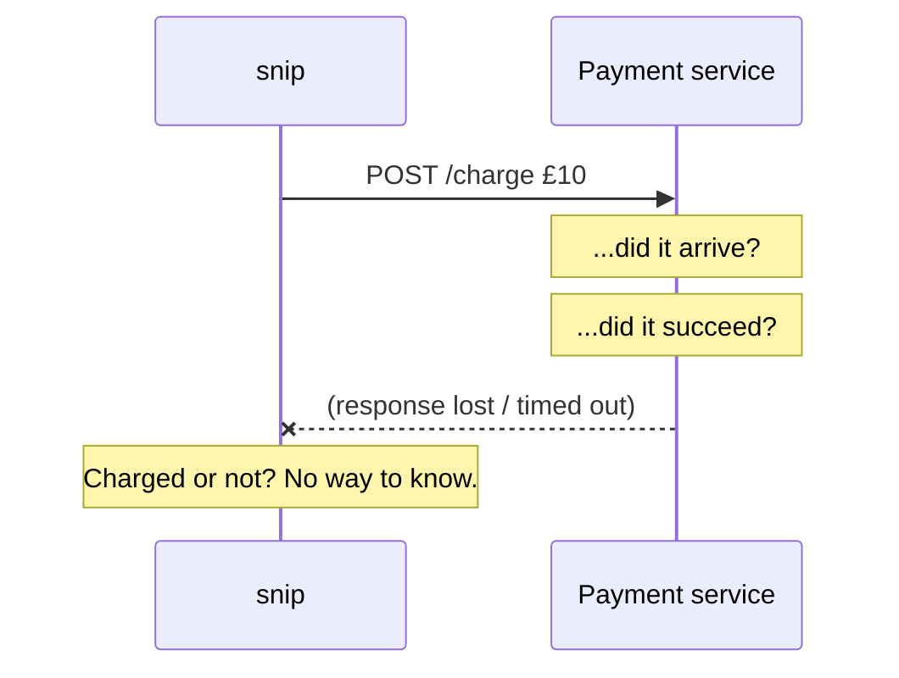
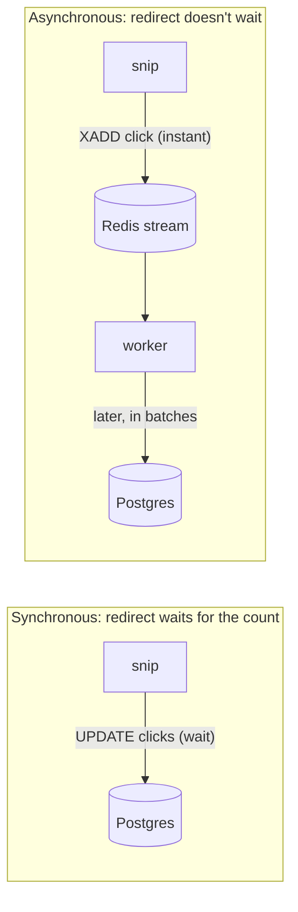

# 8.1 Distributed systems survival kit

Inside one program, a function call either returns or crashes the whole program. Simple. The moment snip calls Postgres, Redis, or another service over the network, that certainty is gone. A call can succeed, fail, hang forever, or — the nasty one — **succeed on the other side while you're told it failed**. Welcome to **distributed systems**: any system where parts running on different machines cooperate over a network. By Part 8, snip is one (API copies, a database, a cache, a queue, a worker), and so is almost everything you'll build professionally. This chapter is the survival kit: the handful of ideas that separate systems that fall over at the first network hiccup from systems that shrug it off.

## What you'll learn

- **Partial failure**: why "did it work?" can have no answer, and the **fallacies of distributed computing**.
- **Timeouts** — every network call needs one — and how to choose them.
- **Retries** done safely: **exponential backoff**, **jitter**, and a retry budget.
- **Idempotency**: why retries without it double-charge customers — shown in a runnable demo.
- **Delivery guarantees** (at-most-once, at-least-once, "exactly-once"), **clocks and ordering**, and **synchronous vs asynchronous** communication.

---

## Partial failure: the defining problem

On one machine, failure is mostly all-or-nothing: if the power goes, everything stops together. In a distributed system, **some parts fail while others keep going**. The database is up but slow. One of three API copies crashed. The network between two data centres drops packets. Redis restarted and lost its cache. This is **partial failure**, and it's the defining difficulty of the field.

Worst of all is the **ambiguous** failure. snip sends a request to a payment service; the response never arrives:



Did the request get lost on the way there (nothing happened)? Did the payment service crash halfway? Did it succeed, with only the *response* lost on the way back? **From snip's side, these all look identical.** Every technique in this chapter exists to act sensibly despite that uncertainty.

:::note[Everyday anchor]
You post an important letter and hear nothing back. Did it get lost? Did they receive it and ignore it? Did they reply and *their* letter got lost? You can't tell from your armchair. So you do sensible things: wait a reasonable time (a timeout), send it again (a retry) — and write "reference #123, please ignore if you already have this" on it (an idempotency key), so a duplicate doesn't get processed twice.
:::

### The fallacies of distributed computing

In the 1990s, engineers at Sun Microsystems listed eight assumptions that newcomers to distributed systems make — every one of them false, and every one a source of real outages:

1. The network is reliable.
2. Latency is zero.
3. Bandwidth is infinite.
4. The network is secure.
5. Topology doesn't change.
6. There is one administrator.
7. Transport cost is zero.
8. The network is homogeneous.

Chapters 1.1 and 1.4 already busted the first two: network calls are *weeks* in CPU time, and packets get lost. Keep this list in mind every time you draw an arrow between two boxes.

---

## Timeouts: never wait forever

The first rule of distributed systems: **every network call gets a timeout.** Without one, a hung dependency makes your code hang too — holding a goroutine, a connection, memory. Enough hung calls and your service runs out of resources and fails as well. That's how one slow component takes down a whole system: a **cascading failure**.

snip applies timeouts everywhere (chapters 4.5 and 5.4):

- the HTTP server's read/write timeouts (slow clients can't hold connections),
- the request's context flowing down to Postgres and Redis (the database call is abandoned if the client leaves),
- `/readyz`'s 2-second limit on each dependency ping,
- the 10-second graceful-shutdown deadline.

**Choosing a timeout**: base it on what the dependency *normally* takes. If a query usually takes 5 ms and occasionally 50 ms, a 30-second timeout is useless — by then the user has given up. A common starting point is a few times the normal slow case (the 99th percentile, chapter 13.2), and always less than the timeout of whoever is calling *you*, so you can still answer them properly.

---

## Retries: try again — carefully

Many failures are **transient**: a dropped packet, a restarting server, a brief overload. Trying again often works. But naive retries are dangerous:

- **Retry storms.** If a service is failing because it's overloaded, every client retrying immediately **multiplies** its load — and it never recovers.
- **Synchronised retries.** Thousands of clients that failed at the same moment retry at the same moment, over and over, in waves.

So retries need three things:

1. **Exponential backoff** — wait longer after each failure: 50 ms, 100 ms, 200 ms, 400 ms… giving the dependency room to recover.
2. **Jitter** — add randomness to each wait, so clients spread out instead of retrying in lockstep.

   snip's click worker does both when processing fails (`cmd/snip-worker/main.go`): it waits a random time between half and all of its current backoff, then doubles the backoff, up to 30 seconds:
   ```go
   wait := backoff/2 + rand.N(backoff/2+1)
   ...
   backoff = min(backoff*2, 30*time.Second) // exponential backoff (chapter 8.1)
   ```
   (For a long time it had only the backoff, found in a later review. With several workers and a Postgres restart, they would all fail at the same moment and retry at the same moments: exactly the waves described above.)
3. **A limit** — a maximum number of attempts or a total time budget, after which you report failure. Some systems also cap retries as a percentage of traffic ("retry budget"), so retries can never more than double the load.

And one rule overrides everything: **only retry operations that are safe to repeat.** Which brings us to the most important idea in this chapter.

---

## Idempotency: making retries safe

Recall from chapter 5.2: an operation is **idempotent** if doing it twice has the same effect as doing it once. `GET` and `DELETE` are naturally idempotent; "charge £10" or "create a link" are not.

Combine that with the ambiguous failure above, and you get a real dilemma. The response to "charge £10" was lost. Retry, and you might charge twice. Don't retry, and you might not charge at all.

The way out is an **idempotency key**: the client generates a unique ID *per intended operation* and sends it with every attempt. The server records which keys it has already processed; a repeat with the same key returns the original result instead of acting again.

### See it happen

The handbook includes a runnable demo, `snip/examples/retry`. It starts a deliberately unreliable "payment" server — 20% of requests fail immediately, and 20% **do the work but respond too slowly** (so the client times out, exactly the ambiguous case) — and sends it 20 charges three different ways:

```text
$ go run ./examples/retry -mode naive
mode=naive: 18 succeeded, 2 failed, took 3.006s
server actually charged 18 times for 20 intended charges

$ go run ./examples/retry -mode retry
mode=retry: 20 succeeded, 0 failed, took 1.953s
server actually charged 24 times for 20 intended charges

$ go run ./examples/retry -mode smart
mode=smart: 20 succeeded, 0 failed, took 1.518s
server actually charged 20 times for 20 intended charges
```

(Your numbers vary — the failures are random — but the pattern holds.)

- **naive** — no timeout, no retries: slow (it waits out every sluggish response) and some charges simply fail.
- **retry** — timeouts and retries, **no idempotency key**: every charge "succeeds"… and customers are charged **24 times for 20 purchases**. Each timed-out-but-actually-processed request was charged again on retry.
- **smart** — timeouts, retries with backoff and jitter, **and an idempotency key**: exactly 20 charges.

The server side of idempotency is small (`examples/retry/main.go`):

```go
// process charges once per idempotency key, however many times it's asked.
func process(key string) {
	mu.Lock()
	defer mu.Unlock()
	if key != "" && charged[key] {
		return // already done: a retry, not a new charge
	}
	charged[key] = true
	totalCharged++
}
```

In a real service, the processed keys live in the database (a table with a `UNIQUE` key column — chapter 6.5's "let a constraint decide"), recorded in the **same transaction** as the work itself, so the two can never disagree.

:::tip
Before adding a retry anywhere, ask: *"If this operation already happened and I do it again, what breaks?"* If the answer isn't "nothing", make it idempotent first.
:::

---

## Delivery guarantees

When one part of a system sends messages to another — events to a queue, requests to a service — there are three possible guarantees:

| Guarantee | Meaning | How you get it | Risk |
|---|---|---|---|
| **At-most-once** | Each message is delivered once or not at all | Send once, never retry | Messages can be **lost** |
| **At-least-once** | Each message is delivered one or more times | Retry until acknowledged | Messages can be **duplicated** |
| **Exactly-once** | Each message has its effect exactly once | At-least-once delivery **plus idempotent processing** | Needs care on the receiving side |

True exactly-once *delivery* over an unreliable network is impossible in general; what systems achieve is exactly-once *effect*: deliver at least once, and make processing idempotent so duplicates do no harm.

snip's click counting is **at-least-once** (chapter 8.2): the worker acknowledges click events only after adding them to Postgres. If it crashes in between, those events are delivered again and counted twice. For click counts, a rare small overcount is an accepted trade-off — and the code says so in a comment. For payments it wouldn't be, and the processing would need idempotency.

---

## Time and ordering

"Which happened first?" sounds trivial. Across machines, it isn't:

- **Clocks drift.** Every machine's clock is slightly wrong, and they're corrected periodically (by NTP, the network time protocol), sometimes jumping backwards. Two servers can disagree by milliseconds or more.
- **Messages arrive out of order.** Event A sent before event B can arrive after it.

So never use timestamps from different machines to decide the order of events that matters (who bought the last ticket, which update wins). Use the database's own ordering (a single primary with transactions, chapter 6.5), sequence numbers from one source, or explicit version numbers ("update this row only if its version is still 7" — **optimistic concurrency**). Within one machine, Go's `time.Since` uses a monotonic clock that never jumps backwards, which is why it's safe for measuring durations.

---

## Talking between services: sync vs async

Two broad ways for parts of a system to communicate:

- **Synchronous** — call and wait for the answer: HTTP, gRPC (chapter 5.5). Simple and immediate, but the caller is **coupled** to the callee: if it's slow or down, so is the caller.
- **Asynchronous** — drop a message in a queue and move on; someone processes it later (chapter 8.2). The caller isn't blocked, the callee can be down for a while, and bursts are absorbed — at the cost of more moving parts and eventual (not immediate) results.



snip uses **both**, deliberately: looking up where a link points is synchronous (the visitor needs the answer now), while counting the click is asynchronous (nobody is waiting for it). Choosing which interactions *must* be synchronous is one of the most important design decisions in any system (chapter 15.1).

:::warning[What can go wrong]
- **No timeouts.** One slow dependency cascades into a system-wide outage.
- **Retries without backoff or limits.** Retry storms that keep an overloaded service down.
- **Retrying non-idempotent operations.** Double charges, duplicate emails, duplicate links.
- **Assuming "error" means "didn't happen".** A timeout can mean it succeeded. Design for the ambiguity.
- **Ordering by timestamps from different machines.** Clocks disagree; use one source of ordering.
- **Making everything synchronous.** Each blocking call adds latency and a new way for one failure to spread.
:::

---

## Lab

Free, on your own computer.

1. **Run the demo** several times and compare the three modes:
   ```bash
   cd ~/code/zero-to-prod/snip
   for m in naive retry smart; do go run ./examples/retry -mode $m; done
   ```
   Every run differs, but "retry" almost always charges more than 20 times, and "smart" exactly 20. Notice also that "smart" is usually the *fastest*: short timeouts beat waiting on slow responses.

2. **Read the code.** Open `examples/retry/main.go` and find: the client timeout; the backoff doubling; the jitter; where the idempotency key is sent; where the server checks it. Then change the timeout from 300 ms to 2 seconds and rerun `-mode smart`: slower, because it now waits out every sluggish response.

3. **Break idempotency on purpose.** In `process`, delete the `if key != "" && charged[key]` check and rerun `-mode smart`. Now even the "smart" client double-charges. Idempotency lives on the **server**; the key only works if the server honours it. Undo the change.

4. **Spot the sync/async split in snip.** Open `internal/httpapi/server.go` and find the `redirect` handler. Which call must succeed for the visitor to be redirected, and which is allowed to fail with only a warning? Why is that the right split?

## Self-check

<Quiz
  id="distributed-distributed-survival-kit"
  questions={[
    {
      q: 'A request to a payment service times out. What do you know for sure?',
      options: [
        'The payment was not made',
        'The payment was made',
        'Nothing definite — it may have failed, or succeeded with only the response lost',
        'The payment service is down',
      ],
      answer: 2,
      explain: 'A timeout is ambiguous: the request, the processing or the response could have been lost. That is why retries need idempotency.',
    },
    {
      q: 'Why add jitter to retry delays?',
      options: [
        'To make retries faster',
        'So that many clients that failed together do not all retry at the same instant',
        'To encrypt the retries',
        'Jitter is required by HTTP',
      ],
      answer: 1,
      explain: 'Without jitter, synchronised clients retry in waves that can keep an overloaded service down. Randomness spreads them out.',
    },
    {
      q: 'In the retry demo, why did "retry" mode charge customers 24 times for 20 purchases?',
      options: [
        'The server had a bug that charged twice',
        'Some requests were processed but their responses were too slow; the client retried them without an idempotency key, so they were charged again',
        'The client sent 24 requests on purpose',
        'Jitter caused extra charges',
      ],
      answer: 1,
      explain: 'Retries plus non-idempotent operations equal duplicates. An idempotency key lets the server recognise a retry and not repeat the work.',
    },
    {
      q: 'snip’s click worker is at-least-once. What does that mean for click counts?',
      options: [
        'Clicks are never counted',
        'Every click is counted, but after a crash some may be counted twice — a small overcount accepted as a trade-off',
        'Clicks are counted exactly once, always',
        'Only the first click of each user counts',
      ],
      answer: 1,
      explain: 'Events are acknowledged only after being counted; a crash in between redelivers them. Idempotent processing would be needed for exactly-once effect.',
    },
  ]}
/>

<details>
<summary>Explain why "exactly-once delivery" is really "at-least-once delivery plus idempotent processing".</summary>

Over an unreliable network, a sender can never be sure a message arrived unless it gets an acknowledgement — and the acknowledgement itself can be lost. So to avoid losing messages, the sender must **retry until acknowledged**, which means the receiver will sometimes get the same message twice. That's at-least-once. To make the *effect* happen exactly once, the receiver must be able to **recognise and ignore duplicates** — by an idempotency key, a message ID recorded in the same transaction as the work, or an operation that's naturally idempotent. The network can't give you exactly-once; your processing logic has to.

</details>

<details>
<summary>How would you choose the timeout for snip's call to Postgres when resolving a redirect?</summary>

Start from what the query **normally** takes: an indexed primary-key lookup is typically a millisecond or two, with rare slow cases at tens of milliseconds. A timeout of a few hundred milliseconds covers genuine slow cases while failing fast when the database is truly in trouble — so the visitor gets an answer (even an error) quickly, and snip doesn't pile up blocked requests. It must also sit **within** the budget of whoever is calling snip: if the load balancer gives up after 5 seconds, snip's internal timeouts should be well below that so snip can still return a proper error. Then **measure** in production (chapter 13.2) and adjust.

</details>
