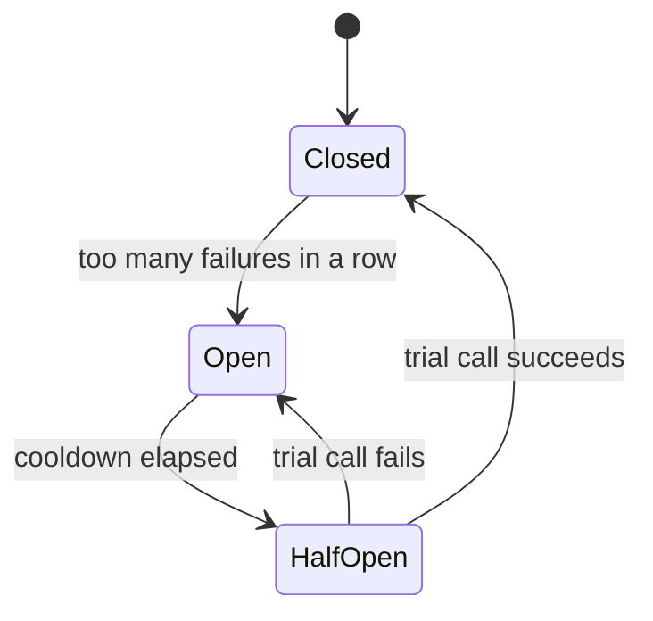

# 8.4 Rate limiting & resilience

Two kinds of trouble arrive at every successful service. The first comes from **outside**: a script stuck in a loop, a scraper, a customer's bug, or an attacker sending far more requests than any honest client would. The second comes from **inside**: a dependency — the database, a payment provider, another team's service — gets slow or fails, and your service, waiting politely on it, fails too. This chapter covers the defences against both: **rate limiting**, to protect your service from its clients, and **resilience patterns** — circuit breakers, bulkheads, load shedding and graceful degradation — to protect it from its dependencies. You'll read snip's real rate limiter and watch a circuit breaker trip and recover.

## What you'll learn

- **Rate limiting** algorithms — fixed window, sliding window, token bucket — and their trade-offs.
- How snip implements a **shared limiter in Redis**, and why it answers **429** with **Retry-After**.
- **Fail open vs fail closed**: what to do when the limiter itself is broken.
- **Circuit breakers**: failing fast when a dependency is down, then testing carefully for recovery — live.
- **Bulkheads**, **load shedding** and **graceful degradation**: keeping the most important things working when others can't.

---

## Rate limiting: fairness and self-defence

A **rate limit** caps how many requests a client may make in a period of time: *"60 link creations per API key per minute."* It protects:

- **The service** — no single client can consume all capacity.
- **Other customers** — one noisy client can't slow everyone else down (the "noisy neighbour", chapter 7.4).
- **Costs and abuse** — spammers can't create a million links (chapter 7.5), and brute-force login attempts become impractically slow (chapter 7.2).

:::note[Everyday anchor]
A rate limit is a nightclub bouncer with a clicker. Only so many people get in per hour; everyone else waits outside. Nobody's banned — they're just told "not yet, come back in ten minutes" — and the people already inside can still move and breathe.
:::

### Algorithms

| Algorithm | How it works | Pros | Cons |
|---|---|---|---|
| **Fixed window** | Count requests per calendar window (e.g. per minute: 12:00:00–12:00:59). Reset at each boundary. | Simplest; one counter per client | A burst at 12:00:59 and another at 12:01:00 allow **twice** the limit in two seconds |
| **Sliding window** | Count requests in the *last* 60 seconds, however the clock falls — often approximated by weighting the previous window | Smooth, fair | More bookkeeping |
| **Token bucket** | A bucket holds up to N tokens, refilled at a steady rate; each request takes one; empty bucket = refused | Allows short bursts up to N, enforces a long-run average; very common | Two parameters to tune |
| **Leaky bucket** | Requests queue and are processed at a fixed rate | Perfectly smooth output | Adds waiting; queue can fill |

snip uses a **fixed window** — simple, cheap, and good enough for link creation, where a brief double burst at a window boundary is harmless.

---

## snip's limiter: shared counters in Redis

snip runs several copies behind a load balancer (chapter 8.3). A counter in one copy's memory would be useless: a client whose requests are spread over three copies would get three times the limit. The counters must be **shared** — in Redis. From `internal/ratelimit/ratelimit.go`:

```go
func (l *Redis) Allow(ctx context.Context, key string) (bool, time.Duration, error) {
	start, untilNext := windowStart(l.now(), l.window)
	k := "snip:rl:" + key + ":" + strconv.FormatInt(start, 10)
	// INCR and EXPIRE in one round trip. INCR is atomic, so two requests
	// arriving together can never both see the same count.
	pipe := l.rdb.TxPipeline()
	incr := pipe.Incr(ctx, k)
	pipe.Expire(ctx, k, l.window+time.Second)
	if _, err := pipe.Exec(ctx); err != nil {
		return true, 0, err // fail open: a Redis outage shouldn't block every user
	}
	if incr.Val() > l.limit {
		return false, untilNext, nil
	}
	return true, 0, nil
}
```

- The Redis key names the **client** and the **window**: `snip:rl:create:7:1790284380` — "owner 7's creations in the minute starting at that Unix time".
- **`INCR`** adds one and returns the new count, **atomically** (chapter 6.7) — no lost updates, however many copies of snip call it at once.
- **`EXPIRE`** makes Redis delete the counter after the window, so memory never fills with old counters.
- Both commands go in one **pipeline** — a single round trip.

The HTTP handler turns a refusal into a **`429 Too Many Requests`** with a **`Retry-After`** header saying how many seconds until the next window (`internal/httpapi/server.go`):

```go
if !allowed {
	w.Header().Set("Retry-After", strconv.Itoa(int(retry.Seconds())+1))
	writeError(w, http.StatusTooManyRequests, "rate_limited", "too many links created; slow down")
	return
}
```

`Retry-After` turns a refusal into instructions: well-behaved clients wait exactly that long instead of hammering the server with immediate retries (chapter 8.1).

**What to limit by.** snip limits by **API key** — an identity the client can't forge. Limiting by IP address is weaker: many users can share one IP (an office, a mobile network), and attackers can use many IPs or spoof `X-Forwarded-For` (chapter 8.3). Real systems often combine several: per key, per IP for unauthenticated endpoints like login, and a global limit to protect the service overall.

### Fail open or fail closed?

What should happen when **Redis is down** and the limiter can't count? Two choices:

- **Fail closed** — refuse every request. Safest against abuse, but a Redis outage becomes a **total outage**.
- **Fail open** — allow requests without counting. The service keeps working; abuse is briefly unchecked.

snip **fails open** (`return true, 0, err`) and logs a warning: for link creation, availability matters more than perfect limiting for a few minutes. A login endpoint protecting against password guessing might reasonably **fail closed**. The right answer depends on what the limit protects — which is why the code states its choice in a comment.

---

## Resilience: surviving your dependencies

Chapter 8.1 introduced timeouts and retries. They're essential, but not enough. Picture snip calling a payment provider that's completely down. Each call waits for its timeout — say 2 seconds — then fails. Meanwhile, requests pile up, each holding a goroutine and a database connection for those 2 seconds; soon snip itself runs out of connections, and **snip's** users see errors on pages that don't even need payments. One dependency's failure has **cascaded**.

Four patterns stop that.

### 1. Circuit breakers: stop calling what's broken

A **circuit breaker** wraps calls to a dependency and watches for failures. It has three states:



- **Closed** (normal) — calls go through; failures are counted.
- **Open** (tripped) — after too many failures, calls **fail immediately** without touching the dependency. No waiting on timeouts, no piling up, and the struggling dependency gets breathing room to recover.
- **Half-open** (testing) — after a cooldown, one **trial** call is allowed through. Success closes the circuit; failure re-opens it for another cooldown.

The name comes from electrical circuit breakers, which cut the power when something's wrong rather than letting wires overheat.

The handbook's `snip/examples/breaker` shows one working against a fake dependency that fails between 0.3 and 1.5 seconds and is slow while failing:

```text
    0ms  breaker=CLOSED     ok
  401ms  breaker=CLOSED     error: dependency error
  602ms  breaker=CLOSED     error: dependency error
  803ms  breaker=OPEN       error: dependency error          ← 3rd failure in a row: trips
  903ms  breaker=OPEN       failed fast (not called)          ← instant, no waiting
 1305ms  breaker=OPEN       TRIAL CALL → still failing, circuit re-opens
 1406ms  breaker=OPEN       failed fast (not called)
 1707ms  breaker=CLOSED     TRIAL CALL → ok, circuit closes   ← recovered
 1807ms  breaker=CLOSED     ok

the dependency was actually called 10 times; 6 requests failed fast without calling it
```

Six requests got an immediate answer instead of waiting on a dead dependency, and the dependency was left alone to recover. The core of the logic fits in a dozen lines:

```go
func (b *Breaker) Call(op func() error) error {
	if b.state == Open {
		if time.Since(b.openedAt) < b.cooldown {
			return ErrOpen // don't even try: protect ourselves and the dependency
		}
		b.state = HalfOpen // cooldown over: allow one trial
	}
	err := op()
	if err == nil {
		b.state, b.failures = Closed, 0 // success closes the circuit
		return nil
	}
	b.failures++
	if b.state == HalfOpen || b.failures >= b.threshold {
		b.state, b.openedAt = Open, time.Now() // trip (or re-trip after a failed trial)
	}
	return err
}
```

(The real file adds a mutex, because many goroutines share one breaker — chapter 4.5.) In production, use a maintained library (for Go, `sony/gobreaker`) or a service mesh that does this for every service automatically.

### 2. Bulkheads: contain the damage

Ships are divided into watertight compartments — **bulkheads** — so one hole doesn't sink the whole ship. In software: give each dependency or kind of work its **own, limited resources**, so one can't exhaust everything.

- A **separate connection pool** (or a limit on concurrent calls) per dependency: if the payment provider hangs, at most 10 goroutines wait on it; the other 990 keep serving redirects.
- **Separate processes** for separate jobs: snip's click counting runs in `snip-worker`, not inside the API, so a backlog of clicks can never slow redirects.
- **Separate queues** per priority, so a flood of low-priority jobs can't delay urgent ones.

### 3. Load shedding: say no early

When a service is genuinely overloaded, it's better to **quickly refuse some requests** than to accept them all and serve everyone slowly — or crash. **Load shedding** rejects excess work at the door (with `503` and `Retry-After`), keeping latency good for the requests it does accept. Common signals to shed on: too many requests in flight, queue depth, CPU. Prioritise what you keep: shed background and non-critical traffic before user-facing requests.

### 4. Graceful degradation: keep the core working

Decide in advance what's **essential** and what's **nice to have**, and design so the nice-to-haves can fail without taking the essentials down. snip already does this in three places:

| When this fails… | snip… | Because… |
|---|---|---|
| Redis cache | reads from Postgres (slower) | the cache is an optimisation (chapter 6.7) |
| Click recording | still redirects; logs a warning | counting is less important than the redirect (chapter 8.2) |
| The rate limiter | allows requests (fails open) | link creation matters more than perfect limits |

The redirect — the one thing users actually need — depends only on finding the link. Everything else degrades around it.

:::info[In the real world]
Resilience patterns became mainstream after large companies documented how cascading failures took down their systems. Netflix's Hystrix library popularised circuit breakers and bulkheads in the early 2010s; today the same ideas are usually built into service meshes (Istio, Linkerd), API gateways and cloud load balancers. Some companies go further with **chaos engineering** — deliberately breaking dependencies in production-like environments to prove the system degrades gracefully.
:::

:::warning[What can go wrong]
- **No rate limits** — one buggy client takes the service down for everyone.
- **Per-copy, in-memory limits behind a load balancer** — the real limit becomes N times too high.
- **Limiting by forgeable identifiers** — spoofed IPs slip past.
- **Retries without a breaker** — every request waits for timeouts on a dead dependency, and cascades.
- **Shared pools for everything** — one slow dependency starves all the others.
- **Failing closed by accident** — a limiter or cache outage turning into a full outage.
- **No agreed "essential core"** — everything is treated as critical, so any failure is total.
:::

---

## Lab

Free, on your own computer.

1. **Watch the circuit breaker.**
   ```bash
   cd ~/code/zero-to-prod/snip
   go run ./examples/breaker
   ```
   Change `threshold` to 1 and `cooldown` to 200 ms in `main.go` and rerun: it trips sooner and probes more often. What's the trade-off? (Faster protection vs more false trips on a single random error; more probes vs more load on a recovering dependency.)

2. **Hit snip's rate limit.** Start snip in memory mode with a low limit, and copy the development key from its log:
   ```bash
   SNIP_RATE_LIMIT=3 SNIP_LOG_FORMAT=text go run ./cmd/snip
   ```
   In another terminal:
   ```bash
   KEY=snip_paste_key_here
   for i in 1 2 3 4 5; do
     curl -s -o /dev/null -w "%{http_code} " -X POST localhost:8080/api/links -H "Authorization: Bearer $KEY" -d '{"url":"https://go.dev"}'
   done; echo                                                        # 201 201 201 429 429
   curl -si -X POST localhost:8080/api/links -H "Authorization: Bearer $KEY" -d '{"url":"https://go.dev"}' | grep -i retry-after
   ```
   Wait for the `Retry-After` seconds and try again: allowed.

3. **See the shared counter in Redis** (with Postgres and Redis running, chapters 6.6–6.7). Run snip with `SNIP_REDIS_ADDR=localhost:6379`, create a few links, then:
   ```bash
   docker exec snip-redis redis-cli KEYS 'snip:rl:*'          # one counter per key per minute
   docker exec snip-redis redis-cli TTL "$(docker exec snip-redis redis-cli KEYS 'snip:rl:*' | head -1)"
   ```
   Then stop Redis and create a link: it succeeds (fail open), and snip logs `rate limiter unavailable`.

4. **Design exercise.** snip adds link-preview fetching (chapter 7.5's SSRF discussion). The fetcher calls arbitrary websites, which are often slow or down. Which of this chapter's patterns would you apply, and how? (Hint: all four.)

## Self-check

<Quiz
  id="distributed-rate-limiting-and-resilience"
  questions={[
    {
      q: 'Why does snip keep rate-limit counters in Redis instead of in each process’s memory?',
      options: [
        'Redis is faster than Go’s own maps when many goroutines count',
        'Several copies run; per-process counters would give the limit once per copy',
        'Go can’t count safely across goroutines without Redis',
        'To keep counters after a restart, so limits survive deploys',
      ],
      answer: 1,
      explain: 'Several copies run behind a load balancer; per-process counters would let a client get the limit once per copy. Limits must be shared across every copy. Redis gives atomic INCR on one shared counter.',
    },
    {
      q: 'What does a circuit breaker do when it is open?',
      options: [
        'Retries the dependency faster, to find out sooner when it recovers',
        'Fails calls at once without contacting the dependency, then tries one',
        'Shuts down the whole service until the dependency is healthy',
        'Queues calls until the dependency recovers, then sends them all',
      ],
      answer: 1,
      explain: 'Fails calls immediately without contacting the dependency, until a cooldown allows a trial call. Failing fast stops requests piling up behind a dead dependency and gives it room to recover. Half-open trials detect recovery.',
    },
    {
      q: 'snip’s limiter fails open when Redis is unavailable. When might failing closed be the better choice?',
      options: [
        'Never; refusing requests is always worse than letting them in',
        'For limits against serious abuse, like login attempts',
        'For read-only endpoints, since blocking them costs nothing',
        'When the service has many copies, which can’t share one counter',
      ],
      answer: 1,
      explain: 'For limits that guard against serious abuse, like login attempts, where letting unlimited guesses through is worse than refusing logins briefly. The choice depends on what the limit protects. Availability wins for link creation; security may win for authentication.',
    },
    {
      q: 'snip runs click counting in a separate worker process. Which resilience pattern is that?',
      options: [
        'Circuit breaker, stopping calls to a failing database',
        'Bulkhead: isolating work so one problem can’t starve another',
        'Token bucket, spreading the counting work over time',
        'Backpressure, slowing the redirects when the worker falls behind',
      ],
      answer: 1,
      explain: 'Bulkhead — isolating work so a problem in one part cannot exhaust resources needed by another. A backlog or bug in counting cannot slow down or crash the redirect path, because they share no process resources.',
    },
  ]}
/>

<details>
<summary>Explain the fixed-window boundary problem with an example, and how a token bucket avoids it.</summary>

With a limit of 60 per minute in fixed windows, a client can send **60 requests at 12:00:59** (end of one window) and **60 more at 12:01:00** (start of the next) — **120 in two seconds**, double the intended rate. A **token bucket** of size 60 refilling at one token per second avoids it: after the first burst of 60, the bucket is empty, and only about one request per second is allowed until it refills. It still permits reasonable bursts (up to the bucket size) while enforcing the long-run average.

</details>

<details>
<summary>Answer lab step 4: how would you protect snip from a slow, unreliable link-preview fetcher?</summary>

- **Timeouts** on every fetch (chapter 8.1), short enough that a hung website can't hold resources long.
- **A circuit breaker per destination** (or per domain), so a site that's down fails fast instead of being hammered.
- **A bulkhead**: run fetching in its own worker process (or a separate, limited pool), off the request path, via a queue (chapter 8.2) — so slow websites can never affect redirects or the API.
- **Load shedding and rate limits** on the fetch queue, so a flood of new links can't overwhelm the fetcher, plus per-domain limits to be polite to other people's sites.
- **Graceful degradation**: links work perfectly without a preview; the preview simply appears later or never. And, per chapter 7.5, the fetcher must refuse private addresses (SSRF).

</details>
