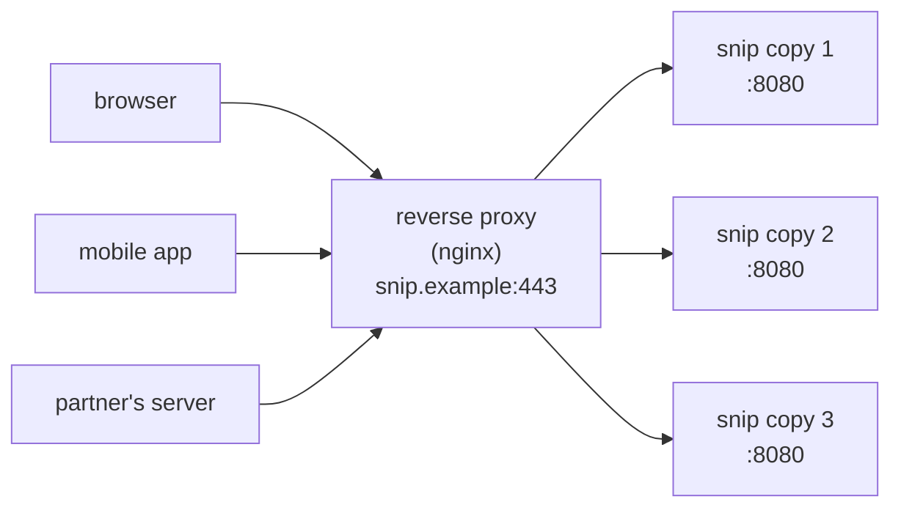

# 8.3 Reverse proxies, load balancers & nginx

Type almost any big website's address and your request doesn't reach the application first. It reaches a **reverse proxy**: a single front door that decides which of many copies of the application should handle it, handles the encryption, protects the application from slow and malicious clients, and quietly routes around copies that have crashed. You've seen its fingerprints already — the `502 Bad Gateway` pages, the `X-Forwarded-For` header, the "front door" box in snip's architecture (chapter 0.3). This chapter opens that box, using snip's real nginx configuration, which runs two copies of snip behind one address.

## What you'll learn

- **Forward** vs **reverse** proxies, and the jobs a reverse proxy does.
- **Load balancing** algorithms, **health checks**, and what happens when a backend dies — tested live.
- **TLS termination**, **keep-alive** connections to backends, **buffering**, and **timeouts**.
- The **`X-Forwarded-For` trust problem**: how an app learns the real client IP, and how attackers fake it.
- **L4 vs L7** load balancers, cloud load balancers, and what **502** and **504** actually tell you.

---

## Forward and reverse proxies

A **proxy** is a program that sits between a client and a server and passes requests along.

- A **forward proxy** acts for **clients**: a company's web filter, or a proxy your browser is configured to use. The *server* doesn't know who the real client is.
- A **reverse proxy** acts for **servers**: it sits in front of your backends, and clients think *it* is the website. The *client* doesn't know which backend really answered.



:::note[Everyday anchor]
A reverse proxy is a hotel reception desk. Guests only ever deal with reception: they don't know which member of staff will handle their request, or where in the building that person is. Reception checks who's on shift, sends each request to someone available, skips anyone who's gone home sick, and keeps the corridors behind the desk private.
:::

### The jobs a reverse proxy does

| Job | What it means | Why it matters |
|---|---|---|
| **Single entry point** | One address and port for the world | Backends can move, scale and restart invisibly |
| **Load balancing** | Spread requests across copies | Capacity, and no single copy overwhelmed |
| **Health checks & failover** | Stop sending traffic to dead copies | A crash doesn't become an outage |
| **TLS termination** | Handle HTTPS, forward plain HTTP inside | One place for certificates (chapter 7.1) |
| **Buffering** | Absorb slow clients, hand the app complete requests | Slow phones don't tie up app goroutines |
| **Security edge** | Block paths, limit rates and sizes, add headers | Protection before requests reach your code |
| **Compression and caching** | gzip responses; cache static files | Less bandwidth, less backend work |

---

## snip's nginx configuration

**nginx** (pronounced "engine-x") is one of the most widely used web servers and reverse proxies. Others you'll meet include **HAProxy**, **Envoy**, **Caddy** and **Traefik**; the ideas are the same. snip's config lives at `snip/deploy/nginx/nginx.conf`:

```nginx
# nginx as snip's front door (chapter 8.3): one public port, requests spread
# across every api copy. Docker's DNS returns all copies for the name "api".
upstream snip_api {
    server api:8080;
    keepalive 32;               # reuse connections to the backends
}

server {
    listen 80;

    location / {
        proxy_pass http://snip_api;
        proxy_http_version 1.1;
        proxy_set_header Connection "";
        proxy_set_header Host $host;
        proxy_set_header X-Real-IP $remote_addr;
        proxy_set_header X-Forwarded-For $proxy_add_x_forwarded_for;
        proxy_set_header X-Forwarded-Proto $scheme;
        proxy_connect_timeout 2s;
        proxy_read_timeout 15s;
    }

    location = /metrics {       # metrics are for Prometheus inside the network, not the internet
        deny all;
    }
}
```

Piece by piece:

- **`upstream snip_api`** names a group of backends. With Docker Compose running two `api` replicas (chapter 9.3), the name `api` resolves to both. You can also list servers explicitly: `server 10.0.1.5:8080; server 10.0.1.6:8080;`.
- **`listen 80`** — nginx is what claims the public port (chapter 1.4); snip itself isn't exposed.
- **`proxy_pass http://snip_api`** — forward every request to the group.
- **`location = /metrics { deny all; }`** — snip's metrics are for internal monitoring (chapter 13.2), so the front door refuses them with `403` before they ever reach snip.

### Keep-alive to the backends

```nginx
keepalive 32;
proxy_http_version 1.1;
proxy_set_header Connection "";
```

Opening a TCP connection costs a round trip (chapter 1.4). Without these three lines, nginx would open a **new** connection to snip for every request and close it afterwards. With them, it keeps up to 32 idle connections per worker open and reuses them — much faster and lighter under load. (HTTP/1.1 is needed for keep-alive; clearing the `Connection` header stops nginx forwarding the client's "close".)

### Timeouts

```nginx
proxy_connect_timeout 2s;   # give up connecting to a backend after 2 s
proxy_read_timeout 15s;     # give up waiting for a response after 15 s
```

Chapter 8.1's first rule, applied at the edge. Note `proxy_read_timeout` (15 s) is at least as long as snip's own `WriteTimeout` (15 s, chapter 5.4): the proxy should wait long enough for the app to answer — even with an error — and not a lot longer.

---

## Load balancing, health checks and failover

### Algorithms

| Algorithm | How it picks a backend | Good for |
|---|---|---|
| **Round robin** (nginx's default) | Each in turn: 1, 2, 3, 1, 2, 3… | Similar backends, similar requests |
| **Least connections** | The backend with the fewest active requests | Requests of very different durations |
| **Weighted** | Round robin, but some backends get more | Backends of different sizes |
| **IP / key hash** | Same client (or key) → same backend | Per-backend caches; "sticky" behaviour |

snip's backends are **stateless** (chapter 1.5): any copy can answer any request, because all state lives in Postgres and Redis. So plain round robin is perfect. Stateful backends — sessions stored in one copy's memory — need **sticky sessions** (always send a user to the same copy), which make scaling and failover harder. Keeping services stateless avoids the problem entirely.

### When a backend dies

Testing snip's config with two local copies of snip (the handbook's authors ran exactly this):

```text
6 requests, both copies up:  302 302 302 302 302 302   → copy 1 served 3, copy 2 served 3
copy 2 killed:               302 302 302 302           → every request still succeeds
both copies killed:          502                        → Bad Gateway
```

When nginx can't connect to a backend, it logs the error, **retries the request on the next backend** (for requests that are safe to retry — chapter 8.1), and temporarily marks the failing one as unavailable. That's **passive health checking**: noticing failures from real traffic. Many load balancers also do **active health checks** — polling an endpoint like snip's `/readyz` every few seconds and removing backends that fail — which is how cloud load balancers and Kubernetes work (chapter 10.2). This is exactly why snip separates `/healthz` and `/readyz` (chapter 5.4).

---

## What 502 and 504 mean

Two status codes are almost always produced by the proxy, not your app:

| Status | The proxy is saying… | Usual causes |
|---|---|---|
| **502 Bad Gateway** | "I couldn't get a valid response from any backend" | All backends down or restarting; backend crashed mid-response; wrong port in the config |
| **503 Service Unavailable** | "No backend is available / I'm refusing to forward" | All backends failing health checks; maintenance; rate or connection limits |
| **504 Gateway Timeout** | "A backend accepted the request but didn't answer in time" | Slow database or dependency; timeout too short; deadlock |

When users report 502s, look at the **backends** (are they running? crashing? listening on the right port and address — chapter 1.4?). For 504s, look at **what's slow** behind them (chapter 13.6).

---

## TLS termination

In production, clients connect with **HTTPS**. The proxy holds the certificate and private key (chapter 7.1), decrypts the traffic, and forwards plain HTTP to the backends over the private network. That's **TLS termination**:

```nginx
server {
    listen 443 ssl;
    http2 on;
    server_name snip.example;
    ssl_certificate     /etc/letsencrypt/live/snip.example/fullchain.pem;
    ssl_certificate_key /etc/letsencrypt/live/snip.example/privkey.pem;
    add_header Strict-Transport-Security "max-age=31536000; includeSubDomains" always;
    location / { proxy_pass http://snip_api; /* … as above … */ }
}

server {                      # send plain HTTP to HTTPS (chapter 1.5)
    listen 80;
    return 301 https://$host$request_uri;
}
```

One place manages certificates and renewal; the app code never touches TLS. (For stricter environments, traffic can be **re-encrypted** to the backends, or encrypted everywhere with a service mesh's mutual TLS.)

---

## The X-Forwarded-For trust problem

Behind a proxy, every connection snip sees comes **from the proxy's IP address**. So how does the app learn the real client's IP — for logs, geolocation, or per-IP rate limits? The proxy adds headers:

```nginx
proxy_set_header X-Real-IP $remote_addr;                           # the client, as nginx saw it
proxy_set_header X-Forwarded-For $proxy_add_x_forwarded_for;       # a list: client, then each proxy
proxy_set_header X-Forwarded-Proto $scheme;                        # was it http or https?
```

`X-Forwarded-For` is a list, appended to by each proxy in the chain: `X-Forwarded-For: 198.51.100.4, 10.0.0.2`.

Here's the trap: **a client can send its own `X-Forwarded-For` header**, full of lies. If your app blindly takes the first address in the list, anyone can pretend to be any IP — bypassing per-IP rate limits, polluting logs, faking locations. The rule: **only trust the entries added by proxies you control.** Count from the *right*, skipping your own known proxies, and take the first address that isn't one of them — or configure the proxy (nginx's `real_ip` module) to rewrite the client address from trusted proxies only.

snip sidesteps the problem for its most important limit: it rate-limits **per API key** (chapter 8.4), which the client can't forge, not per IP.

---

## L4 and L7 load balancers, and the cloud

Load balancers work at one of two levels (named after layers of the networking model):

- **Layer 4 (transport)** — forwards **TCP/UDP connections** without looking inside. Very fast, works for any protocol (databases, gRPC, anything), but can't route by URL or header. Examples: AWS **Network Load Balancer**, HAProxy in TCP mode.
- **Layer 7 (application)** — understands **HTTP**: routes by path or host (`/api/*` to one group, `admin.snip.example` to another), terminates TLS, adds headers, retries idempotent requests. Examples: nginx, Envoy, AWS **Application Load Balancer**, Google Cloud HTTP(S) Load Balancing.

In the cloud, you usually don't run the outermost load balancer yourself: the provider's managed load balancer spreads traffic across availability zones (chapter 12.2) and scales automatically. In Kubernetes, an **Ingress controller** or **Gateway** (often nginx, Envoy or Traefik underneath) plays nginx's role (chapter 10.3). Same jobs, different packaging.

:::warning[What can go wrong]
- **Proxy and app timeouts that don't fit together** — a proxy that gives up before the app can answer produces confusing 504s; one that waits far longer ties up connections.
- **Trusting `X-Forwarded-For` blindly** — anyone can spoof their IP.
- **Stateful backends** — sessions in one copy's memory break when requests move between copies; keep state in shared stores.
- **No health checks** — traffic keeps going to a dead or unready copy.
- **Exposing internal endpoints** — metrics, admin and debug pages reachable from the internet. Block them at the edge.
- **The load balancer as a single point of failure** — run it redundantly, or use a managed one.
:::

---

## Lab

Free, on your own computer with Docker. You'll run the whole stack — two snip copies behind nginx — with Compose (chapter 9.3 explains Compose properly; here you just use it).

1. **Start the stack.**
   ```bash
   cd ~/code/zero-to-prod/snip
   docker compose up -d --build        # postgres, redis, 2 × api, worker, nginx
   docker compose ps                   # note: only nginx publishes a port (8080)
   ```

2. **Watch round robin.** Create a key and a link through nginx, then follow it several times while watching both API copies' logs:
   ```bash
   KEY=$(docker compose exec -T api snip keys create lb-lab | grep -o 'snip_[A-Za-z0-9]*')
   curl -s -X POST localhost:8080/api/links -H "Authorization: Bearer $KEY" -d '{"url":"https://go.dev","slug":"lbtest"}' >/dev/null
   for i in $(seq 1 6); do curl -s -o /dev/null localhost:8080/lbtest; done
   docker compose logs api | grep '"route":"GET /{slug}"' | cut -d'|' -f1 | sort | uniq -c   # requests per copy
   ```

3. **Kill a copy; watch the proxy route around it.**
   ```bash
   docker compose ps api                               # two containers: snip-api-1 and snip-api-2
   docker kill snip-api-2
   for i in $(seq 1 4); do curl -s -o /dev/null -w "%{http_code} " localhost:8080/lbtest; done; echo   # still 302s
   docker compose up -d                                # bring it back
   ```

4. **See the edge rules.**
   ```bash
   curl -s -o /dev/null -w "%{http_code}\n" localhost:8080/metrics      # 403: blocked by nginx
   curl -si localhost:8080/healthz | head -1                           # 200 via the proxy
   ```

5. **Think through a spoofed X-Forwarded-For.** Run `curl -s localhost:8080/ -H "X-Forwarded-For: 1.2.3.4"`. nginx's `$proxy_add_x_forwarded_for` **appends** the address it actually saw, so snip receives `X-Forwarded-For: 1.2.3.4, 172.18.0.1` (your address as seen from inside Docker). Which of the two can snip trust, and why? (Answer: only the rightmost, added by the proxy snip trusts; the left one is whatever the client typed.) Shut everything down with `docker compose down`.

## Self-check

<Quiz
  id="distributed-reverse-proxies-and-nginx"
  questions={[
    {
      q: 'Users see "502 Bad Gateway". Where do you look first?',
      options: [
        'The users’ browsers',
        'The backends behind the proxy: are they running, crashing, or listening on the configured port and address?',
        'The DNS records',
        'The database indexes',
      ],
      answer: 1,
      explain: '502 is the proxy saying it could not get a valid response from any backend. 504 would point at slowness instead.',
    },
    {
      q: 'Why can snip use simple round-robin load balancing without sticky sessions?',
      options: [
        'Because nginx does not support sticky sessions',
        'Because snip’s copies are stateless — all state is in Postgres and Redis — so any copy can answer any request',
        'Because snip has only one endpoint',
        'Because round robin is always best',
      ],
      answer: 1,
      explain: 'Statelessness (chapter 1.5) lets requests go to any copy, which makes scaling and failover simple.',
    },
    {
      q: 'Your app rate-limits by the first IP in X-Forwarded-For. What is the problem?',
      options: [
        'Nothing, it is the standard approach',
        'Clients can send their own X-Forwarded-For header, so they can pretend to be any IP and bypass the limit',
        'X-Forwarded-For only contains the proxy’s IP',
        'It makes requests slower',
      ],
      answer: 1,
      explain: 'Only entries appended by proxies you control are trustworthy. Read from the right, or have the trusted proxy set the client address.',
    },
    {
      q: 'What is TLS termination at the reverse proxy?',
      options: [
        'Turning off encryption for everyone',
        'The proxy holds the certificate, handles HTTPS with clients, and forwards traffic to backends over the private network',
        'Blocking all HTTPS traffic',
        'Encrypting the database',
      ],
      answer: 1,
      explain: 'Certificates and TLS configuration live in one place, and backends can speak plain HTTP inside a trusted network (or re-encrypt where required).',
    },
  ]}
/>

<details>
<summary>Explain passive vs active health checks, and why snip's <code>/readyz</code> matters for the second.</summary>

**Passive** health checking learns from real traffic: when requests to a backend fail (connection refused, timeouts), the proxy marks it unhealthy for a while and routes elsewhere. It's automatic but only notices after some requests have failed. **Active** health checking polls a dedicated endpoint every few seconds and removes backends that fail *before* users hit them. snip's `/readyz` is designed for exactly that: it reports whether snip can reach Postgres and Redis, and fails only when a copy truly can't serve (say, it lost its database connection), so that copy is taken out of rotation instead of returning errors to users — while `/healthz`, used for restarts, stays green (chapter 5.4).

</details>

<details>
<summary>Why does nginx use keep-alive connections to backends, and what three lines enable it?</summary>

Because opening a TCP connection costs a network round trip (and TLS, if used, costs more). At thousands of requests per second, opening and closing a connection per request wastes latency and CPU on both sides, and can exhaust ports. Reusing a pool of open connections avoids that. In snip's config: `keepalive 32;` in the `upstream` block (keep up to 32 idle connections per worker), `proxy_http_version 1.1;` (keep-alive needs HTTP/1.1), and `proxy_set_header Connection "";` (don't pass the client's "close" to the backend).

</details>
