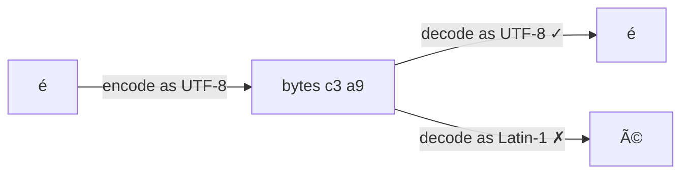

# 1.3 Bits, bytes, text & data formats

Every photo, message, song and web page you've ever seen was, at the bottom, a long row of numbers. The CPU from chapter 1.1 can only do arithmetic on numbers — so text, dates, prices and even emoji all have to be **encoded** as numbers, and decoded back. Most of the time this is invisible. Then one day a customer named *Zoë* shows up as *Zoë*, a price of 0.10 + 0.20 comes out as 0.30000000000000004, or a meeting booked for 9 a.m. lands at 2 p.m. This chapter gives you the mental model to understand — and prevent — all of those.

## What you'll learn

- What a **bit** and a **byte** are, and how to read sizes like KB, MB, GB (and why there are two kinds of "kilobyte").
- How **text** becomes numbers — ASCII, Unicode and **UTF-8** — and why broken characters like `é` appear.
- The data formats backends pass around every day: **JSON**, **CSV**, **YAML**, and **Base64**, and what each is good and bad at.
- How computers store **time** — Unix timestamps, UTC and ISO 8601 — and the time-zone mistakes that cause real bugs.
- Why you should **never store money as a decimal fraction** in most programming languages, and what to do instead.

---

## Everything is numbers, and numbers are bits

A **bit** is the smallest unit of information: a single yes/no, on/off, **1 or 0**. Inside a computer it's a tiny switch or a small electrical charge — either there or not.

One bit can't say much. But group them and the possibilities double with every bit you add:

| Bits | Possible patterns | Enough to count… |
|---|---|---|
| 1 | 2 (0, 1) | yes / no |
| 2 | 4 | the four seasons |
| 8 | 256 | every letter, digit and symbol on an English keyboard |
| 32 | about 4.3 billion | the old internet addresses (chapter 1.4) |
| 64 | about 18 billion billion | practically anything |

A group of **8 bits is a byte** — the basic unit computers use for storage and memory. One byte holds a number from 0 to 255.

:::note[Everyday anchor]
Think of a row of light switches. One switch has two states. Two switches have four combinations (off-off, off-on, on-off, on-on). Eight switches have 256 combinations — enough to give every letter on your keyboard its own pattern. A computer is billions of these switches, and everything it stores is just an agreed meaning for the patterns.
:::

### Reading sizes: KB, MB, GB (and KiB)

Sizes count bytes, with prefixes:

| Unit | Roughly | Everyday example |
|---|---|---|
| **KB** (kilobyte) | a thousand bytes | a short email |
| **MB** (megabyte) | a million bytes | a photo |
| **GB** (gigabyte) | a billion bytes | a film; your laptop's memory is 8–32 GB |
| **TB** (terabyte) | a trillion bytes | a large disk |

A small trap: because computers work in powers of two, some tools count in 1,024s instead of 1,000s. Those units are properly written **KiB, MiB, GiB** ("kibibyte" and so on). A "16 GB" memory stick is 16 × 1,024³ bytes; a "1 TB" disk is 1,000⁴ bytes, which your OS may show as "931 GiB". Nothing's missing — it's two ways of counting.

Also: network speeds are usually in **bits** per second (Mb/s, with a small *b*), while file sizes are in **bytes** (MB, capital *B*). A "100 Mb/s" connection moves about 12.5 MB per second.

### Hexadecimal: a compact way to write bytes

You'll often see bytes written in **hexadecimal** (hex, base 16): digits 0–9 then a–f. Two hex digits describe exactly one byte: `00` is 0, `ff` is 255. You've seen hex in colour codes like `#4f46e5`, and you'll see it in IDs, hashes (chapter 7.1) and memory dumps. It's just a shorter way to write the same numbers.

---

## Text is numbers with an agreed code

To store text, everyone has to agree which number means which character. That agreement is called a **character encoding**.

### ASCII: the original 128

In the 1960s, **ASCII** assigned numbers 0–127 to English letters, digits, punctuation and some control codes. `A` is 65, `a` is 97, `0` is 48, a space is 32. It fits in one byte, and it's still the foundation of everything.

But 128 slots can't hold `é`, `ß`, `中`, `ع`, or `🙂`.

### Unicode and UTF-8: every character in every language

**Unicode** is a giant catalogue that gives every character in every writing system its own number — over 150,000 of them, including emoji. `A` is still 65; `é` is 233; `中` is 20,013; `🙂` is 128,578.

Unicode says *which number*. **UTF-8** says *how to store that number as bytes*. Its clever trick: common characters take fewer bytes.

| Character | Unicode number | UTF-8 bytes (hex) | Bytes |
|---|---|---|---|
| `A` | 65 | `41` | 1 (identical to ASCII) |
| `é` | 233 | `c3 a9` | 2 |
| `中` | 20013 | `e4 b8 ad` | 3 |
| `🙂` | 128578 | `f0 9f 99 82` | 4 |

UTF-8 is used by over 98% of web pages. **Rule of thumb: use UTF-8 everywhere**, for files, databases, and web pages. Go strings are UTF-8 by design, and snip stores everything in UTF-8.

### Why you see `é` instead of `é`

That garbled text — called **mojibake** — happens when bytes written in one encoding are read as another. `é` in UTF-8 is the two bytes `c3 a9`. If some program wrongly assumes an old one-byte-per-character encoding (like Latin-1), it reads *two* characters: `c3` → `Ã` and `a9` → `©`. So `Zoë` becomes `Zoë`.



The bytes were fine. The **label** — which encoding to read them with — was wrong. The fix is never to "fix the text"; it's to make every step agree on UTF-8.

:::warning[What can go wrong]
- **Counting "characters".** `"🙂"` is one character to a human, but 4 bytes in UTF-8. Code that limits length in **bytes** can cut an emoji in half and produce garbage. Be clear whether a limit is in bytes or characters.
- **Mixed encodings in one pipeline.** A CSV exported from an old spreadsheet in a legacy encoding, imported into a UTF-8 database, is the classic source of `é`.
:::

---

## Data formats: how programs hand data to each other

Programs constantly send structured data to each other: over the network, in files, in configuration. A **data format** is an agreed way to write that structure as text or bytes. Four you'll meet constantly:

### JSON — the language of web APIs

**JSON** (JavaScript Object Notation) is how most web APIs talk, including snip's:

```json
{
  "slug": "k7Qz2a",
  "url": "https://go.dev/doc/",
  "clicks": 42,
  "tags": ["go", "docs"],
  "archived": false,
  "expires_at": null
}
```

It has exactly six kinds of value: **objects** (`{ }` with `"key": value` pairs), **arrays** (`[ ]` lists), **strings** (text in double quotes), **numbers**, **true/false**, and **null** (nothing). That's it. Its strengths: human-readable, supported by every language. Its weaknesses: no comments, no dates (they travel as strings), and numbers can be misread (see the money section below).

:::info[If you've written code]
JSON's `null` is not the same as a missing key. `{"expires_at": null}` says "explicitly nothing"; `{}` says "not mentioned". APIs that treat those differently (for example "null means remove the expiry, missing means don't change it") must document it.
:::

### CSV — tables as text

**CSV** (comma-separated values) is a table as plain text, one row per line:

```text
slug,url,clicks
k7Qz2a,https://go.dev/doc/,42
launch,"https://example.com/a,b",7
```

It's what spreadsheets export, and it's great for bulk data. But it has no single standard: values containing commas must be quoted (like row three), some tools use semicolons, and there are no types — `007` might silently become the number `7`.

### YAML — configuration for humans

**YAML** is used for configuration files, especially in DevOps: Docker Compose, Kubernetes and GitHub Actions all use it. It uses **indentation** instead of brackets:

```yaml
service: snip
replicas: 2
env:
  SNIP_LOG_LEVEL: info
  SNIP_RATE_LIMIT: "60"
```

It's pleasant to read and allows comments. But indentation is meaning — one wrong space breaks it — and it guesses types, sometimes wrongly. The famous **"Norway problem"**: in older YAML versions, the country code `NO` is read as the boolean *false*, so a list of countries loses Norway. Safest habit: put strings in quotes when in doubt.

### Base64 — binary as safe text

Some channels only carry text (older email, parts of a URL, a JSON string). **Base64** rewrites any bytes — an image, a key — using only 64 safe characters (A–Z, a–z, 0–9, `+`, `/`). It makes data about **33% bigger**, and it's **not encryption**: anyone can decode it instantly. You'll see it in API credentials (HTTP Basic auth), in Kubernetes Secrets (chapter 10.4), and in tokens (chapter 7.2).

| Format | Best for | Watch out for |
|---|---|---|
| JSON | APIs, data between programs | No comments or dates; big numbers can lose precision |
| CSV | Tables, bulk import/export | Commas inside values, no types, many dialects |
| YAML | Configuration humans edit | Indentation errors, surprising type guesses |
| Base64 | Binary inside text-only channels | 33% bigger; **not** secret |

---

## Time: the most bug-prone data there is

Time looks simple and is a minefield. Computers usually store it as a **Unix timestamp**: the number of seconds since midnight on 1 January 1970, **UTC**. Right now it's around 1.8 billion.

- **UTC** (Coordinated Universal Time) is the world's reference clock. It has no daylight saving time and no time zone. London in winter matches it; New York is 5 hours behind it in winter, 4 in summer.
- **ISO 8601** is the standard way to write a moment as text: `2026-09-24T19:56:18Z`. Year–month–day, then `T`, then time; the `Z` means UTC. Written with an offset instead: `2026-09-24T21:56:18+02:00` is the same instant, as seen in a place two hours ahead.

**The golden rule: store and process time in UTC; convert to local time only when showing it to a human.** snip's database stores `created_at` as `TIMESTAMPTZ` — a timestamp tied to UTC — and the API returns ISO 8601 strings ending in `Z`.

:::warning[What can go wrong]
- **Storing local time without a zone.** "2026-03-29 02:30" means nothing without a place — and in much of Europe that particular time *doesn't exist* (clocks jump from 02:00 to 03:00 that night).
- **Assuming a day has 24 hours.** Days with a daylight-saving change have 23 or 25. "Add one day" and "add 24 hours" are different operations.
- **Server clocks disagree.** Two machines' clocks can drift apart by seconds. Never rely on timestamps from different machines to decide which event happened first (chapter 8.1).
- **The year 2038 problem.** Old systems store Unix time in 32 bits, which overflows on 19 January 2038. Modern systems use 64 bits; it's still worth knowing why "32-bit timestamps" is a red flag.
:::

---

## Money: never trust a fraction

Try this in your browser's developer console (right-click a page → Inspect → Console) or any calculator app built on floating point:

```javascript
0.1 + 0.2   // → 0.30000000000000004
```

Computers usually store fractional numbers as **floating point**: binary fractions with limited precision. Just as 1/3 can't be written exactly in decimal (0.3333…), 0.1 can't be written exactly in binary. The tiny error is usually harmless in science. In money, errors add up and auditors notice.

Two safe approaches:

1. **Store the smallest unit as a whole number** — cents, not dollars. $12.34 is stored as `1234`. Whole numbers are exact.
2. **Use a decimal type** built for money: `NUMERIC` in Postgres, a decimal library in your language.

:::tip
In JSON, send money as whole cents (`"amount_cents": 1234`) or as a string (`"amount": "12.34"`), never as a floating-point number. Some JSON readers turn every number into a float, and very large whole numbers (above about 9 quadrillion) silently lose precision in JavaScript.
:::

---

## Lab

Free, on your own computer. These tools are preinstalled on macOS and Linux/WSL (`xxd` comes with the `vim` package on Linux: `sudo apt install -y xxd` if missing).

1. **See text become bytes.**
   ```bash
   printf 'A' | xxd        # one byte: 41
   printf 'é' | xxd        # two bytes: c3 a9
   printf '🙂' | xxd       # four bytes: f0 9f 99 82
   printf 'é' | wc -c      # counts BYTES → 2, even though it's one character
   ```
   Notice `wc -c` reports bytes, not characters — the exact trap from the warning box.

2. **Base64 is not secret.**
   ```bash
   printf 'password123' | base64            # cGFzc3dvcmQxMjM=
   printf 'cGFzc3dvcmQxMjM=' | base64 --decode   # password123 — instantly (macOS: base64 -D)
   ```
   Anyone who sees Base64 can read it. Keep that in mind when you meet Kubernetes Secrets.

3. **Look at time three ways.**
   ```bash
   date -u +%s                    # now as a Unix timestamp
   date -u +%Y-%m-%dT%H:%M:%SZ    # now in ISO 8601, UTC
   date                           # now in your local time zone
   ```
   Notice the first two are identical anywhere in the world; the third depends on where you are.

4. **Pretty-print JSON.** If you have `jq` installed (`brew install jq` or `sudo apt install -y jq`):
   ```bash
   echo '{"slug":"k7Qz2a","clicks":42,"tags":["go","docs"]}' | jq .        # indented and coloured
   echo '{"slug":"k7Qz2a","clicks":42}' | jq '.clicks'                       # pull out one value → 42
   ```
   `jq` is the tool engineers reach for to read API responses; you'll use it throughout the handbook.

## Self-check

<Quiz
  id="foundations-bits-bytes-text-formats"
  questions={[
    {
      q: 'A customer named "José" appears as "José" on a report. What is the most likely cause?',
      options: [
        'The database lost the accented letter and filled the gap with junk',
        'UTF-8 bytes were read as if they were a different, older encoding',
        'The customer typed their name with the wrong keyboard layout',
        'The report font has no glyph for é, so it draws two others',
      ],
      answer: 1,
      explain: 'é is two bytes in UTF-8 (c3 a9). Read as Latin-1, those two bytes become two characters, Ã and ©. The bytes are fine; the label is wrong. The fix is to make every step use UTF-8.',
    },
    {
      q: 'Which is the safest way to store a price of $19.99?',
      options: [
        'As the floating-point number 19.99, which is exact to two decimals',
        'As 1999 cents in an integer, or in a decimal type like NUMERIC',
        'As the text "19.99", so no rounding can happen along the way',
        'As a 32-bit float, which saves space and still holds two decimals',
      ],
      answer: 1,
      explain: 'Floating point cannot represent most decimal fractions exactly, and errors add up. Whole cents or a proper decimal type are exact.',
    },
    {
      q: 'A Kubernetes config stores a password as "cGFzc3dvcmQxMjM=" (Base64). Is the password protected?',
      options: [
        'Yes — Base64 scrambles it, and only the cluster holds the key',
        'Only if the encoded text is long enough to resist guessing',
        'No — Base64 is an encoding anyone can reverse instantly',
        'Yes, as long as the file is YAML and not plain JSON',
      ],
      answer: 2,
      explain: 'Base64 only rewrites bytes as safe text characters. It hides nothing. Real protection needs encryption and access control (chapters 7.1 and 7.6).',
    },
    {
      q: 'What is the golden rule for storing times in a backend?',
      options: [
        'Store each time in the user’s own time zone, as they entered it',
        'Store and process in UTC; convert to local time only for display',
        'Store only the date, since times shift with daylight saving',
        'Store times as text in the server’s zone, e.g. "2024-03-01 09:00"',
      ],
      answer: 1,
      explain: 'UTC has no daylight saving and means the same everywhere, so comparisons and arithmetic stay correct. Local time is a presentation detail for humans.',
    },
  ]}
/>

<details>
<summary>Why does <code>printf 'é' | wc -c</code> print 2, and why could that cause a bug?</summary>

Because `wc -c` counts **bytes**, and `é` takes two bytes in UTF-8. Any code that limits or slices text by bytes — "names up to 20 bytes", "take the first 100 bytes" — can cut a multi-byte character in half, producing invalid text or garbage like `�`. Decide deliberately whether a limit is in bytes or characters, and use your language's character-aware functions when it's characters.

</details>

<details>
<summary>When would you choose YAML over JSON, and what's the risk?</summary>

Choose **YAML** for configuration that humans read and edit (it allows comments and is less cluttered), which is why Kubernetes, Docker Compose and GitHub Actions use it. Choose **JSON** for data exchanged between programs, like API requests. The risk with YAML is that **indentation carries meaning** and it **guesses types** — `NO` or `off` can become `false`, `010` can become a number — so quote strings when in doubt and validate configs automatically.

</details>
