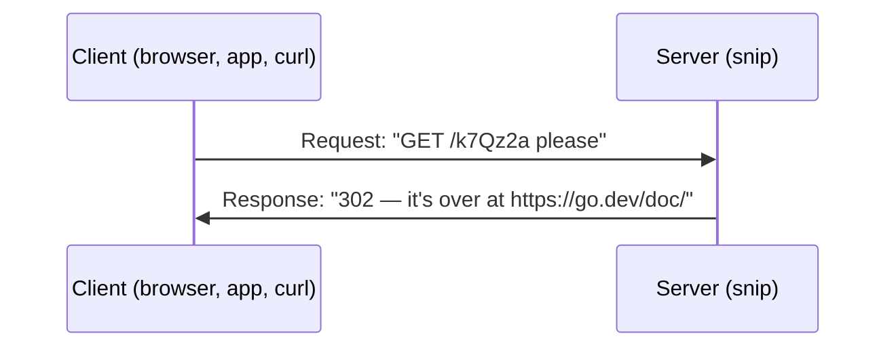
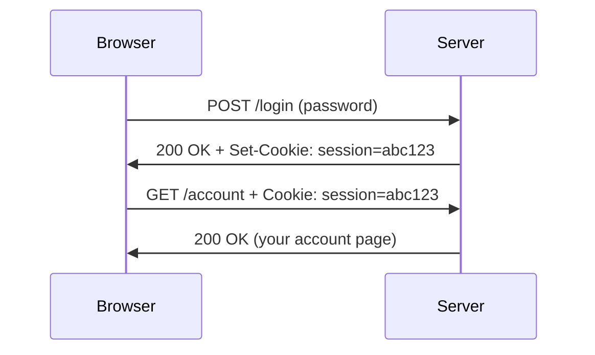

# 1.5 HTTP from zero

Every time you load a page, submit a form, or an app on your phone refreshes, your device sends a short, structured text message to a server and gets one back. That message format is **HTTP**, and it's the language almost every backend speaks — including snip. The surprising thing about HTTP is how *simple* it is: you can read it, and even type it by hand, as you'll do in this chapter's lab. Once you can read an HTTP conversation, you can debug most web problems by just looking.

## What you'll learn

- The **request–response** pattern: the client always asks, the server always answers, exactly once.
- The parts of a request — **method**, **path**, **headers**, **body** — and of a response — **status code**, headers, body.
- What the **status codes** mean (2xx, 3xx, 4xx, 5xx) and how to tell "your fault" from "our fault".
- Why HTTP is **stateless** — the server forgets you between requests — and how **cookies** and **tokens** work around it.
- What **HTTPS** adds, and how HTTP/1.1, HTTP/2 and HTTP/3 differ (briefly, and why you mostly don't have to care).

---

## Ask, answer, done

HTTP (HyperText Transfer Protocol) is a conversation with a strict rule: **the client sends a request, the server sends back exactly one response.** Then that exchange is over. The server never speaks first.



The **client** is whatever sends the request: a browser, a phone app, another server, or `curl` in your terminal. The **server** is the program listening on a port (chapter 1.4) that answers.

HTTP messages travel over a TCP connection (chapter 1.4), and — here's the nice part — they're **plain text** (in HTTP/1.1). You can read them directly.

:::note[Everyday anchor]
HTTP is ordering at a counter. You say one complete order — what you want, any special instructions, and maybe hand over a form. The person behind the counter gives you one reply — your food, or "sorry, we're out of that", or "that's at the other counter". Then the exchange is done, and the next customer steps up.
:::

---

## Anatomy of a request

Here's a real request — the one snip receives when you create a short link:

```text
POST /api/links HTTP/1.1
Host: localhost:8080
Authorization: Bearer snip_9fQ2...
Content-Type: application/json
Content-Length: 43

{"url":"https://go.dev/doc/","slug":"godoc"}
```

Line by line:

1. **The request line**: `POST /api/links HTTP/1.1`
   - **Method** — `POST`: *what kind of action*.
   - **Path** — `/api/links`: *which thing* on the server.
   - **Version** — `HTTP/1.1`.
2. **Headers**: `Name: value` lines with extra information about the request — which site (`Host`), who's asking (`Authorization`), what format the body is in (`Content-Type`), how big it is (`Content-Length`).
3. **A blank line**, meaning "headers are finished".
4. **The body** (optional): the actual data being sent — here, JSON (chapter 1.3).

### Methods: the verbs

| Method | Meaning | snip example |
|---|---|---|
| `GET` | Fetch something. Should never change anything. | `GET /api/links/godoc` — show a link |
| `POST` | Create something, or perform an action. | `POST /api/links` — create a link |
| `PUT` | Replace something entirely. | *(not used by snip)* |
| `PATCH` | Change part of something. | *(could update a link's URL)* |
| `DELETE` | Remove something. | `DELETE /api/links/godoc` |

The rule that `GET` must not change anything matters: browsers, search-engine crawlers and caches all feel free to repeat `GET` requests, preload them, or cache them. A "delete" link that uses `GET` can be triggered by a crawler just following links — and this has really happened to real sites.

### The URL, taken apart

A **URL** (Uniform Resource Locator) packs several pieces of the request into one line:

```text
https://snip.example:443/api/links?limit=20#top
└─┬──┘  └─────┬────┘└┬┘└───┬────┘└───┬────┘└┬─┘
scheme      host   port  path     query  fragment
```

- **scheme** — `https` (encrypted) or `http`.
- **host** — the domain name, looked up with DNS.
- **port** — optional; defaults to 443 for https and 80 for http.
- **path** — which resource on the server.
- **query** — extra options as `key=value` pairs after a `?`, joined with `&`.
- **fragment** — after `#`; used only by the browser to jump within a page. It's **never sent to the server**.

---

## Anatomy of a response

Here's snip's answer when you follow a short link:

```text
HTTP/1.1 302 Found
Location: https://go.dev/doc/
Cache-Control: private, max-age=0
X-Request-Id: 3f9a2c71d0b4e815
Content-Length: 0
```

1. **Status line**: the version, a **status code** (`302`) and a short reason (`Found`).
2. **Headers**: `Location` says where to go; `Cache-Control` says "don't cache this"; `X-Request-Id` is a tracking number for debugging (chapter 13.1).
3. **Body**: empty here. For a page, it would be HTML; for an API, usually JSON.

### Status codes: the first digit tells the story

| Range | Meaning | Common examples |
|---|---|---|
| **2xx** | ✅ Success | `200 OK`, `201 Created`, `204 No Content` |
| **3xx** | ↪️ Go somewhere else | `301 Moved Permanently`, `302 Found`, `304 Not Modified` |
| **4xx** | 🙋 **The client** made a mistake | `400 Bad Request`, `401 Unauthorized`, `403 Forbidden`, `404 Not Found`, `409 Conflict`, `429 Too Many Requests` |
| **5xx** | 🔥 **The server** failed | `500 Internal Server Error`, `502 Bad Gateway`, `503 Service Unavailable`, `504 Gateway Timeout` |

The most useful distinction in all of web debugging: **4xx means the request was wrong; 5xx means the server was wrong.** A 4xx won't fix itself by retrying the same request. A 5xx might, because the problem is on the other side.

A few that trip people up:

- **401 vs 403**: `401 Unauthorized` really means *unauthenticated* — "I don't know who you are" (missing or bad credentials). `403 Forbidden` means "I know who you are, and you're not allowed".
- **301 vs 302**: both redirect. `301` says "moved **permanently**" — browsers remember it and may never ask again. `302` says "for now, go there". snip uses **302** on purpose: if browsers cached a 301, later clicks would skip snip entirely and never be counted.
- **502 and 504** usually come from a **proxy** in front of your server (chapter 8.3): it couldn't get a valid answer (`502`) or any answer in time (`504`) from the program behind it.

---

## HTTP forgets you: statelessness

Each HTTP request is independent. The server doesn't inherently remember that the request you sent a second ago came from you. This is called being **stateless**.

That sounds like a limitation, but it's one of the most important design choices of the web: because no request depends on the server remembering the last one, **any copy of a server can answer any request**. That's what lets snip run several copies behind a load balancer (chapter 8.6) — the whole scaling story depends on it.

But websites clearly *do* remember you: you stay logged in. How? The client **re-sends proof with every request**:

- **Cookies** — the server's response includes `Set-Cookie: session=abc123`. The browser stores it and automatically sends `Cookie: session=abc123` on every later request to that site. The server looks up `abc123` to see who you are.
- **Tokens** — apps and APIs usually send an `Authorization: Bearer …` header on each request instead. That's how snip's API keys work.



Chapter 7.2 covers sessions and tokens properly, including how to keep them safe.

:::info[If you've written code]
`fetch()` in a browser is a thin wrapper around exactly this. Options like `method`, `headers` and `body` map one-to-one onto the request parts above, and `response.status` is the status code. `credentials: "include"` is what tells the browser to attach cookies to cross-site requests.
:::

---

## HTTPS: the same conversation, sealed

Plain HTTP travels as readable text. Anyone on the path — the café Wi-Fi, an internet provider — could read or even alter it. **HTTPS** is HTTP sent inside an encrypted tunnel called **TLS** (Transport Layer Security).

TLS gives you three guarantees:

1. **Privacy** — nobody on the path can read the messages.
2. **Integrity** — nobody can change them without it being detected.
3. **Authenticity** — you're really talking to `github.com`, not an impostor. The server proves its identity with a **certificate** vouched for by a trusted authority.

The padlock in your browser means all three are in place. Today, HTTPS is the default everywhere; certificates are free (for example from Let's Encrypt), and browsers warn about sites without it. Chapter 7.1 explains how the encryption actually works.

---

## HTTP/1.1, HTTP/2, HTTP/3 — briefly

The *meaning* of HTTP — methods, paths, headers, status codes — has stayed the same for decades. What's changed is how messages are packed onto the network:

| Version | Key idea |
|---|---|
| **HTTP/1.1** (1997) | Text messages, one request at a time per connection. Browsers open several connections to go faster. |
| **HTTP/2** (2015) | Binary framing; many requests share **one** connection at the same time. Much faster for pages with many files. |
| **HTTP/3** (2022) | Same idea as HTTP/2, but over **QUIC** on UDP (chapter 1.4), so one lost packet doesn't stall everything. |

The good news: as a backend engineer you write the same handlers regardless. Proxies and libraries handle the version. You'll mostly *read* HTTP/1.1-style text in tools like `curl -v`.

:::warning[What can go wrong]
- **Returning 200 for errors.** An API that answers `200 OK` with `{"error": "not found"}` in the body breaks every tool that trusts status codes — monitoring, retries, caches. Use the status code that matches reality (chapter 5.3).
- **Using `GET` for actions.** Anything that changes data must not be a `GET`, or crawlers, prefetchers and caches will trigger it.
- **Assuming a 5xx is "just a blip".** Retrying can help, but a server returning 5xx under load might be *overloaded* — and every retry makes it worse. Chapter 8.4 covers retrying safely.
:::

---

## Lab

Free, on your own computer; the last step talks to a public test server.

1. **Read a full conversation.**
   ```bash
   curl -v https://example.com -o /dev/null 2>&1 | grep -E '^[<>]'   # show only the request (>) and response (<) lines
   ```
   Lines starting `>` are the request `curl` sent; lines starting `<` are the response headers. Find the method, the path, the `Host` header, and the status code.

2. **Speak HTTP by hand.** Open a raw TCP connection (chapter 1.4) and *type* a request:
   ```bash
   nc example.com 80
   ```
   Then type these two lines exactly, and press <kbd>Enter</kbd> twice (the blank line ends the headers):
   ```text
   GET / HTTP/1.1
   Host: example.com
   ```
   The server answers with a status line, headers and an HTML body. You just did by hand what a browser does. (Press <kbd>Ctrl</kbd>+<kbd>C</kbd> to exit.)

3. **See status codes and redirects.**
   ```bash
   curl -s -o /dev/null -w "%{http_code}\n" https://example.com            # 200
   curl -s -o /dev/null -w "%{http_code}\n" https://example.com/nope       # 404
   curl -sI http://github.com | head -3                                    # 301 + Location header
   curl -sIL http://github.com | grep -iE '^(HTTP|location)'               # -L follows the redirect
   ```
   Notice the redirect chain: `http://` → `https://`. Almost every site redirects plain HTTP to HTTPS this way.

4. **Look in your browser.** Open any site, open DevTools (right-click → Inspect), go to the **Network** tab and reload. Click any row to see its request method, headers, status code and response. This panel is the single most useful web debugging tool you have.

## Self-check

<Quiz
  id="foundations-http-from-zero"
  questions={[
    {
      q: 'An API returns 503 Service Unavailable. Whose problem is it most likely to be?',
      options: [
        'The client — it sent a request the server couldn’t parse',
        'The server side — it is overloaded, down or not ready',
        'The user’s — their browser is too old for this API',
        'The network — a DNS record points to the wrong place',
      ],
      answer: 1,
      explain: '5xx codes mean the server failed. 503 specifically means it cannot handle the request right now, often because it is overloaded or restarting. 4xx codes are the ones that blame the request.',
    },
    {
      q: 'Why does snip redirect with 302 instead of 301?',
      options: [
        '302 responses are smaller, so each redirect loads faster',
        'Browsers remember 301s, so later clicks would skip snip and go uncounted',
        '301 is reserved for pages moving within the same site',
        '302 keeps the original URL private, while 301 reveals it',
      ],
      answer: 1,
      explain: 'A 301 tells browsers the move is permanent, so they may cache it and never ask snip again. A 302 keeps every click coming through snip, where it can be counted — and lets a link be changed or deleted later.',
    },
    {
      q: 'HTTP is stateless. How do websites keep you logged in?',
      options: [
        'The server remembers your IP address and matches each request to it',
        'The client sends proof (a cookie or token) with every request',
        'The connection stays open for as long as you’re logged in',
        'HTTPS stores your login inside the encrypted connection itself',
      ],
      answer: 1,
      explain: 'Each request carries a cookie or an Authorization token that the server checks. Because nothing depends on the server remembering the previous request, any copy of the server can answer — which is what makes scaling out possible.',
    },
    {
      q: 'You request a page with no credentials and get 401. You log in, try an admin page, and get 403. What changed?',
      options: [
        'Nothing — both mean "log in first", just from different servers',
        '401 meant "who are you?"; 403 means "I know you, and you’re not allowed"',
        '403 means your session expired between the two requests',
        '401 means the page moved; 403 means it was deleted',
      ],
      answer: 1,
      explain: '401 is about authentication (identity missing or invalid). 403 is about authorization (identity known, permission denied). Chapter 7.4 builds on exactly this distinction.',
    },
  ]}
/>

<details>
<summary>Why must a "delete" action never be a GET request? Describe how it could go wrong.</summary>

Because the web treats `GET` as **safe** — reading only. Browsers prefetch links, search-engine crawlers follow every link they find, caches and proxies may repeat `GET`s, and link-preview bots in chat apps fetch URLs you paste. If `GET /links/42/delete` deletes something, any of those can trigger it without a human ever clicking. Actions that change data belong in `POST`, `PUT`, `PATCH` or `DELETE`, which none of those tools will send on their own.

</details>

<details>
<summary>What three things does HTTPS guarantee that plain HTTP doesn't?</summary>

1. **Privacy** — people on the network path can't read the messages.
2. **Integrity** — they can't secretly change them.
3. **Authenticity** — the server proves, with a certificate, that it really is the site you asked for.

Without HTTPS, anyone on the path (public Wi-Fi, a compromised router) could read your passwords or inject content into the page.

</details>
