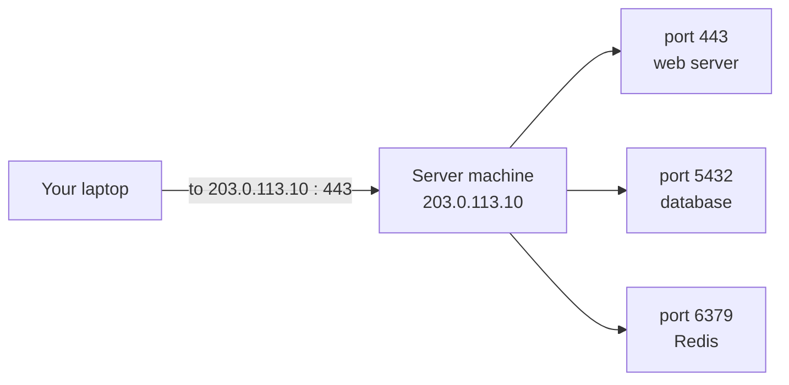
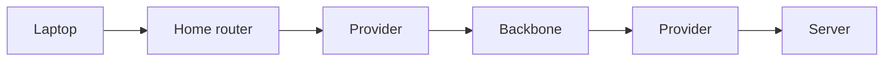
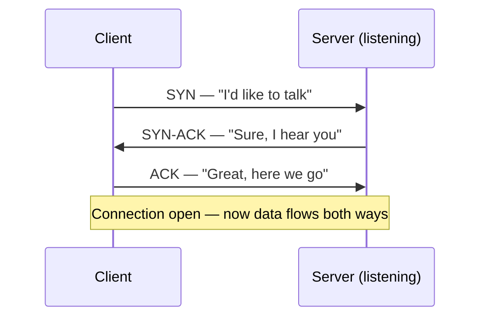
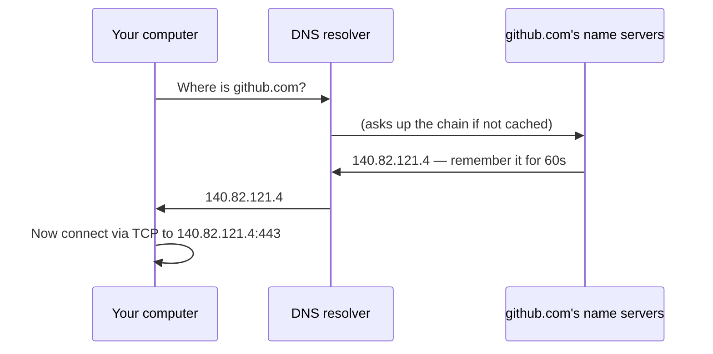
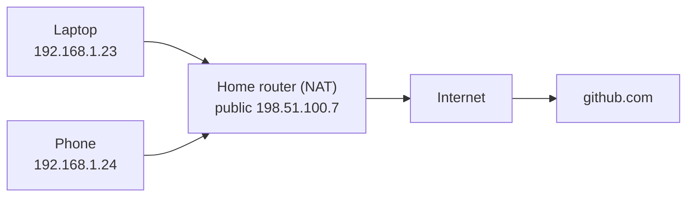
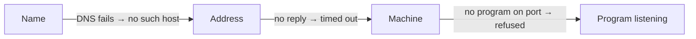

# 1.4 Networks from zero: IP, ports, TCP, DNS

You type `github.com`, press Enter, and a page appears in a fraction of a second — from a machine you'll never see, possibly on another continent. In between, your message was chopped into pieces, addressed, passed between a dozen machines, reassembled, and answered. You don't need to be a network engineer to build backends, but you do need a clear picture of this journey — because when things break, the errors are in its language: *connection refused*, *timed out*, *no such host*, *address already in use*. By the end of this chapter, each of those will tell you exactly where to look.

## What you'll learn

- **IP addresses** (which machine) and **ports** (which program on that machine) — the two halves of every network address.
- How data travels as **packets**, and what **TCP** (reliable, ordered) and **UDP** (fast, no guarantees) each promise.
- **DNS**, the internet's phone book, which turns `github.com` into an IP address.
- **localhost**, **private addresses**, and **NAT** — why your laptop's address isn't the one the world sees.
- How to read the four classic network errors, and the commands that show you what's really happening.

---

## Every message needs two addresses: the building and the apartment

To deliver a letter, you need the building's street address *and* the apartment number. Networks work the same way.

- An **IP address** identifies a machine on a network — the building. It looks like `203.0.113.10` (IPv4) or `2001:db8::10` (IPv6). IP stands for Internet Protocol.
- A **port** identifies one program on that machine — the apartment. It's a number from 1 to 65535. A web server usually listens on port 443 (HTTPS) or 80 (HTTP); snip listens on 8080; Postgres on 5432; Redis on 6379.



Together they make a full address: `203.0.113.10:443`. One machine can run many network programs at once because each one claims a different port. A program that has claimed a port and is waiting for messages is said to be **listening** on it.

:::note[Everyday anchor]
The IP address is the building's street address; the port is the apartment number. The postal service (the network) only cares about the street address. Once the letter reaches the building, the doorman (the operating system) looks at the apartment number and hands it to the right resident (program). Only one resident can live in each apartment — which is exactly why you get "address already in use".
:::

### Well-known ports

Some ports are conventions everyone follows, so clients know where to knock:

| Port | Who usually lives there |
|---|---|
| 22 | SSH — remote terminals (chapter 2.6) |
| 53 | DNS — name lookups |
| 80 | HTTP — unencrypted web |
| 443 | HTTPS — encrypted web |
| 5432 | PostgreSQL |
| 6379 | Redis |
| 8080 | Common choice for app servers during development (snip uses it) |

Ports below 1024 are "privileged": on Linux, only administrators may listen on them. That's one reason apps often listen on 8080 and let a proxy handle 80 and 443 (chapter 8.3).

---

## Messages travel as packets

Networks don't send your data as one long stream down a private wire. They chop it into small chunks called **packets** — typically up to about 1,500 bytes each — and each packet carries the destination address, like a postcard.

Packets hop from machine to machine through **routers**: devices whose whole job is to look at a packet's destination and pass it one step closer. Your home Wi-Fi box is a router; so are thousands of machines run by internet providers. A packet from your laptop to a server abroad might pass through 10–20 routers, and different packets from the same message can even take different routes.



On the way, packets can be **delayed**, **arrive out of order**, **be duplicated**, or be **lost** entirely. The network makes no promises. Reliability is added on top — by TCP.

---

## TCP and UDP: two ways to use the post

Two protocols sit on top of IP. (A **protocol** is just an agreed set of rules for a conversation.)

### TCP: the reliable phone call

**TCP** (Transmission Control Protocol) turns unreliable packets into a reliable, ordered stream. It numbers every packet, the receiver acknowledges what arrived, and anything missing is resent. Data comes out the other end complete and in order — or you get an error.

Before sending data, TCP sets up a **connection** with a three-step **handshake**:



That handshake costs one full round trip before any real data moves. Across an ocean that's ~150 ms (chapter 1.1's slowest row) — which is why reusing connections instead of opening new ones is a big deal for performance (chapter 8.3).

HTTP, SSH, database connections and almost everything in this handbook run over TCP.

### UDP: the fire-and-forget postcard

**UDP** (User Datagram Protocol) just sends packets. No handshake, no acknowledgements, no resending, no ordering. Faster and simpler, but lost packets are simply lost.

It's used where speed matters more than perfection — voice and video calls (a glitch is better than a delay), online games, and DNS lookups (small questions, and you can just ask again). The newest version of HTTP, **HTTP/3**, runs over **QUIC**, which builds its own reliability on top of UDP to avoid some of TCP's delays.

| | TCP | UDP |
|---|---|---|
| Setup | Handshake first | None |
| Delivery | Guaranteed, in order (or an error) | Best effort; may be lost or reordered |
| Speed | Slightly slower | Faster |
| Used for | Web, APIs, databases, SSH | DNS, video calls, games, QUIC/HTTP/3 |

:::note[Everyday anchor]
TCP is a phone call: you dial, the other person answers, you confirm you can hear each other, and if something's garbled you say "sorry, say that again?". UDP is shouting across a busy street: quick, but if a word gets lost in the traffic, it's gone.
:::

---

## DNS: the internet's phone book

Humans remember names; networks need numbers. **DNS** (Domain Name System) translates a **domain name** like `github.com` into an IP address.

When you visit a site, your computer asks a **DNS resolver** (usually run by your internet provider, or a public one like `1.1.1.1` or `8.8.8.8`): "what's the address for github.com?". If the resolver doesn't know, it asks up a hierarchy: the root servers, then the servers for `.com`, then GitHub's own name servers — and caches the answer for next time.



A few terms you'll see:

- A **DNS record** is one entry. An **A record** maps a name to an IPv4 address; **AAAA** to IPv6; a **CNAME** says "this name is an alias of that name".
- **TTL** (time to live) is how long others may cache the answer. Change a record with a 1-hour TTL, and some people will keep using the old address for up to an hour.

:::tip
When a site "works for me but not for you" right after a change, suspect DNS caching first. The old answer is still cached somewhere until its TTL expires.
:::

Inside Kubernetes (Part 10), every service gets its own internal DNS name — `postgres`, `redis`, `snip-api` — so programs find each other by name even as machines come and go. Same idea, private phone book.

---

## localhost, private addresses and NAT

### localhost: talking to yourself

The name **`localhost`**, and its address **`127.0.0.1`**, always mean *this very machine*. Traffic to it never leaves your computer. When you run snip on your laptop and visit `http://localhost:8080`, your browser and snip are two processes on the same machine talking through the network system.

### Private addresses

Not every IP address is reachable from the internet. Three ranges are reserved for **private networks** — homes, offices, and cloud networks:

- `10.0.0.0` – `10.255.255.255`
- `172.16.0.0` – `172.31.255.255`
- `192.168.0.0` – `192.168.255.255`

Your laptop at home probably has an address like `192.168.1.23`. Millions of other homes use exactly the same one — which works because private addresses never appear on the public internet.

### NAT: many devices, one public address

So how does your laptop reach GitHub? Your home router has **one public IP address** from your provider. It performs **NAT** (Network Address Translation): when your laptop sends a packet out, the router swaps your private address for its public one and remembers the conversation, so replies can be passed back to the right device.



This is also why a server on your laptop isn't reachable from the internet by default — nothing outside knows how to address it — and why cloud providers give servers public addresses (or put a load balancer in front) when they need to be reachable (chapter 12.2).

:::info[In the real world]
IPv4 has only about 4.3 billion addresses (32 bits — chapter 1.3), and they effectively ran out in the 2010s. NAT is one reason the internet kept working anyway. **IPv6** uses 128-bit addresses — enough for every grain of sand on Earth to have billions — and is steadily being adopted; you'll see both.
:::

---

## Reading the four classic network errors

When a connection fails, the error tells you *how far the message got*. Learn these four and you'll diagnose most problems in seconds.

| Error | What it means | Most likely causes |
|---|---|---|
| **could not resolve host** / **no such host** | DNS failed: the name didn't turn into an address. | Typo in the name; no internet; DNS misconfigured. |
| **connection refused** | The machine was reached, but **nothing is listening on that port**. The OS said "no one lives here". | Server not running; wrong port; it's listening on a different address (e.g. only `127.0.0.1`). |
| **connection timed out** | Packets went out and **nothing came back**. | Machine is down; a firewall silently drops the packets; wrong IP; network issue. |
| **address already in use** | *You* tried to listen on a port that another process already holds. | An old copy still running; another app using that port. |



"Refused" is actually good news compared to "timed out": it proves the network path works and the machine is up — you just have the wrong port, or the program isn't running. "Timed out" means something between you and the machine is swallowing your packets.

:::warning[What can go wrong]
- **Listening on the wrong address.** A server told to listen on `127.0.0.1:8080` only accepts connections from the same machine. From anywhere else — including from outside a container (Part 9) — it looks like "connection refused". To accept connections from other machines, listen on `0.0.0.0:8080` (all addresses), which is what snip's default `:8080` means.
- **Firewalls that drop instead of reject.** Many firewalls silently discard unwanted packets, so you see a slow **timeout** rather than a quick **refused** — and waste time suspecting the server.
:::

---

## Lab

Free, safe, on your own computer (and read-only against public sites).

1. **Ask DNS a question.**
   ```bash
   nslookup github.com          # works on macOS, Linux and Windows
   dig +short github.com        # shorter answer (macOS, or: sudo apt install -y dnsutils)
   ```
   Notice you get one or more IP addresses. That's the lookup every browser does before connecting.

2. **Watch a connection being made.**
   ```bash
   curl -v https://example.com -o /dev/null   # -v = show the conversation; -o /dev/null = throw the page away
   ```
   In the output, find the lines that show the resolved IP address, `Connected to example.com (…) port 443`, and the TLS (encryption) setup. You're watching DNS → TCP → HTTPS happen in order.

3. **Be both ends of a connection.** Open two terminals.
   ```bash
   # Terminal 1 — become a server listening on port 9000
   nc -l 9000          # on some Linux systems: nc -l -p 9000
   ```
   ```bash
   # Terminal 2 — connect to it and type a message, then press Enter
   nc localhost 9000
   ```
   What you type in one appears in the other: that's a raw TCP connection. Press <kbd>Ctrl</kbd>+<kbd>C</kbd> to close. Now run the Terminal 2 command again **without** the server running: you'll get **connection refused**. Nothing lives at that apartment.

4. **Find who's listening.**
   ```bash
   lsof -i -P | grep LISTEN      # every program listening on a port (macOS/Linux)
   ```
   Notice the port numbers. Later, when snip runs, you'll see it appear here on `:8080`.

## Self-check

<Quiz
  id="foundations-networks-from-zero"
  questions={[
    {
      q: 'curl says "connection refused" when you try localhost:8080. What does that tell you?',
      options: [
        'DNS is broken',
        'The machine was reached, but nothing is listening on port 8080',
        'A firewall is silently dropping packets',
        'The internet is down',
      ],
      answer: 1,
      explain: 'Refused means the OS answered "no one is listening here". The path works; the program is not running, or is on another port or address. A silent firewall would cause a timeout instead.',
    },
    {
      q: 'Why can a single server machine run a web server, a database and Redis at the same time?',
      options: [
        'Each has its own IP address on the internet',
        'Each program listens on a different port',
        'They take turns using the network',
        'They use different DNS names',
      ],
      answer: 1,
      explain: 'The IP address gets packets to the machine; the port number tells the operating system which program they are for. Different programs, different ports.',
    },
    {
      q: 'Which protocol would a video-calling app most likely use for the audio itself, and why?',
      options: [
        'TCP, because every sound must arrive in order',
        'UDP, because a brief glitch is better than waiting for lost packets to be resent',
        'DNS, because it is fast',
        'NAT, because it is private',
      ],
      answer: 1,
      explain: 'For live audio, old data is useless by the time it could be resent. UDP delivers what it can immediately; TCP would stall the call waiting for retransmissions.',
    },
    {
      q: 'You changed your site’s DNS record to a new server. Some users still reach the old one an hour later. Why?',
      options: [
        'DNS changes never work',
        'Resolvers cached the old answer until its TTL expires',
        'Their computers are too slow',
        'The new server rejected them',
      ],
      answer: 1,
      explain: 'Every DNS answer carries a TTL saying how long it may be cached. Until it expires, resolvers keep giving out the old address. Lower the TTL ahead of planned changes.',
    },
  ]}
/>

<details>
<summary>Explain the difference between "connection refused" and "connection timed out" using the building analogy.</summary>

**Refused**: the letter reached the building, and the doorman said "nobody lives in that apartment" — a quick, clear answer. The building exists and is reachable; the program just isn't there (not running, or wrong port).

**Timed out**: you sent the letter and heard nothing back at all. Maybe the building doesn't exist at that address, or a security guard (firewall) is silently throwing letters away. Something on the path is swallowing your message, so you have to look at the network, not just the program.

</details>

<details>
<summary>Your laptop's IP is 192.168.1.23. Can a friend across town connect to a server running on your laptop at that address? Why or why not?</summary>

No. `192.168.x.x` is a **private** address: it only means something inside your home network, and thousands of other homes use the same one. From the internet, your whole home appears as your router's single public address, and the router (doing NAT) doesn't know to forward unexpected incoming connections to your laptop. To make a server reachable from outside, you'd use a machine with a public address — like a cloud server behind a load balancer (Part 12) — or deliberately configure port forwarding (usually a bad idea for security).

</details>
