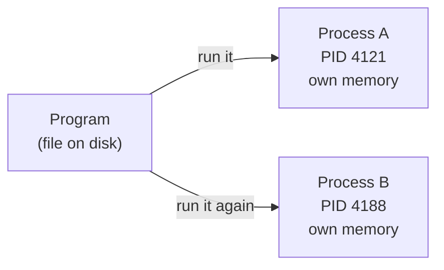
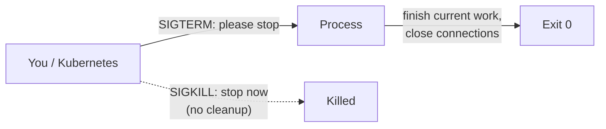
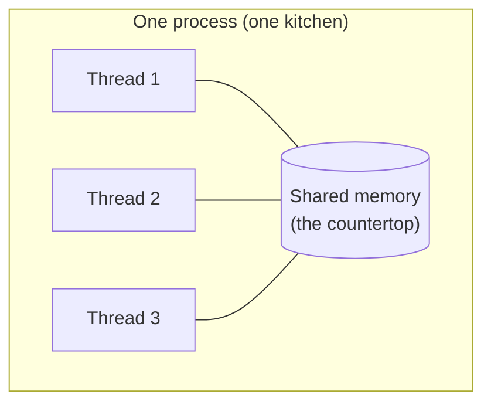
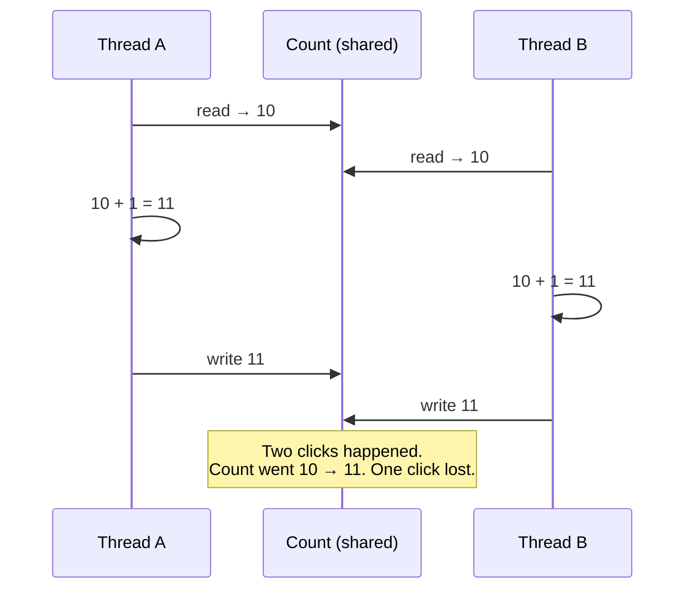

# 1.2 Programs, processes & threads

When you double-click an app, something changes: a file that was just sitting on your disk comes alive, takes up memory, and starts doing things. Open the same app twice and you get two independent copies. Close one and the other keeps going. What exactly came alive? This chapter names it — a **process** — and shows what's inside one, including the **threads** that let a server handle thousands of visitors at the same moment. It also introduces the first genuinely tricky bug you'll meet as an engineer: what happens when two workers touch the same thing at once.

## What you'll learn

- The difference between a **program** (a recipe, sitting on disk) and a **process** (a cook actually following it, with their own counter space).
- What every process has: an ID number, private memory, and an **exit code** that says how it ended.
- How to **list, inspect and stop** processes from the terminal.
- What a **thread** is — several workers inside one process sharing the same memory — and how one machine seems to do many things at once.
- The **race condition**: why two workers updating the same number can lose updates, and why it matters for snip's click counts.

---

## A program is a recipe; a process is someone cooking it

A **program** is a file: a list of instructions stored on disk. It doesn't *do* anything by itself, just as a recipe book on a shelf doesn't make dinner.

When you run it, the operating system creates a **process**: a running instance of that program. The OS gives the process:

- a unique number, its **PID** (process ID), like a ticket number;
- its own private chunk of **memory**, which no other process can read or write;
- a slot in the CPU's schedule, so it gets turns to run;
- a connection to the outside world: files, the network, the terminal.



Run the same program twice and you get **two processes**: same recipe, two cooks, two separate countertops. They don't share anything unless they deliberately arrange to (through a file, the network, or a database).

:::note[Everyday anchor]
A program is a recipe card. A process is a cook actively making that recipe, at their own station, with their own ingredients. Two cooks can make the same recipe at the same time — and if one burns their dish, the other's is fine.
:::

This isolation is a big deal. It's why one crashing browser tab doesn't take down your whole computer, and why, in a server, one misbehaving program can't corrupt another's memory.

:::info[If you've written code]
Every `node app.js`, `python script.py` or `go run .` creates a process. Environment variables, the current directory and command-line arguments are all per-process settings the OS hands over at start. When your script "finishes", its process exits and the OS reclaims its memory.
:::

---

## Every process ends with an exit code

When a process finishes, it hands back a small number to whoever started it: its **exit code** (or exit status).

- **0** means "I succeeded."
- **Anything else** (1, 2, 127…) means "something went wrong." Different numbers can mean different problems.

This tiny number is how programs report success to each other. Scripts, automated build systems and Kubernetes all decide what to do next based on it.

```bash
ls /                 # list the root folder — this works
echo $?              # $? holds the exit code of the last command → 0
ls /no-such-folder   # this fails
echo $?              # → a non-zero number (1 or 2, depending on your system)
```

:::warning[What can go wrong]
**Exit code 0 means "this program didn't report an error" — not "what you wanted actually happened".** A command can succeed while doing the wrong thing: a web request that returns an error *page* successfully, a build that quietly used old files. Good engineers check the **result**, not just the exit code. You'll hear this again in Part 11.
:::

---

## Seeing and stopping processes

The OS keeps a list of every process. You can look at it:

```bash
ps aux | head -5        # every process: owner, PID, CPU %, memory %, command
ps aux | grep -i term   # just the lines mentioning "term" (your terminal app)
echo $$                 # the PID of the shell you're typing into right now
```

The columns that matter most in `ps aux`:

| Column | Meaning |
|---|---|
| `USER` | Who owns the process (permissions come from this — chapter 2.2) |
| `PID` | The process ID |
| `%CPU` / `%MEM` | How much CPU and memory it's using |
| `COMMAND` | What program is running, with its arguments |

To stop a process, you send it a **signal** — a small message from the OS:

- **`Ctrl-C`** in a terminal sends **SIGINT** ("interrupt, please stop") to whatever is running in the foreground.
- **`kill 4121`** sends **SIGTERM** ("terminate, please") to process 4121. A well-behaved program cleans up and exits.
- **`kill -9 4121`** sends **SIGKILL**: the OS stops the process immediately. The program gets no chance to clean up — no finishing its writes, no saving state.



:::tip
Always try a plain `kill` (SIGTERM) first and give the program a few seconds. Reach for `kill -9` only if it's truly stuck. snip is written to handle SIGTERM gracefully: it stops accepting new requests, finishes the ones in progress, then exits (chapter 5.4). Kubernetes relies on exactly that.
:::

---

## Threads: several workers sharing one kitchen

A process can do one thing at a time — or it can have several **threads**. A thread is a worker *inside* a process. All the threads in a process **share the same memory**, but each follows its own path through the instructions.



Why bother? Because a server spends most of its time **waiting** (remember chapter 1.1: waiting on disk and network is slow). With several threads, while one is waiting for the database, another can be answering a different visitor. A server handling thousands of visitors at once is really a process with many threads (or thread-like workers), each looking after a few requests.

| | Processes | Threads |
|---|---|---|
| Memory | Private to each | **Shared** within a process |
| Cost to create | Heavier | Lighter |
| If one crashes | Others survive | Usually takes the whole process down |
| Talking to each other | Needs files, network, etc. | Just read/write the shared memory — fast, but risky |

:::note[Everyday anchor]
Processes are separate restaurants; threads are several cooks in *one* kitchen. Cooks in the same kitchen can grab each other's ingredients instantly — very efficient — but they can also bump into each other, use the same pan at the same moment, or both think they were the one who added the salt.
:::

### How one machine seems to do many things at once

Even a single CPU core can juggle hundreds of threads. The OS gives each one a tiny time slice (thousandths of a second), then switches to the next — a **context switch**. It happens so fast that everything seems simultaneous.

Two words people mix up:

- **Concurrency** — *dealing* with many things at once, by switching between them. One cook juggling five orders.
- **Parallelism** — *doing* many things at literally the same instant, on different cores. Five cooks each making one order.

A server needs concurrency (thousands of visitors in progress) and benefits from parallelism (several cores working at once). Go, the language you'll use for snip, makes concurrency unusually easy with lightweight workers called **goroutines** (chapter 4.5).

---

## The race condition: when two workers share one number

Here's the first genuinely tricky bug in this handbook, and it's worth understanding slowly because it appears everywhere — in threads, in databases, across whole servers.

Imagine snip counting clicks. The count is stored in shared memory. Adding one click takes three tiny steps:

1. **Read** the current count.
2. **Add** one to it.
3. **Write** the new count back.

Now two threads handle two clicks at the same moment:



Both threads read 10 before either wrote. Both wrote 11. **Two clicks, one counted.** Nobody made a mistake in their own steps; the bug is in the *timing* between them. That's a **race condition**: the result depends on the exact order in which workers happen to run — so it fails rarely, randomly, and usually only under heavy traffic.

How engineers prevent it (you'll use all of these):

- **Locks** (also called mutexes): only one worker may do the read–add–write at a time; others wait their turn. snip's in-memory store uses one (chapter 4.5).
- **Atomic operations**: the machine or database does read–add–write as one indivisible step. snip's Postgres store does `UPDATE links SET clicks = clicks + 1` — a single step the database guarantees can't be interleaved (chapter 6.5).
- **Don't share**: give each piece of data a single owner, and send it messages instead. snip's click worker does this with a queue (chapter 8.2).

:::warning[What can go wrong]
- **"It works on my machine."** Race conditions hide during testing, when there's one user (you), and appear in production under load. Go has a built-in **race detector** (`go test -race`) that catches many of them; snip's tests run with it.
- **Assuming a crash in one thread is contained.** Unlike separate processes, threads share everything. One thread corrupting shared memory, or crashing, usually takes the whole process down with it.
:::

---

## Why this matters for the systems you'll build

- A **server** is a long-running process (chapter 1.6) that uses many concurrent workers to serve many visitors at once.
- **Isolation between processes** is why modern systems run each service as a separate process — and, in Part 9, inside a separate **container**.
- **Signals and exit codes** are how the tools that run your software (Docker, Kubernetes, CI systems) start, stop and judge it.
- **Race conditions** are why databases have transactions (chapter 6.5) and why "just add a counter" is never quite as simple as it sounds.

:::info[In the real world]
Real race conditions have caused serious incidents: the **Therac-25** radiation therapy machine in the 1980s delivered massive overdoses partly because of a race condition in its software — a sobering, well-documented case often taught in engineering courses. Most races are less dramatic — lost counts, double charges, duplicate emails — but they're some of the hardest bugs to reproduce and among the most expensive to ship.
:::

---

## Lab

Free, on your own computer. Everything here is safe.

1. **Find your own shell.**
   ```bash
   echo $$                     # your shell's PID
   ps -p $$ -o pid,ppid,comm   # look it up: its PID, its parent's PID, and its name
   ```
   Notice **PPID**, the parent process ID: the process that started this one (your terminal app). Every process has a parent — processes form a family tree.

2. **Start, find and stop a process.**
   ```bash
   sleep 300 &            # start a process that just waits 5 minutes; "&" runs it in the background
   ps aux | grep "sleep 300" | grep -v grep   # find it (and hide the grep line itself)
   kill %1                # stop the most recent background job politely (SIGTERM)
   jobs                   # it's gone (you may see "Terminated")
   ```
   Notice that `&` gave you your prompt back straight away: the shell didn't wait. That's handy — and a classic trap if a later step depends on the backgrounded one finishing.

3. **See exit codes.**
   ```bash
   true; echo $?     # a program whose only job is to succeed → 0
   false; echo $?    # a program whose only job is to fail → 1
   ```
   Every automated system you'll use later — CI pipelines, Docker health checks, Kubernetes — makes decisions from exactly this number.

## Self-check

<Quiz
  id="foundations-programs-processes-threads"
  questions={[
    {
      q: 'You run the same program twice. What do you get?',
      options: [
        'One process with two names',
        'Two separate processes, each with its own PID and private memory',
        'Two threads that share memory',
        'An error — a program can only run once',
      ],
      answer: 1,
      explain: 'Each run creates a new process: its own PID and its own private memory. They share nothing unless they arrange it through files, the network or a database.',
    },
    {
      q: 'What is the main difference between threads and processes?',
      options: [
        'Threads are slower than processes',
        'Threads inside one process share the same memory; processes each have private memory',
        'Processes can only run on one core',
        'Threads cannot run at the same time',
      ],
      answer: 1,
      explain: 'Shared memory makes threads cheap and fast to coordinate, but it also makes them able to interfere with each other — the source of race conditions.',
    },
    {
      q: 'Two threads each add 1 to a shared counter at the same moment, using read–add–write. The counter was 10. What can the result be?',
      options: [
        'Always 12',
        'Always 11',
        'Either 11 or 12, depending on timing',
        'Always 10',
      ],
      answer: 2,
      explain: 'If one finishes before the other reads, you get 12. If both read 10 before either writes, both write 11 and one update is lost. That timing dependence is a race condition — and why it fails randomly.',
    },
    {
      q: 'Kubernetes wants to stop your server. Why does it send SIGTERM before SIGKILL?',
      options: [
        'SIGTERM is faster',
        'SIGTERM lets the program finish in-flight work and clean up; SIGKILL stops it instantly with no cleanup',
        'SIGKILL only works on Windows',
        'There is no difference',
      ],
      answer: 1,
      explain: 'SIGTERM is a polite request, so a well-written server stops taking new requests, finishes current ones and exits cleanly. SIGKILL gives no chance to clean up, so it is the last resort.',
    },
  ]}
/>

<details>
<summary>A command exits with code 0, but the file it was supposed to create is empty. How is that possible, and what's the lesson?</summary>

Exit code 0 only means the program **didn't report an error**. It might have run against the wrong input, written nothing because a condition wasn't met, or "succeeded" at something other than what you intended. The lesson: **verify the result, not the exit code**. Check the file's contents, the page's actual response, the image's timestamp — whatever proves the thing you wanted is really true.

</details>

<details>
<summary>Name three ways to stop a race condition on a shared counter, in plain words.</summary>

1. **Take turns** — a lock lets only one worker do read–add–write at a time.
2. **Make it one step** — an atomic operation (like a single database `UPDATE … SET clicks = clicks + 1`) that can't be interrupted halfway.
3. **Don't share** — give the counter a single owner and send it messages (for example through a queue) instead of letting everyone write to it.

</details>
