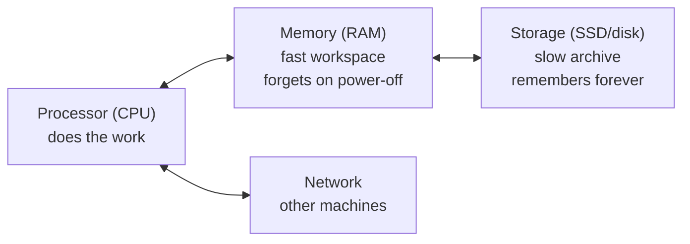
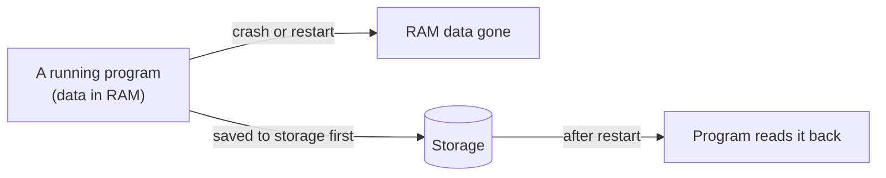

# 1.1 What a computer actually does

You've used computers for years, and they probably feel like magic boxes: you click, things happen. But every server that runs a website — including the one you'll build — is the same kind of machine as your laptop, doing the same four simple things, extremely fast. Once you see those four things clearly, a surprising amount of backend engineering stops being mysterious. Why is a database slower than a cache? Why does a server "run out of memory"? Why does everyone obsess over "latency"? It all comes back to this chapter.

## What you'll learn

- The four parts that matter: the **processor** (does the work), **memory** (the fast, forgetful workspace), **storage** (the slow, permanent archive), and the **network** (talking to other machines).
- What the **operating system** is: the manager that shares those parts between every program you run.
- The single most important fact in this handbook: **each of those parts is wildly faster or slower than the others** — by factors of thousands or millions.
- How to **see** your own computer's processor, memory and disk from the terminal.
- What it looks like when a machine runs out of each resource — and why good systems are designed around the speed differences.

---

## A computer is a very fast, very literal cook

Picture a cook in a kitchen following a recipe. The cook can only do tiny, precise steps: *take this, add that, compare these two, if the result is bigger go to step 12*. They can't improvise, can't guess what you meant, and never get bored. But they can do **billions** of those tiny steps every second.

That cook is the **processor**, also called the **CPU** (Central Processing Unit). A **program** is the recipe: a long list of tiny instructions. Everything a computer does — showing this page, playing a video, redirecting a short link — is the CPU following a recipe, one tiny step at a time, astonishingly fast.

The cook needs somewhere to work and somewhere to keep things. So a computer has four main parts:



- **Processor (CPU)** — follows instructions. Modern CPUs have several **cores**: several cooks working in the same kitchen at once.
- **Memory (RAM)** — Random Access Memory: the countertop. Everything the CPU is actively working on must be here. It's fast, but small, and **everything in it disappears when the power goes off**.
- **Storage (SSD or hard disk)** — the pantry and filing cabinet. Much bigger and **permanent** — it survives restarts — but much slower to reach.
- **Network** — the phone line to other kitchens. Reaching another machine is slower still.

:::note[Everyday anchor]
The **CPU** is the cook. **RAM** is the countertop: everything in active use is within arm's reach, but the counter is cleared every night. **Storage** is the pantry down the hall: it keeps everything, but every trip takes time. The **network** is ordering from a shop across town.
:::

---

## Speed is everything, and the gaps are enormous

Here's the fact that shapes almost every design decision you'll ever make as a backend engineer: **these parts are not a little faster or slower than each other. They differ by thousands and millions of times.**

Computers measure time in tiny units. A **nanosecond** (ns) is a billionth of a second. A **microsecond** (µs) is a millionth. A **millisecond** (ms) is a thousandth. Those are hard to feel, so let's stretch time: pretend one step of the CPU takes **one second**. Then, roughly:

| Action | Real time (approx.) | If one CPU step took 1 second… |
|---|---|---|
| CPU does one simple step | ~0.3 ns | 1 second |
| Read something from RAM | ~100 ns | ~5 minutes |
| Read a small piece from a fast SSD | ~20–100 µs | ~1–4 days |
| Send a message to another machine in the same data centre and back | ~0.5 ms | ~2 weeks |
| Read from an old spinning hard disk | ~5–10 ms | ~6 months |
| Send a message across the world and back | ~150 ms | ~15 years |

These are ballpark figures — exact numbers vary with hardware — but the **shape** never changes: CPU ≪ memory ≪ storage ≪ network. Engineers call the time to reach something its **latency** (how long you wait for it).

:::info[In the real world]
Engineers have circulated a table like this — often called **"Latency Numbers Every Programmer Should Know"** — since Google's Jeff Dean and Peter Norvig popularised it in the 2000s. Hardware has got faster since, but the ratios between the rows have stayed remarkably stable. That stability is why the lessons in this chapter don't go out of date.
:::

Now you can see why so many ideas in this handbook exist:

- A **cache** (Part 6) keeps a copy of something in fast memory so you don't have to fetch it from slow storage or across the network. snip keeps recently used links in memory for exactly this reason.
- A **database index** (chapter 6.4) exists to avoid reading lots of slow storage.
- Backend engineers obsess about how many times a request **crosses the network**, because each crossing is "weeks" in CPU time.

:::tip
When something is slow, ask: *where is it waiting?* It's almost never the CPU doing arithmetic. It's usually waiting on storage or the network. That one question will solve more performance mysteries than any tool.
:::

---

## Memory forgets; storage remembers

The second big fact: **RAM is volatile** — it forgets everything when the power goes off or the program stops. **Storage is persistent** — it keeps things.

That's why you lose unsaved work when an app crashes: your document was only in memory. Clicking "Save" copies it to storage.

This matters enormously for servers. A server keeps lots of things in memory because memory is fast. But anything that must **survive a restart** — your users, their links, their money — must be written to storage. Much of Part 6 is about doing that safely.



You'll feel this directly in chapter 5.1: snip v0 keeps links in memory, and every time you restart it, **every link is gone**. That's not a bug in your code — it's this fact, and it's exactly why databases exist.

---

## The operating system is the kitchen manager

Your computer runs dozens of programs at once: a browser, a music app, a terminal, background updaters. They all need the CPU, memory, storage and network. Who decides who gets what?

The **operating system** (OS) — macOS, Windows, Linux. It's the one program that's always running and that manages everything else:

- **It shares the CPU.** It gives each program tiny slices of CPU time, switching between them thousands of times a second, so fast that everything seems to run at once.
- **It hands out memory**, and keeps each program's memory **private**, so a buggy program can't scribble over another's data.
- **It manages storage**, turning raw disk blocks into the files and folders you see.
- **It manages the network**, delivering each incoming message to the right program.

Programs don't touch hardware directly. They **ask** the OS — "open this file", "give me more memory", "send this message" — and the OS does it for them. (Those requests are called **system calls**.)

:::note[Everyday anchor]
The OS is the kitchen manager. Cooks don't grab ovens or fight over counter space; they ask the manager, who schedules the ovens, assigns counter space, and makes sure one cook's mess never ends up in another's dish.
:::

Servers almost always run **Linux**, a free operating system. It's why Part 2 teaches Linux, and why Windows readers use WSL (chapter 0.2).

:::info[If you've written code]
When your program calls something like `readFile` or `fetch`, the language's runtime eventually makes system calls (`open`, `read`, `connect`, `send`…) to the OS. That's the boundary where your code stops being "just computation" and starts waiting on the slow parts of the table above.
:::

---

## Seeing your own machine

Let's look at the real parts of the computer in front of you. These commands only *read* information; they can't change anything.

<Tabs groupId="os">
<TabItem value="mac" label="macOS">

```bash
sysctl -n hw.ncpu                                   # number of CPU cores
sysctl -n hw.memsize | awk '{print $1/1073741824 " GB RAM"}'   # memory, converted to GB
df -h /                                             # storage: size, used, available
top -l 1 | head -12                                 # a snapshot of what's running right now
```

</TabItem>
<TabItem value="linux" label="Linux / WSL">

```bash
nproc                 # number of CPU cores
free -h               # memory: total, used, free ("h" = human-readable units)
df -h /               # storage: size, used, available
top -b -n 1 | head -15   # a snapshot of what's running right now
```

</TabItem>
</Tabs>

What to look at:

- **Cores** — how many cooks. A typical laptop has 8–12; big servers have 64 or more.
- **Memory** — a laptop usually has 8–32 GB. A **gigabyte** (GB) is about a billion bytes (chapter 1.3 explains bytes).
- **Storage** — usually hundreds of GB to a few TB (terabytes, about a thousand GB). Notice it's roughly 10–100× bigger than memory. Big-but-slow and small-but-fast is the pattern everywhere.
- **`top`** — the list of running programs, sorted by how much CPU or memory each is using. On a server, this is often the first thing an engineer looks at when something feels slow.

---

## What happens when you run out

Every resource can run out, and each fails in its own recognisable way. Knowing the symptoms is half of debugging.

| Resource | When it runs out… | What you'll see |
|---|---|---|
| **CPU** | Everything slows down; requests queue up waiting for a turn. | Programs at ~100% in `top`; responses get slower but still arrive. |
| **Memory** | The OS either uses storage as overflow ("swap", painfully slow) or **kills a program** to free memory. | On Linux: the **OOM killer** (out-of-memory) stops a process; in Kubernetes you'll see `OOMKilled`. |
| **Storage** | Writes fail. Databases refuse new data; logs stop; programs crash in odd ways. | Errors like `No space left on device`. |
| **Network** | Messages are delayed or dropped. | Timeouts, slow pages, "connection reset". |

:::warning[What can go wrong]
- **A slow memory leak.** A program that keeps a little more memory for every request and never lets go will run fine for hours — then be killed by the OS. It looks random; it isn't. (You'll see how to spot it with metrics in Part 13.)
- **A full disk from logs.** Programs write logs to storage continuously. Without cleanup, a disk fills up weeks later, and suddenly *everything* fails at once. It's one of the most common real outages.
- **Assuming "the server is slow" means "the CPU is slow".** Usually the CPU is mostly idle, waiting on disk or network. Check before you buy a bigger machine.
:::

---

## Why this shapes every system you'll build

Put the two big facts together — *huge speed gaps* and *memory forgets* — and you get the core tension of backend engineering:

- You want data in **memory**, because it's fast.
- You need data in **storage**, because memory forgets.
- You often need data from **another machine**, which is the slowest of all.

Nearly every design pattern in this handbook is a way of managing that tension: caches keep hot data in memory while the database keeps the truth on disk; queues let slow work happen later, off the path the user is waiting on; replicas keep copies on several machines so one failure doesn't lose data. You'll meet each of these with snip — and each time, you'll be able to explain it in terms of the kitchen.

:::info[If you've written code]
The same trade-off appears inside a single program: CPUs have their own tiny, even-faster memory caches (called L1, L2 and L3) in front of RAM. Code that touches memory in a predictable order runs dramatically faster than code that jumps around. You rarely need to think about this for backend work — the network and disk gaps dominate — but it's the same idea all the way down.
:::

---

## Lab

Free, safe, on your own computer. Nothing here changes any settings.

1. **Take an inventory.** Run the commands for your OS from [Seeing your own machine](#seeing-your-own-machine) and write down: cores, total memory, disk size and free space.
   Notice the ratio of disk to memory. That "big and slow vs small and fast" ratio will come up again and again.

2. **Watch the CPU work.** Open two terminals. In the first, run `top` (press <kbd>q</kbd> to quit later). In the second, run this deliberately pointless command, which makes one CPU core count as fast as it can for ten seconds:
   ```bash
   timeout 10 sh -c 'while :; do :; done'   # an empty loop that burns one core; stops after 10 s
   ```
   Watch `top`: a process jumps to about 100% CPU — that's one core, flat out — then disappears. (On macOS, if `timeout` isn't found, run `brew install coreutils` and use `gtimeout` instead.)
   Notice your computer stayed responsive. With several cores, the OS keeps other programs running on the other cooks.

3. **Feel the memory/storage difference.** Run:
   ```bash
   echo "remember me" > /tmp/note.txt   # write to storage (a file)
   cat /tmp/note.txt                     # read it back
   ```
   Now close the terminal, open a new one and run `cat /tmp/note.txt` again. It's still there: storage. Anything a program had only in memory (like a variable in a running program) would be gone.

## Self-check

<Quiz
  id="foundations-what-a-computer-does"
  questions={[
    {
      q: 'Your server has to read a value it uses on every request. Which place is fastest to read it from?',
      options: [
        'Another server across the network',
        'A file on the SSD',
        'Memory (RAM) inside the same program',
        'An old spinning hard disk',
      ],
      answer: 2,
      explain: 'Memory is roughly a thousand times faster than an SSD and many thousands of times faster than a network round trip. That gap is why caches keep hot data in memory.',
    },
    {
      q: 'A program crashes and restarts. What happens to the data it had only in memory?',
      options: [
        'It is automatically saved to disk',
        'It is lost — memory forgets when a program stops',
        'The operating system keeps it for next time',
        'It moves to the network',
      ],
      answer: 1,
      explain: 'RAM is volatile. Anything that must survive a restart has to be written to storage (a file or, usually, a database). This is the reason snip v0 loses its links and why Part 6 exists.',
    },
    {
      q: 'A web page on your server is slow. top shows the CPU is 5% busy. What is the most likely cause?',
      options: [
        'The CPU is too slow — 5% means it can’t keep up with requests',
        'It’s waiting on something slower, like the disk or another machine',
        'The server has too many cores, so work is spread too thin',
        'The page has too much text, so rendering it takes the CPU a while',
      ],
      answer: 1,
      explain: 'A mostly idle CPU means the work is spent waiting, not computing. Storage and network waits dominate most backend slowness, so check where the request is waiting before upgrading hardware.',
    },
    {
      q: 'On Linux, what usually happens when a machine runs completely out of memory?',
      options: [
        'The machine shuts down to protect the memory chips',
        'Programs run faster so they finish and free memory sooner',
        'The OOM killer stops a process to free memory',
        'The disk is wiped to make room, since it is used as extra memory',
      ],
      answer: 2,
      explain: 'The out-of-memory (OOM) killer picks a process and stops it. In Kubernetes you will see this as OOMKilled. It often looks like a random crash, which is why memory metrics matter.',
    },
  ]}
/>

<details>
<summary>Explain to a friend, using the kitchen, why a cache makes a website faster.</summary>

The cook (CPU) can only work with what's on the countertop (memory). If every order needs an ingredient from the pantry down the hall (storage) or from a shop across town (another server), the cook spends most of their time walking. A **cache** is keeping the most-used ingredients on the countertop, so most orders never need the trip. The pantry still holds the full, permanent stock — the cache is just a fast copy of what's popular.

</details>

<details>
<summary>Why do servers need both memory and storage, instead of just one?</summary>

Because each is good at something the other is bad at. **Memory** is fast but small and forgets everything on restart. **Storage** is big and permanent but thousands of times slower. A server keeps what it's actively working on in memory for speed, and writes anything that must survive — users, links, payments — to storage for safety. Managing the tension between the two is one of the central jobs of backend engineering.

</details>
