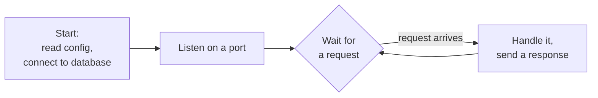
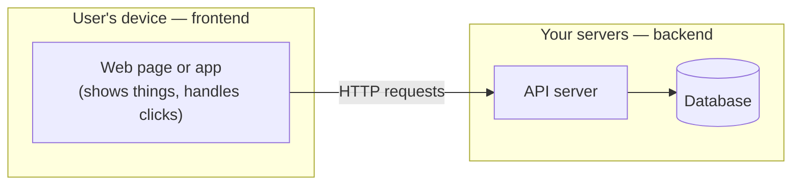
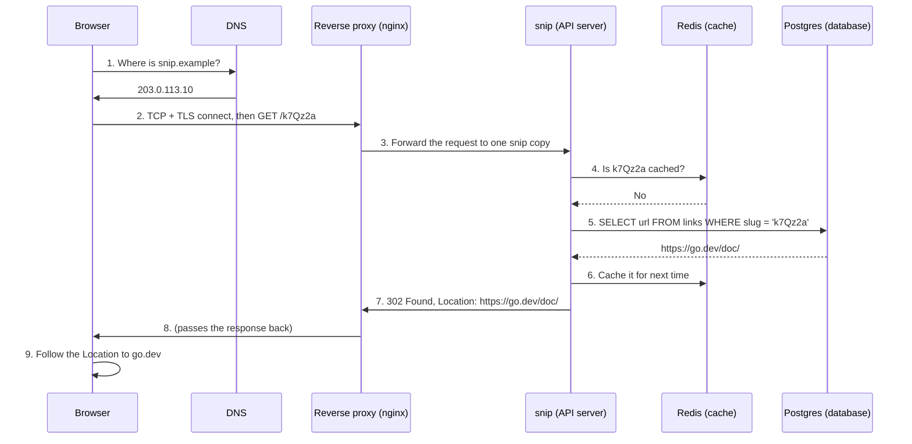

# 1.6 What a server is (and what "backend" means)

"The server is down." "It's a backend issue." You've heard these phrases, and they probably conjure an image of a humming metal box in a cold room. That box exists — but when engineers say *server*, they usually mean something simpler and more interesting: **a program that starts once, then waits forever for someone to ask it something.** This chapter ties together everything in Part 1 — processes, ports, networks and HTTP — into that one idea, then follows a real request all the way through a real system. At the end, you'll run a real server yourself and talk to it.

## What you'll learn

- What a **server** is: a long-running process that listens on a port and answers requests — and why "server" means both the program and the machine.
- What **frontend** and **backend** mean, and where the line between them sits.
- The complete **life of a request**, from a click to a database and back, with every step from Part 1 in place.
- Why real backends are **many cooperating programs** — API servers, databases, caches, queues, workers, proxies — rather than one.
- How to **run a server** and talk to it with `curl`, including a first look at snip.

---

## A server is a program that never exits

Most programs you've used have a clear end: you open a document, edit it, close it. A **server** is different. It starts, gets ready, and then **waits** — indefinitely — for requests. When one arrives, it handles it, answers, and goes back to waiting. It only stops when someone stops it.



In practice, it's a **process** (chapter 1.2) that has claimed a **port** (chapter 1.4) and speaks a **protocol** like **HTTP** (chapter 1.5). That's all a web server is. snip, at its heart, is exactly this loop.

Here's the moment it happens in snip's real code (`snip/cmd/snip/main.go`, simplified). After setup, the program hands control to Go's HTTP server, which listens and loops for as long as the process lives:

```go
srv := &http.Server{Addr: cfg.HTTPAddr, Handler: api.Handler()}
srv.ListenAndServe() // listen on :8080 and handle requests — until the process is stopped
```

One running server handles many visitors — not one per user. Thousands of people clicking snip links are all served by the same few processes, each request handled by a lightweight worker (chapter 1.2's threads, or Go's goroutines).

:::note[Everyday anchor]
A server is a shop assistant who arrives in the morning, unlocks the door, and then stands at the counter all day, serving whoever walks in, one after another. They don't go home between customers. If nobody comes in, they just wait. "The server is down" means the shop is shut — the assistant isn't there, or the door is locked.
:::

### "Server" means two things

Engineers use the word for both:

- **The program** — "the snip server", "a web server", "the database server".
- **The machine** it runs on — "we need a bigger server".

Context usually makes it clear. And increasingly, the *machine* is rented by the minute from a cloud provider and shared with others (Part 12), so the program is what you really care about.

---

## Frontend and backend

Split any app along one line: **where does the code run?**

- The **frontend** runs on the **user's device**: the web page in the browser, or the app on a phone. It draws the screen and reacts to taps and clicks.
- The **backend** runs on **servers** you control: it stores data, enforces rules, and does work the user's device can't or shouldn't be trusted with.



Why not do everything on the user's device? Because:

- **The device can't be trusted.** Anything running there can be changed by the user. The rule "you can only delete your own links" must be checked on the server, or anyone could bypass it.
- **Data must be shared.** Your short link has to work for everyone else, so it can't live only on your phone.
- **Secrets must stay secret.** Database passwords and API keys to other services can never be sent to a browser.
- **Some work is heavy or long.** Sending thousands of emails, processing payments, or running an AI model belongs on servers.

A **backend engineer** builds and runs the server side. A **DevOps or platform engineer** builds the machinery that runs, ships and watches the servers. An **AI engineer** often builds backends that call AI models. All three are in this handbook.

:::info[If you've written code]
If you've written a React or Vue app, the frontend/backend boundary is usually a `fetch()` call. Everything before the request leaves the browser is frontend; everything that happens after it arrives at your server's port is backend. The contract between them — which URLs exist and what they accept and return — is the **API** (Part 5).
:::

---

## The life of a request, end to end

Let's follow one real action through a real system: someone clicks `https://snip.example/k7Qz2a`. Every step uses something from Part 1.



1. **DNS** turns the name into an IP address (chapter 1.4).
2. The browser opens a **TCP** connection and sets up **TLS** (HTTPS), then sends an **HTTP** request (chapter 1.5).
3. A **reverse proxy** receives it — the single front door — and forwards it to one of several copies of snip (chapter 8.3).
4. snip checks its **cache**, a fast in-memory store (chapter 1.1's "countertop").
5. On a miss, it asks the **database**, the permanent store on disk.
6. It saves the answer in the cache so the next visitor is faster.
7. It answers with a **302 redirect**.
8. The proxy passes the response back over the same connection.
9. The browser follows the redirect. Meanwhile snip records the click in the background (chapter 8.2).

All of that typically takes a few thousandths of a second. By the end of the handbook you'll have built every box in that diagram.

---

## A real backend is many programs

Notice how many different programs were in that one request: a proxy, an API server, a cache, a database. Real backends are **systems of cooperating servers**, each specialised for one job:

| Kind of program | Its job | In snip |
|---|---|---|
| **Reverse proxy / load balancer** | The front door: receives all traffic, spreads it across copies, handles HTTPS | nginx / Kubernetes Ingress |
| **API server** | Your code: enforces rules, answers requests | `snip` |
| **Database** | Permanent source of truth | PostgreSQL |
| **Cache** | Fast copies of hot data | Redis |
| **Queue** | A to-do list for slow work, so users don't wait | Redis Streams |
| **Worker** | Processes the queue in the background | `snip-worker` |
| **Observability** | Collects metrics, logs and traces so you can see what's happening | Prometheus, Grafana |

Why split things up instead of one big program? Each piece can be **specialised** (a database is decades of engineering you don't want to rewrite), **scaled separately** (more API copies at peak time, one database), and **fail separately** (if the worker crashes, redirects keep working). The price is complexity: more pieces, more network hops, more ways to break. Much of this handbook is about paying that price wisely.

:::warning[What can go wrong]
- **"Works on my machine, fails on the server."** Your laptop and a server differ in operating system, settings, installed software and network. Containers (Part 9) exist largely to shrink this gap.
- **Treating the server as a pet.** If one hand-configured machine holds everything and nobody remembers how it was set up, losing it is a disaster. Modern practice treats servers like cattle, not pets: replaceable, rebuilt from code (Parts 9–12).
- **A single point of failure.** If there's exactly one copy of something and it dies, everything that depends on it dies. Spotting these is a core skill (chapter 15.1).
:::

---

## Lab

Free, on your own computer. You'll run two real servers and talk to them.

1. **Run the world's simplest web server.** Python ships with one (Python is preinstalled on macOS and most Linux; on WSL, `sudo apt install -y python3`):
   ```bash
   mkdir -p ~/code/tiny-site && cd ~/code/tiny-site
   echo "<h1>Hello from my server</h1>" > index.html   # a one-line web page
   python3 -m http.server 8000                           # serve this folder on port 8000
   ```
   Open `http://localhost:8000` in your browser. Watch the terminal: every request you make is logged there, with its method, path and status code. Press <kbd>Ctrl</kbd>+<kbd>C</kbd> to stop it — and notice the page stops working. The server was the running process, nothing more.

2. **Run snip.** Get the handbook's code and start the reference snip in its simplest mode (links kept in memory):
   ```bash
   cd ~/code
   git clone https://github.com/jawwadzafar/zero-to-prod.git
   cd zero-to-prod/snip
   go run ./cmd/snip
   ```
   Go downloads snip's dependencies the first time. When you see `snip listening`, it's in the wait-forever loop. Leave it running.

3. **Talk to it.** In a second terminal:
   ```bash
   curl -s localhost:8080/            # snip introduces itself (JSON)
   curl -s localhost:8080/healthz     # {"status":"ok"} — "I'm alive"
   curl -si localhost:8080/nope123    # 404 + a JSON error: no such link yet
   ```
   Look at the first terminal: every request produced a log line with its path, status and how many milliseconds it took. You'll create links against this server in Part 5.

4. **Break it on purpose.** Stop snip with <kbd>Ctrl</kbd>+<kbd>C</kbd> and run `curl localhost:8080/healthz` again. You get **connection refused** — chapter 1.4's "nobody lives at this apartment". Then start snip twice at once (two terminals, same command): the second fails with **address already in use**. Two classic errors, both now completely explainable.

## Self-check

<Quiz
  id="foundations-what-a-server-is"
  questions={[
    {
      q: 'Which description best matches what a web server is?',
      options: [
        'A special kind of computer that only big companies have',
        'A long-running process that listens on a port and answers requests',
        'A website’s HTML files',
        'The internet connection in a data centre',
      ],
      answer: 1,
      explain: 'A server is a program that starts once and waits for requests, answering each one. The machine it runs on is also called a server, but the essential idea is the long-running, listening process.',
    },
    {
      q: 'Why must the rule "you can only delete your own links" be enforced in the backend, not only in the frontend?',
      options: [
        'The backend is faster at checking rules, so users wait less',
        'Code on the user’s device can be changed by the user, so it can’t enforce rules',
        'Frontends cannot show error messages when a rule is broken',
        'Rules must live in the database, and only the backend can reach it',
      ],
      answer: 1,
      explain: 'Anything on the user’s device is under their control. The server is the only place you control, so every rule that matters must be checked there, even if the frontend also checks it for convenience.',
    },
    {
      q: 'In the life-of-a-request diagram, why does snip check Redis before Postgres?',
      options: [
        'Redis holds data Postgres does not have, such as the short links',
        'Redis keeps hot data in memory, so most lookups skip the database',
        'Postgres is only for backups and is never read during a redirect',
        'HTTP requires a cache in front of any database it talks to',
      ],
      answer: 1,
      explain: 'Redis is a cache: a fast in-memory copy of popular data. Postgres remains the source of truth. On a cache miss, snip reads Postgres and fills the cache for next time.',
    },
    {
      q: 'You stop snip, then curl localhost:8080 prints "connection refused". What does that confirm?',
      options: [
        'Your internet is down, so curl couldn’t leave the machine',
        'DNS failed to turn "localhost" into an address',
        'Nothing is listening on port 8080 — the server process is gone',
        'snip crashed the operating system’s networking on the way out',
      ],
      answer: 2,
      explain: 'The server is just a process listening on a port. Stop the process and the port is empty, so the operating system refuses the connection.',
    },
  ]}
/>

<details>
<summary>Why do real backends split into many programs (proxy, API, database, cache, worker) instead of one big program? What's the cost?</summary>

**Benefits:** each part can be **specialised** (a database is decades of careful engineering), **scaled independently** (add API copies at peak, keep one database), and **fail independently** (a crashed worker doesn't stop redirects).

**Costs:** more moving parts, more network hops (each one slow, per chapter 1.1), more things to deploy, monitor and secure, and new failure modes where one part is up and another is down. Good backend design is largely about choosing *where* to split — and not splitting when you don't need to.

</details>

<details>
<summary>Explain what happens between clicking a short link and landing on the destination, in five plain-English steps.</summary>

1. Your browser looks up the short link's domain name to find the server's address (**DNS**).
2. It connects securely and sends a request: "give me `/k7Qz2a`" (**TCP, TLS, HTTP**).
3. A front-door program passes the request to one copy of snip (**reverse proxy**).
4. snip looks up where `k7Qz2a` points — first in its fast cache, otherwise in the database.
5. snip replies "go over there" (**302 redirect**) and your browser follows it to the destination, while snip counts the click in the background.

</details>
