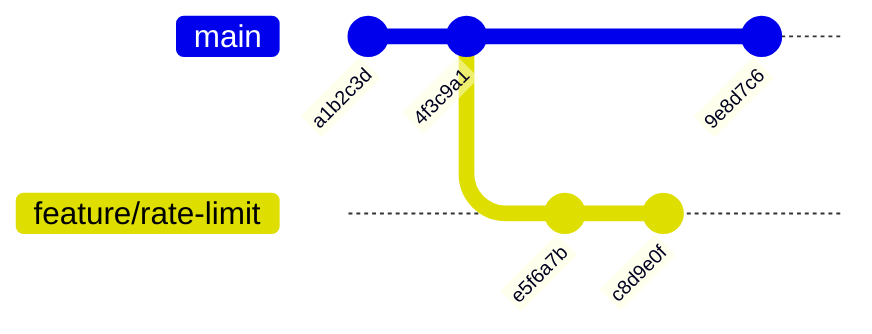
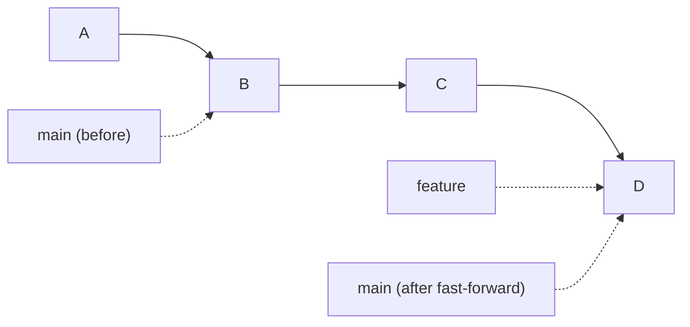
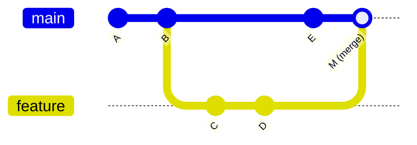
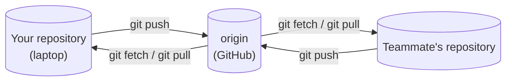

# 3.2 Branches, merges & conflicts

Real work doesn't happen in a straight line. You're halfway through a new feature when an urgent bug report arrives. A teammate is changing the same file you are. You want to try an idea without breaking the version everyone's using. **Branches** make all of that routine: separate lines of work that can later be combined. This chapter shows that a branch is a surprisingly simple thing — a label that moves — and turns the most feared moment in Git, the **merge conflict**, into a normal, five-minute task. It ends with **remotes**: how your history travels to and from GitHub.

## What you'll learn

- A **branch** is just a movable label pointing at a commit — and **HEAD** is "where you are now".
- How to create, switch between and delete branches.
- **Merging**: fast-forwards, merge commits, and what Git does automatically.
- **Merge conflicts**: why they happen, how to read the markers, and how to resolve them calmly.
- **Merge vs rebase**, and working with a **remote**: `clone`, `fetch`, `pull`, `push`.

---

## A branch is a label that moves

In chapter 3.1, history was a chain of commits. A **branch** is simply a **name pointing at one commit** — the latest commit on that line of work. When you commit on a branch, the label moves forward to the new commit automatically.



Here `main` and `feature/rate-limit` share their first two commits, then diverge. Each label points at the tip of its own line. Creating a branch is instant and costs almost nothing — Git just writes a new 41-byte label — which is why developers create them for every piece of work.

**HEAD** is Git's way of saying **"you are here"**: it points at the branch you currently have checked out. When you commit, the branch HEAD points to is the one that moves.

:::note[Everyday anchor]
Commits are pages in a notebook, each saying "continued from page X". Branches are sticky bookmarks with names on them. Writing a new page moves your current bookmark to it. Making a new branch is sticking another bookmark in — it doesn't copy any pages. HEAD is your finger, marking which bookmark you're working from.
:::

### Working with branches

```bash
git switch -c feature/rate-limit     # create a branch here and switch to it
git branch                           # list branches; * marks the current one
git switch main                      # switch back to main (your files change to match!)
git branch -d feature/rate-limit     # delete a branch that's been merged
```

(Older tutorials use `git checkout -b` and `git checkout main`; `switch` is the newer, clearer command for the same thing.)

When you switch branches, **Git changes the files in your working folder** to match that branch's latest snapshot. That's normal and safe — the other branch's work is still in its commits. Git will refuse to switch if you have uncommitted changes that would be overwritten; commit them first (or put them aside with `git stash`).

---

## Merging: bringing work back together

When the feature is done, you **merge** it into `main`: Git combines the changes from both lines of history.

```bash
git switch main
git merge feature/rate-limit
```

There are two cases.

### Fast-forward

If `main` hasn't moved since you branched, there's nothing to combine. Git simply slides the `main` label forward to the tip of the feature branch. No new commit is needed.



### Merge commit

If both branches have new commits, Git creates a **merge commit** with **two parents**, combining both snapshots:



Git combines the two sides automatically, **line by line**. If `main` changed one part of a file and `feature` changed a different part, Git takes both changes. It only needs you when both sides changed **the same lines** differently.

---

## Merge conflicts: Git asking you a question

A **merge conflict** is not an error and not a disaster. It's Git saying: *"Both branches changed this same bit, differently. I won't guess — which do you want?"*

Suppose `main` changed snip's default rate limit to 60, and your branch changed the same line to 100:

```bash
$ git merge feature/higher-limit
Auto-merging internal/config/config.go
CONFLICT (content): Merge conflict in internal/config/config.go
Automatic merge failed; fix conflicts and then commit the result.
```

Git has paused the merge and written both versions into the file, between **conflict markers**:

```text
<<<<<<< HEAD
	if c.RateLimit, err = strconv.Atoi(env("SNIP_RATE_LIMIT", "60")); err != nil {
=======
	if c.RateLimit, err = strconv.Atoi(env("SNIP_RATE_LIMIT", "100")); err != nil {
>>>>>>> feature/higher-limit
```

- Between `<<<<<<< HEAD` and `=======` is **your current branch's** version (here, `main`).
- Between `=======` and `>>>>>>> feature/higher-limit` is **the incoming branch's** version.

### Resolving it, step by step

1. **See what's conflicted:** `git status` lists files under "Unmerged paths".
2. **Open each file and decide.** Keep one side, keep the other, or write a combination that makes sense. **Delete the three marker lines.** The result should be the code as it *should* be.
3. **Check it works:** build and run the tests (`go test ./...`). A conflict resolved into broken code is still broken.
4. **Mark it resolved and finish:**
   ```bash
   git add internal/config/config.go    # "this file is resolved"
   git commit                            # completes the merge (Git pre-fills a message)
   ```

Changed your mind halfway? `git merge --abort` puts everything back exactly as it was before the merge.

:::tip[Conflicts are about communication]
Frequent, painful conflicts usually mean branches live too long or two people are working on the same thing without talking. Keep branches short-lived (days, not weeks), merge `main` into your branch regularly, and mention it when you're about to change something central. VS Code also shows conflicts with clickable "Accept Current / Accept Incoming / Accept Both" buttons, which makes resolving them much easier.
:::

---

## Remotes: sharing history

Everything so far happened in your own repository. To collaborate, repositories exchange commits with a **remote** — another copy of the repository, usually on GitHub. The conventional name for the main remote is **`origin`**.



```bash
git clone https://github.com/jawwadzafar/zero-to-prod.git   # copy a remote repository, full history included
git remote -v                        # which remotes this repository knows about
git fetch                            # download new commits from origin — changes NOTHING in your files
git pull                             # fetch, then merge origin's version of this branch into yours
git push -u origin feature/rate-limit   # upload your branch; -u remembers where it goes
git push                             # later pushes on the same branch
```

Your repository keeps **remote-tracking branches** like `origin/main` — a read-only record of where `main` was on GitHub *the last time you fetched*. `git fetch` updates those; `git pull` also merges them into your branch.

Git is **distributed**: every clone is a complete copy of the history. GitHub isn't special to Git — it's just the copy everyone agrees to share through. That's also why losing GitHub for an hour doesn't stop you working.

:::warning[What can go wrong]
- **`git push` rejected ("non-fast-forward").** Someone pushed new commits to that branch since you last pulled. Don't force it. `git pull` (merge their work into yours, resolving any conflicts), then push again.
- **Force-pushing shared branches.** `git push --force` replaces the remote branch with yours, **throwing away** commits others pushed. Never force-push `main` or a branch other people use. If you must on your own branch, use `git push --force-with-lease`, which refuses if someone else pushed in the meantime.
- **Committing directly to `main`.** On a team, `main` is usually protected: changes arrive through reviewed pull requests (chapter 3.3). Always start work with `git switch -c <branch>`.
- **Long-lived branches.** A branch that lives for a month drifts far from `main`, and merging it becomes a nightmare. Merge small pieces often.
:::

---

## Merge vs rebase

There's a second way to combine work: **rebase**. Instead of joining two lines with a merge commit, rebase **replays your commits on top of** the latest `main`, as if you'd started your branch there:

```bash
git switch feature/rate-limit
git rebase main          # re-apply this branch's commits on top of main's tip
```

| | Merge | Rebase |
|---|---|---|
| History shape | Keeps the true, branching shape; adds merge commits | A straight line, as if work happened in sequence |
| Rewrites commits? | No | **Yes** — new commits with new hashes |
| Safe on shared branches? | Yes | **No** — only on your own, unshared work |

Both are fine; teams pick a convention. The golden rule of rebasing: **never rebase commits other people already have.** Rebasing rewrites them, and everyone else's copies stop matching.

:::info[In the real world]
Many teams merge pull requests with **"squash and merge"**: all of a branch's commits are combined into one tidy commit on `main`. The branch's messy "fix typo" commits disappear, and `main` gets one commit per feature. You'll meet that in chapter 3.3.
:::

---

## Lab

Free, on your own computer. You'll create two branches that collide, and resolve the conflict.

1. **Set up a repository with a shared file.**
   ```bash
   mkdir -p ~/branch-lab && cd ~/branch-lab && git init
   printf 'rate_limit: 60\ncache_ttl: 1h\n' > config.yaml
   git add config.yaml && git commit -m "Add config"
   ```

2. **Create a branch and make a change.**
   ```bash
   git switch -c feature/higher-limit
   sed -i.bak 's/60/100/' config.yaml && rm config.yaml.bak   # change the limit (works on macOS and Linux)
   git commit -am "Raise rate limit to 100"                   # -a stages every tracked, modified file
   ```

3. **Make a conflicting change on main.**
   ```bash
   git switch main
   cat config.yaml                           # still 60 — each branch has its own snapshot
   sed -i.bak 's/60/30/' config.yaml && rm config.yaml.bak
   git commit -am "Lower rate limit to 30"
   git log --oneline --graph --all           # two diverging lines
   ```

4. **Merge and resolve.**
   ```bash
   git merge feature/higher-limit            # CONFLICT
   git status                                # config.yaml is "both modified"
   cat config.yaml                           # read the markers
   ```
   Open `config.yaml` in your editor (`code config.yaml`), decide on the final value (say, `rate_limit: 50`), delete the marker lines, and save. Then:
   ```bash
   git add config.yaml
   git commit --no-edit                      # finish the merge with the default message
   git log --oneline --graph --all           # a merge commit with two parents
   cd ~ && rm -rf ~/branch-lab
   ```
   Notice the other line, `cache_ttl: 1h`, never conflicted: only the lines both branches changed needed you.

## Self-check

<Quiz
  id="git-branches-merges-conflicts"
  questions={[
    {
      q: 'What is a Git branch, really?',
      options: [
        'A full copy of the project folder',
        'A named, movable label pointing at a commit',
        'A separate repository on GitHub',
        'A backup of the main branch',
      ],
      answer: 1,
      explain: 'A branch is just a name pointing at the latest commit of a line of work. Creating one copies nothing, which is why branches are cheap and used for every change.',
    },
    {
      q: 'When does Git report a merge conflict?',
      options: [
        'Whenever two branches changed the same file',
        'When both branches changed the same lines in different ways',
        'Whenever a merge creates a merge commit',
        'When the branches have different names',
      ],
      answer: 1,
      explain: 'Git merges changes line by line. Different parts of the same file combine automatically; only overlapping, different edits need a human decision.',
    },
    {
      q: 'git push is rejected because the remote has commits you do not have. What should you do?',
      options: [
        'git push --force',
        'git pull to merge their commits into yours, resolve any conflicts, then push',
        'Delete your branch and start over',
        'Wait a day and try again',
      ],
      answer: 1,
      explain: 'Force-pushing would erase your teammates’ commits. Integrate their work first with pull, then push the combined history.',
    },
    {
      q: 'Why should you never rebase commits that teammates have already pulled?',
      options: [
        'Rebase is slower than merge',
        'Rebase rewrites commits with new hashes, so everyone else’s history no longer matches',
        'Rebase deletes the branch',
        'Rebase only works on main',
      ],
      answer: 1,
      explain: 'Rebased commits are new commits. Teammates who have the old ones end up with duplicated, diverging history. Rebase only your own unshared work.',
    },
  ]}
/>

<details>
<summary>Describe what a conflict marker block means, and the four steps to resolve a conflict.</summary>

Between `<<<<<<< HEAD` and `=======` is **your current branch's** version; between `=======` and `>>>>>>> other-branch` is the **incoming branch's** version.

1. `git status` to see which files are conflicted.
2. Edit each file into the correct final version, deleting all marker lines.
3. Build and test — a conflict resolved into broken code is still broken.
4. `git add` the files and `git commit` to complete the merge (or `git merge --abort` to back out entirely).

</details>

<details>
<summary>What's the difference between <code>git fetch</code> and <code>git pull</code>?</summary>

`git fetch` **downloads** new commits from the remote and updates your remote-tracking branches (like `origin/main`), but **doesn't touch your branches or files**. It's always safe; it just lets you see what's changed. `git pull` is `fetch` **plus merge**: it brings those commits into your current branch, which can produce conflicts. When unsure what's coming, fetch first and look (`git log main..origin/main`), then merge.

</details>
