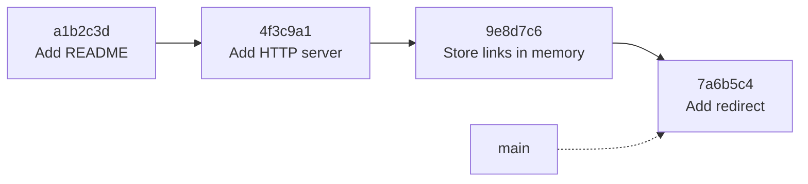
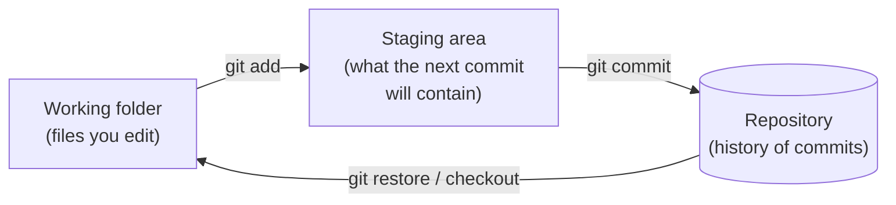

# 3.1 Git's mental model

Most people learn Git as a set of spells: `git add .`, `git commit -m "stuff"`, `git push`, and — when something goes wrong — delete the folder and clone it again. That works until it doesn't, and then Git feels hostile and mysterious. It isn't. Git is built on one simple idea: **a history of snapshots of your project**. Once you can picture that history, every command becomes an obvious operation on it, and even scary situations ("I committed the wrong thing", "I lost my changes") have calm, predictable fixes.

## What you'll learn

- What **version control** is for, and why every professional project uses it.
- Git's core idea: a **commit** is a **snapshot** of your whole project, with a note and a link to the snapshot before it.
- The **three places** your changes live: the **working folder**, the **staging area**, and the **repository** — and the commands that move changes between them.
- How to **see** history and differences: `status`, `log`, `diff`, `show`.
- How to **undo** things safely, what **`.gitignore`** is for, and how to write a commit message people thank you for.

---

## Why version control exists

Picture a folder full of files named `report.docx`, `report-final.docx`, `report-final-v2.docx`, `report-final-REALLY-final.docx`. That's version control done by hand: you want to keep history, go back to an earlier version, and see what changed. Now imagine five people editing the same files at once. It falls apart immediately.

**Version control** solves this properly. **Git** is by far the most widely used version control system. It keeps a complete history of every change to a project — who made it, when, and why — lets you jump back to any point, and lets many people work in parallel and combine their work safely (chapter 3.2).

For engineers it's not optional. Your code, your configuration, your infrastructure (Part 12), and even this handbook live in Git. Git is also what triggers automated tests and deployments (Part 11).

:::note[Everyday anchor]
Git is a photo album of your project. Every time you reach a good point, you take a photo of the *whole* project — every file exactly as it is — and write a caption on the back: what changed and why. The album is in order, each photo remembers which one came before it, and you can always pull out any old photo and look at, or restore, the project exactly as it was.
:::

---

## A commit is a snapshot

A **commit** is one photo in the album. It records:

- a **snapshot** of every tracked file in the project at that moment,
- **who** made it and **when**,
- a **message** saying what changed and why,
- a pointer to its **parent** — the commit that came before it.

Each commit gets a unique ID: a long **hash** like `4f3c9a1e7b…` (chapter 7.1 explains hashes), usually shortened to the first seven characters, `4f3c9a1`. The hash is calculated from the commit's content, so it doubles as a tamper seal: change anything in history and every hash after it changes.

Because each commit points to its parent, commits form a chain — the project's history:



(The arrows here show time moving forward; inside Git, each commit actually points *back* to its parent.) `main` is the name of the current line of history — a **branch** — and it points at the latest commit. Chapter 3.2 is all about branches.

:::info[If you've written code]
Git stores snapshots, not diffs. When you ask for a diff, Git computes it by comparing two snapshots. (Internally it's efficient: unchanged files are shared between snapshots rather than copied.) Thinking "snapshots" rather than "changes" makes commands like `checkout`, `reset` and `revert` much easier to reason about.
:::

---

## Three places your changes live

This is the part that confuses most beginners, and it's the key to everything. A change travels through three places:



1. **The working folder** — the actual files you see and edit. Git notices changes here but doesn't save them.
2. **The staging area** (also called the **index**) — a draft of your next commit. You choose exactly which changes go into it with `git add`.
3. **The repository** — the permanent history, stored in the hidden `.git` folder. `git commit` turns the staging area into a new snapshot there.

Why have a staging area at all? So you can make **focused commits**. You might have fixed a bug and also tidied some unrelated code. Stage and commit the bug fix alone ("Fix redirect for slugs with dashes"), then commit the tidy-up separately. Each commit tells one clear story — which matters enormously when someone (possibly you) later tries to understand, review or undo it.

:::note[Everyday anchor]
Think of preparing a parcel. Your desk is the **working folder** — everything you're fiddling with. The open box is the **staging area** — you choose which items go in. Sealing and labelling the box is the **commit**, and the post office's records are the **repository**. You don't have to post everything on your desk in one box.
:::

---

## The everyday loop

```bash
git init                          # start tracking a folder (creates the hidden .git folder)
git status                        # what's changed, what's staged — run this constantly
git add README.md                 # stage one file
git add src/                      # stage everything changed under a folder
git add -p                        # stage PART of a file, hunk by hunk (you choose y/n for each change)
git commit -m "Add README with setup steps"   # snapshot what's staged
git log --oneline                 # the history, one line per commit
```

`git status` is your dashboard. It tells you which files are **modified** (changed, not staged), **staged** (will be in the next commit), and **untracked** (new files Git isn't following yet). Run it before and after every other command until it's a reflex.

### Seeing what changed

```bash
git diff                  # changes in the working folder that are NOT staged yet
git diff --staged         # changes that ARE staged — i.e. exactly what you're about to commit
git show 4f3c9a1          # one commit: its message and exactly what it changed
git log --oneline --graph --all   # the whole history as a picture
git log -p -- snip/cmd/snip/main.go   # every change ever made to one file
git blame README.md       # who last changed each line, and in which commit
```

:::tip
Run `git diff --staged` right before every commit. It's the last chance to catch a debugging line, a stray file, or — worst of all — a password (chapter 7.6).
:::

---

## .gitignore: what Git should never track

Some files don't belong in history: build output, downloaded dependencies, editor settings, and **secrets**. A file called **`.gitignore`** lists patterns for Git to ignore:

```text
# .gitignore — lines starting with # are comments
# dependencies: reinstallable, and huge
node_modules/
# generated output
build/
*.log
# local settings and secrets: NEVER commit
.env
# macOS folder junk
.DS_Store
```

(Like systemd files in chapter 2.5, a `.gitignore` only treats `#` as a comment at the **start** of a line.)

The handbook's own `.gitignore` and snip's (`snip/.gitignore`) are real examples.

:::danger[Secrets in Git are forever]
If you commit a password or API key, deleting it in a later commit **doesn't remove it** — it's still in history, visible to anyone with a copy of the repository. Bots scan public repositories for leaked keys within minutes. If a secret is ever committed: **treat it as leaked. Revoke it and create a new one.** Then clean it up. Prevention — `.gitignore` for `.env`, and reviewing `git diff --staged` — is far easier (chapter 7.6).
:::

---

## Undoing things, calmly

Most Git panic is about undoing. Here's the calm version, organised by *where* the thing you want to undo lives:

| Situation | Command | What it does |
|---|---|---|
| Edited a file, want the last committed version back | `git restore file.txt` | Discards your working-folder changes to that file ⚠️ |
| Staged something by mistake | `git restore --staged file.txt` | Unstages it; your edits stay in the file |
| Just committed, forgot a file or typo in the message | `git add file.txt` then `git commit --amend` | Replaces the last commit (only if you haven't shared it yet) |
| A commit (maybe old, maybe shared) was wrong | `git revert 4f3c9a1` | Adds a **new** commit that undoes it — history stays intact |
| Want to look at an old version | `git switch --detach 4f3c9a1` | Checks out that snapshot to look around; `git switch main` to come back |

Two rules keep you safe:

1. **Uncommitted work is the only work Git can't save you from losing.** `git restore` on a file throws away edits that were never committed. Commit early and often — small commits are free.
2. **Don't rewrite history other people already have.** `--amend` (and `reset`, and `rebase`, chapter 3.2) rewrite commits. Fine on your own, unpushed work; painful for teammates if they've already pulled it. For shared history, use `revert`.

:::tip[Almost nothing committed is ever truly lost]
Git keeps a diary of where your branch pointed, called the **reflog**. If you `reset` or `amend` and regret it, `git reflog` shows recent positions, and you can return to any of them. Once work is committed, it's very hard to lose.
:::

---

## Writing good commit messages

A commit message is a note to a future reader — often you, months later, trying to understand why something is the way it is. The widely used convention:

```text
Add rate limiting to link creation            ← summary: imperative mood, ≤ ~50 chars

Without a limit, one API key could create      ← body (optional): WHY, not how
unlimited links and fill the database. Use a
fixed window of 60 creations per key per
minute, stored in Redis so every snip copy
shares the same counters.
```

- **Summary line**: short, in the imperative ("Add", "Fix", "Remove" — as if completing *"If applied, this commit will…"*).
- **Body**: explain **why**. The diff already shows *what* changed.
- **One logical change per commit.** "Fix login bug and rename variables and update README" is three commits.

Many teams also use **Conventional Commits** prefixes like `feat:`, `fix:`, `docs:` — this handbook's own history uses `docs:` for chapters.

:::warning[What can go wrong]
- **`git add .` without looking.** It stages *everything* — including that `.env` file or a 500 MB video. Check `git status` first, and keep `.gitignore` up to date.
- **Giant commits.** A commit touching 60 files with the message "updates" can't be reviewed, understood or cleanly reverted. Commit small, commit often.
- **Losing uncommitted work.** `git restore .` or `git checkout .` discards every uncommitted change in the folder with no undo. Commit (or `git stash`) first.
- **Working in the wrong folder.** If `git status` says "not a git repository", you're outside the project. `pwd` (chapter 2.1).
:::

---

## Cheat sheet

| Command | What it does |
|---|---|
| `git init` / `git clone <url>` | Start a repository / copy an existing one |
| `git status` | What's changed and staged — run it constantly |
| `git add <path>` / `git add -p` | Stage changes / stage them piece by piece |
| `git commit -m "…"` | Snapshot the staged changes |
| `git diff` / `git diff --staged` | Unstaged / staged changes |
| `git log --oneline --graph` | History as a picture |
| `git show <hash>` | One commit in detail |
| `git restore <file>` | Discard working-folder changes (⚠️ permanent) |
| `git restore --staged <file>` | Unstage, keeping the edits |
| `git commit --amend` | Fix the last (unpushed) commit |
| `git revert <hash>` | Undo a commit with a new commit |
| `git reflog` | Your safety net: where your branch has been |

---

## Lab

Free, on your own computer. You'll build a tiny history and practise undoing things.

:::danger
The last command deletes the practice directory with `rm -rf`, which asks no questions and has no undo. Check the path is exactly `~/git-lab` before you press Enter.
:::

1. **Start a repository and make a first commit.**
   ```bash
   mkdir -p ~/git-lab && cd ~/git-lab
   git init
   echo "# My notes" > README.md
   git status                        # README.md is untracked
   git add README.md
   git status                        # now it's staged ("Changes to be committed")
   git commit -m "Add README"
   git log --oneline                 # one commit, with its short hash
   ```

2. **Make focused commits with the staging area.**
   ```bash
   echo "Buy milk" > todo.txt
   echo "Some notes about Git" >> README.md
   git status                        # one modified, one untracked
   git add todo.txt
   git commit -m "Add todo list"     # only the todo list goes in
   git diff                          # the README change is still waiting, unstaged
   git add README.md && git commit -m "Add notes to README"
   git log --oneline --graph
   ```
   Notice you made two separate, clearly described commits from changes you'd made at the same time.

3. **See, then undo.**
   ```bash
   echo "Oops, a mistake" >> README.md
   git diff                          # see exactly what changed
   git restore README.md             # throw that change away
   git diff                          # nothing — back to the last commit
   git revert HEAD --no-edit         # undo the last commit with a new commit
   git log --oneline                 # history kept, plus a "Revert …" commit
   cat README.md                     # the notes line is gone again
   ```
   `HEAD` means "the commit you're currently on" — you'll meet it properly in chapter 3.2.

4. **Try the safety net.**
   ```bash
   git reflog | head -5              # every position your branch has been in
   cd ~ && rm -rf ~/git-lab          # clean up
   ```

## Self-check

<Quiz
  id="git-git-mental-model"
  questions={[
    {
      q: 'What is a Git commit?',
      options: [
        'A list of the lines you changed',
        'A snapshot of the whole project, with a message, author, time and a link to the previous commit',
        'A backup copy of one file',
        'An upload to GitHub',
      ],
      answer: 1,
      explain: 'Commits are snapshots linked to their parents, forming history. Diffs are computed by comparing snapshots. Uploading to GitHub is a separate step (push).',
    },
    {
      q: 'You edited two files but only want one of them in your next commit. What do you do?',
      options: [
        'git commit -a',
        'git add only that file, then git commit',
        'Delete the other file first',
        'Make two separate repositories',
      ],
      answer: 1,
      explain: 'The staging area exists for exactly this: stage only what belongs in this commit. The other change waits in the working folder for its own commit.',
    },
    {
      q: 'A commit that was pushed and pulled by your whole team introduced a bug. What is the safe way to undo it?',
      options: [
        'git commit --amend',
        'git revert <hash> — a new commit that undoes it, leaving shared history intact',
        'Delete the .git folder',
        'git restore .',
      ],
      answer: 1,
      explain: 'Rewriting shared history (amend, reset, rebase) causes pain for everyone who already has it. revert adds a new commit that reverses the change, which everyone can simply pull.',
    },
    {
      q: 'You accidentally committed an API key and pushed it to a public repository. You delete it in the next commit. Is it safe now?',
      options: [
        'Yes — the latest version no longer contains it',
        'No — it is still in history and may already have been scraped; revoke the key and create a new one',
        'Yes, if the repository is small',
        'Only if you also run git status',
      ],
      answer: 1,
      explain: 'Git keeps every snapshot, so the key is still in history, and bots scan public repositories within minutes. A committed secret is a leaked secret: revoke and replace it.',
    },
  ]}
/>

<details>
<summary>Explain the working folder, staging area and repository using the parcel analogy, and name the command that moves changes between each.</summary>

- **Working folder** = your desk, where you're changing things. Git sees the changes but hasn't saved them.
- **Staging area** = the open box. `git add` puts chosen changes into it.
- **Repository** = the post office's permanent records. `git commit` seals the box and records it as a new snapshot.

Going the other way, `git restore --staged` takes something back out of the box, and `git restore` puts your desk back to how the last recorded parcel had it (discarding your edits).

</details>

<details>
<summary>Why are small, focused commits better than one big commit at the end of the day?</summary>

Because each commit becomes a unit you can **understand, review, and undo** on its own. A small commit with a clear message explains *why* one thing changed; reviewers can check it quickly; if it causes a bug, `git revert` removes exactly that change and nothing else; and tools like `git bisect` can pinpoint which commit introduced a problem. A single giant commit mixes unrelated changes, so undoing one undoes all of them.

</details>
