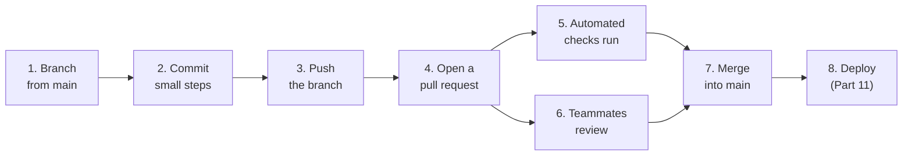
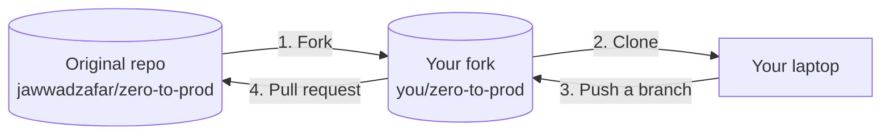

# 3.3 Pull requests & code review

On your own, you can commit to `main` whenever you like. On a team — even a team of two — that stops working fast: someone's half-finished change breaks everyone else, bugs slip in unnoticed, and nobody but the author understands the code. Professional teams solve this with the **pull request**: a proposed change that others can read, discuss, test automatically and approve before it joins `main`. Knowing how to open a clear pull request and give a useful review is one of the most important, and most underrated, skills you'll use every day as an engineer.

## What you'll learn

- The **GitHub flow**: branch → commit → push → pull request → review → merge — the loop almost every team uses.
- What a **pull request** (PR) is, and what makes one easy to review: small, focused, well described.
- How **automated checks** (CI) run on every PR, and how **protected branches** enforce the rules.
- How to **review** someone's code, and how to **receive** review without taking it personally.
- **Merge strategies** (merge, squash, rebase) and how to contribute to open-source projects using **forks**.

---

## The GitHub flow

Almost every team works in some version of this loop:



1. **Branch**: `git switch -c fix/redirect-dashes` from an up-to-date `main`.
2. **Commit** your work in small, clear steps (chapter 3.1).
3. **Push** the branch: `git push -u origin fix/redirect-dashes`.
4. **Open a pull request** on GitHub: "please pull my branch into `main`".
5. **Automated checks** (continuous integration) build the code and run the tests on your branch.
6. **Teammates review** the change, ask questions and suggest improvements. You push more commits to address them; the PR updates automatically.
7. When checks are green and reviewers approve, the PR is **merged**.
8. `main` is deployed (Part 11), and the branch is deleted.

`main` stays **always releasable**: nothing lands there without passing tests and a second pair of eyes.

:::note[Everyday anchor]
A pull request is like submitting an article to an editor. You don't edit the printed newspaper directly. You hand in a draft with a note explaining what it's about. The editor (reviewer) marks it up, a fact-checker (CI) verifies the details, you revise, and only then does it go to print (merge).
:::

---

## Anatomy of a good pull request

A pull request page shows the **description**, the **commits**, the **diff** (every changed line), the **checks**, and the **conversation**. You control how easy all of it is to review.

### Keep it small and focused

The single biggest factor in review quality is **size**. Reviewers catch real problems in a 100-line change; they skim a 2,000-line change and approve it out of exhaustion. One PR = one logical change. If you're also tempted to rename things or reformat a file, open a second PR.

### Write a description that answers the reviewer's questions

```markdown
## What
Adds per-key rate limiting to POST /api/links (60 creations per minute).

## Why
One API key created 40,000 links in an hour yesterday and slowed the
database for everyone. Nothing stopped it.

## How
- New `ratelimit` package: fixed window, counters in Redis so every snip
  copy shares them; in-memory fallback when Redis isn't configured.
- Returns 429 with a Retry-After header when the limit is hit.

## How to test
    go test ./internal/ratelimit/ ./internal/httpapi/
    # or manually: run the smoke test 61 times in a minute

## Notes for reviewers
The limiter "fails open" if Redis is down (requests are allowed). I think
availability matters more than strict limiting here — happy to discuss.
```

- **What** changed, in a sentence or two.
- **Why** — the problem or goal. This is the part reviewers need most and authors skip most.
- **How** — the approach, especially any non-obvious decisions.
- **How to test** — so the reviewer can check it themselves.
- **Anything you're unsure about.** Pointing at the risky bit makes the review far more useful.

Link the issue it solves (typing `Fixes #123` in the description closes that issue automatically when the PR merges), and add screenshots for anything visual.

:::tip[Review your own PR first]
Before asking anyone else, open your PR and read the diff top to bottom as if someone else wrote it. You'll find leftover debug lines, a missing test, a confusing name — and your reviewers get to spend their attention on what matters.
:::

---

## Automated checks and protected branches

When you push a branch or open a PR, **CI** (continuous integration — chapter 11.2) runs automatically: it builds the code, runs the tests, checks formatting and scans for obvious problems. The PR page shows each check as ✅ or ❌.

This handbook's own repository does exactly this. Every push runs `.github/workflows/ci.yml`, which builds the site, runs snip's tests against real Postgres and Redis, and builds snip's container image.

**Protected branches** turn team rules into enforced rules. In GitHub's settings you can require that `main`:

- can only change through pull requests (no direct pushes),
- needs passing checks before merging,
- needs at least one approving review,
- can never be force-pushed or deleted.

With those in place, "someone accidentally pushed broken code to main" simply can't happen.

:::info[In the real world]
Many companies also require a **CODEOWNERS** file, which automatically requests review from the team responsible for each part of the code, and some add automated reviewers — linters, security scanners, and increasingly AI review bots — as extra checks. Automation catches the mechanical problems so that humans can focus on design and intent.
:::

---

## Giving a good review

Reviewing isn't gatekeeping or proving you're clever. It's **sharing responsibility** for the code, and it's how knowledge spreads through a team. Look for, roughly in this order:

1. **Does it do what it claims?** Does the approach make sense for the problem in the description?
2. **Is it correct?** Edge cases, error handling, what happens under load or when a dependency is down, security (Part 7).
3. **Is it tested?** Would the tests catch it if this broke later?
4. **Will the next person understand it?** Names, structure, comments explaining *why*.
5. **Style and nits** — ideally caught by automated formatters, not humans.

How you write comments matters as much as what you say:

- **Ask, don't command.** "What happens here if Redis is down?" invites thinking; "This is wrong" invites defensiveness.
- **Explain why.** "Let's quote `$file` — a filename with a space would split into two arguments" teaches something; "quote this" doesn't.
- **Label the weight of each comment.** Prefixes like *nit:* (tiny, optional), *question:*, or *blocking:* tell the author what actually has to change.
- **Say what's good.** "Nice — this test would have caught last month's bug" is useful information too.
- **Approve when it's good enough**, not when it's how you'd have written it.

## Receiving a review

- **The review is about the code, not about you.** Every senior engineer's code gets comments.
- **Reply to every comment**: fix it, or explain why not. "Done" is a fine reply; so is "I kept it because…".
- **Don't argue in long threads.** If a discussion goes back and forth three times, have a quick call and write down the outcome.
- **Push fixes as new commits** during review, so reviewers can see what changed since they last looked.

---

## Merging: three buttons

GitHub offers three ways to merge a PR:

| Option | Result on `main` | Good for |
|---|---|---|
| **Create a merge commit** | All the branch's commits, plus a merge commit (chapter 3.2) | Keeping the full, detailed history |
| **Squash and merge** | The whole PR becomes **one** commit | Clean history: one commit per feature or fix — very popular |
| **Rebase and merge** | The branch's commits replayed on `main`, no merge commit | A straight line that keeps individual commits |

Teams pick one and stick to it. After merging, delete the branch (GitHub offers a button) and, locally: `git switch main && git pull`.

---

## Contributing to open source: forks

You can't push branches to a repository you don't have write access to — like a popular open-source project, or this handbook. Instead you **fork** it: GitHub makes a copy under your account that you *can* push to, and you open a PR from your fork back to the original.



Before contributing to a project, read its `CONTRIBUTING.md` (this handbook has one) and look for issues labelled **good first issue**. Small fixes — a typo, a confusing sentence, a broken link — are genuinely welcome and a great way to start.

:::warning[What can go wrong]
- **The mega-PR.** Thousands of lines, mixed purposes, "please review by tomorrow". It will be rubber-stamped or stall for weeks. Split it.
- **No description.** Reviewers have to reverse-engineer *why* from the diff. They'll guess wrong, or ask questions you could have answered in two sentences.
- **Merging with red checks.** "It's just a flaky test" is how broken code reaches production. Find out why it's red (chapter 11.2).
- **Rubber-stamp approvals.** An "LGTM" (looks good to me) on something you didn't really read spreads false confidence. If you don't have time to review properly, say so.
:::

---

## Lab

Free — you'll need your GitHub account from chapter 0.2 and the SSH key from chapter 2.6.

1. **Create your own practice repository.** On GitHub, click **New repository**, name it `git-practice`, tick **Add a README**, and create it. Then:
   ```bash
   cd ~/code
   git clone git@github.com:YOUR-USERNAME/git-practice.git
   cd git-practice
   ```

2. **Do the whole GitHub flow.**
   ```bash
   git switch -c docs/add-goals
   echo "## Why I'm learning this" >> README.md
   echo "- To build and ship real backend systems" >> README.md
   git commit -am "Add my learning goals"
   git push -u origin docs/add-goals
   ```
   `git push` prints a link to open a pull request. Open it, write a description with **What** and **Why**, and create the PR. Look at the **Files changed** tab: that's what reviewers see.

3. **Review your own PR.** In **Files changed**, click the `+` next to a line and leave a comment, as a reviewer would. Then merge it with **Squash and merge** and delete the branch. Back in your terminal:
   ```bash
   git switch main && git pull     # your merged change arrives
   git log --oneline               # one squashed commit for the whole PR
   ```

4. **Optional — contribute for real.** Found a typo or a confusing sentence in this handbook? Click **Edit this page** at the bottom of the chapter. GitHub will fork the repository for you and walk you through opening a PR. That's a genuine open-source contribution.

## Self-check

<Quiz
  id="git-pull-requests-and-review"
  questions={[
    {
      q: 'What is the single biggest thing you can do to get a better code review?',
      options: [
        'Ask more senior reviewers',
        'Keep the pull request small and focused on one change, with a clear description',
        'Open the PR late in the day',
        'Add more commits',
      ],
      answer: 1,
      explain: 'Reviewers find real problems in small, well-explained changes and skim huge ones. Size and a clear "why" drive review quality more than anything else.',
    },
    {
      q: 'What does a protected main branch typically enforce?',
      options: [
        'That only the repository owner can read it',
        'Changes only through pull requests, with passing checks and approvals, and no force-pushes',
        'That main is backed up daily',
        'That commits are signed with a password',
      ],
      answer: 1,
      explain: 'Branch protection turns team rules into enforced rules, so broken or unreviewed code cannot reach main by accident.',
    },
    {
      q: 'Which review comment is most helpful?',
      options: [
        '"This is wrong."',
        '"I would never write it like this."',
        '"What happens if Redis is down here? The limiter might block every request — should it fail open?"',
        '"LGTM" without reading',
      ],
      answer: 2,
      explain: 'A specific question that explains the risk helps the author think and learn. Vague criticism and rubber-stamp approvals help nobody.',
    },
    {
      q: 'You want to fix a typo in an open-source project you cannot push to. What is the normal route?',
      options: [
        'Email the maintainer the fixed file',
        'Fork the repository, push a branch to your fork, and open a pull request to the original',
        'Ask for admin access',
        'Force-push to their main branch',
      ],
      answer: 1,
      explain: 'Forks give you your own copy to push to; the pull request proposes your change back to the original, where maintainers can review and merge it.',
    },
  ]}
/>

<details>
<summary>Write the "Why" section for a PR that adds a database index to speed up "list my links". What does a reviewer need to know?</summary>

Something like: *"GET /api/links takes 900 ms for users with many links, because Postgres scans the whole links table to find one owner's links. It's our slowest endpoint and the one users complain about. An index on (owner_id, created_at) lets Postgres jump straight to one owner's links in date order. In local testing with 1M links, the query drops from ~850 ms to ~2 ms. Adding the index takes a few seconds on the current table size and doesn't lock writes (created CONCURRENTLY)."*

A reviewer needs: the **problem** (with evidence), **why this fixes it**, the **measured effect**, and the **risks** (here, what happens while the index is built). Chapter 6.4 teaches exactly this change.

</details>

<details>
<summary>Why is it worth having humans review code at all, if automated tests and linters already run on every PR?</summary>

Automation checks what can be written as rules: does it build, do the tests pass, is it formatted, does it match known-bad patterns. Humans check what can't: **is this the right approach? Does it solve the actual problem? Will the next person understand it? What's missing from the tests?** Review also **spreads knowledge**: at least two people understand every change, so the team isn't stuck when the author is on holiday. The best setups use both — automation handles the mechanical checks so reviewers can spend their attention on design and intent.

</details>
