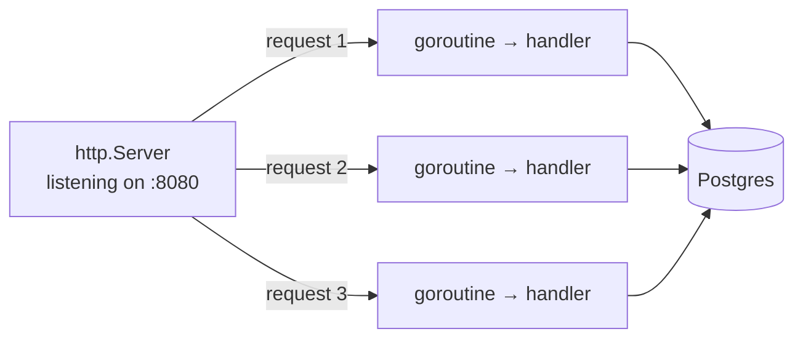
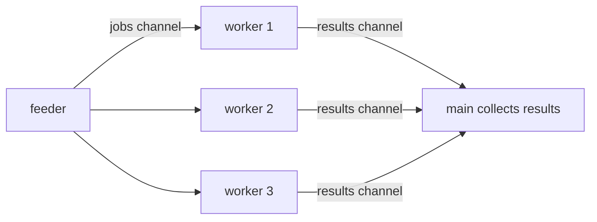
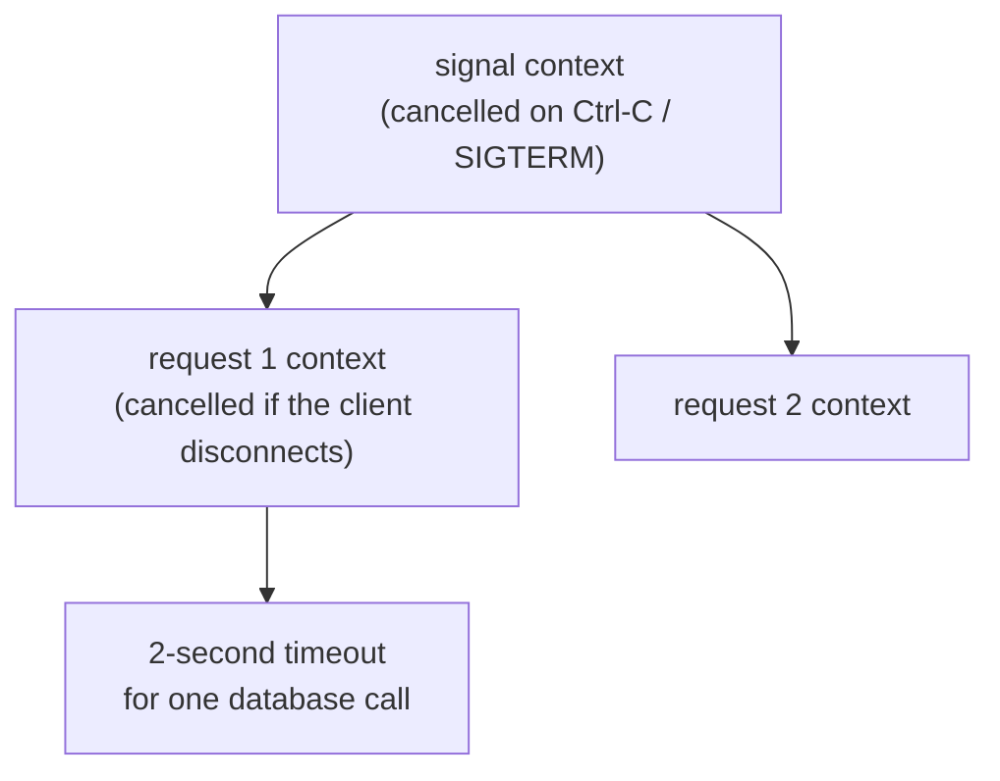

# 4.5 Concurrency: goroutines, channels & context

A server's whole job is doing many things at once. While one visitor's request waits on the database, another's is being validated, a third's response is being written, and a background worker is counting clicks. In chapter 1.2 you learned that this needs threads — and that threads sharing memory lead to race conditions. Go was designed around making concurrency **easy and safe enough to use everywhere**, and it's a big reason Go powers so much of the cloud. This chapter teaches the handful of tools that cover nearly all real concurrent code — and shows each one at work inside snip.

## What you'll learn

- **Goroutines**: Go's lightweight concurrent workers, started with one word — `go`.
- Waiting for work to finish with a **WaitGroup**, and protecting shared data with a **Mutex**.
- **Channels**: passing values *between* goroutines instead of sharing them — and **`select`** for waiting on several things at once.
- **Worker pools**: a fixed number of goroutines sharing a queue of jobs.
- **`context`**: carrying timeouts and cancellation through a program — and how snip uses it for requests, readiness checks and **graceful shutdown**.

---

## Goroutines: concurrency with one word

A **goroutine** is a function running concurrently with the rest of the program. You start one by putting **`go`** in front of a function call:

```go
go sendWelcomeEmail(user)   // runs in the background; this line returns immediately
fmt.Println("carrying on")  // runs right away, without waiting for the email
```

Goroutines are **cheap**: each starts with a few kilobytes of memory, and a program can run hundreds of thousands of them. The Go **runtime** (built into every Go program) spreads them across your CPU cores (chapter 1.2's threads) and switches between them whenever one waits — on the network, the disk, a timer.

This is how snip handles many visitors at once, without you writing any concurrency code at all: Go's HTTP server starts **a new goroutine for every incoming connection**. Each request runs its handler in its own goroutine; when one waits for Postgres, the others carry on.



:::note[Everyday anchor]
A goroutine is a cook you can hire in one second for one dish, who goes home the moment the dish is done. Hiring is so cheap that the restaurant hires one per order. The kitchen manager (Go's runtime) keeps the few real stoves (CPU cores) busy by switching between cooks whenever one is waiting for water to boil.
:::

:::warning[main doesn't wait]
When `main` returns, the whole program exits — including any goroutines still running. `go doWork()` as the last line of `main` usually does nothing visible. You need a way to **wait**.
:::

---

## Waiting: WaitGroup

A **`sync.WaitGroup`** counts running goroutines, so you can wait until they've all finished:

```go
var wg sync.WaitGroup
for _, url := range urls {
	wg.Add(1)              // one more to wait for
	go func() {
		defer wg.Done()    // one fewer when this finishes (defer = run as the function exits)
		check(url)
	}()
}
wg.Wait()                  // block here until the count is back to zero
fmt.Println("all checked")
```

---

## Sharing safely: Mutex

Chapter 1.2's race condition happens when goroutines read and write the same memory at once. You watched it happen in chapter 4.4's lab: 1,000 goroutines each adding 1 to a counter ended up at 977, 986, 983…

The simplest fix is a **mutex** (mutual exclusion lock): only one goroutine may hold it at a time; the others wait their turn.

```go
var mu sync.Mutex
mu.Lock()
clicks++          // only one goroutine can be here at a time
mu.Unlock()
```

snip's in-memory store is shared by every request's goroutine, so every method takes the lock. From `internal/store/memory/memory.go`:

```go
// Store is safe for concurrent use: many requests may hit it at once, so
// every access holds the mutex (chapter 4.5).
type Store struct {
	mu     sync.RWMutex
	links  map[string]links.Link
	// …
}

func (s *Store) Get(_ context.Context, slug string) (links.Link, error) {
	s.mu.RLock()           // a READ lock: many readers may hold it together
	defer s.mu.RUnlock()
	l, ok := s.links[slug]
	// …
}

func (s *Store) AddClicks(_ context.Context, slug string, n int64) error {
	s.mu.Lock()            // a WRITE lock: exclusive
	defer s.mu.Unlock()
	// read, add, write back — safe, because nobody else can be in here
}
```

An **`RWMutex`** allows many readers at once but only one writer — useful when reads (redirects) vastly outnumber writes. And `defer s.mu.Unlock()` guarantees the lock is released however the function exits, even on an error path.

:::tip
Go's maps are **not** safe for concurrent writes. Two goroutines writing to the same map without a lock can crash the whole program with `fatal error: concurrent map writes`. Run your tests with `-race` (chapter 4.4) and Go will tell you.
:::

---

## Channels: pass values, don't share them

Go's famous motto is: **"Don't communicate by sharing memory; share memory by communicating."** Instead of several goroutines touching the same variable under a lock, one goroutine can **send** a value to another through a **channel**.

A channel is a typed pipe between goroutines:

```go
jobs := make(chan int)      // a channel that carries ints

go func() {
	jobs <- 42              // send: blocks until someone receives
}()

n := <-jobs                 // receive: blocks until someone sends
fmt.Println(n)              // 42
```

- `ch <- v` **sends**; `v := <-ch` **receives**. On an ordinary (unbuffered) channel, both wait for each other — it's a handover, which also synchronises the two goroutines.
- **`close(ch)`** says "no more values are coming". A `for v := range ch` loop receives until the channel is closed.
- `make(chan int, 100)` makes a **buffered** channel that holds up to 100 values, so senders only wait when it's full.

:::note[Everyday anchor]
A channel is the pass-through hatch between a kitchen and the dining room. The cook puts a plate on the hatch; a waiter takes it. Nobody reaches into anyone else's space — plates move through the hatch, one at a time. A buffered channel is a hatch with shelf space for several plates.
:::

### select: wait for whichever comes first

**`select`** waits on several channel operations and runs whichever is ready first. It's how Go code says "do this, unless that happens first":

```go
select {
case res := <-results:
	fmt.Println("got", res)
case <-time.After(2 * time.Second):
	fmt.Println("gave up waiting")
}
```

---

## Worker pools

A common shape: many jobs, a **fixed number** of goroutines working through them. Unlimited goroutines hitting a database would overwhelm it; a pool keeps the load bounded.



The handbook's `examples/workers/main.go` builds exactly this: a feeder sends ten jobs into a channel, three worker goroutines `range` over it, and results come back on a second channel. With 3 workers, ten 200–400 ms jobs take about one second; with 10 workers, about 0.4 seconds.

snip's **click worker** (`cmd/snip-worker`) is the same idea at a larger scale: several worker *processes* share a queue of click events in Redis, each taking a batch at a time (chapter 8.2).

---

## context: timeouts and cancellation

Here's a question every backend must answer: **how long should we wait?** If Postgres hangs, should a request wait forever? If a visitor closes their browser, should we keep working on a response nobody will read? If the server is shutting down, how do we tell hundreds of goroutines to stop?

Go's answer is **`context.Context`**. A context carries a **deadline** and a **cancellation signal** down through every function involved in a piece of work. That's why so many functions in snip take `ctx context.Context` as their first parameter (chapter 4.3's `Store` interface):

```go
ctx, cancel := context.WithTimeout(context.Background(), 2*time.Second)
defer cancel()                  // always release the context's resources

err := store.Ping(ctx)          // pgx gives up if 2 seconds pass
if errors.Is(err, context.DeadlineExceeded) {
	// the database didn't answer in time
}
```

Code that waits checks `ctx.Done()` — a channel that is closed when the context is cancelled or times out:

```go
select {
case <-time.After(d):           // the work finished
	return d, nil
case <-ctx.Done():              // cancelled or timed out: stop now
	return 0, ctx.Err()
}
```

Contexts form a tree: cancelling a parent cancels every child derived from it.



### Where snip uses context

**Every request.** Go's HTTP server gives each request a context, `r.Context()`, which is cancelled if the client disconnects. snip passes it all the way down — handler → Service → Store → pgx — so a database query for a visitor who's gone away is abandoned instead of wasting a connection.

**Readiness checks** put a hard limit on how long `/readyz` may take (`internal/httpapi/server.go`):

```go
func (s *Server) readyz(w http.ResponseWriter, r *http.Request) {
	ctx, cancel := context.WithTimeout(r.Context(), 2*time.Second)
	defer cancel()
	for name, p := range s.ready {
		if err := p.Ping(ctx); err != nil { // Postgres or Redis must answer within 2s
			// … report "unavailable"
		}
	}
}
```

**Graceful shutdown** ties it all together. From `cmd/snip/main.go` (trimmed):

```go
// Stop cleanly on Ctrl-C (SIGINT) or when an orchestrator asks (SIGTERM).
ctx, stop := signal.NotifyContext(context.Background(), os.Interrupt, syscall.SIGTERM)
defer stop()

errc := make(chan error, 1)
go func() {
	errc <- srv.ListenAndServe()       // serve in a goroutine…
}()

select {                               // …and wait for whichever happens first:
case err := <-errc:
	return err                         // the server failed to start (e.g. port in use)
case <-ctx.Done():                     // or we were asked to stop
}

shutdownCtx, cancel := context.WithTimeout(context.Background(), 10*time.Second)
defer cancel()
srv.Shutdown(shutdownCtx)              // stop accepting, finish in-flight requests (max 10s)
```

Every concept in this chapter is in those lines: a **goroutine** runs the server, a **channel** carries its error, **`select`** waits for the first of two events, and **contexts** turn a SIGTERM (chapter 1.2) into a graceful stop with a deadline. This is exactly what systemd (chapter 2.5) and Kubernetes (Part 10) rely on when they stop a service.

:::info[If you've written code]
If you know JavaScript's `async`/`await`, Go feels different: there's no colouring of functions into async and sync. Any function can block; you get concurrency by running it in a goroutine. `context` plays the role of `AbortController`, and a channel plus `select` covers what `Promise.race` does. Python's `asyncio` has similar ideas with `asyncio.wait_for` and cancellation.
:::

---

## Classic concurrency bugs

:::warning[What can go wrong]
- **Data races.** Unprotected shared variables. Use a mutex, a channel, or an atomic operation — and always test with `-race`.
- **Goroutine leaks.** A goroutine blocked forever on a channel nobody will ever send to, or a request with no timeout, never exits. Leak enough and memory fills up (chapter 1.1). Give every wait a way out: a context, a timeout, or a closed channel.
- **Deadlocks.** Goroutines waiting on each other in a circle, so none can proceed. If *every* goroutine is stuck, Go stops with `fatal error: all goroutines are asleep - deadlock!`.
- **Forgetting to wait.** `main` returns and the program exits before background goroutines finish.
- **Unbounded concurrency.** Starting a goroutine per item for a million items, each opening a database connection. Bound it with a worker pool.
:::

---

## Lab

Free, on your own computer.

1. **Watch a worker pool scale.**
   ```bash
   cd ~/code/zero-to-prod/snip
   go run ./examples/workers                  # 3 workers: about 1 second for 10 jobs
   go run ./examples/workers -workers 10      # 10 workers: about 0.4 seconds
   go run ./examples/workers -workers 1       # 1 worker: about 3 seconds
   ```
   Notice which worker handled which job changes every run: goroutines are scheduled unpredictably. Never rely on their order.

2. **See context cancellation.**
   ```bash
   go run ./examples/workers -timeout 500ms   # stops early: context deadline exceeded
   ```
   Open `examples/workers/main.go` and find the two places that check `ctx.Done()`. Those are what let the program stop promptly instead of finishing work nobody wants.

3. **Race, detect, fix.**
   ```bash
   go run ./examples/race             # wrong count
   go run -race ./examples/race       # the detector names the line
   go run ./examples/race -safe       # mutex: always 1000
   ```

4. **Test graceful shutdown for real.** Start snip (`go run ./cmd/snip`), then press <kbd>Ctrl</kbd>+<kbd>C</kbd>. Read the last log lines: `shutting down` … `stopped cleanly`. That's `signal.NotifyContext` → `select` → `srv.Shutdown`, exactly as in the code above.

## Self-check

<Quiz
  id="go-concurrency"
  questions={[
    {
      q: 'How does Go’s HTTP server handle many requests at the same time?',
      options: [
        'It handles one request at a time, but so quickly that nobody notices the queue',
        'It starts a goroutine per connection, so requests run concurrently',
        'It starts a new operating-system process for every request it accepts',
        'It gives each CPU core one request, and queues the rest behind them',
      ],
      answer: 1,
      explain: 'Each connection gets its own goroutine. Goroutines are cheap, and the runtime switches between them whenever one waits on the network or disk.',
    },
    {
      q: 'Why does snip’s in-memory store lock a mutex in every method?',
      options: [
        'To make it faster, since a locked map lets Go skip bounds checks',
        'Many goroutines share the map, and unsynchronised writes race or crash',
        'Maps can only be read by the goroutine that created them',
        'To save memory by letting goroutines share one copy of each link',
      ],
      answer: 1,
      explain: 'Go maps are not safe for concurrent writes. The (RW)mutex makes each read-modify-write happen one at a time, preventing lost updates and "concurrent map writes" crashes.',
    },
    {
      q: 'What is context.Context used for?',
      options: [
        'Storing global configuration that every package can read at startup',
        'Carrying deadlines and cancellation through the calls for one task',
        'Logging errors with the request ID attached, so they can be traced',
        'Creating goroutines and waiting for all of them to finish',
      ],
      answer: 1,
      explain: 'A context tells every function involved when to give up: a timeout passed, the client disconnected, or the server is shutting down.',
    },
    {
      q: 'A program starts a goroutine that waits to receive from a channel nobody ever sends to. What happens?',
      options: [
        'The garbage collector notices it is stuck and deletes it after a while',
        'It leaks: it waits forever, holding on to its memory',
        'The program crashes immediately with a "deadlock" error',
        'The channel gives it a zero value after a timeout, so it carries on',
      ],
      answer: 1,
      explain: 'A blocked goroutine never exits on its own. Leaks accumulate until memory runs out. Always give waits an exit: close the channel, or select on ctx.Done().',
    },
  ]}
/>

<details>
<summary>Explain snip's graceful shutdown in plain words, naming each Go tool it uses.</summary>

1. **`signal.NotifyContext`** creates a **context** that is cancelled when the process receives Ctrl-C or SIGTERM.
2. The HTTP server runs in a **goroutine**; if it fails to start, its error is sent on a **channel**.
3. `main` uses **`select`** to wait for whichever happens first: a startup error, or the context being cancelled.
4. On cancellation, it calls `srv.Shutdown` with a **10-second timeout context**: stop accepting new connections, let in-flight requests finish, and give up waiting after 10 seconds.

Result: when systemd or Kubernetes stops snip, visitors mid-request still get their answer, and nothing is cut off halfway.

</details>

<details>
<summary>When would you use a mutex, and when a channel?</summary>

Use a **mutex** when several goroutines need to read or update the **same piece of state** — a counter, a map, a cache — and the operations are short. snip's in-memory store is the example.

Use a **channel** when you're **handing work or results from one goroutine to another** — a pipeline, a worker pool, a signal that something finished. The worker example and snip's shutdown error are examples.

A rough rule: *mutexes protect data; channels coordinate work.* Both are correct tools; pick the one that makes the code easiest to understand.

</details>
