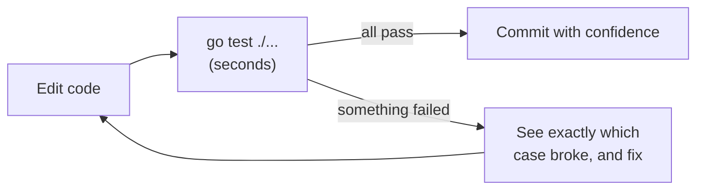
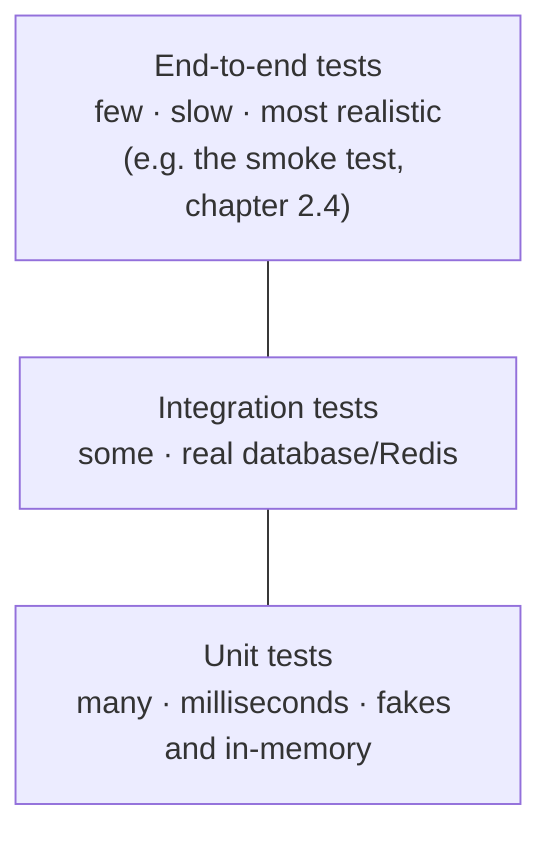

# 4.4 Testing

How do you know your code works? You run it, try a few things, and it seems fine. Then you change one small thing next week — and something you didn't touch breaks, and a user finds it before you do. **Automated tests** are code that checks your code: small programs that run your functions with known inputs and complain if the outputs are wrong. They run in seconds, every time you change anything, and on every pull request (chapter 3.3). They're the reason professional teams can change code confidently many times a day. snip has a real test suite, and in this chapter you'll read it, run it, break it, and extend it.

## What you'll learn

- **Why** automated tests matter, and what "confidence to change code" really means.
- The basics of **`go test`**: test files, test functions, `t.Error` and `t.Fatal`.
- **Table-driven tests**, the idiomatic Go way to check many cases compactly.
- **Test doubles** (fakes) and **`httptest`**, for testing code that depends on databases, caches and HTTP.
- **Integration tests** that use real Postgres and Redis, **coverage**, the **race detector**, and what makes a test *good*.

---

## Why test at all

Imagine snip without tests. You improve the URL validation. Did you just start allowing `javascript:` URLs (a security hole)? Did you break URLs with query strings? You could check by hand — every case, every time, forever. Or you can write the checks down once as code, and let the computer re-run all of them in under a second, every time.

That's the real value of tests: not proving code works once, but **catching it the moment it stops working**. They give you — and your teammates, and your future self — the **confidence to change code**. Untested code tends to become code nobody dares touch.



:::note[Everyday anchor]
Tests are the checklist a pilot runs before every flight. The pilot knows how to fly; the checklist exists because humans forget things, and because a mistake caught on the ground is cheap while one caught in the air is not. Tests are your ground check before code reaches users.
:::

---

## go test: the basics

Go has testing built in. The rules:

- Tests live in files ending in **`_test.go`**, next to the code they test.
- A test is a function named **`TestXxx`** that takes **`t *testing.T`**.
- Inside, you run your code and report problems with **`t.Errorf`** (record a failure, keep going) or **`t.Fatalf`** (record a failure, stop this test now).

Here's the simplest possible test, for the `combinations` function from chapter 4.1:

```go
// combinations_test.go
package main

import "testing"

func TestCombinations(t *testing.T) {
	got := combinations(2, 3)
	want := 8
	if got != want {
		t.Errorf("combinations(2, 3) = %d, want %d", got, want)
	}
}
```

Run it:

```bash
go test ./...          # run every test in the module
go test -v ./...       # verbose: show each test by name
go test -run Slug ./internal/links/   # only tests whose names match "Slug"
```

Notice the failure message format: **what was called, what it returned, what was expected**. When a test fails six months from now, that one line should tell the reader exactly what broke, without opening the code.

---

## Table-driven tests

Most functions need checking with many inputs. Instead of copying the same test ten times, Go programmers write a **table**: a list of cases, and one loop that checks them all. Here's snip's real test for URL validation, from `internal/links/service_test.go`:

```go
func TestNormalizeURL(t *testing.T) {
	tests := []struct {
		in      string
		want    string
		wantErr bool
	}{
		{in: "https://go.dev", want: "https://go.dev"},
		{in: "  http://example.com/a?b=c  ", want: "http://example.com/a?b=c"},
		{in: "", wantErr: true},
		{in: "go.dev", wantErr: true},                 // no scheme
		{in: "javascript:alert(1)", wantErr: true},    // dangerous scheme
		{in: "ftp://example.com/file", wantErr: true}, // not http(s)
		{in: "https://", wantErr: true},               // no host
	}
	for _, tt := range tests {
		t.Run(tt.in, func(t *testing.T) {
			got, err := links.NormalizeURL(tt.in)
			if tt.wantErr {
				if !errors.Is(err, links.ErrInvalidURL) {
					t.Fatalf("NormalizeURL(%q) error = %v, want ErrInvalidURL", tt.in, err)
				}
				return
			}
			if err != nil || got != tt.want {
				t.Fatalf("NormalizeURL(%q) = %q, %v; want %q", tt.in, got, err, tt.want)
			}
		})
	}
}
```

- The **table** is a slice of anonymous structs (chapter 4.2): each row is one case, with the input and the expected result.
- **`t.Run`** makes each row a named **subtest**, so a failure reports exactly which input broke.
- Adding a new case — say, a bug someone reported — is **one line**. The best habit in testing: *when you fix a bug, first add a failing test case for it.* Then it can never quietly come back.

Read the table itself and you have a precise specification of what snip accepts, including the security rule (`javascript:` is refused). Tests are also documentation that can't go out of date.

---

## Test doubles: faking the slow and the unpredictable

snip's `Service` depends on a `Store`, a `Cache` and a `ClickRecorder` (chapter 4.3). Real ones need Postgres and Redis running. For most tests we don't want that: they'd be slow, need setup, and fail for reasons unrelated to the code under test.

Because those dependencies are **interfaces**, a test can pass in a **test double** — a stand-in that behaves just well enough. snip's service test uses the real in-memory store, plus a tiny hand-written fake cache that **counts how it was used**:

```go
// fakeCache counts calls so we can check the cache is used.
type fakeCache struct {
	data       map[string]string
	gets, sets int
}

func (c *fakeCache) GetURL(_ context.Context, slug string) (string, bool, error) {
	c.gets++
	u, ok := c.data[slug]
	return u, ok, nil
}
// … SetURL and Delete are similar
```

The test then checks *behaviour* — the first lookup misses the cache and fills it, the second is a hit, and deleting a link evicts it:

```go
cache := &fakeCache{data: map[string]string{}}
svc := links.NewService(memory.New(), cache, nil)

l, _ := svc.Shorten(ctx, 1, "https://go.dev/doc", "")
r1, _ := svc.Resolve(ctx, l.Slug)   // miss → reads the store, fills the cache
r2, _ := svc.Resolve(ctx, l.Slug)   // hit
if !r2.CacheHit {
	t.Fatal("second resolve should hit the cache")
}
```

That's the payoff of chapter 4.3's interfaces: the business logic is tested in microseconds, with no database, and the test reads like a description of how caching should work.

---

## Testing HTTP handlers with httptest

Go's standard library includes **`net/http/httptest`**, which starts a real HTTP server on a random local port for the length of a test. snip's `internal/httpapi/server_test.go` uses it to test the API exactly as a client would — real requests, real status codes, real JSON:

```go
func TestErrors(t *testing.T) {
	base, key := newTestServer(t, 100) // snip on a random port, in-memory, with a valid key
	tests := []struct {
		name, method, path, key, body string
		wantStatus                    int
		wantCode                      string
	}{
		{"no key", "POST", "/api/links", "", `{"url":"https://go.dev"}`, 401, "unauthorized"},
		{"bad json", "POST", "/api/links", key, `{"url":`, 400, "invalid_json"},
		{"bad url", "POST", "/api/links", key, `{"url":"javascript:alert(1)"}`, 400, "invalid_url"},
		{"missing link", "GET", "/nope123", "", "", 404, "not_found"},
		// …
	}
	// loop: send each request, check the status and the error code in the JSON body
}
```

These tests cover the whole path — routing, authentication, JSON decoding, validation, error mapping — and still run in milliseconds.

---

## Integration tests: the real thing, when available

Fakes can't catch everything. Does the SQL actually work? Does the unique constraint really reject duplicate slugs? For that, snip has **integration tests** that talk to real Postgres and Redis. They **skip themselves** when no database is configured, so `go test ./...` still works on a laptop with nothing installed:

```go
func openTestDB(t *testing.T) *postgres.Store {
	t.Helper()
	url := os.Getenv("SNIP_TEST_DATABASE_URL")
	if url == "" {
		t.Skip("SNIP_TEST_DATABASE_URL not set")
	}
	// … connect and run migrations
}
```

In CI (`.github/workflows/ci.yml`), real Postgres and Redis are started as services and the variables are set, so the integration tests always run there.

### The testing pyramid

Different kinds of tests trade speed for realism:



Have **many** fast unit tests, **some** integration tests for the boundaries with real systems, and **a few** end-to-end checks of the most important flows. That shape gives you fast feedback and real confidence.

---

## Coverage and the race detector

**Coverage** tells you which lines your tests actually ran:

```bash
go test -cover ./...                               # a percentage per package
go test -coverprofile=cover.out ./internal/links/  # save the details
go tool cover -html=cover.out                      # open a browser view: covered lines green, missed lines red
```

Coverage is a **flashlight, not a score**. Red lines show code no test exercises — often error paths that deserve a test. But 100% coverage doesn't mean correct: a test can run a line without checking its result. Aim for meaningful tests of important behaviour, not a number.

The **race detector** (chapter 1.2's race conditions) watches your program as it runs and reports when two goroutines touch the same memory unsafely:

```bash
go test -race ./...      # snip's CI always runs tests this way
```

It only finds races in code that actually runs during the tests — another reason to test concurrent code paths.

---

## What makes a good test

- **Tests behaviour, not implementation.** Check *what* a function promises (inputs → outputs, visible effects), not *how* it does it. Then you can rewrite the insides freely.
- **Fast and independent.** Each test sets up what it needs and doesn't depend on other tests or their order.
- **Deterministic.** Same code, same result, every time. A test that sometimes fails — a **flaky test** — is worse than useless: people learn to ignore red.
- **Clear failure messages.** `got X, want Y, for input Z`.
- **Readable.** A test is often the best documentation of how code is meant to be used.

:::warning[What can go wrong]
- **Flaky tests.** Usually caused by timing (`time.Sleep` "waiting" for something), shared state between tests, random data, or real network calls. Fix the cause; never just re-run until green.
- **Testing the fake, not the code.** A test so full of fakes that it only checks the fakes proves nothing. Keep fakes minimal, and back them up with some integration tests.
- **Ignoring a failing test "for now".** Skipped and disabled tests rot. If a test is wrong, fix or delete it deliberately.
- **Chasing a coverage number.** Tests written to raise a percentage, without assertions, give false confidence.
:::

:::info[In the real world]
Some developers practise **test-driven development (TDD)**: write a failing test first, then the minimum code to pass it, then tidy up ("red, green, refactor"). Others write tests alongside or just after the code. Teams argue about the order; they agree the tests must exist. Either way, a bug fix should always come with a test that fails without the fix.
:::

---

## Lab

Free, on your own computer.

1. **Run snip's suite.**
   ```bash
   cd ~/code/zero-to-prod/snip
   go test ./...                         # every package; integration tests skip themselves
   go test -v -run TestNormalizeURL ./internal/links/   # one test, with every subtest listed
   go test -race ./...                   # the way CI runs them
   ```
   Notice the `SKIP` lines for Postgres and Redis tests: they explain why they didn't run.

2. **Break the code, watch the tests catch it.** Open `internal/links/link.go` and, in `NormalizeURL`, change `u.Scheme != "https"` to `u.Scheme != "httpz"`. Run `go test ./internal/links/`. Read the failure: it names the exact input (`https://go.dev`) and what went wrong. Undo the change.

3. **Watch the race detector.**
   ```bash
   go run ./examples/race             # usually fewer than 1000: lost updates
   go run -race ./examples/race       # WARNING: DATA RACE, with the exact line
   go run ./examples/race -safe       # a mutex fixes it: always 1000 (chapter 4.5)
   ```

4. **Add a test case of your own.** In `internal/links/service_test.go`, add a row to the `TestNormalizeURL` table checking that a URL with a port is accepted:
   ```go
   {in: "https://example.com:8443/x", want: "https://example.com:8443/x"},
   ```
   Run `go test ./internal/links/`. Then add a case you think should be **rejected** — for example `"mailto:someone@example.com"` — and check that it is.

5. **See coverage.**
   ```bash
   go test -coverprofile=cover.out ./internal/links/ && go tool cover -html=cover.out
   ```
   Find a red (uncovered) line. Is it worth a test?

## Self-check

<Quiz
  id="go-testing"
  questions={[
    {
      q: 'What is the main value of an automated test suite?',
      options: [
        'It proves the code has no bugs in the parts that the tests cover',
        'It catches within seconds when a change breaks existing behaviour',
        'It makes programs run faster, because tested code is optimised',
        'It replaces code review, since the tests already read every line',
      ],
      answer: 1,
      explain: 'It catches, within seconds, when a change breaks existing behaviour — giving confidence to change code. Tests cannot prove the absence of bugs, but they re-check known behaviour instantly after every change. That is what lets teams change code often and safely.',
    },
    {
      q: 'Why are table-driven tests popular in Go?',
      options: [
        'They run in parallel automatically, one goroutine per row of the table',
        'Cases are listed compactly, reported by name, and each new one is a line',
        'They don’t need the testing package, so they build faster',
        'They guarantee 100% coverage, since every branch gets its own row',
      ],
      answer: 1,
      explain: 'A table of inputs and expected outputs plus one loop with t.Run keeps tests readable, precise about which case failed, and easy to extend when bugs are found.',
    },
    {
      q: 'Why does snip’s Service test use an in-memory store and a fake cache instead of Postgres and Redis?',
      options: [
        'Postgres can’t run inside go test, so its code can’t be tested at all',
        'Fakes keep it fast and focused on logic; integration tests cover the real stores',
        'Fakes find more bugs than real systems, because they are stricter',
        'To avoid writing SQL, which the tests are not allowed to contain',
      ],
      answer: 1,
      explain: 'The fakes make the test fast and focused on the business logic; real databases are covered by separate integration tests. Interfaces let tests plug in fast stand-ins. Unit tests check logic in microseconds; integration tests (which skip without a database) check the real boundaries.',
    },
    {
      q: 'A test passes most of the time but fails randomly about once in twenty runs. What should you do?',
      options: [
        'Re-run the pipeline until it passes; one green run proves it works',
        'Delete it, since a test that sometimes fails tells you nothing',
        'Treat it as real: find the non-determinism (timing, shared state, network) and fix it',
        'Mark it as skipped, and add a note so someone fixes it later',
      ],
      answer: 2,
      explain: 'Treat it as a real problem: find the source of non-determinism (timing, shared state, randomness, network) and fix it. Flaky tests teach people to ignore failures and often hide real races. Find and fix the cause — go test -race is a good first step.',
    },
  ]}
/>

<details>
<summary>What does "test behaviour, not implementation" mean? Give an example with snip's cache.</summary>

It means checking **what the code promises**, not **how it's written inside**. For snip's cache: a behavioural test checks that "resolving the same slug twice uses the cache the second time, and deleting a link stops it redirecting" — the promises the `Service` makes. An implementation-focused test would check, say, that `Resolve` calls `GetURL` before `store.Get` in a specific internal order, or inspect private fields. The behavioural test keeps passing if you restructure `Resolve`; the implementation test breaks on every refactor even when nothing is wrong for users.

</details>

<details>
<summary>Your team fixes a bug where slugs with uppercase letters weren't found. What should the fix's pull request include, and why?</summary>

A **test case that fails without the fix and passes with it** — for example a row in a table-driven test that creates `MyLink` and resolves `MyLink`. It proves the fix works, and it guards against the bug returning: if anyone ever reintroduces it, the test fails immediately in CI instead of in front of users. It also documents the expected behaviour for the next reader.

</details>
