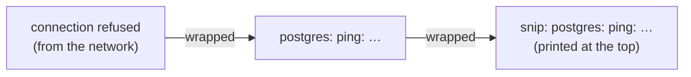

# 4.2 Types, structs & errors

Real programs are about data: a link has a slug, a URL, an owner and a click count; a user has many links; a request can fail in half a dozen different ways. Chapter 4.1 gave you single values — a number, some text. This chapter gives you the tools to **organise** data — lists, lookups, and your own types — and Go's distinctive way of handling the thing every backend deals with constantly: **things going wrong.** By the end, you'll be able to read snip's core file, `internal/links/link.go`, line by line.

## What you'll learn

- **Slices** (ordered lists) and **maps** (lookups by key) — the two collections you'll use every day.
- **Structs**: your own types that group related fields, like snip's `Link`.
- **Methods**: functions attached to a type — and **pointers**, explained through one practical question: *does this function need to change the original?*
- **Zero values** and **nil**: what a variable holds before you give it anything.
- **Errors as values**: returning them, checking them, **wrapping** them with context, and testing for specific ones with `errors.Is`.

---

## Slices: ordered lists

A **slice** is an ordered, growable list of values of one type:

```go
slugs := []string{"go", "gh"}       // a slice of strings with two items
slugs = append(slugs, "ex")         // add to the end → [go gh ex]
fmt.Println(len(slugs))             // how many → 3
fmt.Println(slugs[0])               // the first item (counting starts at 0) → go
fmt.Println(slugs[1:3])             // a "slice" of the slice: items 1 and 2 → [gh ex]

for i, s := range slugs {           // loop over every item: i is the position, s the value
	fmt.Println(i, s)
}
```

Asking for `slugs[10]` when there are only three items makes the program stop with an **index out of range** error (a *panic*). Always know how long a slice is before reaching into it.

## Maps: look things up by key

A **map** stores values under **keys**, so you can find them instantly without searching — like a dictionary, or a coat check (chapter 0.3):

```go
owners := map[string]string{"go": "ada", "gh": "grace"}  // key type string, value type string
owners["ex"] = "linus"              // add or replace
fmt.Println(owners["go"])           // → ada
delete(owners, "gh")                // remove

owner, ok := owners["nope"]         // the "comma ok" form: ok says whether the key existed
if !ok {
	fmt.Println("no such slug")
}
```

That last pattern matters. Asking a map for a missing key doesn't fail — it quietly returns the **zero value** (here, an empty string). Use `value, ok := m[key]` whenever "missing" and "empty" mean different things. snip's in-memory store (`internal/store/memory/memory.go`) is essentially a map from slug to link, guarded by a lock (chapter 4.5).

:::note[Everyday anchor]
A **slice** is a numbered queue: first, second, third — order matters, and you find things by position. A **map** is a wall of labelled lockers: you go straight to the locker with the right label, and order doesn't mean anything.
:::

---

## Structs: your own types

A **struct** groups related values into one new type. Here is snip's real `Link` type, from `internal/links/link.go`:

```go
// Link is one shortened URL.
type Link struct {
	Slug      string    `json:"slug"`
	URL       string    `json:"url"`
	OwnerID   int64     `json:"-"`
	Clicks    int64     `json:"clicks"`
	CreatedAt time.Time `json:"created_at"`
}
```

- `type Link struct { … }` defines a new type called `Link`.
- Each line is a **field**: a name and a type. `time.Time` is a type from Go's standard `time` package.
- The text in backticks is a **struct tag**: extra instructions for other code. Here it tells Go's JSON package what to call each field in JSON (chapter 1.3), and `json:"-"` means *never include `OwnerID` in JSON* — the API shouldn't reveal internal owner numbers.

Creating and using one:

```go
l := links.Link{Slug: "godoc", URL: "https://go.dev/doc/"}   // fields you don't set get zero values
fmt.Println(l.Slug)       // read a field → godoc
l.Clicks = 42             // change a field
```

### Methods: functions that belong to a type

A **method** is a function attached to a type. It has an extra part before its name — the **receiver** — saying which type it belongs to:

```go
// Describe returns a one-line summary of the link.
func (l Link) Describe() string {
	return fmt.Sprintf("/%s -> %s (%d clicks)", l.Slug, l.URL, l.Clicks)
}

fmt.Println(l.Describe())   // call it with a dot, like a field
```

### Pointers, gently

Here's the one question pointers answer: **does this function need to change the original, or just look at it?**

When you pass a value to a function in Go, the function gets a **copy**. Changing the copy doesn't affect the original:

```go
func (l Link) AddClickWrong() { l.Clicks++ }   // changes a copy, which is then thrown away
func (l *Link) AddClick()      { l.Clicks++ }   // the * means: work on the ORIGINAL

l.AddClickWrong()   // l.Clicks unchanged
l.AddClick()        // l.Clicks is now one higher
```

A **pointer** is the *address* of a value rather than a copy of it — like giving someone your home address instead of a photo of your house. `*Link` means "a pointer to a Link". `&l` means "the address of `l`".

In practice, the rule is simple:

- If a method **changes** the value, or the value is large, use a **pointer receiver**: `func (s *Store) Save(…)`.
- If it only **reads** a small value, a plain receiver is fine: `func (l Link) Describe()`.
- Be consistent within a type — most types with any pointer methods use pointers for all of them.

:::info[If you've written code]
In JavaScript and Python, objects are always passed by reference, so every function can mutate them. Go makes the choice explicit: plain values are copied, `*T` shares the original. It's more to type, but you can tell from a function's signature whether it might modify what you pass in.
:::

---

## Zero values and nil

Every Go variable has a value from the moment it's declared. If you don't provide one, it gets its type's **zero value**:

| Type | Zero value |
|---|---|
| `int`, `float64` | `0` |
| `string` | `""` (empty) |
| `bool` | `false` |
| struct | every field at its zero value |
| pointer, slice, map, error, interface | `nil` |

**`nil`** means "points at nothing". Reading a nil slice is fine (it's just empty); but **writing into a nil map**, or reading a field through a **nil pointer**, makes the program panic. Most `panic: runtime error: invalid memory address or nil pointer dereference` messages you'll ever see come from using something that was never set up. This is why constructors like `memory.New()` exist: they return a value that's ready to use.

---

## Errors are values

Here is Go's most distinctive idea, and one of the most important for backend code.

Many languages handle failure with **exceptions**: when something goes wrong, the program jumps out of the current function to some handler far away. Go doesn't. In Go, **an error is just a value that a function returns**, alongside its normal result. The caller checks it — right there, visibly:

```go
n, err := strconv.Atoi(os.Args[1])   // try to turn text into a number
if err != nil {                      // nil error means success
	fmt.Println("please give a whole number")
	os.Exit(1)
}
fmt.Println("you gave", n)
```

You'll write `if err != nil` hundreds of times. It looks repetitive, and that's the point: **every place something can fail is visible in the code**, and you're forced to decide what should happen. In a backend — where networks drop, databases time out and users send nonsense — that explicitness prevents a huge class of "we never thought about that case" bugs.

:::note[Everyday anchor]
Exceptions are like a fire alarm that makes everyone evacuate to the car park, wherever they were. Go's errors are like a colleague handing back your request with a note: "couldn't do this — here's why." You read the note and decide what to do next, right where you are.
:::

### Creating errors

```go
var ErrNotFound = errors.New("link not found")    // a fixed, named error
return fmt.Errorf("slug %q is too long", slug)    // an error with details formatted in
```

### Sentinel errors: errors you can check for

Callers often need to react differently to different failures. A missing link should become an HTTP 404; a database outage should become a 500 (chapter 5.3). snip defines named errors for its domain, in `internal/links/link.go`:

```go
var (
	ErrNotFound    = errors.New("link not found")
	ErrSlugTaken   = errors.New("slug already taken")
	ErrInvalidURL  = errors.New("invalid url")
	ErrInvalidSlug = errors.New("invalid slug")
)
```

These are called **sentinel errors**. Any code can check whether an error is one of them with `errors.Is`:

```go
_, err := store.Get(ctx, "nope")
if errors.Is(err, links.ErrNotFound) {
	// show a 404
}
```

### Wrapping: adding context without losing the original

Deep inside a program, a raw error like `connection refused` is useless on its own. *Connecting to what? While doing what?* So each layer adds context as the error travels up, using `fmt.Errorf` with the special **`%w`** ("wrap") verb. From snip's `internal/store/postgres/postgres.go`:

```go
if err := pool.Ping(ctx); err != nil {
	pool.Close()
	return nil, fmt.Errorf("postgres: ping: %w", err)
}
```

The final message reads like a trail of breadcrumbs — `postgres: ping: dial tcp 127.0.0.1:5432: connect: connection refused` — and, because `%w` keeps the original error inside, `errors.Is` can still find it.



### Validation returns errors too

Here is snip's URL validation, from `internal/links/link.go` — now you can read all of it:

```go
// NormalizeURL checks that raw is an absolute http(s) URL and returns it
// trimmed. We refuse other schemes (javascript:, file:, data:) because a
// shortener that redirects to them becomes a tool for attackers, and URLs
// with a username or password in them: "https://yourbank.com@evil.example/"
// goes to evil.example, a classic disguise for phishing links.
func NormalizeURL(raw string) (string, error) {
	raw = strings.TrimSpace(raw)
	if raw == "" || len(raw) > maxURLLength {
		return "", ErrInvalidURL
	}
	u, err := url.Parse(raw)
	if err != nil || (u.Scheme != "http" && u.Scheme != "https") || u.Host == "" || u.User != nil {
		return "", ErrInvalidURL
	}
	return u.String(), nil
}
```

It returns two things — the cleaned URL and an error — and every way it can fail returns the same named error, so the HTTP layer can turn it into a clear `400 Bad Request` (chapter 5.3).

:::warning[What can go wrong]
- **Ignoring an error.** `result, _ := doSomething()` throws the error away with `_`. The program carries on with a meaningless `result`. Only do this when failure genuinely doesn't matter, and say why in a comment.
- **Returning bare errors from deep code.** `return err` five layers down produces `connection refused` in the logs with no clue where. Wrap with context: `fmt.Errorf("load link %q: %w", slug, err)`.
- **Comparing errors with `==` after wrapping.** A wrapped error is a new value, so `err == ErrNotFound` is false. Use `errors.Is(err, ErrNotFound)`.
- **Panicking for ordinary failures.** `panic` is for "this should be impossible" bugs, not for bad input or a down database. Ordinary failures are errors.
:::

---

## Lab

Free, on your own computer.

1. **Run the example.**
   ```bash
   cd ~/code/zero-to-prod/snip
   go run ./examples/structs
   ```
   Open `examples/structs/main.go` side by side and match each output line to its code. Find: a slice, a map lookup with `ok`, a struct, a pointer-receiver method, a wrapped error, and `errors.Is`.

2. **Prove pointers matter.** In `examples/structs/main.go`, change `func (l *Link) AddClick()` to `func (l Link) AddClick()` (remove the `*`), and run it again. The click count stays at 0: each call changed a copy, which was thrown away. Put the `*` back.

3. **See wrapping in action.** Temporarily change `%w` to `%v` in the `Get` method, and run again. The message looks identical, but `is it ErrNotFound?` becomes `false`: `%v` formats the error as text, losing the original inside. Put `%w` back.

4. **Read snip's real code.** Open `internal/links/link.go` and `internal/links/service.go`. You now know every construct in them except interfaces (chapter 4.3) and `context` (chapter 4.5). Find:
   - the four sentinel errors,
   - a function returning two values,
   - a loop that retries on `ErrSlugTaken` (in `Shorten`),
   - a comment explaining *why*, not just *what*.

## Self-check

<Quiz
  id="go-types-structs-errors"
  questions={[
    {
      q: 'owners := map[string]string{}; v := owners["missing"]. What is v?',
      options: [
        'nil',
        'An error',
        'The empty string "" — the zero value for string',
        'The program crashes',
      ],
      answer: 2,
      explain: 'Reading a missing key returns the value type’s zero value. Use v, ok := owners["missing"] when you need to know whether the key existed.',
    },
    {
      q: 'Why does snip’s store use func (s *Store) Save(…) with a * receiver?',
      options: [
        'Pointers are faster to type',
        'Save must change the original store, and a plain receiver would change a copy',
        'Go requires a pointer on every method',
        'It makes the method private',
      ],
      answer: 1,
      explain: 'Without a pointer receiver, the method works on a copy, and the changes vanish when it returns. Methods that modify their value need *T.',
    },
    {
      q: 'An error is created with fmt.Errorf("get %q: %w", slug, ErrNotFound). How should a caller check for "not found"?',
      options: [
        'err == ErrNotFound',
        'errors.Is(err, ErrNotFound)',
        'strings.Contains(err.Error(), "not found")',
        'err != nil',
      ],
      answer: 1,
      explain: 'Wrapping creates a new error that contains the original. errors.Is looks through the wrapping; == compares only the outer value. Matching on message text is fragile.',
    },
    {
      q: 'What is the main benefit of Go returning errors as values instead of throwing exceptions?',
      options: [
        'Programs never fail',
        'Every place that can fail is visible in the code, and the caller must decide what to do right there',
        'Errors are automatically logged',
        'It uses less memory',
      ],
      answer: 1,
      explain: 'Explicit error handling makes failure paths impossible to overlook — valuable in backends, where networks, databases and inputs fail constantly.',
    },
  ]}
/>

<details>
<summary>Why does snip's <code>Link</code> struct tag <code>OwnerID</code> with <code>json:"-"</code>?</summary>

`json:"-"` tells Go's JSON encoder to **leave that field out** entirely. `OwnerID` is an internal database number linking a link to its API key. The API's clients don't need it, and exposing internal IDs can leak information (for example, how many customers you have, or a way to probe other accounts). Struct tags let the same type serve the database layer and the public API while showing each only what it should see.

</details>

<details>
<summary>A log line says: <code>snip: postgres: ping: dial tcp 10.0.0.5:5432: connect: connection refused</code>. What does each part tell you, and why is it useful?</summary>

Reading from the right, it's the chain of wrapping from the bottom of the program to the top: the operating system reported **connection refused** (chapter 1.4: nothing listening), while the network code was **dialling TCP to 10.0.0.5 port 5432**, while snip's Postgres code was **pinging the database**, at **startup**. Each layer added one piece of context with `%w`. Together you know exactly what failed and where — probably Postgres isn't running, or it's on a different address — without reading any code. That's the payoff of wrapping errors with context.

</details>
