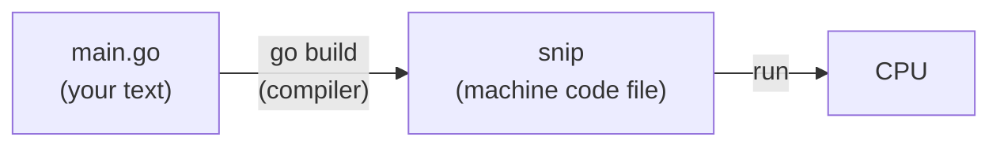

# 4.1 Why Go, and your first program

Everything so far has been *using* programs other people wrote. From here on, you write your own. If you've never programmed before, that can feel like a big leap — but you've already done the hardest part: you understand what a program *does* when it runs (Part 1) and how to drive a computer from the terminal (Part 2). Programming is writing down precise instructions for the cook from chapter 1.1. In this chapter you'll learn why we chose **Go** for that, write and run your first programs, and learn the handful of building blocks that every program in every language is made of.

## What you'll learn

- What **programming** is: writing precise instructions, in a **language**, that get turned into something the CPU can run.
- **Compiled vs interpreted** languages, and why Go is compiled.
- **Why Go** for backends — and what other languages you'll meet in the job market.
- The building blocks: **variables**, **types**, **functions**, **if**, **for** — the same ideas in every language.
- How to **run** and **build** Go programs, and how to read the compiler's error messages instead of fearing them.

---

## What programming actually is

A CPU only understands extremely small, numbered instructions (chapter 1.1) — nobody writes those by hand. Instead, we write in a **programming language**: text with strict rules, designed so humans can read it. A tool then translates that text into instructions the machine can run.

Here is a complete Go program:

```go
package main

import "fmt"

func main() {
	fmt.Println("Hello from Go!")
}
```

Five lines, and you already know what it does. That's the point of a programming language: precise enough for a machine, readable enough for a person.

:::note[Everyday anchor]
Programming is writing a recipe for a cook who is incredibly fast and completely literal. They'll do exactly what you wrote — no more, no less, no guessing what you "obviously meant". Every bug is a place where what you wrote and what you meant differ.
:::

### Compiled vs interpreted

There are two ways to get from your text to running instructions:

- **Interpreted** (Python, JavaScript, Ruby): a program called an **interpreter** reads your code and carries it out line by line, every time it runs.
- **Compiled** (Go, Rust, C, Java to a degree): a **compiler** translates your whole program into a machine-code file *once*, ahead of time. You then run that file directly.



Compiling has two big benefits for backends. The compiler **checks your whole program before it ever runs**, catching many mistakes (a misspelled name, a number where text is expected) at your desk rather than at 3 a.m. And the result is a **single fast file** you can copy to a server and run, with nothing else to install. That's exactly what snip's Dockerfile does (chapter 9.2).

---

## Why Go?

Many languages can build backends. This handbook uses **Go** (also called Golang), created at Google in 2009, because it's unusually well suited to both *learning* and *production*:

| Reason | Why it matters |
|---|---|
| **Small and readable** | The whole language fits in your head in a few weeks. Code written by others looks like code written by you. |
| **Compiled and fast** | Catches mistakes early; runs close to the speed of C; starts instantly. |
| **Built for servers** | A production-grade web server is in the standard library. Handling thousands of simultaneous requests is built in (chapter 4.5). |
| **One file to deploy** | `go build` produces one self-contained program — ideal for containers (Part 9). |
| **It runs the cloud** | Docker, Kubernetes, Terraform, Prometheus and much of the infrastructure in Parts 9–13 are written in Go. Reading their code becomes possible. |

:::info[In the real world]
You'll meet many languages in backend jobs. **Java** and **C#** dominate large companies; **Python** leads in data and AI (Part 14 uses it); **JavaScript/TypeScript** (Node.js) is common where teams share code with the frontend; **Go** is a favourite for cloud infrastructure and high-traffic services; **Rust** is growing where maximum performance and safety matter. The ideas in this part — types, functions, errors, interfaces, tests, concurrency — transfer to all of them. Learn one language well and the second takes weeks, not years.
:::

---

## Your first program, properly

You installed Go in chapter 0.2. Make a folder and a module (a Go project):

```bash
mkdir -p ~/code/hello && cd ~/code/hello
go mod init hello        # creates go.mod: this folder is a Go module named "hello"
```

Create `main.go` in VS Code:

```go
package main // this file belongs to package "main": a runnable program

import "fmt" // use the standard "fmt" package (formatting and printing)

// main is where every Go program starts.
func main() {
	fmt.Println("Hello from Go!") // print a line of text
}
```

Run it:

```bash
go run .                # compile and run in one step (for development)
go build -o hello .     # compile into a program file called "hello"
./hello                 # run that file — no Go needed on the machine it runs on
```

Line by line:

- **`package main`** — every Go file belongs to a **package**. `main` is special: it means "this is a program you can run".
- **`import "fmt"`** — use code from another package. `fmt` comes with Go; its name is short for "format".
- **`func main() { … }`** — a **function** called `main`. The program starts here and ends when it returns.
- **`fmt.Println(...)`** — call the `Println` function from the `fmt` package.
- **`//`** starts a **comment**: a note for humans that the compiler ignores.

Notice the tab indentation and spacing. Go has one official style, enforced by a tool: run `gofmt -w .` (VS Code's Go extension does it every time you save). There are no style arguments in Go teams — the tool decides.

---

## The building blocks

Every program in every language is built from the same few ideas. Here they are in Go.

### Variables: names for values

```go
name := "snip"            // := declares a new variable and gives it a value
links := 3
links = links + 1         // = changes an existing variable
var ready bool            // declare without a value: gets the "zero value", false
const maxSlugLength = 32  // a constant can never change
```

### Types: what kind of value

Every value in Go has a **type**, and the compiler checks you use it correctly.

| Type | Holds | Example |
|---|---|---|
| `string` | text | `"https://go.dev"` |
| `int` | whole numbers | `42`, `-7` |
| `float64` | numbers with fractions | `3.14` (not for money — chapter 1.3) |
| `bool` | true or false | `true` |

```go
count := 3
url := "https://go.dev"
fmt.Println(count + url) // compile error: can't add a number to text
```

That last line never runs: the compiler refuses to build it. In a language without this check, you'd find out when a user hit that line. This is what people mean by a **statically typed** language — types are known and checked *before* the program runs.

### Functions: named, reusable steps

A **function** takes inputs (**parameters**), does something, and can return outputs:

```go
// combinations returns symbols multiplied by itself length times.
func combinations(symbols int, length int) int {
	result := 1
	for i := 0; i < length; i++ {
		result = result * symbols
	}
	return result
}

total := combinations(56, 7)   // call it: total is 1727094849536
```

Read the first line as: *a function called `combinations`, taking two whole numbers, giving back a whole number.* Functions let you name an idea once and reuse it — and they're the unit you'll test (chapter 4.4).

Go functions can return **more than one value**. You'll see this everywhere, because it's how Go reports errors (chapter 4.2):

```go
n, err := strconv.Atoi("42")   // convert text to a number: returns the number AND an error
```

### if: making decisions

```go
if links == 0 {
	fmt.Println("no links yet")
} else if links < 10 {
	fmt.Println("a few links")
} else {
	fmt.Println("lots of links")
}
```

Comparisons: `==` equal, `!=` not equal, `<`, `<=`, `>`, `>=`. Combine them with `&&` (and), `||` (or), `!` (not).

### for: repeating

Go has only one loop keyword, `for`, used three ways:

```go
for i := 1; i <= 5; i++ {       // count from 1 to 5
	fmt.Println(i)
}

for attempts < 3 {              // repeat while a condition is true (a "while" loop)
	attempts++
}

for _, slug := range slugs {    // go through every item in a list (chapter 4.2)
	fmt.Println(slug)
}
```

:::info[If you've written code]
Coming from JavaScript or Python, the notable differences are: no semicolons at line ends, no parentheses around `if`/`for` conditions but braces are mandatory, `:=` for declaration, unused variables and imports are *compile errors* (keeping code tidy), and there are no exceptions — errors are ordinary return values (chapter 4.2).
:::

---

## Reading compiler errors

Beginners fear error messages. Experienced engineers are grateful for them: every error the compiler catches is a bug that never reaches a user. Go's errors are short and precise. The format is always `file:line:column: what's wrong`.

```text
./main.go:9:14: invalid operation: count + url (mismatched types int and string)
./main.go:4:2: "os" imported and not used
./main.go:12:2: declared and not used: total
./main.go:15:1: syntax error: unexpected }, expected expression
```

How to read them:

1. **Go to the file and line.** VS Code does this when you click the message.
2. **Read the words literally.** "imported and not used" means exactly that — delete the import or use it.
3. **Fix the first error first.** One mistake (like a missing brace) can cause a cascade of confusing errors after it. Fix the top one, rebuild, repeat.

:::warning[What can go wrong]
- **Unused variables and imports are errors, not warnings.** Go insists on tidy code. While experimenting, it's normal to hit these often.
- **Mixing up `=` and `:=`.** `:=` creates a new variable; `=` changes an existing one. Using `:=` inside an `if` block can accidentally create a *new* variable with the same name, leaving the outer one unchanged — a classic subtle bug.
- **Integer division.** `7 / 2` is `3` in Go (both are `int`, so the fraction is dropped). Use `7.0 / 2` for `3.5`.
:::

---

## Lab

Free, on your own computer.

1. **Run the handbook's examples.** From the repository you cloned in chapter 1.6:
   ```bash
   cd ~/code/zero-to-prod/snip
   go run ./examples/hello          # the smallest possible program
   go run ./examples/basics         # variables, a function, a loop
   go run ./examples/basics 7       # pass an argument
   go run ./examples/basics seven   # see how the program handles bad input
   ```
   Open `examples/basics/main.go` in VS Code and match every line of output to the line of code that produced it.

2. **Write your own.** In `~/code/hello`, change `main.go` to print a short link for each of three URLs:
   ```go
   package main

   import "fmt"

   func main() {
   	urls := []string{"https://go.dev", "https://github.com", "https://example.com"}
   	for i, u := range urls {
   		fmt.Printf("snip.example/link%d -> %s\n", i+1, u)
   	}
   }
   ```
   Run it with `go run .`. `[]string{…}` is a list of strings (chapter 4.2), and `Printf` fills the `%d` (a number) and `%s` (a string) placeholders.

3. **Break it on purpose, and read the errors.** One at a time, make each change, run `go run .`, read the error, then undo it:
   - Delete the closing `}` of `main`.
   - Add `import "os"` without using it.
   - Change `i+1` to `i + "1"`.
   - Add the line `total := 5` and never use `total`.

   Notice every error names the exact file, line and problem. Being comfortable in this loop — change, run, read, fix — is most of programming.

4. **Build a real program file.**
   ```bash
   go build -o hello . && ls -lh hello && ./hello
   ```
   Notice the size (a couple of megabytes): the Go runtime and everything it needs are inside that one file.

## Self-check

<Quiz
  id="go-why-go-first-program"
  questions={[
    {
      q: 'What is the main difference between a compiled language like Go and an interpreted one like Python?',
      options: [
        'Compiled programs can only run on the machine they were built on',
        'Go checks and translates the program to machine code first; Python reads it as it runs',
        'Interpreted languages have no types, so they cannot catch any mistakes',
        'Compiled code needs no runtime, while interpreted code needs a server',
      ],
      answer: 1,
      explain: 'Compiling happens once, before running, and catches many mistakes early. The output is a standalone program file. An interpreter translates and runs your code every time it executes.',
    },
    {
      q: 'What will the compiler say about: count := 3; fmt.Println(count + "links")?',
      options: [
        'Nothing — Go converts 3 to text and prints 3links',
        'Mismatched types: you can’t add an int and a string',
        'It compiles, then prints 3 and quietly ignores "links"',
        'It compiles, then crashes at runtime on that line',
      ],
      answer: 1,
      explain: 'Go is statically typed: the compiler checks types before the program runs and refuses to build this. That mistake can never reach a user.',
    },
    {
      q: 'In a Go program, where does execution start?',
      options: [
        'At the first line of the file',
        'At the func main() in package main',
        'At the last function in the file',
        'At the import statements',
      ],
      answer: 1,
      explain: 'A runnable Go program is package main, and it starts by calling func main(). When main returns, the program ends.',
    },
    {
      q: 'You see ten compile errors after a small change. What is the best strategy?',
      options: [
        'Fix them from the bottom up, since the last one is the newest',
        'Fix the first, rebuild and repeat: later errors often come from it',
        'Undo the change and make it again, more slowly this time',
        'Run the program anyway; some compile errors are only warnings',
      ],
      answer: 1,
      explain: 'A single mistake, like a missing brace, can confuse the compiler about everything after it. Fixing the first error often makes several others disappear.',
    },
  ]}
/>

<details>
<summary>Give three reasons Go suits backend services, in your own words.</summary>

Any three of: it's **compiled**, so many mistakes are caught before the program runs; it's **fast** and starts instantly; it produces **one self-contained file** that's easy to ship in a container; its **standard library includes a production-ready web server**; it makes **handling many requests at once** easy (goroutines, chapter 4.5); it's **small and readable**, so teams can understand each other's code; and much of the **cloud tooling** you'll use (Docker, Kubernetes, Terraform) is written in it.

</details>

<details>
<summary>What does <code>n, err := strconv.Atoi("42")</code> tell you about how Go works?</summary>

That Go functions can **return more than one value**, and that Go reports errors as **ordinary values** rather than by throwing exceptions. `Atoi` ("ASCII to integer") returns the number *and* an error. If the text wasn't a number, `err` is not `nil` and you must decide what to do. You'll see the pattern `if err != nil { … }` constantly — chapter 4.2 explains why Go chose this style.

</details>
