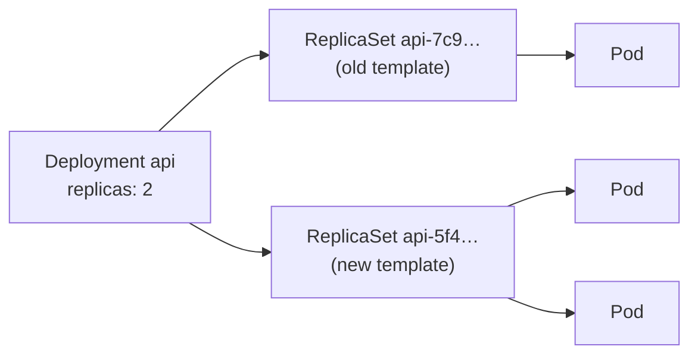

# 10.2 Core objects: Pods, Deployments and friends

Chapter 10.1 ran snip with one imperative command. Real deployments are **files**: YAML manifests, kept in Git, that describe every object snip needs. Kubernetes has dozens of object types, but a handful do nearly all the everyday work. This chapter builds them up in the order they depend on each other: the **Pod** (containers that run together), the **Deployment** (keeps N identical Pods running and upgrades them safely), and the objects for work that doesn't fit that mould: databases, per-node agents and batch jobs. Along the way come the settings that separate a toy from a production workload: **health probes**, **resource requests and limits**, and **security settings**. Then you'll deploy snip's full manifests (Postgres, Redis, API, worker) to your kind cluster, and roll out a new version while traffic flows, with zero failed requests.

## What you'll learn

- The **anatomy of a manifest**: `apiVersion`, `kind`, `metadata`, `spec`, `status`.
- **Pods**, and **labels and selectors**, the glue that connects everything.
- **Deployments** and ReplicaSets: replicas, **rolling updates**, **rollbacks**.
- **Probes** (startup, liveness, readiness) and **requests and limits**.
- **StatefulSets**, **DaemonSets**, **Jobs** and **CronJobs**, and when to use each.
- **Namespaces**, **kustomize**, and the everyday `kubectl` commands.

---

## Anatomy of a manifest

Every Kubernetes object has the same shape:

```yaml
apiVersion: apps/v1          # which API group and version defines this kind
kind: Deployment             # what type of object
metadata:
  name: api                  # unique within its namespace and kind
  namespace: snip
  labels:                    # key/value tags for finding and grouping objects
    app.kubernetes.io/name: api
spec:                        # DESIRED state: you write this
  replicas: 2
  ...
status:                      # OBSERVED state: Kubernetes writes this
  readyReplicas: 2
```

You write `spec`; controllers write `status`; the gap between them is what reconciliation loops close (chapter 10.1). `kubectl explain` documents every field, straight from the cluster:

```bash
kubectl explain deployment.spec.strategy
kubectl explain pod.spec.containers.readinessProbe
```

---

## Pods: the smallest unit

A **Pod** is one or more containers that are always scheduled together on the same node, share one network namespace (one IP address; they reach each other on `localhost`), and can share volumes. Usually a Pod holds one main container. Extra containers are for tightly coupled helpers: a **sidecar** (a log shipper or proxy running alongside), or an **init container** that runs to completion before the main one starts.

:::note[Everyday anchor]
If a container is a person, a Pod is a **shared hotel room**. Everyone in the room is checked in and out together, shares one room number (IP address) and one phone line (ports), and can leave things for each other on the table (shared volumes). Most rooms have one guest. Sometimes a guest brings an assistant (a sidecar).
:::

Pods are **disposable**. When one dies, or its node dies, it's never repaired or moved. A **new** Pod, with a new name and a new IP address, is created in its place. That's why you almost never create Pods directly: you create an object that **manages** Pods for you, and you reach them through a Service (chapter 10.3), never by IP.

### Labels and selectors

**Labels** are key/value tags on any object (`app.kubernetes.io/name: api`). **Selectors** are queries over labels ("every Pod with `app.kubernetes.io/name=api`"). They're how objects find each other, without hard-coded names or IPs:

- A Deployment manages the Pods matching its selector.
- A Service sends traffic to the Pods matching its selector.
- You filter with them: `kubectl get pods -l app.kubernetes.io/name=api`.

`app.kubernetes.io/name` and `app.kubernetes.io/part-of` are Kubernetes' **recommended labels**, which tools and dashboards understand. snip's kustomization adds `part-of: snip` to every object.

---

## Deployments: N identical Pods, upgraded safely

A **Deployment** keeps a set of identical, stateless Pods running, and changes them safely when you change the Pod template. It's the object for web servers, APIs and workers: most of what you run. Here's the core of snip's (`snip/deploy/k8s/base/api.yaml`):

```yaml
apiVersion: apps/v1
kind: Deployment
metadata:
  name: api
spec:
  replicas: 2
  selector:
    matchLabels:
      app.kubernetes.io/name: api            # "the Pods I manage are the ones with this label"
  strategy:
    rollingUpdate:
      maxUnavailable: 0                      # never drop below 2 ready copies during a rollout
      maxSurge: 1                            # allow 1 extra copy while replacing
  template:                                  # the Pod to stamp out, N times
    metadata:
      labels:
        app.kubernetes.io/name: api          # must match the selector
    spec:
      containers:
        - name: api
          image: ghcr.io/jawwadzafar/snip:main
          envFrom:
            - configMapRef: { name: snip-config }
            - secretRef: { name: snip-db }
          ports:
            - name: http
              containerPort: 8080
```

Under the hood, a Deployment manages **ReplicaSets**, and each ReplicaSet manages Pods. Every time the Pod `template` changes (a new image, a new environment variable), the Deployment creates a **new** ReplicaSet and shifts Pods from the old one to the new one:



### Rolling updates and rollbacks

With `maxSurge: 1` and `maxUnavailable: 0`, a rollout of 2 replicas goes: start 1 new Pod → wait until it's **ready** → stop 1 old Pod → start another new one → wait until ready → stop the last old one. Capacity never drops below 2, and **a new version that never becomes ready stops the rollout** before it can take down the old Pods. Then:

```bash
kubectl rollout status deployment/api       # follow a rollout until it finishes (or fails)
kubectl rollout history deployment/api      # the revisions (old ReplicaSets are kept, 10 by default)
kubectl rollout undo deployment/api         # go back to the previous revision
```

Old ReplicaSets are kept, scaled to zero, which is what makes `undo` instant: it's just another rollout, back to the previous template.

The other strategy, `Recreate`, stops all old Pods before starting new ones. That means downtime, but it's needed when two versions must never run at once.

---

## Health probes: alive, ready, started

The kubelet asks each container three different questions (chapter 5.4 introduced `/healthz` and `/readyz` for exactly this):

| Probe | Question | If it fails… | snip uses |
|---|---|---|---|
| **startupProbe** | Has it finished starting? | Keep waiting (up to a limit); other probes don't run yet | `/healthz`, every 2 s, up to 30 times: time for migrations on first start |
| **livenessProbe** | Is it alive, or stuck? | **Restart the container** | `/healthz`: never checks dependencies |
| **readinessProbe** | Should it receive traffic right now? | **Take it out of the Service**, but don't restart it | `/readyz`: checks Postgres and Redis |

The difference between liveness and readiness matters enormously. If Postgres goes down and the **liveness** probe checked the database, Kubernetes would restart every API Pod, again and again, which fixes nothing and adds a restart storm to a database outage. With snip's split, Pods stay alive but are marked **not ready**, so traffic stops going to them, and they come back into service by themselves once the database recovers.

:::warning[What can go wrong]
- **Liveness probes that check dependencies**: one database blip restarts everything.
- **No readiness probe**: new Pods get traffic before they can serve it, and rollouts cause errors.
- **No startup probe on slow starters**: the liveness probe kills the container before it ever finishes starting, forever (`CrashLoopBackOff`, chapter 10.5).
- **Timeouts too tight**: a probe with a 1-second timeout on a busy Pod fails under load, restarting healthy Pods exactly when you need them.
:::

### Graceful shutdown

When a Pod is removed (a rollout, scale-down, node drain), Kubernetes does two things **at the same time**: it removes the Pod from Service endpoints, and it starts shutting the Pod down. The endpoint removal takes a moment to reach every node, so a Pod that exits instantly can still receive a few requests after it's gone, and they fail. snip's manifest closes that race:

```yaml
lifecycle:
  preStop:
    sleep:
      seconds: 5          # keep serving for 5 s while the Service stops routing here
terminationGracePeriodSeconds: 30
```

The `preStop` hook runs first. Then the container gets SIGTERM, finishes its in-flight requests (snip's graceful shutdown, chapter 5.4), and exits. Only after the grace period would it be killed. snip's CI rolls out a new version while a client sends ten requests a second to the Service, and requires **zero** failures.

---

## Requests and limits

Each container declares the CPU and memory it needs:

```yaml
resources:
  requests: { cpu: 100m, memory: 64Mi }    # reserved: used by the scheduler
  limits:   { memory: 256Mi }              # enforced: cgroup limit (chapter 9.1)
```

- **Requests** are what the **scheduler** uses. A Pod goes only to a node with that much *unreserved* capacity, and it's guaranteed that much. `100m` is 100 **millicores**: a tenth of one CPU core.
- **Limits** are enforced by the kernel's cgroups. Over the **memory** limit, the container is **OOM-killed** (exit code 137, chapter 9.1) and restarted. Over a **CPU** limit, it's throttled (slowed), never killed.
- A common, sensible pattern (snip's): set CPU and memory **requests**, a memory **limit**, and no CPU limit. CPU limits often cause surprising throttling, while memory has no "slow down" option.

Requests matter more than they look. Without them, the scheduler can pack too many Pods onto one node, and the autoscaler (chapter 8.6) measures CPU as a **percentage of requests**. snip's HPA "70% CPU" means 70% of 100m.

---

## The other workload objects

| Object | Runs | Use for | In snip |
|---|---|---|---|
| **Deployment** | N identical, interchangeable Pods | Stateless services: APIs, web apps, workers | `api`, `worker`, `redis` |
| **StatefulSet** | N Pods with **stable identities** (`postgres-0`, `postgres-1`), started in order, each with **its own persistent volume** | Databases, message brokers, anything where each copy owns data | `postgres` |
| **DaemonSet** | **One Pod on every node** (or chosen nodes) | Per-node agents: log collectors, monitoring, networking | (none; kube-proxy is one) |
| **Job** | Pods that **run to completion**, retried on failure | Migrations, batch processing, one-off tasks | (could run `snip migrate`) |
| **CronJob** | A Job **on a schedule** (cron syntax, chapter 2.5) | Nightly reports, cleanups, backups | (a nightly Postgres backup) |

snip's Postgres uses a StatefulSet with a `volumeClaimTemplates` entry, so its Pod `postgres-0` always gets the same disk (`data-postgres-0`), even when it's recreated on another node. Chapter 10.4 covers storage properly.

---

## Namespaces, kustomize and kubectl

A **namespace** is a named group of objects: `snip`, `kube-system`, `monitoring`. Names only need to be unique within a namespace. You can apply permissions and quotas per namespace, and deleting a namespace deletes everything in it. Namespaces aren't a security boundary on their own: Pods in different namespaces can still talk to each other unless NetworkPolicies say otherwise (chapter 10.3).

**kustomize** (built into `kubectl`, via `-k`) assembles a set of manifests and customises them without templates. snip's `deploy/k8s/base/kustomization.yaml` lists the files, puts everything in the `snip` namespace, adds labels, and sets the image. The `overlays/kind` directory reuses the base, and changes only the image to one you built yourself:

```yaml title="snip/deploy/k8s/overlays/kind/kustomization.yaml"
resources:
  - ../../base
images:
  - name: ghcr.io/jawwadzafar/snip
    newName: snip
    newTag: dev
```

The everyday commands:

| Command | Does |
|---|---|
| `kubectl apply -k DIR` / `-f FILE` | Make the cluster match these manifests (create or update) |
| `kubectl diff -k DIR` | Show what `apply` would change, before applying |
| `kubectl get pods -n snip -o wide` | List objects (`-o yaml` for the full object; `-w` to watch) |
| `kubectl describe pod NAME` | Details plus recent **events**: the first place to look when something's wrong |
| `kubectl logs deploy/api -f` | Container output (`--previous` for the last crashed container) |
| `kubectl exec -it deploy/api -- CMD` | Run a command in a container |
| `kubectl port-forward svc/api 8080:80` | Tunnel a local port to a Service or Pod |
| `kubectl rollout status/history/undo` | Follow, inspect and revert Deployments |
| `kubectl delete -k DIR` | Delete what those manifests created |

Set a default namespace to save typing: `kubectl config set-context --current --namespace=snip`.

:::warning[What can go wrong]
The first time snip's manifests ran in CI, **no snip Pod ever started**. `kubectl describe pod` showed `CreateContainerConfigError` and this event:

```text
Error: container has runAsNonRoot and image has non-numeric user (nonroot),
cannot verify user is non-root
```

snip's Pods set `runAsNonRoot: true`, a promise the kubelet must check before starting the container. The image's `USER nonroot` is a *name*, and the kubelet can't look up names inside the image, so it refuses rather than guess. The fix is to state the numeric user ID in the Pod's `securityContext` (`runAsUser: 65532`, distroless's `nonroot`), or to use `USER 65532:65532` in the Dockerfile. Two lessons: security settings fail **closed**, which is what you want; and `describe` plus **Events** is where the reason always is.
:::

:::info[In the real world]
Production manifests are almost never applied by hand from a laptop. They live in Git, are validated in CI (schema checks like **kubeconform**, policy checks), and are applied by a pipeline or a GitOps controller that continuously reconciles the cluster with the repository (chapter 11.4). Teams also standardise on **Helm** charts (chapter 10.6) or kustomize, and enforce security settings like snip's (non-root, read-only root filesystem, no privilege escalation, all capabilities dropped) cluster-wide with **Pod Security Standards**, where the `restricted` level requires exactly these.
:::

---

## Lab

Free, on your kind cluster from chapter 10.1. Every step here runs in snip's CI on a fresh kind cluster on every push.

1. **Build snip and load it into the cluster.** kind's node can't see your local Docker images, so you copy the image in:
   ```bash
   cd ~/code/zero-to-prod/snip
   docker build -t snip:dev .
   kind load docker-image snip:dev --name z2p
   ```
   (Or skip this and apply `deploy/k8s/base` instead of the overlay, to use the image CI published.)

2. **Read, then apply.**
   ```bash
   kubectl kustomize deploy/k8s/overlays/kind | less     # the final YAML that will be applied
   kubectl apply -k deploy/k8s/overlays/kind
   kubectl -n snip get pods -w                           # Ctrl-C once all are Running and READY 1/1
   ```
   Watch the order things settle in. The API Pods may restart or stay not-ready until Postgres is ready: probes and retries at work.

3. **Explore.**
   ```bash
   kubectl -n snip get deploy,rs,sts,pods,svc,pvc
   kubectl -n snip describe deploy/api | tail -20       # events: ReplicaSet scaled…
   kubectl -n snip logs deploy/worker
   kubectl explain deployment.spec.strategy.rollingUpdate
   ```

4. **Use it.**
   ```bash
   kubectl -n snip port-forward svc/api 8080:80 &
   KEY=$(kubectl -n snip exec deploy/api -- snip keys create me | grep -o 'snip_[A-Za-z0-9]*')
   SNIP_API_KEY="$KEY" ./scripts/smoke.sh http://localhost:8080        # [smoke] PASS
   ```

5. **Roll out a change while traffic flows.** Start a Pod that calls the Service ten times a second for 45 seconds and counts failures:
   ```bash
   kubectl -n snip run probe --image=curlimages/curl:8.22.0 --restart=Never --command -- sh -c '
     ok=0; bad=0; end=$(( $(date +%s) + 45 ))
     while [ "$(date +%s)" -lt "$end" ]; do
       if curl -fs -m 2 http://api/healthz > /dev/null; then ok=$((ok+1)); else bad=$((bad+1)); fi
       sleep 0.1
     done; echo "ok=$ok bad=$bad"'
   kubectl -n snip set env deploy/api SNIP_LOG_LEVEL=debug       # changes the Pod template → rollout
   kubectl -n snip rollout status deploy/api
   kubectl -n snip get rs                                        # old ReplicaSet at 0, new at 2
   ```
   After 45 seconds, `kubectl -n snip logs probe` should show `bad=0`. Now remove the `preStop` block from `api.yaml`, re-apply, and repeat (delete the old probe Pod first with `kubectl -n snip delete pod probe`). You may see a few failures: the shutdown race described above.

6. **Roll back.**
   ```bash
   kubectl -n snip rollout history deploy/api
   kubectl -n snip rollout undo deploy/api
   ```
   Keep everything running for chapter 10.3.

## Self-check

<Quiz
  id="kubernetes-core-objects"
  questions={[
    {
      q: 'Why do you almost never create Pods directly?',
      options: [
        'Pods cannot be created with YAML',
        'Pods are disposable and aren’t recreated if they die; a Deployment, StatefulSet or Job manages them and replaces them',
        'Pods are only for system components',
        'Pods cost more',
      ],
      answer: 1,
      explain: 'A bare Pod that dies stays dead. Controllers keep the desired number of Pods running.',
    },
    {
      q: 'What connects a Deployment or a Service to its Pods?',
      options: [
        'The Pods’ IP addresses',
        'Labels on the Pods, matched by the object’s selector',
        'The order the Pods were created',
        'The container names',
      ],
      answer: 1,
      explain: 'Pods come and go with new names and IPs. Labels and selectors keep the connection stable.',
    },
    {
      q: 'snip’s readiness probe checks Postgres, but its liveness probe does not. Why?',
      options: [
        'Liveness probes cannot make HTTP requests',
        'If liveness checked the database, a database outage would restart every API Pod repeatedly; readiness just stops sending them traffic until the database recovers',
        'Readiness probes run less often',
        'It is a mistake',
      ],
      answer: 1,
      explain: 'Liveness failure means "restart me". Readiness failure means "don’t send me traffic right now".',
    },
    {
      q: 'With replicas: 2, maxSurge: 1 and maxUnavailable: 0, what happens if the new version never becomes ready?',
      options: [
        'Both old Pods are replaced anyway',
        'The rollout stalls: one new Pod exists but isn’t ready, and the two old Pods keep serving',
        'The Deployment is deleted',
        'Kubernetes rolls back automatically and deletes the image',
      ],
      answer: 1,
      explain: 'Old Pods are only removed when new ones are ready. Fix forward, or kubectl rollout undo.',
    },
    {
      q: 'A container uses more memory than its limit. What happens?',
      options: [
        'It is slowed down',
        'The kernel OOM-kills it (exit code 137) and the kubelet restarts it',
        'Kubernetes gives it more memory',
        'Nothing; limits are advisory',
      ],
      answer: 1,
      explain: 'Memory can’t be throttled, so exceeding the limit kills the container. CPU over its limit is throttled instead.',
    },
    {
      q: 'Which object should run Postgres, where each copy needs a stable name and its own disk?',
      options: ['Deployment', 'StatefulSet', 'DaemonSet', 'CronJob'],
      answer: 1,
      explain: 'StatefulSets give each Pod a stable identity (postgres-0) and its own PersistentVolumeClaim that follows it.',
    },
  ]}
/>

<details>
<summary>Explain why a rolling update could cause a few failed requests without the preStop sleep, even though snip shuts down gracefully.</summary>

When a Pod is deleted, two things start **in parallel**:
1. The control plane removes the Pod from the Service's endpoints, and every node's kube-proxy (and any load balancer or ingress) must then update its routing. That takes a moment to propagate.
2. The kubelet sends the container SIGTERM, and snip starts shutting down: it stops accepting new connections and finishes in-flight requests.

If (2) happens faster than (1) finishes, some nodes still route new requests to a Pod that has stopped accepting connections, and those requests fail. snip's graceful shutdown handles requests already in progress, not new ones that arrive after it stopped listening. The `preStop` sleep delays SIGTERM by 5 seconds. The Pod keeps serving normally while the endpoint removal propagates everywhere, and only then begins shutting down. By then no new traffic is arriving.

</details>

<details>
<summary>Your API Pods show READY 0/1 and never become ready, but logs show no errors. How do you investigate?</summary>

1. `kubectl describe pod NAME` and read the **Events** at the bottom: failing readiness probes are reported there with the HTTP status or error.
2. Check what the readiness probe checks. For snip, `/readyz` pings Postgres and Redis, so check those Pods are Running and ready, and that their Services exist: `kubectl get pods,svc`.
3. Test the endpoint yourself from inside the cluster, e.g. `kubectl run -it --rm debug --image=curlimages/curl:8.22.0 --restart=Never -- curl -v http://api/readyz`, or port-forward to one Pod and curl `/readyz`.
4. Check the configuration the Pod actually received: `kubectl exec deploy/api -- env` isn't possible in distroless, but `kubectl get pod NAME -o yaml` shows the env sources, and `kubectl get cm snip-config -o yaml` shows values. A typo in `SNIP_REDIS_ADDR` is a classic cause.
5. Check probe settings: a port name or path typo, or a timeout too short for the check.

</details>
