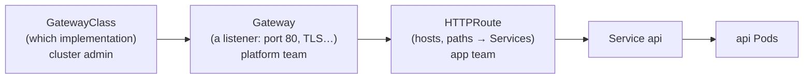

# 10.3 Networking: Services, DNS, Gateways & policies

Pods come and go with new IP addresses every time (chapter 10.2). Yet snip's API always reaches Postgres at `postgres:5432`, the probe Pod in the last lab called `http://api/healthz` through a whole rolling update without a single failure, and outside users need one stable address to type into a browser. This chapter explains the layers that make that work. First the **Pod network**, where every Pod can reach every other. Then **Services**: stable names and addresses in front of changing Pods. Then **DNS**, which turns names into those addresses. Then **Gateways and Ingress**, the front door from outside. And finally **NetworkPolicies**, which turn "everything can talk to everything" into "only what should". You'll put snip behind a real Gateway and prove its database accepts connections only from snip.

## What you'll learn

- The Kubernetes **network model**: one flat network, an IP per Pod.
- **Services**: ClusterIP, NodePort, LoadBalancer and headless, and how kube-proxy and **EndpointSlices** make them work.
- **Cluster DNS** and service discovery: `api`, `api.snip`, `api.snip.svc.cluster.local`.
- Getting traffic in: **Ingress**, the newer **Gateway API**, and `port-forward` for debugging.
- **NetworkPolicies**: default-deny, and allowing just what's needed.

---

## The Pod network

Kubernetes' network model makes three promises:

1. **Every Pod gets its own IP address.**
2. **Every Pod can reach every other Pod** by that IP, on any node, without NAT.
3. Agents on a node (like the kubelet) can reach all Pods on that node.

How that's achieved is left to a **CNI plugin** (Container Network Interface): kindnet in kind, Calico, Cilium, or your cloud's own (for example, AWS's VPC CNI gives Pods real VPC addresses, chapter 12.2). From your app's point of view it's simple: one big flat network, where containers in a Pod share an IP and everything else is reachable. And because Pod IPs change constantly, **nothing should ever depend on a Pod's IP**. That's what Services are for.

---

## Services: a stable front for changing Pods

A **Service** gives a set of Pods (chosen by a label selector) one stable virtual IP address and DNS name, and load-balances connections across whichever of those Pods are **ready**. snip's:

```yaml
apiVersion: v1
kind: Service
metadata:
  name: api
spec:
  selector:
    app.kubernetes.io/name: api      # the Pods behind this Service
  ports:
    - name: http
      port: 80                       # what clients connect to
      targetPort: http               # the container port named "http" (8080)
```

:::note[Everyday anchor]
A Service is a company's **main phone number**. Customers always dial the same number. Behind it, the switchboard forwards each call to whichever staff member is at their desk right now (ready Pods). Staff join, leave and change desks (Pods replaced, new IPs); the number never changes. Someone on a break (not ready) simply doesn't get calls.
:::

How it works underneath:

- The **EndpointSlice** controller watches Pods matching the selector and keeps a list of the **ready** ones' IPs and ports. This is how readiness probes (chapter 10.2) take a Pod out of rotation.
- **kube-proxy** on every node watches Services and EndpointSlices and programs the node's packet filtering (iptables or nftables rules, or IPVS) so a connection to the Service's virtual IP is redirected to one of the endpoints. Some CNIs, like Cilium, replace kube-proxy with eBPF programs doing the same job.
- Load balancing happens **per connection**, not per request. A client that keeps one HTTP/2 or keep-alive connection open (chapter 5.4) sticks to one Pod. That's fine for many small clients, and a known surprise for gRPC between two services.

```bash
kubectl -n snip get svc api                 # the ClusterIP
kubectl -n snip get endpointslices -l kubernetes.io/service-name=api -o wide   # the ready Pod IPs behind it
```

### Service types

| Type | Reachable from | How | Use for |
|---|---|---|---|
| **ClusterIP** (default) | Inside the cluster only | A virtual IP in the cluster's service range | Almost everything: internal services, databases |
| **NodePort** | Outside, via any node's IP | Opens the same high port (30000–32767) on every node | Rarely directly; building block for load balancers |
| **LoadBalancer** | Outside, via a cloud load balancer | The cloud provider creates a real load balancer pointing at the nodes | Exposing one service directly in the cloud |
| **Headless** (`clusterIP: None`) | Inside | No virtual IP: DNS returns the Pod IPs themselves | StatefulSets, where clients need a *specific* Pod (`postgres-0.postgres`) |
| **ExternalName** | Inside | A DNS alias (CNAME) to an outside name | Giving an external database a cluster-internal name |

On kind, `LoadBalancer` Services stay `<pending>` forever, because no cloud is there to create a load balancer. (The kind project offers `cloud-provider-kind` to simulate one.) For local work you use `port-forward`, or a Gateway reached through a port-forward, as in the lab.

---

## DNS: service discovery by name

Every cluster runs a DNS server (**CoreDNS**, in `kube-system`), and every Pod is configured to use it. Each Service gets a name:

```text
api.snip.svc.cluster.local
└┬┘ └┬─┘ └──────┬────────┘
 │   │          └ the cluster's domain
 │   └ namespace
 └ service name
```

Pods also get **search domains**, so shorter names work:

| From a Pod in… | Name | Resolves? |
|---|---|---|
| `snip` | `api` | Yes: same namespace |
| any namespace | `api.snip` | Yes |
| anywhere | `api.snip.svc.cluster.local` | Yes, fully qualified |
| `monitoring` | `api` | **No** (it looks for `api` in `monitoring`) |

That's why snip's config says `SNIP_REDIS_ADDR: redis:6379` and its database URL says `@postgres:5432`: the same pattern as Compose (chapter 9.3), because the same idea is underneath. Try it from inside the cluster:

```bash
kubectl -n snip run dns --rm -it --image=alpine:3.22 --restart=Never -- \
  sh -c 'nslookup api.snip.svc.cluster.local; wget -qO- http://api/healthz'
```

The `nslookup` shows the full name resolving to the Service's ClusterIP; the `wget` to plain `api` works thanks to the search domains. (busybox's `nslookup` may not apply search domains itself, so give it the full name.)

---

## Getting traffic in from outside

A ClusterIP Service is invisible outside the cluster. Three ways in, from debugging to production:

**1. `kubectl port-forward`** tunnels a port on your machine through the API server to a Pod or Service. It's perfect for debugging, and not a way to serve users: it runs on your laptop and goes through the API server.

**2. Ingress** is the original Kubernetes object for HTTP routing: "requests for `snip.example.com` go to Service `api`". An **Ingress controller** (a reverse proxy running in the cluster, chapter 8.3) reads Ingress objects and configures itself. Ingress works, and you'll meet it in many existing clusters, but it's limited: routing beyond host and path, TLS details and timeouts all live in controller-specific **annotations** that differ per controller. The long-popular community **ingress-nginx** controller has been **retired**, and new setups are steered towards the Gateway API.

**3. The Gateway API** is Ingress's successor: a set of standard objects with richer, portable routing, split by role:



snip's (`snip/deploy/k8s/gateway/gateway.yaml`):

```yaml
apiVersion: gateway.networking.k8s.io/v1
kind: Gateway
metadata:
  name: snip
  namespace: snip
spec:
  gatewayClassName: eg                  # Envoy Gateway, one of many implementations
  listeners:
    - name: http
      protocol: HTTP
      port: 80
---
apiVersion: gateway.networking.k8s.io/v1
kind: HTTPRoute
metadata:
  name: snip
  namespace: snip
spec:
  parentRefs:
    - name: snip                        # attach to the Gateway above
  hostnames:
    - snip.localhost
  rules:
    - matches:
        - path: { type: PathPrefix, value: / }
      backendRefs:
        - name: api
          port: 80
```

The Gateway API is implemented by many controllers (Envoy Gateway, NGINX Gateway Fabric, Traefik, Istio, Cilium, and the clouds' own load balancers), and the objects are the same for all of them. In the cloud, creating a Gateway typically provisions a real load balancer with a public IP. HTTPRoutes also support header matching, traffic splitting by weight (for canary releases, chapter 11.3), redirects, and header changes, all without annotations.

:::warning[What can go wrong]
Unlike the nginx configuration in chapter 8.3, this route sends **every** path to snip, including `/metrics`, so the metrics are public through the Gateway. Production setups serve metrics on a **separate port** that no Service or route exposes, and scrape that port from inside the cluster. It's a good exercise: add a `SNIP_METRICS_ADDR` setting to snip, and scrape it in `deploy/prometheus/prometheus.yml`.
:::

---

## NetworkPolicies: who may talk to whom

By default, the flat network means **any Pod can connect to any Pod**, in any namespace. If an attacker gets code running in *any* container, your database is one connection away. A **NetworkPolicy** restricts traffic to the Pods it selects, like a firewall defined with labels (chapter 7.4's least privilege, for the network).

The standard pattern is **deny by default, then allow what's needed**. snip's policies (`snip/deploy/k8s/base/networkpolicy.yaml`):

```yaml
# Deny all incoming traffic to every Pod in the namespace…
kind: NetworkPolicy
metadata: { name: default-deny-ingress }
spec:
  podSelector: {}
  policyTypes: ["Ingress"]
---
# …Postgres accepts only snip's API and worker, on 5432.
kind: NetworkPolicy
metadata: { name: postgres-from-snip }
spec:
  podSelector:
    matchLabels: { app.kubernetes.io/name: postgres }
  policyTypes: ["Ingress"]
  ingress:
    - from:
        - podSelector:
            matchExpressions:
              - { key: app.kubernetes.io/name, operator: In, values: [api, worker] }
      ports:
        - port: 5432
```

Plus the same for Redis, and one allowing the API's port 8080 from anywhere (so the Gateway and your port-forwards work). Things to know:

- Policies are **additive allow-lists**. Once any policy selects a Pod for a direction (ingress or egress), only traffic some policy allows is permitted in that direction.
- Enforcement depends on the **CNI plugin**. Calico and Cilium enforce policies, and recent kind versions do too. On a CNI that doesn't, policies are silently ignored. Test that yours are enforced (the lab does).
- **Egress** policies (what a Pod may connect *out* to) are powerful too: a compromised API Pod that can't open connections to the internet can't easily send your data out. Remember to allow DNS (port 53 to CoreDNS), or nothing will resolve.

:::info[In the real world]
Larger platforms add a **service mesh** (Istio, Linkerd, Cilium's mesh). Sidecar or node proxies give every connection mutual TLS (chapter 7.3), retries, per-request load balancing (fixing the gRPC problem above) and detailed traffic metrics, without changing the application. It's powerful and adds real operational weight. Most teams start with Services, a Gateway and NetworkPolicies, and add a mesh only when they need what it offers.
:::

---

## Lab

Free, on your kind cluster with snip deployed (chapter 10.2). Every step here runs in snip's CI on a fresh kind cluster.

1. **Look at a Service and its endpoints.**
   ```bash
   kubectl -n snip get svc
   kubectl -n snip get endpointslices -l kubernetes.io/service-name=api -o wide
   kubectl -n snip get pods -l app.kubernetes.io/name=api -o wide          # the same IPs
   ```

2. **Resolve names from inside the cluster**, using the `nslookup`/`wget` command from "DNS: service discovery by name".

3. **Install a Gateway implementation** (Envoy Gateway, with Helm; chapter 10.6 explains Helm) and snip's Gateway and route:
   ```bash
   helm install eg oci://docker.io/envoyproxy/gateway-helm --version v1.9.1 \
     -n envoy-gateway-system --create-namespace --wait
   kubectl apply -f deploy/k8s/gateway/gateway.yaml
   kubectl -n snip wait --for=condition=Programmed gateway/snip --timeout=120s
   ```
   Envoy Gateway runs the actual proxy as a Service in its own namespace. Forward a port to it and send a request with the route's hostname:
   ```bash
   SVC=$(kubectl -n envoy-gateway-system get svc -l gateway.envoyproxy.io/owning-gateway-name=snip -o name)
   kubectl -n envoy-gateway-system port-forward "$SVC" 8888:80 &
   curl -s -H "Host: snip.localhost" localhost:8888/healthz        # {"status":"ok"}
   curl -s -o /dev/null -w "%{http_code}\n" -H "Host: other.example" localhost:8888/healthz   # 404: no route for that host
   ```

4. **Prove the NetworkPolicies work.** snip's base already includes `networkpolicy.yaml`, so they were applied in chapter 10.2. From a Pod that isn't snip, try to reach Postgres, then the API:
   ```bash
   kubectl -n snip get networkpolicy
   kubectl -n snip run intruder --rm -it --image=alpine:3.22 --restart=Never -- \
     sh -c 'nc -z -w 3 postgres 5432 && echo "postgres: OPEN" || echo "postgres: blocked"; wget -qO- -T 3 http://api/healthz'
   ```
   ```text
   postgres: blocked
   {"status":"ok"}
   ```
   snip itself still works (run the smoke test again), because its API and worker are allowed through.

## Self-check

<Quiz
  id="kubernetes-networking-and-ingress"
  questions={[
    {
      q: 'Why should nothing depend on a Pod’s IP address?',
      options: [
        'Pod IPs are secret',
        'Pods are replaced with new IPs all the time; a Service provides a stable address and name in front of whichever Pods are ready',
        'Pod IPs are IPv6 only',
        'Pods have no IP addresses',
      ],
      answer: 1,
      explain: 'Stable names and virtual IPs (Services) plus DNS are Kubernetes’ answer to constantly changing Pods.',
    },
    {
      q: 'How does a failing readiness probe remove a Pod from a Service?',
      options: [
        'The kubelet deletes the Service',
        'The Pod is dropped from the Service’s EndpointSlices, so kube-proxy stops routing new connections to it',
        'DNS is changed to NXDOMAIN',
        'The Pod is restarted',
      ],
      answer: 1,
      explain: 'Only ready Pods appear in endpoints. The Pod keeps running, just without new traffic.',
    },
    {
      q: 'A Pod in the monitoring namespace connects to "api:80" and it fails to resolve. Why?',
      options: [
        'DNS is disabled across namespaces',
        'Short names resolve within the caller’s own namespace; from another namespace use api.snip or api.snip.svc.cluster.local',
        'Services can’t be reached from other namespaces',
        'Port 80 is blocked',
      ],
      answer: 1,
      explain: 'Search domains start with the Pod’s own namespace. Add the namespace to the name.',
    },
    {
      q: 'What does the Gateway API improve over Ingress?',
      options: [
        'It is faster',
        'Standard, portable objects for richer routing (headers, weights, redirects) and role separation (GatewayClass, Gateway, Routes), instead of controller-specific annotations',
        'It removes the need for Services',
        'It only works on one cloud',
      ],
      answer: 1,
      explain: 'The same HTTPRoute works across implementations. Ingress features beyond host and path lived in annotations that differ per controller.',
    },
    {
      q: 'You add a default-deny NetworkPolicy to a namespace. What else must you add for the app to keep working?',
      options: [
        'Nothing',
        'Policies allowing each needed connection, e.g. api and worker to postgres and redis, and traffic to the API’s port',
        'A LoadBalancer Service',
        'A new namespace',
      ],
      answer: 1,
      explain: 'Deny by default, then allow what’s needed. In the lab, snip still worked while an unrelated Pod couldn’t reach Postgres.',
    },
    {
      q: 'Your NetworkPolicies are applied but traffic is not being blocked. What is a likely cause?',
      options: [
        'Policies take a day to apply',
        'The cluster’s CNI plugin doesn’t enforce NetworkPolicies, so they are silently ignored',
        'Policies only apply to Services',
        'kubectl apply failed silently',
      ],
      answer: 1,
      explain: 'Enforcement is the CNI’s job. Always test that a policy actually blocks something.',
    },
  ]}
/>

<details>
<summary>Trace a request from a user's browser to a snip Pod in a cloud cluster using a Gateway.</summary>

1. The browser resolves `snip.example.com` via public DNS to the **cloud load balancer's** public IP (chapter 5.1), which was created for the Gateway.
2. The load balancer forwards the connection to the **Gateway implementation's proxy** Pods (for example, Envoy), running in the cluster. With TLS, it terminates here (chapter 8.3).
3. The proxy matches the request's host and path against **HTTPRoutes** attached to the Gateway, and picks the backend Service `api` in namespace `snip`.
4. The proxy sends the request to one of the Service's **ready endpoints**, a specific snip Pod IP, often directly from the EndpointSlice rather than via the ClusterIP.
5. The packet crosses the **Pod network** (the CNI) to the node running that Pod, and is delivered to snip's container on port 8080. NetworkPolicy allows it, because port 8080 on API Pods is open.
6. snip handles it (maybe calling `redis:6379` and `postgres:5432` through their Services, resolved by CoreDNS), and the response returns the same way.

</details>

<details>
<summary>Why doesn't a Service spread requests evenly for a gRPC client, and what are the options?</summary>

kube-proxy balances **connections**, not requests. gRPC uses HTTP/2, which sends many requests over **one long-lived connection**. So a gRPC client connects once to one API Pod, and every request goes there, however many other Pods exist. New Pods added by scaling get nothing from existing clients.

Options: **client-side load balancing**, using a **headless Service** so DNS returns all Pod IPs, with the gRPC client spreading requests across them (gRPC supports this); a **proxy that balances per request** (a Gateway/Envoy in front, or a service mesh sidecar); or periodically **recycling connections** (a maximum connection age on the server) so clients reconnect and spread out over time.

</details>
