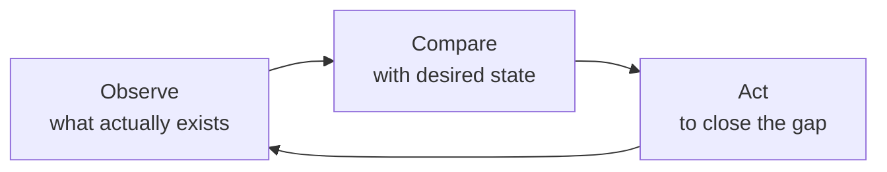
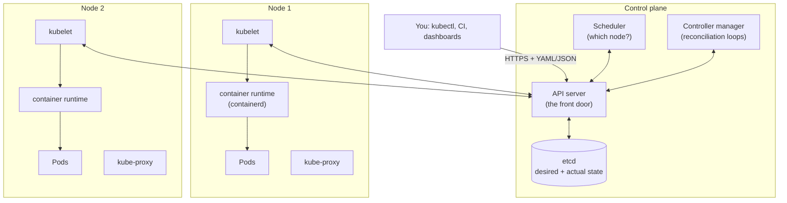

# 10.1 Why orchestration

With Compose, snip runs beautifully on **one** machine. Now imagine the real thing. snip runs on **twenty** machines. One of them dies at 3 a.m. You deploy a new version several times a day, and nobody should notice. Traffic doubles every Monday morning. Some machines have more memory free than others. Who decides which container runs where, notices when one dies, starts a replacement somewhere else, and tells the load balancer? Doing it by hand doesn't scale, and doing it with scripts turns into writing your own, worse, version of the tool this Part is about. An **orchestrator** runs containers across a fleet of machines, and keeps them running the way you've described. **Kubernetes** is the one the industry settled on. This chapter explains what it does, the one idea everything in it is built on, and how its pieces fit together. Then you'll start a cluster on your laptop and try to break it.

## What you'll learn

- The jobs an orchestrator does that Compose on one host can't.
- **Desired state** and **reconciliation loops**: the idea at the heart of Kubernetes.
- Kubernetes' **architecture**: the control plane (API server, etcd, scheduler, controllers) and the nodes (kubelet, container runtime).
- When Kubernetes is the wrong choice, and the alternatives.
- Hands on: create a local cluster with **kind**, run snip on it, delete a Pod and watch it come back.

---

## What an orchestrator does

| Job | The problem | What the orchestrator does |
|---|---|---|
| **Scheduling** | 50 containers, 20 machines of different sizes | Places each container on a machine with enough free CPU and memory, spreading copies apart |
| **Self-healing** | A container crashes; a machine dies | Restarts the container; recreates what was on the dead machine somewhere else |
| **Service discovery & load balancing** | Copies come and go, with changing IP addresses | Gives each service a stable name and address that always routes to its healthy copies |
| **Rolling updates & rollbacks** | Deploying a new version without downtime | Replaces copies gradually, checking health as it goes; undoes it on request |
| **Scaling** | Traffic doubles on Monday mornings | Changes the number of copies by command or automatically (chapter 8.6) |
| **Configuration & secrets** | Twenty machines need the same settings | Stores config and secrets centrally and delivers them to containers |
| **Storage** | A database's container moves to another machine | Attaches the right disk wherever the container lands |

:::note[Everyday anchor]
Think of a big restaurant kitchen. The **head chef** doesn't cook. They look at the orders (what should exist), assign dishes to stations with free capacity (scheduling), notice when a cook calls in sick and move their work to someone else (self-healing), and swap in a new menu one station at a time so service never stops (rolling updates). The cooks (machines) just cook what they're told. Kubernetes is the head chef for containers.
:::

---

## The big idea: desired state and reconciliation

Scripts work **imperatively**: "start 3 copies of snip". If one copy dies ten minutes later, the script has long finished and nobody notices.

Kubernetes works **declaratively** (like Compose, chapter 9.3, but continuously). You tell it the **desired state**: "there should be 3 copies of snip, version 1.4, each with 256 MB of memory". Kubernetes stores that, and then **controllers** run a loop, forever:



- Desired 3 copies, observed 2 (one crashed): **start one**.
- Desired 3, observed 4 (you just scaled down): **stop one**.
- Desired version 1.5, observed 1.4: **replace them, carefully**.
- Desired = observed: **do nothing**, and check again shortly.

This is a **reconciliation loop** (or **control loop**). It's why Kubernetes heals itself: nothing special happens when a container dies. The loop simply notices a gap between desired and actual, and closes it, exactly as it would for any other gap.

:::note[Everyday anchor]
A **thermostat** is a reconciliation loop. You don't say "heat for 20 minutes". You declare "21 °C". It measures, compares, and turns the heating on or off to close the gap, all day, without you. Open a window and it compensates. Kubernetes controllers are thermostats for your software: one for the number of copies, one for which machine is healthy, one for load-balancer membership, and dozens more.
:::

A practical consequence: **you rarely tell Kubernetes to *do* things.** You change the desired state (usually by applying edited YAML files) and let the controllers work out the steps. It also means that changes made by hand behind Kubernetes' back, like killing a container or editing a machine, get **undone**, because the loop puts things back the way the desired state says.

---

## The architecture

A Kubernetes **cluster** is a set of machines (**nodes**) plus a **control plane** that manages them.



| Component | Where | Job |
|---|---|---|
| **API server** | Control plane | The only front door. Everything (you, `kubectl`, controllers, kubelets) reads and writes state through its HTTPS API, which checks authentication and permissions |
| **etcd** | Control plane | A small, strongly consistent key-value database (chapter 8.1) holding the whole cluster state. Lose it without a backup and you lose the cluster |
| **Scheduler** | Control plane | Watches for new Pods with no node and picks one: enough free resources, spread for availability, honouring any rules |
| **Controller manager** | Control plane | Runs the built-in reconciliation loops: copies, nodes, endpoints, jobs… |
| **kubelet** | Every node | The node's agent. Watches the API for Pods assigned to its node, tells the container runtime to run them, runs their health checks, reports status |
| **Container runtime** | Every node | Actually runs containers: **containerd** or CRI-O, using the namespaces and cgroups of chapter 9.1 |
| **kube-proxy** | Every node | Programs the node's networking so a Service's stable address reaches its Pods (chapter 10.3) |

**Everything goes through the API server, and every component watches it.** Nobody talks to anybody directly. When you ask for 3 copies of snip, `kubectl` sends it to the API server, which stores it in etcd. A controller notices and creates 3 Pod records. The scheduler notices Pods without nodes and assigns them. Each chosen node's kubelet notices a Pod assigned to it and starts the containers. Every step is a component watching for state it cares about, and writing its result back.

:::info[If you've written code]
The Kubernetes API is a REST API (chapter 5.2) over HTTPS with JSON bodies. `kubectl` is just a client. Every object has an `apiVersion`, a `kind`, `metadata` (name, namespace, labels), a `spec` (the desired state, which you write) and a `status` (the observed state, which controllers write). "Watching" is a long-lived HTTP request that streams changes. You can extend the API with your own object types (**CustomResourceDefinitions**) and your own controllers (**operators**). That's how databases, certificates and whole cloud resources get managed "the Kubernetes way".
:::

**Managed Kubernetes** services (Amazon EKS, Google GKE, Azure AKS and others) run the control plane for you: highly available, backed up, upgraded. You bring the nodes, or they do that too ("autopilot" modes). Running your own control plane in production is a specialist job. Most teams shouldn't.

---

## When not to use Kubernetes

Kubernetes is powerful and **complex**: dozens of object types, its own networking, security and upgrade cycle. It pays off when you have many services, several teams, or real scale. It can be a heavy tax on a small team with one app.

| Option | What you manage | Good for |
|---|---|---|
| **A single server + Compose/systemd** (chapters 2.5, 9.3) | The machine | Small apps, side projects, internal tools |
| **Serverless containers**: Google Cloud Run, AWS App Runner / ECS on Fargate, Azure Container Apps, Fly.io, Render | Only your image and a few settings | Most web apps and APIs. Scale (including to zero) is handled for you |
| **Managed Kubernetes**: EKS, GKE, AKS | Your workloads, plus some cluster configuration | Many services and teams; portability; the huge ecosystem |
| **Self-managed Kubernetes** | Everything | Specialist platform teams; on-premises |

A reasonable rule: start with the simplest platform that runs your containers reliably. Move to Kubernetes when you feel the specific pains it solves. Learning it is worth it either way: it's the most common platform in job descriptions, and its ideas (desired state, reconciliation, health checks, rolling updates) appear in every platform above.

:::warning[What can go wrong]
- **Adopting Kubernetes for one small app**: weeks spent on clusters, ingress and upgrades instead of the product.
- **Fighting the reconciliation loop**: fixing things by hand (`kubectl edit`, deleting Pods) and wondering why they "come back wrong". Change the desired state instead, usually in files kept in Git (chapter 11.4).
- **Assuming self-healing fixes bugs**: Kubernetes restarts a crashing container, and it crashes again. You get `CrashLoopBackOff` (chapter 10.5), not a fix.
- **Forgetting etcd backups** on self-managed clusters.
:::

:::info[In the real world]
Kubernetes grew out of Google's internal system, Borg, and was open-sourced in 2014. It's now maintained by the Cloud Native Computing Foundation (CNCF) with a new minor version roughly every four months, each supported for about a year. So upgrades are a routine chore every team running it must plan for. The skills in this Part transfer across every cloud's Kubernetes offering, because the API is the same everywhere.
:::

---

## Lab

Free, on your own computer with Docker. **kind** ("Kubernetes in Docker") runs a whole cluster as containers, and **kubectl** is the command-line client.

1. **Install kind and kubectl.**
   - macOS: `brew install kind kubectl`
   - Linux or WSL:
     ```bash
     curl -Lo kind https://github.com/kubernetes-sigs/kind/releases/download/v0.33.0/kind-linux-amd64
     curl -LO "https://dl.k8s.io/release/$(curl -Ls https://dl.k8s.io/release/stable.txt)/bin/linux/amd64/kubectl"
     chmod +x kind kubectl && sudo mv kind kubectl /usr/local/bin/
     ```
     (On ARM machines, replace `amd64` with `arm64`.)

2. **Create a cluster and look around.**
   ```bash
   kind create cluster --name z2p            # one node that is both control plane and worker
   kubectl get nodes
   kubectl get pods -n kube-system           # the control plane itself runs as Pods
   ```
   Find the API server, etcd, the scheduler and the controller manager in that list, plus `kube-proxy` and CoreDNS (the cluster's DNS server). Run `docker ps`: the "node" is itself a container (chapter 9.1).

3. **Run snip** (the image CI publishes, chapter 9.4) as three copies, in memory mode:
   ```bash
   kubectl create deployment snip --image=ghcr.io/jawwadzafar/snip:main --replicas=3
   kubectl rollout status deployment/snip
   kubectl get pods -o wide                  # three Pods, each with its own IP
   ```

4. **Break it, and watch it heal.** In one terminal, watch:
   ```bash
   kubectl get pods -w
   ```
   In another, delete a Pod:
   ```bash
   kubectl delete pod "$(kubectl get pods -l app=snip -o name | head -1 | cut -d/ -f2)"
   ```
   The watch shows the Pod `Terminating`, and within a second or two a **new** Pod with a different name `ContainerCreating`, then `Running`. You didn't ask for a replacement. The reconciliation loop saw 2 where 3 were desired.

5. **Change the desired state.**
   ```bash
   kubectl scale deployment/snip --replicas=5
   kubectl get pods                          # 5
   kubectl port-forward deployment/snip 8080:8080 &
   curl localhost:8080/healthz               # {"status":"ok"}
   kill %1
   kubectl delete deployment snip            # desired state: nothing. The Pods go away.
   ```
   Keep the cluster for the next chapter. Delete it any time with `kind delete cluster --name z2p`.

## Self-check

<Quiz
  id="kubernetes-why-orchestration"
  questions={[
    {
      q: 'What is a reconciliation loop?',
      options: [
        'A retry loop for failed HTTP requests',
        'A controller repeatedly comparing the desired state with the actual state and acting to close any gap',
        'A way to merge Git branches',
        'The order in which Pods start',
      ],
      answer: 1,
      explain: 'Observe, compare, act, repeat. Self-healing, scaling and rollouts are all this same loop closing different gaps.',
    },
    {
      q: 'You delete one of three snip Pods by hand. What happens and why?',
      options: [
        'snip runs with two copies until you recreate it',
        'A new Pod is created shortly, because the desired state still says three and a controller notices only two exist',
        'The whole Deployment is deleted',
        'The cluster restarts',
      ],
      answer: 1,
      explain: 'Kubernetes doesn’t remember that you deleted it. It only sees a gap between desired and actual, and closes it.',
    },
    {
      q: 'Which component stores the whole cluster’s state?',
      options: ['kubelet', 'etcd', 'kube-proxy', 'the scheduler'],
      answer: 1,
      explain: 'etcd is the consistent key-value store behind the API server. Everything else reads and writes state through the API server.',
    },
    {
      q: 'What does the kubelet do?',
      options: [
        'Chooses which node a Pod runs on',
        'Runs on each node, starts the Pods assigned to that node via the container runtime, runs their health checks and reports status',
        'Stores configuration',
        'Provides the cluster’s DNS',
      ],
      answer: 1,
      explain: 'The scheduler chooses the node; the kubelet on that node makes it happen and keeps it running.',
    },
    {
      q: 'A small team has one web API and no plans to grow soon. What is usually the better first platform?',
      options: [
        'A self-managed multi-node Kubernetes cluster',
        'A simpler platform such as a serverless container service or a single server, moving to Kubernetes if its specific benefits become needed',
        'No containers at all',
        'Several Kubernetes clusters for redundancy',
      ],
      answer: 1,
      explain: 'Kubernetes pays off with many services, teams or real scale. For one small app, its complexity often costs more than it saves.',
    },
    {
      q: 'Why does Kubernetes undo changes you make directly on a node or by killing containers?',
      options: [
        'It has a bug',
        'Controllers keep enforcing the declared desired state, so anything that differs from it is "corrected"',
        'Nodes are read-only',
        'Only administrators may make changes',
      ],
      answer: 1,
      explain: 'To change the outcome, change the desired state (ideally in version-controlled files), not the actual state.',
    },
  ]}
/>

<details>
<summary>Trace what happens, component by component, when you run "kubectl scale deployment/snip --replicas=4" on a Deployment with 3 replicas.</summary>

1. **kubectl** sends an HTTPS request to the **API server** changing the Deployment's desired replicas to 4.
2. The API server authenticates you, checks you're allowed, validates the change, and stores it in **etcd**.
3. The Deployment's **controller** (in the controller manager), watching Deployments, sees desired 4 vs actual 3, and creates one new **Pod** object with no node assigned. (Strictly, a ReplicaSet controller in between does this, chapter 10.2.)
4. The **scheduler**, watching for unassigned Pods, picks a node with enough free resources and writes the assignment.
5. That node's **kubelet**, watching for Pods assigned to it, tells **containerd** to pull the image and start the container, then runs its health checks.
6. The kubelet reports the Pod as `Running` and ready. The endpoints controller adds its IP to the Service's endpoints, and **kube-proxy** on every node updates the routing, so it starts receiving traffic (chapter 10.3).

Nobody called anybody directly. Each component watched the API server for the state it cares about and wrote back its result.

</details>

<details>
<summary>Compose (chapter 9.3) is also declarative. What does Kubernetes do that Compose doesn't?</summary>

Compose reconciles **once**, when you run `docker compose up`, and on **one machine**. Kubernetes reconciles **continuously**, across **many machines**. Its controllers never stop comparing desired and actual state. So Kubernetes also:
- moves work off a failed machine onto healthy ones;
- schedules containers onto machines according to their free resources;
- keeps stable service addresses as copies come and go, and routes only to healthy, ready copies;
- performs gradual, health-checked rolling updates and rollbacks;
- autoscales;
- and exposes all of this through one API that tools, CI and custom controllers can build on.

Compose's `restart: always` restarts a crashed container on the same host. It can't do anything if the host itself is gone.

</details>
