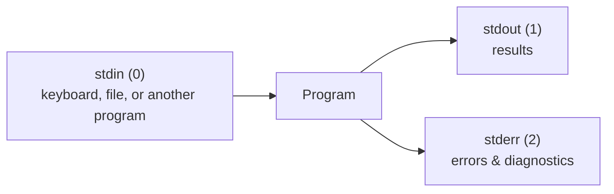

# 2.3 Pipes, redirection & text tools

It's 2 a.m. and something is wrong. You have a log file with two million lines. Which endpoint is failing? How many errors per minute? Which customer is hammering the API? An engineer who knows the tools in this chapter answers each of those questions with **one line** in the terminal, in seconds, without opening a spreadsheet or writing a program. The secret isn't memorising dozens of commands. It's one idea — **small tools connected by pipes** — plus a handful of tools worth knowing well.

## What you'll learn

- The three **streams** every program has — **stdin** (input), **stdout** (output), **stderr** (errors) — and why errors are kept separate.
- **Pipes** (`|`), which connect one program's output to the next program's input, and **redirection** (`>`, `>>`, `<`, `2>`), which connects streams to files.
- The everyday text tools: `grep`, `sort`, `uniq`, `wc`, `head`, `cut`, `tr`, `tee` — and the two power tools `awk` and `sed`.
- **`jq`**, for slicing JSON logs and API responses.
- How to answer real questions about a real log file in one line — and how to build such a line step by step.

---

## Every program has three streams

Every process starts with three connections already open:

| Stream | Number | What flows through it | By default goes to |
|---|---|---|---|
| **stdin** (standard input) | 0 | input the program reads | your keyboard |
| **stdout** (standard output) | 1 | normal results | your screen |
| **stderr** (standard error) | 2 | error messages and diagnostics | your screen |

stdout and stderr both show up on your screen, so they look the same — but they're separate channels **on purpose**. That separation lets you save a program's *results* to a file while still seeing its *errors*, or throw away the noise while keeping the data.



:::note[Everyday anchor]
Think of a machine in a factory with one input chute and two output chutes: one for finished products, one for rejects. Normally both drop into the same bin (your screen). But you can route them anywhere — the products onto a conveyor belt to the next machine, the rejects into a separate box to inspect later.
:::

---

## Redirection: streams to and from files

Redirection sends a stream to (or from) a file instead of the screen:

```bash
ls -l > listing.txt        # stdout → file (replaces the file's contents)
ls -l >> listing.txt       # stdout → file (appends to the end)
wc -l < listing.txt        # file → stdin
ls /nope 2> errors.txt     # stderr → file (2 is stderr's number)
ls /nope 2>/dev/null       # throw errors away: /dev/null is a bottomless bin
cmd > out.txt 2>&1         # stdout to out.txt, AND stderr to the same place as stdout
```

That last one reads right to left in an odd way: `2>&1` means "send stream 2 wherever stream 1 is going *right now*". Order matters: `> out.txt 2>&1` captures both; `2>&1 > out.txt` does not.

:::danger[`>` overwrites without asking]
`>` silently replaces a file's contents. `sort data.txt > data.txt` **empties** `data.txt`: the shell truncates the output file *before* `sort` even starts reading it. Write to a new file, then rename it.
:::

---

## Pipes: connecting programs together

A **pipe**, written `|`, connects the **stdout** of one program to the **stdin** of the next. `A | B` means "run A, and feed everything it prints straight into B". No temporary files; data flows through as it's produced.

```bash
ls -l /usr/bin | wc -l              # how many programs are in /usr/bin?
ps aux | grep snip                  # is snip running?
history | grep docker | tail -5     # the last five docker commands you ran
```

The philosophy, from the people who built Unix in the 1970s: **write programs that do one thing well, and make them work together through text streams.** Each tool is small and dumb. Chained together, they're remarkably powerful.


That pipeline — which you'll run in the lab — answers "which pages are failing most?" on a log of any size.

:::info[If you've written code]
A pipeline is like chaining array methods: `lines.filter(isError).map(getPath).countBy().sortDesc().slice(0, 10)`. Each stage is a pure transformation of a stream. The difference is scale: pipes stream data through, so they handle files far bigger than memory.
:::

---

## The everyday text tools

### grep — keep only matching lines

**`grep`** filters lines that contain a pattern. It's the tool you'll use most.

```bash
grep "ERROR" app.log            # lines containing ERROR
grep -i "error" app.log         # case-insensitive
grep -v "healthz" access.log    # -v: lines that DON'T match
grep -c "500" access.log        # -c: count matching lines
grep -n "timeout" app.log       # -n: show line numbers
grep -rn "SNIP_" snip/          # -r: search every file under a folder
grep -E "40[134]" access.log    # -E: extended patterns (here 401, 403 or 404)
```

The patterns are **regular expressions** (regex) — a mini-language for matching text. You'll get far with just a few: `.` any character, `*` repeat the previous thing, `^` start of line, `$` end of line, `[abc]` any one of these, `\d` or `[0-9]` a digit.

### sort, uniq, wc, head — count and rank

```bash
sort names.txt                  # alphabetical
sort -n numbers.txt             # numeric (so 10 comes after 9, not after 1)
sort -rn                        # numeric, reversed (biggest first)
sort | uniq                     # remove duplicate lines (uniq only removes ADJACENT duplicates — so sort first)
sort | uniq -c                  # count how many times each line appears
wc -l file.txt                  # count lines
head -10                        # first 10 lines
```

`sort | uniq -c | sort -rn | head` is probably the most useful four-command combination in all of operations: **"what are the most common X?"**

### cut, tr — slice columns and swap characters

```bash
cut -d' ' -f1 access.log        # field 1, splitting on spaces (-d = delimiter, -f = field)
cut -d',' -f2,3 data.csv        # fields 2 and 3 of a CSV
echo "a:b:c" | tr ':' '\n'      # turn colons into newlines
echo "Hello" | tr 'a-z' 'A-Z'   # to upper case
```

### tee — save and pass along

**`tee`** writes its input to a file *and* passes it on, like a T-junction in a pipe:

```bash
go test ./... 2>&1 | tee test-output.txt   # see the output live AND keep a copy
```

### xargs — turn lines into arguments

Some commands don't read stdin; they want arguments. **`xargs`** converts one into the other:

```bash
find . -name "*.tmp" | xargs rm           # delete every .tmp file found
grep -rl "oldName" src/ | xargs sed -i 's/oldName/newName/g'   # replace in every file that contains it
```

Be careful with `xargs rm`: always run the command *without* the `| xargs rm` part first, to see exactly what would be deleted.

---

## The power tools: awk and sed

You don't need to master these. You need to recognise them and know the two or three patterns that cover most uses.

**`awk`** splits each line into fields (`$1`, `$2`…) and lets you print, filter and sum:

```bash
awk '{print $1}' access.log                    # first field of each line
awk '$9 >= 500 {print $7}' access.log          # path ($7) of lines where status ($9) is 500+
awk '{sum += $10} END {print sum}' access.log  # add up field 10 (bytes sent) across all lines
```

**`sed`** ("stream editor") edits text as it flows past, usually find-and-replace:

```bash
sed 's/http:/https:/' urls.txt                # replace the first match on each line
sed 's/http:/https:/g' urls.txt               # g = every match on the line
sed -n '100,120p' big.log                     # print only lines 100–120
sed -i 's/8080/9090/g' config.yaml            # -i = edit the file in place (careful!)
```

(On macOS, in-place editing is `sed -i '' 's/…/…/' file` — one of the small differences between macOS and Linux tools.)

---

## jq: grep for JSON

Modern services — including snip — write logs as **JSON**, one object per line (chapter 1.3), and every API speaks JSON. **`jq`** is the tool for slicing it. Install it with `brew install jq` or `sudo apt install -y jq`.

A snip log line looks like this:

```json
{"time":"2026-09-24T19:56:19Z","level":"INFO","msg":"request","request_id":"3f9a2c71d0b4e815","method":"GET","route":"GET /{slug}","path":"/k7Qz2a","status":302,"duration_ms":1}
```

```bash
jq . app.log                                        # pretty-print every line
jq -r '.path' app.log                               # just the path field (-r = raw text, no quotes)
jq -c 'select(.status >= 500)' app.log              # only server errors, one per line (-c = compact)
jq -r 'select(.duration_ms > 100) | .path' app.log  # paths of slow requests
jq -r '.status' app.log | sort | uniq -c            # count of each status code
curl -s localhost:8080/ | jq -r '.service'           # pull one value out of an API response
```

`select(...)` keeps only matching objects; `|` inside jq chains steps, just like the shell's pipe.

:::tip[Build pipelines one stage at a time]
Never write a six-stage pipeline in one go. Run the first command and look at its output. Add `| head` to keep it short. Add the next stage, look again. Each stage should print something that makes sense before you add the next. That's how experienced engineers write these lines — they don't get them right first time either.
:::

:::warning[What can go wrong]
- **`uniq` without `sort`.** `uniq` only merges duplicates that are *next to each other*, so unsorted input gives nonsense counts.
- **Numbers sorted as text.** Plain `sort` puts `100` before `9`. Use `sort -n` for numbers.
- **Errors disappearing into a pipe.** Only stdout flows through `|`. If a command's errors go to stderr, they print on your screen and never reach the next stage — or vanish if you've redirected them. When a pipeline gives strangely empty output, run the first command alone and read its errors.
- **A pipeline's exit code.** By default, a pipeline's exit code is only that of the *last* command, so an early failure can be silently ignored. Scripts fix this with `set -o pipefail` (chapter 2.4).
:::

---

## Cheat sheet

| Tool | Does | Example |
|---|---|---|
| `\|` | pipe stdout into the next command | `ps aux \| grep snip` |
| `>` / `>>` | stdout to a file (replace / append) | `cmd > out.txt` |
| `2>` / `2>&1` | stderr to a file / to wherever stdout goes | `cmd > all.txt 2>&1` |
| `/dev/null` | the bin that discards everything | `cmd 2>/dev/null` |
| `grep -rniv` | filter lines (recursive, numbered, ignore case, invert) | `grep -rn TODO .` |
| `sort -rn \| uniq -c` | count and rank | `… \| sort \| uniq -c \| sort -rn` |
| `cut -d -f` | pick columns | `cut -d' ' -f1` |
| `awk '{print $N}'` | fields, filters, sums | `awk '$9>=500'` |
| `sed 's/a/b/g'` | find and replace | `sed -n '10,20p'` |
| `jq` | query JSON | `jq 'select(.status>=500)'` |
| `xargs` | lines → arguments | `… \| xargs rm` |
| `tee` | save a copy and pass it on | `… \| tee log.txt` |

---

## Lab

Free, on your own computer. You'll create a small sample web-server log and interrogate it.

1. **Create a sample access log.** This is the common "combined" format that nginx and Apache write — one line per request:
   ```bash
   mkdir -p ~/logs-lab && cd ~/logs-lab
   cat > access.log <<'EOF'
   203.0.113.5 - - [24/Sep/2026:10:00:01 +0000] "GET /k7Qz2a HTTP/1.1" 302 0 "-" "Mozilla/5.0"
   203.0.113.9 - - [24/Sep/2026:10:00:02 +0000] "GET /healthz HTTP/1.1" 200 15 "-" "kube-probe/1.31"
   198.51.100.4 - - [24/Sep/2026:10:00:02 +0000] "POST /api/links HTTP/1.1" 201 142 "-" "curl/8.5.0"
   203.0.113.5 - - [24/Sep/2026:10:00:03 +0000] "GET /nope123 HTTP/1.1" 404 64 "-" "Mozilla/5.0"
   198.51.100.4 - - [24/Sep/2026:10:00:04 +0000] "POST /api/links HTTP/1.1" 500 58 "-" "curl/8.5.0"
   203.0.113.7 - - [24/Sep/2026:10:00:05 +0000] "GET /k7Qz2a HTTP/1.1" 302 0 "-" "Mozilla/5.0"
   198.51.100.4 - - [24/Sep/2026:10:00:06 +0000] "POST /api/links HTTP/1.1" 500 58 "-" "curl/8.5.0"
   203.0.113.9 - - [24/Sep/2026:10:00:07 +0000] "GET /healthz HTTP/1.1" 200 15 "-" "kube-probe/1.31"
   203.0.113.8 - - [24/Sep/2026:10:00:08 +0000] "GET /launch HTTP/1.1" 302 0 "-" "Mozilla/5.0"
   198.51.100.4 - - [24/Sep/2026:10:00:09 +0000] "POST /api/links HTTP/1.1" 429 70 "-" "curl/8.5.0"
   EOF
   wc -l access.log
   ```
   The `<<'EOF' … EOF` part is a **here-document**: everything between the markers becomes the command's stdin. In this format, field 1 is the client IP, field 7 the path, field 9 the status code.

2. **Answer questions, building one stage at a time.**
   ```bash
   awk '{print $9}' access.log | sort | uniq -c | sort -rn      # how many of each status code?
   grep -v healthz access.log | wc -l                           # real traffic, ignoring health checks
   awk '$9 >= 500 {print $7}' access.log | sort | uniq -c       # which paths are failing?
   awk '{print $1}' access.log | sort | uniq -c | sort -rn | head -3   # busiest clients
   ```
   Notice the last one: a single IP made most of the `POST`s, including the ones that got `429 Too Many Requests` — rate limiting (chapter 8.4) doing its job.

3. **Separate stdout from stderr.**
   ```bash
   ls access.log nope.log                     # both streams on screen
   ls access.log nope.log > out.txt           # result in the file, error still on screen
   ls access.log nope.log > out.txt 2>&1      # both in the file
   cat out.txt
   ```

4. **Query JSON.**
   ```bash
   cat > app.log <<'EOF'
   {"level":"INFO","msg":"request","path":"/k7Qz2a","status":302,"duration_ms":1}
   {"level":"INFO","msg":"request","path":"/api/links","status":201,"duration_ms":12}
   {"level":"ERROR","msg":"internal error","path":"/api/links","status":500,"duration_ms":230}
   {"level":"INFO","msg":"request","path":"/launch","status":302,"duration_ms":2}
   EOF
   jq -c 'select(.status >= 500)' app.log        # server errors
   jq -r 'select(.duration_ms > 100) | .path' app.log   # slow requests
   jq -s 'map(.duration_ms) | add / length' app.log     # average duration (-s = read all lines as one array)
   cd ~ && rm -r ~/logs-lab                      # clean up
   ```

## Self-check

<Quiz
  id="linux-pipes-and-text-tools"
  questions={[
    {
      q: 'What does cmd > out.txt 2>&1 do?',
      options: [
        'Sends only the errors to out.txt, and output to the screen',
        'Sends both normal output and errors to out.txt',
        'Runs cmd twice, once for each of the two streams',
        'Appends to out.txt instead of overwriting it',
      ],
      answer: 1,
      explain: '> out.txt sends stdout to the file; 2>&1 then sends stderr to wherever stdout currently goes — the same file. (Use >> to append instead of replacing.)',
    },
    {
      q: 'You run cat log | uniq -c and the counts look wrong — the same line appears several times with different counts. Why?',
      options: [
        'uniq counts characters, not lines, unless you pass -l',
        'uniq only merges adjacent duplicates, so you must sort first',
        'cat adds invisible line endings, so equal lines differ',
        'The log is too big, so uniq counts it in separate chunks',
      ],
      answer: 1,
      explain: 'uniq compares each line with the one before it. Sorting first puts identical lines next to each other: sort | uniq -c.',
    },
    {
      q: 'Why does sort data.txt > data.txt leave you with an empty file?',
      options: [
        'sort deletes the files it reads once it has loaded them',
        'The shell empties data.txt for > before sort starts reading it',
        'sort writes its output before reading, so it sees nothing',
        'sort saw a lock on the file and gave up without writing',
      ],
      answer: 1,
      explain: 'Redirections are set up before the command runs, and > truncates the file immediately. Write to a new file and rename it afterwards.',
    },
    {
      q: 'Which pipeline answers "what are the 5 most common IP addresses in field 1 of access.log"?',
      options: [
        'grep IP access.log | head -5',
        "awk '{print $1}' access.log | sort | uniq -c | sort -rn | head -5",
        'sort access.log | head -5',
        "cut -f1 access.log | uniq | head -5",
      ],
      answer: 1,
      explain: 'Extract the field, sort so duplicates are adjacent, count them, sort the counts numerically in reverse, and keep the top five.',
    },
  ]}
/>

<details>
<summary>Why do programs keep errors (stderr) separate from results (stdout)? Give a concrete example where it matters.</summary>

So that **results can be captured or piped** without errors mixed in, while errors still reach a human. Example: `find / -name "*.conf" > configs.txt` — `find` will hit many folders it can't read and print "permission denied" for each. Because those go to **stderr**, `configs.txt` contains only clean results, and the errors appear on screen (or can be discarded with `2>/dev/null`). If everything went to one stream, the file would be full of error messages, and any program reading it would choke.

</details>

<details>
<summary>How would you find every request slower than 500 ms in a JSON log and list the paths, most frequent first?</summary>

```bash
jq -r 'select(.duration_ms > 500) | .path' app.log | sort | uniq -c | sort -rn
```

`jq` keeps only slow requests and prints their path as raw text; the classic `sort | uniq -c | sort -rn` counts and ranks them. Built stage by stage: first `jq … | head`, check it looks right, then add the counting.

</details>
