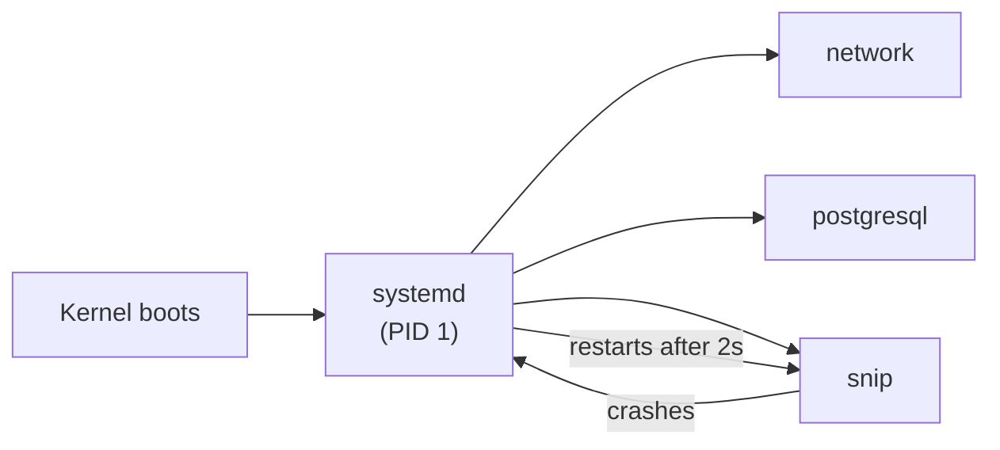

# 2.5 Running a Linux server

So far you've started programs by typing a command and watching them run. That's fine on your laptop. On a server it's hopeless: close the terminal and the program dies; reboot the machine and nothing comes back; crash at 3 a.m. and it stays down until someone notices. Real servers need programs that **start by themselves, restart when they fail, write logs somewhere you can find them, and don't fill the disk.** This chapter shows how Linux does all of that, using snip as the service. Later, containers and Kubernetes will automate much of it — but they're built on exactly these ideas, and every one of them still runs on a Linux machine underneath.

## What you'll learn

- How to install and update software with a **package manager** (`apt`), and what "keeping a server patched" means.
- **systemd**: the program that starts services at boot, restarts them when they crash, and stops them gracefully — and how to write a service file for snip.
- Reading logs with **`journalctl`** and in **`/var/log`**.
- **Housekeeping**: finding what's filling the disk, rotating logs, checking memory and spotting the out-of-memory killer.
- **Scheduled jobs** (cron and timers), a basic **firewall**, and a checklist for a new server.

---

## Installing software: packages

On Ubuntu and Debian servers, software is installed with **`apt`** — the package manager from chapter 0.2. A **package** is a program bundled with information about what it depends on, so installing one pulls in everything it needs.

```bash
sudo apt update                    # refresh the list of available packages and versions
sudo apt install -y nginx          # install a package (and its dependencies)
apt list --installed | grep nginx  # is it installed, and which version?
sudo apt upgrade -y                # upgrade everything that has updates
sudo apt remove nginx              # uninstall
```

(Red Hat–style systems — RHEL, Fedora, Amazon Linux — use `dnf` instead; same ideas, slightly different words.)

**Keeping a server patched** means regularly applying updates, especially security updates. Most real break-ins exploit problems that were fixed months earlier and simply never installed. Ubuntu can do this automatically with the `unattended-upgrades` package — worth enabling on any server you run.

:::info[In the real world]
In modern setups you rarely install your *own* application with `apt`. Your app ships as a container image (Part 9), and the server just needs a container runtime. But the machine itself — its kernel, SSH, libraries — is still patched with the package manager, whether by you or by your cloud provider.
:::

---

## Services: programs that run themselves

A **service** (also called a **daemon**) is a program that runs in the background, without a terminal, usually from boot until shutdown: a web server, a database, snip.

On almost every modern Linux system, services are managed by **systemd**. It's the first program the kernel starts at boot (it has process ID 1 — chapter 1.2), and its job is to start everything else, in the right order, and keep it running.



:::note[Everyday anchor]
systemd is a building's facilities manager. At opening time, it switches on the lights, the lifts and the heating, in the right order. If a lift breaks down during the day, it restarts it. At closing time, it shuts everything down politely, one by one. You tell it *what* should be running; it makes sure it is.
:::

### Controlling services with systemctl

```bash
systemctl status nginx          # is it running? since when? last few log lines
sudo systemctl start nginx      # start it now
sudo systemctl stop nginx       # stop it (sends SIGTERM, then SIGKILL if it won't stop)
sudo systemctl restart nginx    # stop then start
sudo systemctl reload nginx     # ask it to re-read its config without stopping (if supported)
sudo systemctl enable nginx     # start it automatically at every boot
sudo systemctl disable nginx    # don't start at boot
systemctl list-units --type=service --state=running   # everything currently running
```

A common confusion: **`start`** runs it *now*; **`enable`** makes it start *at boot*. You usually want both: `sudo systemctl enable --now snip`.

### A service file for snip

systemd learns about a service from a **unit file**, a small text file in `/etc/systemd/system/`. Here is snip's, from the repository (`snip/deploy/systemd/snip.service`, trimmed):

```ini
[Unit]
Description=snip link shortener API
# Start after the network (and Postgres, if it runs on this machine).
After=network-online.target postgresql.service
Wants=network-online.target

[Service]
# Run as an unprivileged user (chapter 2.2).
User=snip
Group=snip
# Settings like SNIP_DATABASE_URL.
EnvironmentFile=/etc/snip/snip.env
# The command to run.
ExecStart=/usr/local/bin/snip serve
# Crashed? Start it again after 2 seconds.
Restart=on-failure
RestartSec=2
# On stop: SIGTERM, wait up to 15 s, then SIGKILL.
TimeoutStopSec=15
# Raise the open-files limit (chapter 2.2).
LimitNOFILE=65536
# Hardening: never gain privileges; most of the filesystem is read-only.
NoNewPrivileges=true
ProtectSystem=strict

[Install]
# "Start this during normal boot."
WantedBy=multi-user.target
```

:::warning
In systemd unit files, comments must be on **their own line**, starting with `#`. A `#` at the end of a setting is *not* a comment — it becomes part of the value and breaks it.
:::

Every line maps to something you've already learned:

- **`User=snip`** — least privilege. If snip had a security bug, the attacker would get only what the `snip` user can touch.
- **`EnvironmentFile=`** — configuration through environment variables (chapter 2.2), kept in a file readable only by root and the `snip` group, so the database password isn't visible to other users.
- **`Restart=on-failure`** — a crash at 3 a.m. becomes a two-second blip instead of an outage.
- **`TimeoutStopSec=15`** — graceful shutdown: systemd sends **SIGTERM** (chapter 1.2), snip finishes in-flight requests, and only if it hangs does systemd send SIGKILL.

After adding or changing a unit file:

```bash
sudo systemctl daemon-reload        # make systemd re-read unit files
sudo systemctl enable --now snip    # start now and at every boot
systemctl status snip               # check it
```

:::info[If you've written code]
If you've used `pm2`, `nodemon` or `forever` to keep a Node app alive, systemd is the operating system's built-in version of that — and in Kubernetes (Part 10), the same responsibilities (start, restart on failure, graceful stop, resource limits) move into the Pod spec.
:::

---

## Logs: where to look when something breaks

Services don't have a terminal to print to, so their output goes to logs. On a systemd machine there are two places to look.

### The journal (journalctl)

systemd captures everything a service writes to stdout and stderr (chapter 2.3) in the **journal**:

```bash
journalctl -u snip                  # all logs for the snip service
journalctl -u snip -f               # follow new lines live (like tail -f)
journalctl -u snip --since "1 hour ago"
journalctl -u snip -p err           # only errors and worse
journalctl -b -p warning            # warnings or worse since this boot
journalctl -u snip -o cat | jq .    # just the messages; snip logs JSON, so jq works (chapter 2.3)
```

This is one reason snip simply writes JSON logs to stdout rather than managing its own log files: the platform — systemd here, Docker or Kubernetes later — collects them. (It's one of the "Twelve-Factor App" principles you'll meet in chapter 5.4.)

### /var/log

Many programs still write their own files under `/var/log` (chapter 2.1):

```bash
ls /var/log                          # the log folder
sudo tail -f /var/log/nginx/error.log    # nginx's errors, live
sudo less /var/log/syslog            # general system log on Debian/Ubuntu
```

:::tip[The first three commands on a sick server]
When something's wrong on a machine, start with:
1. `systemctl status <service>` — is it running, and what did it last say?
2. `journalctl -u <service> -n 100` — the last 100 log lines.
3. `df -h && free -h` — is the disk full or memory exhausted?

Those three answer a surprising share of "it's down" pages.
:::

---

## Housekeeping: disk, logs and memory

Most server incidents aren't clever. They're a disk that filled up, or memory that ran out. Know how to check both.

### What's filling the disk?

```bash
df -h                                     # free space on every filesystem
sudo du -sh /var/* 2>/dev/null | sort -h  # size of each folder under /var, smallest to largest
sudo du -ah /var/log | sort -h | tail -20 # the 20 biggest files and folders under /var/log
journalctl --disk-usage                   # how much space the journal uses
sudo journalctl --vacuum-size=500M        # shrink the journal to 500 MB
```

`du` ("disk usage") plus `sort -h` (sort human-readable sizes) and the pipeline skills from chapter 2.3 will find the culprit in a minute.

### Log rotation

Logs grow forever unless something trims them. **logrotate** runs daily on most distributions and, per its config in `/etc/logrotate.d/`, renames `app.log` to `app.log.1`, compresses older ones, and deletes the oldest. The journal has its own size limits (`SystemMaxUse=` in `/etc/systemd/journald.conf`).

:::warning[What can go wrong]
- **The slow disk fill.** Logs, old container images, database files and temporary files grow a little every day. Months later the disk hits 100%, and *everything* fails at once — the database can't write, logs stop, even SSH can struggle. Monitor disk usage and alert well before it's full (chapter 13.4).
- **Deleted but not freed.** If you `rm` a huge log file that a running process still has open, the space isn't freed until that process closes it. `df` still shows the disk as full. Restart the process (or truncate the file with `: > file.log` instead of deleting it).
- **The silent OOM kill.** When memory runs out, the kernel's out-of-memory killer stops a process (chapter 1.1). The service "just died". Check for it with `sudo dmesg -T | grep -i -E "killed process|out of memory"` or `journalctl -k | grep -i oom`.
:::

### Memory and load

```bash
free -h            # memory: total, used, available ("available" is what matters)
uptime             # how long it's been up, plus "load average" for 1, 5 and 15 minutes
top                # live view; press M to sort by memory, P by CPU, q to quit
```

**Load average** is roughly how many processes are running or waiting for the CPU. As a rule of thumb, a load average consistently above the number of CPU cores (`nproc`) means work is queuing up.

---

## Scheduled jobs: cron and timers

Servers often need to do things on a schedule: nightly backups, cleaning up expired data, sending a weekly report.

The classic tool is **cron**. Each user has a **crontab** (cron table) — a list of schedules and commands:

```bash
crontab -e          # edit your crontab
crontab -l          # list it
```

Each line is five time fields and a command:

```text
# ┌─ minute (0–59)
# │ ┌─ hour (0–23)
# │ │ ┌─ day of month (1–31)
# │ │ │ ┌─ month (1–12)
# │ │ │ │ ┌─ day of week (0–6, Sunday = 0)
# │ │ │ │ │
  30 2 * * * /usr/local/bin/backup-snip.sh >> /var/log/backup.log 2>&1   # every day at 02:30
  */5 * * * * /usr/local/bin/check-disk.sh                              # every 5 minutes
```

(`crontab.guru` is a handy website that translates these into plain English.)

Two classic cron traps: jobs run with an almost **empty environment** (so commands that work in your terminal fail with "command not found" — use absolute paths), and jobs run in the server's **time zone** (set servers to UTC — chapter 1.3). systemd also offers **timers**, which do the same job with proper logging in the journal; you'll see both in the wild. And in Kubernetes, the equivalent is a **CronJob** (chapter 10.2).

---

## A basic firewall

A **firewall** decides which network traffic is allowed to reach the machine. The principle: **deny everything by default, allow only what's needed.** A server running snip behind nginx needs SSH (to manage it) and HTTP/HTTPS — nothing else should be reachable from the internet. The database, Redis, and snip's own port 8080 should only be reachable from the machine itself or the private network.

On Ubuntu, **ufw** ("uncomplicated firewall") makes this simple:

```bash
sudo ufw default deny incoming     # block everything coming in…
sudo ufw default allow outgoing    # …but let the server make outgoing connections
sudo ufw allow OpenSSH             # port 22 — do this BEFORE enabling, or you'll lock yourself out
sudo ufw allow 80,443/tcp          # web traffic
sudo ufw enable
sudo ufw status verbose
```

:::danger[Don't lock yourself out]
If you enable a firewall that blocks SSH on a remote server, your SSH session drops and you can't get back in. Always allow SSH first, and on a cloud server, know how to reach the provider's emergency console before touching firewall rules. In the cloud you'll usually do this with **security groups** instead (chapter 12.2) — same principle, managed by the provider.
:::

---

## A new-server checklist

When you get a fresh Linux server, the basics look like this. Each item is covered in this part of the handbook:

- [ ] Log in with an **SSH key**, not a password; disable password login (chapter 2.6).
- [ ] Create a normal user with `sudo`; don't work as root (chapter 2.2).
- [ ] `sudo apt update && sudo apt upgrade`; enable **unattended security upgrades**.
- [ ] Set the time zone to **UTC** (`sudo timedatectl set-timezone UTC`).
- [ ] Enable a **firewall**: SSH and the ports you actually serve, nothing else.
- [ ] Run each app as a **systemd service** under its own **unprivileged user**.
- [ ] Make sure logs are **rotated** and disk usage is **monitored**.
- [ ] Have **backups** — and test restoring them (chapter 12.3).

---

## Lab

Free, on your own computer. You'll practise in a throwaway Linux container, so nothing on your machine changes.

1. **Get a disposable Ubuntu server.** Docker (chapter 0.2) can give you a fresh Ubuntu shell in seconds:
   ```bash
   docker run --rm -it ubuntu:24.04 bash    # --rm: delete it on exit; -it: interactive terminal
   ```
   You're now `root` inside a brand-new Ubuntu. Nothing you do here affects your computer, and it all vanishes when you type `exit`.

2. **Use the package manager** (inside the container):
   ```bash
   apt update                              # refresh the package list
   apt install -y curl jq                  # install two tools
   which curl jq && curl --version | head -1
   ```
   Notice you're root here, so no `sudo` is needed — on a real server you'd work as a normal user.

3. **Play detective with disk usage** (still inside):
   ```bash
   df -h /                                  # how full is the disk?
   du -sh /usr/* 2>/dev/null | sort -h | tail -5   # the five biggest folders under /usr
   mkdir -p /var/log/demo && head -c 50M /dev/zero > /var/log/demo/huge.log   # fake a 50 MB log
   du -ah /var/log | sort -h | tail -3      # find it
   exit                                     # the container — and your fake log — disappear
   ```

4. **Read a real service's status** (on Linux or WSL with systemd; skip on macOS):
   ```bash
   systemctl list-units --type=service --state=running | head   # what's running on your machine
   systemctl status ssh 2>/dev/null || systemctl status cron     # a real service's status
   journalctl -n 20 --no-pager                                   # the last 20 log lines of the whole system
   ```
   Then open `snip/deploy/systemd/snip.service` in the repository and match each line to the explanations above. You'll deploy snip exactly this way if you ever run it on a plain server.

## Self-check

<Quiz
  id="linux-running-a-linux-server"
  questions={[
    {
      q: 'You ran sudo systemctl start snip and it works, but after a reboot snip is not running. What did you forget?',
      options: [
        'sudo systemctl restart snip',
        'sudo systemctl enable snip — start only runs it now; enable makes it start at boot',
        'To install snip with apt',
        'To reboot twice',
      ],
      answer: 1,
      explain: 'start and enable are separate: start runs the service now, enable registers it to start at boot. enable --now does both.',
    },
    {
      q: 'A service keeps crashing and its unit file has Restart=on-failure. Where do you look first to see why?',
      options: [
        'The firewall rules',
        'journalctl -u <service> — its stdout/stderr and systemd’s notes about each crash',
        'crontab -l',
        'The package list',
      ],
      answer: 1,
      explain: 'systemd captures the service’s output in the journal, including the error printed just before each crash and the exit code. Restart hides the outage, not the cause.',
    },
    {
      q: 'The disk is 100% full. You delete a 20 GB log file, but df still shows the disk as full. Why?',
      options: [
        'df is cached for 24 hours',
        'A running process still has the file open, so the space is not freed until it closes it',
        'Deleted files go to a recycle bin',
        'The file was a symbolic link',
      ],
      answer: 1,
      explain: 'On Linux, deleting removes the name, but the data stays until every process holding the file open closes it. Restart the process, or truncate the file instead of deleting it.',
    },
    {
      q: 'Your nightly cron job works when you run it by hand but fails in cron with "command not found". Most likely cause?',
      options: [
        'cron cannot run scripts',
        'cron runs jobs with a minimal environment and PATH, so commands need absolute paths',
        'The job runs too early in the morning',
        'cron requires root',
      ],
      answer: 1,
      explain: 'Your interactive shell has your full $PATH and variables; cron does not. Use absolute paths (/usr/local/bin/…) or set PATH at the top of the crontab or script.',
    },
  ]}
/>

<details>
<summary>Walk through what systemd does, step by step, when snip crashes at 3 a.m. with the unit file above.</summary>

1. snip's process exits with a non-zero exit code (a crash).
2. systemd, as its parent, notices immediately and records the exit in the journal.
3. Because of `Restart=on-failure`, it waits `RestartSec=2` seconds.
4. It starts `/usr/local/bin/snip serve` again, as user `snip`, with the variables from `/etc/snip/snip.env`.
5. snip connects to the database and starts serving; the outage lasted a few seconds.

Nobody woke up — but the crash is still in `journalctl -u snip`, and the *cause* still needs fixing. If snip keeps crashing, systemd eventually gives up (its "start limit"), which is why you also need monitoring and alerts (chapter 13.4).

</details>

<details>
<summary>Why should the database port (5432) not be open to the internet, even if the database has a strong password?</summary>

Because **defence in depth**: every exposed port is a door attackers can knock on — trying passwords, exploiting bugs in the database software itself, or overwhelming it. Only the programs that need the database (snip, on the same machine or private network) should be able to reach it. A firewall that allows only SSH and HTTPS from the internet means that even a weak password or an unpatched bug in Postgres isn't directly reachable. You'll apply the same principle with cloud security groups in chapter 12.2.

</details>
