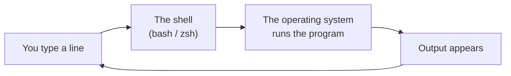
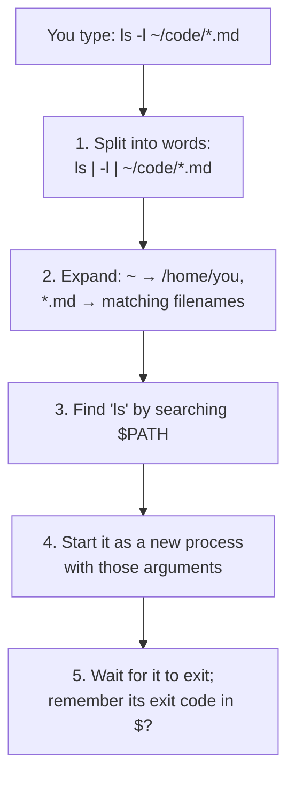

# 2.1 The shell & the filesystem

You've already typed commands in chapter 0.2 and run a server in chapter 1.6. So far you've been following instructions: copy a line, press Enter, hope. This chapter is the ground underneath those commands — what the **shell** actually does with each line you type, and how **files** are organised on every Linux machine you'll ever touch. Almost every server runs Linux and has no screen, no mouse, no windows: just a shell. Being fluent here is the difference between *copying* commands and *reasoning* with them.

## What you'll learn

- What the **shell** is — a program that reads a line, finds the program you named, and runs it — and what `$PATH` has to do with "command not found".
- That the shell **rewrites your line before running it**: expanding `~`, `*` and `$VARIABLES` — which is why quotes matter.
- The Linux **filesystem**: one single tree starting at `/`, and where things conventionally live (`/home`, `/etc`, `/var/log`, `/tmp`).
- **Absolute vs relative paths**, and the shortcuts `~`, `.` and `..`.
- The commands you'll use every day: `pwd`, `ls`, `cd`, `cat`, `less`, `mkdir`, `cp`, `mv`, `rm`, `find` — and how to delete things **safely**.

---

## The shell is a program that runs programs

Open a terminal. The text window is the **terminal**; the program inside it, waiting for you to type, is the **shell**. On Linux it's usually **bash**; on a Mac, **zsh**. They behave almost identically for everything in this handbook.

The shell does one thing in a loop: **read a line, work out what you mean, run it, show the result, repeat.**



The key insight: almost every command is **a separate program**. When you type `ls`, the shell isn't doing the listing itself — it finds a program file called `ls` (usually at `/bin/ls`), starts it as a new process (chapter 1.2), and shows you what it prints. `ls`, `cat`, `grep`, `curl`, `git`, `go` — all separate programs. The shell is the conductor.

Here's what happens to one line, in more detail:



Two parts of that picture matter every single day:

### `$PATH`: how the shell finds programs

`$PATH` is a list of folders, separated by colons. When you type a bare word like `go`, the shell looks in each folder in order until it finds a file called `go`.

```bash
echo $PATH        # e.g. /usr/local/bin:/usr/bin:/bin:/usr/local/go/bin
which go          # which file "go" resolves to, e.g. /usr/local/go/bin/go
```

**"command not found" means the word matched no file in any `$PATH` folder.** Either the program isn't installed, or it's installed somewhere `$PATH` doesn't include — which is exactly why chapter 0.2 had you add `/usr/local/go/bin` to `$PATH`.

### Expansion: the shell rewrites your line first

Before running anything, the shell replaces certain patterns:

| You type | The shell turns it into | Called |
|---|---|---|
| `~` | your home folder, e.g. `/home/you` | tilde expansion |
| `*.md` | every matching filename in the folder: `a.md b.md` | globbing |
| `$HOME`, `$PATH` | the variable's value | variable expansion |
| `$(date +%s)` | the *output* of running that command | command substitution |

The program never sees the `*` — it receives the already-expanded list. That's powerful, and it's why **quotes** matter:

```bash
echo *.md          # the shell expands * → lists matching files
echo "*.md"        # double quotes: no globbing → prints *.md literally
echo "$HOME"       # double quotes still expand $variables → /home/you
echo '$HOME'       # single quotes: nothing is expanded → prints $HOME literally
```

:::tip[A quoting rule that prevents real bugs]
Put variables in **double quotes**: `"$FILE"`, not `$FILE`. If a filename contains a space, an unquoted `$FILE` is split into two words and your command acts on two wrong things. This rule alone prevents a whole family of scripting disasters (chapter 2.4).
:::

:::info[If you've written code]
The shell is a REPL (read–eval–print loop), like a browser console or a Python prompt — but its "eval" runs other programs. `$PATH` lookup is the shell's version of module resolution: "command not found" is its "Cannot find module".
:::

---

## The filesystem is one big tree

On Windows you might think in drives: `C:\`, `D:\`. Linux (and macOS) has **one single tree**. Everything — your files, the programs, the system settings, even devices like disks — hangs somewhere under one root, written as a single slash: **`/`**.

```text
/                     ← the root: everything is under here
├── bin/  usr/bin/    ← programs (ls, cat, grep…)
├── etc/              ← system-wide configuration files
├── home/
│   └── you/          ← your home folder (~): your files live here
│       └── code/
│           └── zero-to-prod/
├── tmp/              ← temporary files; may be wiped on reboot
├── var/
│   ├── log/          ← log files (chapter 2.5)
│   └── lib/          ← data kept by services (databases live here)
└── root/             ← the administrator's home folder
```

You don't need to memorise this. But three folders come up constantly on servers:

- **`/etc`** — configuration. When you need to change how a service behaves, its settings file is usually here (for example `/etc/nginx/nginx.conf`).
- **`/var/log`** — logs. When something breaks, look here first (chapter 2.5).
- **`/home/<you>`** — your stuff. The shell shortcut `~` means this folder.

:::note[Everyday anchor]
The filesystem is a building's floor plan, with one front door (`/`). Every room is reached by a path from that door: *front door → home wing → your office → the code shelf*. A path is just directions written down: `/home/you/code`.
:::

### Paths: absolute and relative

A **path** names a place in the tree. There are two kinds, and mixing them up is the most common beginner stumble:

- An **absolute path** starts with `/` and means the same thing no matter where you are: `/home/you/code/zero-to-prod`. Like a full street address.
- A **relative path** starts from **wherever you currently are** — your **working directory**: `code/zero-to-prod`. Like "second door on the left": correct from one spot, wrong from another.

Three shortcuts do a lot of work:

| Symbol | Means | Example |
|---|---|---|
| `~` | your home folder | `cd ~/code` |
| `.` | the folder you're in | `./run.sh` = "the run.sh right here" |
| `..` | the folder above | `cd ..` goes up one level |

:::tip
Half of all "file not found" errors are a **relative** path resolved from the wrong place. When a command can't find something that you *know* exists, run `pwd` first. And in scripts and automation, prefer absolute paths — a relative path is a bet on where you're standing; an absolute path is a fact.
:::

---

## Moving around and reading files

The core commands, in the order you'll use them:

```bash
pwd                     # "print working directory": where am I?
ls                      # list what's here
ls -l                   # long form: permissions, owner, size, date (chapter 2.2)
ls -la                  # also show hidden files (names starting with ".", like .git or .env)
cd ~/code               # change directory
cd ..                   # go up one level
cd -                    # jump back to where you just were
cd                      # (no argument) go home
```

Reading files:

```bash
cat notes.txt           # print the whole file ("concatenate")
less big.log            # page through a large file: arrows to move, / to search, q to quit
head -20 big.log        # first 20 lines
tail -20 big.log        # last 20 lines
tail -f app.log         # keep watching as new lines are added (Ctrl-C to stop)
```

Use `cat` for small files and `less` for anything bigger than a screen. `tail -f` is how engineers watch logs arrive live — you'll use it a lot.

:::tip[Tab completion and history will save you hours]
Press <kbd>Tab</kbd> to auto-complete a command or filename; press it twice to see options. Press <kbd>↑</kbd> to recall previous commands, and <kbd>Ctrl</kbd>+<kbd>R</kbd> to search your history by typing part of an old command. Experienced engineers type surprisingly little.
:::

---

## Creating, copying, moving — and deleting safely

```bash
mkdir projects                  # make a folder
mkdir -p a/b/c                  # make nested folders, creating parents as needed
touch notes.txt                 # create an empty file (or update its timestamp)
cp notes.txt backup.txt         # copy a file
cp -r projects projects-copy    # copy a folder and everything inside it (-r = recursive)
mv backup.txt old/              # move a file into a folder
mv old.txt new.txt              # "move" to a new name = rename
rm notes.txt                    # delete a file
rm -r projects-copy             # delete a folder and everything in it
```

:::danger[rm is forever]
There is **no recycle bin** in the terminal. `rm` deletes immediately and permanently. `rm -r` deletes whole folders. Combined with a wildcard or a variable that's accidentally empty, it can destroy far more than you meant — `rm -rf "$DIR/"*` with an empty `$DIR` becomes `rm -rf /*`. Before any `rm -r`:

1. Run `ls` with **exactly the same path** first, to see what would be deleted.
2. Prefer specific paths over wildcards.
3. Never type `rm -rf` with `sudo` unless you've read the line twice.
:::

### Finding things

```bash
find . -name "*.go"                 # every .go file under the current folder
find ~/code -type d -name node_modules   # folders called node_modules under ~/code
find /var/log -name "*.log" -mtime -1    # logs changed in the last day
```

`find` walks the tree from a starting point and prints paths that match. Pair it with `grep` (chapter 2.3) and you can find anything on a machine.

### Getting help

Every command has a manual. When you forget a flag:

```bash
man ls          # the full manual page (q to quit, / to search)
ls --help       # a shorter summary (Linux; macOS tools vary)
```

---

## Hidden files and dotfiles

Any file or folder whose name starts with a dot is **hidden** from a plain `ls`. They're usually configuration:

- `~/.bashrc` / `~/.zshrc` — commands your shell runs every time it starts (where you added Go to `$PATH`).
- `~/.ssh/` — your SSH keys (chapter 2.6).
- `.git/` — inside a project, Git's entire history (Part 3).
- `.env` — a project's environment settings (chapter 7.6 — and why it must never be committed).

`ls -a` shows them. Nothing magical: the dot is just a naming convention that `ls` respects.

:::warning[What can go wrong]
- **"command not found" right after installing.** The shell read `$PATH` when it started. Open a new terminal, or run `source ~/.bashrc` (or `~/.zshrc`).
- **A space in a filename.** `cd My Documents` tries to go into a folder called `My` with an extra argument. Quote it — `cd "My Documents"` — or press Tab and let completion escape it for you.
- **Editing the wrong copy.** You changed `config.yaml` but nothing happened — because the program reads a *different* `config.yaml` elsewhere. Check with `pwd` and absolute paths which file you're really editing.
:::

---

## Cheat sheet

| Command | What it does | Reach for it when |
|---|---|---|
| `pwd` | show where you are | "why can't it find that file?" |
| `ls -la` | list everything, with details | seeing what's in a folder |
| `cd <dir>` / `cd ..` / `cd -` | move around | navigating |
| `cat` / `less` | read a file | small / large files |
| `head` / `tail -f` | start / live end of a file | watching logs |
| `mkdir -p` | make folders | setting up a project |
| `cp -r` / `mv` | copy / move or rename | organising files |
| `rm` / `rm -r` | delete (permanently!) | cleaning up — carefully |
| `find . -name` | search for files by name | "where is that file?" |
| `which <cmd>` | where a command lives | "which version am I running?" |
| `man <cmd>` | the manual | "what does this flag do?" |
| <kbd>Tab</kbd>, <kbd>↑</kbd>, <kbd>Ctrl</kbd>+<kbd>R</kbd> | complete, recall, search history | always |

---

## Lab

Free, safe, on your own computer. Everything happens inside a practice folder.

1. **Watch the shell find programs.**
   ```bash
   which ls go git          # where each program lives
   echo $PATH | tr ':' '\n' # $PATH, one folder per line (tr swaps : for newlines)
   ```
   Notice every program you've been using is just a file in one of those folders.

2. **Build and explore a tree.**
   ```bash
   mkdir -p ~/playground/site/{css,js,img}   # {a,b,c} is another expansion: makes three folders at once
   cd ~/playground
   touch site/index.html site/css/style.css site/js/app.js
   find . -type f                            # list every file under here
   ls -la site                               # note the . and .. entries
   ```
   Notice `.` and `..` appear in every folder listing. They're real entries: "this folder" and "the one above".

3. **Feel absolute vs relative.**
   ```bash
   cd ~/playground/site/css
   ls ../js               # relative: up one, then into js → app.js
   ls ~/playground/site/js   # absolute from home: same folder, works from anywhere
   cd / && ls ../js       # same relative path, different starting point → error
   ```
   The relative path failed only because you moved. That's the whole lesson.

4. **See expansion and quoting.**
   ```bash
   cd ~/playground/site
   echo *                 # the shell expands * into the file/folder names here
   echo "*"               # quoted: printed literally
   echo "I am $USER in $(pwd)"   # variable and command substitution inside double quotes
   echo 'I am $USER in $(pwd)'   # single quotes: nothing expanded
   ```

5. **Delete safely.** Look before you delete, then clean up the playground:
   ```bash
   ls ~/playground        # look first
   rm -r ~/playground     # then delete — an exact, absolute path, no wildcards
   ```

## Self-check

<Quiz
  id="linux-shell-and-filesystem"
  questions={[
    {
      q: 'You type kubectl and get "command not found", but you installed it an hour ago. What are the two most likely explanations?',
      options: [
        'The internet is down, or kubectl is broken',
        'It is installed in a folder that is not in $PATH, or this terminal started before $PATH was updated',
        'You need to restart the computer twice',
        'kubectl only works with sudo',
      ],
      answer: 1,
      explain: 'The shell finds commands by searching $PATH. Either the install location is not listed there, or your terminal loaded $PATH before the change. Check with which, fix $PATH, or open a new terminal.',
    },
    {
      q: 'You run ls *.log in a folder with a.log and b.log. What does the ls program actually receive?',
      options: [
        'The text *.log',
        'The two arguments a.log and b.log — the shell expanded the * first',
        'Nothing; ls reads the folder itself',
        'An error, because * is not allowed',
      ],
      answer: 1,
      explain: 'Globbing happens in the shell, before the program starts. ls never sees the *. That is why quoting ("*.log") changes behaviour: it stops the shell expanding.',
    },
    {
      q: 'A script works when run from its own folder but fails with "file not found" when run from elsewhere. What is the most likely cause?',
      options: [
        'The script is too long',
        'It uses relative paths, which are resolved from the current working directory',
        'Linux does not allow running scripts from other folders',
        'The file was deleted',
      ],
      answer: 1,
      explain: 'Relative paths depend on where you are standing. Run pwd to check, and use absolute paths (or paths computed from the script’s own location) in automation.',
    },
    {
      q: 'Which is the safest way to delete a folder called old-builds in your home folder?',
      options: [
        'sudo rm -rf ~/old*',
        'rm -rf *',
        'Check with ls ~/old-builds, then rm -r ~/old-builds',
        'rm -r $FOLDER without checking what $FOLDER is',
      ],
      answer: 2,
      explain: 'Look first, then delete using an exact path. Wildcards, sudo and unchecked variables are how people delete far more than they intended — and there is no recycle bin.',
    },
  ]}
/>

<details>
<summary>What's the difference between <code>echo "$HOME"</code> and <code>echo '$HOME'</code>, and why does it matter in scripts?</summary>

Double quotes still allow **variable expansion**, so `echo "$HOME"` prints your home folder's path. Single quotes turn off **all** expansion, so `echo '$HOME'` prints the literal text `$HOME`.

It matters because in scripts you nearly always want variables expanded but **not** split on spaces or globbed — which is exactly what double quotes give you. Writing `"$FILE"` instead of `$FILE` stops a filename like `my report.pdf` from becoming two separate arguments.

</details>

<details>
<summary>On a server you've never seen before, where would you look for (a) a service's configuration and (b) its logs?</summary>

(a) **`/etc`** — system and service configuration conventionally lives there, e.g. `/etc/nginx/`. (b) **`/var/log`** — log files, e.g. `/var/log/nginx/error.log`. On modern Linux systems many services also log to the system journal, read with `journalctl` (chapter 2.5). These conventions (called the Filesystem Hierarchy Standard) are why you can find your way around any Linux machine.

</details>
