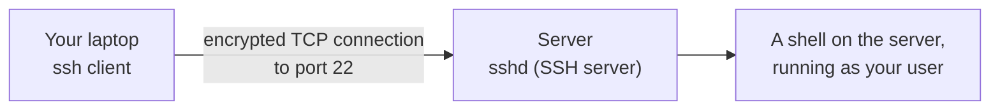
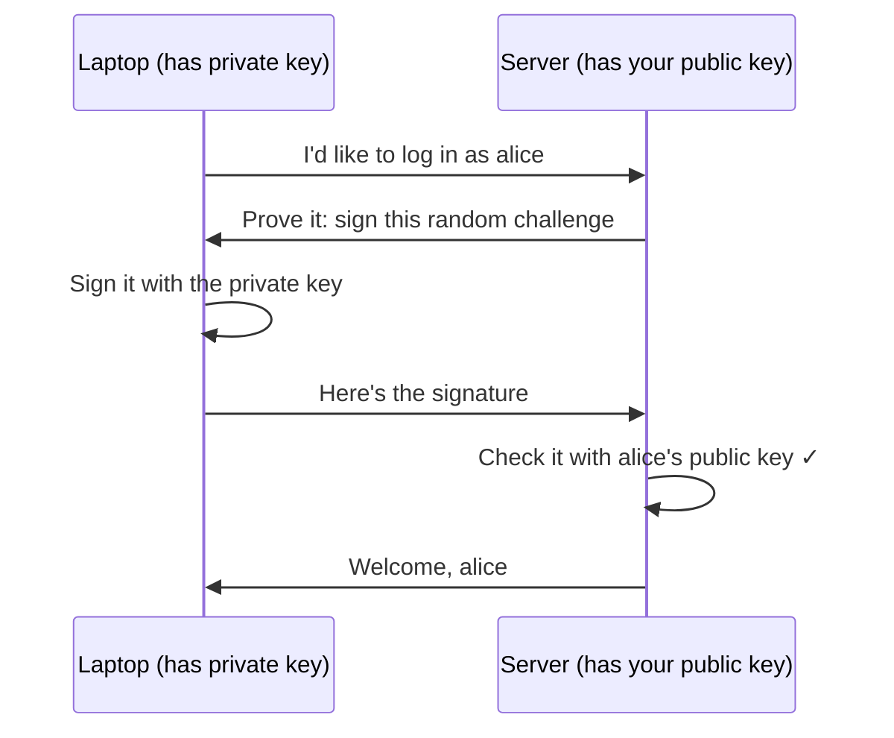
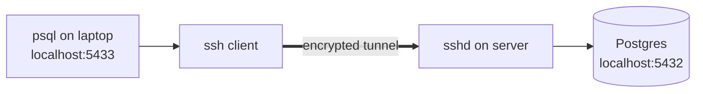

# 2.6 SSH & remote machines

Servers live in data centres you'll never visit. They have no screen and no keyboard. Everything you do to them — install software, read logs, restart a service, debug at 3 a.m. — happens over a network connection to a shell on that machine. That connection is **SSH**, and it's also how you'll push code to GitHub, reach private databases, and much more. This chapter shows how SSH works, why **keys** beat passwords, and the handful of tricks — config aliases, file copying, tunnels — that make working on remote machines feel almost local.

## What you'll learn

- What **SSH** (Secure Shell) is: an encrypted connection to a shell on another machine — and how to run a single remote command.
- **Key pairs**: a private key you keep secret and a public key you hand out — why they're safer than passwords, and how to create and install one.
- **Known hosts** and fingerprints: how SSH knows it's talking to the right server.
- The **`~/.ssh/config`** file, copying files with **`scp`** and **`rsync`**, and **tunnels** to reach private services.
- **Jump hosts**, and how to **harden** a server's SSH so bots can't break in.

---

## SSH: your terminal, on another machine

**SSH** gives you a shell on a remote machine over an encrypted connection. You type on your laptop; the commands run over there; the output comes back. Everything in between is encrypted, so nobody on the network can read or tamper with it — the same guarantees HTTPS gives the web (chapter 1.5).



The SSH **client** (`ssh`) is on your laptop. The SSH **server** (`sshd`, the "SSH daemon") is a service on the remote machine, listening on port 22 (chapter 1.4).

```bash
ssh alice@203.0.113.10                     # open an interactive shell as alice on that machine
ssh alice@203.0.113.10 'df -h && uptime'   # run just these commands remotely, print the output, disconnect
exit                                       # (inside a session) leave the remote shell
```

That second form is quietly powerful: SSH doesn't have to be interactive. Hand it a command in quotes and it runs it remotely and returns — this is how scripts and deployment tools drive servers.

:::note[Everyday anchor]
SSH is a secure phone line to a colleague sitting at the server's desk. You say "type `df -h` and read me what it says", they do it, and read the result back. Nobody tapping the line can understand a word, and you know for sure you're talking to the right colleague.
:::

---

## Keys, not passwords

You *can* log in with a password, but that's the weak way: passwords can be guessed, and every server on the internet with SSH open is hammered by bots trying common passwords around the clock.

The right way is a **key pair**, your first encounter with the public-key cryptography chapter 7.1 explains properly:

- A **private key** — a secret file on your laptop, usually `~/.ssh/id_ed25519`. **It never leaves your machine.** Anyone who has it can log in as you.
- A **public key** — `~/.ssh/id_ed25519.pub` — a matching file that's **safe to share**. You put it on every server (and on GitHub) that should let you in.

When you connect, the server sends a random challenge that only the holder of the private key can answer correctly. Your laptop answers it; the server checks the answer against your public key. **The private key itself is never sent.** Nothing to guess, nothing to intercept.



:::note[Everyday anchor]
The public key is a padlock you hand out freely — to every server, to GitHub. The private key is the only key that opens those padlocks, and it never leaves your pocket. Anyone can *have* your padlock; only you can prove you hold the key.
:::

### Creating and installing a key

```bash
ssh-keygen -t ed25519 -C "you@example.com"   # create a key pair (ed25519 = modern, short, strong)
```

It asks where to save it (press Enter for the default) and for a **passphrase**. Use one: it encrypts the private key on disk, so a stolen laptop or a leaked backup doesn't hand over your servers. You won't have to type it constantly — the **ssh-agent** remembers it for your session (macOS can store it in the Keychain).

To let yourself into a server, your public key must be in that server's `~/.ssh/authorized_keys` file (for the user you log in as):

```bash
ssh-copy-id alice@203.0.113.10               # appends your public key to the server's authorized_keys
```

On cloud servers, you usually give the provider your public key when you create the machine, and it's installed for you (chapter 12.3). For GitHub, you paste the contents of `~/.ssh/id_ed25519.pub` into **Settings → SSH and GPG keys**.

:::danger[Guard the private key]
Never paste, email, commit or upload your **private** key (`id_ed25519` — the file *without* `.pub`). If it ever leaks, remove the matching public key from every server and GitHub immediately and create a new pair. SSH also refuses to use a private key that other users can read: it must be `chmod 600` (chapter 2.2), and `~/.ssh` must be `chmod 700`.
:::

---

## Known hosts: making sure it's the right server

Keys prove *you* to the server. But how do *you* know the server is genuine and not an impostor intercepting your connection?

Each server has its own **host key**. The first time you connect, SSH shows you its **fingerprint** and asks you to confirm:

```text
The authenticity of host '203.0.113.10' can't be established.
ED25519 key fingerprint is SHA256:Zf3pXk0Q7m…
Are you sure you want to continue connecting (yes/no)?
```

Answer `yes` and SSH saves it in `~/.ssh/known_hosts`. Every later connection is checked against it. If the fingerprint ever **changes**, SSH refuses loudly:

```text
@@@@@@@@@@@@@@@@@@@@@@@@@@@@@@@@@@@@@@@@@@@@@@@@@@@@@@@@@@@
@    WARNING: REMOTE HOST IDENTIFICATION HAS CHANGED!     @
@@@@@@@@@@@@@@@@@@@@@@@@@@@@@@@@@@@@@@@@@@@@@@@@@@@@@@@@@@@
```

This is called **trust on first use**. That warning means either the server was rebuilt (common in the cloud — a new machine got the same IP) or someone is intercepting you. Find out which before continuing. If you've confirmed it's a rebuild, remove the old entry with `ssh-keygen -R 203.0.113.10`.

---

## The SSH config file: stop typing long commands

`~/.ssh/config` lets you give servers short names and default settings:

```text
# ~/.ssh/config
Host snip-prod
    HostName 203.0.113.10
    User alice
    Port 22
    IdentityFile ~/.ssh/id_ed25519

Host github.com
    User git
    IdentityFile ~/.ssh/id_ed25519
```

Now `ssh snip-prod` does the same as `ssh -i ~/.ssh/id_ed25519 alice@203.0.113.10`. The names work everywhere SSH is used — in `scp`, `rsync`, `git` and tunnels.

---

## Copying files

```bash
scp app.tar.gz snip-prod:/tmp/                # copy a file to the server
scp snip-prod:/var/log/nginx/error.log .      # copy a file from the server to here
rsync -avz ./site/ snip-prod:/srv/site/       # sync a folder: only sends what changed
```

**`scp`** is simple copying over SSH. **`rsync`** is smarter: it compares both sides and sends only differences, so re-syncing a big folder is fast. (`-a` keeps permissions and timestamps, `-v` shows progress, `-z` compresses.) Watch the trailing slash on the source folder: `site/` means "the contents of site", `site` means "the folder itself".

---

## Tunnels: reaching things that aren't public

Chapter 2.5 said the database should never be exposed to the internet. So how do *you* reach it to run a query? Through an **SSH tunnel** (also called **port forwarding**): SSH carries your traffic, encrypted, to the server, which forwards it on to the private service.

```bash
ssh -L 5433:localhost:5432 snip-prod
```

This says: "listen on **my** port 5433; send anything that arrives there through the SSH connection, and have the server connect it to **localhost:5432** — from the server's point of view." Now, on your laptop:

```bash
psql -h localhost -p 5433 -U snip snip     # talks to the database on the server, through the tunnel
```



The database stays private; only people who can SSH in can reach it. You'll see exactly the same idea in Kubernetes as `kubectl port-forward` (chapter 10.5).

### Jump hosts

Well-run networks often don't expose servers to the internet at all. Instead, one hardened machine — a **bastion** or **jump host** — accepts SSH from outside, and you hop through it to everything else:

```bash
ssh -J alice@bastion.example.com alice@10.0.1.25    # connect to a private server via the bastion
```

Or in `~/.ssh/config`, add `ProxyJump bastion` to a host entry and forget about it.

:::info[In the real world]
Many teams now avoid SSH for day-to-day access entirely: servers are rebuilt from code rather than logged into and changed by hand (Parts 9–12), and when access is needed, cloud tools such as AWS Systems Manager Session Manager provide audited shell access without opening port 22 at all. But SSH is everywhere — Git, CI systems, emergency debugging — and understanding it is non-negotiable.
:::

---

## Hardening a server's SSH

Any server with port 22 open to the internet will see login attempts from bots within minutes of booting. Three settings in `/etc/ssh/sshd_config` stop nearly all of it:

```text
PasswordAuthentication no      # keys only — nothing to guess
PermitRootLogin no             # log in as a normal user, then sudo (chapter 2.2)
PubkeyAuthentication yes
```

Then `sudo systemctl reload ssh` (chapter 2.5).

:::danger[Test before you close the door]
Before disabling password login, **open a second terminal and confirm you can log in with your key**. Keep your existing session open while you test. If the key login doesn't work and you've disabled passwords, you've locked yourself out.
:::

Beyond that: allow SSH only from known addresses in the firewall or security group, keep the server patched, and consider tools like **fail2ban**, which block addresses after repeated failed attempts.

:::warning[What can go wrong]
- **`Permission denied (publickey)`.** The server didn't accept any key you offered. Check: is your *public* key in the right user's `~/.ssh/authorized_keys` on the server? Are the permissions right (`~/.ssh` is 700, `authorized_keys` 600)? Are you using the right username? `ssh -v …` prints the whole negotiation and usually shows which step failed.
- **`UNPROTECTED PRIVATE KEY FILE!`** Your private key is readable by others. `chmod 600 ~/.ssh/id_ed25519`.
- **Blindly deleting known_hosts entries.** It makes the "host identification has changed" warning go away — and also removes the protection it gives. Confirm the change is expected first.
- **Long-running work dying with the connection.** Close your laptop and your SSH session ends, killing whatever you started in it. Run long jobs as services (chapter 2.5), or inside a terminal multiplexer like `tmux` that keeps running on the server.
:::

---

## Lab

Free, on your own computer. You'll create a key, use it with GitHub, and SSH into a disposable server running in Docker.

1. **Create your key pair** (skip if `ls ~/.ssh/id_ed25519.pub` already shows one):
   ```bash
   ssh-keygen -t ed25519 -C "you@example.com"   # accept the default path; choose a passphrase
   ls -l ~/.ssh                                  # note the permissions on the private key
   cat ~/.ssh/id_ed25519.pub                     # the PUBLIC key — safe to share
   ```

2. **Use it with GitHub.** Copy the output of `cat ~/.ssh/id_ed25519.pub`, open GitHub → **Settings → SSH and GPG keys → New SSH key**, and paste it. Then:
   ```bash
   ssh -T git@github.com     # → "Hi <you>! You've successfully authenticated…"
   ```
   The first time, you'll see GitHub's host fingerprint and be asked to confirm. GitHub publishes its fingerprints in its documentation ("GitHub's SSH key fingerprints") — compare them; that's trust-on-first-use done properly.

3. **SSH into a disposable server.** Run an SSH server in a container, trusting your public key:
   ```bash
   docker run -d --name ssh-lab -p 2222:2222 \
     -e PUBLIC_KEY="$(cat ~/.ssh/id_ed25519.pub)" \
     -e USER_NAME=learner \
     lscr.io/linuxserver/openssh-server:latest     # an SSH server listening on port 2222
   sleep 5
   ssh -p 2222 learner@localhost 'whoami && uname -a'   # run a remote command
   ```
   Notice no password was asked for (except your key's passphrase, if the agent doesn't have it yet): the server trusted your public key.

4. **Add an alias, copy a file, and clean up.**
   ```bash
   cat >> ~/.ssh/config <<'EOF'

   Host ssh-lab
       HostName localhost
       Port 2222
       User learner
   EOF
   echo "hello server" > hello.txt
   scp hello.txt ssh-lab:/tmp/          # copy it over
   ssh ssh-lab 'cat /tmp/hello.txt'     # read it remotely
   docker rm -f ssh-lab && rm hello.txt # delete the server and the file
   ssh-keygen -R "[localhost]:2222"     # forget the lab server's host key
   ```
   Remove the `Host ssh-lab` block from `~/.ssh/config` when you're done.

## Self-check

<Quiz
  id="linux-ssh-and-remote-machines"
  questions={[
    {
      q: 'Which file must never leave your laptop?',
      options: [
        '~/.ssh/id_ed25519.pub',
        '~/.ssh/id_ed25519',
        '~/.ssh/known_hosts',
        '~/.ssh/config',
      ],
      answer: 1,
      explain: 'id_ed25519 (no .pub) is the private key — whoever has it can log in as you. The .pub file is the public key, designed to be shared with servers and GitHub.',
    },
    {
      q: 'SSH warns "REMOTE HOST IDENTIFICATION HAS CHANGED". What should you do?',
      options: [
        'Delete known_hosts and reconnect; the warning clears itself',
        'Find out why: a rebuilt server explains it; if not, you may be intercepted',
        'Ignore it — the key exchange still encrypts the connection',
        'Switch to password login until the new key has been confirmed',
      ],
      answer: 1,
      explain: 'The server’s identity no longer matches what you saw before. Legitimate reasons exist (a rebuilt machine), but so does an attack. Confirm first, then remove the old entry with ssh-keygen -R.',
    },
    {
      q: 'The database only listens on localhost on the server. How can you query it from your laptop without exposing it?',
      options: [
        'Open port 5432 to the internet for as long as you need it',
        'An SSH tunnel: ssh -L 5433:localhost:5432 server, then use localhost:5433',
        'Copy the whole database to your laptop and query the copy there',
        'Disable the firewall on the server while you run your queries',
      ],
      answer: 1,
      explain: 'The tunnel carries your connection, encrypted, through SSH; the server connects to its own localhost:5432. The database is never exposed to the network.',
    },
    {
      q: 'Why are SSH keys safer than passwords?',
      options: [
        'Keys are shorter, so there is less to leak if someone is watching',
        'The private key never crosses the network, and it’s far too long to guess',
        'Keys expire every day, so a stolen key is only useful briefly',
        'Passwords are sent unencrypted by SSH, while keys are encrypted',
      ],
      answer: 1,
      explain: 'With keys, you prove possession by signing a challenge. There is nothing short to brute-force and nothing secret sent over the wire. Password logins are the main target of internet-wide bot attacks.',
    },
  ]}
/>

<details>
<summary>Explain <code>ssh -L 5433:localhost:5432 snip-prod</code> in plain words — especially what "localhost" means here.</summary>

"Open an SSH connection to `snip-prod`. On **my laptop**, listen on port **5433**. Anything that connects there gets carried through the encrypted SSH connection to the server, and the **server** then connects it to `localhost:5432`."

The key subtlety: `localhost` is interpreted **from the server's point of view** — it means "the server itself", where Postgres is listening. So `psql -h localhost -p 5433` on your laptop ends up talking to the database on the server, which never had to be exposed to any network.

</details>

<details>
<summary>You get <code>Permission denied (publickey)</code>. List three things to check.</summary>

1. **Is my public key on the server** — in the right user's `~/.ssh/authorized_keys`?
2. **Am I using the right username and key?** (`ssh -v` shows which keys are offered and what the server says.)
3. **Are the permissions strict enough on the server?** `~/.ssh` must be `700` and `authorized_keys` `600`, owned by that user — sshd ignores files others could modify.

Bonus: on your laptop, the private key must be `600` too, or SSH refuses to use it.

</details>
