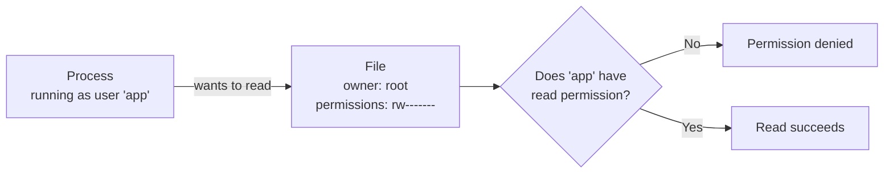
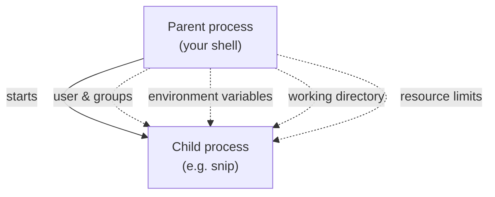

# 2.2 Users, permissions & processes

"Permission denied." Every engineer has hit it, usually at the worst moment: a script that won't run, a server that can't read its own config, a container that can't write its logs. The fix people reach for — `sudo` everything, or `chmod 777` — makes the error go away and quietly opens a security hole. This chapter explains the simple model behind every "permission denied" on Linux, so you can fix it *properly*: who is asking, what they're asking for, and what the file allows.

## What you'll learn

- **Users and groups**: every file and every process belongs to someone, and that decides what's allowed.
- **root** and **sudo**: the all-powerful administrator, and how to borrow its power carefully.
- The permission string `-rw-r--r--`: **read, write, execute** for **owner, group, others** — and the numbers like `644` and `755`.
- `chmod` and `chown`, and the difference between permission on a **file** and on a **folder**.
- How a process gets its **identity**, its **environment variables**, and its **limits** — and why real services run as unprivileged users.

---

## Every file and every process belongs to someone

Linux is a multi-user system from the ground up. Every file has an **owner** (a user) and a **group**. Every process runs **as** some user. When a process tries to do something to a file — read it, change it, run it — the OS compares *who the process is* with *what the file allows*.



That's the whole model. Every "permission denied" is this check saying no.

- A **user** is an identity: a human (`alice`) or a service (`postgres`, `nginx`, `www-data`). Each has a numeric ID (UID).
- A **group** is a named set of users, so you can grant access to several at once (e.g. everyone in `developers`, or the `docker` group from chapter 0.2).

```bash
whoami           # which user you are
id               # your user ID, your main group, and every group you belong to
```

:::note[Everyday anchor]
Think of an office building with keycards. Every door (file) has a sign: *the owner can open and rearrange it; their team can open it; everyone else can only look through the window*. Every person (process) carries a keycard saying who they are and which teams they're on. The door checks the card. "Permission denied" is the door staying shut.
:::

---

## root and sudo: the master key

One user is special: **root** (user ID 0), the administrator. Permission checks don't apply to root — it can read, change or delete anything, including the operating system itself.

That's exactly why you **don't** work as root day to day. One mistyped command as root can wipe a machine. Instead, you work as a normal user and borrow root's power for a single command with **`sudo`** ("superuser do"):

```bash
apt update               # as a normal user: fails — permission denied
sudo apt update          # runs just this one command as root (asks your password)
```

`sudo` is logged, it's temporary, and it forces a moment of intention. Treat it as a signal: *"I am about to do something that could affect the whole machine."*

:::warning[What can go wrong]
- **`sudo` as a reflex.** If a command fails with "permission denied", adding `sudo` often "works" — by skipping the question of *why*. A common result: files in your project now owned by root, so your normal user can't edit them later. Fix the ownership instead (below).
- **Running services as root.** If a web server running as root has a security bug, the attacker gets root — the whole machine. Real services run as dedicated low-privilege users. snip's container runs as a user called `nonroot` for exactly this reason (chapter 9.4).
:::

---

## Reading the permission string

Run `ls -l` and each line starts with ten characters:

```text
-rw-r--r--  1  alice  developers   2048  Sep 24 10:14  notes.md
drwxr-x---  3  alice  developers   4096  Sep 24 10:02  secrets/
-rwxr-xr-x  1  alice  developers    512  Sep 24 09:30  deploy.sh
```

Break the first one apart:

```text
 -    rw-     r--     r--
 │    └┬┘     └┬┘     └┬┘
 │     │       │       └── others (everyone else): read only
 │     │       └────────── group (developers):     read only
 │     └────────────────── owner (alice):          read + write
 └──────────────────────── type: - file, d directory, l link
```

Three permissions, for three audiences:

| Letter | On a **file** it means | On a **folder** it means |
|---|---|---|
| **r** read | see its contents | list the names inside (`ls`) |
| **w** write | change its contents | create, rename or delete files inside |
| **x** execute | run it as a program | enter it (`cd`) and reach files inside |

The folder column surprises people. To read `secrets/plan.txt`, you need **x** on the folder `secrets/` (to get through the door) *and* **r** on the file. And **deleting** a file is controlled by **w** on its *folder*, not on the file itself — because deleting means changing the folder's list of names.

### Permissions as numbers

Each group of three is also written as one digit, adding up **r = 4, w = 2, x = 1**:

| Letters | Sum | Digit |
|---|---|---|
| `rwx` | 4+2+1 | **7** |
| `rw-` | 4+2 | **6** |
| `r-x` | 4+1 | **5** |
| `r--` | 4 | **4** |
| `---` | 0 | **0** |

So `rw-r--r--` is **644** and `rwxr-xr-x` is **755**. You'll see these constantly:

| Number | Letters | Typical use |
|---|---|---|
| `644` | `rw-r--r--` | Ordinary files: you edit, others read |
| `755` | `rwxr-xr-x` | Programs and scripts; folders others can enter |
| `600` | `rw-------` | Private files: SSH keys, secrets. Only you. |
| `700` | `rwx------` | Private folders, like `~/.ssh` |

---

## Changing permissions and owners

**`chmod`** ("change mode") changes permissions:

```bash
chmod +x deploy.sh        # add execute for everyone → now ./deploy.sh can run
chmod 600 ~/.ssh/id_ed25519   # private key: owner read/write only
chmod 755 bin/            # folder others can enter and list
chmod -R u+w project/     # -R = recursive; u+w = add write for the owner (u=user, g=group, o=others)
```

**`chown`** ("change owner") changes who owns a file. Usually needs `sudo`, because you can't give away — or take — files you don't control:

```bash
sudo chown alice notes.md               # new owner
sudo chown alice:developers notes.md    # new owner and group
sudo chown -R $USER:$USER ~/code/project  # fix a project accidentally created as root
```

That last line is the proper fix for the classic "I used sudo and now I can't edit my own files" problem.

:::danger[Never "fix" permissions with chmod 777]
`777` means *everyone may read, change and run this*. It makes "permission denied" disappear by removing all protection — any user or compromised program on the machine can now modify the file. The right fix is always narrower: give the **specific** user or group the **specific** permission it needs.
:::

---

## Processes inherit identity, environment and limits

When a process starts (chapter 1.2), it inherits several things from whoever started it:



### Identity

A process runs as the user who started it (unless deliberately switched). That's why a web server started by the `nginx` user can only read files `nginx` is allowed to read. You can see owners in `ps`:

```bash
ps -eo user,pid,comm | head      # every process with its owning user
```

### Environment variables

An **environment variable** is a named piece of text a process carries: `HOME=/home/alice`, `PATH=…`, `SNIP_HTTP_ADDR=:8080`. Programs read them at startup to configure themselves — it's how snip reads all its settings (chapter 5.4).

```bash
export GREETING="hello"         # set a variable and mark it to be passed to child processes
echo $GREETING                  # use it in the shell
sh -c 'echo "child sees: $GREETING"'   # a child process inherits it
printenv | head                 # list all of this shell's environment variables
SNIP_HTTP_ADDR=:9000 go run ./cmd/snip  # set a variable for ONE command only
```

The difference between `GREETING=hello` and `export GREETING=hello`: without `export`, the variable exists only in your shell; child processes don't see it. It's a classic "but I set it!" bug.

Why configure programs this way instead of files? Because the **same program** can run unchanged on your laptop, in testing and in production — only the environment differs. This idea is central to Parts 9–12.

### Limits

The OS also limits what a process may consume. The one you'll meet most is the number of **open files**. On Linux, network connections count as files, so a busy server can hit this:

```bash
ulimit -n        # how many files this shell's processes may have open at once
```

A server that reports **`too many open files`** has hit this limit — often because it's leaking connections (opening them and never closing), sometimes because the limit is simply too low for its traffic.

:::warning[What can go wrong]
- **"Works in my terminal, fails as a service."** Your terminal has your user, your `$PATH` and your environment variables. The same program run as a background service (chapter 2.5) may run as a different user, with almost no environment. Compare `whoami`, `$PATH` and the variables in both places.
- **Forgetting `export`.** A variable set without `export` is invisible to the programs you launch.
- **Secrets in environment variables leaking.** They're convenient, but they show up in crash reports, debug pages and `ps e` output. Chapter 7.6 covers handling secrets properly.
:::

---

## Lab

Free, safe, on your own computer. Everything happens in a scratch folder.

1. **Who are you?**
   ```bash
   whoami && id          # your user and groups — do you see "docker" (from chapter 0.2)?
   ls -l /etc/passwd /etc/shadow   # the user list is world-readable; the password hashes are not
   ```
   Notice `/etc/shadow` (password hashes) has almost no permissions for others. That's the model protecting something that matters. (On macOS, `/etc/shadow` doesn't exist — macOS stores users differently.)

2. **Make a script runnable.**
   ```bash
   mkdir -p ~/perm-lab && cd ~/perm-lab
   printf '#!/bin/sh\necho "it runs!"\n' > hello.sh   # a two-line script
   ./hello.sh              # permission denied — no x bit yet
   ls -l hello.sh          # -rw-r--r--
   chmod +x hello.sh
   ls -l hello.sh          # -rwxr-xr-x
   ./hello.sh              # it runs!
   ```
   The `#!/bin/sh` first line (a "shebang") tells the OS which program should run the script.

3. **See folder permissions in action.**
   ```bash
   mkdir vault && echo "secret" > vault/plan.txt
   chmod 000 vault          # remove every permission from the folder
   cat vault/plan.txt       # permission denied — you can't get through the door
   chmod 700 vault          # owner gets everything back
   cat vault/plan.txt       # works
   ```
   The file's own permissions never changed. Access was controlled entirely by the folder.

4. **Environment variables and children.**
   ```bash
   COLOR=blue
   sh -c 'echo "child sees: [$COLOR]"'    # empty — not exported
   export COLOR=blue
   sh -c 'echo "child sees: [$COLOR]"'    # blue
   cd ~ && rm -r ~/perm-lab               # clean up
   ```

## Self-check

<Quiz
  id="linux-users-permissions-processes"
  questions={[
    {
      q: 'A file shows -rw-r-----, owner alice, group developers. Bob is in developers. What can Bob do?',
      options: [
        'Read and write it',
        'Read it only',
        'Nothing',
        'Run it as a program',
      ],
      answer: 1,
      explain: 'Owner gets rw-, group gets r--, others get ---. Bob is in the group, so he can read but not change it. Anyone outside the group can do nothing.',
    },
    {
      q: 'What does chmod 755 on a script mean?',
      options: [
        'Only the owner can run it; everyone else can only read it',
        'Owner can read, write and run; group and others can read and run',
        'Everyone can read, change and run it, including other users',
        'Owner can read and write; group and others can only run it',
      ],
      answer: 1,
      explain: '7 = rwx for the owner; 5 = r-x for group and others. It is the standard permission for programs other users are allowed to run but not modify.',
    },
    {
      q: 'Your web server can see its HTML files but gets "permission denied" reading them. The server runs as user www-data. What is the right fix?',
      options: [
        'chmod 777 on every file, so no user is ever refused',
        'Run the web server as root, which can read every file on the machine',
        'Give www-data read on the files and x on the folders above them',
        'Delete the files and recreate them as www-data using sudo -u www-data',
      ],
      answer: 2,
      explain: 'Give www-data (or its group) read permission on the files, and x on the folders leading to them. Grant exactly the access needed to exactly the user that needs it. 777 and running as root both "work" by removing protection, which turns any bug into a security hole.',
    },
    {
      q: 'You set API_URL=http://localhost:8080 in your shell, then run your program, but it says API_URL is empty. What happened?',
      options: [
        'Environment variables only reach programs after you restart the shell',
        'It wasn’t exported, so the child process did not inherit it',
        'Your program needs sudo to read variables set by your user',
        'The colon in the URL ended the variable, so it was empty',
      ],
      answer: 1,
      explain: 'Without export, the variable lives only in the shell. Child processes inherit only exported variables. Use export API_URL=… or set it for one command: API_URL=… ./program.',
    },
  ]}
/>

<details>
<summary>Why does deleting a file depend on the folder's permissions rather than the file's?</summary>

A folder is really a **list of names** pointing to files. Deleting a file means removing its name from that list — which is *changing the folder*. So you need **write (w)** on the folder (plus **x** to get into it). The file's own permissions only control reading, changing or running its contents. That's why a read-only file can still be deleted by someone who can write to its folder.

</details>

<details>
<summary>Why do well-run servers run each service as its own unprivileged user instead of root?</summary>

Because of **blast radius**. If a service has a bug an attacker can exploit, the attacker gets exactly that service's permissions. As root, that means the entire machine: every file, every other service, the OS itself. As a dedicated user like `nginx` or `nonroot`, it means only what that user can touch. Least privilege turns a potential disaster into a contained incident — a theme that returns in security (Part 7), containers (Part 9) and the cloud (chapter 12.4).

</details>
