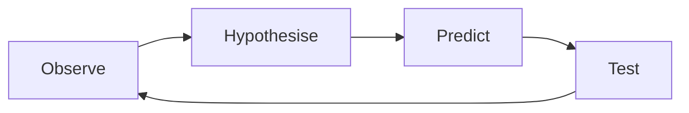
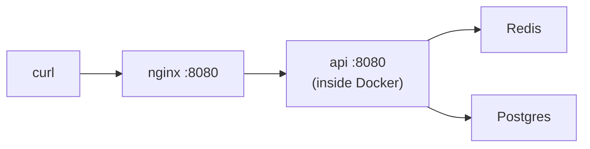

# 13.6 The debugging playbook

Some people seem to have a gift for debugging: they look at a broken system for five minutes and point at the problem. It isn't a gift. It's a **method** plus **experience**, and the method can be learned in an afternoon. This chapter is that method. It pulls together everything in this part (logs, metrics, traces, runbooks) and adds the techniques that work on *any* problem, from a failing test on your laptop to a slow production cluster: asking the right first questions, reading errors properly, cutting the search space in half until the bug has nowhere left to hide, profiling, and knowing what to do when you're stuck. Every example is a real bug we hit while building snip and this handbook's labs.

## What you'll learn

- Debugging as a loop: **observe, hypothesise, predict, test**.
- The **first three questions**, and how to **read an error** properly.
- **Narrowing down by halves**, including **git bisect**.
- **RED** and **USE**: where to look for performance problems.
- **CPU profiling** with pprof.
- Why **"flaky" is a symptom**, why **numbers are clues**, and how to get unstuck.

---

## Debugging is a loop, not a flash of insight

:::note[Everyday anchor]
A good doctor doesn't guess and prescribe. They ask what's wrong and since when, examine you, form a few possible explanations, and order the one test that best tells them apart. If the result rules out their favourite theory, they drop it without arguing. Debugging software works exactly the same way.
:::

Every effective debugging session follows the same loop:



1. **Observe**: collect facts. What exactly happens? Error messages, logs, metrics, what you ran.
2. **Hypothesise**: propose a specific, testable explanation. "Redis is slow" is vague; "each redirect waits for Redis retries" is testable.
3. **Predict**: if the hypothesis is true, what else must be true? "Then with retries off, the delay should disappear."
4. **Test**: run the smallest experiment that checks the prediction. Then go back to observing, with a new fact.

It sounds obvious. The ways people break it are not:

- **Skipping observe**: changing code before knowing what's wrong ("let's try upgrading the library").
- **Changing several things at once**: it works now, but you don't know which change fixed it, or whether one of them broke something else.
- **Never writing it down**: after an hour you can't remember what you tried. Keep a scratch file: time, hypothesis, test, result. It makes you faster, and it becomes the postmortem timeline (chapter 13.5) for free.
- **Falling in love with a theory**: the moment a test contradicts your hypothesis, the hypothesis is wrong, however elegant it was.

---

## The first three questions

Before touching anything, answer these three. They solve a surprising share of problems on their own.

**1. What exactly is the symptom?** "snip is broken" isn't a symptom. "`POST /api/links` returns 500 for every request since 14:05, for every customer; redirects are fine" is. Be precise about **what** (the exact error or behaviour), **who** (everyone, one customer, one region, one browser?), and **since when**. The shape of the answer points somewhere: "everyone since 14:05" smells like a deploy; "one customer" smells like their data or their API key; "every day at 02:00" smells like a scheduled job.

**2. What changed?** Working systems usually break because *something changed*: a deploy, a config edit, a dependency upgrade, a certificate expiring, traffic growing, a disk filling up, a new customer with unusual data. Check deploy history, Git log, config history, and the dashboards' "since when". If the timing matches a change, you have a prime suspect, and probably a quick mitigation (roll it back).

**3. Can I reproduce it?** A bug you can trigger on demand is a bug you'll fix. A bug you can't is a bug you'll guess at. Find the **smallest reliable reproduction**: one `curl` command, one failing test, one input file. Then you can test hypotheses in seconds instead of waiting for it to happen again. snip's game day in chapter 13.5 is an example: "freeze Redis, time three redirects" reproduced the problem every time, so each fix could be checked in seconds.

---

## Read the error. All of it. Slowly.

This sounds too simple to include, but it's the most skipped step in debugging. Error messages are written by people who knew exactly what went wrong at that point, and they usually tell you. Here's one from snip's logs during the game day:

```text
{"level":"WARN","msg":"click not recorded","slug":"gameday","err":"dial tcp 127.0.0.1:6379: connect: connection refused"}
```

Read it word by word:

- `click not recorded`: *what* snip failed to do (and `WARN`, not `ERROR`: the redirect itself still worked).
- `dial tcp`: it was trying to **open a new TCP connection** (chapter 1.4), not send data on an existing one.
- `127.0.0.1:6379`: to *this* address. Is that where Redis is supposed to be? (A wrong address in config is a classic.)
- `connection refused`: the machine answered, but **nothing was listening on that port**. So the network is fine and the host is up; the Redis process isn't running (or is on another port). Compare `i/o timeout`, which means *nobody answered at all* (a firewall dropping packets, a frozen process, the wrong host): a completely different problem.

A few habits:

- **Find the first error, not the last.** When things fail, they fail in cascades: one missing config value causes a failed connection, which causes 500 errors, which causes a health check to fail. The last lines of a log are usually consequences. Scroll up to the **earliest** error.
- **Read the whole stack trace**, and find the first line that's *your* code. That's usually where to start.
- **Search for the exact message** (in quotes) in your codebase and on the web. Someone has almost always seen it before.
- **Check the exit code** (chapter 2.4). A command that "printed nothing" but exited with `1` failed.

---

## Narrow it down by halves

:::note[Everyday anchor]
A string of old Christmas lights where one dead bulb makes the whole string go dark. Testing the bulbs one by one takes forever. Instead, test whether the first half works. If it does, the bad bulb is in the second half; test half of *that*. With 64 bulbs, six tests find it.
:::

When you know *that* something is broken but not *where*, the most powerful technique is to **split the search space in half** and check which half the problem is in. Then repeat. It works on anything with a sequence: layers of a system, lines of code, commits in history, rows of input data.

**Across the layers of a request.** A redirect through snip's Compose stack passes through several hops. If it fails, test each hop *directly*, starting in the middle:



- `curl localhost:8080/gameday` fails. Is it nginx or snip? Skip nginx: `docker compose exec api wget -qO- localhost:8080/healthz` (or port-forward to one Pod in Kubernetes, chapter 10.5). If snip answers directly, the problem is nginx or the network in between.
- If snip itself fails, check its dependencies directly: `docker compose exec redis redis-cli ping`, `docker compose exec postgres pg_isready -U snip`.
- **Traces** (chapter 13.3) do this splitting for you: the span that's long or red is the hop to look at.

**Across code.** Comment out half the suspicious code, or add a log line in the middle: is the value already wrong at that point? Then halve again.

**Across input.** A 10,000-row import fails somewhere. Import the first 5,000. Then 2,500 of the half that fails. Thirteen rounds find the one bad row.

### git bisect: which commit broke it?

When something **used to work and now doesn't**, the bug was introduced by some commit between the two. **`git bisect`** does the halving across history for you: you tell it one **good** commit (it worked) and one **bad** commit (it doesn't), it checks out the commit halfway between, and you say "good" or "bad". Each answer halves the remaining commits. 1,000 commits take about 10 steps.

Better still, if you have a command that exits 0 when things work and non-zero when they're broken (a test, a script, a `curl` with `-f`), **`git bisect run`** does all the steps automatically. In the lab, you'll use it on a practice repository with 40 commits, where one of them quietly broke 3-character slugs:

```text
$ git bisect start HEAD <first-commit>
$ git bisect run ./slug.sh abc
Bisecting: 19 revisions left to test after this (roughly 4 steps)
running './slug.sh' 'abc'
ok: abc
Bisecting: 9 revisions left to test after this (roughly 3 steps)
running './slug.sh' 'abc'
invalid: abc
...
2389048... is the first bad commit
    slug: tidy validation rules
```

Five tests out of 40 commits, and it names the culprit: a commit titled "tidy", which nobody would have suspected from its message. That's the point: bisect doesn't care what the commits *claim* to do.

:::info[If you've written code]
Bisect works best with **small commits** that each build and pass tests on their own (chapter 3.3). A history of "WIP", "fix", "fix again" commits, half of which don't compile, makes bisect stumble (`git bisect skip` exists for those). If a bug depends on data or environment rather than code, bisect won't find it; check "what changed" outside Git too.
:::

---

## Performance: RED for services, USE for resources

"It's slow" is the hardest kind of bug to start on, because everything is a suspect. Two short checklists give you a place to start.

**RED**, for anything that serves requests (Tom Wilkie's method). For each service:

| | Question | snip's metric (chapter 13.2) |
|---|---|---|
| **R**ate | How many requests per second? Did traffic change? | `rate(snip_http_requests_total[5m])` |
| **E**rrors | How many are failing? | `...{code=~"5.."}` |
| **D**uration | How long do they take (p50, p99)? | `snip_http_request_duration_seconds` histogram |

**USE**, for every resource (CPU, memory, disk, network, connection pools), from Brendan Gregg:

| | Question | Example |
|---|---|---|
| **U**tilisation | How busy is it, on average? | CPU at 95%; `kubectl top pods` (chapter 10.5) |
| **S**aturation | Is work queuing because it's full? | Load average above the core count; requests waiting for a database connection; the click backlog growing |
| **E**rrors | Is it failing? | Disk write errors; `OOMKilled`; `connection refused` |

RED tells you **which service** is suffering; USE tells you **which resource** is the bottleneck. Saturation is the one people forget, and it's often the real answer: a CPU at 60% average can still have a long queue during bursts (chapter 8.5's queueing lab showed latency exploding well before 100%).

---

## Profiling: where does the time actually go?

When a program is using too much CPU or memory and you don't know why, stop guessing and **measure inside it**. A **profiler** records what the program is doing, many times a second, and adds it up. Go's CPU profiler interrupts the program about 100 times per second and notes which function was running. Functions that appear in many samples are where the time goes.

snip now has an optional profiling endpoint, off by default. Set **`SNIP_DEBUG_ADDR`** (e.g. `localhost:6060`) and it serves Go's built-in profiler, **pprof**, on that separate private address (`internal/debugserver/debugserver.go`). We profiled snip handling about 35,000 redirects per second on a laptop (in-memory storage, no Redis, 20 concurrent clients from chapter 8.5's `loadgen`):

```bash
go tool pprof -top -cum "http://localhost:6060/debug/pprof/profile?seconds=5"
```

A trimmed view of the result. `cum` is the share of samples in which a function *or anything it called* was running:

| Function | cum | What it is |
|---|---|---|
| `net/http.(*conn).serve` | 79% | Everything to do with handling HTTP connections |
| `otelhttp` middleware | 38% | Tracing wrapper, *including* everything inside it (below) |
| snip's `observe` middleware | 23% | Request IDs, metrics, the log line, and the handler |
| `syscall.Syscall6` | 19% | Talking to the operating system: reading and writing the network |
| `runtime.mallocgc` | 17% | Allocating memory (and so, later, garbage collection) |
| `slog` (the per-request log line) | **9.6%** | Formatting and writing one JSON log line per request |
| snip's `redirect` handler | **8.0%** | The actual work: look up the slug, send the 302 |

Two things stand out. First, **writing the log line costs more CPU than the redirect itself**. Second, the tracing middleware costs about 15% on its own (38% minus the 23% inside it), even with tracing switched off. Now the judgment part: **does it matter?** At 35,000 requests per second on one laptop, no. snip would need enormous traffic before this was the thing to fix, and per-request logs are worth their cost when debugging (chapter 13.1). If it ever did matter, the profile tells you exactly what to try: sample the logs, or drop the tracing middleware when tracing is off. That's what profiles are for: they replace "I think logging is cheap" with a number, so you optimise the right thing, or decide confidently to optimise nothing.

Other profiles pprof serves, all from the same address:

- **heap**: which code allocated the memory that's still in use. It's the first stop for a memory leak.
- **goroutine**: every goroutine and where it's blocked. If the count keeps growing, something is starting goroutines that never finish (chapter 4.5). `curl 'localhost:6060/debug/pprof/goroutine?debug=1'` shows them as text.
- **block** and **mutex**: where goroutines wait on each other (they must be enabled in code first).

:::danger
**Never expose pprof to the internet.** It reveals your program's internals, and a CPU profile or execution trace costs real CPU while it runs, so anyone who can reach it can slow you down. snip binds it only when you set `SNIP_DEBUG_ADDR`, on a separate port from the API. Use `localhost:6060` on your machine; in Kubernetes, don't put it in any Service, and reach it with `kubectl port-forward` only when you need it.
:::

---

## "Flaky" is a symptom, not a diagnosis

A **flaky** test or check sometimes passes and sometimes fails with no code change. The tempting response is to re-run it until it's green and move on. Resist it: almost every flaky failure we've investigated was a **real bug**, usually a race or an ordering assumption, that only shows up some of the time. Three real ones from building this handbook's CI:

- **The alert test that passed sometimes.** snip's alert unit tests (chapter 13.4) failed now and then with values that looked slightly out of date. The cause: the recording rules and the alerts that used them were in **separate rule groups**, and Prometheus evaluates groups **concurrently**, so sometimes an alert read a recording from the previous evaluation. The fix was to put them in **one group**, where rules run in order. The test was right to fail.
- **The debug step that failed sometimes.** A Kubernetes lab step ran `kubectl debug` against "the first API Pod". Right after a rollout, that was sometimes an *old* Pod that was being shut down, which vanished mid-command. The fix: wait until only the expected Pods remain, and pick a Pod that isn't being deleted.
- **The check that always passed.** Not flaky, but the same lesson from the other side. A Terraform step ran `terraform plan | tee plan.txt`. In a pipeline, the exit code is the *last* command's, `tee`'s, which is always 0, so **a failing plan looked green**. The fix used `${PIPESTATUS[0]}`, the exit code of the first command in the pipe (chapter 2.3). **Check your checks**: break something on purpose and make sure the check goes red.

When something is flaky, ask: **what could differ between runs?** Timing and ordering (concurrency, what's already running), leftover state from a previous run (a port still in use, data in a database), the environment (machine speed, time zone, network), and randomness (random ports, random test data, map iteration order in Go). Then make it fail **reliably**: run it 100 times in a loop, add load, add a delay in the suspicious spot. A bug you can reproduce every time is half fixed.

:::warning[What can go wrong]
A trap we fell into in this handbook's own labs: `go run ./server &`, then `kill %1` to stop it. `go run` **builds** a program and starts it as a **separate child process**, so killing `go run` can leave the actual server running, still holding its port. Anything that starts a server on that port afterwards fails with "address already in use", but only if the earlier step ran first, so it looks random. The fix was to build a binary and run that directly, so `kill` stops the real process. If a port is "mysteriously" in use, find out who has it: `ss -ltnp | grep 8080` (chapter 1.4).
:::

---

## Numbers are clues

Measurements aren't just "big" or "small". Their **exact values** often point straight at the cause:

- **Suspiciously round durations are timeouts.** A request that takes exactly 5.0 s, 10.0 s or 30.0 s is almost always waiting for a timeout to expire, not doing slow work. During snip's game day (chapter 13.5), frozen-Redis redirects took **0.203 s**: two 100 ms read timeouts (cache read, click record) plus a little real work.
- **Multiply it out.** After the first fix, each redirect with Redis stopped still took **1.2 s**. Redirects make 3 Redis calls; 1.2 s ÷ 3 = 0.4 s per call; 0.4 s = 4 × 100 ms. Four pauses of 100 ms means five attempts, which matched a *second* retry setting in the Redis library, for opening connections. The arithmetic found it before reading any source code.
- **Cut off at the same point.** Requests that all die at about 15 s match snip's server `WriteTimeout` of 15 s, and nginx's `proxy_read_timeout` of 15 s. A limit you configured shows up as a wall in your data.
- **Powers of two, and familiar maxima.** 1024, 4096, 65,535 or 2,147,483,647 appearing as a count or size usually means a buffer, page size, port range or integer limit (chapter 1.3).
- **Exactly the number of something.** 100 connections failing when the pool size is 100; errors starting at the 61st request in a minute when the rate limit is 60 (chapter 8.4).

---

## When you're stuck

Everyone gets stuck. The skill is noticing it (you've been trying variations of the same idea for 30 minutes) and switching tactics:

- **Question your assumptions**, especially the ones you didn't know you were making. Are you running the code you think you are (did it rebuild? is it the right container image? `which snip`)? Is the config what you think (print it at startup)? Are you looking at the right environment, the right log, the right time zone?
- **Explain it out loud** to someone, or to a rubber duck on your desk (really: **rubber duck debugging** is a well-known technique). Describing the problem step by step forces you to state assumptions you skipped, and very often you'll hear the flaw halfway through the sentence.
- **Take a break.** A walk isn't avoiding the problem. Your brain keeps working on it, without the tunnel vision.
- **Ask for help, and ask well.** After an honest 30–60 minutes stuck, asking is the professional choice, not a weakness. A good question saves everyone time:

```text
What I'm trying to do: run the 13.5 game day in Compose.
What happens: `docker compose pause redis` then curl → hangs for 15 s, then 504.
What I expected: 302 in ~0.2 s, as in the chapter.
What I've tried: restarted the stack (same); /readyz says ready:false.
Versions: commit a1b2c3d, Docker 28.x, macOS.
Full output: (pasted below, not a screenshot)
```

That question almost answers itself: `ready:false` with Redis paused means the API is running code from **before** the fix (chapter 13.5), so the image wasn't rebuilt. `docker compose up -d --build` would fix it.

### A cheat sheet

| Symptom | First moves |
|---|---|
| It worked yesterday | What changed? Deploys, config, dependencies. Roll back if it matches. `git bisect` if it's in the code. |
| Errors for everyone | Dashboard (RED), recent deploys, dependencies' health (`/readyz`), the **first** error in the logs |
| Errors for one user | Their exact request and data; their permissions; a trace of one failing request |
| Slow | RED to find the service, a trace to find the step, USE to find the resource, a profile to find the code |
| Round-number durations | A timeout. Which one is set to that value? |
| Sometimes fails | What differs between runs? Timing, leftover state, environment, randomness. Make it fail reliably. |
| Works on my machine | Versions, config, data, network, OS, architecture (arm64 vs amd64, chapter 9.4) |
| Crash-looping Pod | `kubectl logs --previous`, `describe` events, exit code (chapter 10.5) |

---

## Lab

Free, on your own computer. Three short exercises: find a regression with `git bisect`, profile snip, and look inside it while it runs. All of these also run in snip's CI on every push.

1. **Build the practice repository.** From the snip folder:
   ```bash
   cd ~/code/zero-to-prod/snip
   ./examples/bisectlab/make-repo.sh /tmp/bisect-demo
   cd /tmp/bisect-demo
   ./slug.sh abc; ./slug.sh abcd
   ```
   It prints `invalid: abc` and `ok: abcd`: 3-character slugs are rejected, but they're supposed to be allowed. `git log --oneline | wc -l` shows 40 commits. The script only creates files inside `/tmp/bisect-demo`.

2. **Bisect by hand** for a few steps, to feel how it works:
   ```bash
   git bisect start
   git bisect bad                                   # the current commit is broken
   git bisect good "$(git rev-list --max-parents=0 HEAD)"   # the first commit worked
   ./slug.sh abc        # then type: git bisect good   or   git bisect bad
   ```
   Repeat `./slug.sh abc` followed by `git bisect good` or `git bisect bad` until Git names the first bad commit. Count your steps. Then run `git bisect reset` to go back to where you started.

3. **Let Git do it:**
   ```bash
   git bisect start HEAD "$(git rev-list --max-parents=0 HEAD)"
   git bisect run ./slug.sh abc
   git show refs/bisect/bad   # the first bad commit and its diff
   git bisect reset
   ```
   **What to notice:** about 5 test runs for 40 commits, and the guilty commit's message ("tidy validation rules") gives no hint. Its diff changes a single number, 3 to 4. (Use `refs/bisect/bad`, not `HEAD`: when `bisect run` finishes, `HEAD` is the last commit it *tested*, which isn't necessarily the guilty one.)

4. **Profile snip under load.** In one terminal, start snip in memory mode with the profiler on (it prints a development API key in its logs):
   ```bash
   cd ~/code/zero-to-prod/snip
   go build -o /tmp/snip ./cmd/snip && go build -o /tmp/loadgen ./examples/loadgen
   SNIP_DEBUG_ADDR=localhost:6060 SNIP_LOG_FORMAT=text /tmp/snip serve
   ```
   In a second terminal, create a link (use the key from the first terminal's output), start the load, and take a 5-second CPU profile while it runs:
   ```bash
   KEY=snip_...   # paste the key
   curl -s -X POST localhost:8080/api/links -H "Authorization: Bearer $KEY" -d '{"url":"https://go.dev","slug":"hot"}'
   /tmp/loadgen -url http://localhost:8080/hot -c 20 -d 8s &
   go tool pprof -top -cum "http://localhost:6060/debug/pprof/profile?seconds=5"
   ```
   Find `redirect` and `slog` in the output. How do their `cum` percentages compare on your machine? (We used JSON logs; you switched to text. Did that change the logging share?)

5. **Look at the goroutines** while snip is idle, then while `loadgen` is running:
   ```bash
   curl -s 'localhost:6060/debug/pprof/goroutine?debug=1' | head -1
   ```
   The first line is the total count. It grows under load (one goroutine per open connection) and falls back afterwards. A count that only ever grows is a leak.

6. **Optional, for a visual:** `go tool pprof -http=:8081 "http://localhost:6060/debug/pprof/profile?seconds=5"` opens an interactive view in your browser. The **flame graph** view (menu: View → Flame Graph) shows the same data as nested bars: the wider a bar, the more time was spent there.

Stop snip with Ctrl+C when you're done, and delete the practice repository: `rm -rf /tmp/bisect-demo`.

## Self-check

<Quiz
  id="observability-debugging-playbook"
  questions={[
    {
      q: 'A request always fails after exactly 30.0 seconds. What’s the most likely explanation?',
      options: [
        'The server is doing 30 seconds of slow work',
        'Something is waiting for a timeout set to 30 seconds to expire',
        'The network is slow',
        'Garbage collection',
      ],
      answer: 1,
      explain: 'Suspiciously round durations are almost always timeouts. Find which component has a 30-second limit, and what it was waiting for.',
    },
    {
      q: 'The log says "dial tcp 10.0.3.7:5432: connect: connection refused". What does that tell you?',
      options: [
        'The password is wrong',
        'A packet was dropped by a firewall',
        'The host answered, but nothing is listening on port 5432, so Postgres isn’t running there, or is on another port',
        'The query was too slow',
      ],
      answer: 2,
      explain: '"Refused" means an active rejection from a reachable host. A firewall or frozen process gives a timeout instead; a wrong password gives an authentication error after connecting.',
    },
    {
      q: 'A feature worked in last month’s release and is broken now, with 500 commits in between. Roughly how many steps does git bisect need?',
      options: ['About 9', 'About 50', 'About 250', '500'],
      answer: 0,
      explain: 'Each step halves the range: 500 → 250 → 125 → ... → 1 takes about log₂(500) ≈ 9 steps.',
    },
    {
      q: 'A test fails about once in 20 CI runs. What’s the best response?',
      options: [
        'Re-run until green; it’s a flaky test',
        'Delete the test',
        'Treat it as a real bug: find what differs between runs (timing, leftover state, environment, randomness) and make it fail reliably',
        'Increase every timeout to 10 minutes',
      ],
      answer: 2,
      explain: 'Flaky is a symptom. The alert test in this chapter was a genuine ordering bug that only showed up some of the time.',
    },
    {
      q: 'In snip’s CPU profile, the per-request log line used more CPU than the redirect itself. What should you do?',
      options: [
        'Remove all logging immediately',
        'Rewrite snip in another language',
        'Nothing yet: at 35,000 requests per second on a laptop it isn’t a bottleneck. Keep the number, and revisit if CPU ever becomes a real cost',
        'Double the log level',
      ],
      answer: 2,
      explain: 'Profiles tell you where time goes; judgment decides whether it matters. Optimise what’s actually limiting you.',
    },
  ]}
/>

<details>
<summary>Users report that some short links "sometimes" take several seconds to open, while most are instant. Walk through how you'd debug it with the tools from this part.</summary>

1. **Symptom, precisely:** which links, how often, since when? From the metrics (chapter 13.2), is p99 redirect latency up while p50 is fine? That's "some requests are slow", not "everything is slow".
2. **What changed?** A deploy, a traffic increase, a Redis or Postgres change around the start time?
3. **Find a slow one:** in Jaeger (chapter 13.3), search `GET /{slug}` traces longer than 1 s. Which span is long: `cache.GetURL`, `store.Get` or `links.RecordClick`?
4. **Numbers as clues:** are the slow ones all about the same duration (a timeout: which one?) or spread out (contention, a slow query)?
5. **Hypothesise and test:** if `store.Get` is slow only for links not in the cache, look at the cache hit ratio (evictions? Redis restarted and the cache is cold?) and the query plan for the lookup (chapter 6.4). If the long span is `cache.GetURL`, check Redis's saturation (USE): CPU, memory, and the slow log (`SLOWLOG GET`).
6. **Reproduce** with `curl -w '%{time_total}'` on a specific slug, before and after the fix.
7. **Write down** what you found, even if the fix was one line. The next person will thank you.

</details>

<details>
<summary>After a routine dependency upgrade, snip's tests pass locally but fail in CI with "address already in use". Suggest hypotheses and how you'd test each.</summary>

"Passes here, fails there" means something differs between the environments. Candidates:

- **A process from an earlier CI step is still running** and holding the port (the `go run` trap in this chapter). Test: add `ss -ltnp` before the failing step to see who owns the port. Fix: stop that process properly, or give each step its own port.
- **Tests run in parallel in CI** (more CPU cores, or `go test` running packages at the same time) and two tests pick the same fixed port. Test: run locally with `go test -p 8 -count=5 ./...`. Fix: let the OS choose (`127.0.0.1:0`, or `httptest.NewServer`, which snip's tests use).
- **A service container in CI already uses that port** (Postgres on 5432, Redis on 6379). Test: compare the port with the job's `services:` section. Fix: a different port.
- **The upgrade changed a default port or started a new background listener.** Test: read the dependency's changelog; `git bisect` between the old and new lock file if it's not obvious.

For each, the test is small and quick. Run them in order of likelihood, and change one thing at a time.

</details>
