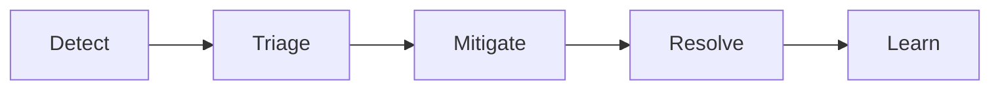

# 13.5 Incidents & postmortems

Everything in this part so far helps you *notice* that something is wrong. This chapter is about what happens next. Things will break: a dependency dies, a deploy goes bad, a disk fills up, traffic triples overnight. You can't prevent every failure. What separates good teams from struggling ones is how they **respond** (calmly, in a structured way, fixing the damage first) and whether they **learn** (so the same failure doesn't happen twice). This chapter covers both, and it isn't theory: while writing it, we ran a **game day** on snip, froze its Redis on purpose, and found two real bugs that turned a "harmless" cache outage into a total one. You'll see exactly what we saw, the fixes, and the postmortem we wrote. Then, in the lab, you'll run the same game day yourself.

## What you'll learn

- What an **incident** is, when to **declare** one, and **severity levels**.
- **Incident roles**: why the incident commander doesn't debug.
- The incident lifecycle, and why you **mitigate before you diagnose**.
- **Communicating** during an incident, inside the team and to users.
- **Blameless postmortems**: contributing factors, not a single root cause, and action items that get done.
- **Game days** and **chaos engineering**: breaking things on purpose, safely.

---

## An incident is a decision, not a feeling

:::note[Everyday anchor]
A kitchen fire in a restaurant. A small flare-up on one pan, the cook handles it with a lid, and service carries on. Smoke filling the dining room is different: someone takes charge, someone calls the fire brigade, someone moves the guests out, and nobody argues about whose fault it was until everyone is outside. Deciding "this is the second kind" early, and out loud, is what makes the response organised instead of chaotic.
:::

An **incident** is an unplanned event that hurts (or is about to hurt) your users or your business enough that normal work stops and a coordinated response starts. The key word is *coordinated*. Most problems aren't incidents: one failing test, a slow page for one customer, a warning in the logs. Those go into the normal queue.

**Declaring** an incident is a deliberate act: someone says "this is an incident", opens a dedicated channel, and the response structure kicks in. Teams that hesitate to declare lose the most time, because five people investigate the same thing separately, nobody tells users anything, and nobody is sure who decides. A good rule: **if you're wondering whether it's an incident, declare it.** Downgrading a false alarm costs a minute; a late declaration costs much more.

Most teams grade incidents by **severity level** (often written **SEV1**, **SEV2**, **SEV3**), so everyone knows how loud to be. Here's what they'd mean for snip:

| Level | Means | snip example | Response |
|---|---|---|---|
| **SEV1** | Core function down for many users, or data being lost or leaked | Redirects failing for everyone; an API key leak | Page immediately, all hands, updates every 15–30 minutes |
| **SEV2** | Core function degraded, or a minor function down | Redirects slow (the latency SLO burning); link creation failing | Page the on-call, updates every 30–60 minutes |
| **SEV3** | Minor impact, a workaround exists | Click counts delayed by an hour; one dashboard broken | Fix in working hours; no page |

The exact definitions matter less than having them **written down in advance**, so nobody debates severity at 3 a.m. Tie them to your SLOs where you can (chapter 13.4): "the fast-burn alert fired" is already a SEV2.

---

## Roles: the incident commander doesn't debug

When a real outage hits, the natural instinct is for every engineer to dive into logs. The result is chaos: duplicated work, conflicting changes ("who restarted the database?!"), and nobody talking to customers. The fix, borrowed from firefighters' **Incident Command System**, is a small set of **roles**:

| Role | Does | Doesn't |
|---|---|---|
| **Incident commander (IC)** | Owns the response: sets priorities, assigns work, decides (roll back or not?), keeps the timeline moving, declares it over | Debug. The moment the IC is reading logs, nobody is steering |
| **Operations lead** | Investigates and changes systems, or coordinates the people who do | Make changes without telling the IC |
| **Communications lead** | Updates stakeholders and users on a fixed schedule | Guess at causes in public |
| **Scribe** | Keeps a timestamped log of what was seen, tried and decided | (Often the IC in small incidents) |

In a small team, one person may wear two or three hats. That's fine, as long as someone is explicitly the IC. The IC can hand the role over ("Priya, you're IC now, I'm going to dig into Postgres"), and should say so in the channel when they do.

:::info[In the real world]
The role names come from the Incident Command System, which US fire services developed in the 1970s after wildfires where multiple agencies couldn't coordinate. Tech companies adapted it. Google's SRE book and PagerDuty's public incident response guide are both built on it, and both are free to read online.
:::

---

## Mitigate first, diagnose later

An incident has a lifecycle:



- **Detect**: an alert fires, a customer complains, someone notices a graph.
- **Triage**: how bad is it (severity)? Declare, assign an IC.
- **Mitigate**: stop the damage, *even if you don't understand it yet*.
- **Resolve**: fix the underlying problem for real.
- **Learn**: the postmortem, and the action items that come out of it.

The most important habit here is the gap between **mitigation** and **resolution**. During an incident, your job is to **stop the bleeding**, not to understand the wound. If snip's errors started 3 minutes after a deploy, **roll back now** and investigate afterwards, with users happy again and no pressure. Other mitigations: scale out, fail over to a replica, turn off a feature flag, block an abusive client, restart the stuck thing (and take a memory dump first if you can). All of them buy time without requiring the answer.

Engineers find this hard, because the puzzle is right there and it's interesting. But every minute spent understanding the bug before mitigating is a minute users are suffering. Understanding comes in the postmortem.

Two numbers teams often track: **MTTD** (mean time to detect: how long until you noticed) and **MTTR** (mean time to recover or restore: how long until users were fine). They're useful for spotting trends ("we detect late because we have no alert for X"). But treat them with care: averages of a few very different incidents mean little, and chasing them as targets leads to people declaring things resolved too early.

:::warning[What can go wrong]
- **Making it worse.** Changes during an incident are riskier: people are tired and stressed, and the system is already unhealthy. The IC approves each change, one at a time, and the scribe records it. "Restart everything" can turn a partial outage into a full one (every client reconnecting and retrying at once: a retry storm, chapter 8.1).
- **Hero mode.** One person silently fixes it at 4 a.m. and tells no one. Users got no updates, nobody else learned anything, and the next person to hit it starts from zero.
- **Declaring victory early.** The graph looks fine for two minutes and everyone leaves. Watch for at least one full cycle of whatever triggered it (a cron job, a traffic peak) before closing.
:::

---

## Communicating: say what you know, when you said you would

During an incident, silence is the worst message. Users assume the worst, support is flooded, executives interrupt the responders to ask what's going on. The fix is **regular, honest updates on a promised schedule**, even when the update is "no change".

A good update has four parts:

```text
[14:32 UTC] Investigating: redirects are slow for some users (SEV2).
Impact: roughly 20% of short links take several seconds to open; no data lost.
Doing: we've rolled back this morning's deploy and are checking the cache servers.
Next update: 15:00 UTC, or sooner if anything changes.
```

What it says: **what users experience** (not "Redis is degraded"), what you're doing, and **when they'll hear from you next**. What it doesn't do: guess at causes, blame a vendor, or promise a fix time you don't know.

For users, many services run a **status page** (a simple public page, hosted *separately* from the service so it stays up when the service doesn't) with the current state and incident history. Internally, one dedicated channel per incident (`#inc-2026-09-24-redis`) keeps the conversation findable, and gives the postmortem a ready-made timeline.

---

## Blameless postmortems: the second story

:::note[Everyday anchor]
When a plane crashes, air accident investigators don't stop at "the pilot made an error". They ask why the error was easy to make, and why it wasn't caught: a confusing display, fatigue from the roster, a warning that fired so often everyone ignored it. That's why flying is so safe. Each accident makes the whole system better, instead of just replacing one pilot.
:::

After an incident is resolved, the team writes a **postmortem** (also called an incident review or retrospective): a document describing what happened, why, and what will change. The most important word attached to it is **blameless**.

A **blameless** postmortem assumes that everyone involved acted reasonably given what they knew at the time, and asks **how the system let a reasonable action cause harm**. It's not about being nice. It's practical:

- If people are blamed, they **hide information**: they don't mention the command they ran or the warning they ignored. The postmortem then gets the facts wrong, and the real fix never happens.
- "Be more careful" is not a fix. People are always a bit careless: tired, rushed, new. A system that needs perfect humans will fail again.
- "Engineer ran the wrong command" is the **first story**. The **second story** asks why that command was so easy to run against production, why nothing asked for confirmation, and why the runbook said to run it.

### "Root cause" is usually several causes

The phrase **root cause** suggests there's one thing to fix. Real incidents almost always come from several **contributing factors** that combined: a bug that had been there for months, *plus* a config change that exposed it, *plus* a missing alert that delayed detection, *plus* a runbook step that was out of date. Remove any one of them and the incident might have been small or nonexistent. Good postmortems list all of them, and fix the cheapest ones that would have helped most.

The **five whys** technique (keep asking "why?" until you reach something fixable) is a decent start, but it tends to follow one chain and stop at the first human. Use it to open questions, not to end them.

### Action items that actually get done

A postmortem is only worth something if things change. Good action items are:

- **Specific**: "Add a unit test that fails if /readyz depends on Redis", not "improve testing".
- **Owned** by one named person, with a **due date**, and tracked in the normal backlog (not in the postmortem document, where they'll be forgotten).
- **A mix**: a quick fix for this exact problem, and at least one that makes a whole *class* of problem less likely (better alerts, a safer default, a game day).
- **Few**: three that get done beat twelve that don't.

---

## Game days: break it on purpose, before it breaks on its own

:::note[Everyday anchor]
A fire drill. Nobody waits for a real fire to discover that the fire exit is locked, or that half the staff don't know where the assembly point is. You practise when it's calm, safe and scheduled, and fix what you find.
:::

A **game day** is a planned exercise where you deliberately break part of your system (stop a database, cut the network to a service, fill a disk) and watch what happens. You check your **assumptions** ("the cache is optional, so snip will be fine"), your **alerts** (did anything fire?), your **dashboards** (could you see it?) and your **runbooks** (did the steps work?).

**Chaos engineering** is the more systematic version: running such experiments regularly, sometimes automatically and in production, with a hypothesis written down first. Netflix made it famous with *Chaos Monkey*, a tool that randomly terminates production servers during working hours, so engineers are forced to build services that survive it. You don't need to go that far. A game day in a local or staging environment, every few months, finds a surprising amount.

A good game day has:

1. A **hypothesis**, written first: "If Redis stops, redirects keep working at normal speed, clicks during the outage are lost, and `/readyz` stays healthy."
2. A **blast radius** you control: local or staging first; production only when you're confident, with an off switch ready.
3. Someone **watching**: dashboards, logs, alerts, and a stopwatch.
4. A **write-up**, even when nothing breaks. Especially then: confirming an assumption is worth writing down.

---

## Our game day: the cache that was "never fatal"

This is real. While writing this chapter, we ran exactly that hypothesis against snip on a laptop. snip's code already treated Redis as optional. Its comments said so, in `internal/links/service.go`:

```go
// Resolve finds the URL for slug: cache first, then the store (filling the
// cache on the way out). Cache errors are never fatal — a broken cache makes
// snip slower, not broken.
```

The rate limiter **fails open** if Redis is down (it lets requests through rather than blocking everyone), and a failed click recording never fails the redirect. We expected a small slowdown. We tested two kinds of Redis failure, because they behave very differently:

- **Stopped** (`redis-cli shutdown`, or `docker compose stop redis`): connections are **refused** instantly.
- **Frozen** (`kill -STOP`, or `docker compose pause redis`): the process is still there but never answers. Requests just **hang**. This is closer to a real overloaded or network-partitioned server, and it's the nastier case.

Here's what we measured, per redirect (snip running directly against local Postgres and Redis):

| Redis state | Redirect, before the fix | `/readyz`, before | Redirect, after the fix | `/readyz`, after |
|---|---|---|---|---|
| Healthy | 302 in ~1 ms | 200 | 302 in ~1 ms | 200 |
| Stopped | 302, but **3.5–5 seconds** | **503** | 302 in ~1–5 ms | 200, `"degraded": true` |
| Frozen | **no response at all**; cut off after 15–20 s | **503** after 5 s | 302 in ~200 ms | 200, `"degraded": true` |

So a cache outage, which the code comments promised was harmless, would have made snip **unusable**. Two separate problems combined.

### Contributing factor 1: readiness treated a soft dependency as hard

snip's `/readyz` (chapter 10.2) pinged Postgres *and* Redis, and returned 503 if either failed. In Kubernetes, a failing **readiness probe** removes the Pod from the Service's endpoints. With Redis down, **every** API Pod fails readiness at the same moment, so the Service has no endpoints and **every request fails**, even though every Pod could have served redirects from Postgres.

The distinction that was missing is between a **hard dependency** (without it, you can't do your job: Postgres, the source of truth) and a **soft dependency** (without it, you do your job worse: Redis, a cache). Readiness should only fail for hard ones. The fix, in `internal/httpapi/server.go`, splits them:

```go
// Ready are hard dependencies: if one is down, this process can't serve
// and /readyz says 503. Degradable are soft ones (Redis): snip keeps
// working without them, so they're reported but never fail readiness.
// Failing readiness on a soft dependency pulls every copy out of the
// load balancer at once, turning a degraded service into an outage.
Ready      map[string]Pinger
Degradable map[string]Pinger
```

Now `/readyz` with Redis down answers `200 {"ready":true,"degraded":true,"checks":{"postgres":"ok","redis":"degraded"}}`: honest about the problem, without pulling the plug.

### Contributing factor 2: the client library's defaults were built for patience

Even without Kubernetes, each redirect took seconds. snip uses the `go-redis` client library, created with nothing but an address. Its **defaults** are tuned for a Redis you really need: retry each command 3 times with backoff, try each new connection 5 times with 100 ms pauses, wait up to 3 seconds for a reply. Each redirect makes up to three Redis calls (read the cache, fill the cache, record the click), so all that patience added up to seconds, or, with a frozen Redis, to more than the server's 15-second write timeout, and the request was cut off.

For a **cache**, patience is wrong: if it doesn't answer quickly, go to Postgres. The fix, in `cmd/snip/main.go`, makes the client **fail fast**:

```go
rdb := redis.NewClient(&redis.Options{
	Addr:          cfg.RedisAddr,
	MaxRetries:    -1, // -1 disables command retries; 0 means "the default, 3"
	DialerRetries: 1,  // despite the name, this counts dial *attempts*: 1 = no retry (0 means 5)
	DialTimeout:   250 * time.Millisecond,
	ReadTimeout:   100 * time.Millisecond,
	WriteTimeout:  100 * time.Millisecond,
	PoolTimeout:   200 * time.Millisecond,
})
```

Look at those comments. They're the kind of detail you only learn by measuring. The first attempt (only `MaxRetries: -1` and short timeouts) still took 1.2 seconds per redirect. Reading the library's source showed a *second*, newer retry loop for opening connections, whose setting is called `DialerRetries` but actually counts **attempts**, and where `0` means "use the default of 5". The number 1.2 seconds was the clue: 3 calls × 4 pauses × 100 ms.

A third, smaller change: if reading the cache just failed, `Resolve` no longer tries to *write* to it on the way out (`internal/links/service.go`), because that would wait for another timeout. That took the frozen case from 300 ms to 200 ms, under snip's 250 ms latency target (chapter 13.4).

:::info[If you've written code]
**Every network client has defaults, and they were chosen for someone else's use case.** Retries, timeouts, pool sizes and connection attempts are the usual suspects. For every dependency, decide: is this hard or soft? How long is the *whole* request allowed to take (its budget), and how much of that can this call use? Then set the values explicitly, with a comment saying why. The next step up from what snip does is a **circuit breaker** (chapter 8.4): after a few failures, stop calling Redis at all for a few seconds, so even the 100 ms timeouts disappear. That's a reasonable exercise, and it isn't built in snip yet.
:::

### What we didn't change: clicks during a Redis outage are lost

Clicks travel through a Redis stream to the worker (chapter 8.2). With Redis down, the click can't be queued, so the redirect logs `click not recorded` and bumps `snip_click_record_errors_total`, and that click is **gone**. That's an acceptable trade-off for snip (a missed click count beats a failed redirect), but it must be a **decision**, written down, not a surprise. The runbook now has a `redis-down` section saying so, and that the outage window should be noted as a data gap.

One subtle thing we checked: when Redis is *frozen* rather than stopped, a request that times out might still have reached Redis and run once Redis wakes up. **A timeout means "I don't know", not "it didn't happen"** (chapter 8.1). In our tests, none of those clicks landed after Redis resumed, because the client throws away a connection that timed out before the command is sent. But don't rely on that in general. It's exactly the kind of case where idempotency keys earn their keep.

### The postmortem

Here's the write-up, in the format we recommend. It's short on purpose. Use it as a template (it's also a good shape for the lab).

```markdown
# Game day 2026-09-24: Redis outage makes snip unusable

**Status:** complete · **Severity if it had happened in production:** SEV1
**Summary:** With Redis stopped or frozen, redirects took 3–5 s or never
returned, and /readyz failed on every copy (in Kubernetes: zero endpoints).
Expected: redirects keep working from Postgres.

## Impact (hypothetical: found in a game day, no users affected)
All redirects and API calls, for as long as Redis is unhealthy.
Clicks during the outage are lost (by design; now documented).

## Timeline (UTC)
23:24 Redis stopped under a running snip. Redirects 302 but take 3.5–5 s. /readyz 503.
23:25 Readiness depends on Redis → factor 1 identified.
23:26 Fix 1 (degradable checks) + fix 2a (no command retries, short timeouts).
23:26 Re-test: still 1.2 s per redirect. Source reading finds dial retries.
23:26 Fix 2b (DialerRetries: 1). Stopped Redis: ~2 ms.
23:26 Redis frozen instead: 300 ms. Old binary frozen: no response for 15–20 s.
23:27 Fix 3 (skip cache fill after a cache error): 200 ms. Tests added.

## Contributing factors
1. /readyz treated Redis (soft) the same as Postgres (hard).
2. go-redis defaults (retries, dial attempts, 3 s reads) suit a primary
   datastore, not a cache; we never set them.
3. No test or game day had exercised "Redis down" end to end, so the code
   comments ("never fatal") were never checked.

## What went well
Cache and rate-limiter code already failed open; the redirect path never
returned errors, only slowness. Measuring with curl made each fix verifiable.

## Action items
- [x] Degradable readiness checks + unit test (TestReadyzHardVsDegradable)
- [x] Fail-fast Redis client options, with comments explaining each value
- [x] Skip cache fill after a cache error + unit test (TestResolveWithCacheDown)
- [x] Runbook: redis-down section; readiness wording
- [x] CI: this game day runs on every push (the snip-stack job)
- [ ] Circuit breaker around Redis (deferred; see chapter 8.4)
```

Notice what the postmortem *doesn't* contain: anyone's name next to a mistake. The code that failed was reasonable when written. The system (no tests for this failure, library defaults nobody examined) let it stay broken.

:::info[In the real world]
Big outages very often follow this shape: a component everyone considered optional turns out to be load-bearing, because of a health check, a retry setting or a default nobody examined. Several major cloud providers' public incident reports describe exactly this. Reading other companies' postmortems is one of the cheapest ways to learn operations: search for "post-incident review" or "incident report" on the status pages and engineering blogs of the big cloud providers, and look for a few community collections of public postmortems.
:::

---

## Lab

Free, on your own computer, with the Compose stack from chapter 9.3. You'll run the game day yourself: form a hypothesis, break Redis two ways, measure, and write it up. These exact steps also run in snip's CI on every push (the `snip-stack` job).

1. **Start the stack and make a link.**
   ```bash
   cd ~/code/zero-to-prod/snip
   docker compose up -d --build --wait
   KEY=$(docker compose exec -T api snip keys create gameday | grep -o 'snip_[A-Za-z0-9]*')
   curl -s -X POST localhost:8080/api/links -H "Authorization: Bearer $KEY" -d '{"url":"https://go.dev","slug":"gameday"}'
   ```

2. **Write your hypothesis** in a text file before you break anything. What will redirects do? `/readyz`? Clicks? Link creation?

3. **Measure the healthy baseline.** This prints the status code and total time for three redirects:
   ```bash
   for i in 1 2 3; do curl -s -o /dev/null -w '%{http_code} %{time_total}s\n' localhost:8080/gameday; done
   curl -s localhost:8080/readyz; echo
   ```

4. **Freeze Redis** (`pause` stops the process without killing it, like a hung server), and measure again:
   ```bash
   docker compose pause redis
   for i in 1 2 3; do curl -s -o /dev/null -m 5 -w '%{http_code} %{time_total}s\n' localhost:8080/gameday; done
   curl -s localhost:8080/readyz; echo
   docker compose logs api --since 1m | grep 'click not recorded' | head -3
   docker compose unpause redis
   ```
   **What to notice:** every redirect still returns `302`, in roughly 0.2 seconds (snip's CI measures 0.203 s). `/readyz` says `"ready":true` but `"degraded":true`. The logs show clicks that weren't recorded.

5. **Stop Redis instead** (connections refused rather than hanging), and measure again:
   ```bash
   docker compose stop redis
   for i in 1 2 3; do curl -s -o /dev/null -m 5 -w '%{http_code} %{time_total}s\n' localhost:8080/gameday; done
   docker compose start redis
   ```
   **What to notice:** this is much faster than the frozen case (about 10 ms through nginx in CI). A dead server is easier to handle than a slow one.

6. **Check the clicks.** Look at the link's click count (`curl -s localhost:8080/api/links/gameday -H "Authorization: Bearer $KEY"`). Were the clicks made during the outage counted? Does that match what the runbook's `redis-down` section says?

7. **Optional: see the bug for yourself.** Check out the version just before the fix, rebuild, and repeat step 4. The redirects hang until `curl` gives up after 5 seconds, and `/readyz` returns 503. Then go back:
   ```bash
   git switch --detach 138adef~1 && docker compose up -d --build --wait
   # ...repeat step 4...
   git switch main && docker compose up -d --build --wait
   ```

8. **Write the postmortem.** Copy the template above and fill it in for *your* game day: hypothesis, what happened, where you were wrong, and one action item. If everything matched your hypothesis, write that down too.

9. **Clean up:** `docker compose down` (add `-v` if you also want to delete the database volume).

## Self-check

<Quiz
  id="observability-incidents-and-postmortems"
  questions={[
    {
      q: 'Redirects started failing 4 minutes after a deploy. You don’t yet know why. What should you do first?',
      options: [
        'Read the diff carefully until you find the change that broke it',
        'Roll back, confirm users recover, then investigate',
        'Wait ten minutes in case it recovers on its own as caches warm',
        'Restart every service, in case something is stuck after the deploy',
      ],
      answer: 1,
      explain: 'Mitigate before you diagnose. The timing points at the deploy, and rolling back stops the harm; understanding can happen afterwards, calmly.',
    },
    {
      q: 'Why shouldn’t the incident commander be the one debugging?',
      options: [
        'Incident commanders are usually managers, who can’t read the code',
        'Deep in logs, nobody coordinates, decides or keeps users updated',
        'Debugging is the scribe’s job, as they see the whole timeline',
        'It’s a compliance requirement that the person debugging can’t also sign off',
      ],
      answer: 1,
      explain: 'The IC steers. Someone else does the hands-on work, and the IC hands the role over explicitly if they need to dig in.',
    },
    {
      q: 'In snip’s game day, why did a Redis outage threaten a total outage in Kubernetes?',
      options: [
        'Redis stores every link, and Postgres only keeps the backups',
        '/readyz failed without Redis, so every Pod left the Service, though Postgres could serve',
        'Kubernetes restarts every Pod that loses its connection to a dependency',
        'The worker crashed and took the API Pods’ shared queue down with it',
      ],
      answer: 1,
      explain: 'Redis is a soft dependency. Readiness should only fail for hard ones (Postgres); now Redis is reported as "degraded" instead.',
    },
    {
      q: 'Why was a frozen Redis worse than a stopped one?',
      options: [
        'A frozen Redis loses all the data it was holding in memory',
        'A stopped one refuses at once; a frozen one never answers, so calls wait out timeouts',
        'Docker can’t detect a frozen container, so it never restarts it and the data goes stale',
        'They behave the same for clients, but a frozen one takes much longer to restart',
      ],
      answer: 1,
      explain: 'Slow is harder than dead. Timeouts are what bound the damage; with the old defaults, a single redirect could wait longer than the server’s 15-second limit.',
    },
    {
      q: 'Which is the best postmortem action item?',
      options: [
        'Engineers should be more careful when changing anything about Redis',
        'Improve reliability of the readiness checks across all services',
        'Test that /readyz stays 200 when only Redis is down (Sam, Friday)',
        'Consider looking into whether we need Redis at all, and discuss next quarter',
      ],
      answer: 2,
      explain: 'Specific, owned and dated, and it changes the system rather than asking people to be perfect.',
    },
  ]}
/>

<details>
<summary>A teammate ran a database migration that locked a large table, and redirects failed for 20 minutes. The draft postmortem's root cause says "Engineer ran migration during business hours." Rewrite it blamelessly, with contributing factors and action items.</summary>

The first story blames a person. The second story asks why a reasonable action caused harm:

- **Contributing factors:** the migration took an exclusive lock on the `links` table while rewriting it, so every redirect's lookup waited (chapter 6.5); nothing in review or CI flagged migrations that lock big tables; the migration ran in the same deploy as a code change, so the rollback button didn't undo it; the latency alert fired, but the runbook had no "check for running migrations" step, so it took 12 minutes to connect the two.
- **Action items (owned, dated):** a CI check that fails migrations using locking operations on large tables without an explicit override; document the safe patterns (add the column as nullable, backfill in batches, create indexes `CONCURRENTLY`); run migrations as a separate, announced step; add "long-running queries and locks" (`pg_stat_activity`) to the high-error-rate runbook.
- **What went well:** the alert fired within 3 minutes, so detection was quick.

Nowhere does it say who ran the migration, because it doesn't matter. Anyone could have, and the fixes make sure the next person can't hurt users the same way.

</details>

<details>
<summary>Plan a game day for snip's worker: hypothesis, how you'd break it, what you'd watch, and what "pass" means.</summary>

- **Hypothesis:** "If the worker stops for 20 minutes, redirects are unaffected; clicks queue up in the Redis stream (none lost); `SnipNoWorkerRunning` fires within 5 minutes; when the worker restarts, it catches up and the backlog returns to zero within a few minutes."
- **Break it:** `docker compose stop worker` (and a variant: `docker compose pause worker`, which is "running" but stuck, which the absent-worker alert *won't* catch, but the backlog alert should).
- **Watch:** redirect latency and error rate (should be flat), `snip_worker_lag_events` rising, `XLEN snip:clicks`, Prometheus's alerts page, and the click count for a test link before and after.
- **Pass:** redirects unchanged, the right alert fires for each variant, the final click count equals the number of redirects you made, and the runbook's `click-backlog` steps worked as written.
- **Write it up** either way. If the paused variant fires no alert for a long time, that's a finding: maybe you need an alert on "lag growing *and* no clicks processed".

</details>
