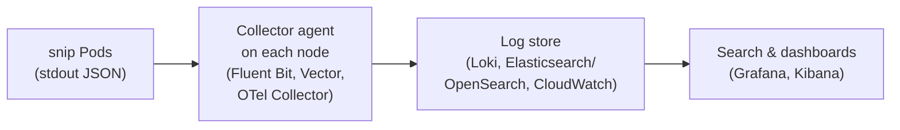

# 13.1 Logs

Part 13 is about **observability**: being able to understand what a running system is doing, and *why*, from the outside, without adding new code or attaching a debugger while it's on fire. A system is observable when you can answer questions you didn't think to ask in advance: why were some requests slow between 14:03 and 14:10, only for one customer? Three kinds of signal make that possible: **logs** (this chapter), **metrics** (13.2) and **traces** (13.3). Logs are the oldest and the most familiar: a program writing down what happened, one line at a time. They're also the easiest to do badly: millions of lines of `something went wrong` that nobody can search. This chapter shows what good logs look like, using snip's: structured, correlated by request ID, free of secrets, and cheap enough to keep.

## What you'll learn

- What logs are for, and how they fit with metrics and traces.
- **Structured logging** (JSON) vs free text, and why machines need to read logs too.
- **Log levels**, and what to log, and what **never** to log.
- **Request IDs** for following one request through a system.
- Writing to **stdout** and letting the platform collect; **centralised logging**, queries, retention and cost.

---

## What logs are for

A **log** is a timestamped record of an **event**: a request was served, a job failed, the configuration was loaded. Logs are the most detailed signal: they can say exactly which request, which user, which error message. That detail makes them the tool for "what exactly happened to *this* request?"

:::note[Everyday anchor]
An aircraft's flight recorder doesn't write "the flight went fine". It records, every moment, altitude, speed, engine state and cockpit voices, each stamped with the time, in a fixed format that investigators' tools can read. After an incident, they replay precisely what happened. Good logs are a flight recorder for your software: timestamped, structured, complete enough to reconstruct events, and readable by tools, not just by eyes.
:::

The three signals complement each other:

| Signal | Answers | Detail | Cost |
|---|---|---|---|
| **Logs** | What exactly happened, to which request? | Highest: every event | Grows with traffic; the most expensive to store |
| **Metrics** (13.2) | How much, how often, how fast, overall? | Aggregated numbers over time | Cheap and constant, whatever the traffic |
| **Traces** (13.3) | Where did the time go in this request, across services? | One request's path | Usually sampled |

Typically: metrics tell you **something** is wrong ("error rate up since 14:03"), traces tell you **where** ("the database call"), logs tell you **what exactly** ("`relation "links" does not exist`").

---

## Structured logs

Compare two ways of logging the same event:

```text
2026-09-24 23:05:41 INFO GET /logs 302 took 0ms (id=de82562114236c16)
```

```json
{"time":"2026-09-24T23:05:41.41994767Z","level":"INFO","msg":"request","request_id":"de82562114236c16","method":"GET","route":"GET /{slug}","path":"/logs","status":302,"duration_ms":0}
```

The first is readable to a person and a puzzle to a machine: to find all requests slower than 500 ms, you'd write a fragile regular expression and hope nobody changes the wording. The second is **structured**: each fact is a named field. Tools can filter (`status >= 500`), group (`count by route`) and chart (`p99 of duration_ms`) without parsing prose. That's why production logs are almost always **JSON**, one object per line.

snip uses Go's standard **`log/slog`** package. The format is a setting (chapter 7.6): JSON by default, or `SNIP_LOG_FORMAT=text` for friendlier local reading:

```go
func (c Config) Logger() *slog.Logger {
	opts := &slog.HandlerOptions{Level: c.LogLevel}
	if c.LogFormat == "text" {
		return slog.New(slog.NewTextHandler(os.Stdout, opts))
	}
	return slog.New(slog.NewJSONHandler(os.Stdout, opts))
}
```

Every request passes through one piece of middleware (`internal/httpapi/middleware.go`) that writes exactly one line when it finishes:

```go
s.log.InfoContext(ctx, "request",
	"request_id", id, "method", r.Method, "route", route, "path", r.URL.Path,
	"status", rec.status, "duration_ms", elapsed.Milliseconds())
```

Notice the **`route`** field (`GET /{slug}`, the pattern) alongside **`path`** (`/logs`, the actual URL). Grouping by route answers "how is the redirect endpoint doing?", however many different slugs there are.

Structure has a security benefit too: **log injection**. If a program writes user input straight into free-text logs, an attacker can include a newline and a fake line (`\n2026-09-24 INFO admin login succeeded`) to mislead investigators. A JSON encoder escapes the newline, so it stays inside the field as data (chapter 7.5's rule: untrusted input is never code).

---

## Levels, and what to log

**Log levels** mark importance, and a **threshold** decides what's written (snip: `SNIP_LOG_LEVEL`, default `info`):

| Level | Use for | snip example |
|---|---|---|
| **DEBUG** | Detail for developers diagnosing a problem; usually off in production | `processed clicks` with counts, from the worker |
| **INFO** | Normal, significant events | `snip listening`, one `request` line per request |
| **WARN** | Something unexpected that was handled, but may need attention | `SNIP_DATABASE_URL not set: using in-memory storage` |
| **ERROR** | Something failed and a human may need to act | `processing clicks failed; retrying`, a recovered panic |

Good log lines record **events with context**: what happened, to what, with what result, and enough identifiers to connect them. Write them for the person reading them at 3 a.m. during an incident (chapter 13.5): specific messages, the relevant IDs, the actual error.

What to leave out:

- **Noise.** snip skips logging `/healthz` and `/metrics`: Kubernetes probes and Prometheus call them every few seconds (chapters 10.2 and 13.2), and logging them would bury real traffic.
- **Secrets**: passwords, API keys, tokens, full connection strings, cookies, `Authorization` headers.
- **Personal data** you don't need: email addresses, names, IP addresses in some jurisdictions. Logs get copied to many systems and kept for months, and data-protection law applies to them.

:::warning[What can go wrong]
Look at snip's own start-up log in in-memory mode:

```json
{"level":"INFO","msg":"in-memory mode: created a development API key (valid until snip stops)","api_key":"snip_…"}
```

That's a secret in a log, and it's **deliberate**: in-memory mode is for learning on your laptop, the key is generated fresh on every start, it grants access only to that throwaway process, and printing it is how you find it. In Postgres mode, snip never logs keys; it stores only their hashes (chapter 7.2). The judgment is the point: this is acceptable for a local development convenience, and would be an incident in any shared environment. Real systems redact at source, and many log pipelines add a second layer of pattern-based redaction for anything that slips through.
:::

---

## Request IDs: following one request

snip gives every request an ID, returns it to the client in a header, and puts it in every log line about that request:

```go
id := r.Header.Get("X-Request-ID")
if !validRequestID(id) {          // empty, over 64 characters, or anything but letters, digits and -_.
	id = newRequestID()           // 8 random bytes, as hex
}
w.Header().Set("X-Request-ID", id)
```

Reusing an ID a proxy in front of snip already assigned lets one ID follow the request through every system. But the header comes from outside, and snip copies it into its logs and its response, so it only accepts short, plain IDs; anything else gets a fresh one. (Chapter 7.5's rule: never trust input just because it's a header.)

This makes three things possible:

1. **Support**: a user reports an error and quotes the `X-Request-Id` from the response (or the error page shows it). You search for exactly that request.
2. **Correlation**: every line logged while handling the request carries the same ID, so you can pull out one request's story from millions of lines.
3. **Propagation**: if a caller already sent an `X-Request-ID` (a proxy, or another service), snip keeps it, so one ID can follow a request across services. Tracing (chapter 13.3) formalises this with **trace IDs**, and many systems log the trace ID for exactly this reason.

---

## Where logs go

snip doesn't open log files, rotate them or ship them anywhere. It writes to **stdout**, one JSON object per line, and stops thinking about it (chapter 5.4). Whatever runs snip decides where the lines go:

| Where snip runs | Who collects stdout | Where you read it |
|---|---|---|
| Your terminal | Your terminal | The screen, or `\| jq` |
| systemd (chapter 2.5) | journald | `journalctl -u snip` |
| Docker / Compose (chapter 9.3) | The container runtime | `docker compose logs api` |
| Kubernetes (chapter 10.5) | The kubelet, to files on the node | `kubectl logs`; a log agent ships them on |
| ECS on AWS (chapter 12.3) | The `awslogs` driver | CloudWatch Logs, snip's log group |

In production, a **log pipeline** collects everything centrally, because nobody can `kubectl logs` across 200 Pods that were replaced an hour ago:



The **collector** runs on every node (a DaemonSet, chapter 10.2), reads container output, adds metadata (namespace, Pod, node), and ships it. The **store** indexes it for search. With structured logs, a query is precise. In Grafana **Loki**'s query language (LogQL), "5xx responses from snip's API in the last hour, by route" is:

```text
sum by (route) (count_over_time({namespace="snip", app="api"} | json | status >= 500 [1h]))
```

### Retention and cost

Logs are usually the most expensive observability signal, because their volume grows with traffic and they're billed on **ingestion** and **storage**. The standard controls:

- **Levels**: `info` in production, `debug` only when investigating (chapter 10.4 showed switching it with a rollout).
- **Don't log what metrics can count.** A counter for "redirect served" costs the same at a million requests a second as at one; a log line per redirect doesn't. snip logs each request today, which is fine at its scale. A very high-traffic service might sample request logs (keep 1 in 100 successes, all errors).
- **Retention by value**: 7–30 days searchable for operations, longer (and cheaper, in object storage) only for what audits or law require.

:::info[In the real world]
Mature teams standardise one structured format and a common set of fields across all services (service name, version, environment, request or trace ID), so a single query spans everything. Logs flow through a pipeline that parses, enriches and redacts, into a store with sensible retention, and every alert (chapter 13.4) links to the logs for the right time and service. Many are moving to **OpenTelemetry** for all three signals, so logs, metrics and traces share IDs and can be jumped between (chapter 13.3).
:::

---

## Lab

Free, on your own computer. You'll produce real snip logs and query them like a log store would.

1. **Generate traffic and capture the logs.** Start snip in in-memory mode, writing its JSON logs to a file:
   ```bash
   cd ~/code/zero-to-prod/snip
   go build -o bin/ ./cmd/snip           # a binary, so `kill` below stops snip itself (chapter 8.6)
   SNIP_HTTP_ADDR=:8086 ./bin/snip > /tmp/snip-logs.json 2>&1 &
   sleep 2; KEY=$(grep -o 'snip_[A-Za-z0-9]*' /tmp/snip-logs.json | head -1)
   curl -s -o /dev/null -X POST localhost:8086/api/links -H "Authorization: Bearer $KEY" -d '{"url":"https://go.dev","slug":"logs"}'
   for i in 1 2 3; do curl -s -o /dev/null localhost:8086/logs; done
   curl -s -o /dev/null localhost:8086/nope                                                      # 404
   curl -s -o /dev/null -X POST localhost:8086/api/links -H "Authorization: Bearer wrong" -d '{}'   # 401
   curl -s -o /dev/null -X POST localhost:8086/api/links -H "Authorization: Bearer $KEY" -d '{"url":"ftp://x"}'   # 400
   curl -s -D - -o /dev/null localhost:8086/logs | grep -i x-request-id
   kill %1
   ```

2. **Query the logs with jq** (chapter 2.3):
   ```bash
   L=/tmp/snip-logs.json
   jq -c 'select(.status >= 400) | {status, route, request_id}' $L       # every error
   jq -r 'select(.msg == "request") | .status' $L | sort | uniq -c          # responses by status
   jq -r 'select(.msg == "request") | .route' $L | sort | uniq -c | sort -rn # traffic by route
   ```
   ```text
   {"status":404,"route":"GET /{slug}","request_id":"cd730bcdf6e9a143"}
   {"status":401,"route":"POST /api/links","request_id":"ff56980bc8a0d860"}
   {"status":400,"route":"POST /api/links","request_id":"9ac8973ff8638a95"}
   ```
   (Your IDs will differ.)

3. **Follow one request.** Take the `X-Request-Id` value printed by the last `curl` in step 1 and find its log line: `jq -c 'select(.request_id == "PASTE_ID")' $L`. That's the support workflow: a user quotes an ID, you find exactly their request.

4. **See the difference a format makes.** Restart with `SNIP_LOG_FORMAT=text` and repeat a request. Which would you rather read, and which would you rather query?

5. **Find the secret.** Search the log file for `api_key`. Why is this acceptable here and nowhere else? (In-memory mode, local only, a throwaway key regenerated on every start. In Postgres mode snip never logs keys.)

## Self-check

<Quiz
  id="observability-logs"
  questions={[
    {
      q: 'Why are production logs usually structured JSON rather than free text?',
      options: [
        'JSON is smaller',
        'Each fact is a named field, so tools can filter, group and chart reliably without fragile text parsing',
        'Free text is not allowed',
        'JSON is encrypted',
      ],
      answer: 1,
      explain: 'Logs are read by machines at scale. Structure makes queries like status >= 500 by route trivial.',
    },
    {
      q: 'What is a request ID for?',
      options: [
        'Authentication',
        'Correlating every log line about one request, letting users and support refer to a specific request, and following it across services',
        'Rate limiting',
        'Caching',
      ],
      answer: 1,
      explain: 'snip returns it in X-Request-Id and logs it on every line for that request.',
    },
    {
      q: 'Why does snip not log /healthz and /metrics requests?',
      options: [
        'They have no status code',
        'Probes and scrapers call them every few seconds; logging them would add noise and cost and bury real traffic',
        'They are secret',
        'Go can’t log them',
      ],
      answer: 1,
      explain: 'Good logs are about events that matter. Health checks are better observed through metrics.',
    },
    {
      q: 'Which of these should never appear in production logs?',
      options: [
        'Request IDs',
        'Passwords, API keys, tokens and full connection strings',
        'HTTP status codes',
        'Route patterns',
      ],
      answer: 1,
      explain: 'Logs are copied widely and kept for months. Redact secrets at source.',
    },
    {
      q: 'Why does snip write logs to stdout instead of managing log files?',
      options: [
        'Files are slower',
        'The platform (systemd, Docker, Kubernetes, ECS) collects stdout and ships it on; the app stays simple and works the same everywhere',
        'Go can’t write files',
        'stdout is encrypted',
      ],
      answer: 1,
      explain: 'Separating "produce logs" from "route and store logs" is a core cloud-native practice.',
    },
    {
      q: 'Metrics say the error rate rose at 14:03. What do logs add?',
      options: [
        'Nothing',
        'The exact failing requests and error messages, filterable by route, status and time, so you can see what specifically went wrong',
        'A graph of CPU usage',
        'The cost of the incident',
      ],
      answer: 1,
      explain: 'Metrics detect and quantify; logs explain specific events.',
    },
  ]}
/>

<details>
<summary>Rewrite this log line to be useful: log.Println("error!")</summary>

Useless because it has no context, no level, no identifiers and no actual error. A useful version, with slog:

```go
log.ErrorContext(ctx, "saving link failed",
    "request_id", requestID,
    "slug", slug,
    "owner_id", ownerID,
    "err", err)
```

It has a level (ERROR), a specific message saying what failed, the identifiers to find and connect it (request ID, slug, owner), and the underlying error (which contains the database's own message). It doesn't include the API key, the full request body, or personal data. Written as JSON, it's queryable: all "saving link failed" errors in the last hour, grouped by error message.

</details>

<details>
<summary>Your logging bill tripled after a deploy. How do you find and fix the cause?</summary>

1. **Find what grew**: most log stores can break down ingested volume by service, level and message. Look for the new top talker.
2. Common culprits: someone left **debug** level on in production; a new log line **inside a hot loop** (per item rather than per batch); a **retry storm** logging every attempt; **full request or response bodies** being logged; an error that now fires on every request.
3. **Fix**: set the level back; log once per batch with a count instead of per item; rate-limit or sample repetitive messages; move "how many/how often" questions to **metrics** (counters cost the same at any volume).
4. **Prevent recurrence**: a volume alert per service, and a code-review habit of asking "how many times per second does this line run?"

</details>
