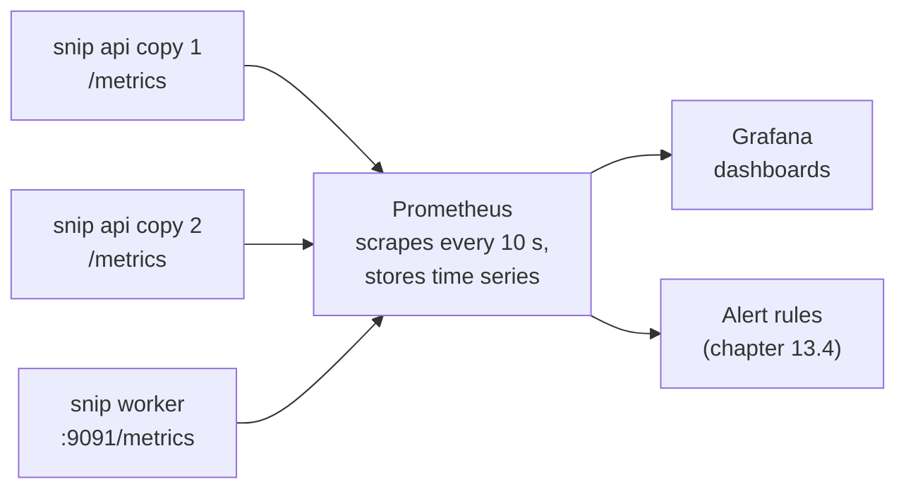

# 13.2 Metrics with Prometheus & Grafana

Logs record each event (chapter 13.1). **Metrics** record **numbers over time**: how many requests per second, what fraction failed, how long the slowest 1% took, how many clicks are waiting in the queue. A metric costs the same whether snip serves ten requests or ten million. It's just a counter going up, sampled every few seconds. That makes metrics the signal for **dashboards** ("how are we doing right now?") and **alerts** ("wake someone up if this crosses a line", chapter 13.4). This chapter covers the metric types, how **Prometheus** collects and stores them, how to ask questions in **PromQL**, which questions to ask (the RED and USE methods), and how **Grafana** turns the answers into dashboards. It's all run against snip's real metrics.

## What you'll learn

- The three metric types: **counters**, **gauges** and **histograms**.
- How **Prometheus** works: scraping, time series, labels, and the **cardinality** trap.
- **PromQL**: `rate`, `sum by`, ratios, and percentiles from histograms.
- What to measure: the **RED** method (services) and the **USE** method (resources).
- **Grafana** dashboards, provisioned as code.

---

## Three kinds of number

:::note[Everyday anchor]
A car's dashboard. The **odometer** only ever goes up: that's a **counter** (you learn your speed from how fast it rises). The **fuel gauge** goes up and down: a **gauge**. And if you recorded, for every journey, how long it took in buckets ("under 10 minutes, under 20, under 40…"), you'd have a **histogram**, from which you could say "90% of my commutes take under 25 minutes".
:::

| Type | Behaves like | snip's examples | Ask with |
|---|---|---|---|
| **Counter** | Only goes up (resets to 0 on restart) | `snip_http_requests_total`, `snip_redirects_total`, `snip_worker_clicks_processed_total` | `rate()`: per-second increase |
| **Gauge** | Goes up and down | `snip_worker_lag_events` (queue backlog), `go_memstats_heap_inuse_bytes` | Its value directly |
| **Histogram** | Counts observations into buckets | `snip_http_request_duration_seconds` | `histogram_quantile()` for percentiles |

snip defines them in `internal/metrics/metrics.go` with the Prometheus Go client:

```go
Requests: prometheus.NewCounterVec(prometheus.CounterOpts{
	Name: "snip_http_requests_total", Help: "HTTP requests handled.",
}, []string{"route", "method", "code"}),
RequestDuration: prometheus.NewHistogramVec(prometheus.HistogramOpts{
	Name:    "snip_http_request_duration_seconds",
	Help:    "Time to handle HTTP requests.",
	Buckets: []float64{.001, .0025, .005, .01, .025, .05, .1, .25, .5, 1, 2.5},
}, []string{"route"}),
```

The logging middleware (chapter 13.1) updates them for every request: one counter increment and one histogram observation, which costs nanoseconds.

A **histogram** doesn't store every duration. It counts how many observations fell at or under each **bucket** boundary (1 ms, 2.5 ms, 5 ms…). Percentiles (chapter 8.5) are then *estimated* from the bucket counts. That's why the buckets are chosen around the latencies you care about: snip's go from 1 ms to 2.5 s. Histograms can be added across copies, which averaged percentiles can't (chapter 8.5).

---

## How Prometheus works

**Prometheus** is the standard open-source metrics system. It **pulls**: every few seconds (snip's config: 10 s) it **scrapes** an HTTP endpoint on each target, `GET /metrics`, which returns every metric's current value as plain text:

```text
snip_http_requests_total{code="302",method="GET",route="GET /{slug}"} 600
snip_redirects_total{cache="hit"} 599
snip_redirects_total{cache="miss"} 1
```

That's real output after 600 redirects to one link: one cache miss (the first), 599 hits. Prometheus stores each scrape as a sample in a **time series**, one series per unique combination of metric name and **labels**.



Prometheus **discovers** targets rather than using a fixed list: snip's Compose config asks Docker's DNS for every copy of `api` and `worker` (chapter 9.3), and in Kubernetes it asks the API server for Pods. Copies that come and go are found automatically. The worker has its own small HTTP server on port 9091 just for this. (Until it did, the worker counted processed clicks and nobody could see the number, a gap found while writing this chapter.)

### Labels, and the cardinality trap

**Labels** (`route`, `method`, `code`) let you slice a metric: errors by route, requests by status. But **every distinct combination of label values is a separate time series**, stored and queried separately. The number of combinations is the metric's **cardinality**.

snip labels requests by `route` (`GET /{slug}`: a handful of values), **not** by `path` (`/mlink`, `/go`, `/abc123`…: one per link, unbounded). Labelling by path would create a new time series for every link ever visited. Millions of series slow Prometheus to a crawl and make metrics bills explode. The rule: **labels must have a small, bounded set of values.** User IDs, emails, request IDs, full URLs and error messages belong in logs and traces, never in metric labels.

---

## PromQL: asking questions

Prometheus's query language, **PromQL**, turns raw series into answers. These are real queries and outputs from a local snip after 600 redirects and some 404s:

**Requests per second, by route.** Counters only go up, so you ask how fast they rise, with `rate()` over a window. Then you `sum by` the labels you care about, adding up all copies:

```text
sum by (route) (rate(snip_http_requests_total[1m]))

{route="GET /{slug}"}    14.15
{route="GET /metrics"}    9.69
```

**Error ratio**: 5xx responses as a fraction of all. `=~` matches a regular expression:

```text
sum(rate(snip_http_requests_total{code=~"5.."}[5m]))
  / sum(rate(snip_http_requests_total[5m]))
```

**Latency percentiles** from the histogram. snip's p50 and p99 in that run were about 0.5 ms and 2.3 ms:

```text
histogram_quantile(0.99, sum by (le) (rate(snip_http_request_duration_seconds_bucket[5m])))
```

**Cache hit ratio**: redirects answered by Redis:

```text
sum(rate(snip_redirects_total{cache="hit"}[5m])) / sum(rate(snip_redirects_total[5m]))
```

:::info[If you've written code]
Two subtleties trip everyone up. First, `rate()` and `increase()` **extrapolate** to the edges of the window, so they return estimates. `sum(increase(snip_http_requests_total{code="302"}[5m]))` returned **691.7** in the run above, for exactly 600 redirects. Use them for trends and alerts, not for billing-grade counts. Second, **counter resets**: when a process restarts, its counters go back to zero, and `rate()` detects and handles that. So never do arithmetic on raw counter values; always `rate()` first, then `sum`.
:::

---

## What to measure: RED and USE

Two checklists cover most needs:

- **RED**, for every **service** (things that handle requests): **R**ate (requests per second), **E**rrors (failed requests per second, or the error ratio), **D**uration (latency percentiles). snip's first three dashboard panels are exactly these. They're what users feel.
- **USE**, for every **resource** (CPU, memory, disks, connection pools, queues): **U**tilisation (how busy), **S**aturation (how much is waiting), **E**rrors (chapter 8.5). snip's worker lag is a saturation metric for the click queue: if it keeps growing, the workers can't keep up.

Add a few **business metrics** (links created, redirects served, cache hit ratio), because "the system is healthy" and "the product is working" aren't the same question.

---

## Dashboards in Grafana

**Grafana** queries Prometheus (and many other sources) and draws panels. snip's Compose stack provisions it **as code**: a Prometheus datasource and a dashboard, both loaded from files at start-up. Nobody clicks anything together:

```text
snip/deploy/grafana/
├── provisioning/datasources/prometheus.yml   # "Prometheus is at http://prometheus:9090"
├── provisioning/dashboards/snip.yml          # "load dashboards from this folder"
└── dashboards/snip.json                      # the snip overview dashboard
```

The **snip overview** dashboard has six panels: requests per second by route, error ratio, p50/p99 latency, redirect cache hit ratio, worker throughput and backlog, and memory in use. Each panel is a PromQL query from this chapter, with a description saying why it's there.

Good dashboards follow a few habits: **RED at the top** (is it broken for users?), then resources and dependencies (why?); one dashboard per service with the same layout everywhere; units on every axis; and no panel nobody would act on. A dashboard with sixty panels is a place where signals hide.

:::warning[What can go wrong]
- **Averages instead of percentiles**: the mean latency hides the slow tail (chapter 8.5).
- **High-cardinality labels**: user IDs or URLs as labels, and Prometheus runs out of memory.
- **Graphing raw counters**: a line that only goes up tells you nothing. Use `rate()`.
- **No metrics from the components that fail**: snip's worker counted processed clicks without exposing the number anywhere until this chapter was written. Every process needs a `/metrics` endpoint, or an agent that reads its data.
- **Dashboards as the alerting system**: nobody watches dashboards at 3 a.m. Alerts (chapter 13.4) do.
:::

:::info[In the real world]
Prometheus's data model and PromQL are a de facto standard: Kubernetes components, databases (via exporters), load balancers and most infrastructure expose Prometheus metrics. At scale, teams add long-term storage and global querying (Thanos, Mimir, VictoriaMetrics), or use managed services (Amazon Managed Prometheus, Grafana Cloud, Google Cloud Managed Service for Prometheus). **OpenTelemetry** metrics can be exported in the same model, so instrumenting once works with any backend.
:::

---

## Lab

Free, on your computer with Docker, using snip's Compose stack (chapter 9.3). Every query below runs in snip's CI on every push.

1. **Start the stack with monitoring.**
   ```bash
   cd ~/code/zero-to-prod/snip
   docker compose --profile observability up -d --build --wait
   KEY=$(docker compose exec -T api snip keys create metrics-lab | grep -o 'snip_[A-Za-z0-9]*')
   curl -s -X POST localhost:8080/api/links -H "Authorization: Bearer $KEY" -d '{"url":"https://go.dev","slug":"mlink"}'
   for i in $(seq 1 300); do curl -s -o /dev/null localhost:8080/mlink; done
   for i in $(seq 1 30);  do curl -s -o /dev/null localhost:8080/nope;  done      # some 404s
   ```

2. **Read raw metrics** from one API copy, from inside the network (nginx blocks `/metrics` at the edge, chapter 8.3):
   ```bash
   docker run --rm --network snip_default alpine:3.22 wget -qO- api:8080/metrics | grep '^snip_'
   docker run --rm --network snip_default alpine:3.22 wget -qO- worker:9091/metrics | grep '^snip_worker'
   ```
   snip's own image has no `wget` (chapter 9.2), so this uses a throwaway Alpine container on the stack's network. You'll notice the API also exposes the worker's two metrics, as zeros: both processes register the same set, and plain counters and gauges are exported even when unused (labelled ones appear only once something is recorded). It's harmless, and a good reason for dashboard queries to filter by `job` when it matters.

3. **Query Prometheus.** Open [localhost:9090](http://localhost:9090), or use the API:
   ```bash
   q() { curl -s --data-urlencode "query=$1" localhost:9090/api/v1/query | jq -c '.data.result'; }
   q 'sum by (route) (rate(snip_http_requests_total[1m]))'
   q 'sum by (code) (increase(snip_http_requests_total[5m]))'
   q 'histogram_quantile(0.99, sum by (le) (rate(snip_http_request_duration_seconds_bucket[5m])))'
   q 'sum(rate(snip_redirects_total{cache="hit"}[5m])) / sum(rate(snip_redirects_total[5m]))'
   q 'sum(snip_worker_clicks_processed_total)'
   ```
   Compare the `increase` result for code 302 with the 300 redirects you sent. Why isn't it exactly 300? (Extrapolation.)

4. **Open the dashboard.** Browse to [localhost:3000](http://localhost:3000) → Dashboards → snip → **snip overview**. Run the redirect loop again and watch the panels move. Then stop Redis (`docker compose stop redis`), send some redirects, and watch the cache hit ratio: what happens, and why do redirects still work? (Hits drop to zero; snip falls back to Postgres, because a broken cache makes snip slower, not broken, chapter 6.7.) Start Redis again.

5. **Spot a cardinality bomb.** Which of these would be a safe label for `snip_http_requests_total`: `route`, `path`, `owner_id`, `code`? (`route` and `code`: small, fixed sets. `path` and `owner_id` grow without limit.)

## Self-check

<Quiz
  id="observability-metrics"
  questions={[
    {
      q: 'Which metric type should count HTTP requests?',
      options: ['A gauge', 'A counter, queried with rate() to get requests per second', 'A histogram', 'A log line'],
      answer: 1,
      explain: 'Counters only increase; rate() turns them into per-second throughput, handling restarts.',
    },
    {
      q: 'Why does snip label requests by route ("GET /{slug}") and not by path ("/mlink")?',
      options: [
        'Paths are secret',
        'Every distinct label value creates a new time series; paths are unbounded (one per link), routes are a small fixed set',
        'Prometheus can’t store slashes',
        'Routes are shorter',
      ],
      answer: 1,
      explain: 'Cardinality is the main way to break a metrics system. Unbounded values belong in logs and traces.',
    },
    {
      q: 'How do you get p99 latency from snip’s metrics?',
      options: [
        'Average the durations',
        'histogram_quantile(0.99, sum by (le) (rate(snip_http_request_duration_seconds_bucket[5m])))',
        'max(snip_http_request_duration_seconds)',
        'Read it from the logs',
      ],
      answer: 1,
      explain: 'Histograms store bucket counts; percentiles are estimated from them, and can be summed across copies first.',
    },
    {
      q: 'What does the RED method measure for a service?',
      options: [
        'Redis, Envoy, Docker',
        'Rate, Errors, Duration: what users experience',
        'RAM, Energy, Disk',
        'Retries, Errors, Deploys',
      ],
      answer: 1,
      explain: 'USE (Utilisation, Saturation, Errors) is its partner for resources like CPUs, pools and queues.',
    },
    {
      q: 'increase(counter[5m]) returned 691.7 for exactly 600 requests. Why?',
      options: [
        'A bug in snip',
        'rate and increase extrapolate to the window boundaries, giving estimates; fine for trends and alerts, not exact counts',
        'Some requests were counted twice',
        'Prometheus lost data',
      ],
      answer: 1,
      explain: 'Prometheus samples every few seconds and estimates what happened between the first and last sample and the window edges.',
    },
    {
      q: 'Why is Grafana’s snip dashboard stored as JSON files in the repository?',
      options: [
        'Grafana can’t save dashboards',
        'Dashboards as code: versioned, reviewed, and recreated identically in every environment, instead of hand-made and lost',
        'JSON is faster',
        'It’s required by Prometheus',
      ],
      answer: 1,
      explain: 'The same reasoning as infrastructure as code (chapter 12.5).',
    },
  ]}
/>

<details>
<summary>Design metrics for a new "link preview" feature that fetches pages from the web. What would you add?</summary>

- A **counter** `snip_preview_fetches_total{result="ok|timeout|error|blocked"}`: rate and error ratio (RED). `result` is a small, fixed set, never the URL or domain.
- A **histogram** `snip_preview_fetch_duration_seconds` with buckets from ~50 ms to ~10 s (web pages are much slower than snip's own requests).
- A **gauge** `snip_preview_queue_lag_events` if fetches go through a queue (saturation, USE).
- A **counter** for SSRF refusals (`result="blocked"` above) as a security signal (chapter 7.5).
- Dashboard: fetch rate, error ratio by result, p99 duration, queue lag. Alert candidates: error ratio sustained high, lag growing for 15 minutes (chapter 13.4).
- Not metrics: the URL and domain of each failure. Those go in logs and traces.

</details>

<details>
<summary>Prometheus's memory use doubled after a deploy. What's the likely cause and how do you confirm it?</summary>

Almost always a **cardinality explosion**: a new label with unbounded values (a user ID, a URL, an error message, a request ID) on a busy metric. To confirm: Prometheus's own status page (**Status → TSDB status**) lists the metric names and label names with the most series, and a query like `topk(10, count by (__name__) ({__name__=~".+"}))` shows which metrics have the most series. Compare with before the deploy. Fix the code to remove or bound the label (e.g. map URLs to a route pattern), and add a review habit: every new label must have a known, small set of values.

</details>
